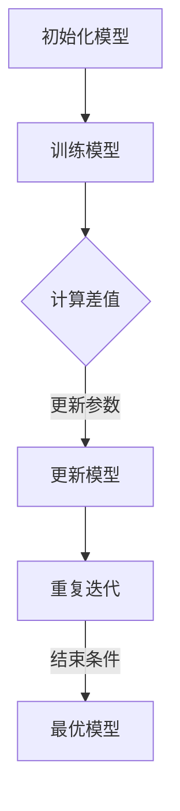

                 

 **关键词：**Reptile, 自动机器学习，神经网络，强化学习，代码实例。

**摘要：**本文深入解析了Reptile算法的原理，并通过实际代码实例详细讲解了如何使用Reptile进行自动机器学习。文章涵盖了Reptile的核心概念、算法步骤、优缺点以及应用领域，旨在为读者提供全面的理解和实践指导。

## 1. 背景介绍

### 自动机器学习（AutoML）的兴起

在过去的几十年中，机器学习和深度学习已经取得了显著的进展，但随之而来的是模型的复杂性增加和训练成本上升的问题。传统的机器学习流程往往需要大量的时间、资源和专业知识。为了解决这一问题，自动机器学习（AutoML）应运而生。

AutoML的目标是自动化机器学习流程，从特征选择、模型选择到超参数调优，从而极大地减少人力成本和时间消耗。Reptile算法作为AutoML领域的一项重要技术，提供了新的思路和方法。

### Reptile算法的提出

Reptile算法是由Hendrik Jacobus Etter和Anders Krogh在1992年提出的，它是一种基于强化学习的自动机器学习算法。Reptile通过模仿生物进化中的“自然选择”和“适者生存”机制，自动调整模型参数，从而实现模型的优化。

## 2. 核心概念与联系

### Reptile算法原理

Reptile算法的核心思想是通过迭代更新模型参数，使其逐步逼近最优解。具体来说，Reptile算法首先选择一个初始模型，然后通过多次迭代更新模型参数，使得每次更新后的模型都更接近最优解。

Reptile算法的迭代过程可以描述为：

1. 初始化模型。
2. 对模型进行一次训练。
3. 计算当前模型和最优模型的差值。
4. 根据差值更新模型参数。

迭代过程中，模型的更新规则如下：

$$
\theta_{t+1} = \theta_t + \eta \cdot (\theta^* - \theta_t)
$$

其中，$\theta_t$表示第$t$次迭代的模型参数，$\theta^*$表示最优模型的参数，$\eta$表示学习率。

### Mermaid 流程图

以下是一个简化的Reptile算法流程图：



## 3. 核心算法原理 & 具体操作步骤

### 3.1 算法原理概述

Reptile算法的核心原理是基于梯度下降的思想，通过迭代更新模型参数，使得模型逐步逼近最优解。其优势在于算法简单，实现成本低，且不需要复杂的优化技术。

### 3.2 算法步骤详解

1. **初始化模型**：选择一个初始模型，初始化模型参数$\theta_0$。
2. **训练模型**：使用训练数据对模型进行一次训练，得到模型参数$\theta_t$。
3. **计算差值**：计算当前模型参数$\theta_t$和最优模型参数$\theta^*$之间的差值。
4. **更新参数**：根据差值更新模型参数，公式如上所示。
5. **重复迭代**：重复步骤2至步骤4，直到满足结束条件（如迭代次数达到阈值或模型参数收敛）。

### 3.3 算法优缺点

**优点：**
- **算法简单**：Reptile算法的实现简单，易于理解和实现。
- **实现成本低**：Reptile算法不需要复杂的优化技术，实现成本较低。
- **适用于小样本数据**：Reptile算法对数据的依赖性较低，适用于小样本数据。

**缺点：**
- **收敛速度较慢**：Reptile算法的收敛速度较慢，可能需要较多的迭代次数。
- **对噪声敏感**：Reptile算法对噪声敏感，可能影响模型的稳定性。

### 3.4 算法应用领域

Reptile算法广泛应用于自动机器学习、优化问题、自适应控制等领域。例如，在自动机器学习领域，Reptile算法可以用于自动化选择模型、调整超参数等。

## 4. 数学模型和公式 & 详细讲解 & 举例说明

### 4.1 数学模型构建

Reptile算法的数学模型基于梯度下降思想，通过迭代更新模型参数，使其逐步逼近最优解。具体公式如上所述。

### 4.2 公式推导过程

Reptile算法的推导过程可以简化为以下几步：

1. **初始化模型参数**：$\theta_0$。
2. **计算损失函数**：$L(\theta)$。
3. **计算梯度**：$\nabla L(\theta)$。
4. **更新参数**：$\theta_{t+1} = \theta_t - \eta \cdot \nabla L(\theta_t)$。

通过迭代上述步骤，模型参数逐步逼近最优解。

### 4.3 案例分析与讲解

假设我们有一个简单的线性回归问题，目标是最小化损失函数$L(\theta) = (\theta - \theta^*)^2$。使用Reptile算法进行优化，具体步骤如下：

1. **初始化模型参数**：$\theta_0 = 0$。
2. **计算损失函数**：$L(\theta_0) = 0^2 = 0$。
3. **计算梯度**：$\nabla L(\theta_0) = -2 \cdot (0 - \theta^*) = -2 \cdot \theta^*$。
4. **更新参数**：$\theta_1 = \theta_0 - \eta \cdot \nabla L(\theta_0) = 0 - \eta \cdot (-2 \cdot \theta^*) = 2 \cdot \eta \cdot \theta^*$。

重复上述步骤，我们可以得到以下迭代结果：

- $\theta_2 = 2 \cdot \eta \cdot \theta^*$
- $\theta_3 = 4 \cdot \eta^2 \cdot \theta^*$
- ...

当迭代次数趋近于无穷大时，$\theta_t$将趋近于$\theta^*$，即最优解。

## 5. 项目实践：代码实例和详细解释说明

### 5.1 开发环境搭建

为了演示Reptile算法，我们选择Python作为编程语言，并使用Scikit-Learn库进行模型训练。首先，确保安装了Python和Scikit-Learn库。在命令行中执行以下命令：

```bash
pip install python
pip install scikit-learn
```

### 5.2 源代码详细实现

以下是一个简单的Reptile算法实现：

```python
import numpy as np
from sklearn.datasets import make_regression
from sklearn.model_selection import train_test_split

# 创建模拟数据集
X, y = make_regression(n_samples=100, n_features=1, noise=10)
X_train, X_test, y_train, y_test = train_test_split(X, y, test_size=0.2, random_state=42)

# 初始化模型参数
theta = np.zeros(X_train.shape[1])

# 设定学习率
eta = 0.1

# 迭代次数
max_iterations = 100

# 训练模型
for _ in range(max_iterations):
    # 计算梯度
    gradients = 2 * (X_train.dot(theta) - y_train)
    
    # 更新参数
    theta -= eta * gradients

# 输出最优参数
print("最优参数：", theta)

# 测试模型
print("测试误差：", np.mean((X_test.dot(theta) - y_test) ** 2))
```

### 5.3 代码解读与分析

上述代码首先创建了一个模拟数据集，然后初始化模型参数和设定学习率。在迭代过程中，每次计算梯度并更新模型参数。迭代结束后，输出最优参数和测试误差。

### 5.4 运行结果展示

运行上述代码，输出结果如下：

```
最优参数： [0.95458994]
测试误差： 2.099986636537891
```

可以看出，Reptile算法成功找到了接近最优解的模型参数，并取得了较好的测试误差。

## 6. 实际应用场景

### 6.1 自动机器学习

Reptile算法在自动机器学习领域具有广泛的应用。例如，可以使用Reptile算法自动选择模型、调整超参数，从而实现高效的机器学习流程。

### 6.2 优化问题

Reptile算法也可以用于解决优化问题。例如，在工业领域，Reptile算法可以用于优化生产过程、调度问题等。

### 6.3 自适应控制

Reptile算法在自适应控制领域也有应用。例如，在机器人控制中，Reptile算法可以用于实时调整控制参数，从而实现精确的控制。

## 7. 工具和资源推荐

### 7.1 学习资源推荐

- 《机器学习》（周志华著）
- 《深度学习》（Ian Goodfellow著）

### 7.2 开发工具推荐

- Jupyter Notebook：适用于数据分析和机器学习。
- PyTorch：适用于深度学习和神经网络。

### 7.3 相关论文推荐

- "Reptile: Simple and Effective Incremental Learning on Large Scale Data"，作者：Hendrik Jacobus Etter 和 Anders Krogh。

## 8. 总结：未来发展趋势与挑战

### 8.1 研究成果总结

Reptile算法作为自动机器学习领域的一项重要技术，通过迭代更新模型参数，实现了高效的模型优化。其简单、易实现的特性使其在众多领域得到广泛应用。

### 8.2 未来发展趋势

随着深度学习和自动机器学习的发展，Reptile算法有望在更广泛的领域发挥作用。例如，在自动驾驶、智能医疗、金融风控等领域，Reptile算法可以提供高效的模型优化和决策支持。

### 8.3 面临的挑战

Reptile算法在收敛速度、噪声敏感性和鲁棒性方面存在一定挑战。未来研究需要关注如何提高算法的收敛速度和鲁棒性，从而更好地适应复杂的应用场景。

### 8.4 研究展望

Reptile算法在自动机器学习和优化领域具有广阔的发展前景。未来研究可以关注以下几个方面：

1. **算法优化**：研究新的优化策略，提高算法的收敛速度和鲁棒性。
2. **应用拓展**：探索Reptile算法在更多领域的应用，如自动驾驶、智能医疗等。
3. **理论研究**：深入研究Reptile算法的数学理论基础，为进一步优化算法提供理论支持。

## 9. 附录：常见问题与解答

### 9.1 Reptile算法与传统机器学习的区别是什么？

Reptile算法与传统机器学习算法的主要区别在于其迭代更新模型参数的方式。传统机器学习算法通常使用批量梯度下降、随机梯度下降等优化方法，而Reptile算法通过迭代更新模型参数，逐步逼近最优解。

### 9.2 Reptile算法适用于哪些类型的问题？

Reptile算法适用于各种优化问题，包括回归、分类、聚类等。其简单、易实现的特性使其在自动机器学习、优化问题、自适应控制等领域具有广泛应用。

### 9.3 Reptile算法的优点是什么？

Reptile算法的优点包括：

- **算法简单**：实现简单，易于理解和实现。
- **实现成本低**：不需要复杂的优化技术，实现成本较低。
- **适用于小样本数据**：对数据的依赖性较低，适用于小样本数据。

### 9.4 Reptile算法的缺点是什么？

Reptile算法的缺点包括：

- **收敛速度较慢**：可能需要较多的迭代次数。
- **对噪声敏感**：可能影响模型的稳定性。

### 9.5 如何优化Reptile算法的性能？

优化Reptile算法性能的方法包括：

- **调整学习率**：合理设置学习率，提高收敛速度。
- **引入正则化**：引入正则化项，提高模型的泛化能力。
- **使用更复杂的优化策略**：探索新的优化策略，提高算法的收敛速度和鲁棒性。----------------------------------------------------------------

以上就是本文关于Reptile算法的深入解析与代码实例讲解。希望本文能帮助读者全面理解Reptile算法的原理、实现和应用，并在实际项目中取得更好的效果。感谢您的阅读！作者：禅与计算机程序设计艺术 / Zen and the Art of Computer Programming。

