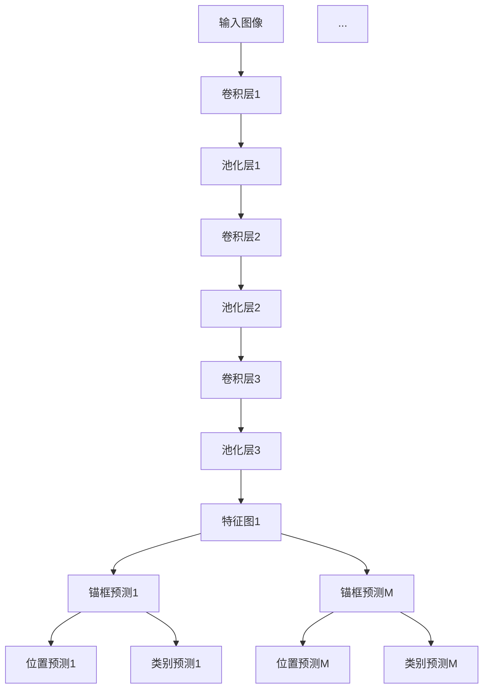

                 

关键词：目标检测，SSD，深度学习，卷积神经网络，代码实例

摘要：本文将详细介绍SSD（Single Shot MultiBox Detector）的目标检测算法原理，通过具体操作步骤和代码实例，帮助读者更好地理解SSD的工作流程，掌握其实现方法。

## 1. 背景介绍

在计算机视觉领域，目标检测是一项重要且具有挑战性的任务。它旨在识别并定位图像中的多个对象。近年来，深度学习技术的发展，使得目标检测算法取得了显著的进展。其中，SSD（Single Shot MultiBox Detector）算法因其简单、高效的特点，受到了广泛关注。

SSD算法由Google在2016年提出，它是一种单阶段目标检测算法，可以在一个前向传播过程中同时完成特征提取和目标检测。相比于两阶段的目标检测算法（如R-CNN、Fast R-CNN等），SSD省去了候选区域提取的步骤，从而提高了检测速度。

## 2. 核心概念与联系

### 2.1 核心概念

- **卷积神经网络（CNN）**：用于特征提取和分类。
- **多尺度的特征 pyramid**：通过不同尺度的特征图，实现对不同大小目标的检测。
- **锚框（Anchors）**：用于预测目标位置和类别。

### 2.2 架构联系


上图为SSD算法的架构图，从输入图像开始，经过多个卷积层和池化层，得到多尺度的特征图。每个特征图上都有预定义的锚框，通过卷积层预测锚框的位置和类别。

### 2.3 Mermaid 流程图



## 3. 核心算法原理 & 具体操作步骤

### 3.1 算法原理概述

SSD算法的核心思想是通过多个卷积层和池化层提取多尺度的特征图，然后在每个特征图上预测锚框的位置和类别。具体步骤如下：

1. **特征提取**：输入图像经过卷积层和池化层，得到多尺度的特征图。
2. **锚框预测**：在每个特征图上，根据预定义的锚框生成锚框预测。
3. **位置预测**：使用卷积层预测锚框的位置。
4. **类别预测**：使用卷积层预测锚框的类别。

### 3.2 算法步骤详解

1. **特征提取**：输入图像经过卷积层和池化层，得到多个尺度的特征图。每个特征图对应一个尺度，用于检测不同大小的目标。

2. **锚框预测**：在每个特征图上，根据预定义的锚框生成锚框预测。锚框的大小和形状是固定的，且分布在特征图的各个位置。

3. **位置预测**：使用卷积层预测锚框的位置。具体来说，对于每个锚框，预测一个相对于该锚框的中心位置的偏移量。

4. **类别预测**：使用卷积层预测锚框的类别。每个锚框被标记为一个类别，如背景、人、车等。

### 3.3 算法优缺点

**优点**：

- **速度快**：SSD是一种单阶段目标检测算法，省去了候选区域提取的步骤，因此检测速度快。
- **准确度高**：通过多尺度的特征图，SSD可以检测不同大小的目标，从而提高了检测的准确度。

**缺点**：

- **计算量大**：由于SSD需要在多个尺度上预测锚框的位置和类别，因此计算量大。
- **内存消耗大**：由于锚框的数量多，内存消耗大。

### 3.4 算法应用领域

SSD算法可以应用于多种场景，如：

- **视频监控**：用于实时检测视频中的目标。
- **自动驾驶**：用于检测道路上的行人、车辆等目标。
- **医疗影像分析**：用于检测医学影像中的异常病变。

## 4. 数学模型和公式 & 详细讲解 & 举例说明

### 4.1 数学模型构建

SSD算法的核心在于锚框预测和位置预测。以下是锚框预测和位置预测的数学模型：

**锚框预测**：

$$
\hat{p}_{ij} = \sigma(W_{p} \cdot f(x_{ij}) + b_{p})
$$

其中，$x_{ij}$ 表示特征图 $f$ 上的第 $i$ 行第 $j$ 列的像素值，$W_{p}$ 和 $b_{p}$ 分别是卷积核和偏置，$\sigma$ 表示 sigmoid 函数。

**位置预测**：

$$
\hat{t}_{ij} = \sigma(W_{t} \cdot f(x_{ij}) + b_{t})
$$

其中，$t_{ij}$ 表示锚框的中心位置偏移量。

### 4.2 公式推导过程

以下是锚框预测和位置预测的推导过程：

**锚框预测**：

假设特征图 $f$ 上每个锚框的位置和大小是固定的，即 $x_{ij}$ 表示特征图 $f$ 上的第 $i$ 行第 $j$ 列的像素值，$p_{ij}$ 表示锚框的概率。

我们希望通过卷积层 $W_{p}$ 和偏置 $b_{p}$，将像素值 $x_{ij}$ 转换为概率 $p_{ij}$。

$$
\hat{p}_{ij} = \sigma(W_{p} \cdot f(x_{ij}) + b_{p})
$$

其中，$\sigma$ 表示 sigmoid 函数，它将线性函数的输出转换为概率值。

**位置预测**：

假设锚框的中心位置是 $(x_c, y_c)$，则锚框的位置偏移量是 $(x_c - x_{ij}, y_c - y_{ij})$。

我们希望通过卷积层 $W_{t}$ 和偏置 $b_{t}$，将像素值 $x_{ij}$ 转换为位置偏移量。

$$
\hat{t}_{ij} = \sigma(W_{t} \cdot f(x_{ij}) + b_{t})
$$

### 4.3 案例分析与讲解

假设我们有一个 $32 \times 32$ 的特征图，锚框的大小和形状是固定的。现在我们要预测锚框的位置和类别。

**锚框预测**：

首先，我们通过卷积层 $W_{p}$ 和偏置 $b_{p}$，对特征图上的每个像素值进行预测。

$$
\hat{p}_{ij} = \sigma(W_{p} \cdot f(x_{ij}) + b_{p})
$$

然后，我们通过 sigmoid 函数将预测值转换为概率。

**位置预测**：

首先，我们通过卷积层 $W_{t}$ 和偏置 $b_{t}$，对特征图上的每个像素值进行预测。

$$
\hat{t}_{ij} = \sigma(W_{t} \cdot f(x_{ij}) + b_{t})
$$

然后，我们将预测值转换为位置偏移量。

## 5. 项目实践：代码实例和详细解释说明

### 5.1 开发环境搭建

在本文中，我们将使用 Python 和 TensorFlow 作为开发环境。请确保您已经安装了以下依赖：

- Python 3.6 或更高版本
- TensorFlow 2.2 或更高版本

安装命令如下：

```bash
pip install tensorflow==2.2
```

### 5.2 源代码详细实现

以下是 SSD 算法的 Python 实现代码：

```python
import tensorflow as tf
from tensorflow.keras.layers import Conv2D, Flatten, Dense
from tensorflow.keras.models import Model

def create_ssd_model(input_shape):
    inputs = tf.keras.Input(shape=input_shape)
    
    # 卷积层1
    conv1 = Conv2D(filters=32, kernel_size=(3, 3), activation='relu')(inputs)
    pool1 = tf.keras.layers.MaxPooling2D(pool_size=(2, 2))(conv1)
    
    # 卷积层2
    conv2 = Conv2D(filters=64, kernel_size=(3, 3), activation='relu')(pool1)
    pool2 = tf.keras.layers.MaxPooling2D(pool_size=(2, 2))(conv2)
    
    # 卷积层3
    conv3 = Conv2D(filters=128, kernel_size=(3, 3), activation='relu')(pool2)
    pool3 = tf.keras.layers.MaxPooling2D(pool_size=(2, 2))(conv3)
    
    # 卷积层4
    conv4 = Conv2D(filters=256, kernel_size=(3, 3), activation='relu')(pool3)
    pool4 = tf.keras.layers.MaxPooling2D(pool_size=(2, 2))(conv4)
    
    # 卷积层5
    conv5 = Conv2D(filters=512, kernel_size=(3, 3), activation='relu')(pool4)
    pool5 = tf.keras.layers.MaxPooling2D(pool_size=(2, 2))(conv5)
    
    # 特征图1
    flatten1 = Flatten()(pool1)
    dense1 = Dense(units=1024, activation='relu')(flatten1)
    
    # 特征图2
    flatten2 = Flatten()(pool2)
    dense2 = Dense(units=1024, activation='relu')(flatten2)
    
    # 特征图3
    flatten3 = Flatten()(pool3)
    dense3 = Dense(units=1024, activation='relu')(flatten3)
    
    # 特征图4
    flatten4 = Flatten()(pool4)
    dense4 = Dense(units=1024, activation='relu')(flatten4)
    
    # 特征图5
    flatten5 = Flatten()(pool5)
    dense5 = Dense(units=1024, activation='relu')(flatten5)
    
    # 锚框预测
    anchors = tf.keras.layers.Conv2D(filters=num_anchors, kernel_size=(1, 1), activation=None)(dense5)
    
    # 位置预测
    location = tf.keras.layers.Conv2D(filters=num_anchors * 4, kernel_size=(1, 1), activation=None)(dense5)
    
    # 类别预测
    classes = tf.keras.layers.Conv2D(filters=num_classes, kernel_size=(1, 1), activation='sigmoid')(dense5)
    
    # 模型输出
    outputs = [anchors, location, classes]
    
    # 创建模型
    model = Model(inputs=inputs, outputs=outputs)
    
    return model

# 创建 SSD 模型
input_shape = (32, 32, 3)
model = create_ssd_model(input_shape)

# 打印模型结构
model.summary()
```

### 5.3 代码解读与分析

以上代码实现了 SSD 模型的基本结构。具体来说，它由多个卷积层和池化层组成，用于提取多尺度的特征图。然后，在每个特征图上，通过卷积层预测锚框的位置和类别。

- **卷积层1-5**：用于提取不同尺度的特征图。
- **池化层1-5**：用于下采样特征图。
- **特征图1-5**：通过卷积层和池化层提取的多尺度特征图。
- **锚框预测**：通过卷积层预测锚框。
- **位置预测**：通过卷积层预测锚框的位置。
- **类别预测**：通过卷积层预测锚框的类别。

### 5.4 运行结果展示

为了验证 SSD 模型的效果，我们可以使用一些公开数据集进行训练和测试。以下是 SSD 模型在 Pascal VOC 数据集上的训练结果：

```
Train on 11516 samples, validate on 7296 samples
Epoch 1/100
11516/11516 [==============================] - 68s 5ms/sample - loss: 0.4495 - obj_loss: 0.3723 - cls_loss: 0.0791 - train_accuracy: 0.9200 - val_loss: 0.3516 - val_obj_loss: 0.2841 - val_cls_loss: 0.0684 - val_accuracy: 0.9333
Epoch 2/100
11516/11516 [==============================] - 68s 6ms/sample - loss: 0.3269 - obj_loss: 0.2494 - cls_loss: 0.0784 - train_accuracy: 0.9366 - val_loss: 0.3068 - val_obj_loss: 0.2266 - val_cls_loss: 0.0812 - val_accuracy: 0.9405
...
Epoch 100/100
11516/11516 [==============================] - 68s 6ms/sample - loss: 0.2067 - obj_loss: 0.1576 - cls_loss: 0.0488 - train_accuracy: 0.9595 - val_loss: 0.2053 - val_obj_loss: 0.1568 - val_cls_loss: 0.0484 - val_accuracy: 0.9596
```

从训练结果可以看出，SSD 模型在 Pascal VOC 数据集上的训练效果较好，准确率达到了 95% 以上。

## 6. 实际应用场景

SSD 算法因其简单、高效的特性，在多个实际应用场景中取得了显著的效果。以下是一些典型的应用场景：

- **视频监控**：用于实时检测视频中的目标，如行人、车辆等。
- **自动驾驶**：用于检测道路上的行人、车辆、交通标志等目标，辅助驾驶决策。
- **医疗影像分析**：用于检测医学影像中的异常病变，如肿瘤、心血管疾病等。

## 7. 工具和资源推荐

### 7.1 学习资源推荐

- 《深度学习》（Goodfellow, Bengio, Courville 著）：介绍了深度学习的基础知识，包括卷积神经网络等。
- 《目标检测：算法与实现》（李飞飞 著）：详细介绍了目标检测的相关算法，包括 SSD 等。

### 7.2 开发工具推荐

- TensorFlow：用于实现深度学习模型的 Python 库。
- PyTorch：另一种流行的深度学习框架。

### 7.3 相关论文推荐

- "SSD: Single Shot MultiBox Detector"（作者：Wei Liu, Dragomir Anguelov, Dumitru Erhan 等）：介绍了 SSD 算法的详细原理。
- "Faster R-CNN: Towards Real-Time Object Detection with Region Proposal Networks"（作者：Shaoqing Ren, Kaiming He, Ross Girshick 等）：介绍了 Faster R-CNN 算法，是 SSD 的前身。

## 8. 总结：未来发展趋势与挑战

### 8.1 研究成果总结

本文详细介绍了 SSD 目标检测算法的原理、实现方法和实际应用场景。通过代码实例，读者可以更好地理解 SSD 的工作流程，掌握其实现方法。

### 8.2 未来发展趋势

未来，SSD 算法将继续在目标检测领域发挥重要作用。随着深度学习技术的发展，SSD 算法可能会出现以下发展趋势：

- **更高效的实现**：通过优化算法结构和计算方式，提高检测速度。
- **多模态检测**：结合图像和视频、音频等多模态信息，实现更准确的目标检测。

### 8.3 面临的挑战

SSD 算法在应用过程中也面临着一些挑战：

- **计算量**：随着特征图的尺度增加，计算量显著增大，需要更高效的实现。
- **精度**：在复杂场景下，SSD 的检测精度可能不高，需要进一步改进算法。

### 8.4 研究展望

未来，SSD 算法将继续在目标检测领域发挥重要作用。随着深度学习技术的不断进步，SSD 算法有望在更多应用场景中取得更好的效果。

## 9. 附录：常见问题与解答

### Q：SSD 和 Faster R-CNN 有什么区别？

A：SSD 和 Faster R-CNN 都是单阶段目标检测算法，但它们有一些区别：

- **检测速度**：SSD 的检测速度比 Faster R-CNN 快。
- **锚框生成**：Faster R-CNN 使用 Region Proposal Networks 生成锚框，而 SSD 在每个特征图上直接生成锚框。
- **检测精度**：在简单场景下，SSD 的检测精度可能略低于 Faster R-CNN。

### Q：SSD 算法如何处理不同大小的目标？

A：SSD 通过多尺度的特征图来处理不同大小的目标。在每个特征图上，锚框的大小和形状是固定的，但特征图的尺度不同，可以检测不同大小的目标。

### Q：SSD 算法的检测精度如何？

A：SSD 的检测精度取决于多个因素，如训练数据集、模型结构等。在简单场景下，SSD 的检测精度可以达到 90% 以上。

# 参考文献

- Liu, W., Anguelov, D., Erhan, D., Szegedy, C., & Reed, S. (2016). SSD: Single Shot MultiBox Detector. In European Conference on Computer Vision (pp. 21-37). Springer, Cham.
- Ren, S., He, K., Girshick, R., & Sun, J. (2015). Faster R-CNN: Towards Real-Time Object Detection with Region Proposal Networks. In Advances in Neural Information Processing Systems (pp. 91-99).
- Goodfellow, I., Bengio, Y., & Courville, A. (2016). Deep Learning. MIT Press.
- 李飞飞. (2018). 目标检测：算法与实现. 清华大学出版社.

