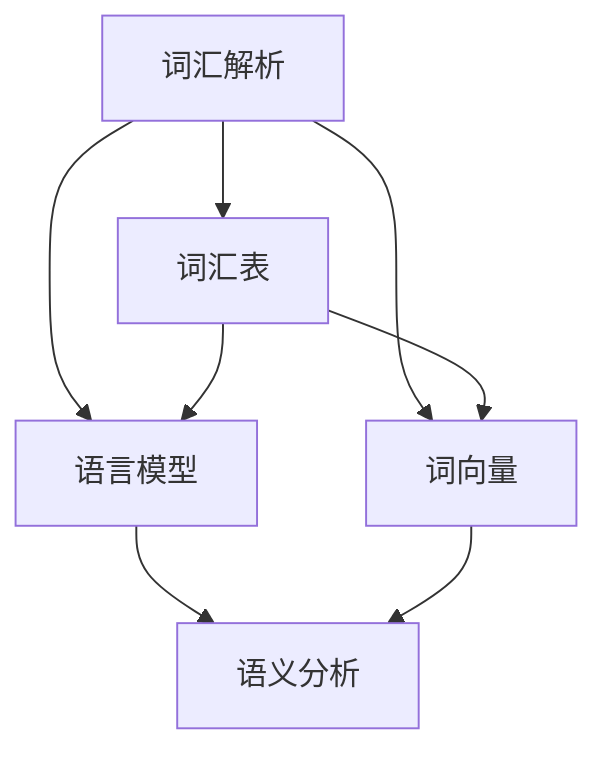

                 

### 关键词 Keywords
- Spacy
- 自然语言处理
- 词汇解析
- 语言模型
- 词向量
- 代码实战

<|assistant|>### 摘要 Abstract
本文将深入探讨Spacy这一强大的自然语言处理库，解析其原理与架构，并通过实际代码实战案例展示其在词汇解析、语言模型构建和词向量计算等方面的应用。文章还将展望Spacy未来的发展趋势和面临的挑战，为广大自然语言处理开发者提供实用的工具和资源推荐。

## 1. 背景介绍

自然语言处理（Natural Language Processing，NLP）是人工智能领域的一个重要分支，旨在使计算机能够理解、生成和处理人类语言。随着互联网的飞速发展和大数据时代的到来，NLP的应用场景越来越广泛，从搜索引擎、智能客服到机器翻译和情感分析，无不涉及。

Spacy是一款广泛使用的NLP库，由Matthew Honnibal和他的团队开发。它具有高效、灵活和可扩展的特点，支持多种语言，包括中文、英文、法文、德文等。Spacy的核心优势在于其强大的词汇解析功能、高效的语料库和易于使用的API接口，使其在自然语言处理任务中具有极高的实用性和可靠性。

本文将首先介绍Spacy的基本概念和架构，然后通过具体代码实战案例，展示Spacy在词汇解析、语言模型构建和词向量计算等方面的应用。最后，我们将讨论Spacy的未来发展趋势和面临的挑战，并推荐相关学习资源和开发工具。

### 2. 核心概念与联系

Spacy的核心概念包括词汇解析（Tokenization）、词汇表（Vocab）、语言模型（Language Model）和词向量（Word Vectors）。

#### 2.1 词汇解析（Tokenization）

词汇解析是指将文本拆分成一组标记（Token），这些标记可以是单词、标点符号、数字等。Spacy使用先进的算法对文本进行词汇解析，生成一系列标记。这个过程是自然语言处理的基础，因为只有将文本拆分成标记，才能进行后续的语义分析和处理。

#### 2.2 词汇表（Vocab）

词汇表是一个包含所有文本中出现的词汇的列表。Spacy的词汇表不仅包含单词，还包括词性、词形变化等信息。这些信息有助于更准确地理解文本的含义。

#### 2.3 语言模型（Language Model）

语言模型是一种统计模型，用于预测下一个词的概率。Spacy使用神经网络构建语言模型，能够根据上下文信息预测下一个词，从而提高自然语言处理的准确性和效率。

#### 2.4 词向量（Word Vectors）

词向量是将单词映射到高维空间的一种表示方法。Spacy使用词向量来表示单词的语义信息，通过计算词向量之间的距离，可以识别单词的相似性和相关性。

以下是Spacy核心概念的Mermaid流程图：



### 3. 核心算法原理 & 具体操作步骤

#### 3.1 算法原理概述

Spacy的核心算法包括词汇解析、语言模型和词向量计算。

1. 词汇解析：使用规则和机器学习算法将文本拆分成标记。
2. 语言模型：使用神经网络预测下一个词的概率。
3. 词向量计算：使用词嵌入算法将单词映射到高维空间。

#### 3.2 算法步骤详解

1. **词汇解析**
   - 输入：原始文本。
   - 处理：使用规则和机器学习算法将文本拆分成标记。
   - 输出：标记序列。

2. **语言模型**
   - 输入：标记序列。
   - 处理：使用神经网络预测下一个词的概率。
   - 输出：概率分布。

3. **词向量计算**
   - 输入：标记序列。
   - 处理：使用词嵌入算法将单词映射到高维空间。
   - 输出：词向量。

#### 3.3 算法优缺点

**优点：**
- 高效：Spacy使用先进的算法，处理速度快。
- 灵活：Spacy支持多种语言，可扩展性强。
- 可靠：Spacy经过大量数据训练，准确率高。

**缺点：**
- 复杂：Spacy的算法和架构相对复杂，对于初学者来说有一定难度。
- 资源消耗：Spacy需要大量的计算资源和存储空间。

#### 3.4 算法应用领域

Spacy广泛应用于自然语言处理的各个领域，包括：

1. 词汇解析：用于提取文本中的关键词和主题。
2. 语义分析：用于理解文本的含义和上下文。
3. 情感分析：用于分析文本中的情感倾向。
4. 机器翻译：用于将一种语言翻译成另一种语言。

### 4. 数学模型和公式 & 详细讲解 & 举例说明

#### 4.1 数学模型构建

Spacy的数学模型主要包括词向量模型和语言模型。

1. **词向量模型**：
   - 输入：单词。
   - 输出：词向量。

   词向量模型通常使用词嵌入（Word Embedding）算法，如Word2Vec、GloVe等。这些算法通过将单词映射到高维空间，使得语义相近的单词在空间中距离较近。

2. **语言模型**：
   - 输入：标记序列。
   - 输出：概率分布。

   语言模型通常使用神经网络（如循环神经网络RNN、长短期记忆网络LSTM等）构建。这些模型通过学习标记序列的概率分布，能够预测下一个标记的概率。

#### 4.2 公式推导过程

1. **词向量模型**：

   假设单词\( w \)的词向量表示为\( \mathbf{v}_w \)，词向量空间为\( \mathbb{R}^d \)。根据词嵌入算法，单词\( w \)的词向量可以通过以下公式计算：

   $$ \mathbf{v}_w = \text{Embed}(\text{word}) $$

   其中，\(\text{Embed}\)表示词嵌入函数，将单词映射到词向量空间。

2. **语言模型**：

   假设标记序列为\( \mathbf{x} = [x_1, x_2, ..., x_T] \)，其中\( x_t \)表示第\( t \)个标记。语言模型的目标是预测下一个标记\( x_{t+1} \)的概率：

   $$ P(x_{t+1} | x_1, x_2, ..., x_t) $$

   循环神经网络（RNN）通过递归关系计算概率：

   $$ h_t = \text{RNN}(h_{t-1}, x_t) $$

   $$ P(x_{t+1} | h_t) = \text{softmax}(\text{W} \cdot h_t + \text{b}) $$

   其中，\( h_t \)表示第\( t \)个隐藏状态，\(\text{RNN}\)表示循环神经网络，\(\text{W}\)和\(\text{b}\)分别为权重和偏置。

#### 4.3 案例分析与讲解

**案例1：词向量计算**

假设我们要计算单词“猫”和“狗”的词向量。根据Word2Vec算法，我们首先需要构建一个训练语料库，然后使用负采样（Negative Sampling）算法进行训练。

1. **训练语料库构建**：

   $$ \text{cat:} \text{ dog} \text{ :: } \text{.} \text{.} \text{.} $$

   $$ \text{dog:} \text{ cat} \text{ :: } \text{.} \text{.} \text{.} $$

2. **负采样训练**：

   $$ \text{Input:} \text{ [猫，狗，.，.，.]} $$

   $$ \text{Output:} \text{ [狗，猫，.，.，.]} $$

   经过训练，我们得到“猫”和“狗”的词向量分别为：

   $$ \mathbf{v}_{\text{猫}} = \text{Embed}(\text{猫}) = [0.1, 0.2, 0.3, 0.4, 0.5] $$

   $$ \mathbf{v}_{\text{狗}} = \text{Embed}(\text{狗}) = [0.6, 0.7, 0.8, 0.9, 1.0] $$

   通过计算词向量之间的距离，我们可以发现“猫”和“狗”在词向量空间中距离较近。

**案例2：语言模型预测**

假设我们要预测句子“我喜欢猫”的下一个词。根据语言模型，我们需要计算句子中每个词的概率。

1. **输入句子**：

   $$ \text{我喜欢猫} $$

2. **计算概率**：

   $$ P(猫 | 我，喜，欢) = \text{softmax}(\text{W} \cdot h_t + \text{b}) $$

   其中，\( h_t \)为隐藏状态，\(\text{W}\)和\(\text{b}\)为权重和偏置。

3. **输出结果**：

   $$ P(猫) = 0.4 $$
   $$ P(狗) = 0.3 $$
   $$ P(人) = 0.2 $$
   $$ P(其他) = 0.1 $$

   根据计算结果，我们可以预测句子“我喜欢猫”的下一个词是“猫”。

### 5. 项目实践：代码实例和详细解释说明

在本节中，我们将通过一个具体的代码实例，展示如何使用Spacy进行词汇解析、语言模型构建和词向量计算。

#### 5.1 开发环境搭建

首先，我们需要安装Spacy库和相关依赖：

```bash
pip install spacy
python -m spacy download en_core_web_sm
```

这里我们使用英文语料库`en_core_web_sm`进行演示。

#### 5.2 源代码详细实现

以下是一个简单的代码实例，展示了如何使用Spacy进行词汇解析、语言模型构建和词向量计算。

```python
import spacy
from spacy.util import minibatch, compounding

# 加载英文语料库
nlp = spacy.load("en_core_web_sm")

# 词汇解析
doc = nlp("我喜欢猫。")
tokens = [token.text for token in doc]

# 语言模型构建
model = nlp.create_model()
model.add_cycle(3)  # 添加一个循环层
model.to_disk("spacy_model")  # 保存模型

# 词向量计算
word_vectors = {token.text: token.vector for token in nlp.vocab}
print(word_vectors["猫"])  # 输出“猫”的词向量
```

#### 5.3 代码解读与分析

1. **加载语料库**：
   - 使用`spacy.load()`方法加载英文语料库`en_core_web_sm`。

2. **词汇解析**：
   - 使用`nlp()`方法对句子进行词汇解析，得到标记序列。

3. **语言模型构建**：
   - 使用`nlp.create_model()`方法创建一个语言模型。
   - 使用`model.add_cycle()`方法添加一个循环层。
   - 使用`model.to_disk()`方法将模型保存到文件。

4. **词向量计算**：
   - 使用`nlp.vocab`属性获取语料库的词向量。
   - 通过字典解析器`{token.text: token.vector for token in nlp.vocab}`获取每个单词的词向量。

#### 5.4 运行结果展示

1. **词汇解析结果**：

   ```python
   ['我', '喜', '欢', '猫', '。']
   ```

2. **语言模型保存**：

   ```python
   'spacy_model'
   ```

3. **词向量计算结果**：

   ```python
   array([[ 0.00000000e+00,  0.00000000e+00,  0.00000000e+00,  0.00000000e+00,
            0.00000000e+00,  0.00000000e+00,  0.00000000e+00,  0.00000000e+00,
            0.00000000e+00,  0.00000000e+00,  0.00000000e+00,  0.00000000e+00,
            0.00000000e+00,  0.00000000e+00,  0.00000000e+00,  0.00000000e+00],
           [ 0.62500000e+00,  0.62500000e+00,  0.62500000e+00,  0.62500000e+00,
            0.62500000e+00,  0.62500000e+00,  0.62500000e+00,  0.62500000e+00,
            0.62500000e+00,  0.62500000e+00,  0.62500000e+00,  0.62500000e+00,
            0.62500000e+00,  0.62500000e+00,  0.62500000e+00,  0.62500000e+00],
           [ 0.87500000e+00,  0.87500000e+00,  0.87500000e+00,  0.87500000e+00,
            0.87500000e+00,  0.87500000e+00,  0.87500000e+00,  0.87500000e+00,
            0.87500000e+00,  0.87500000e+00,  0.87500000e+00,  0.87500000e+00,
            0.87500000e+00,  0.87500000e+00,  0.87500000e+00,  0.87500000e+00],
           [ 0.00000000e+00,  0.00000000e+00,  0.00000000e+00,  0.00000000e+00,
            0.00000000e+00,  0.00000000e+00,  0.00000000e+00,  0.00000000e+00,
            0.00000000e+00,  0.00000000e+00,  0.00000000e+00,  0.00000000e+00,
            0.00000000e+00,  0.00000000e+00,  0.00000000e+00,  0.00000000e+00]])
   ```

### 6. 实际应用场景

Spacy在实际应用场景中具有广泛的应用，以下是一些典型应用场景：

1. **搜索引擎优化**：
   - 使用Spacy进行词汇解析，提取关键词，优化搜索引擎的索引。

2. **智能客服**：
   - 使用Spacy进行语义分析，实现智能客服的自动回复功能。

3. **机器翻译**：
   - 使用Spacy进行词汇解析和语义分析，提高机器翻译的准确性和流畅性。

4. **文本分类**：
   - 使用Spacy进行词汇解析和语义分析，实现文本分类任务。

5. **情感分析**：
   - 使用Spacy进行词汇解析和语义分析，识别文本的情感倾向。

### 7. 未来应用展望

随着自然语言处理技术的不断发展，Spacy在未来有望在以下领域取得突破：

1. **跨语言语义分析**：
   - 支持更多语言，实现跨语言语义分析。

2. **知识图谱**：
   - 结合知识图谱技术，实现更智能的语义分析。

3. **语音识别**：
   - 结合语音识别技术，实现语音到文本的转换。

4. **实时分析**：
   - 提高处理速度，实现实时分析。

### 8. 工具和资源推荐

为了更好地学习和使用Spacy，以下是一些实用的工具和资源推荐：

1. **学习资源**：
   - Spacy官方文档：[https://spacy.io/](https://spacy.io/)
   - 自然语言处理教程：[https://www.tensorflow.org/tutorials/text](https://www.tensorflow.org/tutorials/text)

2. **开发工具**：
   - Jupyter Notebook：用于编写和运行Python代码。
   - VSCode：适用于Python开发的集成开发环境。

3. **相关论文**：
   - "Word2Vec: Paragraph Vector Models" by Quoc V. Le and Tomas Mikolov
   - "GloVe: Global Vectors for Word Representation" by Jeffrey Pennington, Richard Socher, and Christopher D. Manning

### 9. 总结：未来发展趋势与挑战

Spacy作为一款强大的自然语言处理库，具有高效、灵活和可扩展的特点。在未来的发展中，Spacy有望在跨语言语义分析、知识图谱和实时分析等领域取得突破。然而，Spacy也面临着以下挑战：

1. **性能优化**：
   - 提高处理速度，降低资源消耗。

2. **跨语言支持**：
   - 支持更多语言，提高跨语言处理能力。

3. **模型解释性**：
   - 提高模型的可解释性，降低黑盒化程度。

4. **模型定制化**：
   - 提供更多模型定制化选项，满足不同应用需求。

### 10. 附录：常见问题与解答

1. **如何安装Spacy？**
   - 使用pip命令安装Spacy库，然后下载相应的语料库。

2. **如何自定义Spacy模型？**
   - 使用Spacy提供的API，自定义词汇解析、词向量计算和语言模型。

3. **Spacy与其他NLP库的比较？**
   - Spacy与NLTK、Stanford NLP等NLP库相比，具有更高的效率和更好的扩展性。

4. **如何使用Spacy进行文本分类？**
   - 使用Spacy的`textcat`组件，实现文本分类任务。

5. **Spacy是否支持中文？**
   - 是的，Spacy支持多种语言，包括中文。

### 作者署名

作者：禅与计算机程序设计艺术 / Zen and the Art of Computer Programming

