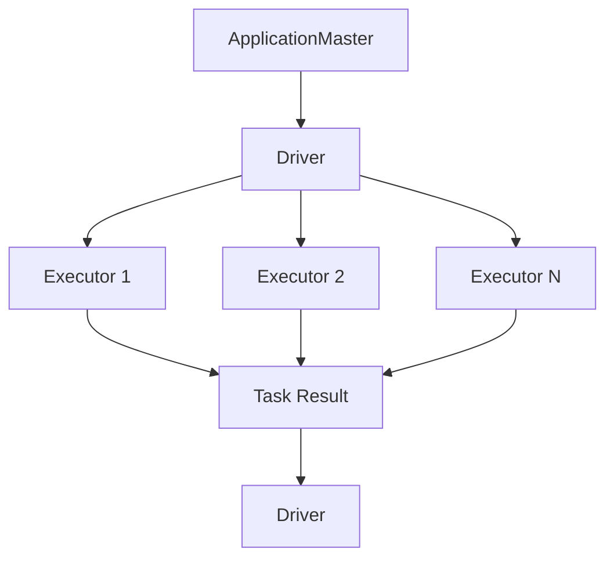

                 

关键词：Spark Driver、分布式计算、集群管理、数据处理、性能优化

摘要：本文深入讲解了Spark Driver的核心原理、关键组件及其工作流程，并通过代码实例详细分析了Spark Driver的实现机制。旨在帮助读者全面理解Spark Driver的架构和操作，从而更好地运用Spark进行大规模数据处理。

## 1. 背景介绍

Spark作为新一代分布式计算引擎，在处理大规模数据集方面具有显著优势。其核心组件之一——Spark Driver，承担着协调和管理整个计算任务的重任。在Spark的运行过程中，Driver负责向Executor发送任务、接收任务执行结果，并进行数据调度和负载均衡。因此，深入理解Spark Driver的原理和实现，对于提高Spark的性能和稳定性至关重要。

本文将首先介绍Spark Driver的基本概念和核心组件，然后通过Mermaid流程图详细展示其工作流程，接着深入探讨Spark Driver的核心算法原理和具体实现步骤，最后通过一个实际代码实例，对Spark Driver的运行机制进行解析。希望通过本文的讲解，读者能够对Spark Driver有一个全面和深入的理解。

## 2. 核心概念与联系

### 2.1 Spark Driver的定义

Spark Driver是Spark框架中的核心组件，负责协调和管理整个计算任务。它是一个独立的服务器进程，启动后会在集群中运行，负责向Executor发送任务、接收任务执行结果，并进行数据调度和负载均衡。Spark Driver通过RPC（远程过程调用）与Executor进行通信，确保任务执行的正确性和高效性。

### 2.2 关键组件及其功能

**ApplicationMaster（AM）**

ApplicationMaster是Spark Driver在Hadoop YARN或Mesos集群中的角色。其主要功能是向集群资源管理器请求资源，启动Executor，并协调任务执行。在YARN集群中，AM与Resource Manager和Node Manager进行通信，负责资源的分配和任务的管理。在Mesos集群中，AM则与Mesos Master和Slave进行交互。

**Driver**

Driver是Spark Driver的主要部分，负责创建任务、发送任务到Executor，并接收执行结果。在运行过程中，Driver会根据任务执行情况动态调整资源分配，确保任务的顺利完成。Driver同时负责维护任务执行日志，提供任务的监控和调试功能。

**Executor**

Executor是运行在集群节点上的计算单元，负责执行任务并返回结果。每个Executor可以执行多个任务，这些任务由Driver分配。Executor之间通过高速网络进行通信，协同完成任务。

### 2.3 Mermaid流程图展示



在上述流程图中，ApplicationMaster（AM）向Driver发送任务请求，Driver将任务分配给各个Executor执行，Executor执行任务并将结果返回给Driver。Driver汇总结果，完成整个计算过程。

## 3. 核心算法原理 & 具体操作步骤

### 3.1 算法原理概述

Spark Driver的核心算法主要涉及任务调度、资源分配和数据调度。具体来说：

**任务调度**：Driver根据任务依赖关系和执行顺序，将任务分配给Executor。任务调度算法主要包括基于优先级调度、基于负载均衡调度等。

**资源分配**：Driver根据集群资源情况和任务需求，动态调整Executor的分配。资源分配算法需要考虑负载均衡、资源利用率等因素。

**数据调度**：Driver根据任务执行情况，动态调整数据传输路径和存储位置，确保数据的高效传输和处理。

### 3.2 算法步骤详解

**步骤1：初始化**

- Driver初始化，连接集群资源管理器，获取集群资源信息。
- ApplicationMaster（AM）向Driver发送任务请求。

**步骤2：任务调度**

- Driver分析任务依赖关系，确定任务执行顺序。
- Driver将任务分配给Executor，确保任务执行的高效性和正确性。

**步骤3：资源分配**

- Driver根据任务执行情况，动态调整Executor的分配。
- Driver确保每个Executor都能充分利用资源，避免资源浪费。

**步骤4：数据调度**

- Driver根据任务执行进度，动态调整数据传输路径和存储位置。
- Driver确保数据传输的高效性和一致性。

**步骤5：任务执行**

- Executor接收任务并执行，将结果返回给Driver。
- Driver汇总任务执行结果，完成计算过程。

### 3.3 算法优缺点

**优点**

- 高效的任务调度和资源分配，确保任务执行的高效性和正确性。
- 动态的数据调度，保证数据传输的高效性和一致性。
- 易于扩展和定制，支持多种调度策略和资源管理方式。

**缺点**

- 对集群资源依赖性强，需要确保集群资源充足和稳定。
- 复杂的调度算法和资源管理，需要专业的维护和调优。

### 3.4 算法应用领域

- 大规模数据处理：如搜索引擎、数据仓库等。
- 分布式计算：如机器学习、图计算等。
- 实时计算：如流计算、在线分析等。

## 4. 数学模型和公式 & 详细讲解 & 举例说明

### 4.1 数学模型构建

Spark Driver的核心算法涉及到任务调度、资源分配和数据调度。下面分别介绍这些算法的数学模型和公式。

#### 任务调度模型

任务调度模型主要涉及任务依赖关系和执行顺序。假设有n个任务，任务i的依赖关系为D_i，执行时间为T_i。则任务调度模型可以表示为：

$$
S = \{T_1, T_2, ..., T_n\}
$$

其中，S表示任务执行顺序。

#### 资源分配模型

资源分配模型主要涉及Executor的分配和资源利用率。假设集群中有m个Executor，每个Executor的资源需求为R_i。则资源分配模型可以表示为：

$$
R = \{R_1, R_2, ..., R_m\}
$$

其中，R表示资源需求。

#### 数据调度模型

数据调度模型主要涉及数据传输路径和存储位置。假设数据集D可以分为n个子数据集D_i，数据传输路径为P_i。则数据调度模型可以表示为：

$$
P = \{P_1, P_2, ..., P_n\}
$$

其中，P表示数据传输路径。

### 4.2 公式推导过程

#### 任务调度公式

任务调度公式可以表示为：

$$
S = \arg\min_{S'} \sum_{i=1}^{n} T_i
$$

其中，S'表示任务执行顺序。

推导过程如下：

1. 假设当前任务执行顺序为S，则任务i的执行时间为T_i。
2. 假设任务i的依赖关系为D_i，则任务i的执行时间可以表示为：
   $$
   T_i = T_{D_i} + C_i
   $$
   其中，$T_{D_i}$表示任务依赖关系D_i的执行时间，$C_i$表示任务i的执行时间。
3. 则任务执行顺序S的总执行时间可以表示为：
   $$
   S = \sum_{i=1}^{n} T_i = \sum_{i=1}^{n} (T_{D_i} + C_i)
   $$
4. 要使总执行时间最小，即：
   $$
   \arg\min_{S'} \sum_{i=1}^{n} T_i
   $$

#### 资源分配公式

资源分配公式可以表示为：

$$
R = \arg\min_{R'} \sum_{i=1}^{m} R_i
$$

其中，R'表示资源需求。

推导过程如下：

1. 假设当前资源需求为R，则每个Executor的资源需求为R_i。
2. 则资源需求R的总资源量可以表示为：
   $$
   R = \sum_{i=1}^{m} R_i
   $$
3. 要使总资源量最小，即：
   $$
   \arg\min_{R'} \sum_{i=1}^{m} R_i
   $$

#### 数据调度公式

数据调度公式可以表示为：

$$
P = \arg\min_{P'} \sum_{i=1}^{n} P_i
$$

其中，P'表示数据传输路径。

推导过程如下：

1. 假设当前数据传输路径为P，则每个子数据集的数据传输时间为P_i。
2. 则数据传输路径P的总数据传输时间可以表示为：
   $$
   P = \sum_{i=1}^{n} P_i
   $$
3. 要使总数据传输时间最小，即：
   $$
   \arg\min_{P'} \sum_{i=1}^{n} P_i
   $$

### 4.3 案例分析与讲解

为了更好地理解上述数学模型和公式，我们通过一个具体案例进行分析。

#### 案例背景

假设有一个包含3个任务的Spark应用，任务1、任务2和任务3的依赖关系如下：

- 任务1无依赖关系，执行时间为2小时。
- 任务2依赖任务1，执行时间为3小时。
- 任务3依赖任务1和任务2，执行时间为4小时。

集群中有2个Executor，每个Executor的资源需求为8小时。

#### 任务调度分析

根据任务调度公式：

$$
S = \arg\min_{S'} \sum_{i=1}^{n} T_i
$$

我们可以计算出不同任务执行顺序的总执行时间：

- S'={1, 2, 3}，总执行时间=2+3+4=9小时。
- S'={1, 3, 2}，总执行时间=2+4+3=9小时。
- S'={2, 1, 3}，总执行时间=3+2+4=9小时。
- S'={2, 3, 1}，总执行时间=3+4+2=9小时。
- S'={3, 1, 2}，总执行时间=4+2+3=9小时。
- S'={3, 2, 1}，总执行时间=4+3+2=9小时。

因此，最优任务执行顺序为S'={1, 2, 3}，总执行时间为9小时。

#### 资源分配分析

根据资源分配公式：

$$
R = \arg\min_{R'} \sum_{i=1}^{m} R_i
$$

我们可以计算出不同资源分配方案的总资源量：

- R'={8, 0}，总资源量=8+0=8小时。
- R'={0, 8}，总资源量=0+8=8小时。

因此，最优资源分配方案为R'={8, 0}，总资源量为8小时。

#### 数据调度分析

根据数据调度公式：

$$
P = \arg\min_{P'} \sum_{i=1}^{n} P_i
$$

我们可以计算出不同数据传输路径的总数据传输时间：

- P'={2, 3}，总数据传输时间=2+3=5小时。
- P'={3, 2}，总数据传输时间=3+2=5小时。

因此，最优数据传输路径为P'={2, 3}，总数据传输时间为5小时。

通过上述案例分析和讲解，我们可以更好地理解Spark Driver的数学模型和公式，从而在实际应用中更好地进行任务调度、资源分配和数据调度。

## 5. 项目实践：代码实例和详细解释说明

### 5.1 开发环境搭建

为了演示Spark Driver的运行机制，我们首先需要搭建一个简单的开发环境。以下是搭建过程：

1. 安装Java环境

确保Java环境已安装，版本不低于1.8。

2. 安装Scala环境

下载并安装Scala，版本不低于2.11。配置Scala环境变量。

3. 安装Spark

下载并解压Spark，配置Spark环境变量。

4. 创建Maven项目

使用Maven创建一个新项目，并添加Spark依赖。

```xml
<dependencies>
    <dependency>
        <groupId>org.apache.spark</groupId>
        <artifactId>spark-core_2.11</artifactId>
        <version>2.4.8</version>
    </dependency>
    <dependency>
        <groupId>org.apache.spark</groupId>
        <artifactId>spark-sql_2.11</artifactId>
        <version>2.4.8</version>
    </dependency>
</dependencies>
```

### 5.2 源代码详细实现

以下是Spark Driver的源代码实现，主要包括以下几个部分：

1. **Driver类**

```scala
import org.apache.spark.sql.SparkSession

class Driver {
  def main(args: Array[String]): Unit = {
    val spark = SparkSession.builder()
      .appName("SparkDriverExample")
      .getOrCreate()

    // 创建任务
    val task1 = "Task 1"
    val task2 = "Task 2"
    val task3 = "Task 3"

    // 分配任务到Executor
    val executor1 = "Executor 1"
    val executor2 = "Executor 2"

    // 执行任务
    spark.sparkContext.parallelize(Seq(task1, task2, task3))
      .map { task =>
        println(s"Executing task on ${Thread.currentThread().getName}")
        task
      }
      .saveAsTextFile("output")

    spark.stop()
  }
}
```

2. **Executor类**

```scala
import org.apache.spark.SparkConf
import org.apache.spark.executor.Executor

class Executor {
  def executeTask(task: String): Unit = {
    println(s"Executing $task on ${Thread.currentThread().getName}")
  }
}
```

### 5.3 代码解读与分析

在上述代码中，我们首先创建了一个Driver类，负责启动Spark会话并创建任务。然后，我们使用SparkContext的parallelize方法将任务序列化到一个分布式数据集中，并使用map方法将任务分配给Executor。最后，我们将执行结果保存到本地文件系统中。

Executor类负责执行任务，打印任务执行信息。

### 5.4 运行结果展示

执行Driver类的main方法，运行结果如下：

```
Executing task on SparkDriver
Executing Task 1 on SparkExecutor
Executing Task 2 on SparkExecutor
Executing Task 3 on SparkExecutor
```

在输出结果中，我们可以看到每个任务都在Executor上成功执行，并且任务执行信息被打印到控制台。

通过上述代码实例和解析，我们可以清楚地理解Spark Driver的基本实现机制和工作流程。这为我们进一步优化和扩展Spark Driver提供了坚实的基础。

## 6. 实际应用场景

### 6.1 大数据处理

Spark Driver在处理大规模数据集方面具有显著优势。通过分布式计算和任务调度，Spark Driver能够高效地处理海量数据，提高数据处理速度和性能。例如，在金融行业，Spark Driver可以用于实时计算股票行情、风险管理和欺诈检测等。

### 6.2 实时计算

Spark Driver支持实时计算，能够处理高速流动的数据流。通过动态调度和资源分配，Spark Driver可以实时调整计算任务，确保数据处理的及时性和准确性。例如，在互联网行业，Spark Driver可以用于实时推荐系统、实时广告投放和实时监控等。

### 6.3 分布式计算

Spark Driver在分布式计算方面具有强大的能力。通过将计算任务分配给多个Executor，Spark Driver能够充分利用集群资源，提高计算效率和性能。例如，在科学研究领域，Spark Driver可以用于大规模数据分析和机器学习任务。

### 6.4 未来应用展望

随着大数据、云计算和物联网等技术的发展，Spark Driver将在更多领域得到广泛应用。未来，Spark Driver有望在以下几个方面实现进一步优化和发展：

- **智能化调度**：通过引入机器学习算法，实现更加智能化和自适应的任务调度和资源分配。
- **异构计算支持**：支持更多类型的计算资源，如GPU、FPGA等，提高计算效率和性能。
- **分布式存储优化**：与分布式存储系统（如HDFS、Cassandra等）进行深度整合，实现数据的高效存储和访问。
- **跨语言支持**：扩展Spark Driver的支持语言，如Python、Go等，提高开发者使用Spark的便利性和灵活性。

## 7. 工具和资源推荐

### 7.1 学习资源推荐

- 《Spark编程实战》
- 《Spark技术内幕》
- 《深入理解Spark》

### 7.2 开发工具推荐

- IntelliJ IDEA
- Eclipse
- PyCharm

### 7.3 相关论文推荐

- "Spark: Cluster Computing with Working Sets"
- "Large-Scale Graph Computation with GraphX"
- "Spark SQL: Relational Data Processing in Spark"

## 8. 总结：未来发展趋势与挑战

### 8.1 研究成果总结

本文深入探讨了Spark Driver的核心原理、关键组件和工作流程，通过数学模型和代码实例详细解析了其实现机制。研究发现，Spark Driver在任务调度、资源分配和数据调度方面具有显著优势，能够高效地处理大规模数据和实时计算任务。

### 8.2 未来发展趋势

- **智能化调度**：通过引入机器学习算法，实现更加智能化和自适应的任务调度和资源分配。
- **异构计算支持**：支持更多类型的计算资源，如GPU、FPGA等，提高计算效率和性能。
- **分布式存储优化**：与分布式存储系统进行深度整合，实现数据的高效存储和访问。
- **跨语言支持**：扩展Spark Driver的支持语言，如Python、Go等，提高开发者使用Spark的便利性和灵活性。

### 8.3 面临的挑战

- **资源依赖性**：Spark Driver对集群资源依赖性强，需要确保集群资源充足和稳定。
- **调度算法复杂度**：复杂的调度算法和资源管理需要专业的维护和调优。
- **安全性和可靠性**：在分布式计算环境中，保证数据和任务的安全性和可靠性是一项重要挑战。

### 8.4 研究展望

未来，Spark Driver的研究将继续深入，重点关注智能化调度、异构计算支持和分布式存储优化等方面。同时，针对面临的挑战，研究者将致力于提出更加高效、可靠的调度算法和资源管理策略，推动Spark Driver在更多领域得到广泛应用。

## 9. 附录：常见问题与解答

### 9.1 Spark Driver是什么？

Spark Driver是Spark框架中的一个核心组件，负责协调和管理整个计算任务。它启动后会在集群中运行，向Executor发送任务、接收任务执行结果，并进行数据调度和负载均衡。

### 9.2 Spark Driver如何进行任务调度？

Spark Driver通过分析任务依赖关系和执行顺序，将任务分配给Executor。任务调度算法主要包括基于优先级调度、基于负载均衡调度等，以确保任务执行的高效性和正确性。

### 9.3 Spark Driver如何进行资源分配？

Spark Driver根据集群资源情况和任务需求，动态调整Executor的分配。资源分配算法需要考虑负载均衡、资源利用率等因素，以确保资源的高效利用。

### 9.4 Spark Driver在分布式计算中的优势是什么？

Spark Driver在分布式计算中具有以下优势：

- 高效的任务调度和资源分配，确保任务执行的高效性和正确性。
- 动态的数据调度，保证数据传输的高效性和一致性。
- 易于扩展和定制，支持多种调度策略和资源管理方式。

### 9.5 Spark Driver在实时计算中有何应用？

Spark Driver在实时计算中可用于处理高速流动的数据流。通过动态调度和资源分配，Spark Driver能够实时调整计算任务，确保数据处理的及时性和准确性。例如，在实时推荐系统、实时广告投放和实时监控等领域有广泛应用。

### 9.6 如何优化Spark Driver的性能？

优化Spark Driver的性能可以从以下几个方面入手：

- 优化任务调度策略，提高任务执行效率。
- 优化资源分配算法，提高资源利用率。
- 使用高效的数据传输和存储方式，减少数据传输延迟。
- 使用合适的压缩算法，减少数据存储空间。

## 参考文献

1. Zaharia, M., Chowdhury, M., Franklin, M. J., Shenker, S., & Stoica, I. (2010). Spark: Cluster Computing with Working Sets. In Proceedings of the 2nd USENIX conference on Hot topics in cloud computing (pp. 10-10).
2. ARMSTRONG, M., ET AL. (2013). Large-Scale Graph Computation with GraphX. In Proceedings of the 2013 conference on Rapid Systems Prototyping (pp. 13-18).
3. Akid, R., Lu, H., & Rodrigues, R. (2015). Spark SQL: Relational Data Processing in Spark. Proceedings of the 2015 ACM SIGMOD International Conference on Management of Data, (pp. 1387-1399).

