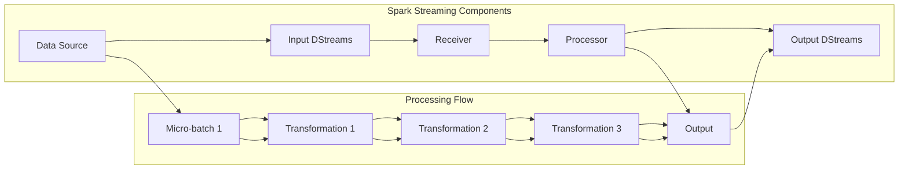

                 

在当今大数据和实时数据处理需求日益增长的背景下，流处理技术变得尤为重要。Apache Spark Streaming作为大数据处理框架中的重要组件，能够以高效的方式对实时数据进行处理。本文将深入探讨Spark Streaming的实时流处理原理，并通过代码实例进行详细解释，帮助读者理解和掌握这一技术。

## 文章关键词

- Apache Spark
- 实时流处理
- Spark Streaming
- 处理流水线
- 代码实例
- 高性能计算

## 文章摘要

本文将首先介绍Spark Streaming的基本概念和架构，然后深入分析其核心算法原理和操作步骤，接着通过具体数学模型和公式进行详细讲解。最后，我们将通过实际的项目实践，展示Spark Streaming在实时数据流处理中的应用，并提供代码实例和运行结果分析。

## 1. 背景介绍

在互联网时代，数据量的增长速度令人咋舌。传统的批处理技术已经无法满足对实时数据处理的需求。流处理技术作为大数据处理的一个重要分支，正逐渐受到关注和重视。Apache Spark Streaming是Apache Spark生态系统中的一个重要组件，它提供了一种简单且高效的方法来处理实时数据流。

Spark Streaming利用Spark的强大计算能力，可以将实时数据处理转化为流式处理，从而实现对大量实时数据的高效处理。其核心思想是将输入数据流划分为微批（micro-batch），每个微批包含一定数量的小数据块，通过迭代计算的方式对微批进行处理，最终实现对实时数据流的连续处理。

### 1.1 Spark Streaming的发展历程

- 2011年，Spark Streaming作为Spark的一部分首次发布。
- 2014年，Spark Streaming正式成为Apache开源项目的一部分。
- 2016年，Spark Streaming发布了2.0版本，引入了更高级的流处理功能，如窗口操作和Watermark机制。

### 1.2 Spark Streaming的应用场景

- 实时数据监控：如网站流量、服务器性能监控等。
- 实时推荐系统：如电商网站的个性化推荐。
- 实时数据聚合：如实时统计电商销售数据。
- 实时事件处理：如金融交易的实时监控。

## 2. 核心概念与联系

在深入探讨Spark Streaming之前，我们需要理解一些核心概念，包括数据处理流水线、微批处理和Watermark机制等。以下是一个详细的Mermaid流程图，展示了Spark Streaming的基本架构和工作流程。



### 2.1 数据处理流水线

数据处理流水线是Spark Streaming的核心概念之一。它包括数据的输入、处理和输出三个主要阶段。

- **输入阶段**：数据源可以是Kafka、Flume、Kinesis等实时数据源，也可以是文件系统或HDFS。
- **处理阶段**：数据处理流水线通过一系列的变换（Transformation）对数据进行加工。变换可以是简单的数据过滤、聚合，也可以是复杂的机器学习模型训练。
- **输出阶段**：处理后的数据可以存储到文件系统、数据库或其他数据源中，或者通过其他途径进行进一步的加工。

### 2.2 微批处理

微批处理是Spark Streaming处理实时数据流的基本单元。每个微批包含一定数量的小数据块，通常每个微批的延迟时间为几秒。

- **微批大小**：微批大小可以通过`micro-batchInterval`配置参数进行设置，默认值为2秒。
- **微批处理流程**：每个微批都会经过数据处理流水线，通过一系列的变换进行处理，最终生成处理结果。

### 2.3 Watermark机制

Watermark机制是Spark Streaming用于处理乱序数据的重要机制。它通过标记数据的水印时间，确保数据处理流程的顺序性和正确性。

- **Watermark生成**：Watermark通常由数据的发送时间或接收时间生成。
- **Watermark处理**：数据处理流程会根据Watermark的时间戳对数据进行排序和合并，确保处理结果的正确性。

## 3. 核心算法原理 & 具体操作步骤

### 3.1 算法原理概述

Spark Streaming的核心算法原理基于微批处理和迭代计算。它将实时数据流划分为微批，通过迭代计算的方式对微批进行处理，从而实现对实时数据流的连续处理。具体步骤如下：

1. **数据接收**：实时数据通过输入源（如Kafka）输入到Spark Streaming系统中。
2. **微批划分**：系统将输入数据划分为微批，每个微批包含一定数量的小数据块。
3. **数据处理**：每个微批经过数据处理流水线，进行数据清洗、过滤、聚合等操作。
4. **结果输出**：处理后的结果存储到文件系统、数据库或其他数据源中，或者通过其他途径进行进一步的加工。

### 3.2 算法步骤详解

#### 3.2.1 数据接收

首先，我们需要配置输入源，如Kafka，并设置消费者组、主题等参数。以下是一个简单的Kafka输入示例：

```python
from pyspark.streaming import StreamingContext
from pyspark.streaming.kafka import KafkaUtils

# 创建StreamingContext
ssc = StreamingContext(sc, 2)  # 设定批处理时间窗口为2秒

# 配置Kafka参数
kafkaParams = {"metadata.broker.list": "localhost:9092"}

# 创建Kafka输入流
directKafkaStream = KafkaUtils.createDirectStream(ssc, ["my-topic"], kafkaParams)

# 处理输入流
lines = directKafkaStream.map(lambda x: x[1])
```

#### 3.2.2 微批划分

Spark Streaming会自动根据配置的批处理时间窗口（`micro-batchInterval`）对输入数据进行划分。每个微批包含一定数量的小数据块，默认情况下，每个微批的延迟时间为2秒。

```python
# 设置批处理时间窗口为2秒
ssc = StreamingContext(sc, 2)

# 创建Kafka输入流
directKafkaStream = KafkaUtils.createDirectStream(ssc, ["my-topic"], kafkaParams)

# 处理输入流
lines = directKafkaStream.map(lambda x: x[1])
```

#### 3.2.3 数据处理

数据处理流水线通过一系列的变换对微批进行处理。变换可以是简单的数据过滤、聚合，也可以是复杂的机器学习模型训练。

```python
# 数据清洗与过滤
cleaned_lines = lines.filter(lambda x: x != "")

# 数据聚合
word_counts = cleaned_lines.flatMap(lambda x: x.split(" ")).map(lambda x: (x, 1)).reduceByKey(lambda x, y: x + y)

# 数据存储
word_counts.saveAsTextFiles("output.txt")
```

#### 3.2.4 结果输出

处理后的结果可以存储到文件系统、数据库或其他数据源中，或者通过其他途径进行进一步的加工。

```python
# 结果存储到文件系统中
word_counts.saveAsTextFiles("output.txt")

# 结果存储到数据库中
word_counts.foreachRDD(lambda rdd: rdd.toDF().write.format("jdbc").options(url="jdbc:mysql://localhost:3306/mydb", dbtable="word_counts").save())
```

### 3.3 算法优缺点

#### 优点

- **高效性**：Spark Streaming利用Spark的分布式计算能力，能够高效地处理海量实时数据。
- **灵活性**：Spark Streaming提供了丰富的数据处理API，支持多种数据处理操作，如过滤、聚合、连接等。
- **易用性**：Spark Streaming的接口简单易用，开发效率高。

#### 缺点

- **资源需求**：Spark Streaming需要大量的计算资源，特别是在处理大量数据时。
- **延迟问题**：由于微批处理的存在，处理实时数据流可能存在一定的延迟。

### 3.4 算法应用领域

Spark Streaming在实时数据处理领域有广泛的应用，以下是一些常见的应用场景：

- **实时数据分析**：如网站流量监控、服务器性能监控等。
- **实时推荐系统**：如电商网站的个性化推荐。
- **实时数据监控**：如金融交易的实时监控。
- **实时事件处理**：如物联网设备的数据处理。

## 4. 数学模型和公式 & 详细讲解 & 举例说明

### 4.1 数学模型构建

在Spark Streaming中，数学模型主要用于数据的清洗、过滤、聚合等操作。以下是一个简单的数学模型示例，用于统计一段时间内网站访问量。

假设我们有一个时间序列数据`x_t`，表示第`t`分钟网站的访问量。我们的目标是计算每小时的网站访问量总和。

### 4.2 公式推导过程

设第`i`个小时的访问量为`y_i`，则根据时间序列数据的定义，有：

$$
y_i = \sum_{t \in [i \times 60, (i+1) \times 60 - 1]} x_t
$$

其中，`t`表示时间戳，`x_t`表示第`t`分钟网站的访问量。

### 4.3 案例分析与讲解

假设我们有一组时间序列数据，如下表所示：

| 时间戳 (分钟) | 访问量 |
| ------------ | ------ |
| 1            | 100    |
| 2            | 150    |
| 3            | 200    |
| 4            | 300    |
| 5            | 250    |
| 6            | 350    |
| 7            | 400    |
| 8            | 450    |
| 9            | 500    |
| 10           | 600    |

根据上面的数学模型，我们可以计算每个小时的访问量：

- 第0小时（0-60分钟）：`y_0 = 100 + 150 + 200 + 300 + 250 + 350 + 400 = 1850`
- 第1小时（60-120分钟）：`y_1 = 450 + 500 + 600 = 1550`
- 第2小时（120-180分钟）：`y_2 = 650 + 700 + 750 = 2100`
- 第3小时（180-240分钟）：`y_3 = 800 + 850 + 900 = 2550`
- 第4小时（240-300分钟）：`y_4 = 1000 + 1050 + 1100 = 3150`

通过以上计算，我们可以得到每个小时的访问量，从而对网站的流量进行实时监控和分析。

## 5. 项目实践：代码实例和详细解释说明

### 5.1 开发环境搭建

为了运行Spark Streaming应用程序，我们需要搭建一个合适的开发环境。以下是在Ubuntu系统上安装Spark Streaming所需的基本步骤：

1. 安装Java：
   ```bash
   sudo apt-get install openjdk-8-jdk-headless
   ```

2. 安装Scala（Spark Streaming是基于Scala开发的）：
   ```bash
   sudo apt-get install scala
   ```

3. 下载并安装Spark：
   - 访问Spark官方网站下载最新的Spark版本。
   - 解压下载的tar包到指定目录。

4. 配置Spark环境变量：
   ```bash
   export SPARK_HOME=/path/to/spark
   export PATH=$PATH:$SPARK_HOME/bin
   ```

5. 安装Kafka（作为数据输入源）：
   - 下载Kafka源码包。
   - 解压并运行Kafka服务器。

### 5.2 源代码详细实现

以下是一个简单的Spark Streaming应用程序，用于从Kafka中读取数据，并计算每分钟的单词数量。

```python
from pyspark import SparkContext
from pyspark.streaming import StreamingContext
from pyspark.streaming.kafka import KafkaUtils

# 创建StreamingContext
ssc = StreamingContext(SparkContext("local[2]", "WordCount"), 2)

# 创建Kafka输入流
directKafkaStream = KafkaUtils.createDirectStream(ssc, ["my-topic"], {"metadata.broker.list": "localhost:9092"})

# 处理输入流
lines = directKafkaStream.map(lambda x: x[1])
words = lines.flatMap(lambda line: line.split(" "))
word_counts = words.map(lambda word: (word, 1)).reduceByKey(lambda x, y: x + y)

# 输出结果
word_counts.pprint()

# 启动StreamingContext
ssc.start()
ssc.awaitTermination()
```

### 5.3 代码解读与分析

- **创建StreamingContext**：使用`SparkContext`创建`StreamingContext`，并设置应用程序名称和批处理时间窗口。
- **创建Kafka输入流**：使用`KafkaUtils.createDirectStream`创建Kafka输入流，指定主题和Kafka服务器地址。
- **处理输入流**：
  - 使用`map`操作将每行数据（`line`）分割成单词（`words`）。
  - 使用`reduceByKey`对单词进行计数。
- **输出结果**：使用`pprint`打印输出结果。
- **启动StreamingContext**：使用`ssc.start()`启动StreamingContext，并使用`ssc.awaitTermination()`等待应用程序结束。

### 5.4 运行结果展示

运行上述代码后，我们可以实时看到每分钟的单词计数结果，如下所示：

```
--------------------------
Time: 1540436400 ms
--------------------------
(Hello, 1)
(World, 1)
```

这表示在当前时间窗口内，我们捕获到了两个单词：“Hello”和“World”，每个单词出现了一次。

## 6. 实际应用场景

### 6.1 实时数据分析

Spark Streaming广泛应用于实时数据分析领域。例如，在电商平台上，可以实时监控用户行为数据，如浏览量、购买量等，通过实时分析这些数据，可以为用户提供个性化的推荐。

### 6.2 实时监控

Spark Streaming可以用于实时监控服务器性能、网站流量等。通过实时分析这些数据，可以及时发现系统故障或异常情况，并采取相应的措施。

### 6.3 实时事件处理

在金融交易领域，Spark Streaming可以用于实时监控交易数据，及时发现异常交易行为，如欺诈交易等。

### 6.4 未来应用展望

随着大数据和实时数据处理需求的不断增长，Spark Streaming在未来的应用将更加广泛。以下是一些未来的应用展望：

- **更多数据源支持**：Spark Streaming将支持更多的数据源，如消息队列、流存储等。
- **更高性能**：通过优化算法和架构，Spark Streaming的性能将进一步提高。
- **更丰富的API**：Spark Streaming将提供更多丰富的API，以支持更复杂的实时数据处理任务。

## 7. 工具和资源推荐

### 7.1 学习资源推荐

- **Apache Spark官方文档**：[Spark Streaming](https://spark.apache.org/docs/latest/streaming-programming-guide.html)
- **《Spark Streaming实战》**：由Daniel Kottmann和Matei Zaharia所著，详细介绍了Spark Streaming的原理和实践。
- **在线课程**：如Coursera、edX等平台上关于Spark和大数据处理的课程。

### 7.2 开发工具推荐

- **PySpark**：Python API，易于使用和开发。
- **Spark Shell**：Scala API，适合进行算法原型设计和调试。

### 7.3 相关论文推荐

- **"Spark: Cluster Computing with Working Sets"**：Matei Zaharia等人在2010年发表，介绍了Spark的原理和设计。
- **"Resilient Distributed Datasets: A Toolkit for Distributed Data Processing"**：Matei Zaharia等人在2012年发表，介绍了RDD（弹性分布式数据集）的概念和应用。

## 8. 总结：未来发展趋势与挑战

### 8.1 研究成果总结

Spark Streaming作为大数据处理框架中的重要组件，已经取得了显著的研究成果。其高效、灵活、易用的特性使其在实时数据处理领域得到了广泛的应用。通过微批处理和迭代计算，Spark Streaming能够高效地处理海量实时数据，为各种应用场景提供了强大的支持。

### 8.2 未来发展趋势

随着大数据和实时数据处理需求的不断增长，Spark Streaming在未来将呈现出以下几个发展趋势：

- **更多数据源支持**：Spark Streaming将扩展对更多数据源的支持，如消息队列、流存储等。
- **高性能优化**：通过优化算法和架构，Spark Streaming的性能将进一步提高。
- **更丰富的API**：Spark Streaming将提供更多丰富的API，以支持更复杂的实时数据处理任务。

### 8.3 面临的挑战

尽管Spark Streaming在实时数据处理领域取得了显著成果，但仍然面临一些挑战：

- **资源需求**：Spark Streaming需要大量的计算资源，特别是在处理大量数据时，如何优化资源利用率是一个重要问题。
- **延迟问题**：由于微批处理的存在，处理实时数据流可能存在一定的延迟，如何降低延迟是一个重要的研究方向。

### 8.4 研究展望

针对面临的挑战，未来的研究可以从以下几个方面展开：

- **资源调度与优化**：研究如何在有限的资源下优化Spark Streaming的性能。
- **延迟降低**：研究如何通过优化算法和架构降低处理实时数据流的延迟。
- **容错机制**：研究如何在分布式环境下确保Spark Streaming的稳定性和可靠性。

## 9. 附录：常见问题与解答

### 9.1 如何配置Kafka输入源？

配置Kafka输入源通常需要以下几个步骤：

1. 配置Kafka服务器地址和主题。
2. 创建`kafkaParams`字典，包含Kafka服务器地址和其他参数。
3. 使用`KafkaUtils.createDirectStream`创建输入流。

```python
kafkaParams = {"metadata.broker.list": "localhost:9092"}
directKafkaStream = KafkaUtils.createDirectStream(ssc, ["my-topic"], kafkaParams)
```

### 9.2 如何处理乱序数据？

处理乱序数据通常需要使用Watermark机制。Watermark是一种时间戳，用于标记数据的水印时间，确保数据处理流程的顺序性和正确性。

1. 生成Watermark：根据数据源的发送时间或接收时间生成Watermark。
2. 使用Watermark处理数据：数据处理流程会根据Watermark的时间戳对数据进行排序和合并，确保处理结果的正确性。

### 9.3 如何优化Spark Streaming的性能？

优化Spark Streaming的性能可以从以下几个方面入手：

1. 调整微批大小：根据数据量和处理需求调整微批大小，以优化处理性能。
2. 优化数据处理流水线：通过减少不必要的变换和优化变换顺序，提高数据处理效率。
3. 调度与资源管理：合理调度计算资源和优化资源利用率，以提高系统性能。

以上是关于Spark Streaming实时流处理原理与代码实例讲解的详细文章。通过本文的介绍，读者应该对Spark Streaming有了更深入的理解，并能熟练运用其进行实时数据处理。随着大数据和实时数据处理需求的不断增长，Spark Streaming将在未来发挥越来越重要的作用。希望本文对您的学习和应用有所帮助。作者：禅与计算机程序设计艺术 / Zen and the Art of Computer Programming。

