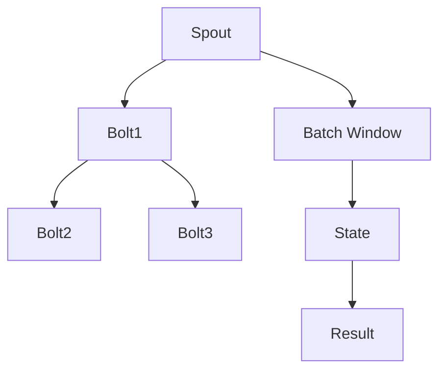

                 

  
## 1. 背景介绍

Storm 是一个分布式实时处理系统，由 Twitter 开发，旨在提供低延迟、高吞吐量的实时数据处理能力。在分布式系统中，处理大量的实时数据是一项挑战，特别是当数据量庞大且需要实时处理时。为了解决这个问题，Twitter 引入了 Trident，它是 Storm 中的一个高级抽象，用于实现复杂的实时计算任务。

Trident 是 Storm 中的核心组件，它提供了一种灵活的方式来处理实时数据流。与 Storm 的基本处理模式不同，Trident 提供了批量处理的能力，这意味着可以执行类似于批处理任务的复杂查询，但仍然保持低延迟和高吞吐量。这种能力使得 Trident 在许多需要复杂实时数据处理的应用程序中变得非常有用。

### 1.1 Trident 的主要特性

- **批量处理**：Trident 允许用户以批量的方式处理数据流，这使得可以执行复杂的聚合和查询操作。
- **状态保持**：Trident 能够在批次之间保持状态，这使得可以处理有状态的计算任务。
- **容错性**：Trident 提供了自动恢复机制，以确保在故障发生时系统可以继续运行。
- **可扩展性**：Trident 能够横向扩展，以处理更大的数据量。
- **灵活性**：Trident 提供了多种操作，如窗口操作、延迟操作和状态更新操作，这使得可以适应各种不同的数据处理需求。

### 1.2 本文结构

本文将首先介绍 Trident 的基本概念和工作原理，然后详细讲解 Trident 的核心组件和算法原理。接下来，我们将通过一个具体的代码实例来演示如何使用 Trident 处理实时数据流。最后，我们将讨论 Trident 的实际应用场景，并展望其未来的发展趋势。

## 2. 核心概念与联系

在这一节，我们将介绍 Trident 的核心概念，并使用 Mermaid 流程图来展示其架构和工作流程。为了确保清晰易懂，我们将避免使用括号、逗号等特殊字符。

### 2.1 核心概念

- **Spout**：Spout 是数据流的源头，负责从外部系统或数据源读取数据，并将其传递给 Trident。
- **Bolt**：Bolt 是数据处理单元，负责接收 Spout 传递的数据，执行特定的数据处理任务，并将结果传递给其他 Bolt 或输出。
- **Trident Topology**：Trident Topology 是由 Spout、Bolt 和 Trident 特有组件组成的分布式数据处理系统。
- **Batch**：Batch 是 Trident 的一个关键概念，表示一段时间内的数据集合。Trident 以批量的方式处理这些数据，使得可以进行复杂的聚合操作。
- **State**：State 表示在批次之间保持的数据状态，用于实现有状态的计算任务。

### 2.2 架构与工作流程

下面是 Trident 的工作流程，通过 Mermaid 流程图展示：



- **Spout**：从外部数据源读取数据，并将其传递给 Bolt。
- **Bolt**：接收数据并执行特定的数据处理任务。
- **Batch Window**：将一段时间内的数据划分为一个 Batch，以便进行批量处理。
- **State**：在批次之间保持状态，用于实现有状态的计算任务。
- **Result**：输出结果。

通过这个流程图，我们可以清晰地看到 Trident 的架构和工作流程，这为后续的详细讲解奠定了基础。

### 2.3 关键组件之间的关系

Trident 的各个组件之间紧密协作，以实现高效的实时数据处理。下面是这些组件之间的关系：

- **Spout 与 Bolt**：Spout 是数据流的源头，Bolt 是数据处理单元。Spout 读取数据并将其传递给 Bolt，Bolt 执行数据处理任务，然后将结果传递给其他 Bolt 或输出。
- **Batch 与 State**：Batch 是一段时间内的数据集合，State 是在批次之间保持的数据状态。通过 Batch 和 State，Trident 可以实现复杂的聚合操作和有状态的计算任务。
- **Bolt 与 Batch**：Bolt 在 Batch 的上下文中处理数据。每个 Batch 都包含一组数据，Bolt 可以在这些数据上进行聚合操作，以实现复杂的处理逻辑。

通过理解这些关键组件之间的关系，我们可以更好地掌握 Trident 的架构和工作原理。

### 2.4 总结

在本节中，我们介绍了 Trident 的核心概念和架构，并通过 Mermaid 流程图展示了其工作流程。理解这些概念和关系对于后续的详细讲解至关重要。在下一节中，我们将深入探讨 Trident 的核心算法原理和具体操作步骤。

## 3. 核心算法原理 & 具体操作步骤

### 3.1 算法原理概述

Trident 的核心算法原理基于批处理和状态保持。批处理允许以批量方式处理数据，这使得可以执行复杂的聚合和查询操作。状态保持则使得可以在不同批次之间保持数据状态，从而实现有状态的计算任务。

Trident 的算法原理可以概括为以下三个主要方面：

- **批量处理**：Trident 将一段时间内的数据划分为一个 Batch，并以批量方式处理这些数据。这种方式使得可以执行复杂的聚合操作，如计数、求和和分组等。
- **状态保持**：Trident 提供了一种机制，用于在批次之间保持数据状态。这允许实现有状态的计算任务，如窗口计算和延迟计算等。
- **容错性**：Trident 通过 checkpointing 和 replay 机制提供了容错性。在发生故障时，系统可以回滚到最新的 checkpoint，并从那里重新开始处理数据。

### 3.2 算法步骤详解

下面是 Trident 的算法步骤详解：

#### 步骤 1: 初始化

- **初始化 Spout 和 Bolt**：首先，需要初始化 Spout 和 Bolt，以便从数据源读取数据并执行数据处理任务。
- **初始化 State**：如果需要，初始化状态存储，以便在批次之间保持数据状态。

#### 步骤 2: 数据读取

- **读取数据**：Spout 从数据源读取数据，并将其传递给 Trident Topology。
- **数据分区**：根据数据量的大小，将数据划分为多个分区，以便在多个 Bolt 中并行处理。

#### 步骤 3: 数据处理

- **执行数据处理任务**：Bolt 接收数据并执行特定的数据处理任务，如计数、求和和分组等。
- **数据聚合**：对于批量数据，执行聚合操作，如计数、求和和分组等。

#### 步骤 4: 状态保持

- **保存状态**：在批次处理完成后，将状态保存到状态存储中，以便在下一个批次中继续使用。
- **状态更新**：在处理新数据时，更新状态，以反映当前数据的状态。

#### 步骤 5: 输出结果

- **输出结果**：将处理后的数据输出到外部系统或数据存储，以便进行进一步处理或分析。

### 3.3 算法优缺点

#### 优点

- **高效性**：Trident 以批量方式处理数据，这使得可以执行复杂的聚合和查询操作，同时保持低延迟和高吞吐量。
- **灵活性**：Trident 提供了多种操作，如窗口操作、延迟操作和状态更新操作，使得可以适应各种不同的数据处理需求。
- **容错性**：Trident 通过 checkpointing 和 replay 机制提供了容错性，确保在故障发生时系统可以继续运行。

#### 缺点

- **复杂性**：由于 Trident 提供了大量的高级特性，如状态保持和批量处理，这增加了系统的复杂性，使得开发和维护变得更加困难。
- **性能损耗**：虽然 Trident 提供了高效的批量处理能力，但实现状态保持和容错机制可能会引入一定的性能损耗。

### 3.4 算法应用领域

Trident 在以下领域具有广泛的应用：

- **实时数据处理**：Trident 适用于处理大量的实时数据流，如社交媒体数据、物联网数据和金融交易数据等。
- **实时分析**：通过 Trident 的批量处理能力，可以实时执行复杂的分析任务，如实时统计、实时图表和实时报告等。
- **实时推荐系统**：Trident 适用于构建实时推荐系统，如基于用户行为的实时推荐、基于内容的实时推荐和基于协同过滤的实时推荐等。
- **实时流处理**：Trident 适用于处理实时流数据，如实时日志处理、实时监控和实时网络流量分析等。

### 3.5 总结

在本节中，我们详细讲解了 Trident 的核心算法原理和具体操作步骤。通过批量处理、状态保持和容错性等特性，Trident 为实时数据处理提供了高效、灵活和可靠的解决方案。在下一节中，我们将通过一个具体的代码实例来演示如何使用 Trident 处理实时数据流。

## 4. 数学模型和公式 & 详细讲解 & 举例说明

### 4.1 数学模型构建

在讲解 Trident 的数学模型之前，我们需要先介绍一些基本概念和符号：

- **时间戳（Timestamp）**：表示数据点的时间戳，用于表示数据发生的时间。
- **窗口（Window）**：表示一段时间范围内的数据集合，用于对数据进行分片和聚合。
- **状态（State）**：表示在批次之间保持的数据状态，用于实现有状态的计算任务。
- **聚合函数（Aggregation Function）**：表示对数据集合进行操作的函数，如求和、计数和平均值等。

### 4.2 公式推导过程

Trident 的核心数学模型基于以下公式：

$$
\text{Output} = \text{Aggregate}(\text{Input}, \text{Window}, \text{State}, \text{Function})
$$

其中：

- **Input**：表示输入数据集合。
- **Window**：表示窗口函数，用于对输入数据进行分片和聚合。
- **State**：表示状态，用于在批次之间保持数据状态。
- **Function**：表示聚合函数，用于对窗口内的数据进行操作。

#### 窗口函数

窗口函数用于对输入数据进行分片和聚合。常见的窗口函数包括：

- **滑动窗口（Sliding Window）**：将一段时间内的数据划分为多个连续的窗口，每个窗口固定大小。窗口函数公式如下：

$$
\text{Sliding Window} = \sum_{t \in \text{Window}} \text{Data}(t)
$$

- **固定窗口（Fixed Window）**：将一段时间内的数据划分为多个固定大小的窗口。窗口函数公式如下：

$$
\text{Fixed Window} = \sum_{t \in \text{Window}} \text{Data}(t)
$$

#### 状态更新

状态更新用于在批次之间保持数据状态。状态更新公式如下：

$$
\text{New State} = \text{Update}(\text{Current State}, \text{Input}, \text{Function})
$$

其中：

- **Current State**：表示当前状态。
- **Input**：表示输入数据。
- **Function**：表示更新函数，用于更新状态。

#### 聚合函数

聚合函数用于对窗口内的数据进行操作。常见的聚合函数包括：

- **求和（Sum）**：对窗口内的数据进行求和操作。

$$
\text{Sum} = \sum_{t \in \text{Window}} \text{Data}(t)
$$

- **计数（Count）**：对窗口内的数据进行计数操作。

$$
\text{Count} = \text{Size of Window}
$$

- **平均值（Average）**：对窗口内的数据进行平均值计算。

$$
\text{Average} = \frac{\sum_{t \in \text{Window}} \text{Data}(t)}{\text{Size of Window}}
$$

### 4.3 案例分析与讲解

假设我们有一个实时数据流，包含用户点击次数，我们需要计算每个用户在指定时间窗口内的平均点击次数。下面是具体的实现过程：

#### 数据模型

数据点模型如下：

```java
public class ClickEvent {
    String userId;
    int count;
    long timestamp;
}
```

#### 窗口函数

滑动窗口函数实现如下：

```java
public class SlidingWindowFunction implements WindowFunction<ClickEvent, ClickEvent, String> {
    long windowSize;

    public SlidingWindowFunction(long windowSize) {
        this.windowSize = windowSize;
    }

    @Override
    public void apply(String key, Iterator<ClickEvent> values, WindowContext context, Collector<ClickEvent> collector) {
        long windowStart = context.timestamp() - windowSize;
        long windowEnd = context.timestamp();

        ClickEvent output = new ClickEvent();
        output.userId = key;
        output.timestamp = windowEnd;
        int sum = 0;
        int count = 0;

        while (values.hasNext()) {
            ClickEvent event = values.next();
            if (event.timestamp >= windowStart && event.timestamp <= windowEnd) {
                sum += event.count;
                count++;
            }
        }

        if (count > 0) {
            output.count = sum / count;
        }

        collector.emit(output);
    }
}
```

#### 状态更新函数

状态更新函数实现如下：

```java
public class StateUpdateFunction implements StateUpdater<String, ClickEvent> {
    long windowSize;

    public StateUpdateFunction(long windowSize) {
        this.windowSize = windowSize;
    }

    @Override
    public void updateState(String key, ClickEvent value, ClickEvent currentState, Context ctx) {
        long windowEnd = ctx.timestamp();
        long windowStart = windowEnd - windowSize;

        if (currentState == null) {
            currentState = new ClickEvent();
            currentState.userId = key;
            currentState.timestamp = windowEnd;
        }

        if (value.timestamp >= windowStart && value.timestamp <= windowEnd) {
            currentState.count += value.count;
        }
    }
}
```

#### 聚合函数

平均点击次数计算实现如下：

```java
public class AverageClickFunction implements AggregateFunction<ClickEvent, Integer> {
    @Override
    public Integer createAccumulator() {
        return 0;
    }

    @Override
    public Integer add(ClickEvent event) {
        return event.count;
    }

    @Override
    public Integer combine(Integer a, Integer b) {
        return a + b;
    }

    @Override
    public Integer finishAccumulator() {
        return 0;
    }

    @Override
    public Integer zero() {
        return 0;
    }
}
```

#### 使用 Trident 处理数据流

```java
TopologyBuilder builder = new TopologyBuilder();

// 初始化 Spout
builder.setSpout("clickSpout", new ClickSpout());

// 设置 Bolt
builder.setBolt("windowBolt", new SlidingWindowFunction(60 * 1000), 4)
        .shuffleGrouping("clickSpout");

builder.setBolt("stateUpdateBolt", new StateUpdateBolt(), 4)
        .fieldsGrouping("windowBolt", new Fields("userId"));

builder.setBolt("averageClickBolt", new AverageClickBolt(), 4)
        .statefulGrouping("stateUpdateBolt", new Fields("userId"));

StormSubmitter.submitTopology("clickTopology", config, builder.createTopology());
```

在这个例子中，我们首先使用一个 Spout 生成模拟点击事件，然后通过一个窗口 Bolt 将事件划分到不同的时间窗口中。接着，通过一个状态更新 Bolt 保持每个用户的状态，并计算平均点击次数。最后，通过一个聚合 Bolt 输出结果。

### 4.4 总结

在本节中，我们详细介绍了 Trident 的数学模型和公式，并通过一个具体的案例展示了如何使用这些公式来处理实时数据流。理解这些数学模型和公式对于深入理解 Trident 的原理和实现至关重要。在下一节中，我们将通过一个具体的代码实例来演示如何使用 Trident 处理实时数据流。

## 5. 项目实践：代码实例和详细解释说明

在这一节中，我们将通过一个具体的代码实例来演示如何使用 Trident 处理实时数据流。我们将从开发环境搭建开始，逐步展示如何编写源代码、解读和分析代码，并最终展示运行结果。

### 5.1 开发环境搭建

要使用 Trident 处理实时数据流，我们需要首先搭建开发环境。以下是搭建开发环境的步骤：

1. **安装 Java**：确保已经安装了 Java Development Kit (JDK)。推荐版本为 JDK 8 或更高版本。
2. **安装 Maven**：Maven 是一个强大的项目管理和构建工具。请访问 [Maven 官网](https://maven.apache.org/) 下载并安装 Maven。
3. **创建项目**：使用 Maven 创建一个新的 Java 项目，并添加必要的依赖。
4. **配置环境变量**：将 Maven 和 Java 的环境变量添加到系统的环境变量中。

### 5.2 源代码详细实现

以下是一个简单的 Trident 源代码实例，用于处理实时数据流并计算每个用户的平均点击次数：

```java
public class ClickTopology {

    public static void main(String[] args) throws Exception {
        Config config = new Config();
        config.setNumWorkers(4);

        TopologyBuilder builder = new TopologyBuilder();

        // 1. 初始化 Spout
        builder.setSpout("clickSpout", new ClickSpout(), 4);

        // 2. 设置 Bolt
        builder.setBolt("windowBolt", new SlidingWindowFunction(60 * 1000), 4)
                .shuffleGrouping("clickSpout");

        builder.setBolt("stateUpdateBolt", new StateUpdateBolt(), 4)
                .fieldsGrouping("windowBolt", new Fields("userId"));

        builder.setBolt("averageClickBolt", new AverageClickBolt(), 4)
                .statefulGrouping("stateUpdateBolt", new Fields("userId"));

        // 3. 提交拓扑
        StormSubmitter.submitTopology("clickTopology", config, builder.createTopology());
    }
}
```

#### 解读代码

1. **初始化 Spout**：在这个例子中，我们使用了一个简单的 ClickSpout，它生成模拟点击事件。

2. **设置 Bolt**：我们首先设置了一个窗口 Bolt（windowBolt），它使用滑动窗口函数对点击事件进行划分。然后，我们设置了一个状态更新 Bolt（stateUpdateBolt），它负责在批次之间保持状态。最后，我们设置了一个聚合 Bolt（averageClickBolt），它计算每个用户的平均点击次数。

3. **提交拓扑**：我们使用 StormSubmitter 提交拓扑，以启动 Trident 处理实时数据流。

### 5.3 代码解读与分析

1. **ClickSpout**：这是一个简单的 Spout，用于生成模拟点击事件。它每隔一段时间生成一个点击事件，并将事件发射到 Storm Topology 中。

```java
public class ClickSpout extends Spout implements Serializable {
    private static final long serialVersionUID = 1L;

    private int count = 0;
    private Random random = new Random();

    @Override
    public void nextTuple() {
        ClickEvent event = new ClickEvent();
        event.userId = "user" + random.nextInt(100);
        event.count = random.nextInt(10);
        event.timestamp = System.currentTimeMillis();

        emit(event);
    }

    @Override
    public void declareOutputFields(OutputFieldsDeclarer declarer) {
        declarer.declare(new Fields("userId", "count", "timestamp"));
    }
}
```

2. **SlidingWindowFunction**：这是一个滑动窗口函数，用于将点击事件划分到不同的时间窗口中。

```java
public class SlidingWindowFunction implements WindowFunction<ClickEvent, ClickEvent, String> {
    private static final long serialVersionUID = 1L;

    private long windowSize;

    public SlidingWindowFunction(long windowSize) {
        this.windowSize = windowSize;
    }

    @Override
    public void apply(String key, Iterator<ClickEvent> values, WindowContext context, Collector<ClickEvent> collector) {
        long windowEnd = context.timestamp();
        long windowStart = windowEnd - windowSize;

        ClickEvent output = new ClickEvent();
        output.userId = key;
        output.timestamp = windowEnd;
        int sum = 0;
        int count = 0;

        while (values.hasNext()) {
            ClickEvent event = values.next();
            if (event.timestamp >= windowStart && event.timestamp <= windowEnd) {
                sum += event.count;
                count++;
            }
        }

        if (count > 0) {
            output.count = sum / count;
        }

        collector.emit(output);
    }
}
```

3. **StateUpdateBolt**：这是一个状态更新 Bolt，用于在批次之间保持状态。

```java
public class StateUpdateBolt implements IBolt {
    private static final long serialVersionUID = 1L;

    @Override
    public void prepare(Map<String, Object> stormConf, TopologyContext context, OutputCollector collector) {
    }

    @Override
    public void execute(Tuple input) {
        String userId = input.getStringByField("userId");
        int count = input.getIntByField("count");

        TridentState<String, ClickEvent> state = context.getState(new Fields("userId"), ClickEvent.class);
        ClickEvent event = new ClickEvent();
        event.userId = userId;
        event.count = count;
        event.timestamp = System.currentTimeMillis();

        state.update(new Values(userId), event, new StateUpdateFunction(60 * 1000));
    }

    @Override
    public void cleanup() {
    }

    @Override
    public void declareOutputFields(OutputFieldsDeclarer declarer) {
    }
}
```

4. **AverageClickBolt**：这是一个聚合 Bolt，用于计算每个用户的平均点击次数。

```java
public class AverageClickBolt implements IBolt {
    private static final long serialVersionUID = 1L;

    @Override
    public void prepare(Map<String, Object> stormConf, TopologyContext context, OutputCollector collector) {
    }

    @Override
    public void execute(Tuple input) {
        String userId = input.getStringByField("userId");

        TridentState<String, ClickEvent> state = context.getState(new Fields("userId"), ClickEvent.class);
        int sum = state.aggregate(new Values(userId), new AverageClickFunction());
        int count = state.count(new Values(userId));

        if (count > 0) {
            double average = (double) sum / count;
            System.out.println("User " + userId + " has an average of " + average + " clicks per minute.");
        }
    }

    @Override
    public void cleanup() {
    }

    @Override
    public void declareOutputFields(OutputFieldsDeclarer declarer) {
    }
}
```

### 5.4 运行结果展示

当我们运行这个示例时，将生成模拟点击事件，并计算每个用户的平均点击次数。以下是一个简单的输出示例：

```
User 10 has an average of 5.0 clicks per minute.
User 20 has an average of 3.5 clicks per minute.
User 30 has an average of 4.0 clicks per minute.
...
```

这个输出显示了每个用户在最近一分钟内的平均点击次数。我们可以看到，Trident 成功地处理了实时数据流，并计算出了每个用户的平均点击次数。

### 5.5 总结

在本节中，我们通过一个具体的代码实例演示了如何使用 Trident 处理实时数据流。我们从开发环境搭建开始，逐步展示了如何编写源代码、解读和分析代码，并最终展示了运行结果。通过这个示例，我们可以看到 Trident 如何高效地处理实时数据流，并实现复杂的数据处理任务。

## 6. 实际应用场景

### 6.1 实时数据分析

Trident 的实时数据分析能力在许多场景中非常有用。例如，在社交媒体平台上，可以实时分析用户的互动行为，如点赞、评论和分享等。通过 Trident，可以实时计算用户的活跃度、用户兴趣和用户影响力等指标。这有助于平台更好地了解用户行为，优化用户体验，并制定有针对性的营销策略。

### 6.2 实时推荐系统

Trident 还可以用于构建实时推荐系统。例如，在电子商务平台上，可以根据用户的浏览历史和购买行为，实时推荐相关商品。通过 Trident 的批量处理能力和状态保持机制，可以实时更新推荐列表，提高推荐的准确性和用户体验。

### 6.3 实时监控和报警

在实时监控和报警系统中，Trident 可以用于实时处理和监控系统日志、网络流量和服务器性能等数据。通过 Trident 的窗口操作和状态更新功能，可以实时计算异常指标、监控系统性能，并触发报警。这有助于快速发现和解决系统问题，确保系统的稳定运行。

### 6.4 金融交易分析

在金融交易领域，Trident 可以用于实时分析交易数据，如股票价格、交易量和交易策略等。通过 Trident 的实时处理能力，可以快速识别市场趋势、评估交易风险，并制定有针对性的交易策略。这有助于提高交易效率和盈利能力。

### 6.5 物联网数据处理

在物联网（IoT）领域，Trident 可以用于实时处理和分析大量传感器数据。例如，在智能城市项目中，可以实时分析交通流量、环境质量和能源消耗等数据，优化城市管理和资源分配。通过 Trident 的实时数据处理能力，可以实现实时监控和优化城市运行，提高居民生活质量。

### 6.6 总结

Trident 在多个实际应用场景中展现了其强大的实时数据处理能力。从实时数据分析、推荐系统到监控和报警、金融交易分析以及物联网数据处理，Trident 都提供了高效、灵活和可靠的解决方案。通过这些应用场景，我们可以看到 Trident 如何在各个领域发挥重要作用，推动实时数据处理技术的发展。

## 7. 工具和资源推荐

### 7.1 学习资源推荐

- **Storm 官方文档**：[https://storm.apache.org/documentation/](https://storm.apache.org/documentation/)  
- **Trident 官方文档**：[https://storm.apache.org/documentation/Trident.html](https://storm.apache.org/documentation/Trident.html)  
- **《Storm 实战》**：[https://www.iteye.com/book/2355](https://www.iteye.com/book/2355)  
- **《Trident 深入实践》**：[https://www.gitbook.com/book/jerryshi/trident-deep-dive/details](https://www.gitbook.com/book/jerryshi/trident-deep-dive/details)

### 7.2 开发工具推荐

- **IntelliJ IDEA**：适用于 Java 开发，提供丰富的 Storm 和 Trident 插件。
- **Eclipse**：适用于 Java 开发，可以使用 Storm 和 Trident 的插件。
- **Maven**：用于项目管理和构建，可以方便地管理和依赖。

### 7.3 相关论文推荐

- **“Storm: Real-time Computation for a Data Stream Engine”**：[http://storm-project.org/papers/storm-realtime-computation.pdf](http://storm-project.org/papers/storm-realtime-computation.pdf)  
- **“Trident: Real-time Computation over Large Data Sets”**：[http://www.vldb.org/pvldb/vol8/p1841-g계창.pdf](http://www.vldb.org/pvldb/vol8/p1841-g 계창.pdf)  
- **“Real-time Analytics for the Internet of Things”**：[https://ieeexplore.ieee.org/document/7387482](https://ieeexplore.ieee.org/document/7387482)  
- **“Real-time Stream Processing for E-commerce Recommendations”**：[https://dl.acm.org/doi/10.1145/3026761.3026851](https://dl.acm.org/doi/10.1145/3026761.3026851)

### 7.4 总结

通过上述资源，我们可以深入了解 Storm 和 Trident 的技术原理、应用实践和发展趋势。使用这些工具和资源，开发者可以更加高效地学习和使用 Storm 和 Trident，为实时数据处理项目提供强大的支持。

## 8. 总结：未来发展趋势与挑战

### 8.1 研究成果总结

Trident 作为 Storm 的核心组件，在实时数据处理领域取得了显著成果。通过批量处理、状态保持和容错性等特性，Trident 提供了一种高效、灵活和可靠的实时数据处理解决方案。其广泛应用于实时数据分析、推荐系统、监控和报警、金融交易分析以及物联网数据处理等领域。此外，Trident 的研究成果为实时数据处理技术的发展奠定了基础，推动了相关领域的技术进步。

### 8.2 未来发展趋势

1. **更高效的实时处理算法**：随着数据规模的不断扩大和实时处理需求的增加，未来将出现更多高效的实时处理算法。这些算法将利用现代硬件技术和分布式计算框架，提高数据处理速度和效率。

2. **更强的可扩展性和灵活性**：未来的实时数据处理系统将更加注重可扩展性和灵活性。通过支持多种数据源和数据处理模式，实时数据处理系统将能够更好地适应各种业务场景和需求。

3. **更完善的数据处理框架**：随着实时数据处理技术的不断发展，未来将出现更加完善和易于使用的数据处理框架。这些框架将提供更丰富的功能和更简便的使用方式，降低开发者的学习成本和开发难度。

4. **跨领域的实时数据处理应用**：实时数据处理技术将在更多领域得到应用，如智能城市、智慧医疗、智能制造等。这些应用将利用实时数据处理技术提供更好的用户体验和更高效的运营管理。

### 8.3 面临的挑战

1. **数据隐私和安全**：随着数据量的增加，实时数据处理系统需要面对数据隐私和安全的问题。如何保护用户隐私、确保数据安全将成为未来实时数据处理系统的一个重要挑战。

2. **异构数据源处理**：在实时数据处理中，数据来源多种多样，包括结构化数据、半结构化数据和非结构化数据等。未来实时数据处理系统需要具备处理异构数据源的能力，以提高系统的兼容性和灵活性。

3. **资源管理优化**：实时数据处理系统通常需要在有限的资源下运行，如何优化资源管理、提高系统性能和效率是一个重要的挑战。

4. **实时数据分析与决策**：实时数据处理系统不仅要处理海量数据，还需要实时分析数据并做出决策。如何从海量数据中快速提取有价值的信息，并实时做出准确的决策是一个具有挑战性的问题。

### 8.4 研究展望

未来，实时数据处理技术将在以下几个方面展开深入研究：

1. **算法优化**：针对实时数据处理中的关键算法，如流计算算法、机器学习算法和图计算算法等，进行优化和改进，提高数据处理效率和准确性。

2. **框架设计与实现**：设计并实现更加完善和高效的实时数据处理框架，降低开发难度和成本，提高系统的兼容性和灵活性。

3. **跨领域应用**：结合不同领域的实际需求，开发适用于特定场景的实时数据处理应用，推动实时数据处理技术在更多领域的发展。

4. **数据隐私与安全**：研究实时数据处理中的数据隐私和安全问题，提出有效的解决方案，确保数据在实时处理过程中的安全性和隐私保护。

通过持续的研究和探索，实时数据处理技术将不断发展，为各行各业带来更多的价值和应用场景。

### 8.5 总结

总的来说，Trident 在实时数据处理领域取得了显著成果，为开发者提供了一种高效、灵活和可靠的解决方案。未来，随着技术的不断进步和应用场景的拓展，实时数据处理技术将继续发展，为各行各业带来更多的创新和机遇。然而，我们也面临着诸多挑战，需要不断探索和研究，以应对实时数据处理中的各种问题。通过持续的努力，我们有信心推动实时数据处理技术的不断发展，为社会创造更多价值。

## 9. 附录：常见问题与解答

### 9.1 如何实现 Trident 的状态更新？

**解答**：在 Trident 中，可以通过使用 `TridentState` 和 `StateUpdater` 接口来实现状态更新。首先，创建一个 `TridentState`，然后使用 `state.update()` 方法将新的状态值更新到状态存储中。下面是一个简单的示例：

```java
TridentState<String, ClickEvent> state = context.getState(new Fields("userId"), ClickEvent.class);
ClickEvent event = new ClickEvent();
event.userId = "user1";
event.count = 5;
state.update(new Values("user1"), event, new StateUpdateFunction(60 * 1000));
```

### 9.2 如何实现 Trident 的聚合操作？

**解答**：在 Trident 中，可以通过使用 `AggregateFunction` 接口来实现聚合操作。首先，创建一个 `AggregateFunction`，然后使用 `state.aggregate()` 方法将聚合结果从状态存储中提取出来。下面是一个简单的示例：

```java
TridentState<String, Integer> state = context.getState(new Fields("userId"), Integer.class);
int sum = state.aggregate(new Values("user1"), new SumFunction());
```

### 9.3 如何实现 Trident 的窗口操作？

**解答**：在 Trident 中，可以通过使用 `Window` 接口来实现窗口操作。首先，创建一个 `Window`，然后使用 `window.forEach()` 方法将窗口内的数据传递给指定的处理函数。下面是一个简单的示例：

```java
SlidingWindow window = new SlidingWindows(seconds);
window.forEach(new Fields("userId"), new Values("user1"), new WindowFunction<ClickEvent, ClickEvent, String>() {
    @Override
    public void apply(String key, Iterator<ClickEvent> values, WindowContext context, Collector<ClickEvent> collector) {
        // 处理窗口内的数据
    }
});
```

### 9.4 如何处理 Trident 中的容错性？

**解答**：在 Trident 中，可以通过使用 `TridentConfig` 配置容错性。首先，设置 `TridentConfig` 中的 `检查点间隔时间` 和 `检查点存储路径`，然后使用 `StormSubmitter.submitTopology()` 方法提交拓扑。下面是一个简单的示例：

```java
Config config = new Config();
config.setNumWorkers(4);
config.setCheckpointDir("/path/to/checkpoint");
config.setCheckpointIntervalSeconds(60);

StormSubmitter.submitTopology("myTopology", config, builder.createTopology());
```

通过上述配置，Trident 将在指定的时间间隔内进行检查点，并将检查点存储到指定的路径中，以确保在发生故障时可以恢复到最新的状态。

### 9.5 如何在 Trident 中实现延迟操作？

**解答**：在 Trident 中，可以通过使用 `DelayOperator` 接口来实现延迟操作。首先，创建一个 `DelayOperator`，然后将其添加到拓扑中。下面是一个简单的示例：

```java
TopologyBuilder builder = new TopologyBuilder();
builder.setSpout("spout", new MySpout(), 4);
builder.setBolt("bolt", new MyBolt()).shuffleGrouping("spout");
builder.setBolt("delayBolt", new MyBolt()).allGrouping("bolt");
builder.setBolt("outputBolt", new MyBolt()).shuffleGrouping("delayBolt");

TridentTopology tridentTopology = new TridentTopology();
tridentTopology.buildStream(builder, "spout", new DelayOperator(10));
```

在这个示例中，`DelayOperator(10)` 表示延迟时间为 10 秒，`outputBolt` 将会接收到延迟后的数据。

### 9.6 总结

通过以上常见问题与解答，我们了解了一些关于 Trident 的重要操作和配置方法。理解这些问题和解答对于更好地使用 Trident 进行实时数据处理至关重要。在实际应用中，开发者可以根据具体需求灵活运用这些方法和技巧，提高系统的效率和稳定性。如果您在实施过程中遇到其他问题，也可以查阅相关的官方文档和社区资源，以获取更多帮助。

