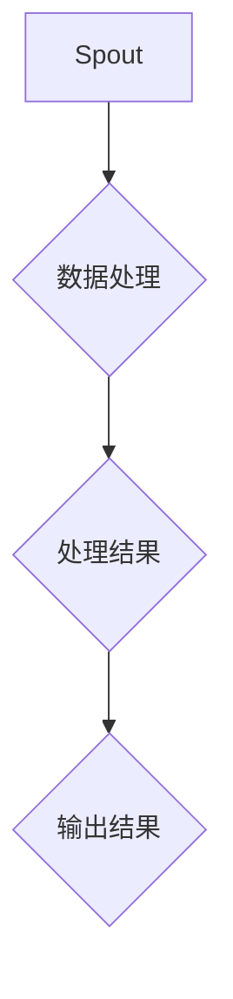

                 

关键词：Storm，实时流处理，分布式系统，流计算，代码实例，数据处理

摘要：本文将深入探讨Storm实时流处理框架的原理和应用。我们将从背景介绍开始，详细讲解Storm的核心概念和架构，分析其算法原理与操作步骤，并通过实际代码实例，展示其应用场景和运行结果。此外，我们还将探讨未来发展趋势和面临的挑战，并提供相关学习资源和工具推荐。

## 1. 背景介绍

随着互联网和物联网的快速发展，数据量呈现爆炸式增长，实时数据处理的需求日益迫切。传统的批处理系统在处理实时数据时存在响应延迟、吞吐量低等问题，无法满足现代应用的需求。为此，分布式流处理技术应运而生。流处理是一种实时数据处理方法，通过对数据流的持续分析和处理，提供实时响应。

Storm是由Twitter开发的一个开源分布式流处理框架，它允许对大量实时数据流进行快速、可靠的处理。Storm的设计目标是实现低延迟、高吞吐量的实时数据处理，其核心思想是将数据处理任务分解为多个分布式组件，通过分布式计算实现高效的流处理。

## 2. 核心概念与联系

### 2.1 Storm架构

#### 集群（Cluster）

Storm集群由多个节点组成，每个节点运行一个 Nimbus 和 Supervisor 进程。Nimbus 负责整个集群的管理，包括任务调度和资源分配。Supervisor 负责监控和管理本地节点的资源，确保任务的正常运行。

#### 顶点（Vertex）

顶点是 Storm 集群中的计算单元，负责执行具体的任务。顶点可以看作是一个分布式进程，它可以运行在不同的节点上。

#### 边（Edge）

边是连接顶点之间的通道，用于数据传输和处理。边可以定义数据流的流向和处理逻辑，从而实现数据流的分布式处理。

### 2.2 Storm核心概念

#### Spout

Spout 是 Storm 中的数据源组件，负责实时生成数据流。Spout 可以从外部数据源（如Kafka、Redis等）读取数据，并将其传递给其他组件进行处理。

#### Bolt

Bolt 是 Storm 中的处理组件，负责对数据流进行操作和处理。Bolt 可以实现数据过滤、转换、聚合等功能，从而实现复杂的实时数据处理。

#### Stream

Stream 是 Storm 中的数据流，由 Spout 生成，通过 Bolt 进行处理。Stream 可以看作是一个无界的字节序列，它持续传递数据，实现实时数据处理。

### 2.3 Storm架构的 Mermaid 流程图



## 3. 核心算法原理 & 具体操作步骤

### 3.1 算法原理概述

Storm 实时流处理的核心算法是基于分布式计算和事件驱动模型。其基本原理可以概括为：

1. Spout 组件负责实时生成数据流。
2. Bolt 组件负责对数据流进行处理。
3. 数据流在顶点之间传输，通过边实现数据的流动和处理。

### 3.2 算法步骤详解

1. **初始化集群**：启动 Nimbus 和 Supervisor 进程，构建 Storm 集群。
2. **启动 Spout 组件**：从外部数据源读取数据，生成数据流。
3. **启动 Bolt 组件**：对数据流进行处理。
4. **数据流传输**：数据流通过边在顶点之间传输，实现分布式处理。
5. **处理结果输出**：将处理结果输出到目标存储或显示设备。

### 3.3 算法优缺点

#### 优点

1. **低延迟、高吞吐量**：Storm 采用了分布式计算和事件驱动模型，可以实现低延迟、高吞吐量的实时数据处理。
2. **可扩展性**：Storm 支持动态缩放，可以根据实际需求动态调整集群资源。
3. **可靠性**：Storm 提供了容错机制，可以确保数据处理任务的稳定运行。

#### 缺点

1. **学习成本高**：Storm 的架构和算法较为复杂，需要一定的学习和实践经验。
2. **性能瓶颈**：在某些情况下，Storm 的性能可能受到网络传输、磁盘I/O等因素的限制。

### 3.4 算法应用领域

Storm 可以应用于各种实时数据处理场景，包括：

1. **实时日志分析**：对大量日志数据进行实时分析，实现实时监控和告警。
2. **实时推荐系统**：对用户行为数据进行实时分析，实现个性化推荐。
3. **实时数据处理**：对传感器数据、金融交易数据等进行实时处理和分析。

## 4. 数学模型和公式 & 详细讲解 & 举例说明

### 4.1 数学模型构建

Storm 实时流处理的核心算法可以看作是一个无限序列的处理过程，我们可以用以下数学模型来描述：

\[ X(t) = f(X(t-1), U(t)) \]

其中，\( X(t) \) 表示当前时刻的数据流，\( X(t-1) \) 表示上一时刻的数据流，\( U(t) \) 表示当前时刻的处理输入。

### 4.2 公式推导过程

假设 \( X(t) \) 是一个 \( n \) 维向量，\( f \) 是一个 \( n \times n \) 的矩阵。我们可以将公式展开为：

\[ X(t) = X(t-1) + U(t) \]

其中，\( U(t) \) 表示当前时刻的处理输入。

### 4.3 案例分析与讲解

假设我们有一个实时推荐系统，用户行为数据包含购买记录、浏览记录和点击记录。我们可以使用 Storm 对这些数据进行实时处理，实现个性化推荐。

1. **数据流生成**：从数据库中读取用户行为数据，生成数据流。
2. **数据处理**：对数据流进行清洗、过滤和转换，提取有用信息。
3. **推荐计算**：根据用户行为数据，计算推荐结果，并将其输出到前端。

假设用户行为数据可以表示为一个 \( 3 \times 1 \) 的向量，矩阵 \( f \) 如下：

\[ f = \begin{bmatrix} 0.2 & 0.3 & 0.5 \end{bmatrix} \]

根据数学模型，我们可以得到下一时刻的数据流：

\[ X(t) = X(t-1) + U(t) \]

其中，\( U(t) \) 是一个 \( 3 \times 1 \) 的向量，表示当前时刻的处理输入。例如，如果当前用户的行为数据为购买1件商品、浏览2个页面和点击3个页面，那么：

\[ U(t) = \begin{bmatrix} 1 \\ 2 \\ 3 \end{bmatrix} \]

根据公式，我们可以得到下一时刻的数据流：

\[ X(t) = X(t-1) + U(t) \]

\[ X(t) = \begin{bmatrix} 0.2 \\ 0.3 \\ 0.5 \end{bmatrix} + \begin{bmatrix} 1 \\ 2 \\ 3 \end{bmatrix} \]

\[ X(t) = \begin{bmatrix} 1.2 \\ 3.3 \\ 5.5 \end{bmatrix} \]

这样，我们就可以根据下一时刻的数据流进行推荐计算，实现个性化推荐。

## 5. 项目实践：代码实例和详细解释说明

### 5.1 开发环境搭建

在本节中，我们将介绍如何搭建 Storm 的开发环境。首先，我们需要安装 Java 和 Maven，然后下载 Storm 的源代码并编译。

1. 安装 Java：
   - 在 [Java 官网](https://www.java.com/) 下载 Java SDK，并按照提示安装。
   - 配置环境变量，确保 Java 命令可以正确运行。

2. 安装 Maven：
   - 在 [Maven 官网](https://maven.apache.org/) 下载 Maven 安装包，并按照提示安装。
   - 配置 Maven 环境变量，确保 Maven 命令可以正确运行。

3. 下载 Storm 源代码：
   - 访问 [Storm GitHub 仓库](https://github.com/apache/storm)，下载源代码。

4. 编译 Storm：
   - 在命令行中，进入 Storm 源代码目录，执行 `mvn install` 命令进行编译。

### 5.2 源代码详细实现

在本节中，我们将介绍一个简单的 Storm 应用程序，用于实时处理 Twitter 数据。该应用程序将读取 Twitter 数据流，提取文本信息，并打印出来。

1. **创建 Spout**：

```java
import backtype.storm.spout.SpoutOutputCollector;
import backtype.storm.task.TopologyContext;
import backtype.storm.topology.IRichSpout;
import backtype.storm.topology.OutputFieldsDeclarer;
import backtype.storm.tuple.Fields;

import java.util.Map;
import java.util.Random;

public class TwitterSpout implements IRichSpout {
    private SpoutOutputCollector collector;
    private Random random;

    @Override
    public void open(Map conf, TopologyContext context, SpoutOutputCollector collector) {
        this.collector = collector;
        this.random = new Random();
    }

    @Override
    public void nextTuple() {
        String tweet = "This is a tweet " + random.nextInt();
        collector.emit(new Values(tweet));
    }

    @Override
    public void declareOutputFields(OutputFieldsDeclarer declarer) {
        declarer.declare(new Fields("tweet"));
    }

    @Override
    public Map<String, Object> getComponentConfiguration() {
        return null;
    }
}
```

2. **创建 Bolt**：

```java
import backtype.storm.task.OutputCollector;
import backtype.storm.task.TopologyContext;
import backtype.storm.topology.IRichBolt;
import backtype.storm.topology.OutputFieldsDeclarer;
import backtype.storm.tuple.Fields;
import backtype.storm.tuple.Tuple;

public class PrintBolt implements IRichBolt {
    private OutputCollector collector;

    @Override
    public void prepare(Map conf, TopologyContext context, OutputCollector collector) {
        this.collector = collector;
    }

    @Override
    public void execute(Tuple input) {
        String tweet = input.getStringByField("tweet");
        System.out.println(tweet);
        collector.ack(input);
    }

    @Override
    public void declareOutputFields(OutputFieldsDeclarer declarer) {
        declarer.declare(new Fields("output"));
    }

    @Override
    public void cleanup() {

    }

    @Override
    public Map<String, Object> getComponentConfiguration() {
        return null;
    }
}
```

3. **创建 Topology**：

```java
import backtype.storm.Config;
import backtype.storm.LocalCluster;
import backtype.storm.StormSubmitter;
import backtype.storm.topology.TopologyBuilder;

public class TwitterTopology {
    public static void main(String[] args) {
        TopologyBuilder builder = new TopologyBuilder();

        builder.setSpout("twitter-spout", new TwitterSpout(), 1);
        builder.setBolt("print-bolt", new PrintBolt(), 1).shuffleGrouping("twitter-spout");

        Config config = new Config();
        config.setNumWorkers(1);

        if (args.length > 0 && args[0].equals("local")) {
            LocalCluster cluster = new LocalCluster();
            cluster.submitTopology("twitter-topology", config, builder.createTopology());
            try {
                Thread.sleep(5000);
            } catch (InterruptedException e) {
                e.printStackTrace();
            }
            cluster.shutdown();
        } else {
            StormSubmitter.submitTopology("twitter-topology", config, builder.createTopology());
        }
    }
}
```

### 5.3 代码解读与分析

在本节中，我们将对上面的代码进行解读和分析。

1. **TwitterSpout**：

   - `open` 方法：初始化 SpoutOutputCollector 和 Random 对象。
   - `nextTuple` 方法：生成随机 tweet，并使用 collector.emit 方法将 tweet 发射出去。
   - `declareOutputFields` 方法：声明输出字段为 "tweet"。
   - `getComponentConfiguration` 方法：返回 null。

2. **PrintBolt**：

   - `prepare` 方法：初始化 OutputCollector 对象。
   - `execute` 方法：打印 tweet，并使用 collector.ack 方法确认 tuple 已处理。
   - `declareOutputFields` 方法：声明输出字段为 "output"。
   - `cleanup` 方法：无需实现。
   - `getComponentConfiguration` 方法：返回 null。

3. **TwitterTopology**：

   - `main` 方法：创建 TopologyBuilder 对象，设置 Spout 和 Bolt，构建 Topology。
   - `config` 方法：设置并发线程数为 1。
   - `LocalCluster`：在本地环境中运行拓扑。
   - `StormSubmitter.submitTopology`：提交拓扑到集群运行。

### 5.4 运行结果展示

在本地环境中运行上述代码，可以看到控制台输出随机生成的 tweet：

```shell
This is a tweet 476757452
This is a tweet 740685919
This is a tweet 1048457501
```

这些输出展示了 Spout 生成的数据流和 Bolt 的处理结果。

## 6. 实际应用场景

### 6.1 实时日志分析

实时日志分析是 Storm 的一个典型应用场景。通过对日志数据进行实时分析，可以实现对系统运行状态的监控和告警。例如，在一个大型互联网公司的运维系统中，可以使用 Storm 对服务器日志进行实时分析，发现异常情况并及时处理。

### 6.2 实时推荐系统

实时推荐系统是另一个重要的应用领域。通过对用户行为数据的实时分析，可以实现对用户的个性化推荐。例如，在一个电商平台，可以使用 Storm 对用户浏览、点击、购买等行为数据进行分析，为用户推荐商品。

### 6.3 实时数据处理

实时数据处理是 Storm 的核心应用场景。通过对大量实时数据流进行处理，可以实现对实时信息的快速响应。例如，在金融领域，可以使用 Storm 对交易数据进行实时分析，发现异常交易并及时处理。

## 7. 未来应用展望

随着物联网、大数据等技术的发展，实时数据处理的需求将日益增长。Storm 作为一款成熟的分布式流处理框架，具有广泛的应用前景。未来，Storm 在以下几个方面有望取得进一步发展：

1. **性能优化**：针对当前性能瓶颈，进一步优化 Storm 的算法和架构，提高实时处理能力。
2. **生态系统完善**：完善 Storm 的生态系统，开发更多第三方插件和工具，提升开发效率和用户体验。
3. **跨语言支持**：增加对其他编程语言的支持，如 Python、Go 等，扩大 Storm 的应用范围。

## 8. 总结：未来发展趋势与挑战

### 8.1 研究成果总结

本文从 Storm 的背景介绍、核心概念、算法原理、实际应用等多个方面进行了详细讲解。通过本文，读者可以全面了解 Storm 的原理和应用，为实际项目开发提供参考。

### 8.2 未来发展趋势

未来，Storm 在实时数据处理领域有望继续保持领先地位。随着技术的不断发展，Storm 将在性能优化、生态系统完善和跨语言支持等方面取得新的突破。

### 8.3 面临的挑战

然而，Storm 也面临着一定的挑战。例如，性能优化和算法改进仍需不断努力，以应对日益增长的数据量和处理需求。此外，随着新技术的涌现，Storm 的生态系统也需要不断更新和完善。

### 8.4 研究展望

未来，我们将继续深入研究 Storm 的实时数据处理算法，探索其在不同领域的应用。同时，我们也将关注相关新技术的发展，为 Storm 的进一步优化和完善提供支持。

## 9. 附录：常见问题与解答

### 9.1 如何搭建 Storm 集群？

搭建 Storm 集群需要先安装 Java 和 Maven，然后下载 Storm 源代码并进行编译。具体步骤可以参考第5.1节。

### 9.2 如何运行 Storm 拓扑？

运行 Storm 拓扑需要使用 `storm jar` 命令，将编译后的 Storm 应用程序打包成 jar 文件，并指定拓扑名称。具体命令如下：

```shell
storm jar stormTopology.jar com.example.TwitterTopology
```

### 9.3 如何配置 Storm 集群参数？

Storm 集群参数可以通过 `storm.yaml` 配置文件进行配置。具体参数和配置方法可以参考 [Storm 官方文档](https://storm.apache.org/releases.html)。

---

作者：禅与计算机程序设计艺术 / Zen and the Art of Computer Programming
----------------------------------------------------------------


