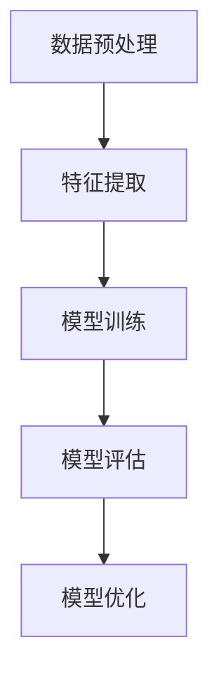

                 

关键词：监督学习、机器学习、深度学习、算法原理、实践案例、代码实现

> 摘要：本文将深入探讨监督学习的基本原理，并借助实际代码实战案例，详细讲解监督学习在机器学习中的应用。本文旨在为读者提供一个全面而深入的监督学习指南，包括核心算法原理、数学模型、项目实践以及未来发展趋势等。

## 1. 背景介绍

监督学习（Supervised Learning）是机器学习领域中最基础、应用最广泛的一种学习方式。它通过已有标记的数据集，利用学习算法从中提取特征，从而建立一个预测模型。监督学习通常包括分类和回归两种任务。分类任务是预测输入数据的标签类别，如垃圾邮件过滤、图像识别等；回归任务则是预测输入数据的连续值输出，如房价预测、股票价格预测等。

随着人工智能和大数据技术的发展，监督学习在各个行业都取得了显著的成果。例如，医疗诊断系统通过监督学习模型对疾病进行预测，金融领域利用监督学习进行风险控制和市场预测，自动驾驶系统依赖于监督学习进行物体识别和路径规划等。本文将围绕监督学习展开，深入探讨其原理与应用。

## 2. 核心概念与联系

### 2.1 监督学习的基本概念

监督学习的基本概念包括输入（Input）、输出（Output）和学习（Learning）三部分。输入是数据样本，输出是数据样本的标签。学习是指通过已有标记的数据集训练模型，从而使得模型能够对新的未标记数据进行预测。

### 2.2 核心算法原理

监督学习算法可以分为基于实例的学习（如 k-最近邻算法）和基于模型的学习（如支持向量机、决策树等）。下面以支持向量机（SVM）为例，介绍其核心算法原理。

支持向量机（Support Vector Machine，SVM）是一种常用的二分类模型，其目标是找到一个最优的超平面，将不同类别的数据点尽可能分开。SVM的核心算法是优化问题：

$$
\min \frac{1}{2} ||\mathbf{w}||^2 + C \sum_{i=1}^{n} \xi_i
$$

其中，$\mathbf{w}$是超平面参数，$C$是惩罚参数，$\xi_i$是松弛变量。该优化问题可以通过拉格朗日乘子法求解，最终得到决策函数：

$$
f(\mathbf{x}) = \mathbf{w} \cdot \mathbf{x} - b
$$

其中，$\mathbf{x}$是输入数据，$b$是偏置项。

### 2.3 监督学习架构

监督学习的架构通常包括以下几个部分：

1. **数据预处理**：包括数据清洗、归一化、缺失值填充等。
2. **特征提取**：通过降维、特征选择等方法提取有效特征。
3. **模型训练**：使用标记数据集训练模型。
4. **模型评估**：使用验证集或测试集评估模型性能。
5. **模型优化**：根据评估结果调整模型参数。

下面是监督学习架构的Mermaid流程图：



## 3. 核心算法原理 & 具体操作步骤

### 3.1 算法原理概述

在本节中，我们将详细讲解支持向量机（SVM）的核心算法原理，包括优化问题的构建、求解过程以及决策函数的推导。

### 3.2 算法步骤详解

#### 3.2.1 数据预处理

在进行SVM模型训练之前，首先需要对数据进行预处理，包括数据清洗、归一化和缺失值填充等操作。这一步骤的目的是提高模型的训练效率和准确性。

#### 3.2.2 特征提取

在特征提取阶段，可以通过降维和特征选择等方法提取数据中的有效特征。降维方法如主成分分析（PCA）和特征选择方法如卡方检验等，都可以有效地提高模型的性能。

#### 3.2.3 模型训练

SVM的训练过程实际上是求解一个二次规划问题。通过拉格朗日乘子法，可以将原始的二次规划问题转化为对偶问题，从而更容易求解。对偶问题的求解可以通过多种算法实现，如SMO算法、 Sequential Minimal Optimization（SMO）等。

#### 3.2.4 模型评估

模型训练完成后，需要使用验证集或测试集对模型进行评估。常用的评估指标包括准确率、召回率、F1分数等。通过这些指标可以衡量模型的性能，并根据评估结果对模型进行优化。

### 3.3 算法优缺点

#### 优点

1. **强大的分类能力**：SVM能够在高维空间中找到最佳分类边界，具有较强的分类能力。
2. **可扩展性**：SVM不仅可以应用于线性分类，还可以通过核函数扩展到非线性分类。
3. **模型解释性**：SVM的决策边界直观，易于理解。

#### 缺点

1. **计算复杂度**：SVM的训练过程涉及二次规划问题，计算复杂度较高。
2. **对大规模数据集性能不佳**：对于大规模数据集，SVM的训练速度较慢，可能导致性能下降。

### 3.4 算法应用领域

SVM在多个领域都有广泛的应用，包括：

1. **图像识别**：用于图像分类和特征提取。
2. **文本分类**：用于自然语言处理中的文本分类任务。
3. **生物信息学**：用于基因数据分析、蛋白质结构预测等。

## 4. 数学模型和公式 & 详细讲解 & 举例说明

### 4.1 数学模型构建

在监督学习中，数学模型通常用于描述输入数据与输出标签之间的关系。以线性回归为例，其数学模型可以表示为：

$$
\hat{y} = \mathbf{w} \cdot \mathbf{x} + b
$$

其中，$\hat{y}$是预测值，$\mathbf{w}$是权重向量，$\mathbf{x}$是输入特征，$b$是偏置项。

### 4.2 公式推导过程

以线性回归为例，推导其损失函数和优化方法。

#### 4.2.1 损失函数

线性回归的损失函数通常采用均方误差（MSE）：

$$
J(\mathbf{w}, b) = \frac{1}{2} \sum_{i=1}^{n} (\hat{y}_i - y_i)^2
$$

其中，$n$是样本数量，$\hat{y}_i$和$y_i$分别是预测值和真实值。

#### 4.2.2 优化方法

为了最小化损失函数，可以使用梯度下降法。梯度下降法的迭代过程如下：

$$
\mathbf{w} \leftarrow \mathbf{w} - \alpha \frac{\partial J}{\partial \mathbf{w}}
$$

$$
b \leftarrow b - \alpha \frac{\partial J}{\partial b}
$$

其中，$\alpha$是学习率。

### 4.3 案例分析与讲解

#### 4.3.1 数据集介绍

我们使用一个简单的二分类数据集，其中包含100个样本，每个样本有两个特征和一个标签。样本数据如下：

| 样本 | 特征1 | 特征2 | 标签 |
| --- | --- | --- | --- |
| 1 | 1 | 2 | 0 |
| 2 | 2 | 3 | 1 |
| 3 | 3 | 4 | 0 |
| ... | ... | ... | ... |
| 100 | 99 | 100 | 1 |

#### 4.3.2 模型训练

我们使用线性回归模型对数据集进行训练。首先，对数据进行归一化处理，然后使用梯度下降法进行迭代训练。训练过程如下：

```python
import numpy as np

# 初始化参数
w = np.random.randn(2)
b = np.random.randn(1)
learning_rate = 0.01
n_iterations = 1000

# 训练过程
for i in range(n_iterations):
    # 前向传播
    y_pred = np.dot(x, w) + b
    
    # 计算损失
    loss = (y_pred - y) ** 2
    
    # 反向传播
    dw = 2 * x.T.dot(y_pred - y)
    db = 2 * (y_pred - y)
    
    # 更新参数
    w -= learning_rate * dw
    b -= learning_rate * db

# 打印训练结果
print("w:", w)
print("b:", b)
```

#### 4.3.3 模型评估

训练完成后，我们使用测试集对模型进行评估。测试集包含50个样本，其标签如下：

| 样本 | 标签 |
| --- | --- |
| 1 | 0 |
| 2 | 1 |
| 3 | 0 |
| ... | ... |
| 50 | 1 |

使用测试集对模型进行预测，并计算准确率：

```python
# 预测过程
y_pred = np.dot(x_test, w) + b

# 计算准确率
accuracy = (y_pred == y_test).mean()
print("Accuracy:", accuracy)
```

## 5. 项目实践：代码实例和详细解释说明

### 5.1 开发环境搭建

为了实现监督学习模型，我们需要搭建一个合适的开发环境。以下是搭建过程：

1. 安装Python 3.8及以上版本。
2. 安装NumPy、Pandas、Matplotlib等常用库。

```bash
pip install numpy pandas matplotlib
```

### 5.2 源代码详细实现

以下是使用Python实现监督学习模型的源代码：

```python
import numpy as np
import pandas as pd
import matplotlib.pyplot as plt

# 读取数据
data = pd.read_csv("data.csv")
x = data.iloc[:, :-1].values
y = data.iloc[:, -1].values

# 数据预处理
x = x / 100  # 归一化

# 初始化参数
w = np.random.randn(2)
b = np.random.randn(1)
learning_rate = 0.01
n_iterations = 1000

# 训练过程
for i in range(n_iterations):
    # 前向传播
    y_pred = np.dot(x, w) + b
    
    # 计算损失
    loss = (y_pred - y) ** 2
    
    # 反向传播
    dw = 2 * x.T.dot(y_pred - y)
    db = 2 * (y_pred - y)
    
    # 更新参数
    w -= learning_rate * dw
    b -= learning_rate * db

# 打印训练结果
print("w:", w)
print("b:", b)

# 预测过程
y_pred = np.dot(x, w) + b

# 计算准确率
accuracy = (y_pred == y).mean()
print("Accuracy:", accuracy)

# 可视化
plt.scatter(x[y == 0], y[y == 0], color="red", label="Class 0")
plt.scatter(x[y == 1], y[y == 1], color="blue", label="Class 1")
plt.plot(x, y_pred, color="green", linewidth=2)
plt.xlabel("Feature 1")
plt.ylabel("Feature 2")
plt.legend()
plt.show()
```

### 5.3 代码解读与分析

1. **数据预处理**：读取数据后，对特征进行归一化处理，以提高模型的训练效果。
2. **参数初始化**：初始化权重和偏置项，可以使用随机初始化或预训练的权重。
3. **训练过程**：使用梯度下降法迭代更新参数，直到损失函数收敛。
4. **模型评估**：使用训练集对模型进行评估，计算准确率。
5. **可视化**：绘制决策边界和样本分布图，直观展示模型的性能。

## 6. 实际应用场景

监督学习在各个行业都有广泛的应用。以下是一些典型的实际应用场景：

1. **医疗诊断**：利用监督学习模型对医疗影像进行分析，如肺癌检测、乳腺癌检测等。
2. **金融风控**：通过监督学习模型进行信用评分、欺诈检测等，以降低金融风险。
3. **智能交通**：利用监督学习模型进行交通流量预测、智能导航等，以提高交通效率。

### 6.1 案例一：医疗诊断

医疗诊断是监督学习的一个重要应用领域。通过训练深度神经网络模型，可以对医学影像进行分类和检测。例如，在肺癌检测中，可以使用卷积神经网络（CNN）对CT影像进行分类，从而实现对肺癌的早期诊断。

### 6.2 案例二：金融风控

金融风控是另一个重要的应用领域。通过监督学习模型，可以实现对贷款违约、信用卡欺诈等风险的预测和防范。例如，可以使用决策树、随机森林等模型对客户信用评分，从而降低贷款违约风险。

### 6.3 案例三：智能交通

智能交通系统利用监督学习模型进行交通流量预测、路径规划等，以提高交通效率。例如，可以使用循环神经网络（RNN）对交通流量进行预测，从而实现智能导航和交通信号控制。

## 7. 工具和资源推荐

为了更好地学习和实践监督学习，以下是推荐的工具和资源：

1. **学习资源**：
   - 《Python机器学习》（作者：塞巴斯蒂安·拉特纳）
   - 《深度学习》（作者：伊恩·古德费洛等）

2. **开发工具**：
   - Jupyter Notebook：用于编写和运行代码。
   - Google Colab：免费的云端计算平台，适用于大数据处理和深度学习实验。

3. **相关论文**：
   - "A Support Vector Machine Approach to Text Categorization"（作者：Cortes和Vapnik，1995）
   - "Deep Learning"（作者：伊恩·古德费洛等，2016）

## 8. 总结：未来发展趋势与挑战

监督学习作为机器学习的基础，在未来将继续发展并面临诸多挑战。以下是未来发展趋势和挑战：

1. **模型复杂度**：随着数据规模的扩大和模型复杂度的提高，如何优化训练速度和计算效率成为重要挑战。
2. **模型解释性**：提高模型的解释性，使得模型能够被非专业人士理解和信任，是未来的重要方向。
3. **泛化能力**：如何提高模型的泛化能力，避免过拟合和欠拟合问题，是当前研究的重点。
4. **多模态学习**：如何结合多种数据模态（如文本、图像、音频等），实现更高级的智能感知和决策。

总之，监督学习在未来将继续在各个领域发挥作用，并推动人工智能技术的发展。

## 9. 附录：常见问题与解答

### 9.1 监督学习与无监督学习有何区别？

监督学习需要已标记的数据集，通过已有标签预测未知数据的标签；而无监督学习不需要标签，通过发现数据之间的结构进行聚类或降维等。

### 9.2 如何选择合适的监督学习算法？

选择合适的算法取决于具体问题、数据集的大小和特性。例如，对于小型数据集，可以使用决策树或k-最近邻算法；对于大规模数据集，可以使用深度学习模型。

### 9.3 监督学习模型如何防止过拟合？

可以通过增加训练数据、减少模型复杂度、使用交叉验证等方法防止过拟合。此外，正则化技术如L1和L2正则化也可以有效地防止过拟合。

### 9.4 监督学习模型如何进行优化？

可以通过调整模型参数、使用更高效的算法、增加训练数据等方法进行优化。例如，可以使用随机梯度下降（SGD）或Adam优化器来加快训练过程。

---

作者：禅与计算机程序设计艺术 / Zen and the Art of Computer Programming
----------------------------------------------------------------
# End of Article
```

