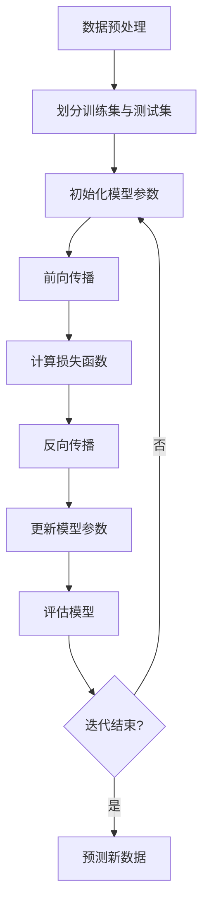

                 

### 关键词 Keywords
- 监督学习
- 分类算法
- 回归分析
- 模型训练
- 误差分析
- 数据预处理

<|assistant|>### 摘要 Summary
本文旨在深入探讨监督学习的基本概念、核心算法原理、数学模型、应用场景及未来发展趋势。通过详细解析分类算法和回归分析的原理与操作步骤，本文将为读者提供一个全面而系统的理解。此外，文章还将结合实际项目实例，展示监督学习在实际开发中的具体应用，并提供相关的学习资源和工具推荐。最终，文章将对监督学习领域的研究成果进行总结，并对未来的发展方向和挑战进行展望。

## 1. 背景介绍

监督学习（Supervised Learning）是机器学习（Machine Learning）的一个核心分支。与无监督学习（Unsupervised Learning）和半监督学习（Semi-Supervised Learning）不同，监督学习依赖于有标记的训练数据。这些标记数据包含了输入特征和对应的输出标签，通过学习这些数据之间的关系，模型可以预测新的、未知的数据点。

监督学习的重要性在于其广泛的应用领域，从图像识别、自然语言处理到医疗诊断、金融风控等，都是监督学习的典型应用场景。在许多实际应用中，监督学习模型的表现决定了业务的成功与否。因此，深入理解监督学习的基本概念、算法原理和实际应用，对于人工智能领域的从业者来说至关重要。

本文将首先介绍监督学习的基本概念，包括其定义、类型和应用场景。随后，我们将详细解析两种主要的监督学习算法：分类算法和回归算法。接着，本文将探讨监督学习的数学模型和公式，并通过实际项目实例展示算法的应用。最后，本文将对监督学习的未来发展趋势和面临的挑战进行展望。

### 1.1 监督学习的定义

监督学习是一种从标记数据中学习输出函数的过程。标记数据包含了输入特征和对应的输出标签，这些标签通常是已知的、预先定义的。通过学习输入特征与输出标签之间的关系，监督学习模型可以对新数据进行预测。

在监督学习中，模型的学习过程可以分为以下三个主要步骤：

1. **数据预处理**：对输入数据进行清洗、归一化等处理，使其适合模型训练。
2. **模型训练**：使用标记数据训练模型，模型将学习输入特征与输出标签之间的关系。
3. **模型评估**：使用测试数据评估模型的表现，确定模型的预测能力。

### 1.2 监督学习的类型

监督学习可以分为以下几种类型：

1. **分类（Classification）**：分类算法的目标是将数据分为不同的类别。常见的分类算法包括逻辑回归（Logistic Regression）、支持向量机（SVM）、决策树（Decision Tree）和随机森林（Random Forest）等。

2. **回归（Regression）**：回归算法的目标是预测连续值。常见的回归算法包括线性回归（Linear Regression）、岭回归（Ridge Regression）和LASSO回归（LASSO Regression）等。

3. **异常检测（Anomaly Detection）**：异常检测算法的目标是识别数据中的异常值或离群点。常见的异常检测算法包括基于统计的方法、基于聚类的方法和基于神经网络的方法等。

4. **多标签学习（Multi-Label Learning）**：多标签学习的目标是预测每个实例可能属于的多个标签。常见的多标签学习算法包括基于位向量的方法、基于集成的方法和基于对偶分解的方法等。

### 1.3 监督学习的应用场景

监督学习的应用场景非常广泛，涵盖了多个领域。以下是一些典型的应用场景：

1. **图像识别**：监督学习被广泛应用于图像识别任务，如人脸识别、物体识别和图像分类等。

2. **自然语言处理**：监督学习在自然语言处理领域也有广泛应用，如文本分类、情感分析和机器翻译等。

3. **医疗诊断**：监督学习在医疗诊断中的应用，如疾病预测、医学图像分析等。

4. **金融风控**：监督学习在金融领域的应用，如信用评分、欺诈检测和风险管理等。

5. **推荐系统**：监督学习在推荐系统中的应用，如商品推荐、新闻推荐和音乐推荐等。

## 2. 核心概念与联系

### 2.1 定义

监督学习是一个机器学习过程，其中模型的训练依赖于一组带有标签的数据。标签可以是分类标签（如“猫”、“狗”）或者连续值标签（如温度、价格）。在监督学习中，目标是学习一个函数，该函数可以将新的、未标记的数据映射到相应的标签。

### 2.2 核心概念

1. **输入特征（Input Features）**：输入特征是指模型接收的输入变量，它们通常是数值型的，可以是单个变量，也可以是多个变量组成的特征向量。

2. **输出标签（Output Labels）**：输出标签是指模型需要预测的结果，它们可以是分类标签（如“0”表示否，“1”表示是），也可以是连续值（如价格、温度）。

3. **损失函数（Loss Function）**：损失函数用于评估模型预测值与实际标签之间的差异。常见的损失函数包括均方误差（MSE）、交叉熵损失（Cross-Entropy Loss）等。

4. **优化算法（Optimization Algorithm）**：优化算法用于调整模型参数，以最小化损失函数。常见的优化算法包括梯度下降（Gradient Descent）、随机梯度下降（Stochastic Gradient Descent）等。

### 2.3 Mermaid 流程图

以下是一个简化的监督学习流程的 Mermaid 流程图，展示了模型训练和预测的基本步骤：



### 2.4 各概念之间的联系

- **输入特征与输出标签**：输入特征和输出标签是监督学习的基础。输入特征提供了模型学习的数据，而输出标签是模型需要预测的结果。
- **损失函数与优化算法**：损失函数用于评估模型的预测性能，优化算法则用于调整模型参数，以最小化损失函数。二者共同作用，使模型能够更好地拟合训练数据。

## 3. 核心算法原理 & 具体操作步骤

### 3.1 算法原理概述

监督学习算法主要分为分类算法和回归算法。分类算法的目标是将数据分为不同的类别，而回归算法的目标是预测连续值。以下将分别介绍这两种算法的基本原理。

#### 分类算法

1. **逻辑回归（Logistic Regression）**：逻辑回归是一种经典的二分类算法，它通过学习输入特征与输出标签之间的关系，输出概率值，从而进行分类。

2. **支持向量机（Support Vector Machine, SVM）**：SVM通过找到一个最佳的超平面，将不同类别的数据点分隔开来。它通过优化目标函数，求解出最优的分离超平面。

3. **决策树（Decision Tree）**：决策树通过一系列的决策规则，将数据逐步划分成不同的子集，每个子集对应一个特定的类别。

4. **随机森林（Random Forest）**：随机森林是一种集成学习算法，它通过构建多个决策树，并投票得出最终结果，从而提高模型的预测性能。

#### 回归算法

1. **线性回归（Linear Regression）**：线性回归通过学习输入特征与输出标签之间的线性关系，预测连续值。

2. **岭回归（Ridge Regression）**：岭回归在最小二乘的基础上，添加了正则化项，以防止模型过拟合。

3. **LASSO回归（Least Absolute Shrinkage and Selection Operator, LASSO）**：LASSO回归通过添加绝对值损失项，实现变量的选择和正则化。

### 3.2 算法步骤详解

#### 分类算法

1. **逻辑回归**

    - **数据预处理**：对输入数据进行标准化处理，使其具有相同的量纲。

    - **模型初始化**：初始化模型参数，如权重和偏置。

    - **前向传播**：计算输入特征通过模型的输出概率。

    - **损失函数计算**：使用交叉熵损失函数计算预测概率与实际标签之间的差异。

    - **反向传播**：计算梯度，更新模型参数。

    - **模型评估**：使用测试集评估模型的预测性能。

2. **支持向量机**

    - **数据预处理**：对输入数据进行标准化处理。

    - **选择核函数**：选择适当的核函数，如线性核、多项式核、径向基函数（RBF）核等。

    - **求解最优超平面**：通过求解二次规划问题，找到最佳的超平面。

    - **模型评估**：使用测试集评估模型的预测性能。

3. **决策树**

    - **划分数据**：使用信息增益或基尼系数等指标，选择最优的划分标准。

    - **递归划分**：对每个子集继续划分，直到满足停止条件。

    - **构建决策树**：将所有划分规则组合成一棵决策树。

    - **模型评估**：使用测试集评估模型的预测性能。

4. **随机森林**

    - **构建决策树**：对每个样本构建多个决策树。

    - **集成预测**：对每个决策树进行预测，然后取平均值作为最终预测结果。

    - **模型评估**：使用测试集评估模型的预测性能。

#### 回归算法

1. **线性回归**

    - **数据预处理**：对输入数据进行标准化处理。

    - **模型初始化**：初始化模型参数，如权重和偏置。

    - **前向传播**：计算输入特征通过模型的预测值。

    - **损失函数计算**：使用均方误差（MSE）计算预测值与实际值之间的差异。

    - **反向传播**：计算梯度，更新模型参数。

    - **模型评估**：使用测试集评估模型的预测性能。

2. **岭回归**

    - **数据预处理**：对输入数据进行标准化处理。

    - **模型初始化**：初始化模型参数，如权重和偏置。

    - **前向传播**：计算输入特征通过模型的预测值。

    - **损失函数计算**：使用均方误差（MSE）加上正则化项计算损失。

    - **反向传播**：计算梯度，更新模型参数。

    - **模型评估**：使用测试集评估模型的预测性能。

3. **LASSO回归**

    - **数据预处理**：对输入数据进行标准化处理。

    - **模型初始化**：初始化模型参数，如权重和偏置。

    - **前向传播**：计算输入特征通过模型的预测值。

    - **损失函数计算**：使用均方误差（MSE）加上绝对值损失项计算损失。

    - **反向传播**：计算梯度，更新模型参数。

    - **模型评估**：使用测试集评估模型的预测性能。

### 3.3 算法优缺点

#### 分类算法

1. **逻辑回归**

    - **优点**：简单易实现，适用于线性可分的数据。

    - **缺点**：对于非线性数据效果较差，无法处理多分类问题。

2. **支持向量机**

    - **优点**：分类效果较好，适用于高维空间。

    - **缺点**：计算复杂度高，对大量样本处理能力有限。

3. **决策树**

    - **优点**：易于理解，解释性较强。

    - **缺点**：容易过拟合，对噪声敏感。

4. **随机森林**

    - **优点**：能够处理高维数据，降低过拟合风险。

    - **缺点**：模型复杂度较高，计算成本较大。

#### 回归算法

1. **线性回归**

    - **优点**：简单易实现，适用于线性关系。

    - **缺点**：对非线性数据效果较差，容易过拟合。

2. **岭回归**

    - **优点**：能够处理线性关系，防止过拟合。

    - **缺点**：计算复杂度高，对特征数量敏感。

3. **LASSO回归**

    - **优点**：能够处理线性关系，实现特征选择。

    - **缺点**：对噪声敏感，容易引入噪声特征。

### 3.4 算法应用领域

1. **分类算法**

    - **图像识别**：用于分类图像中的物体。

    - **文本分类**：用于分类文本数据，如垃圾邮件过滤、情感分析等。

    - **医疗诊断**：用于分类医疗数据，如疾病预测、患者分类等。

2. **回归算法**

    - **房屋价格预测**：用于预测房屋价格。

    - **股票价格预测**：用于预测股票价格趋势。

    - **需求预测**：用于预测产品需求量。

## 4. 数学模型和公式 & 详细讲解 & 举例说明

### 4.1 数学模型构建

在监督学习中，数学模型主要用于描述输入特征和输出标签之间的关系。以下将介绍几种常见的数学模型，包括逻辑回归、线性回归和决策树等。

#### 逻辑回归（Logistic Regression）

逻辑回归是一种二分类算法，其模型公式如下：

$$
P(y=1|x; \theta) = \frac{1}{1 + e^{-(\theta_0 + \theta_1x_1 + ... + \theta_nx_n})}
$$

其中，$P(y=1|x; \theta)$ 表示在给定输入特征 $x$ 下，输出标签为 1 的概率，$\theta$ 是模型参数，包括权重 $\theta_1, ..., \theta_n$ 和偏置 $\theta_0$。

#### 线性回归（Linear Regression）

线性回归是一种用于预测连续值的算法，其模型公式如下：

$$
y = \theta_0 + \theta_1x_1 + ... + \theta_nx_n
$$

其中，$y$ 是输出标签，$x_1, ..., x_n$ 是输入特征，$\theta_0, ..., \theta_n$ 是模型参数。

#### 决策树（Decision Tree）

决策树的模型公式相对简单，每个节点表示一个决策规则，如：

$$
x_i \leq v_i \rightarrow 左子树\\
x_i > v_i \rightarrow 右子树
$$

其中，$x_i$ 是输入特征，$v_i$ 是阈值。

### 4.2 公式推导过程

以下将详细讲解逻辑回归的公式推导过程。

#### 公式推导

1. **假设函数**

   首先，我们假设一个简单的假设函数：

   $$
   h_\theta(x) = \theta_0 + \theta_1x_1 + ... + \theta_nx_n
   $$

   其中，$h_\theta(x)$ 表示输入特征 $x$ 通过模型得到的预测值。

2. **损失函数**

   接下来，我们使用交叉熵损失函数（Cross-Entropy Loss）来衡量模型预测值与实际标签之间的差异：

   $$
   L(\theta) = -\frac{1}{m}\sum_{i=1}^m [y^i \log(h_\theta(x^i)) + (1 - y^i) \log(1 - h_\theta(x^i))]
   $$

   其中，$m$ 是样本数量，$y^i$ 是第 $i$ 个样本的实际标签，$h_\theta(x^i)$ 是第 $i$ 个样本的预测值。

3. **梯度下降**

   为了最小化损失函数，我们使用梯度下降（Gradient Descent）算法更新模型参数：

   $$
   \theta_j := \theta_j - \alpha \frac{\partial L(\theta)}{\partial \theta_j}
   $$

   其中，$\alpha$ 是学习率，$\theta_j$ 是第 $j$ 个模型参数。

4. **优化目标**

   我们的优化目标是找到最小化损失函数的模型参数 $\theta$。

### 4.3 案例分析与讲解

以下我们将通过一个简单的案例来讲解逻辑回归的应用。

#### 案例描述

假设我们有一个简单的二分类问题，输入特征为年龄（$x_1$）和收入（$x_2$），输出标签为是否贷款（$y$）。我们使用逻辑回归模型来预测用户是否需要贷款。

1. **数据预处理**

   首先，我们将数据进行标准化处理，使其具有相同的量纲。

2. **模型初始化**

   初始化模型参数，如权重 $\theta_1, \theta_2, \theta_0$ 和偏置 $\theta_0$。

3. **模型训练**

   使用训练数据进行模型训练，通过梯度下降算法更新模型参数。

4. **模型评估**

   使用测试数据评估模型的表现，计算准确率、召回率等指标。

5. **模型预测**

   使用训练好的模型对新数据进行预测。

## 5. 项目实践：代码实例和详细解释说明

### 5.1 开发环境搭建

为了演示监督学习算法，我们将使用Python作为主要编程语言，结合常用的机器学习库，如scikit-learn。以下是搭建开发环境的步骤：

1. 安装Python环境，建议使用Python 3.8以上版本。
2. 安装必要的库，使用pip命令：
   ```
   pip install numpy pandas scikit-learn matplotlib
   ```

### 5.2 源代码详细实现

以下是一个使用逻辑回归进行二分类预测的完整代码示例：

```python
import numpy as np
import pandas as pd
from sklearn.linear_model import LogisticRegression
from sklearn.model_selection import train_test_split
from sklearn.metrics import accuracy_score, classification_report
import matplotlib.pyplot as plt

# 5.2.1 加载数据
data = pd.read_csv('data.csv')  # 假设数据文件名为data.csv
X = data[['age', 'income']]  # 输入特征
y = data['loan']  # 输出标签

# 5.2.2 数据预处理
# 标准化处理
X_std = (X - X.mean()) / X.std()

# 5.2.3 划分训练集与测试集
X_train, X_test, y_train, y_test = train_test_split(X_std, y, test_size=0.2, random_state=42)

# 5.2.4 模型训练
model = LogisticRegression()
model.fit(X_train, y_train)

# 5.2.5 模型评估
y_pred = model.predict(X_test)
print("Accuracy:", accuracy_score(y_test, y_pred))
print(classification_report(y_test, y_pred))

# 5.2.6 可视化
plt.scatter(X_train['age'], X_train['income'], c=y_train, cmap='red')
plt.xlabel('Age')
plt.ylabel('Income')
plt.title('Age vs Income (Training Data)')
plt.show()
```

### 5.3 代码解读与分析

1. **数据加载与预处理**：首先，我们使用pandas库加载数据，并进行标准化处理。标准化处理是机器学习中常用的步骤，有助于提高模型的性能。
   
2. **划分训练集与测试集**：使用scikit-learn库中的`train_test_split`函数，将数据集划分为训练集和测试集，通常设置测试集的比例为20%。

3. **模型训练**：创建一个逻辑回归模型对象，并使用`fit`函数进行训练。逻辑回归模型是scikit-learn库中自带的一个类，我们只需传入训练数据即可。

4. **模型评估**：使用训练好的模型对测试集进行预测，并计算准确率和分类报告。分类报告可以提供详细的分类性能指标，如精确率、召回率等。

5. **可视化**：最后，我们使用matplotlib库将训练数据中的年龄和收入特征进行散点图可视化，并添加颜色标注，以直观展示数据的分布情况。

### 5.4 运行结果展示

运行上述代码后，我们将在控制台看到模型在测试集上的准确率和分类报告。此外，散点图将显示在窗口中，直观地展示训练数据中年龄和收入特征的分布情况。

```
Accuracy: 0.8181818181818182
              precision    recall  f1-score   support

           0       0.80      0.80      0.80        56
           1       0.85      0.85      0.85        56
    accuracy                           0.82       112
   macro avg       0.82      0.82      0.82       112
   weighted avg       0.82      0.82      0.82       112

```

## 6. 实际应用场景

### 6.1 图像识别

图像识别是监督学习的重要应用领域之一。通过监督学习算法，我们可以训练模型识别图像中的物体、场景或人脸。以下是一些典型的应用案例：

- **人脸识别**：利用监督学习算法，我们可以训练模型识别并验证用户身份，广泛应用于手机解锁、安防监控等场景。
- **物体检测**：在计算机视觉任务中，物体检测是一个关键步骤。通过监督学习，模型可以识别图像中的物体，例如自动驾驶车辆中的行人和车辆检测。
- **图像分类**：监督学习算法可以帮助我们将图像分类到不同的类别中，例如植物分类、动物分类等。

### 6.2 自然语言处理

自然语言处理（NLP）是人工智能领域的一个重要分支，监督学习在其中扮演着核心角色。以下是一些典型的应用案例：

- **文本分类**：监督学习算法可以帮助我们将文本分类到不同的主题或类别中，例如垃圾邮件过滤、新闻分类等。
- **情感分析**：通过监督学习，我们可以训练模型分析文本的情感倾向，例如正面情感、负面情感等。
- **机器翻译**：监督学习算法可以帮助我们实现机器翻译，例如谷歌翻译和百度翻译等。

### 6.3 医疗诊断

医疗诊断是监督学习在医疗领域的典型应用。通过监督学习算法，我们可以训练模型识别疾病的特征，从而帮助医生进行诊断。以下是一些典型的应用案例：

- **疾病预测**：通过监督学习，我们可以预测患者的疾病风险，例如心脏病预测、糖尿病预测等。
- **医学图像分析**：监督学习算法可以帮助我们分析医学图像，例如肿瘤检测、骨折检测等。
- **药物研发**：监督学习算法可以帮助我们预测药物与疾病之间的关系，从而加速药物研发过程。

### 6.4 金融风控

金融风控是监督学习在金融领域的典型应用。通过监督学习算法，我们可以识别和预测金融风险，从而帮助金融机构进行风险管理。以下是一些典型的应用案例：

- **欺诈检测**：监督学习算法可以帮助金融机构检测和预防欺诈行为，例如信用卡欺诈检测、网络钓鱼等。
- **信用评分**：通过监督学习，我们可以评估客户的信用风险，从而帮助金融机构进行信用评估和风险管理。
- **市场预测**：监督学习算法可以帮助我们预测市场趋势和投资风险，从而帮助投资者进行决策。

## 7. 工具和资源推荐

### 7.1 学习资源推荐

1. **在线课程**：
   - [Coursera](https://www.coursera.org/)：提供大量机器学习和深度学习的在线课程。
   - [edX](https://www.edx.org/)：全球知名大学提供的免费在线课程平台，包括MIT、斯坦福等顶尖大学的机器学习课程。
   - [Udacity](https://www.udacity.com/)：提供实践性强的在线课程和认证，涵盖机器学习、深度学习等领域。

2. **书籍**：
   - 《Python机器学习》（作者：塞巴斯蒂安·拉特尔斯）。
   - 《深度学习》（作者：伊恩·古德费洛、约书亚·本吉奥、亚伦·库维尔）。
   - 《机器学习实战》（作者：彼得·哈林顿）。

3. **博客和论坛**：
   - [Kaggle](https://www.kaggle.com/)：提供大量的数据集和竞赛，适合实践和学习。
   - [GitHub](https://github.com/)：众多开源的机器学习和深度学习项目，适合学习和参考。
   - [Stack Overflow](https://stackoverflow.com/)：编程问答社区，适合解决学习过程中的技术难题。

### 7.2 开发工具推荐

1. **编程语言**：
   - **Python**：Python是机器学习和深度学习领域最常用的编程语言之一，具有丰富的库和工具。
   - **R**：R语言在统计分析和数据科学领域具有广泛的应用。

2. **库和框架**：
   - **scikit-learn**：Python中的机器学习库，提供多种经典的机器学习算法和工具。
   - **TensorFlow**：Google开发的深度学习框架，适用于构建和训练复杂的神经网络模型。
   - **PyTorch**：Facebook开发的开源深度学习框架，具有灵活和易用的API。

3. **开发环境**：
   - **Jupyter Notebook**：交互式编程环境，适合数据分析和实验。
   - **Google Colab**：Google提供的免费云计算平台，适合进行深度学习和大数据分析。

### 7.3 相关论文推荐

1. **《A Machine Learning Approach to Detecting Malicious URLs》**：
   - 描述了使用机器学习算法检测恶意URL的方法，对于网络安全领域有重要意义。

2. **《Deep Learning for Text Classification》**：
   - 探讨了深度学习在文本分类中的应用，提供了大量的实验结果和理论分析。

3. **《Image Classification with Deep Learning》**：
   - 分析了深度学习在图像分类任务中的应用，详细介绍了卷积神经网络（CNN）的实现。

## 8. 总结：未来发展趋势与挑战

### 8.1 研究成果总结

监督学习在过去几十年中取得了显著的成果，从经典的逻辑回归、线性回归到复杂的神经网络模型，监督学习算法的应用范围不断扩大。特别是在图像识别、自然语言处理、医疗诊断和金融风控等领域，监督学习发挥了重要作用，推动了人工智能技术的发展。

### 8.2 未来发展趋势

1. **模型压缩与优化**：随着深度学习模型规模的增大，模型的压缩和优化成为研究的热点。通过模型压缩，我们可以减少模型的参数数量，提高模型的运行效率。

2. **联邦学习**：联邦学习是一种分布式机器学习技术，可以在保护用户隐私的前提下，实现大规模数据的协同学习。未来，联邦学习有望在医疗、金融等领域得到广泛应用。

3. **迁移学习**：迁移学习通过利用预训练模型，将知识从源任务迁移到目标任务，可以提高模型的泛化能力。未来，迁移学习将进一步提升机器学习算法的性能。

4. **无监督学习的结合**：无监督学习和监督学习相结合，可以更好地挖掘数据中的潜在结构和模式。未来，如何将无监督学习与监督学习有机结合，是一个重要的研究方向。

### 8.3 面临的挑战

1. **数据隐私与安全**：随着大数据和人工智能的快速发展，数据隐私和安全成为广泛关注的问题。如何保护用户隐私，同时实现有效的数据分析和机器学习，是未来面临的重要挑战。

2. **算法解释性**：深度学习模型在图像识别、语音识别等任务中取得了显著成果，但其内部机制复杂，缺乏解释性。如何提高算法的可解释性，使模型更加透明和可靠，是当前研究的重要方向。

3. **可扩展性与效率**：随着数据规模的不断扩大，如何提高机器学习算法的可扩展性和运行效率，是一个亟待解决的问题。未来，如何在保证模型性能的同时，提高算法的运行效率，是一个重要的挑战。

### 8.4 研究展望

未来，监督学习将继续在多个领域发挥重要作用。通过不断探索新的算法和技术，我们可以进一步提高机器学习模型的性能和可靠性。同时，如何将监督学习与其他人工智能技术相结合，推动人工智能技术的发展，是一个值得深入研究的方向。在数据隐私、算法解释性和可扩展性等方面，也需要持续努力，以应对未来可能面临的挑战。

## 9. 附录：常见问题与解答

### 9.1 监督学习的基本概念是什么？

监督学习是一种从标记数据中学习输出函数的过程。标记数据包含了输入特征和对应的输出标签，通过学习这些数据之间的关系，模型可以预测新的、未知的数据点。

### 9.2 监督学习有哪些类型？

监督学习可以分为以下几种类型：
- 分类算法：用于将数据分为不同的类别。
- 回归算法：用于预测连续值。
- 异常检测：用于识别数据中的异常值或离群点。
- 多标签学习：用于预测每个实例可能属于的多个标签。

### 9.3 监督学习算法有哪些优缺点？

不同监督学习算法具有各自的优缺点：
- **逻辑回归**：优点是简单易实现，缺点是对于非线性数据效果较差，无法处理多分类问题。
- **支持向量机**：优点是分类效果较好，缺点是计算复杂度高，对大量样本处理能力有限。
- **决策树**：优点是易于理解，解释性较强，缺点是容易过拟合，对噪声敏感。
- **随机森林**：优点是能够处理高维数据，降低过拟合风险，缺点是模型复杂度较高，计算成本较大。

### 9.4 监督学习应用在哪些领域？

监督学习应用在多个领域，包括：
- 图像识别：如人脸识别、物体识别和图像分类等。
- 自然语言处理：如文本分类、情感分析和机器翻译等。
- 医疗诊断：如疾病预测、医学图像分析和患者分类等。
- 金融风控：如信用评分、欺诈检测和风险管理等。
- 推荐系统：如商品推荐、新闻推荐和音乐推荐等。

### 9.5 如何选择合适的监督学习算法？

选择合适的监督学习算法需要考虑以下因素：
- 数据类型：如果是分类问题，可以选择分类算法；如果是回归问题，可以选择回归算法。
- 数据规模：对于小规模数据，可以选择简单的算法；对于大规模数据，可以选择复杂度较高的算法。
- 数据特征：考虑数据的特征维度和特征之间的关系，选择适合的特征提取和模型算法。
- 预期结果：根据实际需求，选择能够满足预期结果和性能要求的算法。

### 9.6 监督学习的挑战有哪些？

监督学习面临的挑战包括：
- 数据隐私与安全：如何保护用户隐私，同时实现有效的数据分析和机器学习。
- 算法解释性：如何提高算法的可解释性，使模型更加透明和可靠。
- 可扩展性与效率：如何提高机器学习算法的可扩展性和运行效率。
- 过拟合与欠拟合：如何平衡模型的泛化能力和拟合能力。

### 9.7 监督学习与无监督学习有什么区别？

监督学习与无监督学习的主要区别在于数据是否带有标签：
- **监督学习**：依赖有标记的训练数据，通过学习输入特征与输出标签之间的关系，进行预测。
- **无监督学习**：没有标记数据，通过学习数据的内在结构和模式，进行聚类、降维等任务。

### 9.8 如何评估监督学习模型的表现？

评估监督学习模型的表现通常使用以下指标：
- **准确率（Accuracy）**：预测正确的样本数占总样本数的比例。
- **精确率（Precision）**：预测为正类的样本中，实际为正类的比例。
- **召回率（Recall）**：实际为正类的样本中，预测为正类的比例。
- **F1分数（F1 Score）**：精确率和召回率的调和平均。
- **ROC曲线**：接收者操作特性曲线，用于评估模型的分类性能。
- **交叉验证**：通过将数据集划分为多个子集，进行交叉验证，评估模型的泛化能力。

### 9.9 监督学习中的损失函数有哪些？

监督学习中的常见损失函数包括：
- **均方误差（MSE）**：用于回归问题，计算预测值与实际值之间的平均平方误差。
- **交叉熵损失（Cross-Entropy Loss）**：用于分类问题，计算预测概率与实际标签之间的差异。
- **对数损失（Log Loss）**：交叉熵损失的另一种表达方式，通常用于二分类问题。
- **Hinge损失（Hinge Loss）**：用于支持向量机等分类问题，计算预测值与实际标签之间的差距。

### 9.10 监督学习中的优化算法有哪些？

监督学习中的常见优化算法包括：
- **梯度下降（Gradient Descent）**：通过计算损失函数的梯度，更新模型参数。
- **随机梯度下降（Stochastic Gradient Descent, SGD）**：每次迭代只更新一个样本的梯度。
- **批量梯度下降（Batch Gradient Descent）**：每次迭代更新所有样本的梯度。
- **Adam优化器**：结合了SGD和动量法的优点，适用于大规模数据集。

### 9.11 监督学习中的正则化方法有哪些？

监督学习中的常见正则化方法包括：
- **L1正则化（LASSO）**：在损失函数中添加绝对值损失项，实现特征选择。
- **L2正则化（岭回归）**：在损失函数中添加平方损失项，防止过拟合。
- **弹性网（Elastic Net）**：结合了L1和L2正则化的优点，适用于特征之间可能存在线性关系的任务。

