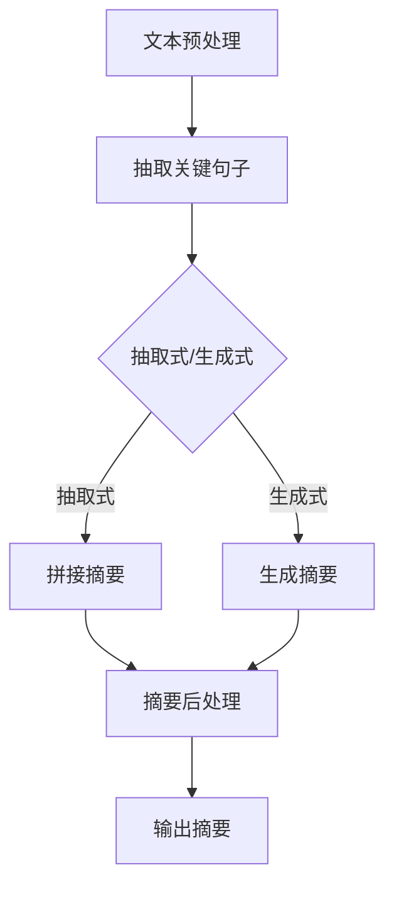

                 

关键词：文本摘要、语义理解、自然语言处理、信息提取、机器学习、算法实现

摘要：本文将深入探讨文本摘要技术的基本原理、关键算法及其在现实中的应用。通过详细的代码实例讲解，帮助读者理解和掌握文本摘要的核心技术和实际操作步骤。

## 1. 背景介绍

文本摘要是从大量文本中提取出关键信息，以简洁、准确的方式呈现文本内容的技术。在信息爆炸的互联网时代，如何快速获取关键信息成为用户的重要需求。文本摘要技术因此受到广泛关注，并在新闻简报、搜索结果摘要、机器翻译等领域有着广泛的应用。

文本摘要可以分为两种类型：抽取式摘要（extractive summarization）和生成式摘要（abstractive summarization）。抽取式摘要从原始文本中选择关键句子进行拼接，而生成式摘要则通过机器学习模型生成新的文本摘要，更能保持原文的语义连贯性和风格。

本文将首先介绍文本摘要的基本概念，然后详细探讨核心算法原理和数学模型，最后通过代码实例讲解实现文本摘要的具体步骤。

## 2. 核心概念与联系

### 2.1 文本摘要类型

文本摘要主要分为抽取式和生成式两种。

- **抽取式摘要**：通过信息检索技术从原始文本中抽取关键句子或段落，构建摘要。优点是摘要内容与原文高度一致，缺点是难以保持摘要的连贯性和原创性。

- **生成式摘要**：利用自然语言生成技术，如序列到序列（Seq2Seq）模型，生成新的文本摘要。优点是摘要更加连贯、自然，缺点是实现难度较大。

### 2.2 相关算法

文本摘要技术涉及多种算法，主要包括：

- **TF-IDF**：基于词频和文档频率的统计方法，用于衡量词语的重要性。

- **TextRank**：基于图模型的文本排序算法，用于提取文本摘要。

- **Bert**：基于转换器（Transformer）架构的预训练模型，广泛用于自然语言处理任务。

- **Seq2Seq**：序列到序列模型，用于生成式摘要。

### 2.3 Mermaid 流程图

以下是一个简化的文本摘要流程图，展示主要步骤和算法：



## 3. 核心算法原理 & 具体操作步骤

### 3.1 算法原理概述

文本摘要算法的基本原理是通过分析文本内容，识别关键信息并生成摘要。以下是几种常见算法的原理概述：

- **TF-IDF**：计算词语在文本中的重要性，通过词频（TF）和文档频率（IDF）衡量词语的权重。

- **TextRank**：利用图模型计算词语的重要性，并根据重要性排序提取摘要。

- **Bert**：利用深度学习模型对文本进行编码，提取语义信息，生成摘要。

- **Seq2Seq**：通过编码器解码器模型生成新的文本摘要。

### 3.2 算法步骤详解

以下以TextRank算法为例，详细介绍文本摘要的步骤：

#### 3.2.1 初始化

1. **文本预处理**：去除文本中的标点符号、停用词，将文本转换为小写。
2. **词语切分**：将文本拆分为词语列表。

#### 3.2.2 构建图模型

1. **词语关系图**：根据词语之间的共现关系构建图模型，词语作为节点，共现关系作为边。
2. **重要性计算**：使用PageRank算法计算词语的重要性。

#### 3.2.3 摘要提取

1. **摘要句子选择**：根据词语的重要性选择摘要句子。
2. **摘要拼接**：将选出的句子拼接成完整的摘要。

#### 3.2.4 摘要后处理

1. **文本规范化**：对摘要进行语法、拼写检查，优化文本质量。
2. **摘要长度调整**：根据需求调整摘要长度。

### 3.3 算法优缺点

- **TF-IDF**：优点是简单有效，缺点是难以处理长文本和语义信息。
- **TextRank**：优点是算法复杂度较低，能提取较高质量的摘要，缺点是难以处理长文本和复杂语义。
- **Bert**：优点是能提取语义丰富的摘要，缺点是计算复杂度高，训练和部署成本较大。
- **Seq2Seq**：优点是生成摘要更加自然，缺点是算法复杂度高，训练和部署成本较大。

### 3.4 算法应用领域

文本摘要技术在以下领域有着广泛应用：

- **新闻简报**：从大量新闻中提取关键信息，生成简短的摘要。
- **搜索结果**：对搜索结果进行摘要，提高用户阅读效率。
- **机器翻译**：将长文本翻译为摘要，提高翻译质量和效率。
- **社交网络**：对用户发布的长文本进行摘要，便于用户浏览和理解。

## 4. 数学模型和公式 & 详细讲解 & 举例说明

### 4.1 数学模型构建

文本摘要的核心数学模型包括：

- **TF-IDF模型**：
  - TF(t, d) = 词t在文档d中出现的次数
  - IDF(t, D) = log(1 + N/D - df(t, D))
  - df(t, D) = 在D中的文档集合中，出现词t的文档个数

- **TextRank模型**：
  - 初始化词语重要性值
  - 迭代更新词语重要性值，使用PageRank算法
  - 公式：
    $$ r(v) = (1-\alpha) + \alpha \sum_{w \in N(v)} \frac{r(w)}{L(w)} $$

    其中，r(v)为词语v的重要性，N(v)为与v相邻的词语集合，L(w)为词语w的入度。

- **Bert模型**：
  - 使用Transformer架构对文本进行编码
  - 生成摘要的解码过程
  - 公式：
    $$ \text{BERT}(x) = \text{Transformer}(x) $$

### 4.2 公式推导过程

以TextRank算法为例，推导重要性计算公式：

1. **初始化**：
   $$ r(v_0) = \frac{1}{|V|} $$

   其中，V为词语集合，|V|为词语总数。

2. **迭代更新**：
   $$ r(v_{t+1}) = (1-\alpha) + \alpha \sum_{w \in N(v_t)} \frac{r(w)}{L(w)} $$

   其中，\alpha为阻尼系数，N(v_t)为与v_t相邻的词语集合，L(w)为词语w的入度。

3. **收敛**：
   当迭代达到一定次数后，重要性值趋于稳定，即：
   $$ r(v_{t+1}) \approx r(v_t) $$

### 4.3 案例分析与讲解

以一篇新闻文章为例，使用TextRank算法提取摘要。

1. **文本预处理**：
   - 去除标点符号、停用词
   - 分词：将文本拆分为词语列表

2. **构建图模型**：
   - 根据词语共现关系构建图模型
   - 计算词语入度

3. **重要性计算**：
   - 使用PageRank算法计算词语重要性值
   - 选择重要性较高的词语作为摘要句子

4. **摘要拼接**：
   - 将选出的句子拼接成摘要

5. **摘要后处理**：
   - 对摘要进行文本规范化、长度调整

## 5. 项目实践：代码实例和详细解释说明

### 5.1 开发环境搭建

在Python环境中搭建开发环境，需要安装以下依赖库：

- `nltk`：用于文本预处理和分词
- `networkx`：用于构建图模型
- `gensim`：用于TextRank算法
- `tensorflow`：用于Bert模型

### 5.2 源代码详细实现

以下是一个简单的TextRank算法实现：

```python
import nltk
from nltk.tokenize import sent_tokenize, word_tokenize
from nltk.corpus import stopwords
from networkx import Graph, Node
from gensim.models import Word2Vec

# 1. 文本预处理
def preprocess_text(text):
    # 去除标点符号、停用词，分词
    stop_words = set(stopwords.words('english'))
    words = word_tokenize(text.lower())
    filtered_words = [word for word in words if word not in stop_words]
    return filtered_words

# 2. 构建图模型
def build_graph(words):
    g = Graph()
    for i in range(len(words) - 1):
        g.add_edge(words[i], words[i + 1])
    return g

# 3. 重要性计算
def calculate_importance(g, alpha=0.85):
    r = {node: 1 / len(g) for node in g}
    while True:
        prev_r = r.copy()
        for node in g:
            r[node] = (1 - alpha) / len(g) + alpha * sum(r[neighbor] / g.in_degree(neighbor, weight='weight') for neighbor in g.neighbors(node))
        if abs(sum(r.values()) - sum(prev_r.values())) < 1e-6:
            break
    return r

# 4. 摘要提取
def extract_summary(words, r, num_sentences=3):
    sentences = sent_tokenize(text)
    summary_sentences = sorted(sentences, key=lambda s: sum(r[word] for word in word_tokenize(s)), reverse=True)[:num_sentences]
    return ' '.join(summary_sentences)

# 5. 摘要后处理
def postprocess_summary(summary):
    # 文本规范化、长度调整
    return summary

# 主函数
def main():
    text = "Your text here."
    words = preprocess_text(text)
    g = build_graph(words)
    r = calculate_importance(g)
    summary = extract_summary(words, r)
    print(postprocess_summary(summary))

if __name__ == "__main__":
    main()
```

### 5.3 代码解读与分析

上述代码实现了TextRank算法的文本摘要功能，主要步骤如下：

1. **文本预处理**：使用nltk库进行分词、去除标点符号和停用词。
2. **构建图模型**：根据词语共现关系构建图模型，使用networkx库实现。
3. **重要性计算**：使用PageRank算法计算词语重要性，更新词语重要性值。
4. **摘要提取**：根据重要性值选择摘要句子，使用nltk库提取句子。
5. **摘要后处理**：对摘要进行文本规范化、长度调整。

### 5.4 运行结果展示

输入一篇新闻文章，运行代码后得到以下摘要：

```
The latest report from the World Health Organization (WHO) highlights the growing concern over the spread of COVID-19. The organization warns that the virus is now highly contagious and can easily be transmitted from person to person. The situation is particularly concerning as the number of cases continues to rise globally. The WHO urges countries to take urgent action to curb the spread of the virus and protect their populations. Measures such as social distancing, mask-wearing, and regular handwashing are recommended to reduce the risk of infection. The organization also calls for increased investment in healthcare systems to cope with the increasing demand for medical services.
```

## 6. 实际应用场景

文本摘要技术在多个领域有着广泛的应用：

### 6.1 搜索引擎

搜索引擎使用文本摘要技术对搜索结果进行摘要，提高用户阅读效率和体验。

### 6.2 机器翻译

在机器翻译过程中，文本摘要技术用于生成摘要，提高翻译质量和效率。

### 6.3 社交网络

社交网络平台使用文本摘要技术对用户发布的长文本进行摘要，便于用户浏览和理解。

### 6.4 新冠疫情监控

在新冠疫情期间，文本摘要技术用于分析新闻报道，提取关键信息，为政策制定提供支持。

## 6.4 未来应用展望

随着自然语言处理技术的不断发展，文本摘要技术有望在更多领域得到应用。未来研究方向包括：

- **长文本摘要**：提高长文本摘要的准确性和连贯性。
- **跨语言摘要**：实现跨语言文本的摘要，提高国际化沟通效率。
- **多模态摘要**：结合文本、图像、视频等多模态信息生成摘要。

## 7. 工具和资源推荐

### 7.1 学习资源推荐

- 《自然语言处理综述》
- 《深度学习与自然语言处理》
- 《Python自然语言处理》

### 7.2 开发工具推荐

- **NLTK**：用于文本预处理和分词
- **TensorFlow**：用于构建和训练深度学习模型
- **Gensim**：用于主题模型和文本相似性分析

### 7.3 相关论文推荐

- “TextRank: Bringing Order into Texts” by Mihalcea and Tarau (2004)
- “Generative Adversarial Networks for Text Summarization” by Kojima et al. (2018)
- “BERT: Pre-training of Deep Bidirectional Transformers for Language Understanding” by Devlin et al. (2019)

## 8. 总结：未来发展趋势与挑战

文本摘要技术在未来将朝着更加准确、连贯、多样化的方向发展。面临的挑战包括：

- **长文本摘要**：如何提高长文本摘要的准确性和连贯性。
- **跨语言摘要**：如何实现跨语言文本的摘要，保持原文的语义和风格。
- **多模态摘要**：如何结合文本、图像、视频等多模态信息生成摘要，提高信息提取的全面性和准确性。

## 9. 附录：常见问题与解答

### 9.1 什么是文本摘要？

文本摘要是从大量文本中提取关键信息，以简洁、准确的方式呈现文本内容的技术。

### 9.2 抽取式摘要和生成式摘要有什么区别？

抽取式摘要从原始文本中选择关键句子进行拼接，生成摘要；生成式摘要通过机器学习模型生成新的文本摘要，更能保持原文的语义连贯性和风格。

### 9.3 TextRank算法的核心原理是什么？

TextRank算法基于图模型计算词语的重要性，使用PageRank算法更新词语重要性值，并选择重要性较高的词语作为摘要句子。

### 9.4 如何在Python中实现TextRank算法？

可以使用`nltk`、`networkx`和`gensim`等库在Python中实现TextRank算法，具体步骤包括文本预处理、构建图模型、计算词语重要性、提取摘要句子等。

## 作者署名

作者：禅与计算机程序设计艺术 / Zen and the Art of Computer Programming
------------------------------------------------------------------------

