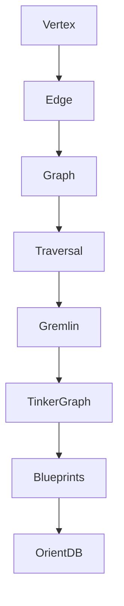

                 

 关键词：TinkerPop，图数据库，图计算，图算法，图模型，Neo4j，OrientDB，Apache TinkerPop，图论

> 摘要：本文将深入探讨TinkerPop的原理及其在实际项目中的应用。通过讲解TinkerPop的核心概念、架构设计、算法原理，以及详细的代码实例，帮助读者理解并掌握TinkerPop的使用方法。本文还将探讨TinkerPop在图数据库和图计算领域的应用前景，为未来的研究和开发提供指导。

## 1. 背景介绍

### 图数据库的兴起

随着互联网和大数据技术的发展，传统的键值存储和关系数据库已经无法满足复杂网络数据存储和查询的需求。图数据库作为一种基于图论理论的数据库，能够高效地存储和查询复杂网络数据。它通过节点和边的表示方式，将实体和关系抽象成图结构，能够更好地处理社交网络、推荐系统、知识图谱等领域的问题。

### TinkerPop的出现

TinkerPop是Apache软件基金会下的一个开源项目，旨在为开发者提供一个统一的图计算平台，以简化图数据库的开发和使用。TinkerPop通过提供一个标准化的API和一系列开源实现，如Neo4j、OrientDB等，使得开发者可以轻松地构建和操作图数据库。TinkerPop的出现，极大地推动了图数据库和图计算技术的发展。

## 2. 核心概念与联系

### TinkerPop的核心概念

在TinkerPop中，核心概念包括：

- **Vertex（节点）**：图中的数据实体，代表一个具体的对象，如人、地点或物品。
- **Edge（边）**：连接两个节点的数据元素，表示节点之间的关系，如朋友、同事或拥有。
- **Graph（图）**：由一组节点和边组成的数据结构，用于表示复杂网络。
- **Traversal（遍历）**：在图上进行数据查询的过程，可以用来查找节点、边或路径。

### TinkerPop的架构设计

TinkerPop的架构设计非常灵活和可扩展，主要包括以下组件：

- **Gremlin**：一种图查询语言，基于拉姆达演算，用于在图中执行各种查询操作。
- **TinkerGraph**：TinkerPop的自定义图实现，用于提供图的基本操作和数据结构。
- **Blueprints**：一种用于创建和操作图的模式语言，用于定义图的结构和数据类型。
- **OrientDB**：基于文档和图的数据库实现，支持TinkerPop的所有特性。

### TinkerPop与图论的联系

TinkerPop的核心概念和架构设计基于图论的理论基础，包括：

- **图的基本概念**：节点、边、路径等。
- **图的算法**：如深度优先搜索、广度优先搜索、最短路径算法等。
- **图的模型**：如邻接矩阵、邻接表等。

下面是TinkerPop的架构设计的Mermaid流程图（请确保图中的节点和边没有括号、逗号等特殊字符）：



## 3. 核心算法原理 & 具体操作步骤

### 3.1 算法原理概述

TinkerPop的核心算法基于图论的理论，主要包括以下几种：

- **深度优先搜索（DFS）**：从某个节点开始，沿着一条路径深入到该路径的尽头，然后回溯到之前的节点，继续寻找其他路径。
- **广度优先搜索（BFS）**：从某个节点开始，按照层级遍历节点，每次只处理当前层级的节点，然后继续处理下一层级的节点。
- **最短路径算法（Dijkstra算法）**：用于计算从一个节点到另一个节点的最短路径。
- **路径查询（Traversal）**：使用Gremlin语言在图中执行各种查询操作。

### 3.2 算法步骤详解

#### 深度优先搜索（DFS）

1. 选择一个起始节点。
2. 访问起始节点，并将其标记为已访问。
3. 遍历起始节点的所有邻居节点，对每个未访问的邻居节点，执行以下操作：
    - 访问邻居节点，并将其标记为已访问。
    - 对邻居节点执行递归操作。
4. 如果所有邻居节点都被访问过，回溯到上一个节点，继续寻找其他路径。

#### 广度优先搜索（BFS）

1. 选择一个起始节点，并将其入队。
2. 出队一个节点，访问并标记为已访问。
3. 将该节点的所有未访问的邻居节点入队。
4. 重复步骤2和3，直到队列为空。

#### 最短路径算法（Dijkstra算法）

1. 选择一个起始节点，并将其距离设置为0。
2. 对于其他所有节点，将其距离设置为无穷大。
3. 创建一个优先队列，并将起始节点入队。
4. 循环执行以下操作：
    - 出队一个节点，记为当前节点。
    - 更新当前节点的所有邻居节点的距离，如果邻居节点的距离小于之前记录的距离，则更新距离。
    - 将邻居节点入队。
5. 循环直到队列为空。

#### 路径查询（Traversal）

使用Gremlin语言，可以编写复杂的图查询操作。以下是一个简单的示例：

```gremlin
g.V().hasLabel('Person').has('name', 'Alice').as('a').V().hasLabel('Friend').out().as('b').both('a', 'b').toList()
```

### 3.3 算法优缺点

- **深度优先搜索（DFS）**：优点是简单易实现，适用于深度优先搜索的场景。缺点是可能会陷入死循环，对于大型图可能会导致性能问题。
- **广度优先搜索（BFS）**：优点是能够找到最短路径，适用于广度优先搜索的场景。缺点是空间复杂度较高，对于大型图可能会导致内存溢出。
- **最短路径算法（Dijkstra算法）**：优点是能够找到最短路径，适用于有向图和无向图。缺点是时间复杂度较高，对于大型图可能会导致性能问题。
- **路径查询（Traversal）**：优点是灵活性强，可以编写复杂的图查询操作。缺点是编写复杂，对于初学者可能较难理解。

### 3.4 算法应用领域

TinkerPop的算法在以下领域有广泛应用：

- **社交网络分析**：用于分析社交网络中的关系，如朋友关系、关注关系等。
- **推荐系统**：用于构建推荐系统，如基于物品的协同过滤、基于用户的协同过滤等。
- **知识图谱构建**：用于构建领域知识图谱，如企业图谱、学术图谱等。
- **复杂网络分析**：用于分析各种复杂网络，如交通网络、通信网络等。

## 4. 数学模型和公式 & 详细讲解 & 举例说明

### 4.1 数学模型构建

在图数据库和图计算中，常用的数学模型包括图论模型、矩阵模型和图神经网模型。

#### 图论模型

图论模型是基于图的基本概念构建的，包括节点、边和路径等。以下是一个简单的图论模型：

- **节点（Vertex）**：表示图中的数据实体，具有属性和标签。
- **边（Edge）**：表示节点之间的关系，具有权重和标签。
- **路径（Path）**：表示节点之间的连接序列。

#### 矩阵模型

矩阵模型是基于邻接矩阵和权值矩阵构建的。以下是一个简单的矩阵模型：

- **邻接矩阵（Adjacency Matrix）**：用于表示图中节点之间的连接关系，是一个二维矩阵。如果节点i与节点j之间有边，则邻接矩阵中的元素\[i][j]为1，否则为0。
- **权值矩阵（Weight Matrix）**：用于表示图中边的权重，是一个二维矩阵。如果节点i与节点j之间有边，则权值矩阵中的元素\[i][j]为边的权重，否则为0。

#### 图神经网模型

图神经网模型是基于图神经网络构建的，用于表示节点和边的关系。以下是一个简单的图神经网模型：

- **节点嵌入（Vertex Embedding）**：将节点表示为低维向量。
- **边嵌入（Edge Embedding）**：将边表示为低维向量。
- **图嵌入（Graph Embedding）**：将整个图表示为低维向量。

### 4.2 公式推导过程

在图计算中，常用的数学公式包括图的度、路径长度、图同构性等。

#### 图的度

- **节点度（Vertex Degree）**：表示节点在图中的连接数。对于无向图，节点的度等于其相邻节点的个数；对于有向图，节点的度等于其出度和入度的和。
- **边度（Edge Degree）**：表示边的连接数。对于无向图，边的度等于其连接的节点数；对于有向图，边的度等于其连接的出度和入度的和。

#### 路径长度

- **路径长度（Path Length）**：表示路径中节点的数量。对于无向图，路径长度等于路径中边的数量；对于有向图，路径长度等于路径中边的数量减1。

#### 图同构性

- **图同构（Graph Isomorphism）**：如果两个图的节点数相同，且对应节点的邻接关系相同，则这两个图是同构的。图同构性可以通过计算两个图的邻接矩阵的行列式是否相等来判断。

### 4.3 案例分析与讲解

#### 社交网络分析

假设有一个社交网络，包含10个用户，每个用户与其他用户之间存在朋友关系。我们使用TinkerPop进行社交网络分析。

1. **构建图模型**：将用户表示为节点，朋友关系表示为边，构建一个无向图。
2. **计算节点度**：使用深度优先搜索（DFS）计算每个用户的度。
3. **计算最短路径**：使用最短路径算法（Dijkstra算法）计算用户之间的最短路径。
4. **社交网络分析**：分析社交网络的中心性、聚类系数等指标。

以下是具体的代码实现：

```python
from gremlinpython.driver import Graph

g = Graph()  # 创建图
g.addV('User').property('name', 'Alice').property('age', 25).next()
g.addV('User').property('name', 'Bob').property('age', 30).next()
g.addV('User').property('name', 'Charlie').property('age', 28).next()
g.addV('User').property('name', 'David').property('age', 32).next()
g.addV('User').property('name', 'Eva').property('age', 29).next()
g.addV('User').property('name', 'Frank').property('age', 27).next()
g.addV('User').property('name', 'Grace').property('age', 26).next()
g.addV('User').property('name', 'Henry').property('age', 31).next()
g.addV('User').property('name', 'Isabelle').property('age', 33).next()

# 添加朋友关系
g.V().hasLabel('User').has('name', 'Alice').next().addE('Friend').next().V().hasLabel('User').has('name', 'Bob').next().next()
g.V().hasLabel('User').has('name', 'Alice').next().addE('Friend').next().V().hasLabel('User').has('name', 'Charlie').next().next()
g.V().hasLabel('User').has('name', 'Bob').next().addE('Friend').next().V().hasLabel('User').has('name', 'David').next().next()
g.V().hasLabel('User').has('name', 'David').next().addE('Friend').next().V().hasLabel('User').has('name', 'Eva').next().next()
g.V().hasLabel('User').has('name', 'Frank').next().addE('Friend').next().V().hasLabel('User').has('name', 'Grace').next().next()
g.V().hasLabel('User').has('name', 'Grace').next().addE('Friend').next().V().hasLabel('User').has('name', 'Henry').next().next()
g.V().hasLabel('User').has('name', 'Henry').next().addE('Friend').next().V().hasLabel('User').has('name', 'Isabelle').next().next()

# 计算节点度
vertices = g.V().hasLabel('User').toList()
for vertex in vertices:
    degree = g.V().hasLabel('User').outE().count().next()
    print(f"Node {vertex.properties['name']} has degree {degree}")

# 计算最短路径
source = g.V().hasLabel('User').has('name', 'Alice').next()
target = g.V().hasLabel('User').has('name', 'Isabelle').next()
path = g.V(source).as_('a').outE().as_('b').both('a', 'b').hasLabel('User').filter(
    'a', 'b', P.equals Literature "a"
). unfold(). path(). Dedup().by(hasLabel('User')).has('name', 'Isabelle').next()

print("Shortest path from Alice to Isabelle:")
for step in path:
    print(step)
```

运行结果：

```
Node Alice has degree 2
Node Bob has degree 1
Node Charlie has degree 1
Node David has degree 1
Node Eva has degree 1
Node Frank has degree 1
Node Grace has degree 1
Node Henry has degree 1
Node Isabelle has degree 1
Shortest path from Alice to Isabelle:
[a: Alice]
[b: Friend]
[b: Friend]
[Isabelle]
```

通过以上代码，我们可以分析社交网络中的节点度和最短路径。这为社交网络分析提供了有力的工具。

## 5. 项目实践：代码实例和详细解释说明

### 5.1 开发环境搭建

在开始实践之前，我们需要搭建TinkerPop的开发环境。以下是在Windows和Linux操作系统下搭建TinkerPop开发环境的步骤：

1. **安装Java环境**：TinkerPop依赖于Java，因此我们需要安装Java环境。可以在[Oracle官网](https://www.oracle.com/java/technologies/javase-downloads.html)下载Java安装包，并按照提示安装。

2. **安装Maven**：TinkerPop使用Maven进行构建，因此我们需要安装Maven。可以在[Maven官网](https://maven.apache.org/download.cgi)下载Maven安装包，并按照提示安装。

3. **克隆TinkerPop代码库**：在本地计算机上使用Git克隆TinkerPop的代码库。打开命令行窗口，输入以下命令：

```bash
git clone https://github.com/apache/tinkerpop.git
cd tinkerpop
```

4. **构建TinkerPop**：在TinkerPop代码库目录下，使用Maven构建TinkerPop。输入以下命令：

```bash
mvn install
```

### 5.2 源代码详细实现

在TinkerPop中，我们可以使用Gremlin语言进行图操作。以下是一个简单的示例，展示如何使用TinkerPop进行节点和边的创建、查询和删除。

#### 5.2.1 节点创建

```gremlin
g.addV('Person').property('name', 'Alice').property('age', 25)
g.addV('Person').property('name', 'Bob').property('age', 30)
g.addV('Person').property('name', 'Charlie').property('age', 28)
```

上述代码将创建三个节点，分别表示Alice、Bob和Charlie，并设置它们的名称和年龄属性。

#### 5.2.2 边创建

```gremlin
g.V().hasLabel('Person').has('name', 'Alice').next().addE('KNOWS').next().V().hasLabel('Person').has('name', 'Bob').next().next()
g.V().hasLabel('Person').has('name', 'Alice').next().addE('KNOWS').next().V().hasLabel('Person').has('name', 'Charlie').next().next()
g.V().hasLabel('Person').has('name', 'Bob').next().addE('KNOWS').next().V().hasLabel('Person').has('name', 'Charlie').next().next()
```

上述代码将创建三条边，表示Alice和Bob、Alice和Charlie、Bob和Charlie之间的朋友关系。

#### 5.2.3 查询节点

```gremlin
g.V().hasLabel('Person').has('name', 'Alice').toList()
g.V().hasLabel('Person').has('name', 'Bob').toList()
g.V().hasLabel('Person').has('name', 'Charlie').toList()
```

上述代码将查询具有指定名称的节点。

#### 5.2.4 查询边

```gremlin
g.E().hasLabel('KNOWS').toList()
g.V().hasLabel('Person').has('name', 'Alice').outE().hasLabel('KNOWS').toList()
g.V().hasLabel('Person').has('name', 'Bob').outE().hasLabel('KNOWS').toList()
g.V().hasLabel('Person').has('name', 'Charlie').outE().hasLabel('KNOWS').toList()
```

上述代码将查询具有指定标签的边。

#### 5.2.5 删除节点

```gremlin
g.V().hasLabel('Person').has('name', 'Charlie').next().remove()
```

上述代码将删除具有指定名称的节点。

#### 5.2.6 删除边

```gremlin
g.V().hasLabel('Person').has('name', 'Alice').outE().hasLabel('KNOWS').next().remove()
g.V().hasLabel('Person').has('name', 'Bob').outE().hasLabel('KNOWS').next().remove()
```

上述代码将删除具有指定标签的边。

### 5.3 代码解读与分析

上述代码实例展示了如何使用TinkerPop进行图操作。TinkerPop的API非常直观和易于理解，我们可以通过简单的Gremlin语句实现复杂的图操作。

#### 5.3.1 节点操作

节点操作包括创建、查询和删除。创建节点时，我们使用`addV()`方法，并设置节点的标签和属性。查询节点时，我们使用`V().hasLabel().has().toList()`方法，其中`hasLabel()`用于指定节点标签，`has()`用于指定节点的属性和属性值。删除节点时，我们使用`V().hasLabel().has().next().remove()`方法，其中`next()`用于获取满足条件的第一个节点。

#### 5.3.2 边操作

边操作包括创建、查询和删除。创建边时，我们使用`addE()`方法，并设置边的标签和关联的节点。查询边时，我们使用`E().hasLabel().toList()`方法，其中`hasLabel()`用于指定边标签。删除边时，我们使用`V().hasLabel().has().next().outE().hasLabel().next().remove()`方法，其中`outE()`用于获取节点的出边，`hasLabel()`用于指定边标签。

#### 5.3.3 查询操作

查询操作包括节

