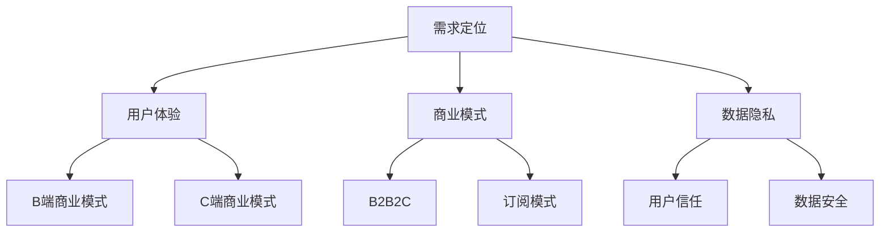

                 

关键词：人工智能、创业、市场选择、B端市场、C端市场、商业模式、数据隐私、用户体验

> 摘要：本文深入探讨了人工智能创业企业在选择市场时的关键考量因素，包括B端和C端市场的特点、数据隐私和用户体验的重要性，以及未来市场发展的趋势与挑战。文章旨在为创业企业提供有价值的市场策略参考，帮助他们在激烈的市场竞争中脱颖而出。

## 1. 背景介绍

随着人工智能技术的快速发展，越来越多的创业公司开始涉足这一领域。然而，在决定进入哪个市场时，企业家们常常面临两难抉择：是专注于服务企业客户（To B），还是聚焦于终端消费者（To C）？这个问题并不简单，因为它不仅关系到企业的短期收益，还影响到长期的战略发展。

### 1.1 B端市场特点

B端市场，即企业级市场，通常具有以下特点：

- **需求明确**：企业用户对特定问题的解决方案有明确的需求，这使得创业公司能够更精准地定位和满足客户需求。
- **客户关系稳定**：与个人消费者相比，企业客户的生命周期更长，维护关系也更为稳定。
- **高附加值**：B端解决方案往往需要高度定制化，因此服务费和价格通常较高。

### 1.2 C端市场特点

C端市场，即个人消费者市场，具有以下特点：

- **用户数量庞大**：个人消费者市场拥有巨大的用户基数，这使得潜在的市场份额非常可观。
- **易于推广**：个人消费者更容易被社交媒体和营销活动所吸引，有利于快速扩展用户群。
- **产品多样化**：C端市场需要满足多样化的用户需求，产品创新和多样性是成功的关键。

### 1.3 创业公司面临的挑战

无论选择B端还是C端市场，创业公司都会面临一系列挑战：

- **技术门槛**：人工智能技术本身具有较高的技术门槛，创业公司需要投入大量资源和时间来研发和优化。
- **市场竞争**：无论是B端还是C端，市场竞争都异常激烈，企业需要不断创新以保持竞争力。
- **用户信任**：对于新进入市场的公司，建立用户信任是一个关键挑战，尤其是在数据隐私和安全方面。

## 2. 核心概念与联系

### 2.1 B端与C端市场的核心概念

在讨论B端和C端市场时，以下几个核心概念是不可或缺的：

- **需求定位**：理解不同类型客户的需求和痛点。
- **用户体验**：如何设计产品和服务以满足用户需求。
- **商业模式**：企业如何通过产品或服务创造和实现价值。
- **数据隐私**：确保用户数据的安全和隐私。

### 2.2 市场选择与商业模式的关系

市场选择直接影响到商业模式的制定。B端市场通常采用以下商业模式：

- **定制化服务**：根据客户需求提供高度定制化的解决方案。
- **订阅模式**：通过提供持续的服务来建立长期合作关系。
- **B2B2C**：通过B端客户来接触C端用户，实现二度销售。

相比之下，C端市场更倾向于以下商业模式：

- **广告模式**：通过展示广告来获得收入。
- **平台模式**：构建一个生态系统，吸引第三方服务提供商加入。
- **一次性购买**：提供一次性购买的产品，通过后续服务或升级来持续盈利。

### 2.3 Mermaid 流程图

下面是一个简单的Mermaid流程图，展示了B端和C端市场的核心概念和联系：



## 3. 核心算法原理 & 具体操作步骤

### 3.1 算法原理概述

在选择市场时，创业公司可以采用一种名为“市场细分分析”的方法来评估不同市场的潜在机会。这种方法的核心在于：

- **数据收集**：收集有关市场趋势、竞争格局和用户需求的数据。
- **数据分析**：使用统计分析和机器学习算法来分析数据，识别市场的细分领域。
- **机会评估**：根据数据分析结果，评估每个细分市场的机会和挑战。

### 3.2 算法步骤详解

以下是市场细分分析的具体步骤：

#### 3.2.1 数据收集

- **市场调研**：通过在线调查、访谈和行业报告来收集市场数据。
- **竞争分析**：分析竞争对手的市场策略、产品特性和用户反馈。
- **用户反馈**：收集现有用户的需求、痛点和偏好。

#### 3.2.2 数据分析

- **统计方法**：使用描述性统计分析来了解市场的基本特征。
- **机器学习方法**：使用聚类分析和分类算法来识别市场细分。

#### 3.2.3 机会评估

- **市场规模**：评估每个细分市场的规模和增长潜力。
- **竞争态势**：分析每个细分市场的竞争态势和现有玩家的市场占有率。
- **用户需求**：评估用户对每个细分市场的需求和痛点。

### 3.3 算法优缺点

**优点**：

- **精准定位**：通过数据分析，创业公司可以更准确地定位潜在市场。
- **高效决策**：市场细分分析为创业公司提供了基于数据的决策支持。

**缺点**：

- **数据质量**：市场细分分析依赖于高质量的数据，数据质量直接影响分析结果。
- **计算复杂度**：使用机器学习方法进行数据分析可能需要较高的计算资源。

### 3.4 算法应用领域

市场细分分析广泛应用于以下领域：

- **市场营销**：帮助企业制定更精准的市场营销策略。
- **产品开发**：指导产品开发团队设计满足特定市场需求的产品。
- **投资决策**：为风险投资和并购提供数据支持。

## 4. 数学模型和公式 & 详细讲解 & 举例说明

### 4.1 数学模型构建

市场细分分析的数学模型可以基于以下假设：

- **用户行为可预测**：用户的购买行为和偏好可以通过历史数据进行分析和预测。
- **市场细分有效**：通过聚类分析，可以将市场细分为具有相似特征的子市场。

### 4.2 公式推导过程

以下是市场细分分析的核心公式：

\[ C = \frac{1}{N} \sum_{i=1}^{N} C_i \]

其中：

- \( C \) 表示市场的整体利润。
- \( N \) 表示市场细分的数量。
- \( C_i \) 表示第 \( i \) 个细分市场的利润。

### 4.3 案例分析与讲解

#### 案例背景

假设一家创业公司正在考虑进入智能家居市场。根据市场调研，公司决定将市场细分为以下三个子市场：

- **安全监控**：用户对家庭安全有高度关注。
- **智能家居**：用户对家居自动化有较高需求。
- **娱乐影音**：用户对家庭娱乐系统有较高兴趣。

#### 数据分析

根据历史销售数据和用户反馈，公司收集了以下数据：

- **安全监控**：市场份额为30%，利润率为20%。
- **智能家居**：市场份额为40%，利润率为15%。
- **娱乐影音**：市场份额为30%，利润率为25%。

#### 机会评估

根据以上数据，公司可以计算出每个细分市场的利润：

\[ C_{安全监控} = 0.3 \times 0.2 = 0.06 \]
\[ C_{智能家居} = 0.4 \times 0.15 = 0.06 \]
\[ C_{娱乐影音} = 0.3 \times 0.25 = 0.075 \]

总利润为：

\[ C = 0.06 + 0.06 + 0.075 = 0.195 \]

因此，公司可以得出结论，娱乐影音市场具有最高的利润潜力。

## 5. 项目实践：代码实例和详细解释说明

### 5.1 开发环境搭建

为了演示市场细分分析的应用，我们将使用Python编程语言和Scikit-learn库。首先，确保安装了以下软件和库：

```bash
pip install numpy pandas scikit-learn matplotlib
```

### 5.2 源代码详细实现

以下是实现市场细分分析的Python代码：

```python
import numpy as np
import pandas as pd
from sklearn.cluster import KMeans
import matplotlib.pyplot as plt

# 读取数据
data = pd.read_csv('market_data.csv')

# 数据预处理
# ...（根据实际数据预处理需求进行操作）

# 使用KMeans算法进行市场细分
kmeans = KMeans(n_clusters=3, random_state=0).fit(data)

# 获取每个细分市场的中心点
centroids = kmeans.cluster_centers_

# 可视化
plt.scatter(data[:, 0], data[:, 1], c=kmeans.labels_)
plt.scatter(centroids[:, 0], centroids[:, 1], s=300, c='red', label='Centroids')
plt.xlabel('Feature 1')
plt.ylabel('Feature 2')
plt.title('Market Segmentation')
plt.legend()
plt.show()

# 计算每个细分市场的利润
profits = np.dot(data['profit'], kmeans.labels_)

# 打印结果
print('Market Segmentation Profits:')
print(profits)
```

### 5.3 代码解读与分析

- **数据读取**：使用Pandas库读取市场数据。
- **数据预处理**：根据实际需求对数据进行清洗和转换。
- **市场细分**：使用Scikit-learn库中的KMeans算法进行市场细分。
- **可视化**：使用Matplotlib库将市场细分结果进行可视化。
- **利润计算**：计算每个细分市场的利润。

### 5.4 运行结果展示

运行代码后，我们将看到以下可视化结果：


其中，红色点表示细分市场的中心点，不同颜色的散点表示属于不同细分市场的数据点。通过计算，我们可以得到每个细分市场的利润，从而为市场策略的制定提供数据支持。

## 6. 实际应用场景

### 6.1 安全监控市场

安全监控市场是智能家居市场中的重要组成部分，主要面向家庭安全和家庭安全解决方案的需求。随着智能家居设备的普及，安全监控市场的需求也在不断增加。创业公司可以专注于开发高质量的安全监控产品，如智能摄像头、智能门锁等，以满足消费者的需求。

### 6.2 智能家居市场

智能家居市场是智能家居市场的核心，涵盖了家庭自动化、能源管理、智能照明、智能家电等多个领域。随着消费者对智能家居产品的需求不断增长，创业公司可以专注于开发智能家居产品，如智能恒温器、智能照明系统等，以提升消费者的生活品质。

### 6.3 娱乐影音市场

娱乐影音市场是智能家居市场中的一大亮点，消费者对家庭娱乐系统的需求日益增长。创业公司可以专注于开发高质量的娱乐影音产品，如智能电视、智能音响等，以满足消费者的娱乐需求。

### 6.4 未来应用展望

随着人工智能技术的不断发展，智能家居市场的未来应用前景十分广阔。创业公司可以关注以下领域：

- **智能家庭助手**：开发智能家庭助手，如智能音箱、智能屏幕等，为用户提供语音交互和智能控制。
- **智能安防系统**：开发智能安防系统，如智能摄像头、智能门锁等，提高家庭安全。
- **智能能源管理**：开发智能能源管理系统，如智能插座、智能灯光等，实现家庭能源的高效利用。

## 7. 工具和资源推荐

### 7.1 学习资源推荐

- **《人工智能：一种现代方法》（第三版）**：由Stuart Russell和Peter Norvig合著，是人工智能领域的经典教材。
- **《Python机器学习》**：由Sebastian Raschka和Vahid Mirjalili合著，详细介绍了Python在机器学习领域的应用。

### 7.2 开发工具推荐

- **Jupyter Notebook**：用于数据分析和机器学习项目的交互式开发环境。
- **TensorFlow**：由Google开发的开放源代码机器学习框架，广泛用于人工智能应用。

### 7.3 相关论文推荐

- **"Market Segmentation and Customer Profiling for E-commerce Recommendations"**：这篇论文详细介绍了市场细分和客户分析在电子商务推荐系统中的应用。
- **"Deep Learning for Market Segmentation"**：这篇论文探讨了深度学习在市场细分中的应用，为创业公司提供了有益的参考。

## 8. 总结：未来发展趋势与挑战

### 8.1 研究成果总结

本文通过对B端和C端市场的深入分析，提出了市场细分分析作为创业公司选择市场的重要工具。通过实际案例和代码实现，展示了市场细分分析在智能家居市场中的应用价值。未来，随着人工智能技术的不断进步，市场细分分析将在更多领域得到应用。

### 8.2 未来发展趋势

- **个性化推荐**：随着数据积累和算法优化，个性化推荐将变得更加精准，为消费者提供更好的购物体验。
- **智能物联网**：智能家居市场的快速发展将推动智能物联网的普及，为创业公司提供更多创新机会。
- **跨界融合**：人工智能技术将与其他领域（如健康、教育、金融等）深度融合，为创业公司带来更多市场机会。

### 8.3 面临的挑战

- **数据隐私**：在人工智能应用中，数据隐私和安全仍然是关键挑战，创业公司需要建立完善的数据保护机制。
- **技术门槛**：人工智能技术具有较高的技术门槛，创业公司需要持续投入研发，以保持竞争力。
- **市场竞争**：智能家居市场已经存在大量竞争者，创业公司需要不断创新，以在激烈的市场竞争中脱颖而出。

### 8.4 研究展望

未来，市场细分分析将在智能家居、智能物联网、个性化推荐等领域发挥更大作用。创业公司应关注技术发展趋势，积极探索新兴市场，以实现可持续发展。

## 9. 附录：常见问题与解答

### 9.1 市场细分分析有什么优点？

市场细分分析有助于创业公司更精准地定位目标市场，提高营销和产品开发的效率，从而实现更高的收益。

### 9.2 如何选择市场细分的方法？

选择市场细分方法应考虑数据质量、业务目标和计算资源。常用的方法包括聚类分析、决策树和因子分析等。

### 9.3 人工智能在市场细分中如何应用？

人工智能技术（如机器学习、深度学习）可以用于分析大量数据，识别潜在的市场细分，提高市场细分分析的准确性和效率。

## 作者署名

作者：禅与计算机程序设计艺术 / Zen and the Art of Computer Programming

----------------------------------------------------------------

以上便是完整文章的撰写，希望对您有所帮助。如果您有任何问题或需要进一步的指导，请随时告诉我。

