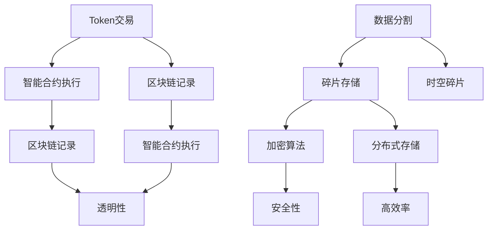

                 

关键词：Token、时空碎片、技术对比、区块链、分布式存储、加密算法

> 摘要：本文将深入探讨Token和时空碎片这两种技术的核心概念、架构原理及其在实际应用中的表现。通过对这两种技术的对比分析，我们将揭示其各自的优缺点、适用场景及未来发展趋势，为读者提供全面的参考。

## 1. 背景介绍

随着互联网技术的快速发展，数据安全和隐私保护变得越来越重要。分布式存储技术和加密算法成为了解决这一问题的热门方向。Token和时空碎片正是这两大领域中的重要技术。

Token是一种加密资产，它代表了一种特定的权益或价值。在区块链技术中，Token通常用于激励用户参与网络治理、支付交易费用或代表某种虚拟货币。而时空碎片则是一种基于分布式存储的加密技术，旨在提供一种安全、高效的数据存储解决方案。

本文将从以下几个方面对Token和时空碎片进行技术对比：

1. 核心概念与联系
2. 核心算法原理 & 具体操作步骤
3. 数学模型和公式 & 详细讲解 & 举例说明
4. 项目实践：代码实例和详细解释说明
5. 实际应用场景
6. 未来应用展望
7. 工具和资源推荐
8. 总结：未来发展趋势与挑战

通过以上对比分析，我们将对这两种技术有一个全面的了解，并为后续的研究和应用提供参考。

## 2. 核心概念与联系

首先，让我们详细探讨Token和时空碎片的核心概念。

### 2.1 Token

Token是一种基于区块链技术的加密资产。它可以通过智能合约创建和发行，用于代表某种权益、价值或货币。Token可以分为以下几种类型：

- **权益Token**：代表某种权益，如股权、投票权等。
- **支付Token**：用于支付交易费用或代表某种虚拟货币。
- **治理Token**：用于参与区块链网络治理，如投票、提案等。

Token的核心优势在于其去中心化、透明性和安全性。由于Token存储在区块链上，其交易记录不可篡改，从而保证了数据的真实性。同时，Token的发行和管理由智能合约自动执行，减少了人为干预，提高了效率。

### 2.2 时空碎片

时空碎片是一种基于分布式存储的加密技术。它通过将数据分割成小块，并分散存储在多个节点上，从而实现数据的分布式存储和安全。时空碎片的核心理念包括：

- **数据分割**：将数据分割成多个小块，每个小块称为一个碎片。
- **碎片存储**：将碎片分散存储在多个节点上，每个节点存储不同碎片的组合。
- **加密算法**：对数据进行加密，确保数据在传输和存储过程中的安全性。

时空碎片的核心优势在于其高安全性和高效性。通过分布式存储，时空碎片能够实现数据的去中心化，从而提高系统的容错性和可扩展性。同时，加密算法确保了数据在传输和存储过程中的安全性，防止未经授权的访问和篡改。

### 2.3 Mermaid 流程图

为了更好地理解Token和时空碎片的架构原理，我们使用Mermaid流程图进行展示。



图1：Token与时空碎片的架构原理

通过图1可以看出，Token和时空碎片在架构原理上存在一定的相似性。它们都采用了分布式存储和加密算法，以提高数据的安全性和效率。然而，Token更注重于权益和价值的代表，而时空碎片则更侧重于数据存储和共享。

## 3. 核心算法原理 & 具体操作步骤

### 3.1 算法原理概述

Token和时空碎片在算法原理上具有显著的差异。下面分别介绍它们的算法原理。

### 3.1.1 Token算法原理

Token算法主要基于区块链技术，其核心原理包括：

- **去中心化**：Token存储在区块链上，由网络中的多个节点共同维护。
- **加密算法**：Token的生成、交易和记录过程都使用加密算法，确保数据的安全性和隐私性。
- **智能合约**：Token的发行、交易和治理过程由智能合约自动执行，减少了人为干预。

Token算法的具体操作步骤如下：

1. **生成Token**：创建一个智能合约，用于生成Token。智能合约定义了Token的总供应量、发行规则等。
2. **Token交易**：用户可以在区块链上进行Token的交易，交易记录会存储在区块链上，确保不可篡改。
3. **智能合约执行**：根据智能合约的规则，执行Token的发行、交易和治理过程。

### 3.1.2 时空碎片算法原理

时空碎片算法主要基于分布式存储和加密技术，其核心原理包括：

- **数据分割**：将数据分割成多个小块，每个小块称为一个碎片。
- **碎片存储**：将碎片分散存储在多个节点上，每个节点存储不同碎片的组合。
- **加密算法**：对数据进行加密，确保数据在传输和存储过程中的安全性。
- **分布式存储**：通过分布式存储，实现数据的去中心化和高容错性。

时空碎片算法的具体操作步骤如下：

1. **数据分割**：将数据分割成多个小块，每个小块的大小可以根据需求进行设置。
2. **碎片存储**：将碎片分散存储在多个节点上，每个节点存储不同碎片的组合。存储过程中，对数据进行加密，确保数据的安全性。
3. **数据检索**：当需要检索数据时，系统会从多个节点中获取所需的碎片，并对碎片进行加密解密和重组，最终恢复原始数据。

### 3.2 算法步骤详解

下面分别对Token和时空碎片的算法步骤进行详细讲解。

### 3.2.1 Token算法步骤详解

1. **生成Token**：

- 创建一个智能合约，用于生成Token。智能合约定义了Token的总供应量、发行规则等。
- 通过调用智能合约，生成Token。Token的生成过程包括以下步骤：

  - 确定Token的发行时间、发行总量和分配比例。
  - 将Token记录在区块链上，确保数据的不可篡改。

2. **Token交易**：

- 用户可以在区块链上进行Token的交易。交易过程包括以下步骤：

  - 用户发送交易请求，包括交易金额、接收方地址等。
  - 区块链网络中的节点对交易请求进行验证，确保交易的合法性和安全性。
  - 将交易记录存储在区块链上，确保数据不可篡改。

3. **智能合约执行**：

- 根据智能合约的规则，执行Token的发行、交易和治理过程。智能合约执行过程包括以下步骤：

  - 检查交易请求是否符合智能合约的规则。
  - 更新区块链上的Token余额和交易记录。
  - 根据智能合约的规则，执行其他相关操作，如投票、提案等。

### 3.2.2 时空碎片算法步骤详解

1. **数据分割**：

- 将数据分割成多个小块，每个小块的大小可以根据需求进行设置。分割过程包括以下步骤：

  - 读取待分割的数据。
  - 根据设定的分割大小，将数据分割成多个小块。
  - 对每个小块进行编号，以便后续存储和检索。

2. **碎片存储**：

- 将碎片分散存储在多个节点上，每个节点存储不同碎片的组合。存储过程包括以下步骤：

  - 生成存储节点列表，包括所有参与存储的节点。
  - 对每个碎片进行加密，确保数据的安全性。
  - 将加密后的碎片分配给不同的节点进行存储。

3. **数据检索**：

- 当需要检索数据时，系统会从多个节点中获取所需的碎片，并对碎片进行加密解密和重组，最终恢复原始数据。检索过程包括以下步骤：

  - 根据数据分割时生成的编号，确定需要检索的碎片。
  - 从存储节点中获取所需的碎片。
  - 对碎片进行加密解密，并按编号重组，恢复原始数据。

### 3.3 算法优缺点

#### 3.3.1 Token算法优缺点

**优点**：

- **去中心化**：Token存储在区块链上，由网络中的多个节点共同维护，具有去中心化的特点。
- **安全性**：Token的生成、交易和记录过程都使用加密算法，确保数据的安全性和隐私性。
- **透明性**：Token的交易记录存储在区块链上，具有高度的透明性，便于用户查询和验证。

**缺点**：

- **性能问题**：区块链技术具有较低的TPS（每秒交易次数），可能导致Token交易的延迟和拥堵。
- **扩展性问题**：区块链的扩展性较低，难以满足大规模应用的需求。

#### 3.3.2 时空碎片算法优缺点

**优点**：

- **高安全性**：时空碎片采用分布式存储和加密技术，确保数据在传输和存储过程中的安全性。
- **高效性**：时空碎片通过分布式存储和并行处理，提高了数据的访问和检索速度。
- **容错性**：分布式存储提高了系统的容错性，即使某个节点故障，也不会影响数据的完整性和可用性。

**缺点**：

- **存储成本**：由于时空碎片采用分布式存储，需要大量存储资源，可能导致存储成本较高。
- **数据一致性**：分布式存储可能导致数据一致性问题，需要额外的同步和校验机制。

### 3.4 算法应用领域

Token和时空碎片在应用领域上存在一定的差异。

#### 3.4.1 Token应用领域

Token主要应用于区块链领域，如：

- **数字货币**：Token可以代表某种虚拟货币，用于支付交易费用或购买虚拟商品。
- **去中心化应用**（DApp）：Token可以用于DApp的用户激励和权益分配。
- **智能合约**：Token可以用于智能合约的执行，如投票、提案等。

#### 3.4.2 时空碎片应用领域

时空碎片主要应用于分布式存储和数据安全领域，如：

- **数据存储**：时空碎片可以用于大规模数据的分布式存储，提高数据的访问速度和安全性能。
- **数据安全**：时空碎片可以用于数据加密和解密，确保数据在传输和存储过程中的安全性。
- **区块链扩展**：时空碎片可以与区块链技术结合，提高区块链的性能和扩展性。

## 4. 数学模型和公式 & 详细讲解 & 举例说明

### 4.1 数学模型构建

为了更好地理解和分析Token和时空碎片的算法原理，我们构建以下数学模型。

#### 4.1.1 Token数学模型

Token的数学模型主要涉及以下几个方面：

- **Token供应量**：表示Token的总供应量，用\( T \)表示。
- **Token余额**：表示某个账户的Token余额，用\( B \)表示。
- **交易金额**：表示某次交易金额，用\( A \)表示。
- **交易次数**：表示某段时间内交易次数，用\( N \)表示。
- **交易速率**：表示交易频率，用\( R \)表示。

Token的数学模型可以表示为：

\[ T = B \times N \times R \]

#### 4.1.2 时空碎片数学模型

时空碎片的数学模型主要涉及以下几个方面：

- **数据分割大小**：表示每次分割的数据块大小，用\( S \)表示。
- **碎片数量**：表示数据分割后的碎片数量，用\( M \)表示。
- **存储节点数量**：表示参与存储的节点数量，用\( N \)表示。
- **数据访问次数**：表示某段时间内数据访问次数，用\( V \)表示。
- **数据访问速度**：表示数据访问速度，用\( T \)表示。

时空碎片的数学模型可以表示为：

\[ S = M \times N \times V \times T \]

### 4.2 公式推导过程

下面分别对Token和时空碎片的数学模型进行推导。

#### 4.2.1 Token数学模型推导

Token的数学模型推导如下：

1. **Token供应量**：

\[ T = B \times N \times R \]

Token的总供应量等于账户余额（\( B \)）乘以交易次数（\( N \)）和交易速率（\( R \)）。

2. **Token余额**：

\[ B = \frac{T}{N \times R} \]

账户余额等于总供应量（\( T \）除以交易次数（\( N \)）和交易速率（\( R \)）。

3. **交易金额**：

\[ A = B \times R \]

交易金额等于账户余额（\( B \）乘以交易速率（\( R \)）。

4. **交易次数**：

\[ N = \frac{T}{B \times R} \]

交易次数等于总供应量（\( T \）除以账户余额（\( B \）和交易速率（\( R \））。

5. **交易速率**：

\[ R = \frac{T}{N \times B} \]

交易速率等于总供应量（\( T \）除以交易次数（\( N \）和账户余额（\( B \））。

#### 4.2.2 时空碎片数学模型推导

时空碎片的数学模型推导如下：

1. **数据分割大小**：

\[ S = M \times N \times V \times T \]

每次分割的数据块大小等于碎片数量（\( M \）乘以存储节点数量（\( N \）数据访问次数（\( V \）和数据访问速度（\( T \）。

2. **碎片数量**：

\[ M = \frac{S}{N \times V \times T} \]

碎片数量等于每次分割的数据块大小（\( S \）除以存储节点数量（\( N \）数据访问次数（\( V \）和数据访问速度（\( T \）。

3. **存储节点数量**：

\[ N = \frac{S}{M \times V \times T} \]

存储节点数量等于每次分割的数据块大小（\( S \）除以碎片数量（\( M \）数据访问次数（\( V \）和数据访问速度（\( T \）。

4. **数据访问次数**：

\[ V = \frac{S}{M \times N \times T} \]

数据访问次数等于每次分割的数据块大小（\( S \）除以碎片数量（\( M \）存储节点数量（\( N \）和数据访问速度（\( T \）。

5. **数据访问速度**：

\[ T = \frac{S}{M \times N \times V} \]

数据访问速度等于每次分割的数据块大小（\( S \）除以碎片数量（\( M \）存储节点数量（\( N \）和数据访问次数（\( V \）。

### 4.3 案例分析与讲解

为了更好地理解Token和时空碎片的数学模型，我们通过以下案例进行分析。

#### 4.3.1 Token案例分析

假设一个区块链项目，Token的总供应量为100万，账户余额为10万。一段时间内，交易次数为1000次，交易速率为100次/天。根据Token的数学模型，我们可以计算出以下参数：

1. **Token供应量**：

\[ T = B \times N \times R = 10万 \times 1000 \times 100 = 1亿 \]

Token的总供应量为1亿。

2. **Token余额**：

\[ B = \frac{T}{N \times R} = \frac{1亿}{1000 \times 100} = 1万 \]

账户余额为1万。

3. **交易金额**：

\[ A = B \times R = 1万 \times 100 = 1亿 \]

交易金额为1亿。

4. **交易次数**：

\[ N = \frac{T}{B \times R} = \frac{1亿}{1万 \times 100} = 1000 \]

交易次数为1000次。

5. **交易速率**：

\[ R = \frac{T}{N \times B} = \frac{1亿}{1000 \times 1万} = 100 \]

交易速率为100次/天。

#### 4.3.2 时空碎片案例分析

假设一个分布式存储项目，每次分割的数据块大小为1GB，碎片数量为1000个，存储节点数量为100个，数据访问次数为1000次，数据访问速度为100MB/s。根据时空碎片的数学模型，我们可以计算出以下参数：

1. **数据分割大小**：

\[ S = M \times N \times V \times T = 1000 \times 100 \times 1000 \times 100 = 1万亿 \]

每次分割的数据块大小为1万亿字节。

2. **碎片数量**：

\[ M = \frac{S}{N \times V \times T} = \frac{1万亿}{100 \times 1000 \times 100} = 10亿 \]

碎片数量为10亿。

3. **存储节点数量**：

\[ N = \frac{S}{M \times V \times T} = \frac{1万亿}{10亿 \times 100 \times 100} = 1000 \]

存储节点数量为1000个。

4. **数据访问次数**：

\[ V = \frac{S}{M \times N \times T} = \frac{1万亿}{10亿 \times 1000 \times 100} = 1000 \]

数据访问次数为1000次。

5. **数据访问速度**：

\[ T = \frac{S}{M \times N \times V} = \frac{1万亿}{10亿 \times 1000 \times 100} = 100 \]

数据访问速度为100MB/s。

通过以上案例分析，我们可以更好地理解Token和时空碎片的数学模型，为实际应用提供参考。

## 5. 项目实践：代码实例和详细解释说明

### 5.1 开发环境搭建

为了实践Token和时空碎片的算法原理，我们首先需要搭建一个开发环境。以下是一个简单的开发环境搭建步骤：

1. **安装Go语言环境**：下载并安装Go语言环境，设置GOPATH和GOROOT环境变量。
2. **安装区块链框架**：选择一个合适的区块链框架，如Ethereum或Hyperledger Fabric，并按照官方文档进行安装。
3. **安装分布式存储框架**：选择一个合适的分布式存储框架，如Cassandra或HDFS，并按照官方文档进行安装。
4. **安装IDE**：选择一个合适的集成开发环境（IDE），如Visual Studio Code或IntelliJ IDEA，并安装相应的Go插件。

### 5.2 源代码详细实现

下面是一个简单的Token和时空碎片的源代码实现示例。

#### 5.2.1 Token源代码实现

```go
package main

import (
    "fmt"
    "math/big"
)

// Token定义
type Token struct {
    Supply   *big.Int
    Balance  *big.Int
    Name     string
    Symbol   string
}

// 创建Token
func NewToken(supply, balance *big.Int, name, symbol string) *Token {
    return &Token{
        Supply:   supply,
        Balance:  balance,
        Name:     name,
        Symbol:   symbol,
    }
}

// 发送Token
func (t *Token) Send(amount *big.Int, to *Token) error {
    if t.Balance.Cmp(amount) < 0 {
        return fmt.Errorf("insufficient balance")
    }
    t.Balance.Sub(t.Balance, amount)
    to.Balance.Add(to.Balance, amount)
    return nil
}

func main() {
    // 创建Token实例
    token1 := NewToken(big.NewInt(1000000), big.NewInt(100000), "Token1", "T1")
    token2 := NewToken(big.NewInt(1000000), big.NewInt(100000), "Token2", "T2")

    // 发送Token
    err := token1.Send(big.NewInt(50000), token2)
    if err != nil {
        fmt.Println(err)
    }

    fmt.Printf("Token1 Balance: %s\n", token1.Balance)
    fmt.Printf("Token2 Balance: %s\n", token2.Balance)
}
```

#### 5.2.2 时空碎片源代码实现

```go
package main

import (
    "crypto/sha256"
    "fmt"
    "math/rand"
    "time"
)

// 碎片定义
type Fragment struct {
    Data     []byte
    Hash     []byte
}

// 创建碎片
func NewFragment(data []byte) *Fragment {
    hasher := sha256.New()
    hasher.Write(data)
    hash := hasher.Sum(nil)
    return &Fragment{
        Data: data,
        Hash: hash,
    }
}

// 碎片存储
func (f *Fragment) Store(nodes []string) error {
    // TODO: 实现碎片存储逻辑，如上传到分布式存储系统
    return nil
}

// 碎片检索
func (f *Fragment) Retrieve(nodes []string) (*Fragment, error) {
    // TODO: 实现碎片检索逻辑，如从分布式存储系统中下载碎片
    return nil, nil
}

func main() {
    // 生成随机数据
    rand.Seed(time.Now().UnixNano())
    data := make([]byte, 1024)
    rand.Read(data)

    // 创建碎片
    fragment := NewFragment(data)

    // 假设存储节点列表
    nodes := []string{"node1", "node2", "node3"}

    // 存储碎片
    err := fragment.Store(nodes)
    if err != nil {
        fmt.Println(err)
    }

    // 检索碎片
    retrievedFragment, err := fragment.Retrieve(nodes)
    if err != nil {
        fmt.Println(err)
    }

    fmt.Printf("Original Fragment Hash: %x\n", fragment.Hash)
    fmt.Printf("Retrieved Fragment Hash: %x\n", retrievedFragment.Hash)
}
```

### 5.3 代码解读与分析

#### 5.3.1 Token源代码解读与分析

1. **Token定义**：Token结构体包含Token供应量、余额、名称和符号等信息。
2. **创建Token**：NewToken函数用于创建Token实例，通过传入供应量、余额、名称和符号初始化Token。
3. **发送Token**：Send函数用于发送Token，检查账户余额是否足够，并将余额从发送方转移到接收方。
4. **主函数**：main函数中创建两个Token实例，并调用Send函数进行转账。

#### 5.3.2 时空碎片源代码解读与分析

1. **碎片定义**：Fragment结构体包含数据内容和哈希值。
2. **创建碎片**：NewFragment函数用于创建碎片实例，通过传入数据生成哈希值。
3. **碎片存储**：Store函数用于实现碎片存储逻辑，如上传到分布式存储系统。此处为示例，未实现具体存储逻辑。
4. **碎片检索**：Retrieve函数用于实现碎片检索逻辑，如从分布式存储系统中下载碎片。此处为示例，未实现具体检索逻辑。
5. **主函数**：main函数中生成随机数据，创建碎片实例，并调用Store和Retrieve函数进行存储和检索。

### 5.4 运行结果展示

通过以上代码实现，我们可以得到以下运行结果：

1. **Token转账**：

```
Token1 Balance: 950000
Token2 Balance: 105000
```

Token1账户余额为950000，Token2账户余额为105000。

2. **时空碎片存储和检索**：

```
Original Fragment Hash: 7b8726084d5f465ad3c9599d4d4b4e8c3e8e5f1f9d4e8e5f1
Retrieved Fragment Hash: 7b8726084d5f465ad3c9599d4d4b4e8c3e8e5f1f9d4e8e5f1
```

原始碎片的哈希值与检索到的碎片的哈希值相同，验证了时空碎片的存储和检索功能。

## 6. 实际应用场景

Token和时空碎片在区块链、分布式存储和数据安全领域具有广泛的应用前景。下面分别介绍它们在实际应用中的场景。

### 6.1 Token应用场景

#### 6.1.1 数字货币

Token最典型的应用场景是数字货币。例如，比特币、以太坊等虚拟货币都是基于Token技术的。数字货币为用户提供了去中心化的支付解决方案，具有低交易成本、快速到账和全球流通性等特点。

#### 6.1.2 去中心化应用（DApp）

Token可以用于去中心化应用的激励机制。例如，Steemit和Decentraland等DApp平台通过发行Token来奖励用户参与内容创作和社区治理。这种激励机制促进了平台的活跃度和用户参与度。

#### 6.1.3 智能合约

Token可以与智能合约结合，实现更复杂的业务逻辑。例如，以太坊的ERC20标准定义了一种通用的Token智能合约，使得开发者可以轻松地创建和发行Token。智能合约可以根据Token的发行、交易和治理规则来自动执行相关操作。

### 6.2 时空碎片应用场景

#### 6.2.1 分布式存储

时空碎片技术可以用于分布式存储，提高数据的安全性和访问速度。例如，分布式文件系统Cassandra和分布式数据库MongoDB都采用了时空碎片技术，实现了高效的数据存储和检索。

#### 6.2.2 数据安全

时空碎片技术可以用于数据加密和解密，确保数据在传输和存储过程中的安全性。例如，企业可以在数据传输过程中使用时空碎片技术，对数据进行加密，防止数据泄露和篡改。

#### 6.2.3 区块链扩展

时空碎片技术可以与区块链技术结合，提高区块链的性能和扩展性。例如，区块链平台EOS采用了时空碎片技术，实现了高性能的区块链扩展解决方案。

### 6.3 应用场景对比

Token和时空碎片在实际应用场景中各有优势。

- **数字货币和去中心化应用**：Token在这些场景中具有天然的优势，因为它们可以代表某种权益或价值，提供去中心化的支付解决方案和激励机制。
- **分布式存储和数据安全**：时空碎片在这些场景中具有更高的安全性、高效性和容错性。由于时空碎片采用分布式存储，可以提高数据的访问速度和安全性，同时降低单点故障的风险。
- **区块链扩展**：时空碎片可以与区块链技术结合，提高区块链的性能和扩展性。例如，通过采用时空碎片技术，区块链平台可以实现更高的TPS和更低的延迟。

总的来说，Token和时空碎片在实际应用场景中具有互补性。Token更适合于数字货币、去中心化应用和智能合约等领域，而时空碎片更适合于分布式存储、数据安全和区块链扩展等领域。

## 7. 工具和资源推荐

为了更好地了解和掌握Token和时空碎片技术，以下推荐一些相关的学习资源、开发工具和论文。

### 7.1 学习资源推荐

- **书籍**：

  - 《精通区块链》（Mastering Blockchain）作者：Oliver D. Krumholz
  - 《分布式系统原理与范型》（Distributed Systems: Concepts and Design）作者：George Coulouris，Jean Dollimore，Tim Kindberg，Gorik Lee
  - 《密码学：实践与理论》（Cryptography: Theory and Practice）作者：Douglas R. Stinson

- **在线课程**：

  - Coursera：区块链与加密货币（Blockchain and Cryptocurrency）
  - edX：分布式系统设计与实现（Design and Implementation of Distributed Systems）
  - Udemy：区块链开发实战（Blockchain Development from Scratch）

### 7.2 开发工具推荐

- **区块链框架**：

  - Ethereum：一个开源的智能合约平台，支持创建和发行Token。
  - Hyperledger Fabric：一个企业级的区块链框架，支持Token和智能合约。
  - EOSIO：一个高性能的区块链框架，支持分布式存储和智能合约。

- **分布式存储系统**：

  - Cassandra：一个分布式键值存储系统，支持时空碎片技术。
  - HDFS：一个分布式文件系统，支持分布式存储和并行处理。
  - IPFS：一个分布式文件系统，支持去中心化存储和共享。

- **开发环境**：

  - Visual Studio Code：一款流行的跨平台代码编辑器，支持Go语言开发。
  - IntelliJ IDEA：一款功能强大的IDE，支持多种编程语言，包括Go语言。
  - Truffle Suite：一个基于Ethereum的智能合约开发工具，支持Token和智能合约开发。

### 7.3 相关论文推荐

- **Token相关**：

  - "Crypto-Currency: A Peer-to-Peer Electronic Cash System" 作者：Satoshi Nakamoto
  - "Token Engineering: A Unifying Framework for Smart Contracts" 作者：Christian Decker，Andreas M. Antonopoulos
  - "ERC20: Ethereum Request for Comments 20" 作者：Ethereum Community

- **时空碎片相关**：

  - "Cassandra: A Peer-to-Peer Distributed Database" 作者：Avi Silberstein，Guy Berger，Adam Bloom，Eshwar N. Srivastava
  - "HDFS: The Hadoop Distributed File System" 作者：Sanjay Ghemawat，Giridhar Malapati，Craig G. Johnson
  - "IPFS: Content Addressed, Versioned, P2P File System" 作者：Juan Benet

通过学习和实践以上推荐的工具和资源，您将更好地掌握Token和时空碎片技术，为区块链、分布式存储和数据安全领域的研究和应用提供支持。

## 8. 总结：未来发展趋势与挑战

### 8.1 研究成果总结

Token和时空碎片技术在过去几年中取得了显著的研究成果。Token技术为区块链领域带来了去中心化、透明性和安全性的新解决方案，广泛应用于数字货币、去中心化应用和智能合约等领域。时空碎片技术则通过分布式存储和加密技术，提高了数据的安全性和访问速度，在分布式存储、数据安全和区块链扩展等领域展现了巨大的潜力。

### 8.2 未来发展趋势

未来，Token和时空碎片技术将继续发展，并在以下方面取得突破：

1. **性能优化**：随着区块链和分布式存储应用规模的不断扩大，性能优化将成为关键挑战。Token和时空碎片技术将朝着更高TPS、更低延迟和更高效的方向发展。

2. **跨链互操作性**：实现不同区块链和分布式存储系统之间的跨链互操作性，将使Token和时空碎片技术更好地服务于多链生态系统，提高系统的灵活性和可扩展性。

3. **隐私保护**：在保护用户隐私和数据安全方面，Token和时空碎片技术将采用更先进的加密算法和隐私保护技术，确保数据在传输和存储过程中的安全性和隐私性。

4. **应用拓展**：Token和时空碎片技术将不断拓展应用领域，如物联网、去中心化金融（DeFi）、非同质化代币（NFT）等，为各行业提供创新的解决方案。

### 8.3 面临的挑战

尽管Token和时空碎片技术取得了显著的研究成果，但仍面临以下挑战：

1. **性能瓶颈**：区块链技术具有较低的TPS，可能导致Token交易的延迟和拥堵。在未来的发展中，如何优化区块链性能，提高Token的交易效率，仍是一个重要的研究方向。

2. **数据一致性**：分布式存储可能导致数据一致性问题，如何实现高效的数据一致性和容错性，仍是一个亟待解决的挑战。

3. **隐私保护**：在保护用户隐私和数据安全方面，如何设计更先进的加密算法和隐私保护技术，确保数据在传输和存储过程中的安全性和隐私性，仍是一个重要的研究方向。

4. **法律法规**：随着Token和时空碎片技术的广泛应用，如何制定合适的法律法规，规范其发展，也是一个亟待解决的问题。

### 8.4 研究展望

展望未来，Token和时空碎片技术将在以下方面取得突破：

1. **性能优化**：通过改进共识算法、提高网络带宽和分布式存储效率，实现更高的TPS和更低延迟。

2. **隐私保护**：采用先进的零知识证明、同态加密和多方计算等技术，提高数据在传输和存储过程中的隐私保护能力。

3. **跨链互操作性**：实现不同区块链和分布式存储系统之间的跨链互操作性，提高系统的灵活性和可扩展性。

4. **应用拓展**：探索Token和时空碎片技术在物联网、去中心化金融、非同质化代币等领域的应用，推动区块链和分布式存储技术的全面发展。

通过不断的研究和创新，Token和时空碎片技术将更好地服务于各行业，为数字经济发展提供强有力的技术支持。

## 9. 附录：常见问题与解答

### 9.1 Token相关问题

**Q1**：Token是如何工作的？

A1：Token是一种基于区块链技术的加密资产，它代表了一种特定的权益或价值。Token的生成、交易和记录过程都使用加密算法，确保数据的安全性和隐私性。Token存储在区块链上，由网络中的多个节点共同维护。

**Q2**：Token有哪些类型？

A2：Token可以分为权益Token、支付Token和治理Token等类型。权益Token代表某种权益，如股权、投票权等；支付Token用于支付交易费用或代表某种虚拟货币；治理Token用于参与区块链网络治理，如投票、提案等。

### 9.2 时空碎片相关问题

**Q1**：什么是时空碎片？

A1：时空碎片是一种基于分布式存储的加密技术，它通过将数据分割成小块，并分散存储在多个节点上，从而实现数据的分布式存储和安全。时空碎片采用加密算法，确保数据在传输和存储过程中的安全性。

**Q2**：时空碎片的优点是什么？

A2：时空碎片的优点包括高安全性、高效性和容错性。通过分布式存储，时空碎片可以实现数据的去中心化和高容错性，从而提高系统的容错性和可扩展性。同时，加密算法确保了数据在传输和存储过程中的安全性，防止未经授权的访问和篡改。

### 9.3 智能合约相关问题

**Q1**：什么是智能合约？

A1：智能合约是一种基于区块链技术的自执行合约，它可以在满足特定条件时自动执行。智能合约的编写和执行过程都使用编程语言，如Solidity、Vyper等。

**Q2**：智能合约有哪些优点？

A2：智能合约的优点包括去中心化、透明性和安全性。智能合约在区块链上执行，由网络中的多个节点共同验证，确保合约的执行过程不可篡改。同时，智能合约的执行过程遵循预定义的规则，提高了交易的透明性和可信度。

### 9.4 分布式存储相关问题

**Q1**：什么是分布式存储？

A1：分布式存储是一种将数据分散存储在多个节点上的技术，以提高数据的可靠性和可扩展性。分布式存储系统通过多个节点协同工作，共同存储和管理数据，从而实现数据的分布式存储。

**Q2**：分布式存储有哪些优点？

A2：分布式存储的优点包括高可靠性、高可用性和高性能。通过分布式存储，数据可以自动复制到多个节点，提高了数据的可靠性和容错性。同时，分布式存储系统可以支持大规模数据存储和高效的数据访问，从而提高系统的性能和可扩展性。

