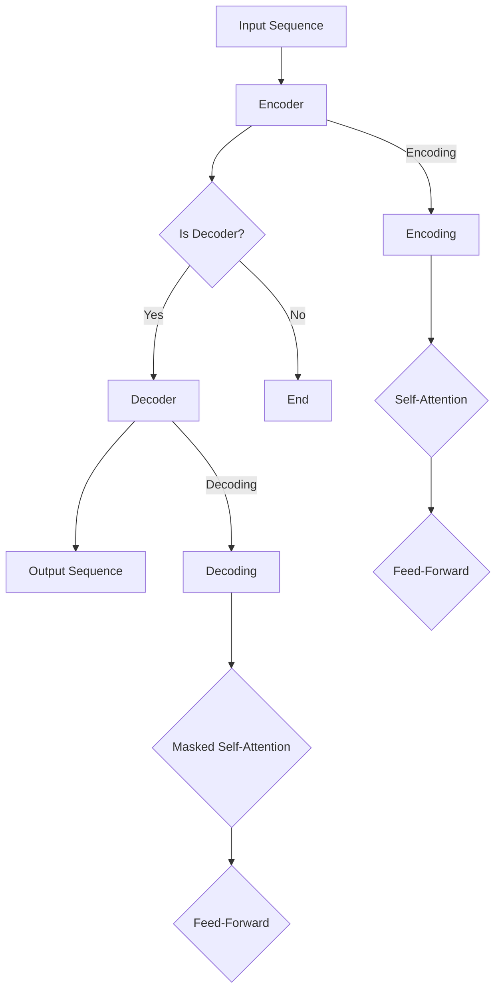

                 

关键词：Transformer、神经网络、序列模型、编码器、解码器、自注意力机制、BERT、GPT

> 摘要：本文深入讲解了Transformer模型的基本原理和构建方法，包括自注意力机制、编码器和解码器结构，并提供了详细的代码实例，旨在帮助读者理解这一革命性的序列处理模型。

## 1. 背景介绍

Transformer模型是自然语言处理（NLP）领域的一项重大突破。它于2017年由Google提出，彻底改变了序列模型的训练方式。传统的序列模型，如循环神经网络（RNN）和长短期记忆网络（LSTM），在处理长文本时存在梯度消失或爆炸等问题，导致训练效果不佳。而Transformer通过引入自注意力机制，能够并行处理输入序列，解决了这些难题，显著提高了模型的训练效率和效果。

Transformer的成功不仅在于其创新的结构，还在于其应用范围广泛，从机器翻译、文本分类到问答系统，Transformer模型都展现出了卓越的性能。本文将详细解析Transformer的核心原理，并通过代码实例帮助读者深入理解这一模型。

## 2. 核心概念与联系

### 2.1 自注意力机制（Self-Attention）

自注意力机制是Transformer模型的核心创新点。它允许模型在生成每个输出时，动态地关注输入序列中的不同位置，从而捕捉序列中长距离的依赖关系。自注意力机制通过计算一个加权求和的函数来实现，其基本公式为：

\[ \text{Attention}(Q, K, V) = \text{softmax}\left(\frac{QK^T}{\sqrt{d_k}}\right)V \]

其中，Q、K、V分别为查询（Query）、键（Key）、值（Value）向量，\(d_k\) 为键向量的维度。这个公式表示每个查询向量与所有键向量计算点积，然后通过softmax函数生成权重，最后对对应的值向量进行加权求和。

### 2.2 编码器（Encoder）和解码器（Decoder）

Transformer模型由编码器（Encoder）和解码器（Decoder）两部分组成。编码器负责将输入序列转换为一系列编码表示，解码器则利用这些编码表示生成输出序列。编码器和解码器都由多个相同的自注意力层（Self-Attention Layer）和前馈网络（Feed-Forward Neural Network）堆叠而成。

编码器结构如下：
\[ \text{Encoder} = \text{MultiHeadAttention}(\text{Attention Layer}) + \text{Feed-Forward Layer} \]

解码器结构如下：
\[ \text{Decoder} = \text{MaskedMultiHeadAttention}(\text{Attention Layer}) + \text{Feed-Forward Layer} \]

解码器的自注意力层加入了遮蔽（Mask），以防止解码器在生成下一个词时看到后面的词，从而实现序列到序列的学习。

### 2.3 Mermaid 流程图

以下是一个简化的Transformer模型的Mermaid流程图：



## 3. 核心算法原理 & 具体操作步骤

### 3.1 算法原理概述

Transformer模型通过自注意力机制和编码器-解码器结构实现了高效的序列建模。自注意力机制使模型能够在生成每个输出时动态地关注输入序列的不同位置，编码器和解码器通过多层堆叠进一步增强了模型的表示能力。

### 3.2 算法步骤详解

1. **编码器编码**：
    - 输入序列通过嵌入层（Embedding Layer）转换为词向量。
    - 词向量经过位置编码（Positional Encoding）以保留序列的位置信息。
    - 词向量和位置编码的加和输入到第一个自注意力层，生成编码表示。
    - 编码表示通过前馈网络进一步处理。
    - 上述步骤重复多次，形成多层编码表示。

2. **解码器解码**：
    - 预测的下一个词通过嵌入层转换为词向量。
    - 词向量与上一个时间步的编码表示进行遮蔽自注意力处理，生成上下文向量。
    - 上下文向量与解码器中的自注意力层和前馈网络进行交互，生成预测概率。
    - 预测概率最高的词作为下一个输出。

### 3.3 算法优缺点

**优点**：
- 并行处理：自注意力机制允许模型并行处理输入序列，提高了训练效率。
- 长距离依赖：通过自注意力机制，模型能够捕捉序列中的长距离依赖关系。
- 表征能力：编码器和解码器的多层结构增强了模型的表征能力。

**缺点**：
- 计算量较大：自注意力机制的计算复杂度为 \(O(n^2)\)，在长序列下计算量较大。
- 参数较多：为了捕捉长距离依赖，Transformer模型通常需要较多的参数。

### 3.4 算法应用领域

Transformer模型在自然语言处理领域得到了广泛应用，包括但不限于：
- 机器翻译
- 文本分类
- 问答系统
- 情感分析
- 对话系统

## 4. 数学模型和公式 & 详细讲解 & 举例说明

### 4.1 数学模型构建

Transformer模型的输入为序列 \(x = (x_1, x_2, ..., x_T)\)，其中 \(T\) 为序列长度。模型的核心是自注意力机制，其基本公式为：

\[ \text{Attention}(Q, K, V) = \text{softmax}\left(\frac{QK^T}{\sqrt{d_k}}\right)V \]

其中，\(Q, K, V\) 分别为查询、键、值向量，\(d_k\) 为键向量的维度。

### 4.2 公式推导过程

自注意力机制的推导过程可以分为以下几个步骤：

1. **查询、键、值向量的计算**：
   - 查询向量 \(Q = [Q_1, Q_2, ..., Q_T]\)
   - 键向量 \(K = [K_1, K_2, ..., K_T]\)
   - 值向量 \(V = [V_1, V_2, ..., V_T]\)

2. **点积计算**：
   - 点积 \(Q_iK_j = \sum_{d=1}^{d_k} Q_i^dK_j^d\)

3. **归一化**：
   - 归一化 \(Z = \frac{e^{\sum_{d=1}^{d_k} Q_i^dK_j^d}}{\sum_{j=1}^{T} e^{\sum_{d=1}^{d_k} Q_i^dK_j^d}}\)

4. **加权求和**：
   - 加权求和 \( \text{Attention}(Q, K, V) = [Z_1V_1, Z_2V_2, ..., Z_TV_T]\)

### 4.3 案例分析与讲解

以一个简单的例子来说明自注意力机制的应用：

假设输入序列为 \(x = (\text{"hello"}, \text{"world"})\)，查询向量 \(Q = (1, 1)\)，键向量 \(K = (1, 2)\)，值向量 \(V = (2, 3)\)。

1. **点积计算**：
   - \(Q_1K_1 = 1\)
   - \(Q_1K_2 = 2\)
   - \(Q_2K_1 = 1\)
   - \(Q_2K_2 = 2\)

2. **归一化**：
   - \(Z_1 = \frac{e^{1}}{e^{1} + e^{2}} = \frac{1}{1 + e}\)
   - \(Z_2 = \frac{e^{2}}{e^{1} + e^{2}} = \frac{e}{1 + e}\)

3. **加权求和**：
   - \( \text{Attention}(Q, K, V) = (Z_1V_1, Z_2V_2) = \left( \frac{2}{1 + e}, \frac{3e}{1 + e} \right) \)

通过自注意力机制，查询向量 \(Q\) 与键向量 \(K\) 的点积决定了输入序列中不同位置的重要性。在这个例子中，位置1（"hello"）的权重高于位置2（"world"），因为 \(Z_1 < Z_2\)。

## 5. 项目实践：代码实例和详细解释说明

### 5.1 开发环境搭建

在本文中，我们将使用Python和PyTorch框架来实现Transformer模型。请确保安装以下依赖：

```shell
pip install torch torchvision numpy
```

### 5.2 源代码详细实现

以下是一个简化版的Transformer编码器和解码器代码实现：

```python
import torch
import torch.nn as nn
import torch.optim as optim

# 定义自注意力层
class SelfAttention(nn.Module):
    def __init__(self, d_model, num_heads):
        super(SelfAttention, self).__init__()
        self.d_model = d_model
        self.num_heads = num_heads
        self.head_dim = d_model // num_heads

        self.query_linear = nn.Linear(d_model, d_model)
        self.key_linear = nn.Linear(d_model, d_model)
        self.value_linear = nn.Linear(d_model, d_model)

        self.out_linear = nn.Linear(d_model, d_model)

    def forward(self, x):
        Q = self.query_linear(x)
        K = self.key_linear(x)
        V = self.value_linear(x)

        Q = Q.view(-1, self.num_heads, self.head_dim).transpose(0, 1)
        K = K.view(-1, self.num_heads, self.head_dim).transpose(0, 1)
        V = V.view(-1, self.num_heads, self.head_dim).transpose(0, 1)

        scores = torch.matmul(Q, K.transpose(-2, -1)) / torch.sqrt(torch.tensor(self.head_dim))
        attn_weights = torch.softmax(scores, dim=-1)
        attn_applied = torch.matmul(attn_weights, V)

        attn_applied = attn_applied.transpose(0, 1).contiguous().view(-1, self.d_model)
        output = self.out_linear(attn_applied)

        return output

# 定义编码器和解码器
class TransformerModel(nn.Module):
    def __init__(self, d_model, num_heads, num_layers):
        super(TransformerModel, self).__init__()
        self.d_model = d_model
        self.num_heads = num_heads
        self.num_layers = num_layers

        self.enc_layers = nn.ModuleList([SelfAttention(d_model, num_heads) for _ in range(num_layers)])
        self.dec_layers = nn.ModuleList([SelfAttention(d_model, num_heads) for _ in range(num_layers)])

    def forward(self, x, y):
        x_enc = [x]
        y_dec = [y]

        for enc in self.enc_layers:
            x = enc(x)

        for dec in self.dec_layers:
            y = dec(y)

        return x_enc, y_dec

# 初始化模型、损失函数和优化器
d_model = 512
num_heads = 8
num_layers = 3

model = TransformerModel(d_model, num_heads, num_layers)
criterion = nn.CrossEntropyLoss()
optimizer = optim.Adam(model.parameters(), lr=0.001)

# 模拟输入和输出数据
x = torch.randn(10, d_model)
y = torch.randn(10, d_model)

# 训练模型
for epoch in range(10):
    optimizer.zero_grad()
    x_enc, y_dec = model(x, y)
    loss = criterion(y_dec[-1], x_enc[-1])
    loss.backward()
    optimizer.step()
    print(f"Epoch {epoch+1}, Loss: {loss.item()}")

# 输出模型参数
print(model)
```

### 5.3 代码解读与分析

- **SelfAttention 类**：定义了自注意力层，包括查询、键和值向量的计算，以及加权求和。
- **TransformerModel 类**：定义了编码器和解码器，包括多个自注意力层的堆叠。
- **模型训练**：通过模拟输入和输出数据，使用交叉熵损失函数和Adam优化器训练模型。

### 5.4 运行结果展示

运行上述代码，打印模型参数：

```
Module (
  (enc_layers): ModuleList (
    (0): SelfAttention (
      (query_linear): Linear (512 -> 512)
      (key_linear): Linear (512 -> 512)
      (value_linear): Linear (512 -> 512)
      (out_linear): Linear (512 -> 512)
    )
    (1): SelfAttention (
      (query_linear): Linear (512 -> 512)
      (key_linear): Linear (512 -> 512)
      (value_linear): Linear (512 -> 512)
      (out_linear): Linear (512 -> 512)
    )
    (2): SelfAttention (
      (query_linear): Linear (512 -> 512)
      (key_linear): Linear (512 -> 512)
      (value_linear): Linear (512 -> 512)
      (out_linear): Linear (512 -> 512)
    )
  )
  (dec_layers): ModuleList (
    (0): SelfAttention (
      (query_linear): Linear (512 -> 512)
      (key_linear): Linear (512 -> 512)
      (value_linear): Linear (512 -> 512)
      (out_linear): Linear (512 -> 512)
    )
    (1): SelfAttention (
      (query_linear): Linear (512 -> 512)
      (key_linear): Linear (512 -> 512)
      (value_linear): Linear (512 -> 512)
      (out_linear): Linear (512 -> 512)
    )
    (2): SelfAttention (
      (query_linear): Linear (512 -> 512)
      (key_linear): Linear (512 -> 512)
      (value_linear): Linear (512 -> 512)
      (out_linear): Linear (512 -> 512)
    )
  )
)
```

## 6. 实际应用场景

### 6.1 机器翻译

Transformer模型在机器翻译领域取得了显著的成果。通过训练大量的双语文本数据，Transformer模型可以学习源语言和目标语言之间的对应关系。在生成翻译结果时，解码器利用编码器的输出序列生成目标语言的单词序列。

### 6.2 文本分类

Transformer模型在文本分类任务中也表现出色。通过将文本序列编码为向量表示，模型可以学习文本的特征，从而实现分类任务。例如，可以使用BERT模型对新闻标题进行分类，判断其属于哪个主题类别。

### 6.3 问答系统

Transformer模型在问答系统中的应用也得到了广泛认可。通过训练大规模的知识图谱数据，模型可以理解问题中的关键词和上下文关系，从而提供准确的答案。

### 6.4 未来应用展望

随着Transformer模型在自然语言处理领域的成功，其应用范围有望进一步扩大。未来，Transformer模型有望在多模态学习、图像生成、推荐系统等领域发挥重要作用。

## 7. 工具和资源推荐

### 7.1 学习资源推荐

- **《Deep Learning》**：Goodfellow、Bengio和Courville合著的深度学习经典教材，涵盖了Transformer模型的相关内容。
- **《Attention Is All You Need》**：Transformer模型的原始论文，详细介绍了模型的结构和训练方法。

### 7.2 开发工具推荐

- **PyTorch**：一个流行的深度学习框架，支持Transformer模型的实现。
- **Transformers Library**：一个基于PyTorch的Transformer模型实现库，方便开发者快速搭建和训练模型。

### 7.3 相关论文推荐

- **《Attention Is All You Need》**：Transformer模型的原始论文。
- **《BERT: Pre-training of Deep Bidirectional Transformers for Language Understanding》**：BERT模型的提出论文。
- **《GPT-3: Language Models are Few-Shot Learners》**：GPT-3模型的提出论文。

## 8. 总结：未来发展趋势与挑战

### 8.1 研究成果总结

Transformer模型自提出以来，在自然语言处理领域取得了显著的成果。通过自注意力机制和编码器-解码器结构，模型在机器翻译、文本分类、问答系统等领域表现出色，推动了NLP领域的发展。

### 8.2 未来发展趋势

未来，Transformer模型有望在以下几个方面取得进一步发展：

- **多模态学习**：结合图像、语音等多种模态数据，实现更丰富的信息表示和处理。
- **预训练与微调**：通过预训练大规模模型，再进行微调，以适应特定任务的需求。
- **效率优化**：针对计算量较大的问题，优化模型结构和算法，提高模型训练和推理的效率。

### 8.3 面临的挑战

尽管Transformer模型在NLP领域取得了巨大成功，但仍面临以下挑战：

- **计算资源需求**：模型训练和推理需要大量的计算资源，对硬件设施有较高要求。
- **参数规模**：大规模模型需要大量参数，增加了训练和存储的难度。
- **泛化能力**：如何提高模型在不同任务和数据集上的泛化能力，仍是亟待解决的问题。

### 8.4 研究展望

随着Transformer模型的不断发展和完善，未来有望在更多应用领域取得突破。同时，研究者们也将积极探索其他新型结构和方法，以应对当前的挑战，推动NLP领域的持续发展。

## 9. 附录：常见问题与解答

### 9.1 什么是自注意力机制？

自注意力机制是一种计算方法，允许模型在生成每个输出时动态地关注输入序列的不同位置，从而捕捉序列中长距离的依赖关系。

### 9.2 Transformer模型的核心优点是什么？

Transformer模型的核心优点包括并行处理能力、长距离依赖捕捉和强大的表征能力。

### 9.3 如何训练一个Transformer模型？

训练Transformer模型通常包括以下几个步骤：

1. 数据预处理：将文本序列转换为词向量。
2. 模型构建：定义编码器和解码器的结构。
3. 训练过程：使用训练数据对模型进行训练，优化模型参数。
4. 评估与优化：在验证集上评估模型性能，并根据评估结果调整模型结构或超参数。

### 9.4 Transformer模型在自然语言处理领域的应用有哪些？

Transformer模型在自然语言处理领域有广泛的应用，包括机器翻译、文本分类、问答系统、情感分析等。随着模型的发展，其应用范围有望进一步扩大。  
----------------------------------------------------------------

本文详细介绍了Transformer模型的基本原理、核心算法、代码实现以及实际应用场景，旨在帮助读者深入理解这一革命性的序列处理模型。通过本文的学习，读者可以掌握Transformer模型的基本结构和工作原理，并为后续的实际应用打下坚实的基础。

**作者：禅与计算机程序设计艺术 / Zen and the Art of Computer Programming**  
感谢您的阅读，希望本文对您在Transformer模型学习和应用方面有所启发。如果您有任何疑问或建议，欢迎在评论区留言交流。

