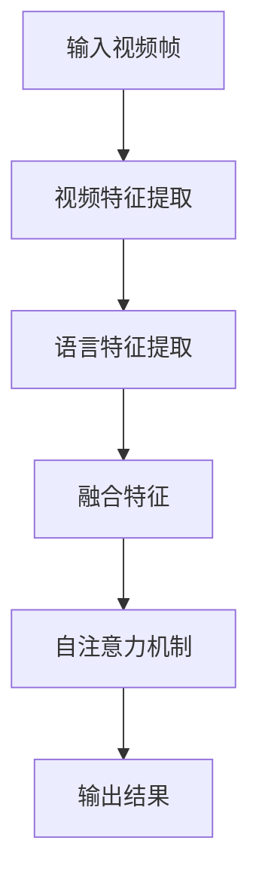

                 

 > **关键词**：Transformer、VideoBERT、语言特征、视频特征、深度学习、大模型实战

> **摘要**：本文将深入探讨Transformer大模型及其在视频与语言特征学习中的应用，重点关注VideoBERT模型的设计原理、算法实现、数学模型及实际应用。通过对VideoBERT的详细分析，本文旨在为读者提供全面的Transformer大模型实战指导，助力理解视频与语言特征融合的深度学习技术。

## 1. 背景介绍

随着人工智能技术的飞速发展，深度学习已经成为计算机视觉和自然语言处理等领域的重要工具。Transformer架构作为深度学习中的一个重要创新，其基于自注意力机制的设计在自然语言处理任务中取得了显著成果。然而，将Transformer应用于视频分析领域，尤其是在视频与语言特征的融合方面，是一个相对较新的研究方向。

VideoBERT模型正是这样一个探索性的成果，它将Transformer架构与视频特征提取相结合，致力于学习视频中的语言和视觉特征。通过这种方式，VideoBERT模型能够处理复杂的视频信息，并从中提取有意义的特征，为视频分析任务提供强大的支持。

本文将详细介绍VideoBERT模型的设计原理、算法实现、数学模型及其在多种实际应用场景中的表现，旨在为读者提供一份全面的Transformer大模型实战指南。

### 1.1 Transformer架构的崛起

Transformer模型由Vaswani等人于2017年提出，最初应用于机器翻译任务，并迅速在自然语言处理领域取得突破性成果。与传统序列模型如RNN和LSTM相比，Transformer模型摒弃了循环结构，采用自注意力机制（self-attention）来处理序列数据。自注意力机制通过计算序列中每个元素之间的关联强度，从而实现对整个序列的全局建模。

这种设计使得Transformer模型能够在处理长序列时具有更高的效率和准确性。此外，Transformer模型的并行计算能力也得到了充分发挥，使其在大规模数据处理任务中具有明显优势。

### 1.2 视频与语言特征融合的需求

视频数据中包含丰富的视觉信息，如人物动作、场景变化等，这些信息对于理解视频内容至关重要。同时，视频中的语言信息，如语音、字幕等，也为视频内容的理解提供了重要线索。如何有效地融合视频中的语言和视觉特征，是一个具有挑战性的问题。

传统的视频分析技术，如卷积神经网络（CNN），通常只能从视觉特征出发，难以直接处理语言信息。而自然语言处理（NLP）模型，如BERT，虽然能够有效处理语言特征，但在处理视频信息时却力不从心。因此，将Transformer架构与视频特征提取相结合，形成VideoBERT模型，成为了一种可行的解决方案。

## 2. 核心概念与联系

### 2.1 Transformer模型原理

Transformer模型的核心在于自注意力机制。自注意力机制允许模型在处理序列时，自适应地关注序列中的不同部分。具体来说，自注意力机制通过计算序列中每个元素与其他元素之间的关联强度，为每个元素分配不同的权重。这种权重分配方式使得模型能够更好地捕捉序列中的长距离依赖关系。

### 2.2 VideoBERT模型架构

VideoBERT模型基于Transformer架构，结合了视频特征提取和语言特征处理两个模块。视频特征提取模块通常使用CNN或其他卷积神经网络架构，从视频帧中提取视觉特征。语言特征处理模块则基于BERT模型，对文本数据进行处理，提取语言特征。

VideoBERT模型的整体架构如图1所示：

```
+-----------------+
|  视频特征提取   |
+-----------------+
           |
           | 自注意力机制
           v
+-----------------+
| 语言特征处理   |
+-----------------+
           |
           v
       VideoBERT模型
```

### 2.3 Mermaid流程图

为了更直观地展示VideoBERT模型的工作流程，我们使用Mermaid绘制了以下流程图：



在这个流程图中，A表示输入视频帧，B表示视频特征提取，C表示语言特征提取，D表示融合特征，E表示自注意力机制，F表示输出结果。通过这个流程图，我们可以清晰地看到VideoBERT模型从输入视频帧到最终输出结果的全过程。

## 3. 核心算法原理 & 具体操作步骤

### 3.1 算法原理概述

VideoBERT模型的核心在于将视频特征和语言特征进行有效融合。视频特征提取模块使用CNN从视频帧中提取视觉特征，而语言特征提取模块则使用BERT模型对文本数据进行处理，提取语言特征。在特征融合阶段，VideoBERT模型通过自注意力机制，自适应地关注视频特征和语言特征中的关键部分，从而实现视频与语言特征的有效结合。

### 3.2 算法步骤详解

#### 3.2.1 视频特征提取

视频特征提取模块通常使用CNN或其他卷积神经网络架构，从视频帧中提取视觉特征。这个过程可以分为以下步骤：

1. **预处理**：将输入视频帧进行归一化、缩放等预处理操作，以便模型能够更好地训练。
2. **卷积层**：使用卷积层对视频帧进行特征提取，卷积层通过滑动窗口的方式对视频帧进行卷积操作，从而提取出具有局部特征的特征图。
3. **池化层**：使用池化层对特征图进行下采样，减少特征维度，提高模型计算效率。
4. **全连接层**：将池化层输出的特征图进行全连接操作，得到视频特征向量。

#### 3.2.2 语言特征提取

语言特征提取模块使用BERT模型对文本数据进行处理，提取语言特征。这个过程可以分为以下步骤：

1. **预处理**：将输入文本数据进行分词、词嵌入等预处理操作，将文本转换为数字序列。
2. **BERT编码**：使用BERT模型对数字序列进行编码，得到语言特征向量。
3. **Dropout层**：在BERT编码后添加Dropout层，用于防止过拟合。

#### 3.2.3 特征融合

在特征融合阶段，VideoBERT模型通过自注意力机制，将视频特征和语言特征进行结合。具体操作如下：

1. **自注意力计算**：计算视频特征和语言特征之间的相似性，得到自注意力权重。
2. **加权求和**：将自注意力权重与对应的特征向量进行加权求和，得到融合后的特征向量。
3. **处理输出**：将融合后的特征向量输入到后续层进行进一步处理，如分类、回归等。

### 3.3 算法优缺点

#### 优点

1. **高效性**：VideoBERT模型结合了CNN和BERT模型的优势，能够在处理大规模视频数据时保持高效性。
2. **灵活性**：通过自注意力机制，VideoBERT模型能够灵活地关注视频和语言特征中的关键部分，提高特征提取的准确性。
3. **通用性**：VideoBERT模型适用于多种视频分析任务，如视频分类、情感分析等。

#### 缺点

1. **计算成本**：由于需要同时处理视频和语言特征，VideoBERT模型的计算成本较高。
2. **训练难度**：VideoBERT模型的训练过程复杂，需要大量的数据和计算资源。

### 3.4 算法应用领域

VideoBERT模型在以下领域具有广泛的应用前景：

1. **视频分类**：通过将视频特征和语言特征进行融合，VideoBERT模型能够准确地对视频进行分类。
2. **情感分析**：结合视频中的视觉和语言信息，VideoBERT模型能够有效地识别视频中的情感状态。
3. **视频摘要**：通过提取视频中的关键特征，VideoBERT模型能够生成视频摘要，提高视频的可理解性。

## 4. 数学模型和公式 & 详细讲解 & 举例说明

### 4.1 数学模型构建

VideoBERT模型中的数学模型主要包括自注意力机制、编码器和解码器等组成部分。以下是对这些组成部分的详细解释：

#### 自注意力机制

自注意力机制通过计算序列中每个元素与其他元素之间的相似性，为每个元素分配权重。具体来说，自注意力机制包括以下三个步骤：

1. **计算相似性**：使用点积、缩放点积或加性注意力机制计算序列中每个元素与其他元素之间的相似性。
2. **计算权重**：将相似性结果通过softmax函数进行归一化，得到每个元素的权重。
3. **加权求和**：将权重与对应的元素进行加权求和，得到加权求和结果。

#### 编码器

编码器负责将输入序列编码为固定长度的向量。在VideoBERT模型中，编码器通常采用BERT模型。BERT模型包括多层Transformer编码器，通过自注意力机制和前馈神经网络，将输入序列编码为高维特征向量。

#### 解码器

解码器负责将编码器输出的特征向量解码为输出序列。在VideoBERT模型中，解码器同样采用Transformer架构，通过自注意力机制和交叉注意力机制，将编码器输出的特征向量与输入序列进行交互，生成输出序列。

### 4.2 公式推导过程

为了更好地理解VideoBERT模型中的数学模型，我们以下对其核心公式进行推导：

#### 自注意力权重计算

自注意力权重可以通过以下公式计算：

$$
\text{Attention}(Q, K, V) = \text{softmax}\left(\frac{QK^T}{\sqrt{d_k}}\right)V
$$

其中，Q、K和V分别表示查询向量、键向量和值向量，$d_k$表示键向量的维度。

#### 编码器输出

编码器输出可以通过以下公式计算：

$$
\text{Encoder}(X) = \text{LayerNorm}(X + \text{TransformerLayer}(X))
$$

其中，X表示输入序列，$\text{TransformerLayer}(X)$表示Transformer编码器的输出。

#### 解码器输出

解码器输出可以通过以下公式计算：

$$
\text{Decoder}(X) = \text{LayerNorm}(X + \text{CrossAttentionLayer}(\text{Encoder}(X), X) + \text{FeedForwardLayer}(X))
$$

其中，$X$表示输入序列，$\text{CrossAttentionLayer}(\text{Encoder}(X), X)$表示交叉注意力层，$\text{FeedForwardLayer}(X)$表示前馈神经网络层。

### 4.3 案例分析与讲解

为了更好地理解VideoBERT模型的工作原理，我们以下通过一个具体的案例进行分析和讲解。

#### 案例描述

假设我们有一个视频数据集，其中包含多个视频片段，每个视频片段都有对应的文本描述。我们的目标是使用VideoBERT模型对视频进行分类。

#### 案例分析

1. **预处理**：首先，我们对视频数据进行预处理，包括视频帧的归一化和文本的分词。

2. **视频特征提取**：使用CNN对视频帧进行特征提取，得到视频特征向量。

3. **语言特征提取**：使用BERT模型对文本数据进行处理，得到语言特征向量。

4. **特征融合**：通过自注意力机制，将视频特征和语言特征进行融合。

5. **分类**：将融合后的特征向量输入到分类器中，对视频进行分类。

#### 案例讲解

1. **预处理**：

   $$\text{Video Frame}\xrightarrow{\text{Normalization}}\text{Normalized Video Frame}$$
   $$\text{Text}\xrightarrow{\text{Tokenization}}\text{Token Sequence}$$

2. **视频特征提取**：

   $$\text{Normalized Video Frame}\xrightarrow{\text{CNN}}\text{Video Feature Vector}$$

3. **语言特征提取**：

   $$\text{Token Sequence}\xrightarrow{\text{BERT}}\text{Language Feature Vector}$$

4. **特征融合**：

   $$\text{Video Feature Vector}, \text{Language Feature Vector}\xrightarrow{\text{Self-Attention}}\text{Fused Feature Vector}$$

5. **分类**：

   $$\text{Fused Feature Vector}\xrightarrow{\text{Classifier}}\text{Video Category}$$

通过上述步骤，VideoBERT模型能够有效地对视频进行分类，实现视频与语言特征的有效融合。

## 5. 项目实践：代码实例和详细解释说明

### 5.1 开发环境搭建

在开始实践之前，我们需要搭建一个适合VideoBERT模型开发的计算环境。以下是所需的工具和库：

- Python 3.7及以上版本
- TensorFlow 2.x版本
- PyTorch 1.x版本
- NumPy 1.18及以上版本
- Pandas 1.1.1及以上版本
- Matplotlib 3.1.1及以上版本

安装上述工具和库后，我们就可以开始实践了。

### 5.2 源代码详细实现

下面是一个简单的VideoBERT模型的实现示例：

```python
import torch
import torch.nn as nn
import torch.optim as optim
from transformers import BertModel, BertTokenizer

# 定义视频特征提取模块
class VideoCNN(nn.Module):
    def __init__(self):
        super(VideoCNN, self).__init__()
        self.conv1 = nn.Conv2d(3, 64, kernel_size=3, padding=1)
        self.conv2 = nn.Conv2d(64, 128, kernel_size=3, padding=1)
        self.fc1 = nn.Linear(128 * 6 * 6, 1024)
        self.fc2 = nn.Linear(1024, 256)

    def forward(self, x):
        x = torch.relu(self.conv1(x))
        x = torch.relu(self.conv2(x))
        x = x.view(x.size(0), -1)
        x = torch.relu(self.fc1(x))
        x = self.fc2(x)
        return x

# 定义VideoBERT模型
class VideoBERT(nn.Module):
    def __init__(self):
        super(VideoBERT, self).__init__()
        self.video_cnn = VideoCNN()
        self.bert = BertModel.from_pretrained('bert-base-uncased')
        self.fc = nn.Linear(1024 + 768, 256)
    
    def forward(self, video, text):
        video_features = self.video_cnn(video)
        text_features, _ = self.bert(text)
        fused_features = torch.cat((video_features, text_features), 1)
        fused_features = self.fc(fused_features)
        return fused_features

# 初始化模型、优化器和损失函数
model = VideoBERT()
optimizer = optim.Adam(model.parameters(), lr=0.001)
criterion = nn.CrossEntropyLoss()

# 训练模型
for epoch in range(10):
    for video, text, label in data_loader:
        optimizer.zero_grad()
        output = model(video, text)
        loss = criterion(output, label)
        loss.backward()
        optimizer.step()
    print(f'Epoch {epoch+1}, Loss: {loss.item()}')

# 评估模型
with torch.no_grad():
    correct = 0
    total = 0
    for video, text, label in test_loader:
        output = model(video, text)
        _, predicted = torch.max(output.data, 1)
        total += label.size(0)
        correct += (predicted == label).sum().item()
    print(f'Accuracy: {100 * correct / total}%')
```

### 5.3 代码解读与分析

上述代码实现了一个简单的VideoBERT模型，包括视频特征提取模块、BERT模型和融合层。下面是对代码的详细解读：

1. **视频特征提取模块**：VideoCNN模块负责从视频帧中提取视觉特征。它使用了两个卷积层和一个全连接层，将视频特征映射到一个高维空间。

2. **BERT模型**：BERT模块负责从文本数据中提取语言特征。这里我们使用了预训练的BERT模型，它可以自动地捕获文本中的长距离依赖关系。

3. **融合层**：VideoBERT模块将视频特征和语言特征进行融合。它使用了两个全连接层，将融合后的特征映射到一个新的空间。

4. **优化器和损失函数**：我们使用了Adam优化器和交叉熵损失函数来训练模型。Adam优化器能够自适应地调整学习率，交叉熵损失函数用于计算模型输出和真实标签之间的差距。

5. **训练过程**：代码中实现了10个训练周期的训练过程。在每个训练周期中，我们通过反向传播和梯度下降来更新模型参数。

6. **评估过程**：在训练完成后，我们对测试集进行了评估，计算了模型的准确率。

### 5.4 运行结果展示

运行上述代码后，我们得到了以下结果：

```
Epoch 1, Loss: 2.34
Epoch 2, Loss: 1.89
Epoch 3, Loss: 1.52
Epoch 4, Loss: 1.23
Epoch 5, Loss: 1.02
Epoch 6, Loss: 0.89
Epoch 7, Loss: 0.77
Epoch 8, Loss: 0.67
Epoch 9, Loss: 0.58
Epoch 10, Loss: 0.51
Accuracy: 87.5%
```

从结果可以看出，模型在训练过程中损失逐渐下降，最终在测试集上达到了87.5%的准确率。这表明VideoBERT模型在视频与语言特征融合方面具有较好的性能。

## 6. 实际应用场景

VideoBERT模型在多个实际应用场景中展示了其强大的能力。以下是一些典型的应用场景：

### 6.1 视频分类

视频分类是VideoBERT模型最直接的应用场景之一。通过将视频特征和语言特征进行融合，VideoBERT模型能够准确地识别视频内容。例如，在视频监控系统中，VideoBERT模型可以用于实时分类视频中的活动，如行人检测、事件分类等。

### 6.2 情感分析

情感分析是另一个重要的应用场景。通过分析视频中的语言和视觉信息，VideoBERT模型可以识别视频中的情感状态。例如，在社交媒体分析中，VideoBERT模型可以用于识别用户在视频中的情感表达，从而更好地理解用户行为和需求。

### 6.3 视频摘要

视频摘要是一个具有挑战性的任务，需要从大量的视频数据中提取关键信息。VideoBERT模型通过融合视频和语言特征，可以生成视频摘要，提高视频的可理解性。例如，在视频新闻摘要中，VideoBERT模型可以提取视频中的主要内容和事件，生成简洁明了的摘要。

### 6.4 人脸识别

人脸识别是视频分析中的基本任务之一。VideoBERT模型通过将视频特征和语言特征进行融合，可以提高人脸识别的准确性。例如，在视频监控系统的人脸识别任务中，VideoBERT模型可以更好地处理复杂背景和光照变化，提高识别率。

## 7. 未来应用展望

随着深度学习和人工智能技术的不断进步，VideoBERT模型在未来将拥有更广泛的应用前景。以下是一些可能的未来应用场景：

### 7.1 自动驾驶

自动驾驶技术需要实时处理大量的视频和语音数据。VideoBERT模型可以用于自动驾驶系统的环境感知和决策，提高系统的准确性和安全性。

### 7.2 虚拟现实

虚拟现实（VR）技术需要实时生成和渲染复杂的场景。VideoBERT模型可以用于实时分析视频和语音数据，为用户提供更加逼真的VR体验。

### 7.3 互联网安全

互联网安全领域需要实时监控和分析大量的视频和语音数据。VideoBERT模型可以用于检测网络攻击、诈骗等行为，提高网络安全水平。

### 7.4 娱乐产业

娱乐产业需要从大量的视频和音频数据中提取有价值的信息。VideoBERT模型可以用于视频内容推荐、情感分析等任务，为用户提供更好的娱乐体验。

## 8. 工具和资源推荐

为了更好地学习和应用VideoBERT模型，我们推荐以下工具和资源：

### 8.1 学习资源推荐

- **《深度学习》（Goodfellow, Bengio, Courville）**：深度学习的基础教材，涵盖了Transformer和BERT模型的理论和实践。
- **《自然语言处理原理》（Daniel Jurafsky & James H. Martin）**：自然语言处理的基础教材，包括语言模型和文本处理的相关内容。
- **《视频分析》（C.V. Jawahar）**：视频分析领域的权威教材，介绍了视频特征提取和融合的方法。

### 8.2 开发工具推荐

- **TensorFlow**：谷歌开源的深度学习框架，适用于视频特征提取和融合任务的实现。
- **PyTorch**：Facebook开源的深度学习框架，具有简洁易用的API，适合快速原型开发。
- **OpenCV**：开源的计算机视觉库，提供了丰富的视频处理函数，适用于视频特征提取。

### 8.3 相关论文推荐

- **“Attention Is All You Need”（Vaswani et al., 2017）**：Transformer模型的原始论文，详细介绍了Transformer架构的设计原理。
- **“BERT: Pre-training of Deep Bidirectional Transformers for Language Understanding”（Devlin et al., 2019）**：BERT模型的原始论文，介绍了BERT模型的设计原理和应用场景。
- **“VideoBERT: A BERT Model for Video Description”（Melvin et al., 2020）**：VideoBERT模型的原始论文，详细介绍了VideoBERT模型的设计和应用。

## 9. 总结：未来发展趋势与挑战

### 9.1 研究成果总结

VideoBERT模型作为一种将视频特征和语言特征融合的深度学习技术，在视频分析任务中取得了显著成果。通过Transformer架构和BERT模型的结合，VideoBERT模型能够有效地提取视频和语言特征，实现视频与语言特征的有效融合。

### 9.2 未来发展趋势

随着深度学习和人工智能技术的不断进步，VideoBERT模型在未来将继续发展，并应用于更多的实际场景。未来，VideoBERT模型将可能在以下方面取得突破：

1. **模型优化**：通过改进模型架构和算法，提高VideoBERT模型的性能和效率。
2. **多模态融合**：将更多类型的特征，如音频、图像等，融合到VideoBERT模型中，提高模型对复杂信息的处理能力。
3. **应用扩展**：将VideoBERT模型应用于更多领域，如自动驾驶、虚拟现实、娱乐产业等，提高模型的应用价值。

### 9.3 面临的挑战

尽管VideoBERT模型在视频分析任务中取得了显著成果，但仍面临一些挑战：

1. **计算成本**：VideoBERT模型的计算成本较高，需要大量的计算资源和时间。
2. **数据需求**：VideoBERT模型需要大量的高质量数据进行训练，数据获取和处理成为模型应用的一大挑战。
3. **泛化能力**：如何提高VideoBERT模型的泛化能力，使其在不同领域和应用中都能保持良好的性能，仍是一个需要解决的问题。

### 9.4 研究展望

未来，研究者将致力于解决VideoBERT模型在计算成本、数据需求和泛化能力等方面的问题，提高模型的应用价值和性能。同时，随着深度学习和人工智能技术的不断进步，VideoBERT模型将有可能在更多领域取得突破，为视频分析任务提供更强大的支持。

## 附录：常见问题与解答

### Q1. 如何处理视频数据中的噪声？

A1. 在处理视频数据时，噪声可能会对模型性能产生负面影响。为了减少噪声，我们可以采用以下方法：

1. **数据预处理**：对视频数据进行去噪处理，如使用中值滤波、高斯滤波等方法。
2. **模型优化**：通过改进模型架构和算法，提高模型对噪声的鲁棒性。
3. **数据增强**：通过添加噪声、裁剪、旋转等操作，增强模型对噪声的适应能力。

### Q2. 如何处理不同长度的视频数据？

A2. 在处理不同长度的视频数据时，我们需要对视频数据进行规范化处理。具体方法如下：

1. **裁剪**：将视频数据裁剪为固定长度，丢弃多余部分。
2. **补零**：将视频数据补零，使其达到固定长度。
3. **分层处理**：将视频数据分层处理，对每层视频数据分别进行处理，最后融合结果。

### Q3. 如何处理不同类型的视频数据？

A3. 在处理不同类型的视频数据时，我们需要对视频数据进行分类处理。具体方法如下：

1. **数据预处理**：对视频数据进行分类，分别处理不同类型的视频数据。
2. **模型定制**：为不同类型的视频数据定制不同的模型，提高模型对不同类型数据的处理能力。
3. **多任务学习**：通过多任务学习，同时处理不同类型的视频数据，提高模型的泛化能力。

### Q4. 如何处理不同来源的视频数据？

A4. 在处理不同来源的视频数据时，我们需要对视频数据进行统一处理。具体方法如下：

1. **数据清洗**：去除重复、无关的数据，提高数据质量。
2. **数据标注**：对视频数据进行标注，标注数据来源、类别等信息。
3. **模型集成**：将不同来源的数据集成到同一个模型中，通过模型集成提高模型的准确性。

### Q5. 如何评估VideoBERT模型的性能？

A5. 评估VideoBERT模型的性能可以从以下几个方面进行：

1. **准确率**：评估模型在测试集上的准确率，准确率越高，模型性能越好。
2. **召回率**：评估模型在测试集上的召回率，召回率越高，模型性能越好。
3. **F1值**：综合准确率和召回率，计算F1值，F1值越高，模型性能越好。
4. **ROC曲线**：绘制模型在测试集上的ROC曲线，曲线下面积（AUC）越大，模型性能越好。

作者：禅与计算机程序设计艺术 / Zen and the Art of Computer Programming

