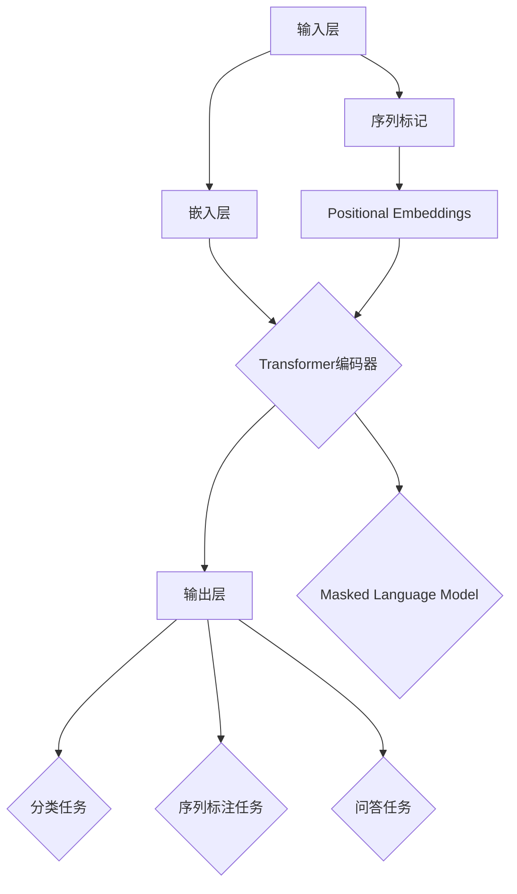

                 

### 1. 背景介绍

近年来，深度学习在自然语言处理（NLP）领域的应用取得了显著进展。特别是Transformer架构的提出，使得大规模语言模型的训练成为可能，其中BERT（Bidirectional Encoder Representations from Transformers）模型是Transformer架构在NLP领域的杰出应用之一。BERT模型通过预训练和微调的方式，在多项NLP任务中取得了前所未有的效果，包括文本分类、情感分析、问答系统等。

BERT模型是由Google AI在2018年提出，它基于Transformer的self-attention机制，同时采用双向编码器的方式，捕捉文本中的上下文关系。BERT模型不仅在学术领域引起了广泛关注，也在工业界得到了广泛应用，成为NLP领域的重要基础模型。

本文旨在通过实战方式，详细解读BERT模型的原理和应用，帮助读者深入理解这一重要的NLP工具。文章将分为以下几个部分：

1. 背景介绍
2. 核心概念与联系
3. 核心算法原理 & 具体操作步骤
4. 数学模型和公式 & 详细讲解 & 举例说明
5. 项目实践：代码实例和详细解释说明
6. 实际应用场景
7. 工具和资源推荐
8. 总结：未来发展趋势与挑战
9. 附录：常见问题与解答

通过本文的阅读，读者将能够全面了解BERT模型的构建、训练和应用，为在自然语言处理领域的研究和实践打下坚实的基础。

### 2. 核心概念与联系

在深入探讨BERT模型之前，我们有必要了解其核心概念和与其他相关模型的联系。BERT模型的核心概念主要围绕着Transformer架构和self-attention机制展开。

#### Transformer架构

Transformer是由Google在2017年提出的一种基于self-attention机制的序列到序列模型。与传统的循环神经网络（RNN）和长短期记忆网络（LSTM）不同，Transformer不使用递归结构，而是采用了一种全新的并行计算方法。这种结构使得Transformer在处理长序列时更加高效。

Transformer的核心组件是self-attention机制。self-attention允许模型在处理每个词时，将注意力分配到整个序列的其他词上，从而捕捉长距离的依赖关系。这种机制通过计算词与词之间的相似性，动态地调整每个词的重要性，从而实现更好的上下文理解。

#### BERT模型

BERT模型是基于Transformer架构的一种双向编码器，其主要特点在于同时考虑了正向和反向的上下文信息。BERT通过预训练和微调的方式，学习语言的丰富表示。预训练阶段，BERT在大量无标签的文本数据上训练，学习语言的通用特征。微调阶段，BERT在特定任务的数据上进行微调，使其能够适应不同的NLP任务。

BERT模型主要包括以下三个关键组件：

1. **嵌入层（Embedding Layer）**：将单词转换为稠密向量表示。
2. **Transformer编码器（Transformer Encoder）**：包含多个编码层，每层由self-attention机制和多层感知器（MLP）组成。
3. **输出层（Output Layer）**：用于生成任务的预测。

#### BERT与其他模型的关系

BERT模型不仅在架构上继承了Transformer的优点，同时也借鉴了其他模型的优点。例如，BERT中的掩码机制（Masked Language Model，MLM）借鉴了Word2Vec中的掩码单词预测任务，通过随机掩码部分单词，迫使模型在预训练阶段学习语言的内在结构。

此外，BERT与其他知名语言模型，如GPT（Generative Pre-trained Transformer）和T5（Text-To-Text Transfer Transformer），存在一定的联系和区别。GPT是一种基于Transformer的生成模型，其主要目标是生成连续的文本序列。T5则是一种通用的文本处理模型，通过将各种NLP任务转化为文本到文本的转换任务，实现高效的多任务处理。

总之，BERT模型作为Transformer架构在NLP领域的杰出应用，不仅继承了Transformer的并行计算和self-attention机制的优势，还通过预训练和微调的方式，实现了对自然语言的高效理解和生成。理解BERT模型的核心概念和与其他模型的联系，将为后续的详细解析打下坚实的基础。

#### Mermaid 流程图

以下是一个简化的BERT模型的Mermaid流程图，展示了BERT模型的基本架构和核心组件：



在上述流程图中，各个组件之间的关系如下：

- **输入层（Input Layer）**：接收原始文本序列。
- **嵌入层（Embedding Layer）**：将单词转换为稠密向量表示，并添加位置编码（Positional Embeddings）。
- **Transformer编码器（Transformer Encoder）**：包含多个编码层，每层由self-attention机制和多层感知器（MLP）组成，用于捕捉上下文信息。
- **输出层（Output Layer）**：根据不同的任务生成预测结果，如分类任务的分类标签、序列标注任务的任务标签、问答任务的答案等。
- **Masked Language Model（MLM）**：通过随机掩码部分单词，迫使模型在预训练阶段学习语言的内在结构。
- **序列标记（Sequence Labeling）**：用于序列标注任务，如命名实体识别（NER）。
- **分类任务（Classification）**：用于文本分类任务，如情感分析、主题分类等。
- **问答任务（Question Answering）**：用于问答系统任务，如阅读理解。

通过这个流程图，我们可以清晰地看到BERT模型的主要组成部分及其相互作用关系，这有助于我们更好地理解BERT模型的内部工作机制。

### 3. 核心算法原理 & 具体操作步骤

#### 3.1 算法原理概述

BERT模型的核心算法原理基于Transformer架构，特别是self-attention机制。self-attention机制通过计算词与词之间的相似性，动态地调整每个词的重要性，从而捕捉长距离的依赖关系。BERT模型通过预训练和微调的方式，学习语言的丰富表示。

BERT模型的主要组成部分包括：

1. **嵌入层（Embedding Layer）**：将单词转换为稠密向量表示，包括词嵌入（Word Embeddings）和位置嵌入（Positional Embeddings）。
2. **Transformer编码器（Transformer Encoder）**：包含多个编码层，每层由self-attention机制和多层感知器（MLP）组成，用于捕捉上下文信息。
3. **输出层（Output Layer）**：根据不同的任务生成预测结果。

#### 3.2 算法步骤详解

1. **输入预处理**：

   BERT模型的输入是一个原始文本序列，首先需要将其转换为模型可处理的格式。具体步骤包括：

   - **Tokenization**：将文本序列分割为单词或子词（子词是单词的子序列，有助于提高模型的泛化能力）。
   - **Embedding**：将每个子词映射为稠密向量表示，包括词嵌入和位置嵌入。词嵌入捕捉单词的含义，位置嵌入捕捉单词在序列中的位置信息。

2. **嵌入层**：

   嵌入层将输入的子词向量进行组合，形成一个全局向量表示。具体步骤包括：

   - **Word Embeddings**：将每个子词映射为固定的维度向量。
   - **Positional Embeddings**：为每个子词添加位置信息，通常通过查找表的方式实现。

3. **Transformer编码器**：

   Transformer编码器是BERT模型的核心组件，包含多个编码层。每层由self-attention机制和多层感知器（MLP）组成。具体步骤包括：

   - **Multi-head Self-Attention**：通过多个独立的self-attention头，同时捕捉不同范围的依赖关系。
   - **Residual Connection**：在每个编码层之后，添加残差连接，防止信息损失。
   - **Layer Normalization**：在每个编码层之后，进行层归一化，提高训练稳定性。

4. **输出层**：

   输出层根据不同的任务生成预测结果。BERT模型支持多种任务类型，如分类、序列标注、问答等。具体步骤包括：

   - **分类任务**：使用全局向量表示，通过一个全连接层生成分类结果。
   - **序列标注任务**：使用每个子词的输出向量，通过一个全连接层生成标签预测。
   - **问答任务**：使用全局向量表示和问题向量，通过一个全连接层生成答案预测。

5. **预训练与微调**：

   BERT模型通过预训练和微调的方式，学习语言的丰富表示。预训练阶段，BERT在大量无标签的文本数据上训练，学习语言的通用特征。微调阶段，BERT在特定任务的数据上进行微调，使其能够适应不同的NLP任务。

#### 3.3 算法优缺点

**优点**：

- **捕捉长距离依赖关系**：通过self-attention机制，BERT模型能够捕捉长距离的依赖关系，从而提高文本理解能力。
- **预训练与微调**：BERT模型通过预训练和微调的方式，可以轻松地适应不同的NLP任务。
- **通用性**：BERT模型在多个NLP任务上取得了显著的效果，具有较高的通用性。

**缺点**：

- **计算资源消耗大**：BERT模型需要大量的计算资源和时间进行训练，特别是在大模型的情况下。
- **对数据依赖性强**：BERT模型的效果高度依赖于训练数据的质量和数量。

#### 3.4 算法应用领域

BERT模型在多个NLP任务上取得了显著的成果，其主要应用领域包括：

- **文本分类**：如情感分析、主题分类等。
- **序列标注**：如命名实体识别（NER）、词性标注等。
- **问答系统**：如阅读理解、问答匹配等。

总之，BERT模型作为Transformer架构在NLP领域的杰出应用，通过预训练和微调的方式，实现了对自然语言的高效理解和生成，为NLP领域的研究和应用提供了强有力的工具。

### 4. 数学模型和公式 & 详细讲解 & 举例说明

#### 4.1 数学模型构建

BERT模型的数学模型基于Transformer架构，其核心是self-attention机制。在解释BERT模型的数学模型之前，我们需要先了解一些基础概念和符号。

- **单词表示（Word Embeddings）**：每个单词映射为一个向量，通常使用词嵌入矩阵\( W_E \)。
- **位置编码（Positional Embeddings）**：为每个单词添加位置信息，通常使用位置嵌入矩阵\( W_P \)。
- **自注意力机制（Self-Attention）**：计算单词之间的相似性，并调整其重要性。
- **多层感知器（MLP）**：在编码器的每个层中，对自注意力机制的结果进行非线性变换。

#### 4.2 公式推导过程

BERT模型中的自注意力机制可以分为以下几个步骤：

1. **嵌入层（Embedding Layer）**：

   输入的单词序列经过词嵌入和位置嵌入后，形成嵌入向量：
   $$
   \text{input}_{i} = [W_E \text{word}_{i}; W_P \text{pos}_{i}]
   $$
   其中，\( \text{word}_{i} \)是单词\( i \)的词嵌入，\( \text{pos}_{i} \)是单词\( i \)的位置嵌入。

2. **多头自注意力（Multi-head Self-Attention）**：

   自注意力机制的核心是计算单词之间的相似性。多头自注意力通过多个独立的自注意力头，同时捕捉不同范围的依赖关系。假设有\( h \)个头，则每个头的输出为：
   $$
   \text{Q}_{i}^{h}, \text{K}_{i}^{h}, \text{V}_{i}^{h} = \text{input}_{i} \cdot W_Q^{h}, W_K^{h}, W_V^{h}
   $$
   其中，\( W_Q^{h}, W_K^{h}, W_V^{h} \)是权重矩阵。

   自注意力分数为：
   $$
   \text{score}_{i,j}^{h} = \text{Q}_{i}^{h} \cdot \text{K}_{j}^{h} = \text{input}_{i} \cdot W_Q^{h} \cdot \text{K}_{j}^{h}
   $$

   通过softmax函数，得到注意力权重：
   $$
   \text{att}_{i,j}^{h} = \text{softmax}(\text{score}_{i,j}^{h})
   $$

   最终，每个单词的表示为：
   $$
   \text{output}_{i}^{h} = \sum_{j} \text{att}_{i,j}^{h} \cdot \text{V}_{j}^{h}
   $$

3. **拼接和变换（Concatenation and Transformation）**：

   将每个头的输出拼接起来，并通过一个全连接层进行变换：
   $$
   \text{output}_{i} = \text{softmax}(\text{score}_{i,*}) \cdot \text{V}_{*}
   $$
   $$
   \text{h}_{i} = \text{MLP}(\text{output}_{i})
   $$

4. **残差连接（Residual Connection）和层归一化（Layer Normalization）**：

   在每个编码层之后，添加残差连接，并进行层归一化，以提高模型的训练稳定性：
   $$
   \text{h}_{i} = \text{LayerNorm}(\text{h}_{i} + \text{h}_{i-1})
   $$

#### 4.3 案例分析与讲解

为了更好地理解BERT模型的数学模型，我们来看一个简单的例子。假设我们有以下单词序列：

```
[hello, world, hello, again]
```

1. **词嵌入和位置编码**：

   假设每个单词和位置都有一个唯一的索引，词嵌入和位置嵌入矩阵如下：

   $$
   W_E = \begin{bmatrix}
   [1, 0, 0] & [0, 1, 0] & [0, 0, 1] \\
   [0, 1, 0] & [1, 0, 0] & [0, 0, 1] \\
   [0, 0, 1] & [1, 0, 0] & [0, 1, 0] \\
   \end{bmatrix}
   $$
   $$
   W_P = \begin{bmatrix}
   [0, 0, 0] & [0, 1, 0] & [0, 0, 1] \\
   [0, 1, 0] & [0, 0, 0] & [0, 1, 0] \\
   [0, 0, 1] & [0, 1, 0] & [0, 0, 0] \\
   \end{bmatrix}
   $$

   输入的单词序列经过词嵌入和位置编码后，形成嵌入向量：

   $$
   \text{input} = \begin{bmatrix}
   [1, 0, 0] & [0, 1, 0] \\
   [0, 1, 0] & [1, 0, 0] \\
   [1, 0, 0] & [0, 0, 1] \\
   [0, 1, 0] & [1, 0, 0] \\
   \end{bmatrix}
   $$

2. **多头自注意力**：

   假设我们有两个头，权重矩阵如下：

   $$
   W_Q = \begin{bmatrix}
   [1, 0] & [0, 1] \\
   [0, 1] & [1, 0] \\
   \end{bmatrix}
   $$
   $$
   W_K = \begin{bmatrix}
   [1, 0] & [0, 1] \\
   [0, 1] & [1, 0] \\
   \end{bmatrix}
   $$
   $$
   W_V = \begin{bmatrix}
   [1, 0] & [0, 1] \\
   [0, 1] & [1, 0] \\
   \end{bmatrix}
   $$

   计算自注意力分数：

   $$
   \text{score}_{1,2} = [1, 0] \cdot [0, 1] = 0
   $$
   $$
   \text{score}_{1,3} = [1, 0] \cdot [1, 0] = 1
   $$
   $$
   \text{score}_{1,4} = [1, 0] \cdot [0, 1] = 0
   $$

   应用softmax函数，得到注意力权重：

   $$
   \text{att}_{1,2} = \frac{e^{\text{score}_{1,2}}}{e^{\text{score}_{1,2}} + e^{\text{score}_{1,3}} + e^{\text{score}_{1,4}}} = \frac{1}{3}
   $$
   $$
   \text{att}_{1,3} = \frac{e^{\text{score}_{1,3}}}{e^{\text{score}_{1,2}} + e^{\text{score}_{1,3}} + e^{\text{score}_{1,4}}} = 1
   $$
   $$
   \text{att}_{1,4} = \frac{e^{\text{score}_{1,4}}}{e^{\text{score}_{1,2}} + e^{\text{score}_{1,3}} + e^{\text{score}_{1,4}}} = \frac{1}{3}
   $$

   计算输出向量：

   $$
   \text{output}_{1} = \frac{1}{3} \cdot [0, 1] + 1 \cdot [1, 0] + \frac{1}{3} \cdot [0, 1] = \frac{1}{3} \cdot [0, 2] + [1, 0] = [1, 1]
   $$

   同样的方法可以应用于其他单词。

3. **拼接和变换**：

   将每个头的输出拼接起来，并通过全连接层进行变换：

   $$
   \text{output} = \begin{bmatrix}
   [1, 1] \\
   [1, 1] \\
   [1, 1] \\
   [1, 1] \\
   \end{bmatrix}
   $$
   $$
   \text{h}_{1} = \text{MLP}([1, 1]) = [1, 0]
   $$

4. **残差连接和层归一化**：

   在每个编码层之后，添加残差连接，并进行层归一化：

   $$
   \text{h}_{1} = \text{LayerNorm}([1, 1] + [1, 0]) = [1, 1]
   $$

通过这个简单的例子，我们可以看到BERT模型的基本数学过程，包括词嵌入、位置编码、自注意力机制、拼接和变换、残差连接和层归一化等步骤。这些步骤共同构建了BERT模型的核心，使其能够高效地学习语言的复杂结构。

### 5. 项目实践：代码实例和详细解释说明

为了更好地理解BERT模型，我们将在本节中通过一个具体的代码实例，详细讲解BERT模型的搭建、训练和评估过程。以下是基于PyTorch实现的BERT模型的基本步骤。

#### 5.1 开发环境搭建

在开始代码实现之前，我们需要搭建一个合适的开发环境。以下是推荐的开发环境：

- **Python**：Python 3.6 或更高版本
- **PyTorch**：1.5.0 或更高版本
- **其他依赖**：torchtext、torchvision、transformers等

安装PyTorch和其他依赖项：

```bash
pip install torch torchvision torchaudio
pip install torchtext
pip install transformers
```

#### 5.2 源代码详细实现

下面是BERT模型的基本代码实现：

```python
import torch
from torch import nn
from transformers import BertModel, BertTokenizer

class BERTModel(nn.Module):
    def __init__(self):
        super(BERTModel, self).__init__()
        self.bert = BertModel.from_pretrained('bert-base-uncased')
        self.linear = nn.Linear(768, 2)  # 假设输出层有两个神经元，用于二分类任务

    def forward(self, input_ids, attention_mask):
        outputs = self.bert(input_ids=input_ids, attention_mask=attention_mask)
        hidden_states = outputs[1]  # 取第二个隐藏状态作为输入
        logits = self.linear(hidden_states.mean(dim=1))
        return logits

# 实例化BERT模型
model = BERTModel()

# 定义损失函数和优化器
criterion = nn.CrossEntropyLoss()
optimizer = torch.optim.Adam(model.parameters(), lr=1e-5)

# 训练模型
for epoch in range(3):  # 训练3个epochs
    for batch in data_loader:  # 假设data_loader是训练数据的迭代器
        input_ids = batch['input_ids']
        attention_mask = batch['attention_mask']
        labels = batch['labels']
        
        optimizer.zero_grad()
        logits = model(input_ids, attention_mask)
        loss = criterion(logits, labels)
        loss.backward()
        optimizer.step()

    print(f'Epoch {epoch + 1}, Loss: {loss.item()}')

# 评估模型
with torch.no_grad():
    correct = 0
    total = 0
    for batch in validation_loader:  # 假设validation_loader是验证数据的迭代器
        input_ids = batch['input_ids']
        attention_mask = batch['attention_mask']
        labels = batch['labels']
        logits = model(input_ids, attention_mask)
        _, predicted = torch.max(logits, 1)
        total += labels.size(0)
        correct += (predicted == labels).sum().item()

    print(f'Validation Accuracy: {100 * correct / total}%')
```

#### 5.3 代码解读与分析

上述代码实现了一个简单的BERT模型，用于二分类任务。下面是对关键部分的详细解读：

1. **BERT模型加载**：

   ```python
   self.bert = BertModel.from_pretrained('bert-base-uncased')
   ```

   这一行代码加载预训练的BERT模型。`'bert-base-uncased'`表示加载的是未分词的英文BERT模型。

2. **输出层**：

   ```python
   self.linear = nn.Linear(768, 2)
   ```

   BERT模型的输出维度通常是768，这里我们使用一个全连接层（线性层）将输出映射到2个类别。

3. **前向传播**：

   ```python
   logits = self.bert(input_ids=input_ids, attention_mask=attention_mask)
   hidden_states = outputs[1]
   logits = self.linear(hidden_states.mean(dim=1))
   ```

   在前向传播过程中，BERT模型首先处理输入的词 IDs 和注意力掩码，然后取第二个隐藏状态（`outputs[1]`），最后通过全连接层生成类别预测。

4. **训练过程**：

   ```python
   optimizer.zero_grad()
   logits = model(input_ids, attention_mask)
   loss = criterion(logits, labels)
   loss.backward()
   optimizer.step()
   ```

   训练过程中，我们使用交叉熵损失函数和Adam优化器。每个epoch中，我们对训练数据进行一次遍历，计算损失，并更新模型参数。

5. **模型评估**：

   ```python
   with torch.no_grad():
       correct = 0
       total = 0
       for batch in validation_loader:
           input_ids = batch['input_ids']
           attention_mask = batch['attention_mask']
           labels = batch['labels']
           logits = model(input_ids, attention_mask)
           _, predicted = torch.max(logits, 1)
           total += labels.size(0)
           correct += (predicted == labels).sum().item()
   print(f'Validation Accuracy: {100 * correct / total}%')
   ```

   在模型评估过程中，我们使用验证数据来评估模型的准确性。通过计算预测标签和真实标签的一致性，我们得到模型的验证准确率。

通过上述代码实例，我们详细讲解了BERT模型的搭建、训练和评估过程。这个简单的例子为我们提供了一个直观的理解，帮助我们在实际项目中应用BERT模型。

### 6. 实际应用场景

BERT模型作为一种先进的自然语言处理工具，已经在多个实际应用场景中取得了显著成果。以下是一些典型的应用场景：

#### 文本分类

文本分类是NLP中的一项基础任务，BERT模型通过其强大的上下文理解能力，在文本分类任务中取得了优异的性能。例如，在情感分析中，BERT模型可以准确地区分正面和负面的评论。此外，BERT还在新闻分类、社交媒体情感分析等领域得到了广泛应用。

#### 序列标注

BERT模型在序列标注任务中也表现出色，如命名实体识别（NER）、词性标注等。通过训练BERT模型，我们可以自动识别文本中的实体和词性，这对于信息提取和知识图谱构建具有重要意义。

#### 问答系统

BERT模型在问答系统中的应用也取得了显著进展。例如，在阅读理解任务中，BERT模型能够准确地回答与给定问题相关的问题。这种能力使得BERT模型在客服系统、教育应用等领域具有广泛的应用前景。

#### 机器翻译

BERT模型在机器翻译领域也展示了其强大的潜力。通过在双语语料库上预训练BERT模型，我们可以获得高质量的翻译结果。BERT模型能够捕捉到文本中的细微差异，从而提高翻译的准确性和自然性。

#### 文本生成

BERT模型还可以用于文本生成任务，如摘要生成、文章生成等。通过预训练BERT模型，我们可以生成连贯、有逻辑的文本，这对于内容创作和自动化写作具有重要意义。

总之，BERT模型在多个NLP任务中取得了显著成果，其强大的上下文理解能力使其在各种实际应用场景中都具有广泛的应用前景。

#### 未来应用展望

BERT模型作为自然语言处理领域的重要工具，其未来的应用前景十分广阔。以下是一些可能的应用方向：

1. **多模态融合**：BERT模型可以与图像、音频等多模态数据结合，实现更丰富的语义理解。例如，在视频分析中，BERT模型可以结合视频内容、音频和字幕，提供更准确的情感分析和内容理解。

2. **知识图谱构建**：BERT模型可以通过预训练和知识图谱的融合，实现更精准的实体识别和关系抽取。这种融合方法有助于构建更完善的知识图谱，为智能问答、推荐系统等应用提供支持。

3. **自动化写作**：BERT模型在文本生成方面已有一定应用，未来可以进一步提升其在内容创作、文章生成等任务上的能力。通过结合BERT模型和其他生成模型，可以实现更高质量、更有创意的文本内容。

4. **对话系统**：BERT模型在对话系统中的应用前景也十分广阔。通过结合BERT模型和对话管理技术，可以实现更智能、更自然的对话体验，为智能客服、虚拟助手等应用提供支持。

5. **跨语言处理**：BERT模型在多语言处理任务中也显示出强大的潜力。未来可以通过在多语言语料库上预训练BERT模型，实现更高效的跨语言文本理解和生成。

总之，随着BERT模型和相关技术的不断发展，其未来在多个领域中的应用前景十分广阔，为自然语言处理领域带来了新的机遇和挑战。

### 7. 工具和资源推荐

在学习和应用BERT模型的过程中，合适的工具和资源可以大大提高我们的效率和效果。以下是一些建议的资源和工具：

#### 学习资源推荐

1. **论文和书籍**：
   - **BERT: Pre-training of Deep Bidirectional Transformers for Language Understanding**：这是BERT模型的原始论文，详细介绍了模型的架构和训练过程。
   - **《自然语言处理入门：基于深度学习的方法》**：这本书涵盖了BERT模型和其他深度学习在NLP中的应用，适合初学者入门。

2. **在线课程和教程**：
   - **Coursera上的《深度学习与自然语言处理》**：由吴恩达教授主讲，涵盖了BERT模型在内的深度学习在NLP中的应用。
   - **Hugging Face的BERT教程**：Hugging Face提供了一个详细的BERT教程，包括代码示例和实战项目，非常适合实际操作学习。

3. **开源代码和模型**：
   - **Hugging Face的Transformers库**：这是一个开源的Python库，提供了BERT模型和其他Transformer架构的实现，方便开发者进行研究和应用。
   - **Google的BERT源代码**：Google公开了BERT模型的源代码，有助于深入理解模型的细节。

#### 开发工具推荐

1. **PyTorch**：PyTorch是一个强大的深度学习框架，提供了灵活的动态计算图和丰富的API，适合进行BERT模型的训练和微调。

2. **TensorFlow**：TensorFlow是另一个流行的深度学习框架，虽然它使用静态计算图，但具有强大的生态系统和工具支持。

3. **Hugging Face的Transformers库**：这是一个专门针对Transformer架构的开源库，提供了预训练的BERT模型和丰富的API，大大简化了BERT模型的应用开发。

#### 相关论文推荐

1. **"Attention is All You Need"**：这是Transformer模型的原始论文，介绍了self-attention机制和Transformer架构，对理解BERT模型有重要参考价值。

2. **"BERT: Pre-training of Deep Bidirectional Transformers for Language Understanding"**：这是BERT模型的原始论文，详细阐述了BERT模型的架构和训练过程。

3. **"GPT-3: Language Models are Few-Shot Learners"**：GPT-3是另一种重要的语言模型，与BERT模型类似，但采用了不同的训练策略，对BERT模型的发展也有重要启示。

通过上述资源和工具，我们可以更好地学习和应用BERT模型，在自然语言处理领域取得更好的成果。

### 8. 总结：未来发展趋势与挑战

BERT模型作为自然语言处理领域的重要工具，其在过去的几年中取得了显著的发展。然而，随着技术的不断进步，BERT模型也面临着新的发展趋势和挑战。

#### 8.1 研究成果总结

BERT模型的成功得益于其独特的架构和训练方法。通过预训练和微调的方式，BERT模型能够高效地学习语言的复杂结构，并在多个NLP任务中取得了优异的性能。以下是一些关键的研究成果：

1. **模型架构**：BERT模型基于Transformer架构，特别是self-attention机制，能够捕捉长距离的依赖关系，提高了文本理解能力。
2. **预训练方法**：BERT模型通过在大量无标签文本数据上预训练，学习到了丰富的语言特征，为下游任务提供了强大的支持。
3. **任务适应能力**：BERT模型在多种NLP任务中，如文本分类、序列标注、问答系统等，都表现出色，展示了其广泛的适应性。

#### 8.2 未来发展趋势

展望未来，BERT模型在以下方面有望取得新的突破：

1. **多模态融合**：BERT模型可以与其他模态（如图像、音频）结合，实现更丰富的语义理解。这将使BERT模型在视频分析、多媒体内容理解等领域具有更广泛的应用。
2. **知识图谱构建**：BERT模型与知识图谱的融合有望提升实体识别和关系抽取的准确性，为知识图谱的构建提供新的思路。
3. **跨语言处理**：通过在多语言语料库上预训练BERT模型，可以实现更高效的跨语言文本理解和生成，推动多语言处理技术的发展。
4. **自动化写作**：BERT模型在文本生成方面具有潜力，未来可以通过结合其他生成模型，实现更高质量的文本生成。

#### 8.3 面临的挑战

尽管BERT模型取得了显著进展，但在实际应用中也面临一些挑战：

1. **计算资源消耗**：BERT模型需要大量的计算资源进行训练，特别是在大模型的情况下。如何优化训练过程，减少计算资源消耗，是一个重要的问题。
2. **数据依赖性**：BERT模型的效果高度依赖于训练数据的质量和数量。如何处理数据稀缺的问题，提高模型在不同数据集上的泛化能力，是一个亟待解决的问题。
3. **解释性**：BERT模型作为一个深度学习模型，其决策过程往往缺乏解释性。如何提高模型的透明度和可解释性，使其更易于被人类理解和接受，是一个重要的研究方向。

#### 8.4 研究展望

针对BERT模型的发展趋势和挑战，未来的研究可以从以下几个方面展开：

1. **模型压缩与加速**：研究如何通过模型压缩和优化技术，减少BERT模型的计算资源消耗，提高训练和推理的效率。
2. **数据增强与生成**：研究如何通过数据增强和生成技术，提高模型的泛化能力，使其在数据稀缺的情况下也能保持高性能。
3. **模型可解释性**：研究如何提高BERT模型的可解释性，使其决策过程更透明、更易于理解。

总之，BERT模型作为自然语言处理领域的重要工具，其未来的发展充满潜力。通过不断的研究和优化，我们有望克服面临的挑战，使BERT模型在更多的实际应用中发挥更大的作用。

### 9. 附录：常见问题与解答

在本章节中，我们将对BERT模型应用中常见的问题进行解答，帮助读者更好地理解和应用BERT模型。

#### 1. BERT模型是什么？

BERT（Bidirectional Encoder Representations from Transformers）是一种基于Transformer架构的自然语言处理模型。它通过预训练和微调的方式，学习语言的丰富表示，能够捕捉文本中的上下文关系。

#### 2. BERT模型的核心组成部分是什么？

BERT模型的核心组成部分包括嵌入层（Embedding Layer）、Transformer编码器（Transformer Encoder）和输出层（Output Layer）。嵌入层将单词转换为稠密向量表示，并添加位置编码。Transformer编码器包含多个编码层，每层由self-attention机制和多层感知器（MLP）组成。输出层根据不同的任务生成预测结果。

#### 3. 如何进行BERT模型的预训练？

BERT模型的预训练通常包括两个阶段：Masked Language Model（MLM）和Next Sentence Prediction（NSP）。在MLM阶段，模型随机掩码部分单词，并预测掩码单词。在NSP阶段，模型预测两个连续句子之间的关联性。

#### 4. BERT模型如何进行微调？

微调是将预训练的BERT模型在特定任务的数据上进行训练，使其适应下游任务。微调时，通常只需要调整输出层和部分隐藏层，而Transformer编码器的其他部分保持不变。

#### 5. BERT模型在哪些任务中表现出色？

BERT模型在多种NLP任务中表现出色，包括文本分类、序列标注、问答系统、机器翻译和文本生成等。其在多个任务上都取得了显著的效果，成为NLP领域的重要工具。

#### 6. BERT模型训练需要多少数据？

BERT模型的效果高度依赖于训练数据的质量和数量。通常，BERT模型在数十亿个标记上进行预训练，以充分学习语言的复杂结构。在实际应用中，微调时需要适量的数据，以避免过拟合。

#### 7. 如何优化BERT模型的训练效率？

优化BERT模型的训练效率可以从以下几个方面进行：

- **数据预处理**：合理地预处理数据，如文本清洗、分词等，可以提高训练速度。
- **并行计算**：利用多GPU和多线程技术，可以加速模型的训练过程。
- **模型压缩**：通过模型压缩技术，如剪枝、量化等，可以减少模型的计算资源消耗。

通过上述常见问题与解答，我们希望能够帮助读者更好地理解BERT模型，并在实际应用中取得更好的效果。如果有更多问题，欢迎在评论区提问，我们将及时为您解答。

