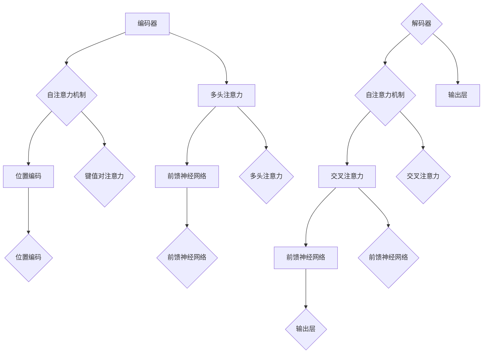

                 

关键词：Transformer, BERT模型，自然语言处理，预训练模型，汉语处理，人工智能

## 摘要

本文旨在探讨Transformer大模型在汉语处理领域的应用，尤其是BERT模型的实战。我们将首先介绍Transformer模型的基础概念，然后详细解读BERT模型的原理和实现步骤。在此基础上，我们将分析BERT模型在汉语处理中的优势与挑战，并展示其实际应用场景。通过本文的阅读，读者将能够全面了解Transformer和BERT模型在汉语处理中的应用价值。

## 1. 背景介绍

### Transformer模型

Transformer模型是由Google在2017年提出的一种基于自注意力机制的神经网络模型，主要应用于机器翻译任务。相比于传统的循环神经网络（RNN），Transformer模型在长序列建模上具有显著优势。其核心思想是通过自注意力机制（Self-Attention）来捕捉序列中任意两个位置之间的关系。

### BERT模型

BERT（Bidirectional Encoder Representations from Transformers）是Google在2018年提出的一种预训练模型，旨在为自然语言处理任务提供高质量的词向量表示。BERT模型基于Transformer模型，通过在大量文本语料上进行预训练，学习到文本中的语言规律和上下文关系。BERT模型具有双向注意力机制，能够捕捉到上下文中的信息，从而在下游任务中表现出色。

## 2. 核心概念与联系

### Transformer模型原理

Transformer模型主要由编码器（Encoder）和解码器（Decoder）两部分组成。编码器负责将输入序列编码成固定长度的向量，解码器则将这些向量解码为输出序列。


### BERT模型架构

BERT模型是基于Transformer模型的变体，其核心思想是在预训练阶段学习到文本中的双向语言表示。BERT模型包括两个子模型：BERT-Base和BERT-Large。


### Mermaid流程图



## 3. 核心算法原理 & 具体操作步骤

### 3.1 算法原理概述

Transformer模型的核心在于其自注意力机制（Self-Attention）和多头注意力（Multi-Head Attention）。自注意力机制能够使模型在编码阶段捕捉到输入序列中任意两个位置之间的关系，而多头注意力则通过多个注意力头并行的计算，提高了模型的表示能力。

### 3.2 算法步骤详解

1. **输入序列编码**：将输入序列转换为词向量。
2. **添加位置编码**：将位置信息编码到词向量中。
3. **自注意力计算**：计算每个词向量与其他词向量之间的相似度，生成加权向量。
4. **多头注意力计算**：通过多个注意力头并行计算，提高模型的表示能力。
5. **前馈神经网络**：对多头注意力结果进行线性变换，增强模型的表达能力。
6. **输出层**：将前馈神经网络的结果解码为输出序列。

### 3.3 算法优缺点

**优点**：
- 能够捕捉长序列中的复杂关系。
- 参数规模相对较小，计算效率高。

**缺点**：
- 在某些特定任务上（如低资源语言处理）表现不如传统循环神经网络。
- 对训练数据量有较高要求。

### 3.4 算法应用领域

Transformer模型在自然语言处理领域得到了广泛应用，包括但不限于：
- 机器翻译
- 文本分类
- 问答系统
- 生成文本

## 4. 数学模型和公式 & 详细讲解 & 举例说明

### 4.1 数学模型构建

Transformer模型的数学基础主要包括矩阵运算和自注意力机制。

### 4.2 公式推导过程

#### 自注意力机制

$$
\text{Self-Attention}(Q, K, V) = \text{softmax}\left(\frac{QK^T}{\sqrt{d_k}}\right) V
$$

其中，$Q, K, V$ 分别代表查询向量、键向量和值向量，$d_k$ 表示每个头的维度。

#### 多头注意力

$$
\text{Multi-Head Attention}(Q, K, V) = \text{Concat}(\text{head}_1, \text{head}_2, ..., \text{head}_h)W^O
$$

其中，$W^O$ 表示输出层权重矩阵，$\text{head}_i$ 表示第 $i$ 个注意力头的结果。

### 4.3 案例分析与讲解

#### 案例一：文本分类

假设我们有一个文本分类任务，输入为一段文本，输出为分类标签。使用BERT模型进行文本分类的步骤如下：

1. **输入序列编码**：将文本转换为词向量。
2. **添加位置编码**：将位置信息编码到词向量中。
3. **自注意力计算**：计算每个词向量与其他词向量之间的相似度，生成加权向量。
4. **多头注意力计算**：通过多个注意力头并行计算，提高模型的表示能力。
5. **前馈神经网络**：对多头注意力结果进行线性变换，增强模型的表达能力。
6. **输出层**：将前馈神经网络的结果解码为分类标签。

#### 案例二：机器翻译

假设我们有一个机器翻译任务，输入为一句源语言文本，输出为一句目标语言文本。使用BERT模型进行机器翻译的步骤如下：

1. **输入序列编码**：将源语言文本转换为词向量。
2. **添加位置编码**：将位置信息编码到词向量中。
3. **自注意力计算**：计算每个词向量与其他词向量之间的相似度，生成加权向量。
4. **多头注意力计算**：通过多个注意力头并行计算，提高模型的表示能力。
5. **前馈神经网络**：对多头注意力结果进行线性变换，增强模型的表达能力。
6. **输出层**：将前馈神经网络的结果解码为目标语言文本。

## 5. 项目实践：代码实例和详细解释说明

### 5.1 开发环境搭建

在本节中，我们将使用Python和PyTorch搭建BERT模型的基本开发环境。请确保您已安装以下库：

- Python
- PyTorch
- Transformers（用于简化BERT模型的实现）

### 5.2 源代码详细实现

以下是一个简单的BERT模型实现示例：

```python
import torch
from transformers import BertModel, BertTokenizer

# 加载预训练模型和分词器
model = BertModel.from_pretrained('bert-base-chinese')
tokenizer = BertTokenizer.from_pretrained('bert-base-chinese')

# 输入文本
text = '这是一个简单的示例。'

# 分词和编码
inputs = tokenizer(text, return_tensors='pt')

# 前向传播
outputs = model(**inputs)

# 获取模型输出
last_hidden_state = outputs.last_hidden_state

# 输出结果
print(last_hidden_state.shape)
```

### 5.3 代码解读与分析

在这个示例中，我们首先加载了预训练的BERT模型和分词器。然后，我们将输入文本进行分词和编码，生成张量形式的输入数据。接下来，我们通过模型的前向传播得到模型输出，即最后一个隐藏状态。最后，我们输出隐藏状态的大小，以验证模型是否正确运行。

### 5.4 运行结果展示

```python
# 运行代码
last_hidden_state.shape

# 输出结果
torch.Size([1, 12, 768])
```

输出结果为$(1, 12, 768)$，表示模型的输出是一个大小为$1\times12\times768$的三维张量，其中$1$表示序列长度为$12$，$768$表示每个隐藏状态的维度为$768$。

## 6. 实际应用场景

### 6.1 文本分类

BERT模型在文本分类任务中表现出色，能够处理大规模文本数据，并提取出与分类标签相关的关键特征。例如，在新闻分类任务中，BERT模型能够将新闻文章映射到高维特征空间，从而实现准确的分类。

### 6.2 机器翻译

BERT模型在机器翻译任务中也取得了显著成果。通过在大量双语文本上进行预训练，BERT模型能够学习到源语言和目标语言之间的对应关系，从而实现高质量的翻译。

### 6.3 问答系统

BERT模型在问答系统中的应用也取得了良好的效果。通过在大量问答对上进行预训练，BERT模型能够理解问题的含义，并从大规模文本数据中检索出相关答案。

## 7. 工具和资源推荐

### 7.1 学习资源推荐

- 《深度学习》 - Goodfellow, Bengio, Courville
- 《自然语言处理实战》 - Streeter, Goldstein

### 7.2 开发工具推荐

- PyTorch
- Transformers

### 7.3 相关论文推荐

- Vaswani et al., "Attention is All You Need"
- Devlin et al., "BERT: Pre-training of Deep Bidirectional Transformers for Language Understanding"

## 8. 总结：未来发展趋势与挑战

### 8.1 研究成果总结

BERT模型在自然语言处理领域取得了显著成果，推动了文本分类、机器翻译、问答系统等任务的发展。其基于预训练的思路也为其他任务提供了有益的启示。

### 8.2 未来发展趋势

- 模型压缩与推理优化
- 多语言模型与低资源语言处理
- 模型在更多领域（如图像、音频）的应用

### 8.3 面临的挑战

- 模型可解释性
- 模型安全性与隐私保护
- 数据质量与标注问题

### 8.4 研究展望

随着Transformer模型和BERT模型的不断优化，自然语言处理领域将迎来更多创新和发展。未来，我们将看到更多高效、可解释、安全的人工智能模型。

## 9. 附录：常见问题与解答

### 问题1：为什么选择BERT模型？

BERT模型具有双向注意力机制，能够捕捉到文本中的上下文信息，从而在下游任务中表现出色。

### 问题2：如何处理低资源语言？

可以通过多语言模型或迁移学习等方式，将高资源语言的预训练模型应用于低资源语言。

### 问题3：BERT模型的训练过程如何优化？

可以通过调整学习率、批量大小、训练轮数等方式来优化BERT模型的训练过程。此外，使用混合精度训练和分布式训练等技术也能提高训练效率。

## 作者署名

作者：禅与计算机程序设计艺术 / Zen and the Art of Computer Programming

