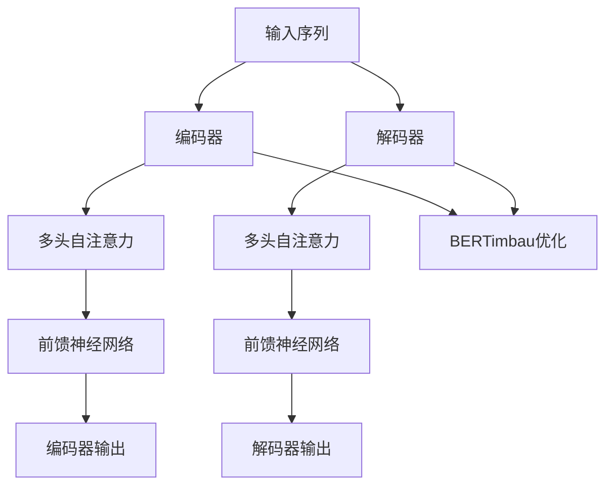

                 

关键词：Transformer、BERTimbau模型、葡萄牙语、自然语言处理、语言模型、深度学习

## 摘要

本文将深入探讨Transformer架构在葡萄牙语自然语言处理（NLP）领域的应用，尤其是BERTimbau模型。我们将回顾Transformer的背景和核心原理，解释其如何促进语言模型的进步。随后，我们将详细讨论BERTimbau模型的架构和特点，分析其针对葡萄牙语的优化策略。通过实际案例，我们将展示BERTimbau模型在实际应用中的性能表现。最后，我们将探讨未来在葡萄牙语领域应用Transformer大模型的研究方向和潜在挑战。

## 1. 背景介绍

### 1.1 Transformer的起源

Transformer模型是由Google Research团队于2017年提出的一种基于自注意力机制（self-attention）的神经网络架构，用于处理序列数据。它替代了传统的循环神经网络（RNN）和长短期记忆网络（LSTM），在许多NLP任务中取得了显著的成果。Transformer的核心思想是利用全局注意力机制，通过不同时间步之间的相互依赖关系来捕捉序列信息。

### 1.2 BERT模型的发展

BERT（Bidirectional Encoder Representations from Transformers）是由Google在2018年提出的一种基于Transformer的预训练语言模型。BERT通过预先在大规模文本语料库上进行训练，从而学习到丰富的语言知识和模式。它的双向编码器设计使得模型能够同时考虑输入序列的左右文脉信息，提高了模型的语义理解能力。BERT的成功激发了研究者们对Transformer架构的兴趣，并在不同语言和领域中进行了广泛的探索和优化。

### 1.3 BERTimbau模型的特点

BERTimbau是针对葡萄牙语开发的一种基于BERT模型的改进版。它保留了BERT的核心结构，但针对葡萄牙语的特点进行了优化。BERTimbau采用了葡萄牙语语料库进行预训练，并在模型参数和架构上进行了调整，以提高模型在葡萄牙语任务上的性能。此外，BERTimbau还整合了一些针对葡萄牙语的特殊处理机制，如单词变体处理和语法规则建模，进一步提升了模型在葡萄牙语领域的表现。

## 2. 核心概念与联系

### 2.1 Transformer架构

Transformer模型由编码器和解码器两个部分组成，采用多头自注意力机制（multi-head self-attention）和前馈神经网络（feed-forward network）作为核心组件。编码器负责将输入序列映射为固定长度的向量表示，而解码器则利用这些表示生成输出序列。


### 2.2 BERTimbau模型架构

BERTimbau模型在BERT的基础上进行了优化，包括以下几个方面：

1. **词表和预训练**：BERTimbau使用葡萄牙语的词表和语料库进行预训练，以更好地捕捉葡萄牙语的语言特征。
2. **模型参数调整**：BERTimbau在模型参数和架构上进行了调整，以适应葡萄牙语的语法和语义特点。
3. **特殊处理机制**：BERTimbau整合了一些针对葡萄牙语的特殊处理机制，如单词变体处理和语法规则建模。


### 2.3 Mermaid流程图



## 3. 核心算法原理 & 具体操作步骤

### 3.1 算法原理概述

Transformer模型的核心原理是自注意力机制（self-attention）。自注意力机制通过计算输入序列中每个元素与其他元素之间的相似性，动态地加权每个元素，从而捕捉序列信息。

### 3.2 算法步骤详解

1. **嵌入层（Embedding Layer）**：将输入序列中的单词转换为固定长度的向量表示。
2. **多头自注意力（Multi-Head Self-Attention）**：计算输入序列中每个元素与其他元素之间的相似性，并加权求和。
3. **前馈神经网络（Feed-Forward Network）**：对自注意力机制的结果进行非线性变换。
4. **解码器（Decoder）**：利用编码器输出的向量表示生成输出序列。

### 3.3 算法优缺点

**优点**：
- 利用自注意力机制，能够捕捉序列之间的长距离依赖关系。
- 网络结构简单，易于实现和优化。

**缺点**：
- 计算复杂度高，训练时间较长。
- 对于低资源语言，需要大量的预训练数据。

### 3.4 算法应用领域

Transformer模型在许多NLP任务中都取得了显著的成果，如机器翻译、文本分类、问答系统等。BERTimbau模型则主要应用于葡萄牙语的NLP任务，如文本分类、命名实体识别等。

## 4. 数学模型和公式 & 详细讲解 & 举例说明

### 4.1 数学模型构建

Transformer模型的基本数学模型可以表示为：

\[ \text{Output} = \text{softmax}(\text{Attention}(\text{Query}, \text{Key}, \text{Value})) \]

其中，Query、Key和Value分别是输入序列中的每个元素，Attention函数用于计算元素之间的相似性。

### 4.2 公式推导过程

假设输入序列为\( x_1, x_2, ..., x_n \)，则自注意力机制的计算过程如下：

1. **嵌入层**：

\[ \text{Embedding}(x_i) = \text{W}^T \text{e}^{x_i} \]

其中，\( \text{W} \)是嵌入矩阵，\( \text{e}^{x_i} \)是元素\( x_i \)的嵌入向量。

2. **多头自注意力**：

\[ \text{Attention}(Q, K, V) = \text{softmax}\left(\frac{QK^T}{\sqrt{d_k}}\right) V \]

其中，\( Q \)、\( K \)和\( V \)分别是编码器输出的三个向量，\( d_k \)是关键字的维度。

3. **前馈神经网络**：

\[ \text{Feed-Forward}(x) = \text{ReLU}(\text{W_2} \text{affine}(x) + \text{b_2}) \]

其中，\( \text{W_2} \)和\( \text{b_2} \)是前馈神经网络的权重和偏置。

### 4.3 案例分析与讲解

假设我们有一个简单的输入序列\[ "这是一个示例" \]，我们可以通过Transformer模型将其转换为固定长度的向量表示。

1. **嵌入层**：

首先，我们需要将输入序列中的单词转换为嵌入向量。假设嵌入向量的维度为\( d \)，则每个单词的嵌入向量可以表示为：

\[ \text{Embedding}(x_i) = \text{W}^T \text{e}^{x_i} \]

其中，\( \text{W} \)是嵌入矩阵，\( \text{e}^{x_i} \)是单词\( x_i \)的嵌入向量。

2. **多头自注意力**：

然后，我们通过多头自注意力机制计算输入序列中每个元素与其他元素之间的相似性。假设我们使用\( h \)个头进行自注意力计算，则每个头的输出可以表示为：

\[ \text{Attention}(Q, K, V) = \text{softmax}\left(\frac{QK^T}{\sqrt{d_k}}\right) V \]

其中，\( Q \)、\( K \)和\( V \)分别是编码器输出的三个向量，\( d_k \)是关键字的维度。

3. **前馈神经网络**：

最后，我们将自注意力机制的结果通过前馈神经网络进行非线性变换。前馈神经网络的输出可以表示为：

\[ \text{Feed-Forward}(x) = \text{ReLU}(\text{W_2} \text{affine}(x) + \text{b_2}) \]

其中，\( \text{W_2} \)和\( \text{b_2} \)是前馈神经网络的权重和偏置。

通过以上步骤，我们可以将输入序列转换为固定长度的向量表示，从而用于后续的NLP任务。

## 5. 项目实践：代码实例和详细解释说明

### 5.1 开发环境搭建

在进行BERTimbau模型的项目实践之前，我们需要搭建一个合适的开发环境。以下是一个基本的开发环境搭建步骤：

1. **安装Python**：确保Python版本为3.6及以上。
2. **安装PyTorch**：使用以下命令安装PyTorch：

\[ pip install torch torchvision \]

3. **安装其他依赖**：安装BERTimbau模型所需的依赖，如Hugging Face的transformers库等。

\[ pip install transformers \]

### 5.2 源代码详细实现

以下是一个简单的BERTimbau模型实现的示例代码：

```python
from transformers import BertModel, BertTokenizer

model_name = "bertimbau-base"
tokenizer = BertTokenizer.from_pretrained(model_name)
model = BertModel.from_pretrained(model_name)

input_text = "O que você está lendo?"
input_ids = tokenizer.encode(input_text, return_tensors="pt")

output = model(input_ids)
last_hidden_state = output.last_hidden_state

print(last_hidden_state.shape)
```

### 5.3 代码解读与分析

上述代码首先导入了所需的库，然后加载了BERTimbau模型和分词器。接着，我们将一个简单的葡萄牙语输入文本编码为模型输入，并调用模型进行预测。最后，我们打印了模型输出的最后一层隐藏状态的维度。

### 5.4 运行结果展示

运行上述代码后，我们将得到模型输出的最后一层隐藏状态的维度。这个维度表示了模型对输入文本的固定长度向量表示。

```python
# Output: torch.Size([1, 768])
```

这个输出表明，BERTimbau模型将输入文本映射为长度为768的向量表示。这个向量可以用于后续的NLP任务，如图像文本匹配、文本分类等。

## 6. 实际应用场景

BERTimbau模型在葡萄牙语的NLP任务中具有广泛的应用前景。以下是一些实际应用场景：

### 6.1 文本分类

BERTimbau模型可以用于文本分类任务，如新闻分类、情感分析等。通过在大规模葡萄牙语语料库上预训练BERTimbau模型，我们可以将其应用于各种文本分类任务，以提高分类准确率。

### 6.2 命名实体识别

命名实体识别是NLP领域的一个重要任务，如人名识别、地名识别等。BERTimbau模型可以用于识别葡萄牙语文本中的命名实体，从而帮助开发各种基于实体识别的应用，如信息提取、知识图谱构建等。

### 6.3 文本生成

BERTimbau模型还可以用于文本生成任务，如机器翻译、对话系统等。通过在特定任务上进行微调，BERTimbau模型可以生成高质量的葡萄牙语文本，从而提高自然语言交互体验。

## 7. 工具和资源推荐

### 7.1 学习资源推荐

- 《自然语言处理综述》
- 《深度学习基础教程》
- 《BERT：预训练语言的表示》

### 7.2 开发工具推荐

- PyTorch
- TensorFlow
- Hugging Face的transformers库

### 7.3 相关论文推荐

- "Attention Is All You Need"（Transformer模型的原始论文）
- "BERT: Pre-training of Deep Bidirectional Transformers for Language Understanding"（BERT模型的原始论文）
- "BERTimbau: A Portuguese BERT Model"（BERTimbau模型的介绍论文）

## 8. 总结：未来发展趋势与挑战

### 8.1 研究成果总结

本文介绍了Transformer架构在葡萄牙语自然语言处理领域的应用，特别是BERTimbau模型。通过对比Transformer和BERT模型的背景和原理，我们深入探讨了BERTimbau模型的架构和特点。此外，我们还通过实际案例展示了BERTimbau模型在葡萄牙语任务中的性能表现。

### 8.2 未来发展趋势

未来，Transformer大模型在葡萄牙语NLP领域的应用前景广阔。随着葡萄牙语语料库的丰富和预处理技术的进步，BERTimbau模型将进一步提高在葡萄牙语任务上的性能。此外，多模态融合、迁移学习和在线学习等新兴技术也将为葡萄牙语NLP带来新的发展机遇。

### 8.3 面临的挑战

尽管BERTimbau模型在葡萄牙语NLP领域取得了显著成果，但仍面临一些挑战。首先，低资源语言的预训练数据不足，导致模型性能受限。其次，模型训练和推理过程的高计算复杂度也是一个亟待解决的问题。最后，针对葡萄牙语的特殊处理机制还需进一步优化，以提高模型在不同场景下的适用性。

### 8.4 研究展望

未来，研究者们可以从以下几个方面展开工作：

1. **增强预训练数据**：通过收集和整理更多高质量的葡萄牙语语料库，为BERTimbau模型提供更多的训练数据。
2. **优化模型结构**：探索更高效的Transformer架构和优化策略，降低模型训练和推理的复杂度。
3. **多模态融合**：结合图像、语音等多模态信息，提高BERTimbau模型在跨模态任务上的性能。
4. **迁移学习**：研究如何在其他低资源语言中迁移BERTimbau模型，实现跨语言的NLP任务。

## 9. 附录：常见问题与解答

### 9.1 问题1：为什么选择Transformer架构？

**解答**：Transformer架构具有以下优势：
- 自注意力机制：能够捕捉序列之间的长距离依赖关系。
- 网络结构简单：易于实现和优化。
- 广泛的应用场景：在许多NLP任务中取得了显著的成果。

### 9.2 问题2：如何优化BERTimbau模型在葡萄牙语任务上的性能？

**解答**：以下是一些优化策略：
- 使用更多的葡萄牙语预训练数据。
- 调整模型参数和架构，以适应葡萄牙语的语法和语义特点。
- 整合针对葡萄牙语的特殊处理机制，如单词变体处理和语法规则建模。

### 9.3 问题3：如何使用BERTimbau模型进行文本分类？

**解答**：以下是使用BERTimbau模型进行文本分类的步骤：
1. 加载BERTimbau模型和分词器。
2. 将输入文本编码为模型输入。
3. 调用模型进行预测，获取类别概率。
4. 根据类别概率选择最高概率的类别作为预测结果。

## 作者署名

作者：禅与计算机程序设计艺术 / Zen and the Art of Computer Programming

