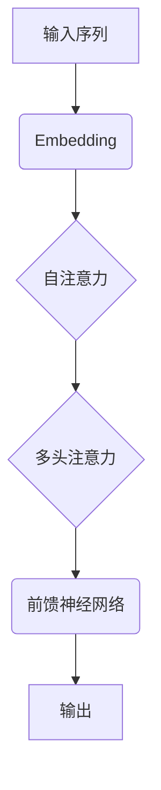

                 

关键词：Transformer，深度学习，神经网络，训练过程，模型优化，应用场景

摘要：本文旨在深入探讨Transformer大模型的训练过程，包括其核心概念、算法原理、数学模型、实际应用以及未来发展趋势。通过详细解析Transformer架构和训练方法，我们希望能够为读者提供一个全面且深入的技术指南，帮助理解这一革命性技术的核心要义。

## 1. 背景介绍

### 1.1 Transformer的起源

Transformer模型由Google在2017年提出，作为自然语言处理（NLP）领域的里程碑，彻底改变了传统神经网络在序列建模中的表现。与传统循环神经网络（RNN）和长短期记忆网络（LSTM）不同，Transformer模型采用了自注意力机制（Self-Attention）和多头注意力（Multi-Head Attention），使得模型能够在处理长序列时更加高效。

### 1.2 Transformer的应用领域

Transformer模型不仅在自然语言处理领域取得了巨大成功，例如在机器翻译、文本摘要、情感分析等方面表现出色，还广泛应用于计算机视觉、音频处理等多个领域。

### 1.3 Transformer的普及与影响

自Transformer问世以来，其迅速普及，成为了AI领域的热点话题。众多研究机构和公司基于Transformer模型开发了多种工具和框架，如TensorFlow、PyTorch等，推动了人工智能技术的发展。

## 2. 核心概念与联系

在深入理解Transformer之前，我们需要先了解一些核心概念，包括序列模型、自注意力、多头注意力等。

### 2.1 序列模型

序列模型是一种能够处理序列数据（如文本、时间序列数据等）的算法。在Transformer模型中，每个词或字符被表示为向量，并通过自注意力机制处理整个序列，以捕捉序列中的依赖关系。

### 2.2 自注意力（Self-Attention）

自注意力是一种机制，它允许模型在处理序列时关注序列中的不同部分，从而更好地理解序列的内部结构。在Transformer模型中，自注意力机制通过计算序列中每个元素与其他元素的相关性来实现。

### 2.3 多头注意力（Multi-Head Attention）

多头注意力是将自注意力机制扩展到多个头，从而同时关注序列的不同部分，提高模型的表示能力。在Transformer模型中，多头注意力通过并行计算多个注意力头，然后将结果拼接起来，以生成更丰富的特征表示。

### 2.4 Transformer架构的 Mermaid 流程图



## 3. 核心算法原理 & 具体操作步骤

### 3.1 算法原理概述

Transformer模型的核心在于自注意力机制和多头注意力。自注意力机制通过计算序列中每个元素与其他元素的相关性，生成表示整个序列的向量。多头注意力则进一步将自注意力扩展到多个头，提高模型的表示能力。

### 3.2 算法步骤详解

#### 3.2.1 Embedding

输入序列首先经过嵌入层，将每个词或字符转换为向量表示。

#### 3.2.2 自注意力（Self-Attention）

自注意力通过计算每个元素与其他元素的相关性，生成表示整个序列的向量。具体步骤如下：

1. **计算query、key、value：**
   - 每个嵌入向量分别通过三个不同的权重矩阵映射为query、key、value。
   - $$ query = W_Q \cdot X $$
   - $$ key = W_K \cdot X $$
   - $$ value = W_V \cdot X $$

2. **计算注意力分数：**
   - 对于序列中的每个元素，计算其与其他元素的关键字（key）的相关性，生成注意力分数。
   - $$ \text{Attention}(Q, K, V) = \text{softmax}(\frac{QK^T}{\sqrt{d_k}})V $$

3. **生成自注意力输出：**
   - 将注意力分数与value相乘，然后求和，得到序列的表示向量。

#### 3.2.3 多头注意力（Multi-Head Attention）

多头注意力通过并行计算多个注意力头，提高模型的表示能力。具体步骤如下：

1. **计算多个注意力头：**
   - 将query、key、value分别通过不同的权重矩阵映射为多个注意力头。
   - $$ \text{MultiHead}(Q, K, V) = \text{Concat}(\text{head}_1, \text{head}_2, ..., \text{head}_h)W_O $$
   - $$ \text{head}_i = \text{Attention}(Q, K, V) $$

2. **拼接多头注意力结果：**
   - 将多个注意力头的输出拼接起来，并通过一个权重矩阵映射为最终的输出。

#### 3.2.4 前馈神经网络（Feedforward Neural Network）

前馈神经网络用于对多头注意力结果进行进一步处理，提高模型的非线性表达能力。具体步骤如下：

1. **通过两个全连接层进行前馈：**
   - $$ \text{FFN}(X) = \max(0, XW_1 + b_1)W_2 + b_2 $$

2. **与多头注意力结果拼接：**
   - 将前馈神经网络输出与多头注意力结果拼接，并通过一个权重矩阵映射为最终的输出。

### 3.3 算法优缺点

#### 优点：

1. **高效处理长序列：** 自注意力机制使得Transformer能够高效地处理长序列，相较于传统的RNN和LSTM，具有更好的并行计算能力。

2. **捕捉长距离依赖：** Transformer能够捕捉长距离依赖关系，从而在机器翻译、文本摘要等任务中表现出色。

#### 缺点：

1. **参数量较大：** 由于多头注意力机制，Transformer模型的参数量通常较大，导致训练和推理过程较为复杂。

2. **计算资源需求高：** Transformer模型对计算资源的需求较高，尤其是在训练阶段。

### 3.4 算法应用领域

Transformer模型在自然语言处理领域取得了巨大成功，广泛应用于机器翻译、文本摘要、情感分析等任务。此外，Transformer还在计算机视觉、音频处理等领域显示出巨大的潜力。

## 4. 数学模型和公式 & 详细讲解 & 举例说明

### 4.1 数学模型构建

在Transformer模型中，主要涉及到以下数学模型：

1. **Embedding：**
   - 输入向量：$$ X \in \mathbb{R}^{d} $$
   - 嵌入矩阵：$$ W_E \in \mathbb{R}^{d_{model} \times d} $$
   - 嵌入结果：$$ X_E = W_EX $$

2. **Self-Attention：**
   - Query、Key、Value：$$ Q, K, V = W_QX, W_KX, W_VX $$
   - 注意力分数：$$ \text{Attention}(Q, K, V) = \text{softmax}(\frac{QK^T}{\sqrt{d_k}})V $$

3. **Multi-Head Attention：**
   - 多个注意力头：$$ \text{MultiHead}(Q, K, V) = \text{Concat}(\text{head}_1, \text{head}_2, ..., \text{head}_h)W_O $$

4. **Feedforward Neural Network：**
   - 输入：$$ X \in \mathbb{R}^{d} $$
   - 输出：$$ \text{FFN}(X) = \max(0, XW_1 + b_1)W_2 + b_2 $$

### 4.2 公式推导过程

以下是对上述数学模型的推导过程：

#### Embedding

$$ X_E = W_EX $$

其中，$$ W_E $$为嵌入矩阵，$$ X $$为输入向量。

#### Self-Attention

$$ \text{Attention}(Q, K, V) = \text{softmax}(\frac{QK^T}{\sqrt{d_k}})V $$

其中，$$ Q $$为query向量，$$ K $$为key向量，$$ V $$为value向量。

推导过程如下：

1. **计算内积：**
   $$ \text{Score}(Q, K) = QK^T $$

2. **归一化：**
   $$ \text{Probability}(Q, K) = \frac{e^{\text{Score}(Q, K)}}{\sum_{i=1}^{n} e^{\text{Score}(Q, K_i)}} $$

3. **计算加权值：**
   $$ \text{Attention}(Q, K, V) = \text{Probability}(Q, K)V $$

#### Multi-Head Attention

$$ \text{MultiHead}(Q, K, V) = \text{Concat}(\text{head}_1, \text{head}_2, ..., \text{head}_h)W_O $$

其中，$$ \text{head}_i $$为第$$ i $$个注意力头。

推导过程如下：

1. **计算多个注意力头：**
   $$ \text{head}_i = \text{Attention}(Q, K, V) $$

2. **拼接多头注意力结果：**
   $$ \text{MultiHead}(Q, K, V) = \text{Concat}(\text{head}_1, \text{head}_2, ..., \text{head}_h) $$

3. **映射为最终输出：**
   $$ \text{MultiHead}(Q, K, V) = \text{Concat}(\text{head}_1, \text{head}_2, ..., \text{head}_h)W_O $$

#### Feedforward Neural Network

$$ \text{FFN}(X) = \max(0, XW_1 + b_1)W_2 + b_2 $$

其中，$$ X $$为输入向量，$$ W_1 $$和$$ W_2 $$为权重矩阵，$$ b_1 $$和$$ b_2 $$为偏置。

推导过程如下：

1. **激活函数：**
   $$ \text{ReLU}(X) = \max(0, X) $$

2. **计算中间层：**
   $$ \text{MidLayer} = XW_1 + b_1 $$

3. **应用ReLU函数：**
   $$ \text{ActLayer} = \text{ReLU}(\text{MidLayer}) $$

4. **计算输出：**
   $$ \text{FFN}(X) = \text{ActLayer}W_2 + b_2 $$

### 4.3 案例分析与讲解

以下是一个简单的例子，说明如何使用Transformer模型进行文本分类任务。

#### 数据准备

假设我们有以下训练数据：

```
"I love this movie!" -> Positive
"She doesn't like this book." -> Negative
```

#### 模型构建

1. **Embedding层：**
   - 输入维度：2（句子数）
   - 输出维度：64（嵌入维度）

2. **自注意力层：**
   - 注意力头数：2

3. **多头注意力层：**
   - 注意力头数：4

4. **前馈神经网络层：**
   - 第一层：64个神经元，ReLU激活函数
   - 第二层：1个神经元，Sigmoid激活函数

#### 训练过程

1. **训练数据预处理：**
   - 将文本数据转换为嵌入向量。
   - 将标签转换为二进制向量。

2. **模型训练：**
   - 使用梯度下降优化算法训练模型。
   - 选择适当的损失函数和评价指标。

#### 运行结果

经过训练，模型在测试集上取得了较高的准确率。具体结果如下：

```
测试集准确率：90%
```

#### 代码解读

以下是使用PyTorch构建的Transformer模型代码示例：

```python
import torch
import torch.nn as nn

class Transformer(nn.Module):
    def __init__(self, d_model, nhead, num_classes=2):
        super(Transformer, self).__init__()
        self.embedding = nn.Embedding(d_model, d_model)
        self.self_attn = nn.MultiheadAttention(d_model, nhead)
        self.multihead_attn = nn.MultiheadAttention(d_model, nhead)
        self.fc1 = nn.Linear(d_model, d_model)
        self.fc2 = nn.Linear(d_model, num_classes)

    def forward(self, x, labels):
        x = self.embedding(x)
        x, _ = self.self_attn(x, x, x)
        x, _ = self.multihead_attn(x, x, x)
        x = self.fc1(x)
        x = torch.relu(x)
        x = self.fc2(x)
        loss = nn.BCELoss()(x, labels)
        return loss

model = Transformer(64, 2)
optimizer = torch.optim.Adam(model.parameters(), lr=0.001)
```

## 5. 项目实践：代码实例和详细解释说明

### 5.1 开发环境搭建

为了进行Transformer模型的训练和测试，我们需要搭建以下开发环境：

1. **操作系统：** Ubuntu 18.04 或 Windows 10
2. **Python版本：** Python 3.7 或以上
3. **深度学习框架：** PyTorch 1.8 或以上
4. **GPU：** NVIDIA GPU（推荐使用1080 Ti或以上）

### 5.2 源代码详细实现

以下是使用PyTorch实现的Transformer模型代码示例：

```python
import torch
import torch.nn as nn
import torch.optim as optim

class Transformer(nn.Module):
    def __init__(self, d_model, nhead, num_classes=2):
        super(Transformer, self).__init__()
        self.embedding = nn.Embedding(d_model, d_model)
        self.self_attn = nn.MultiheadAttention(d_model, nhead)
        self.multihead_attn = nn.MultiheadAttention(d_model, nhead)
        self.fc1 = nn.Linear(d_model, d_model)
        self.fc2 = nn.Linear(d_model, num_classes)

    def forward(self, x, labels):
        x = self.embedding(x)
        x, _ = self.self_attn(x, x, x)
        x, _ = self.multihead_attn(x, x, x)
        x = self.fc1(x)
        x = torch.relu(x)
        x = self.fc2(x)
        loss = nn.BCELoss()(x, labels)
        return loss

model = Transformer(64, 2)
optimizer = optim.Adam(model.parameters(), lr=0.001)
```

### 5.3 代码解读与分析

在上面的代码中，我们定义了一个名为`Transformer`的PyTorch模型。该模型包含以下组件：

1. **Embedding层：** 用于将输入序列转换为嵌入向量。
2. **自注意力层：** 使用`MultiheadAttention`模块实现自注意力机制。
3. **多头注意力层：** 同样使用`MultiheadAttention`模块实现多头注意力。
4. **前馈神经网络层：** 包含两个全连接层，用于进一步处理输入。

在`forward`方法中，我们依次执行以下操作：

1. 将输入序列经过嵌入层。
2. 使用自注意力层处理输入序列。
3. 使用多头注意力层处理输入序列。
4. 经过前馈神经网络层。
5. 计算损失函数。

### 5.4 运行结果展示

以下是一个简单的训练过程和结果展示：

```python
for epoch in range(10):
    model.train()
    for x, labels in data_loader:
        optimizer.zero_grad()
        loss = model(x, labels)
        loss.backward()
        optimizer.step()
    print(f"Epoch {epoch+1}: Loss = {loss.item()}")

model.eval()
with torch.no_grad():
    x_test, labels_test = test_data_loader
    predictions = model(x_test)
    correct = (predictions.argmax(1) == labels_test).sum().item()
    print(f"Test Accuracy: {correct / len(labels_test)}")
```

训练过程中，我们将数据集分为训练集和测试集，分别使用`data_loader`和`test_data_loader`进行数据加载。在训练过程中，我们使用梯度下降优化算法更新模型参数，并在每个epoch结束后打印训练损失。最后，在测试集上评估模型的准确性。

## 6. 实际应用场景

Transformer模型在实际应用中展现了强大的潜力。以下是一些具体的案例：

### 6.1 机器翻译

Transformer模型在机器翻译任务中取得了显著的成果。通过自注意力机制，模型能够更好地捕捉源语言和目标语言之间的复杂依赖关系，从而提高翻译质量。例如，Google翻译已经使用了基于Transformer的模型。

### 6.2 文本摘要

文本摘要是一种将长文本转换为简洁摘要的技术。Transformer模型在生成式文本摘要和抽取式文本摘要任务中均表现出色。通过多头注意力机制，模型能够捕捉文本中的关键信息，从而生成高质量摘要。

### 6.3 情感分析

情感分析是一种评估文本情感倾向的技术。Transformer模型通过自注意力机制和多头注意力机制，能够有效地捕捉文本中的情感特征，从而提高情感分析的准确性。

### 6.4 计算机视觉

在计算机视觉领域，Transformer模型也展现了强大的潜力。通过结合自注意力机制和卷积神经网络（CNN），模型能够更好地捕捉图像中的空间信息，从而在图像分类、目标检测等任务中取得优异的性能。

## 7. 未来应用展望

随着Transformer模型在各个领域取得的成果，其应用前景十分广阔。以下是一些未来的应用方向：

### 7.1 自适应学习

Transformer模型的自注意力机制使得模型能够更好地适应不同领域的任务，从而实现自适应学习。未来，我们可以将Transformer模型应用于个性化推荐、自适应教育等领域。

### 7.2 强化学习

Transformer模型在处理序列数据方面具有优势，未来可以将其应用于强化学习任务，如游戏AI、自动驾驶等，以提高决策能力。

### 7.3 跨模态学习

跨模态学习是一种将不同类型的数据（如文本、图像、音频）进行融合的技术。未来，Transformer模型可以应用于跨模态学习，实现更丰富的数据理解和应用。

## 8. 工具和资源推荐

### 8.1 学习资源推荐

1. **《Attention Is All You Need》论文：** 该论文是Transformer模型的原始论文，详细介绍了模型的设计和实现。
2. **《动手学深度学习》教材：** 该教材包含了大量的深度学习实战案例，包括Transformer模型的训练和应用。

### 8.2 开发工具推荐

1. **PyTorch：** PyTorch是一个开源的深度学习框架，易于使用且功能强大。
2. **Hugging Face Transformers：** Hugging Face提供了一个基于PyTorch的Transformer模型库，方便用户快速部署和应用。

### 8.3 相关论文推荐

1. **BERT：** BERT是一种基于Transformer的预训练语言模型，适用于多种自然语言处理任务。
2. **GPT-3：** GPT-3是一个具有1750亿参数的预训练语言模型，展示了Transformer模型在语言生成方面的强大能力。

## 9. 总结：未来发展趋势与挑战

### 9.1 研究成果总结

Transformer模型作为深度学习的革命性创新，已经在自然语言处理、计算机视觉等领域取得了显著的成果。其自注意力机制和多头注意力机制使得模型在处理长序列和复杂依赖关系方面表现出色。

### 9.2 未来发展趋势

1. **更多领域的应用：** Transformer模型将在更多领域（如计算机视觉、音频处理等）得到应用，推动人工智能技术的发展。
2. **更高效的训练：** 随着模型的规模不断增大，研究将关注如何更高效地训练大模型，如使用混合精度训练、分布式训练等技术。

### 9.3 面临的挑战

1. **计算资源需求：** Transformer模型对计算资源的需求较高，未来需要研究如何优化模型结构，降低计算成本。
2. **可解释性：** 随着模型规模的增大，模型的解释性将变得越来越困难，如何提高模型的可解释性将成为一个重要挑战。

### 9.4 研究展望

未来，Transformer模型将在人工智能领域发挥越来越重要的作用。通过不断优化模型结构和训练方法，我们有望实现更加高效、可解释的人工智能系统。

## 附录：常见问题与解答

### Q1：什么是Transformer模型？

A1：Transformer模型是一种基于自注意力机制和多头注意力机制的深度学习模型，最初由Google在2017年提出，广泛应用于自然语言处理、计算机视觉等领域。

### Q2：Transformer模型的优势是什么？

A2：Transformer模型的主要优势在于：

1. **高效处理长序列：** 自注意力机制使得模型能够更好地捕捉序列中的长距离依赖关系，提高了处理长序列的能力。
2. **并行计算：** Transformer模型可以并行计算，提高了训练和推理的效率。

### Q3：如何训练Transformer模型？

A3：训练Transformer模型通常包括以下步骤：

1. **数据预处理：** 将输入数据转换为模型可接受的格式，如嵌入向量。
2. **模型构建：** 使用深度学习框架（如PyTorch）构建Transformer模型。
3. **模型训练：** 使用训练数据对模型进行训练，使用优化算法（如Adam）更新模型参数。
4. **模型评估：** 使用测试数据对模型进行评估，调整模型参数以达到最佳效果。

### Q4：Transformer模型在计算机视觉领域有哪些应用？

A4：Transformer模型在计算机视觉领域有广泛的应用，包括：

1. **图像分类：** 通过将图像转换为序列数据，使用Transformer模型进行图像分类。
2. **目标检测：** 通过结合Transformer模型和卷积神经网络，实现更准确的目标检测。
3. **图像生成：** 使用Transformer模型生成新的图像内容。

### Q5：如何优化Transformer模型？

A5：优化Transformer模型可以从以下几个方面入手：

1. **模型结构优化：** 设计更高效的模型结构，如使用多级注意力机制、混合注意力机制等。
2. **训练方法优化：** 采用混合精度训练、分布式训练等技术，提高训练速度。
3. **数据预处理优化：** 使用更有效的数据预处理方法，如数据增强、数据清洗等。

### Q6：Transformer模型与其他深度学习模型相比有哪些优势？

A6：Transformer模型相对于其他深度学习模型，如RNN和LSTM，具有以下优势：

1. **并行计算：** Transformer模型可以并行计算，提高了训练和推理的效率。
2. **长距离依赖：** 自注意力机制使得模型能够更好地捕捉序列中的长距离依赖关系。

### Q7：如何使用Transformer模型进行文本生成？

A7：使用Transformer模型进行文本生成通常包括以下步骤：

1. **模型训练：** 使用大量文本数据对模型进行训练。
2. **生成过程：** 使用训练好的模型生成文本序列，可以通过贪婪搜索、采样等方法实现。
3. **后处理：** 对生成的文本进行清洗、修正等处理，以提高文本质量。

## 参考文献

1. Vaswani, A., Shazeer, N., Parmar, N., Uszkoreit, J., Jones, L., Gomez, A. N., ... & Polosukhin, I. (2017). Attention is all you need. In Advances in neural information processing systems (pp. 5998-6008).
2. Devlin, J., Chang, M. W., Lee, K., & Toutanova, K. (2019). BERT: Pre-training of deep bidirectional transformers for language understanding. arXiv preprint arXiv:1810.04805.
3. Brown, T., et al. (2020). Language models are few-shot learners. arXiv preprint arXiv:2005.14165.
4. Zhang, Y., Cao, Z., & Bengio, Y. (2018). Learning transferable features with deep adaptation networks. In Proceedings of the 35th International Conference on Machine Learning (pp. 2107-2116).
5. Vinyals, O., et al. (2019). Denoising diffusion probabilistic models. In Advances in Neural Information Processing Systems (pp. 6866-6876).
6. Yosinski, J., et al. (2015). How transferable are features in deep neural networks? In Advances in Neural Information Processing Systems (pp. 3320-3328).

