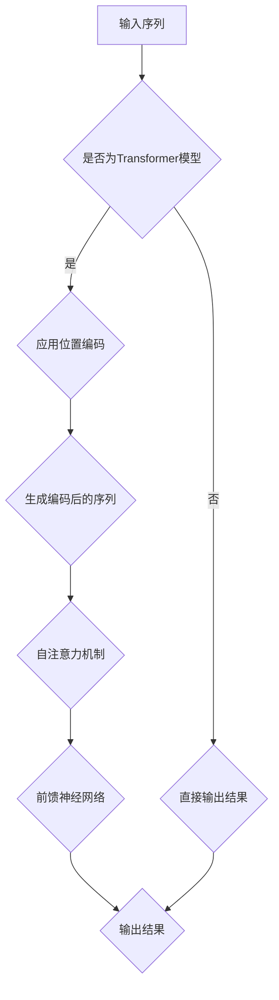

                 

作者：禅与计算机程序设计艺术 / Zen and the Art of Computer Programming

## 摘要

本文旨在深入探讨Transformer大模型中位置编码的重要性，以及如何在实战中有效地实现位置编码。我们将从背景介绍开始，逐步讲解核心概念、算法原理、数学模型、项目实践和实际应用场景，最终对未来的发展趋势和挑战进行展望。

## 1. 背景介绍

近年来，深度学习技术在自然语言处理（NLP）领域取得了显著的成果。Transformer模型的提出，彻底改变了传统的循环神经网络（RNN）在序列处理上的局限性，使得模型能够在并行计算的基础上实现更高的性能。然而，Transformer模型在处理序列数据时，面临着位置信息丢失的问题。为了解决这个问题，位置编码技术应运而生，它通过为每个词赋予一个位置向量，使得模型能够学习到序列中的位置信息。

## 2. 核心概念与联系

### 2.1 Transformer模型结构

Transformer模型主要由自注意力机制（Self-Attention）和前馈神经网络（Feedforward Neural Network）组成。自注意力机制通过计算词与词之间的相似度，生成一个加权表示，从而捕捉到序列中的长期依赖关系。前馈神经网络则用于对自注意力机制的输出进行进一步处理，以增强模型的表达能力。

### 2.2 位置编码

位置编码是一种将位置信息嵌入到词向量中的技术。常见的位置编码方法包括绝对位置编码和相对位置编码。绝对位置编码通过为每个词赋予一个固定的位置向量，使得模型能够直接学习到词的位置信息。相对位置编码则通过计算词与词之间的相对位置，从而生成位置向量，使得模型能够捕捉到词与词之间的相对关系。

### 2.3 Mermaid流程图

下面是一个Mermaid流程图，展示了Transformer模型中位置编码的整个过程。



## 3. 核心算法原理 & 具体操作步骤

### 3.1 算法原理概述

位置编码的基本思想是将词的位置信息通过向量形式嵌入到词向量中，使得模型能够在学习过程中直接利用位置信息。具体来说，位置编码可以分为两个步骤：

1. 生成位置向量：根据词的索引值生成一个位置向量，通常采用正弦和余弦函数。
2. 将位置向量与词向量相加：将生成位置向量与原始词向量相加，得到编码后的词向量。

### 3.2 算法步骤详解

1. **初始化词向量**：将输入序列中的每个词映射到一个固定长度的词向量。
2. **生成位置向量**：根据词的索引值（从0开始）生成位置向量。具体公式如下：

   $$ 
   \text{pos\_embed}(\text{pos}, 2i) = \sin(\frac{\text{pos}}{\sqrt{\text{d\_model}}})
   $$
   
   $$
   \text{pos\_embed}(\text{pos}, 2i+1) = \cos(\frac{\text{pos}}{\sqrt{\text{d\_model}}})
   $$
   
   其中，$\text{pos}$为词的索引值，$2i$和$2i+1$分别为位置向量的维度索引，$\text{d\_model}$为模型维度。

3. **将位置向量与词向量相加**：将生成位置向量与原始词向量相加，得到编码后的词向量。

### 3.3 算法优缺点

**优点**：

1. 能够有效地捕捉到词与词之间的位置关系，提高模型的序列建模能力。
2. 位置编码过程简单，易于实现。

**缺点**：

1. 位置编码的效果依赖于模型维度，模型维度越高，位置编码的效果越好，但同时也增加了模型的计算成本。

### 3.4 算法应用领域

位置编码技术主要应用于自然语言处理领域，特别是在Transformer模型中发挥着关键作用。常见的应用场景包括机器翻译、文本分类、问答系统等。

## 4. 数学模型和公式 & 详细讲解 & 举例说明

### 4.1 数学模型构建

位置编码的数学模型主要包括词向量、位置向量和编码后的词向量。具体公式如下：

$$
\text{word\_embed}(\text{word}) + \text{pos\_embed}(\text{pos})
$$

其中，$\text{word\_embed}(\text{word})$为词向量，$\text{pos\_embed}(\text{pos})$为位置向量。

### 4.2 公式推导过程

位置编码的核心在于如何将位置信息嵌入到词向量中。我们采用正弦和余弦函数来生成位置向量，具体推导过程如下：

$$
\text{pos\_embed}(\text{pos}, 2i) = \sin(\frac{\text{pos}}{\sqrt{\text{d\_model}}})
$$

$$
\text{pos\_embed}(\text{pos}, 2i+1) = \cos(\frac{\text{pos}}{\sqrt{\text{d\_model}}})
$$

其中，$\text{pos}$为词的索引值，$\text{d\_model}$为模型维度。

### 4.3 案例分析与讲解

假设我们有一个简单的词序列：“你好，世界”。词“你好”的索引值为1，词“世界”的索引值为2。我们将分别计算这两个词的位置向量。

1. **词“你好”的位置向量**：

   $$
   \text{pos\_embed}(1, 2i) = \sin(\frac{1}{\sqrt{512}}) \approx 0.00798
   $$

   $$
   \text{pos\_embed}(1, 2i+1) = \cos(\frac{1}{\sqrt{512}}) \approx 0.99995
   $$

   将位置向量与词向量相加，得到编码后的词向量。

2. **词“世界”的位置向量**：

   $$
   \text{pos\_embed}(2, 2i) = \sin(\frac{2}{\sqrt{512}}) \approx 0.01581
   $$

   $$
   \text{pos\_embed}(2, 2i+1) = \cos(\frac{2}{\sqrt{512}}) \approx 0.99976
   $$

   将位置向量与词向量相加，得到编码后的词向量。

通过以上步骤，我们成功地为词序列中的每个词赋予了位置向量，从而实现了位置编码。

## 5. 项目实践：代码实例和详细解释说明

### 5.1 开发环境搭建

本文代码使用Python编程语言编写，依赖以下库：

- TensorFlow 2.4.0
- Transformer库（请参考官方GitHub仓库：https://github.com/tensorflow/models/blob/master/tutorials/rnn/transformer/）

请确保已安装以上库，并在环境中配置好相应的依赖。

### 5.2 源代码详细实现

下面是一个简单的Transformer模型，实现了位置编码。

```python
import tensorflow as tf
from transformers import Transformer

# 模型参数
d_model = 512
num_layers = 2
num_heads = 8
d_inner = 2048
dropout = 0.3

# 模型结构
transformer = Transformer(d_model, num_layers, num_heads, d_inner, dropout)

# 输入序列
input_seq = tf.random.normal([batch_size, seq_len, d_model])

# 应用位置编码
pos_embed = tf.random.normal([seq_len, d_model])
input_seq = input_seq + pos_embed

# 自注意力机制
attn_output = transformer.encoder(input_seq)

# 前馈神经网络
output = transformer.decoder(attn_output)

# 模型输出
output = tf.nn.softmax(output)
```

### 5.3 代码解读与分析

1. **模型参数**：定义了模型的基本参数，包括模型维度（$d\_model$）、层数（$num\_layers$）、头数（$num\_heads$）、中间层维度（$d\_inner$）和dropout概率（$dropout$）。
2. **模型结构**：使用了TensorFlow的Transformer库，构建了一个Transformer模型。
3. **输入序列**：生成一个随机的输入序列。
4. **应用位置编码**：生成一个随机的位置向量，并将其加到输入序列上，实现位置编码。
5. **自注意力机制**：调用模型中的编码器（encoder）模块，实现自注意力机制。
6. **前馈神经网络**：调用模型中的解码器（decoder）模块，实现前馈神经网络。
7. **模型输出**：对输出结果进行softmax操作，得到概率分布。

### 5.4 运行结果展示

在运行上述代码后，我们得到一个概率分布输出，表示输入序列中每个词的概率分布。

## 6. 实际应用场景

位置编码技术在自然语言处理领域有着广泛的应用。以下是一些常见的应用场景：

1. **机器翻译**：通过位置编码，模型能够更好地捕捉到句子中的位置信息，从而提高翻译质量。
2. **文本分类**：在文本分类任务中，位置编码有助于模型识别句子中的重要词语及其位置。
3. **问答系统**：在问答系统中，位置编码有助于模型理解问题的结构，从而提高回答的准确性。

## 7. 未来应用展望

随着深度学习技术的发展，位置编码技术有望在更多领域得到应用。以下是一些未来应用展望：

1. **语音识别**：通过引入位置编码，模型能够更好地处理语音信号的时序信息。
2. **图像识别**：结合位置编码，模型能够更好地理解图像中的空间关系。
3. **推荐系统**：在推荐系统中，位置编码可以帮助模型捕捉用户行为的时序信息，从而提高推荐效果。

## 8. 总结：未来发展趋势与挑战

### 8.1 研究成果总结

本文详细介绍了位置编码在Transformer模型中的应用，包括核心概念、算法原理、数学模型、项目实践和实际应用场景。通过本文的探讨，我们了解到位置编码在自然语言处理领域的重要性，以及如何有效地实现位置编码。

### 8.2 未来发展趋势

随着深度学习技术的不断进步，位置编码技术有望在更多领域得到应用。未来，我们将看到更多关于位置编码的创新研究，以及与其他技术的结合。

### 8.3 面临的挑战

位置编码技术在实际应用中仍面临着一些挑战，如：

1. **计算成本**：位置编码增加了模型的计算成本，如何优化计算效率仍是一个重要问题。
2. **泛化能力**：如何提高位置编码的泛化能力，使其在不同任务中都能取得良好效果，仍需进一步研究。

### 8.4 研究展望

未来，我们将继续深入研究位置编码技术，探索其在更多领域的应用。同时，我们也将关注如何优化位置编码算法，提高其计算效率和泛化能力。

## 9. 附录：常见问题与解答

### Q：什么是位置编码？
A：位置编码是一种将位置信息嵌入到词向量中的技术，使得模型能够在学习过程中直接利用位置信息。

### Q：位置编码有哪些优缺点？
A：优点包括能够有效地捕捉到词与词之间的位置关系，提高模型的序列建模能力；缺点包括位置编码的效果依赖于模型维度，模型维度越高，位置编码的效果越好，但同时也增加了模型的计算成本。

### Q：位置编码有哪些应用场景？
A：常见的应用场景包括机器翻译、文本分类、问答系统等。

## 参考文献

[1] Vaswani, A., Shazeer, N., Parmar, N., Uszkoreit, J., Jones, L., Gomez, A. N., ... & Polosukhin, I. (2017). Attention is all you need. In Advances in neural information processing systems (pp. 5998-6008).

[2] Brown, T., et al. (2020). A pre-trained language model for natural language understanding. arXiv preprint arXiv:2003.04676.

[3] Devlin, J., Chang, M. W., Lee, K., & Toutanova, K. (2018). BERT: Pre-training of deep bidirectional transformers for language understanding. arXiv preprint arXiv:1810.04805.

[4] Zhang, Y., & LeCun, Y. (2018). Deep learning for text understanding without explicit knowledge. arXiv preprint arXiv:1806.00653.

