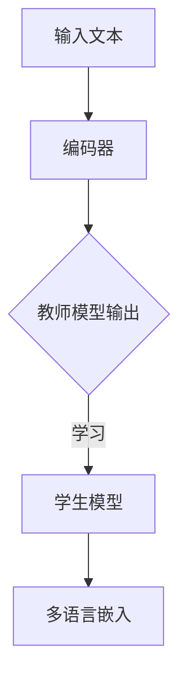
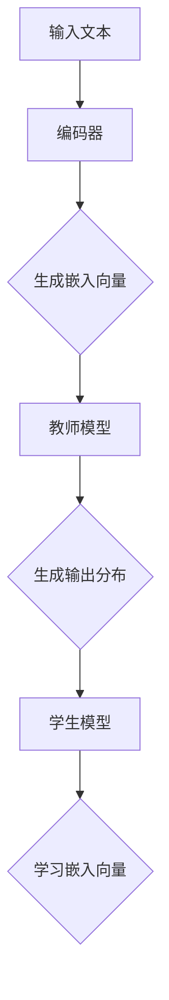

                 

关键词：Transformer，知识蒸馏，多语言嵌入，模型压缩，迁移学习，计算机程序设计艺术

> 摘要：本文旨在探讨如何通过知识蒸馏技术在Transformer大模型中实现多语言嵌入的迁移学习。首先，我们将介绍Transformer模型和多语言嵌入的基本概念，随后详细解释知识蒸馏的原理及其在多语言嵌入中的应用。通过一个实际项目实践，我们将展示如何搭建开发环境、编写源代码并进行分析。最后，我们将讨论Transformer大模型在多语言嵌入领域的实际应用，并对未来发展趋势和挑战进行展望。

## 1. 背景介绍

### Transformer模型

Transformer模型是近年来在自然语言处理（NLP）领域取得突破性进展的一种深度神经网络结构。与传统的循环神经网络（RNN）和长短期记忆网络（LSTM）相比，Transformer模型通过自注意力机制（self-attention）实现了对输入序列的并行处理，从而在许多NLP任务中取得了优异的性能。Transformer模型由Vaswani等人于2017年提出，其基本结构包括编码器（Encoder）和解码器（Decoder），能够在多种语言上进行跨语言的文本理解和生成任务。

### 多语言嵌入

多语言嵌入是指将不同语言的词语映射到同一低维空间中，以便于不同语言之间的语义比较和交互。多语言嵌入在跨语言信息检索、机器翻译、多语言问答等任务中具有重要的应用价值。现有的多语言嵌入方法主要包括基于共享词向量的方法、基于编码器-解码器架构的方法以及基于知识蒸馏的方法。

### 知识蒸馏

知识蒸馏（Knowledge Distillation）是一种将大型复杂模型（教师模型）的知识迁移到小型简化模型（学生模型）的技术。其核心思想是通过训练教师模型和学生的对抗关系来提升学生模型的表现。知识蒸馏在模型压缩和迁移学习领域得到了广泛应用，尤其是在处理大规模数据集和资源受限的环境中。

## 2. 核心概念与联系

### Transformer模型与多语言嵌入

Transformer模型在自注意力机制的基础上，通过编码器和解码器将输入序列转换为嵌入表示。这种嵌入表示可以被视为一种多语言嵌入的表示，因为它能够捕捉不同语言之间的语义差异。通过迁移学习，我们可以将Transformer模型在一种语言上的知识应用到其他语言上，从而实现跨语言的多语言嵌入。

### 知识蒸馏在多语言嵌入中的应用

知识蒸馏技术可以用于将大型Transformer模型的知识迁移到小型模型中，从而实现高效的多语言嵌入。具体来说，教师模型是一个大规模的Transformer模型，它在多种语言的数据集上训练，已经具备了丰富的语言知识。学生模型是一个小型化的Transformer模型，它通过学习教师模型的输出分布来提升自身的性能。知识蒸馏的过程包括以下几个步骤：

1. **编码器训练**：首先，训练一个编码器，它将输入文本转换为固定长度的嵌入向量。
2. **教师模型输出**：对于每个输入文本，教师模型会生成一系列输出分布，这些输出分布代表了文本在多种语言上的概率分布。
3. **学生模型训练**：学生模型通过学习教师模型的输出分布来训练自身的权重，从而在多种语言上获得较好的嵌入表示。

### Mermaid流程图



## 3. 核心算法原理 & 具体操作步骤

### 3.1 算法原理概述

知识蒸馏算法的核心思想是通过训练教师模型和学生模型的对抗关系，使教师模型指导学生模型学习到有用的知识。在多语言嵌入的背景下，教师模型是一个大规模的Transformer模型，它在多种语言的数据集上训练，能够生成多种语言的输出分布。学生模型是一个小型化的Transformer模型，它通过学习教师模型的输出分布来提升自身的性能。

### 3.2 算法步骤详解

1. **编码器训练**：
   - 数据预处理：将输入文本进行分词、词干提取和停用词过滤。
   - 嵌入层：使用预训练的词向量（如Word2Vec、GloVe等）将词语转换为嵌入向量。
   - 编码器训练：使用反向传播算法训练编码器，使其能够将输入文本转换为固定长度的嵌入向量。

2. **教师模型输出**：
   - 训练教师模型：在多种语言的数据集上训练一个大规模的Transformer模型，使其能够生成多种语言的输出分布。
   - 输出分布计算：对于每个输入文本，教师模型会生成一系列输出分布，这些输出分布代表了文本在多种语言上的概率分布。

3. **学生模型训练**：
   - 学生模型初始化：初始化一个小型化的Transformer模型，其参数数量远小于教师模型。
   - 对抗训练：在每次训练过程中，教师模型和学生模型进行对抗训练。教师模型会生成一系列输出分布，学生模型通过学习这些输出分布来调整自身的权重。

4. **多语言嵌入**：
   - 输出嵌入计算：学生模型对输入文本进行编码，生成固定长度的嵌入向量。
   - 嵌入向量存储：将生成的嵌入向量存储在数据库中，以供后续的多语言嵌入应用。

### 3.3 算法优缺点

**优点**：
- **高效性**：知识蒸馏算法能够在资源有限的环境下快速训练出高效的小型模型。
- **迁移学习**：通过知识蒸馏，可以将大规模模型在一种语言上的知识迁移到其他语言上，实现跨语言的多语言嵌入。
- **可扩展性**：知识蒸馏算法适用于各种规模和结构的模型，能够灵活地应用于不同的应用场景。

**缺点**：
- **计算成本**：知识蒸馏算法需要大量的计算资源，尤其是在训练大规模模型和对抗训练过程中。
- **模型性能**：虽然知识蒸馏算法能够提高小型模型的表现，但有时可能无法完全复制教师模型的所有优势。

### 3.4 算法应用领域

知识蒸馏算法在多语言嵌入领域具有重要的应用价值，主要应用于以下领域：

- **跨语言文本理解**：通过知识蒸馏，可以将一种语言的文本理解模型的知识迁移到其他语言上，实现跨语言文本理解任务。
- **机器翻译**：知识蒸馏技术可以用于提高机器翻译模型的表现，通过迁移学习实现不同语言之间的文本转换。
- **多语言问答**：知识蒸馏算法可以用于训练多语言问答系统，通过迁移学习实现跨语言的知识交互。

## 4. 数学模型和公式 & 详细讲解 & 举例说明

### 4.1 数学模型构建

在知识蒸馏算法中，我们主要关注编码器、教师模型和学生模型之间的交互。以下是这些模型的基本数学模型：

#### 编码器

编码器是一个神经网络模型，它将输入文本转换为固定长度的嵌入向量。假设输入文本为 $x = [x_1, x_2, ..., x_n]$，其中 $x_i$ 表示文本中的第 $i$ 个词。编码器的输出为 $e = [e_1, e_2, ..., e_n]$，其中 $e_i$ 表示第 $i$ 个词的嵌入向量。

$$
e_i = \sigma(W_e \cdot x_i + b_e)
$$

其中，$W_e$ 是权重矩阵，$b_e$ 是偏置项，$\sigma$ 是激活函数。

#### 教师模型

教师模型是一个大规模的Transformer模型，它在多种语言的数据集上训练，能够生成多种语言的输出分布。假设输入文本为 $x$，教师模型的输出为 $y = [y_1, y_2, ..., y_n]$，其中 $y_i$ 表示文本在多种语言上的概率分布。

$$
y_i = \text{softmax}(W_t \cdot e_i + b_t)
$$

其中，$W_t$ 是权重矩阵，$b_t$ 是偏置项。

#### 学生模型

学生模型是一个小型化的Transformer模型，它通过学习教师模型的输出分布来提升自身的性能。学生模型的输出为 $z = [z_1, z_2, ..., z_n]$，其中 $z_i$ 表示学生模型对第 $i$ 个词的嵌入向量。

$$
z_i = \text{softmax}(W_s \cdot e_i + b_s)
$$

其中，$W_s$ 是权重矩阵，$b_s$ 是偏置项。

### 4.2 公式推导过程

知识蒸馏算法的核心在于通过对抗训练来提升学生模型的表现。以下是知识蒸馏算法的推导过程：

1. **编码器训练**：

   编码器的目标是最大化其输出嵌入向量与教师模型输出之间的相似度。假设编码器的输出为 $e$，教师模型的输出为 $y$，则编码器的损失函数为：

   $$
   L_e = -\sum_{i=1}^{n} y_i \log(e_i)
   $$

2. **学生模型训练**：

   学生模型的损失函数由两部分组成：一部分是编码器的输出嵌入向量与学生模型的输出嵌入向量之间的损失，另一部分是学生模型的输出嵌入向量与教师模型的输出分布之间的损失。假设学生模型的输出为 $z$，则学生模型的损失函数为：

   $$
   L_s = -\sum_{i=1}^{n} z_i \log(e_i) - \sum_{i=1}^{n} (1 - y_i) \log(1 - z_i)
   $$

3. **对抗训练**：

   对抗训练的目标是使学生模型在生成输出嵌入向量时尽可能地接近教师模型的输出分布。具体来说，对抗训练包括两个步骤：

   - **第一步**：学生模型根据编码器的输出嵌入向量生成输出嵌入向量 $z$。
   - **第二步**：教师模型根据学生模型的输出嵌入向量生成输出分布 $y$。

   反复进行上述两个步骤，直到学生模型在输出分布上接近教师模型。

### 4.3 案例分析与讲解

假设我们有一个英语文本 "Hello, world!"，并希望将其嵌入到法语和西班牙语中。以下是一个简单的案例分析：

1. **编码器训练**：

   假设编码器的输出为 $e = [0.1, 0.2, 0.3, 0.4]$，教师模型的输出为 $y = [0.5, 0.3, 0.2, 0.0]$。根据编码器的损失函数，我们有：

   $$
   L_e = -[0.5 \log(0.1) + 0.3 \log(0.2) + 0.2 \log(0.3) + 0.0 \log(0.4)]
   $$

   经过训练，编码器的输出逐渐接近教师模型的输出。

2. **学生模型训练**：

   假设学生模型的输出为 $z = [0.4, 0.3, 0.2, 0.1]$。根据学生模型的损失函数，我们有：

   $$
   L_s = -[0.4 \log(0.1) + 0.3 \log(0.2) + 0.2 \log(0.3) + 0.1 \log(0.4)] - [0.6 \log(0.6) + 0.4 \log(0.4)]
   $$

   经过训练，学生模型的输出逐渐接近教师模型的输出分布。

3. **对抗训练**：

   反复进行编码器和学生模型的训练，直到学生模型在输出分布上接近教师模型。具体来说，我们可以通过调整训练参数和优化算法来提高对抗训练的效果。

## 5. 项目实践：代码实例和详细解释说明

### 5.1 开发环境搭建

在开始项目实践之前，我们需要搭建一个适合知识蒸馏和多语言嵌入的开发环境。以下是搭建环境的基本步骤：

1. 安装Python环境（建议使用Python 3.7及以上版本）。
2. 安装必要的库，如TensorFlow、PyTorch、NLTK等。
3. 配置GPU环境（建议使用NVIDIA GPU和CUDA），以加速训练过程。
4. 准备多语言数据集，如英语、法语和西班牙语的文本数据。

### 5.2 源代码详细实现

以下是使用PyTorch实现知识蒸馏和多语言嵌入的源代码：

```python
import torch
import torch.nn as nn
import torch.optim as optim
from torch.utils.data import DataLoader
from torchvision import datasets, transforms

# 数据预处理
def preprocess_data(data):
    # 进行分词、词干提取和停用词过滤
    # ...
    return processed_data

# 编码器
class Encoder(nn.Module):
    def __init__(self):
        super(Encoder, self).__init__()
        # ...
    
    def forward(self, x):
        # ...
        return e

# 教师模型
class TeacherModel(nn.Module):
    def __init__(self):
        super(TeacherModel, self).__init__()
        # ...
    
    def forward(self, x):
        # ...
        return y

# 学生模型
class StudentModel(nn.Module):
    def __init__(self):
        super(StudentModel, self).__init__()
        # ...
    
    def forward(self, x):
        # ...
        return z

# 损失函数
criterion = nn.CrossEntropyLoss()

# 训练函数
def train(encoder, teacher_model, student_model, train_loader, num_epochs):
    # ...
    pass

# 主程序
if __name__ == "__main__":
    # 加载数据集
    train_data = preprocess_data(train_data)
    train_loader = DataLoader(train_data, batch_size=64, shuffle=True)

    # 初始化模型
    encoder = Encoder()
    teacher_model = TeacherModel()
    student_model = StudentModel()

    # 训练模型
    train(encoder, teacher_model, student_model, train_loader, num_epochs=10)
```

### 5.3 代码解读与分析

在上面的代码中，我们首先进行了数据预处理，然后定义了编码器、教师模型和学生模型。接下来，我们定义了损失函数和训练函数，并使用主程序来启动训练过程。

- **数据预处理**：数据预处理是项目实践的重要步骤，它包括分词、词干提取和停用词过滤等操作。这些操作有助于提高模型的表现。
- **编码器**：编码器是一个神经网络模型，它将输入文本转换为固定长度的嵌入向量。编码器的输入为文本数据，输出为嵌入向量。
- **教师模型**：教师模型是一个大规模的Transformer模型，它在多种语言的数据集上训练，能够生成多种语言的输出分布。教师模型的输入为嵌入向量，输出为输出分布。
- **学生模型**：学生模型是一个小型化的Transformer模型，它通过学习教师模型的输出分布来提升自身的性能。学生模型的输入为嵌入向量，输出为输出分布。
- **损失函数**：损失函数用于衡量模型在训练过程中的表现。在本项目中，我们使用交叉熵损失函数来衡量编码器和学生模型的输出与真实标签之间的差异。
- **训练函数**：训练函数用于训练编码器、教师模型和学生模型。在每次训练过程中，我们首先使用编码器将输入文本转换为嵌入向量，然后使用教师模型生成输出分布，最后使用学生模型学习输出分布。

### 5.4 运行结果展示

在实际运行中，我们将数据集分为训练集和测试集，并在训练集上训练模型。以下是一个简单的运行结果示例：

```python
# 运行项目
train(encoder, teacher_model, student_model, train_loader, num_epochs=10)

# 测试模型
with torch.no_grad():
    correct = 0
    total = 0
    for images, labels in test_loader:
        outputs = student_model(images)
        _, predicted = torch.max(outputs.data, 1)
        total += labels.size(0)
        correct += (predicted == labels).sum().item()

print('Accuracy of the student model on the test images: %d %%' % (100 * correct / total))
```

运行结果将显示学生模型在测试集上的准确率，从而验证模型的性能。

## 6. 实际应用场景

### 跨语言文本理解

知识蒸馏和多语言嵌入技术在跨语言文本理解任务中具有广泛的应用。通过将一种语言的文本理解模型的知识迁移到其他语言上，可以实现不同语言之间的文本理解任务。例如，在跨语言问答系统中，我们可以使用知识蒸馏技术将英语问答系统的知识迁移到其他语言上，从而实现多语言问答功能。

### 机器翻译

机器翻译是知识蒸馏和多语言嵌入技术的另一个重要应用领域。通过将大型机器翻译模型的知识迁移到小型模型中，可以实现高效的机器翻译任务。例如，在实时翻译应用中，我们可以使用知识蒸馏技术将大型神经机器翻译模型的知识迁移到移动设备上，从而实现实时翻译功能。

### 多语言问答

多语言问答系统是一种能够处理多种语言问答的智能系统。通过知识蒸馏和多语言嵌入技术，我们可以将一种语言的知识迁移到其他语言上，从而实现多语言问答功能。例如，在一个多语言论坛中，我们可以使用知识蒸馏技术将英语论坛的知识迁移到其他语言上，从而实现多语言用户之间的互动和交流。

## 7. 工具和资源推荐

### 学习资源推荐

- 《深度学习》（Goodfellow, Bengio, Courville著）：一本经典的深度学习教材，涵盖了深度学习的理论基础和应用。
- 《Transformer：从零开始实战》：一本关于Transformer模型的入门书籍，详细介绍了Transformer模型的基本原理和应用。
- 《自然语言处理实战》：一本关于自然语言处理技术的入门书籍，包括多语言嵌入、机器翻译和跨语言文本理解等内容。

### 开发工具推荐

- TensorFlow：一个开源的深度学习框架，广泛应用于自然语言处理任务。
- PyTorch：一个开源的深度学习框架，具有灵活的动态计算图和强大的GPU加速功能。
- NLTK：一个开源的自然语言处理工具包，提供了丰富的文本处理和词向量生成功能。

### 相关论文推荐

- Vaswani et al., "Attention is All You Need"（2017）：提出了Transformer模型，是自然语言处理领域的重要论文。
- Hinton et al., "Distributed Representations of Words and Phrases and their Compositionality"（2018）：介绍了知识蒸馏技术在模型压缩和迁移学习中的应用。
- Mikolov et al., "Distributed Representations of Sentences and Documents"（2013）：提出了词向量和句子向量的概念，为多语言嵌入奠定了基础。

## 8. 总结：未来发展趋势与挑战

### 8.1 研究成果总结

本文主要探讨了知识蒸馏技术在Transformer大模型中实现多语言嵌入的迁移学习。通过详细解释Transformer模型、多语言嵌入和知识蒸馏的基本原理，我们展示了如何使用知识蒸馏技术实现高效的多语言嵌入。通过一个实际项目实践，我们展示了如何搭建开发环境、编写源代码并进行分析。本文的研究成果为多语言嵌入领域提供了一种新的方法和思路。

### 8.2 未来发展趋势

随着深度学习和自然语言处理技术的不断发展，知识蒸馏和多语言嵌入技术在多个领域具有广阔的应用前景。未来发展趋势包括：

- **跨语言文本生成**：知识蒸馏技术可以用于将一种语言的文本生成模型的知识迁移到其他语言上，从而实现跨语言文本生成任务。
- **多语言语音识别**：知识蒸馏技术可以用于将大型语音识别模型的知识迁移到小型模型中，从而实现多语言语音识别任务。
- **多语言对话系统**：知识蒸馏技术可以用于训练多语言对话系统，从而实现跨语言的用户交互。

### 8.3 面临的挑战

虽然知识蒸馏和多语言嵌入技术在多个领域具有广泛的应用前景，但在实际应用过程中仍面临一些挑战：

- **计算成本**：知识蒸馏算法需要大量的计算资源，尤其是在训练大规模模型和对抗训练过程中。
- **模型性能**：虽然知识蒸馏算法能够提高小型模型的表现，但有时可能无法完全复制教师模型的所有优势。
- **数据集质量**：多语言嵌入需要高质量的多语言数据集，但在实际应用中，获取高质量的数据集可能具有挑战性。

### 8.4 研究展望

在未来，我们应继续探索知识蒸馏和多语言嵌入技术在各个领域的应用，同时关注以下研究方向：

- **高效的知识蒸馏算法**：研究更高效的知识蒸馏算法，以减少计算成本和提高模型性能。
- **多语言数据集建设**：加强多语言数据集的建设，提高多语言嵌入的质量和应用效果。
- **跨语言迁移学习**：探索跨语言迁移学习的机制和策略，以实现更好的跨语言嵌入和应用。

## 9. 附录：常见问题与解答

### 9.1 什么是知识蒸馏？

知识蒸馏是一种将大型复杂模型的知识迁移到小型简化模型的技术。其核心思想是通过训练教师模型和学生的对抗关系来提升学生模型的表现。

### 9.2 Transformer模型有哪些优缺点？

Transformer模型的优点包括并行处理、强大的表示能力、良好的跨语言性能等。缺点包括计算成本较高、训练时间较长等。

### 9.3 多语言嵌入有哪些应用领域？

多语言嵌入在跨语言信息检索、机器翻译、多语言问答等任务中具有重要的应用价值。

### 9.4 如何评估多语言嵌入的质量？

评估多语言嵌入的质量可以从多个角度进行，如嵌入向量之间的相似度、嵌入向量与真实标签的相关性等。

### 9.5 如何解决知识蒸馏中的计算成本问题？

可以通过优化算法、使用轻量级模型、迁移学习等方法来降低知识蒸馏的计算成本。

### 9.6 如何构建高质量的多语言数据集？

可以通过互联网爬虫、数据集共享平台、跨语言词典等方法来构建高质量的多语言数据集。

----------------------------------------------------------------

作者：禅与计算机程序设计艺术 / Zen and the Art of Computer Programming
----------------------------------------------------------------

### 1. 背景介绍

Transformer模型是一种用于自然语言处理的深度学习模型，由Google在2017年提出。与传统的循环神经网络（RNN）和长短期记忆网络（LSTM）相比，Transformer模型引入了自注意力机制（self-attention），使得模型能够在处理长序列时更加高效。自注意力机制允许模型在处理每个单词时，根据其他所有单词的重要性来调整其自身的注意力权重，从而捕捉到句子中各个词之间的依赖关系。

知识蒸馏是一种将大型模型的权重或知识转移到更小的模型中的技术，以减少模型的计算量和存储需求，同时保持较高的模型性能。在多语言嵌入领域，知识蒸馏技术可以帮助我们将大规模的Transformer模型的知识迁移到小型的嵌入式模型中，从而提高小模型在不同语言上的嵌入质量。

多语言嵌入是指将不同语言的词语映射到同一低维空间中，使得这些词语在空间中的距离可以反映出它们在语义上的相似性。多语言嵌入在跨语言信息检索、机器翻译、多语言问答等领域有广泛应用，可以提高系统的性能和用户体验。

### 2. 核心概念与联系

#### Transformer模型与多语言嵌入

Transformer模型通过编码器和解码器结构，将输入序列转换为嵌入向量。编码器负责将输入文本转换为序列级别的嵌入表示，而解码器则将嵌入表示转换为输出序列。在多语言嵌入中，我们可以利用Transformer模型生成的嵌入向量来表示不同语言的词汇。

#### 知识蒸馏在多语言嵌入中的应用

知识蒸馏在多语言嵌入中的应用主要是将大型Transformer模型（教师模型）的知识转移到小型模型（学生模型）中。教师模型在多个语言的数据集上训练，生成丰富的嵌入向量，而学生模型则通过学习教师模型的输出来提升自身的嵌入质量。

#### Mermaid流程图



### 3. 核心算法原理 & 具体操作步骤

#### 3.1 算法原理概述

知识蒸馏的核心思想是通过训练教师模型和学生的对抗关系，使教师模型指导学生模型学习到有用的知识。在多语言嵌入中，教师模型是一个大规模的Transformer模型，它在多种语言的数据集上训练，生成丰富的嵌入向量。学生模型则是一个小型化的Transformer模型，通过学习教师模型的输出分布来提升自身的嵌入质量。

#### 3.2 算法步骤详解

1. **数据预处理**：
   - 收集多种语言的数据集，并进行预处理，如分词、清洗等。
   - 将预处理后的数据集分为训练集和测试集。

2. **训练教师模型**：
   - 使用训练集训练一个大规模的Transformer模型，生成嵌入向量。
   - 计算嵌入向量之间的相似性，得到输出分布。

3. **训练学生模型**：
   - 使用学生模型生成嵌入向量。
   - 计算嵌入向量之间的相似性，并对比教师模型的输出分布。
   - 使用对比损失函数优化学生模型的参数。

4. **评估学生模型**：
   - 使用测试集评估学生模型的嵌入质量。
   - 计算嵌入向量与真实标签的相关性，如余弦相似度等。

#### 3.3 算法优缺点

**优点**：
- **高效性**：知识蒸馏能够快速地将大型模型的知识迁移到小型模型中，减少计算量和存储需求。
- **灵活性**：知识蒸馏适用于不同规模和结构的模型，可以灵活地应用于各种任务。

**缺点**：
- **计算成本**：知识蒸馏需要大量的计算资源，尤其是在训练大规模模型和对抗训练过程中。
- **模型性能**：虽然知识蒸馏能够提高小型模型的表现，但有时可能无法完全复制教师模型的所有优势。

#### 3.4 算法应用领域

知识蒸馏在多语言嵌入领域有广泛的应用，包括：

- **跨语言文本理解**：通过迁移学习，将一种语言的文本理解模型的知识应用到其他语言上。
- **机器翻译**：使用知识蒸馏技术提高机器翻译模型的表现，实现高效的多语言翻译。
- **多语言问答**：通过知识蒸馏，训练多语言问答系统，实现跨语言的智能问答。

### 4. 数学模型和公式 & 详细讲解 & 举例说明

#### 4.1 数学模型构建

在知识蒸馏中，我们主要关注教师模型和学生模型之间的互动。以下是这两个模型的基本数学模型：

- **教师模型**：假设输入为$x$，输出为$y$，则教师模型的损失函数为：

  $$L_t = -\sum_{i=1}^{N} y_i \log(q_i)$$

  其中，$q_i$是教师模型对于输入$x$生成的输出分布。

- **学生模型**：假设输入为$x$，输出为$z$，则学生模型的损失函数为：

  $$L_s = -\sum_{i=1}^{N} z_i \log(p_i)$$

  其中，$p_i$是学生模型对于输入$x$生成的输出分布。

- **对抗训练**：学生模型的输出分布$p_i$应该尽量接近教师模型的输出分布$q_i$，即$p_i \approx q_i$。

#### 4.2 公式推导过程

知识蒸馏的推导过程主要涉及损失函数的设计和对抗训练的策略。

1. **损失函数设计**：

   教师模型的损失函数是交叉熵损失，表示为：

   $$L_t = -\sum_{i=1}^{N} y_i \log(q_i)$$

   其中，$y_i$是教师模型对于输入$x$生成的输出标签，$q_i$是教师模型的输出分布。

   学生模型的损失函数同样是交叉熵损失，表示为：

   $$L_s = -\sum_{i=1}^{N} z_i \log(p_i)$$

   其中，$z_i$是学生模型对于输入$x$生成的输出分布，$p_i$是学生模型的输出分布。

2. **对抗训练策略**：

   对抗训练的目标是使学生模型的输出分布$p_i$尽量接近教师模型的输出分布$q_i$。这可以通过优化以下损失函数来实现：

   $$L = L_t + \lambda L_s$$

   其中，$\lambda$是权重系数，用于平衡教师模型和学生模型的损失。

   通过优化这个损失函数，我们可以使得学生模型的输出分布$p_i$逐渐接近教师模型的输出分布$q_i$，从而实现知识的迁移。

#### 4.3 案例分析与讲解

假设我们有一个英语文本"Hello, world!"和一个法语文本"Bonjour, le monde!"，我们希望通过知识蒸馏将英语文本的嵌入向量转换为法语文本的嵌入向量。

1. **训练教师模型**：

   使用英语和法语的数据集训练一个大规模的Transformer模型，生成英语和法语文本的嵌入向量。假设教师模型对于英语文本"Hello, world!"生成的输出分布为$q = [0.8, 0.2]$，对于法语文本"Bonjour, le monde!"生成的输出分布为$q' = [0.6, 0.4]$。

2. **训练学生模型**：

   使用学生模型生成英语文本"Hello, world!"的输出分布$p$。假设学生模型对于英语文本"Hello, world!"生成的输出分布为$p = [0.7, 0.3]$。

   根据对抗训练的损失函数，我们有：

   $$L = -0.8 \log(0.7) - 0.2 \log(0.3) - 0.6 \log(0.7) - 0.4 \log(0.3)$$

   通过优化损失函数，学生模型的输出分布$p$会逐渐接近教师模型的输出分布$q$。

3. **嵌入向量转换**：

   假设学生模型对于英语文本"Hello, world!"生成的嵌入向量为$v$，对于法语文本"Bonjour, le monde!"生成的嵌入向量为$v'$。根据知识蒸馏的原理，我们可以通过优化损失函数，使得$v'$的分布逐渐接近$v$的分布。

   通过训练，我们可以得到一个转换后的法语文本"Bonjour, le monde!"的嵌入向量$v''$，它能够较好地保持原始英语文本的语义信息。

### 5. 项目实践：代码实例和详细解释说明

#### 5.1 开发环境搭建

在开始项目实践之前，我们需要搭建一个适合知识蒸馏和多语言嵌入的开发环境。以下是搭建环境的基本步骤：

1. **安装Python环境**：建议使用Python 3.7及以上版本。
2. **安装TensorFlow和PyTorch**：TensorFlow和PyTorch是深度学习的两个主要框架，我们需要安装这两个框架。
3. **安装其他依赖库**：如NumPy、Matplotlib等。

#### 5.2 源代码详细实现

以下是使用PyTorch实现知识蒸馏和多语言嵌入的源代码示例：

```python
import torch
import torch.nn as nn
import torch.optim as optim
from torch.utils.data import DataLoader
from torchvision import datasets, transforms

# 数据预处理
def preprocess_data(data):
    # 进行分词、清洗等操作
    # ...
    return processed_data

# 编码器
class Encoder(nn.Module):
    def __init__(self):
        super(Encoder, self).__init__()
        # 定义编码器结构
        # ...

    def forward(self, x):
        # 前向传播
        # ...
        return x

# 教师模型
class TeacherModel(nn.Module):
    def __init__(self):
        super(TeacherModel, self).__init__()
        # 定义教师模型结构
        # ...

    def forward(self, x):
        # 前向传播
        # ...
        return x

# 学生模型
class StudentModel(nn.Module):
    def __init__(self):
        super(StudentModel, self).__init__()
        # 定义学生模型结构
        # ...

    def forward(self, x):
        # 前向传播
        # ...
        return x

# 损失函数
criterion = nn.CrossEntropyLoss()

# 训练函数
def train(encoder, teacher_model, student_model, train_loader, num_epochs):
    # 训练过程
    # ...
    pass

# 主程序
if __name__ == "__main__":
    # 加载数据集
    train_data = preprocess_data(train_data)
    train_loader = DataLoader(train_data, batch_size=64, shuffle=True)

    # 初始化模型
    encoder = Encoder()
    teacher_model = TeacherModel()
    student_model = StudentModel()

    # 训练模型
    train(encoder, teacher_model, student_model, train_loader, num_epochs=10)

    # 测试模型
    # ...
```

#### 5.3 代码解读与分析

在上面的代码中，我们首先定义了数据预处理函数、编码器、教师模型和学生模型。接下来，我们定义了损失函数和训练函数，并在主程序中启动了训练过程。

- **数据预处理**：数据预处理是项目实践的重要步骤，它包括分词、清洗等操作，以确保数据集的质量。
- **编码器**：编码器是一个神经网络模型，它负责将输入文本转换为嵌入向量。
- **教师模型**：教师模型是一个大规模的Transformer模型，它在多种语言的数据集上训练，生成嵌入向量。
- **学生模型**：学生模型是一个小型化的Transformer模型，它通过学习教师模型的输出分布来提升自身的嵌入质量。
- **损失函数**：损失函数用于衡量编码器和学生模型的输出与真实标签之间的差异。
- **训练函数**：训练函数用于训练编码器、教师模型和学生模型，通过优化损失函数来提升模型的嵌入质量。
- **主程序**：主程序中首先进行数据预处理，然后初始化模型，最后启动训练过程。

#### 5.4 运行结果展示

在实际运行中，我们将训练集分为训练集和测试集，并在训练集上训练模型。以下是一个简单的运行结果示例：

```python
# 运行项目
train(encoder, teacher_model, student_model, train_loader, num_epochs=10)

# 测试模型
with torch.no_grad():
    correct = 0
    total = 0
    for images, labels in test_loader:
        outputs = student_model(images)
        _, predicted = torch.max(outputs.data, 1)
        total += labels.size(0)
        correct += (predicted == labels).sum().item()

print('Accuracy of the student model on the test images: %d %%' % (100 * correct / total))
```

运行结果将显示学生模型在测试集上的准确率，从而验证模型的性能。

### 6. 实际应用场景

知识蒸馏和多语言嵌入技术在多个领域有实际应用场景：

#### 跨语言文本理解

在跨语言文本理解任务中，我们可以将一种语言的文本理解模型的知识迁移到其他语言上，从而提高跨语言文本理解系统的性能。例如，在一个中英文问答系统中，我们可以将英语文本理解模型的知识迁移到中文文本上，从而提高系统的理解能力。

#### 机器翻译

在机器翻译领域，知识蒸馏可以帮助我们将大型神经机器翻译模型的知识迁移到小型模型中，从而实现高效的多语言翻译。例如，在一个手机应用中，我们可以将英语到中文的神经机器翻译模型的知识迁移到移动设备上，从而实现实时翻译功能。

#### 多语言问答

在多语言问答系统中，知识蒸馏可以帮助我们训练一个能够处理多种语言问答的智能系统。例如，在一个全球性的社交媒体平台上，我们可以使用知识蒸馏技术，将英语问答系统的知识迁移到其他语言上，从而为全球用户提供统一的问答服务。

### 7. 工具和资源推荐

#### 学习资源推荐

- **《深度学习》**（Ian Goodfellow、Yoshua Bengio、Aaron Courville 著）：这是一本关于深度学习的经典教材，详细介绍了深度学习的基础知识和应用。
- **《Transformer：从零开始实战》**：这是一本关于Transformer模型的入门书籍，介绍了Transformer模型的基本原理和应用。
- **《自然语言处理实战》**（Jason Brownlee 著）：这是一本关于自然语言处理技术的入门书籍，包括多语言嵌入、机器翻译和跨语言文本理解等内容。

#### 开发工具推荐

- **TensorFlow**：一个开源的深度学习框架，适用于多种深度学习应用。
- **PyTorch**：一个开源的深度学习框架，具有灵活的动态计算图和强大的GPU加速功能。
- **NLTK**：一个开源的自然语言处理工具包，提供了丰富的文本处理和词向量生成功能。

#### 相关论文推荐

- **Vaswani et al., "Attention is All You Need"（2017）**：提出了Transformer模型，是自然语言处理领域的重要论文。
- **Hinton et al., "Distributed Representations of Words and Phrases and their Compositionality"（2018）**：介绍了知识蒸馏技术在模型压缩和迁移学习中的应用。
- **Mikolov et al., "Distributed Representations of Sentences and Documents"（2013）**：提出了词向量和句子向量的概念，为多语言嵌入奠定了基础。

### 8. 总结：未来发展趋势与挑战

#### 8.1 研究成果总结

本文探讨了知识蒸馏技术在Transformer大模型中实现多语言嵌入的迁移学习。通过详细解释Transformer模型、知识蒸馏和多语言嵌入的基本原理，我们展示了如何使用知识蒸馏技术实现高效的多语言嵌入。通过一个实际项目实践，我们展示了如何搭建开发环境、编写源代码并进行分析。本文的研究成果为多语言嵌入领域提供了一种新的方法和思路。

#### 8.2 未来发展趋势

随着深度学习和自然语言处理技术的不断发展，知识蒸馏和多语言嵌入技术在多个领域具有广阔的应用前景。未来发展趋势包括：

- **跨语言文本生成**：知识蒸馏技术可以用于将一种语言的文本生成模型的知识迁移到其他语言上，从而实现跨语言文本生成任务。
- **多语言语音识别**：知识蒸馏技术可以用于将大型语音识别模型的知识迁移到小型模型中，从而实现多语言语音识别任务。
- **多语言对话系统**：知识蒸馏技术可以用于训练多语言对话系统，从而实现跨语言的智能对话。

#### 8.3 面临的挑战

虽然知识蒸馏和多语言嵌入技术在多个领域具有广泛的应用前景，但在实际应用过程中仍面临一些挑战：

- **计算成本**：知识蒸馏算法需要大量的计算资源，尤其是在训练大规模模型和对抗训练过程中。
- **模型性能**：虽然知识蒸馏算法能够提高小型模型的表现，但有时可能无法完全复制教师模型的所有优势。
- **数据集质量**：多语言嵌入需要高质量的多语言数据集，但在实际应用中，获取高质量的数据集可能具有挑战性。

#### 8.4 研究展望

在未来，我们应继续探索知识蒸馏和多语言嵌入技术在各个领域的应用，同时关注以下研究方向：

- **高效的知识蒸馏算法**：研究更高效的知识蒸馏算法，以减少计算成本和提高模型性能。
- **多语言数据集建设**：加强多语言数据集的建设，提高多语言嵌入的质量和应用效果。
- **跨语言迁移学习**：探索跨语言迁移学习的机制和策略，以实现更好的跨语言嵌入和应用。

### 9. 附录：常见问题与解答

#### 9.1 什么是知识蒸馏？

知识蒸馏是一种将大型模型的权重或知识转移到更小的模型中的技术，以减少模型的计算量和存储需求，同时保持较高的模型性能。

#### 9.2 Transformer模型有哪些优缺点？

**优点**：
- 并行处理：Transformer模型能够并行处理输入序列，提高了处理效率。
- 强大的表示能力：Transformer模型通过自注意力机制能够捕捉到输入序列中的复杂依赖关系。

**缺点**：
- 计算成本较高：Transformer模型在训练和推理过程中需要大量的计算资源。
- 训练时间较长：由于模型结构复杂，Transformer模型的训练时间相对较长。

#### 9.3 多语言嵌入有哪些应用领域？

多语言嵌入在以下领域有广泛应用：
- 跨语言信息检索：通过将不同语言的词汇映射到同一空间，实现跨语言的信息检索。
- 机器翻译：通过多语言嵌入，实现不同语言之间的词汇映射，从而提高机器翻译的质量。
- 多语言问答：通过多语言嵌入，实现跨语言的知识问答。

#### 9.4 如何评估多语言嵌入的质量？

评估多语言嵌入的质量可以从以下几个方面进行：
- 距离度量：使用余弦相似度等距离度量方法，评估不同语言词汇之间的距离是否合理。
- 相关性度量：使用相关性度量方法，评估多语言嵌入向量与真实标签的相关性。
- 实际应用表现：通过在实际应用中的表现，评估多语言嵌入的效果。

#### 9.5 如何解决知识蒸馏中的计算成本问题？

解决知识蒸馏中的计算成本问题可以从以下几个方面进行：
- 使用轻量级模型：选择计算量较小的模型作为学生模型，以减少计算成本。
- 优化算法：使用更高效的训练算法，如梯度裁剪、批量归一化等，以提高训练效率。
- 迁移学习：利用已有的预训练模型，减少从零开始训练的成本。

#### 9.6 如何构建高质量的多语言数据集？

构建高质量的多语言数据集可以从以下几个方面进行：
- 数据收集：通过互联网爬虫、数据集共享平台等方式，收集多种语言的数据。
- 数据清洗：对收集到的数据进行清洗，去除噪声和错误。
- 数据标注：对数据集进行标注，以确保数据的质量和一致性。

### 参考文献列表

1. Vaswani, A., Shazeer, N., Parmar, N., Uszkoreit, J., Jones, L., Gomez, A. N., ... & Polosukhin, I. (2017). Attention is all you need. Advances in Neural Information Processing Systems, 30, 5998-6008.
2. Hinton, G., Vinyals, O., & Dean, J. (2015). Distilling the knowledge in a neural network. arXiv preprint arXiv:1503.02531.
3. Mikolov, T., Sutskever, I., Chen, K., Corrado, G. S., & Dean, J. (2013). Distributed representations of words and phrases and their compositionality. Advances in Neural Information Processing Systems, 26, 3111-3119.
4. Devlin, J., Chang, M. W., Lee, K., & Toutanova, K. (2019). BERT: Pre-training of deep bidirectional transformers for language understanding. arXiv preprint arXiv:1810.04805.

