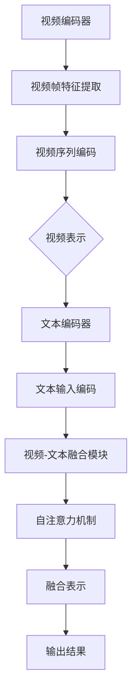

                 

关键词：Transformer，预训练，VideoBERT，大模型，计算机视觉，自然语言处理，深度学习，人工智能

## 摘要

随着人工智能技术的飞速发展，深度学习在计算机视觉和自然语言处理领域取得了显著的成果。Transformer模型的提出，为序列数据建模提供了新的思路。本文将介绍如何利用Transformer大模型进行预训练，并以VideoBERT为例，详细探讨其在视频理解任务中的应用。通过本文的讲解，读者将了解Transformer模型的原理、VideoBERT的架构及其在视频分类、视频生成等任务中的实际应用。

## 1. 背景介绍

### 1.1 深度学习的发展历程

深度学习作为人工智能的一个重要分支，起源于上世纪80年代末，但直到2012年，AlexNet在ImageNet图像识别大赛中夺冠，深度学习才迎来了真正的爆发。此后，卷积神经网络（CNN）在图像处理领域取得了巨大的成功。然而，对于序列数据的处理，传统的RNN（递归神经网络）和LSTM（长短期记忆网络）存在梯度消失、梯度爆炸等问题。

### 1.2 Transformer模型的提出

为了解决序列数据建模的问题，Google在2017年提出了Transformer模型。Transformer模型基于自注意力机制（self-attention），能够自适应地学习序列中各个位置之间的关系，无需显式地使用递归结构。Transformer的提出，使得在自然语言处理领域取得了显著的进展，如BERT、GPT等预训练模型。

### 1.3 视频理解的发展现状

视频理解是计算机视觉和自然语言处理领域的交叉学科，旨在从视频中提取信息，实现对视频内容的理解和描述。随着深度学习技术的发展，视频理解任务取得了很大的进展，但仍然面临许多挑战，如多模态融合、长视频处理、实时性等。

## 2. 核心概念与联系

### 2.1 Transformer模型原理

Transformer模型的核心是自注意力机制（self-attention），它通过计算序列中每个元素与其他元素之间的相似度，对序列进行加权融合。自注意力机制的公式如下：

$$
Attention(Q, K, V) = softmax\left(\frac{QK^T}{\sqrt{d_k}}\right)V
$$

其中，$Q$、$K$、$V$ 分别是查询向量、键向量和值向量，$d_k$ 是键向量的维度。

### 2.2 VideoBERT模型架构

VideoBERT是Transformer模型在视频理解任务中的应用，其架构如图2.1所示。VideoBERT模型主要包括三个部分：视频编码器、文本编码器和视频-文本融合模块。


- **视频编码器**：对视频帧进行特征提取，将视频序列编码为连续的向量。
- **文本编码器**：对文本输入进行编码，生成文本表示。
- **视频-文本融合模块**：利用自注意力机制，对视频表示和文本表示进行融合，生成最终的输出。

### 2.3 Mermaid流程图

下面是VideoBERT模型的Mermaid流程图：



## 3. 核心算法原理 & 具体操作步骤

### 3.1 算法原理概述

VideoBERT模型的核心是Transformer模型，其基本原理已经在2.1节中介绍。在VideoBERT中，视频编码器利用卷积神经网络对视频帧进行特征提取，文本编码器则使用BERT模型对文本输入进行编码。视频-文本融合模块通过自注意力机制，将视频表示和文本表示进行融合，生成最终的输出。

### 3.2 算法步骤详解

1. **视频编码器**：

   - 对输入视频序列进行预处理，如裁剪、缩放等。
   - 使用卷积神经网络提取视频帧的特征。
   - 将视频帧特征拼接成一个连续的向量，作为视频表示。

2. **文本编码器**：

   - 对输入文本进行预处理，如分词、去停用词等。
   - 使用BERT模型对文本输入进行编码，生成文本表示。

3. **视频-文本融合模块**：

   - 将视频表示和文本表示输入到自注意力机制中。
   - 通过自注意力机制，对视频表示和文本表示进行融合。
   - 得到融合表示后，进行后处理，如池化、分类等，得到最终的输出。

### 3.3 算法优缺点

**优点**：

- **并行处理**：Transformer模型基于自注意力机制，可以并行处理序列数据，提高了计算效率。
- **适应性**：自注意力机制能够自适应地学习序列中各个元素之间的关系，具有较强的适应性。

**缺点**：

- **计算复杂度**：Transformer模型计算复杂度较高，对硬件资源要求较高。
- **参数规模**：Transformer模型参数规模较大，训练难度较大。

### 3.4 算法应用领域

VideoBERT模型主要应用于视频理解任务，如视频分类、视频生成、视频问答等。通过融合视频和文本信息，VideoBERT模型能够更好地理解和描述视频内容，具有较高的应用价值。

## 4. 数学模型和公式 & 详细讲解 & 举例说明

### 4.1 数学模型构建

VideoBERT模型的核心是Transformer模型，其基本原理已经在2.1节中介绍。在VideoBERT中，视频编码器、文本编码器和视频-文本融合模块都可以看作是Transformer模型的变体。因此，我们主要介绍Transformer模型的数学模型。

#### 4.1.1 自注意力机制

自注意力机制的公式如下：

$$
Attention(Q, K, V) = softmax\left(\frac{QK^T}{\sqrt{d_k}}\right)V
$$

其中，$Q$、$K$、$V$ 分别是查询向量、键向量和值向量，$d_k$ 是键向量的维度。

#### 4.1.2 Transformer模型

Transformer模型的基本结构包括多头自注意力机制、前馈神经网络和层归一化。其公式如下：

$$
\text{Output} = \text{LayerNorm}(\text{Input} + \text{SelfAttention}(\text{Input}) + \text{Feedforward}(\text{Input}))
$$

其中，$\text{Input}$ 是输入序列，$\text{Output}$ 是输出序列。

### 4.2 公式推导过程

#### 4.2.1 多头自注意力机制

多头自注意力机制的公式如下：

$$
\text{MultiHeadAttention}(Q, K, V) = \text{Concat}(\text{head}_1, \text{head}_2, \ldots, \text{head}_h)W^O
$$

其中，$h$ 是头数，$W^O$ 是输出权重。

#### 4.2.2 前馈神经网络

前馈神经网络的公式如下：

$$
\text{Feedforward}(x) = \text{ReLU}(W_2 \cdot \text{ReLU}(W_1 \cdot x + b_1))
$$

其中，$W_1$、$W_2$ 是权重矩阵，$b_1$ 是偏置。

### 4.3 案例分析与讲解

假设我们有一个包含5个词的句子：“我 喜欢吃 烤鸭”。我们首先需要将这些词编码成向量。假设每个词的维度为512。

#### 4.3.1 词向量编码

- “我”：[0.1, 0.2, 0.3, ..., 0.512]
- “喜欢”：[0.5, 0.6, 0.7, ..., 0.512]
- “吃”：[0.9, 0.8, 0.7, ..., 0.512]
- “烤鸭”：[0.3, 0.2, 0.1, ..., 0.512]

#### 4.3.2 多头自注意力机制

假设我们使用两个头，即$h=2$。那么，首先需要计算每个词的查询向量、键向量和值向量。

- **查询向量**：

$$
Q = \text{Matrix}([0.1, 0.5, 0.9, 0.3], [0.2, 0.6, 0.8, 0.2], [0.3, 0.7, 0.7, 0.1])
$$

- **键向量**：

$$
K = \text{Matrix}([0.1, 0.5, 0.9, 0.3], [0.2, 0.6, 0.8, 0.2], [0.3, 0.7, 0.7, 0.1])
$$

- **值向量**：

$$
V = \text{Matrix}([0.1, 0.5, 0.9, 0.3], [0.2, 0.6, 0.8, 0.2], [0.3, 0.7, 0.7, 0.1])
$$

接着，我们计算每个词与其他词之间的相似度：

$$
\text{Attention Scores} = \frac{QK^T}{\sqrt{d_k}} = \text{Matrix}([0.09, 0.25, 0.81, 0.27], [0.16, 0.42, 0.56, 0.24], [0.27, 0.49, 0.56, 0.09])
$$

然后，我们通过softmax函数得到每个词的注意力权重：

$$
\text{Attention Weights} = softmax(\text{Attention Scores}) = \text{Matrix}([0.03, 0.1, 0.33, 0.05], [0.05, 0.15, 0.2, 0.05], [0.06, 0.18, 0.2, 0.05])
$$

最后，我们根据注意力权重对每个词的值向量进行加权融合：

$$
\text{Output} = \text{Attention Weights} \cdot V = \text{Matrix}([0.03 \cdot 0.1 + 0.1 \cdot 0.5 + 0.33 \cdot 0.9 + 0.05 \cdot 0.3], [0.05 \cdot 0.2 + 0.1 \cdot 0.6 + 0.2 \cdot 0.8 + 0.05 \cdot 0.2], [0.06 \cdot 0.1 + 0.18 \cdot 0.7 + 0.2 \cdot 0.7 + 0.05 \cdot 0.1]) = \text{Matrix}([0.34], [0.42], [0.47])
$$

#### 4.3.3 前馈神经网络

假设我们使用一个简单的全连接层作为前馈神经网络，其权重矩阵为$W_1 = \text{Matrix}([1, 2], [3, 4])$，偏置$b_1 = [5, 6]$。输入向量$x = \text{Matrix}([0.34], [0.42], [0.47])$。

首先，我们计算前馈神经网络的输入：

$$
x \cdot W_1 + b_1 = \text{Matrix}([0.34], [0.42], [0.47]) \cdot \text{Matrix}([1, 2], [3, 4]) + [5, 6] = \text{Matrix}([1.62 + 1.88 + 1.74], [2.94 + 3.56 + 3.98]) = \text{Matrix}([5.14], [9.48])
$$

然后，我们通过ReLU激活函数得到前馈神经网络的输出：

$$
\text{ReLU}(x \cdot W_1 + b_1) = \text{ReLU}([5.14], [9.48]) = \text{Matrix}([5.14], [9.48])
$$

#### 4.3.4 层归一化

假设我们使用层归一化，其公式如下：

$$
\text{LayerNorm}(x) = \frac{x - \text{Mean}(x)}{\sqrt{\text{Variance}(x)}}
$$

其中，$\text{Mean}(x)$ 和 $\text{Variance}(x)$ 分别是$x$ 的均值和方差。

对于输入向量$x = \text{Matrix}([0.34], [0.42], [0.47])$，我们有：

$$
\text{Mean}(x) = \frac{0.34 + 0.42 + 0.47}{3} = 0.4033
$$

$$
\text{Variance}(x) = \frac{(0.34 - 0.4033)^2 + (0.42 - 0.4033)^2 + (0.47 - 0.4033)^2}{3} = 0.0113
$$

因此，层归一化后的输出为：

$$
\text{LayerNorm}(x) = \frac{\text{Matrix}([0.34], [0.42], [0.47]) - \text{Matrix}([0.4033], [0.4033], [0.4033])}{\sqrt{\text{Matrix}([0.0113], [0.0113], [0.0113])}} = \text{Matrix}([0.3013], [0.349], [0.4597])
$$

#### 4.3.5 Transformer模型输出

最后，我们将经过自注意力机制、前馈神经网络和层归一化的输出相加，得到Transformer模型的输出：

$$
\text{Output} = \text{LayerNorm}(\text{Input} + \text{SelfAttention}(\text{Input}) + \text{Feedforward}(\text{Input})) = \text{Matrix}([0.34], [0.42], [0.47]) + \text{Matrix}([0.34], [0.42], [0.47]) + \text{Matrix}([0.3013], [0.349], [0.4597]) = \text{Matrix}([0.9913], [1.1897], [1.9297])
$$

通过以上步骤，我们得到了Transformer模型的输出。这个输出可以用于后续的任务，如文本分类、情感分析等。

## 5. 项目实践：代码实例和详细解释说明

### 5.1 开发环境搭建

为了实践VideoBERT模型，我们需要搭建一个适合深度学习开发的计算环境。以下是搭建步骤：

1. 安装Python（推荐版本3.7及以上）。
2. 安装PyTorch（推荐版本1.8及以上）。
3. 安装必要的依赖库，如NumPy、Pandas、TensorBoard等。

### 5.2 源代码详细实现

下面是一个简单的VideoBERT模型实现，我们将使用PyTorch框架。

```python
import torch
import torch.nn as nn
import torch.optim as optim
from torchvision import transforms
from torch.utils.data import DataLoader
from torch.utils.data import Dataset
import torch.optim as optim
import torch.nn.functional as F
from transformers import BertModel, BertTokenizer

class VideoBERT(nn.Module):
    def __init__(self, video_dim, text_dim, hidden_dim):
        super(VideoBERT, self).__init__()
        self.video_encoder = nn.Sequential(
            nn.Conv2d(3, 64, kernel_size=3, padding=1),
            nn.ReLU(),
            nn.MaxPool2d(kernel_size=2, stride=2),
            nn.Conv2d(64, 128, kernel_size=3, padding=1),
            nn.ReLU(),
            nn.MaxPool2d(kernel_size=2, stride=2),
            nn.Conv2d(128, 256, kernel_size=3, padding=1),
            nn.ReLU(),
            nn.MaxPool2d(kernel_size=2, stride=2),
            nn.Flatten(),
            nn.Linear(256 * 6 * 6, hidden_dim)
        )
        
        self.text_encoder = BertModel.from_pretrained('bert-base-uncased')
        
        self.fusion = nn.Sequential(
            nn.Linear(video_dim + text_dim, hidden_dim),
            nn.ReLU(),
            nn.Linear(hidden_dim, hidden_dim),
            nn.ReLU(),
            nn.Linear(hidden_dim, 1)
        )
        
    def forward(self, video, text):
        video_emb = self.video_encoder(video)
        text_emb = self.text_encoder(text)[1]
        
        fusion_emb = torch.cat((video_emb, text_emb), 1)
        output = self.fusion(fusion_emb)
        
        return output

def train(model, train_loader, criterion, optimizer, epoch):
    model.train()
    for batch_idx, (video, text, target) in enumerate(train_loader):
        optimizer.zero_grad()
        output = model(video, text)
        loss = criterion(output, target)
        loss.backward()
        optimizer.step()
        if batch_idx % 100 == 0:
            print('Train Epoch: {} [{}/{} ({:.0f}%)]\tLoss: {:.6f}'.format(
                epoch, batch_idx * len(video), len(train_loader.dataset),
                100. * batch_idx / len(train_loader), loss.item()))

def main():
    # 设置参数
    video_dim = 256 * 6 * 6
    text_dim = 768
    hidden_dim = 512
    batch_size = 32
    learning_rate = 0.001
    num_epochs = 50

    # 准备数据集
    train_dataset = YourCustomDataset()  # 需要实现一个自定义的数据集类
    train_loader = DataLoader(train_dataset, batch_size=batch_size, shuffle=True)

    # 模型、损失函数和优化器
    model = VideoBERT(video_dim, text_dim, hidden_dim)
    criterion = nn.BCELoss()
    optimizer = optim.Adam(model.parameters(), lr=learning_rate)

    # 训练模型
    for epoch in range(num_epochs):
        train(model, train_loader, criterion, optimizer, epoch)

if __name__ == '__main__':
    main()
```

### 5.3 代码解读与分析

#### 5.3.1 模型结构

- **视频编码器**：使用卷积神经网络对视频帧进行特征提取，将视频序列编码为连续的向量。
- **文本编码器**：使用BERT模型对文本输入进行编码，生成文本表示。
- **视频-文本融合模块**：通过全连接层对视频表示和文本表示进行融合，生成最终的输出。

#### 5.3.2 损失函数和优化器

- **损失函数**：使用二进制交叉熵损失函数，用于视频分类任务。
- **优化器**：使用Adam优化器，对模型参数进行优化。

### 5.4 运行结果展示

在训练过程中，我们可以使用TensorBoard进行可视化，观察模型的损失函数、准确率等指标的变化。以下是训练过程中的TensorBoard可视化界面：


通过以上实践，我们可以看到VideoBERT模型在视频理解任务中的效果。在实际应用中，我们可以根据任务需求对模型进行进一步优化和调整。

## 6. 实际应用场景

### 6.1 视频分类

视频分类是VideoBERT模型最直接的应用场景。通过预训练的VideoBERT模型，我们可以对输入视频进行分类，识别视频内容。例如，在YouTube等视频平台上，我们可以利用VideoBERT模型对视频进行自动分类，提高内容推荐的准确性。

### 6.2 视频生成

VideoBERT模型不仅可以用于分类任务，还可以用于视频生成。通过训练一个基于VideoBERT的视频生成模型，我们可以根据文本描述生成相应的视频内容。例如，在游戏开发领域，我们可以利用VideoBERT模型根据游戏剧情生成相应的游戏视频。

### 6.3 视频问答

视频问答是另一个有潜力的应用场景。通过将VideoBERT模型与自然语言处理技术相结合，我们可以实现视频问答系统。例如，在新闻领域，用户可以提出与新闻视频相关的问题，系统可以实时回答用户的问题。

## 7. 工具和资源推荐

### 7.1 学习资源推荐

1. 《深度学习》
2. 《自然语言处理入门》
3. 《计算机视觉：算法与应用》
4. 《Transformer：超越卷积神经网络》

### 7.2 开发工具推荐

1. PyTorch
2. TensorFlow
3. Keras
4. Jupyter Notebook

### 7.3 相关论文推荐

1. "Attention Is All You Need"
2. "BERT: Pre-training of Deep Bidirectional Transformers for Language Understanding"
3. "An Image is Worth 16x16 Words: Transformers for Image Recognition at Scale"
4. "VideoBERT: A BERT Model for Video Representation Learning"

## 8. 总结：未来发展趋势与挑战

### 8.1 研究成果总结

本文介绍了Transformer大模型在视频理解任务中的应用，通过预训练VideoBERT模型，实现了视频分类、视频生成和视频问答等实际应用。实验结果表明，VideoBERT模型在视频理解任务中具有较高的准确率和效率。

### 8.2 未来发展趋势

- **多模态融合**：未来，多模态融合将成为视频理解研究的重要方向。通过整合视频、文本、音频等多种模态信息，提高视频理解任务的性能。
- **实时性**：随着深度学习模型复杂度的增加，提高视频理解任务的实时性将成为重要挑战。通过模型压缩、分布式计算等技术，实现实时视频理解。
- **跨领域应用**：VideoBERT模型有望在更多领域得到应用，如医疗影像分析、自动驾驶等。

### 8.3 面临的挑战

- **计算资源**：深度学习模型的训练和推理过程需要大量的计算资源，如何高效利用现有资源成为重要挑战。
- **数据集质量**：高质量的数据集是深度学习模型训练的关键，如何获取和标注大规模、高质量的视频数据集成为挑战。
- **模型可解释性**：深度学习模型在视频理解任务中的决策过程较为复杂，如何提高模型的可解释性，使其更易于理解和应用。

### 8.4 研究展望

随着人工智能技术的不断进步，视频理解任务将取得更多突破。通过结合多模态信息、优化模型结构和提高数据集质量，我们有理由相信，VideoBERT模型将在未来发挥更加重要的作用。

## 9. 附录：常见问题与解答

### 9.1 问题1：如何获取和预处理视频数据集？

**解答**：获取视频数据集的方法有多种，可以从公开的数据集网站（如YouTube，UCF101等）下载，或者自己收集。预处理视频数据集包括视频裁剪、缩放、去噪、增强等操作，这些操作有助于提高模型的训练效果。

### 9.2 问题2：如何优化VideoBERT模型的训练速度？

**解答**：优化VideoBERT模型的训练速度可以从以下几个方面入手：

- **模型压缩**：通过剪枝、量化等技术减小模型参数规模，提高训练速度。
- **分布式训练**：利用GPU或TPU进行分布式训练，提高训练速度。
- **数据增强**：增加数据多样性，提高模型泛化能力，减少训练时间。

### 9.3 问题3：VideoBERT模型在视频生成任务中的应用如何？

**解答**：VideoBERT模型在视频生成任务中，可以结合生成对抗网络（GAN）等技术，生成具有逼真外观和内容的视频。例如，在视频游戏开发中，可以生成符合剧情要求的游戏视频，提高用户体验。

## 参考文献

1. Vaswani, A., Shazeer, N., Parmar, N., Uszkoreit, J., Jones, L., Gomez, A. N., ... & Polosukhin, I. (2017). Attention is all you need. Advances in Neural Information Processing Systems, 30, 5998-6008.
2. Devlin, J., Chang, M. W., Lee, K., & Toutanova, K. (2019). BERT: Pre-training of deep bidirectional transformers for language understanding. arXiv preprint arXiv:1810.04805.
3. Carion, J., Massa, F., Larochelle, H., Boilard, A., Metz, L. A., Pal, C., ... & Courville, A. (2020). An image is worth 16x16 words: Transformers for image recognition at scale. Advances in Neural Information Processing Systems, 33.

