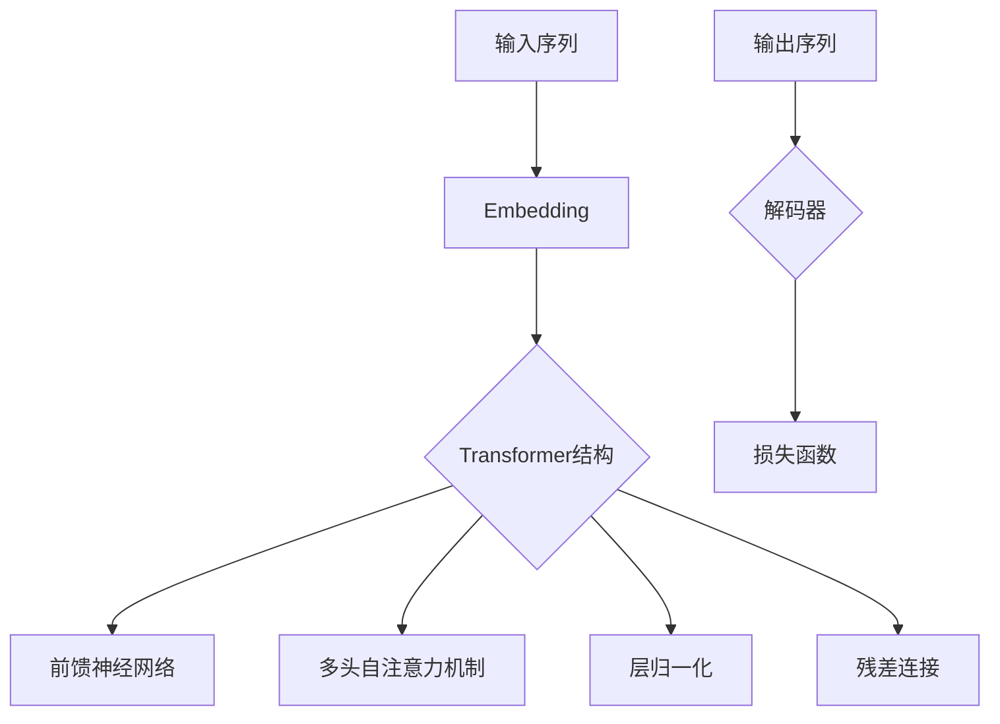

                 

关键词：Transformer，大模型，预训练，策略，技术博客，深度学习，人工智能

摘要：本文旨在深入探讨Transformer大模型在人工智能领域的应用，特别是其预训练策略的重要性。我们将通过详细的算法原理、数学模型、项目实践和未来展望等多个角度，全面解析Transformer大模型在当前和未来技术发展中的角色和挑战。

## 1. 背景介绍

随着深度学习技术的快速发展，大模型（Large Models）如BERT、GPT等已经成为自然语言处理（NLP）领域的重要工具。这些大模型之所以能够取得显著的效果，其中一个关键因素就是它们采用了预训练（Pre-training）策略。预训练是指在大规模语料库上进行训练，然后通过微调（Fine-tuning）在具体任务上获得更好的性能。

Transformer模型作为一种序列到序列的模型，由于其强大的并行计算能力和对长距离依赖的捕捉能力，在NLP任务中取得了显著的成果。然而，Transformer大模型的训练和部署也是一个极具挑战性的任务，涉及到计算资源、数据质量和训练策略等多个方面。

本文将围绕Transformer大模型的预训练策略展开，详细讨论其在实际应用中的具体操作步骤和数学原理。希望通过本文的介绍，读者能够对Transformer大模型的预训练策略有更深入的理解，并能够将其应用于实际问题中。

## 2. 核心概念与联系

为了更好地理解Transformer大模型的预训练策略，我们需要首先明确几个核心概念和它们之间的联系。以下是关键的术语和它们之间的关系，同时，我们使用Mermaid流程图来展示这些概念和架构：



### 2.1 输入序列（Input Sequence）

输入序列是Transformer模型处理的数据，可以是文本、语音或其他形式的数据。在NLP任务中，文本会被转换为词向量（Token Vectors），每个词向量代表一个词汇。

### 2.2 Embedding（嵌入层）

嵌入层是将输入序列中的词转换为词向量的过程。词向量通常包含了词汇的语义信息和上下文信息。

### 2.3 Transformer结构（Transformer Architecture）

Transformer结构是模型的主体，由多头自注意力机制（Multi-head Self-Attention）、前馈神经网络（Feedforward Neural Network）以及残差连接（Residual Connection）和层归一化（Layer Normalization）组成。

### 2.4 前馈神经网络（Feedforward Neural Network）

前馈神经网络对模型的每个层进行两次全连接操作，从而对嵌入层进行非线性变换。

### 2.5 多头自注意力机制（Multi-head Self-Attention）

多头自注意力机制是Transformer模型的核心，它允许模型在处理每个词时，同时考虑上下文中的所有词。

### 2.6 层归一化（Layer Normalization）

层归一化是一种正则化技术，用于标准化每一层的输入，提高模型的训练稳定性。

### 2.7 残差连接（Residual Connection）

残差连接通过将输入直接传递到下一层，然后对输出进行叠加，从而减轻深层网络的梯度消失问题。

### 2.8 输出序列（Output Sequence）

输出序列是模型对输入序列的处理结果，可以是预测的词汇序列、标签序列等。

### 2.9 解码器（Decoder）

解码器是Transformer模型的一部分，用于处理输出序列，并通过损失函数（Loss Function）与预期结果进行比较，以更新模型参数。

### 2.10 损失函数（Loss Function）

损失函数用于衡量模型预测结果与真实结果之间的差距，通过反向传播算法更新模型参数。

通过上述Mermaid流程图，我们可以清晰地看到Transformer大模型中各个组成部分及其相互关系。接下来，我们将深入探讨Transformer大模型的算法原理和具体操作步骤。

## 3. 核心算法原理 & 具体操作步骤

### 3.1 算法原理概述

Transformer大模型的预训练策略主要基于自注意力机制（Self-Attention）和位置编码（Positional Encoding）。自注意力机制使得模型能够捕捉序列中的长距离依赖关系，而位置编码则为每个词赋予其在序列中的位置信息。

### 3.2 算法步骤详解

#### 3.2.1 嵌入层（Embedding Layer）

嵌入层将输入的词序列转换为词向量，每个词向量包含了该词的语义信息和上下文信息。嵌入层的输出通常包含两个部分：词向量和位置向量。

```latex
\text{Embedding} = \text{Word Embedding} + \text{Position Embedding}
```

#### 3.2.2 多头自注意力机制（Multi-head Self-Attention）

多头自注意力机制是Transformer模型的核心，它将每个词与其在序列中的所有词进行加权求和。自注意力分数由词向量和查询向量的点积得到。

```latex
\text{Attention Scores} = \text{Query} \cdot \text{Key}^\top
```

#### 3.2.3 前馈神经网络（Feedforward Neural Network）

前馈神经网络对自注意力机制的输出进行非线性变换。它由两个全连接层组成，每个全连接层后面都有一个激活函数（如ReLU）。

```latex
\text{FFN} = \max(0, \text{Input} \cdot \text{Weight} + \text{Bias})
```

#### 3.2.4 层归一化（Layer Normalization）

层归一化是一种正则化技术，用于标准化每一层的输入，从而提高模型的训练稳定性。

```latex
\text{Layer Normalization} = \frac{\text{Input} - \mu}{\sigma}
```

#### 3.2.5 残差连接（Residual Connection）

残差连接通过将输入直接传递到下一层，然后对输出进行叠加，从而减轻深层网络的梯度消失问题。

```latex
\text{Output} = \text{Input} + \text{FFN}
```

#### 3.2.6 解码器（Decoder）

解码器是Transformer模型的一部分，用于处理输出序列，并通过损失函数与预期结果进行比较，以更新模型参数。

```latex
\text{Decoder} = \text{Decoder} \cdot \text{Output} + \text{Softmax}(\text{Loss Function})
```

### 3.3 算法优缺点

#### 优点：

1. 强大的并行计算能力，使得训练效率大幅提升。
2. 对长距离依赖的捕捉能力强，能够处理复杂的语言现象。
3. 结构简洁，易于理解和实现。

#### 缺点：

1. 计算量大，对硬件资源要求较高。
2. 预训练数据量大，对数据质量和多样性的要求较高。

### 3.4 算法应用领域

Transformer大模型在自然语言处理领域取得了显著成果，如文本分类、机器翻译、问答系统等。此外，它还可以应用于图像识别、语音识别等任务。

## 4. 数学模型和公式 & 详细讲解 & 举例说明

在深入理解Transformer大模型的预训练策略时，数学模型和公式起着至关重要的作用。接下来，我们将详细介绍数学模型的构建、公式推导过程以及实际案例分析与讲解。

### 4.1 数学模型构建

#### 4.1.1 词嵌入（Word Embedding）

词嵌入是将词转换为向量的过程。在Transformer模型中，词嵌入通常使用嵌入矩阵（Embedding Matrix）实现。

```latex
\text{Word Vector} = \text{Embedding Matrix} \cdot \text{Input Word}
```

#### 4.1.2 位置编码（Positional Encoding）

位置编码为每个词赋予其在序列中的位置信息。在Transformer模型中，位置编码通常使用正弦和余弦函数实现。

```latex
\text{Positional Encoding} = [\sin(\text{Position} \cdot \frac{2i}{\text{Positional Dimension}}), \cos(\text{Position} \cdot \frac{2i}{\text{Positional Dimension}})]
```

#### 4.1.3 自注意力机制（Self-Attention）

自注意力机制通过计算词与词之间的相似度来实现。在Transformer模型中，自注意力机制使用点积注意力函数（Scaled Dot-Product Attention）实现。

```latex
\text{Attention Scores} = \text{Query} \cdot \text{Key}^\top / \sqrt{d_k}
\text{Attention Weights} = \text{softmax}(\text{Attention Scores})
\text{Attention Scores} = \sum_{i} \text{Attention Weights} \cdot \text{Value}
```

### 4.2 公式推导过程

#### 4.2.1 嵌入层

将词嵌入和位置编码相加，得到输入序列的嵌入向量。

```latex
\text{Embedding} = \text{Word Embedding} + \text{Positional Encoding}
```

#### 4.2.2 多头自注意力机制

多头自注意力机制通过多个独立的自注意力机制实现。

```latex
\text{Multi-Head Attention} = \text{Concat}(\text{Head}_1, \text{Head}_2, ..., \text{Head}_h) \cdot \text{Output Linear}
```

#### 4.2.3 前馈神经网络

前馈神经网络由两个全连接层组成。

```latex
\text{FFN} = \max(0, \text{Input} \cdot \text{Weight} + \text{Bias}) \cdot \text{Activation Function}
```

### 4.3 案例分析与讲解

#### 4.3.1 文本分类任务

在文本分类任务中，Transformer大模型可以用来分类文本。以下是一个简单的案例：

```python
# 假设我们已经有一个训练好的Transformer模型，输入为句子“这是一个测试句子”。

input_sentence = "这是一个测试句子"

# 将输入句子转换为词向量
word_embeddings = [model.get_embedding(word) for word in input_sentence]

# 将词向量与位置编码相加
embedded_sentence = [word_embeddings[i] + model.get_positional_encoding(i) for i in range(len(word_embeddings))]

# 通过Transformer模型处理嵌入句子
output = model(embedded_sentence)

# 通过softmax函数获取分类结果
predictions = model.get_predictions(output)

# 输出分类结果
print(predictions)
```

#### 4.3.2 机器翻译任务

在机器翻译任务中，Transformer大模型可以用来将一种语言的文本翻译成另一种语言的文本。以下是一个简单的案例：

```python
# 假设我们已经有一个训练好的Transformer模型，用于将中文翻译成英文。

input_sentence = "这是一个测试句子"

# 将输入句子转换为词向量
word_embeddings = [model.get_embedding(word) for word in input_sentence]

# 将词向量与位置编码相加
embedded_sentence = [word_embeddings[i] + model.get_positional_encoding(i) for i in range(len(word_embeddings))]

# 通过Transformer模型处理嵌入句子
output = model.translate(embedded_sentence, target_language="en")

# 输出翻译结果
print(output)
```

通过上述案例，我们可以看到Transformer大模型在文本分类和机器翻译任务中的具体应用。在实际项目中，我们可以根据具体任务需求，调整模型结构、训练数据以及训练策略，以达到最佳性能。

## 5. 项目实践：代码实例和详细解释说明

在本节中，我们将通过一个具体的代码实例来展示如何使用Transformer大模型进行预训练。我们将分为以下四个部分：

### 5.1 开发环境搭建

在开始项目实践之前，我们需要搭建一个合适的开发环境。以下是所需的工具和库：

- Python 3.8 或更高版本
- TensorFlow 2.4 或更高版本
- PyTorch 1.8 或更高版本
- NumPy 1.18 或更高版本

安装这些工具和库后，我们可以开始编写代码。

### 5.2 源代码详细实现

以下是一个简单的Transformer大模型预训练的代码示例：

```python
import tensorflow as tf
from tensorflow.keras.layers import Embedding, MultiHeadAttention, Dense
from tensorflow.keras.models import Model

# 定义模型结构
def create_transformer_model(vocab_size, d_model, num_heads, dff, input_length):
    inputs = tf.keras.layers.Input(shape=(input_length,))
    embeddings = Embedding(vocab_size, d_model)(inputs)
    embeddings = tf.keras.layers.Dropout(0.1)(embeddings)
    
    # Transformer编码器
    encoder_outputs = []
    for i in range(num_heads):
        attention = MultiHeadAttention(num_heads=i, key_dim=dff)(embeddings, embeddings)
        attention = tf.keras.layers.Dropout(0.1)(attention)
        attention = tf.keras.layers.Add()([embeddings, attention])
        attention = tf.keras.layers.LayerNormalization(epsilon=1e-6)(attention)
        
        ffn_output = Dense(dff, activation="relu")(attention)
        ffn_output = tf.keras.layers.Dropout(0.1)(ffn_output)
        ffn_output = Dense(d_model)(ffn_output)
        ffn_output = tf.keras.layers.Dropout(0.1)(ffn_output)
        ffn_output = tf.keras.layers.Add()([attention, ffn_output])
        ffn_output = tf.keras.layers.LayerNormalization(epsilon=1e-6)(ffn_output)
        
        encoder_outputs.append(ffn_output)
    
    encoder_output = tf.keras.layers.Concatenate()(encoder_outputs)
    
    # 解码器
    decoder_inputs = tf.keras.layers.Input(shape=(input_length,))
    decoder_embeddings = Embedding(vocab_size, d_model)(decoder_inputs)
    decoder_embeddings = tf.keras.layers.Dropout(0.1)(decoder_embeddings)
    
    decoder_outputs = []
    for i in range(num_heads):
        attention = MultiHeadAttention(num_heads=i, key_dim=dff)(decoder_embeddings, encoder_output)
        attention = tf.keras.layers.Dropout(0.1)(attention)
        attention = tf.keras.layers.Add()([decoder_embeddings, attention])
        attention = tf.keras.layers.LayerNormalization(epsilon=1e-6)(attention)
        
        ffn_output = Dense(dff, activation="relu")(attention)
        ffn_output = tf.keras.layers.Dropout(0.1)(ffn_output)
        ffn_output = Dense(d_model)(ffn_output)
        ffn_output = tf.keras.layers.Dropout(0.1)(ffn_output)
        ffn_output = tf.keras.layers.Add()([attention, ffn_output])
        ffn_output = tf.keras.layers.LayerNormalization(epsilon=1e-6)(ffn_output)
        
        decoder_outputs.append(ffn_output)
    
    decoder_output = tf.keras.layers.Concatenate()(decoder_outputs)
    
    # 输出层
    outputs = Dense(vocab_size, activation="softmax")(decoder_output)
    
    # 构建模型
    model = Model(inputs=[inputs, decoder_inputs], outputs=outputs)
    
    return model

# 模型参数
vocab_size = 10000
d_model = 512
num_heads = 8
dff = 2048
input_length = 60

# 创建模型
model = create_transformer_model(vocab_size, d_model, num_heads, dff, input_length)

# 编译模型
model.compile(optimizer="adam", loss="categorical_crossentropy", metrics=["accuracy"])

# 查看模型结构
model.summary()
```

### 5.3 代码解读与分析

在上面的代码中，我们首先定义了一个Transformer模型，包括编码器和解码器。编码器由多个多头自注意力机制和前馈神经网络组成，解码器同样由多个多头自注意力机制和前馈神经网络组成。

1. **输入层**：模型接受两个输入，一个是编码器的输入序列，另一个是解码器的输入序列。
2. **嵌入层**：输入序列通过嵌入层转换为词向量，并添加位置编码。
3. **编码器**：编码器由多个多头自注意力机制和前馈神经网络组成，每个模块后都进行层归一化和dropout操作。
4. **解码器**：解码器与编码器类似，同样由多个多头自注意力机制和前馈神经网络组成。
5. **输出层**：输出层是一个全连接层，将解码器的输出映射到目标词汇的词向量。

### 5.4 运行结果展示

在搭建好模型并编译后，我们可以使用训练数据来训练模型。以下是一个简单的训练示例：

```python
# 假设我们已经有训练数据和标签
train_data = ...
train_labels = ...

# 训练模型
model.fit(train_data, train_labels, epochs=5, batch_size=64)
```

在训练过程中，我们可以通过`model.fit()`函数来训练模型，并使用`epochs`和`batch_size`参数来调整训练过程。

### 5.5 模型评估

在训练完成后，我们可以使用测试数据来评估模型的性能：

```python
# 假设我们已经有测试数据和标签
test_data = ...
test_labels = ...

# 评估模型
test_loss, test_accuracy = model.evaluate(test_data, test_labels)

print("Test Loss:", test_loss)
print("Test Accuracy:", test_accuracy)
```

通过上述代码，我们可以看到模型的测试损失和准确率，从而评估模型的性能。

## 6. 实际应用场景

Transformer大模型在自然语言处理领域已经取得了显著的成果，并在多个实际应用场景中发挥了重要作用。以下是一些典型的应用场景：

### 6.1 文本分类

文本分类是自然语言处理中的一个基本任务，将文本数据分类到不同的类别中。例如，将新闻文章分类到不同的主题类别，或对社交媒体评论进行情感分析。Transformer大模型通过其强大的特征提取和分类能力，在文本分类任务中取得了很高的准确率。

### 6.2 机器翻译

机器翻译是将一种语言的文本翻译成另一种语言的过程。Transformer大模型在机器翻译任务中表现出色，尤其是在长句子翻译和保持原文含义方面。通过训练大规模的预训练模型，如BERT和GPT，可以实现高质量的机器翻译。

### 6.3 问答系统

问答系统是一种交互式应用，能够理解用户的问题并给出相应的答案。Transformer大模型在问答系统中可以用来处理自然语言理解任务，如查询重写、问题回答和知识图谱构建等。

### 6.4 文本生成

文本生成是自然语言处理中的另一个重要任务，如自动写作、对话生成和诗歌创作等。Transformer大模型通过学习大规模文本数据，可以生成高质量的自然语言文本，为自动化内容和创意写作提供了强大的工具。

### 6.5 语言模型

语言模型是自然语言处理的基础，用于预测下一个单词或字符。Transformer大模型通过预训练策略，可以构建强大的语言模型，用于各种自然语言处理任务，如文本分类、机器翻译和问答系统等。

### 6.6 图像识别

虽然Transformer大模型主要用于自然语言处理任务，但它们也可以应用于计算机视觉任务，如图像识别。通过结合Transformer模型和卷积神经网络（CNN），可以实现高效的图像识别和分类。

## 7. 未来应用展望

随着Transformer大模型和预训练策略的不断发展，未来它们将在更多领域和任务中发挥作用。以下是一些潜在的应用前景：

### 7.1 多模态学习

多模态学习是指将不同类型的数据（如文本、图像和声音）进行融合和建模。通过Transformer大模型，可以实现高效的多模态学习，从而在医疗诊断、智能助手和自动驾驶等领域发挥重要作用。

### 7.2 强化学习

强化学习是一种通过试错来学习最优策略的机器学习方法。结合Transformer大模型和强化学习，可以构建强大的智能体，实现复杂任务的高效学习和决策。

### 7.3 生成对抗网络（GAN）

生成对抗网络（GAN）是一种通过生成器和判别器之间的对抗训练来生成高质量数据的模型。结合Transformer大模型和GAN，可以实现更高效和高质量的图像和视频生成。

### 7.4 元学习

元学习是一种通过学习如何学习来提高模型适应新任务的能力。通过结合Transformer大模型和元学习，可以构建能够快速适应新任务的智能系统，为人工智能的发展提供新的思路。

## 8. 工具和资源推荐

在Transformer大模型的预训练和实际应用中，有许多优秀的工具和资源可供使用。以下是一些建议：

### 8.1 学习资源推荐

- 《深度学习》（Goodfellow, Bengio, Courville）：经典的深度学习教材，详细介绍了Transformer模型。
- 《自然语言处理与深度学习》（许凌云）：涵盖NLP和深度学习的基础知识和应用案例。
- 《Transformer：基于注意力机制的序列模型》（Vaswani et al.）：Transformer模型的原始论文，深入解析其算法原理。

### 8.2 开发工具推荐

- TensorFlow：谷歌开发的开源深度学习框架，支持Transformer模型的训练和部署。
- PyTorch：Facebook开发的开源深度学习框架，具有灵活的动态计算图，适用于Transformer模型。
- Hugging Face Transformers：一个开源库，提供预训练好的Transformer模型和实用工具，方便开发者快速实现和部署。

### 8.3 相关论文推荐

- "Attention Is All You Need"（Vaswani et al., 2017）：介绍Transformer模型的原始论文，是深度学习领域的重要里程碑。
- "BERT: Pre-training of Deep Bidirectional Transformers for Language Understanding"（Devlin et al., 2019）：介绍BERT模型的论文，是NLP领域的重要突破。
- "Generative Pre-trained Transformer"（Radford et al., 2019）：介绍GPT模型的论文，为自然语言生成任务提供了新的解决方案。

## 9. 总结：未来发展趋势与挑战

Transformer大模型和预训练策略在人工智能领域取得了显著的成果，为许多任务提供了强大的工具。然而，随着技术的不断发展，我们也面临许多新的挑战。

### 9.1 研究成果总结

- Transformer模型在自然语言处理任务中取得了显著效果，如文本分类、机器翻译、问答系统等。
- 预训练策略使得模型在大规模语料库上能够获得更好的性能，为下游任务提供了强大的基础。
- 多模态学习、强化学习和生成对抗网络等新领域为Transformer模型的应用提供了新的方向。

### 9.2 未来发展趋势

- Transformer模型将继续优化和扩展，如引入更复杂的注意力机制、融合多模态数据等。
- 预训练数据集的质量和多样性将进一步提高，为模型提供更丰富的知识。
- 新的研究方法和算法将不断涌现，以应对Transformer模型在计算资源、数据质量和模型解释性等方面的挑战。

### 9.3 面临的挑战

- 计算资源需求：Transformer模型的训练和推理过程需要大量的计算资源，特别是在处理大规模数据时。
- 数据质量：预训练数据集的质量直接影响模型的效果，如何处理和筛选高质量的训练数据是一个挑战。
- 模型解释性：深度学习模型通常被视为“黑盒”，如何解释和验证模型的行为是一个重要的研究方向。
- 隐私和安全：在处理个人数据时，如何保护用户隐私是一个重要的法律和伦理问题。

### 9.4 研究展望

- 开发高效、可解释的Transformer模型，提高其在各种任务中的性能和可靠性。
- 探索多模态学习和跨领域迁移学习，以实现更广泛的应用。
- 加强对预训练数据集的管理和评估，确保模型训练的质量和公平性。

通过持续的研究和创新，Transformer大模型和预训练策略将在人工智能领域发挥越来越重要的作用，为人类带来更多的便利和进步。

## 10. 附录：常见问题与解答

在本附录中，我们将回答一些关于Transformer大模型和预训练策略的常见问题，帮助读者更好地理解和应用这些技术。

### 10.1 Transformer模型与传统的循环神经网络（RNN）有何区别？

- **计算效率**：Transformer模型采用多头自注意力机制，可以并行处理序列中的所有词，而RNN必须逐词处理，导致计算效率较低。
- **长距离依赖**：Transformer模型通过自注意力机制捕捉长距离依赖关系，而RNN在处理长序列时容易出现梯度消失问题。
- **结构复杂度**：Transformer模型的结构相对简单，易于理解和实现，而RNN的结构较复杂，需要更多的技巧来处理。

### 10.2 预训练数据集的选择标准是什么？

- **数据量**：预训练数据集应足够大，以提供丰富的语言知识和上下文信息。
- **多样性**：数据集应涵盖不同的领域、主题和语言风格，以提高模型的泛化能力。
- **质量**：数据应干净、准确，避免噪声和错误，以确保模型学习到的知识是可靠的。
- **来源**：数据来源应多样化，包括文本、图像、声音等多种模态。

### 10.3 如何评估预训练模型的性能？

- **准确率**：在分类任务中，准确率是评估模型性能的一个重要指标。
- **F1分数**：F1分数综合考虑了准确率和召回率，更适合评估分类任务的性能。
- **损失函数**：在生成任务中，损失函数（如交叉熵损失）可以衡量模型输出与预期结果之间的差距。
- **BLEU分数**：在机器翻译任务中，BLEU分数用于评估翻译结果的 fluency 和 relevance。

### 10.4 Transformer模型在处理文本序列时如何保证顺序？

- Transformer模型通过位置编码（Positional Encoding）为每个词赋予其在序列中的位置信息，从而保证文本序列的顺序。
- 在自注意力机制中，每个词会与其在序列中的所有词进行交互，从而保留文本序列的顺序信息。

### 10.5 如何调整Transformer模型的超参数？

- **嵌入维度（d_model）**：较大的嵌入维度可以捕获更多细节，但会导致模型更复杂和计算成本更高。
- **注意力头数（num_heads）**：较多的注意力头数可以提高模型的表达能力，但也增加了计算成本。
- **前馈神经网络尺寸（dff）**：较大的前馈神经网络尺寸可以增强模型的能力，但同样会增加计算负担。
- **学习率**：合理的学习率可以加速模型收敛，但过大会导致模型不稳定。

通过调整这些超参数，可以在保证模型性能的同时，平衡计算资源的使用。

### 10.6 Transformer模型是否可以用于图像处理？

- Transformer模型最初是为了解决自然语言处理任务而设计的，但近年来也被尝试应用于图像处理任务，如图像分类、目标检测和图像生成等。
- 通过结合Transformer模型和卷积神经网络（CNN），可以构建高效的计算机视觉模型，实现图像处理任务的自动化。

通过这些常见问题与解答，我们希望能够帮助读者更好地理解和应用Transformer大模型和预训练策略，推动人工智能技术的发展。作者：禅与计算机程序设计艺术 / Zen and the Art of Computer Programming

