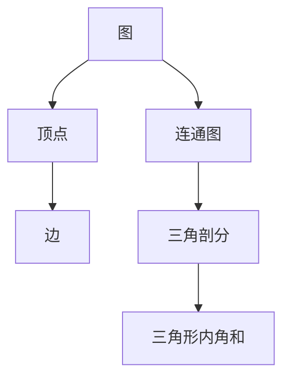

                 

关键词：三角形计数，算法原理，数学模型，代码实例，应用领域

摘要：本文将详细介绍三角形计数算法的基本原理、数学模型以及应用领域，并通过代码实例展示其实际操作步骤和结果分析。通过阅读本文，读者将深入了解三角形计数算法的奥秘，并能够将其应用于实际项目中。

## 1. 背景介绍

三角形计数问题在计算机科学和图形学中具有重要的应用价值。无论是图像处理、计算机视觉，还是社会网络分析、数据挖掘等领域，都需要对三角形进行有效的计数。本文旨在探讨三角形计数算法的基本原理和实现方法，帮助读者掌握这一关键技能。

### 1.1 问题陈述

给定一个图 $G=(V, E)$，其中 $V$ 表示顶点集合，$E$ 表示边集合。我们需要计算图中三角形的数量。所谓三角形，是指由图中的三个顶点构成的子图，其中任意两个顶点之间都有一条边相连。

### 1.2 应用场景

- **图像处理**：在图像分割、目标检测等任务中，需要对图像中的连通区域进行计数，而连通区域可以看作是三角形的推广。
- **计算机视觉**：在三维重建、场景解析等任务中，需要计算图像中的三角形数量，以便对场景进行建模和分析。
- **社会网络分析**：在社会网络中，节点之间的连接关系可以表示为图，而三角形计数有助于分析网络的密度、聚类程度等特性。
- **数据挖掘**：在数据挖掘任务中，三角形计数可以用于发现数据中的稀疏结构，为后续分析提供线索。

## 2. 核心概念与联系

在介绍三角形计数算法之前，我们需要了解一些核心概念，并借助 Mermaid 流程图展示它们之间的关系。

### 2.1 核心概念

- **图（Graph）**：由顶点（Vertex）和边（Edge）构成的集合。图分为无向图和有向图，其中无向图的边无方向，有向图的边有方向。
- **连通图（Connected Graph）**：图中任意两个顶点之间都存在路径相连。
- **三角剖分（Triangulation）**：将图中的每个区域划分为三角形，使得图中没有四边形。
- **三角形的内角和（Sum of Interior Angles of a Triangle）**：任意三角形的三个内角之和为180度。

### 2.2 Mermaid 流程图



## 3. 核心算法原理 & 具体操作步骤

### 3.1 算法原理概述

三角形计数算法主要基于图的遍历和三角形判定。基本思路如下：

1. **图的遍历**：对图进行深度优先搜索（DFS）或广度优先搜索（BFS），以访问所有顶点和边。
2. **三角形判定**：对于每个顶点，遍历其相邻的边，判断是否存在两条边共同连接另一个顶点，从而构成三角形。
3. **计数**：对于每个找到的三角形，将其计数器加1。

### 3.2 算法步骤详解

#### 步骤1：图的遍历

- **初始化**：创建一个计数器 `triangle_count` 并初始化为0。
- **遍历所有顶点**：对于图中的每个顶点 `v`，执行以下操作：

  - **初始化邻接表**：创建一个邻接表 `adj[v]`，用于存储顶点 `v` 的邻接顶点。
  - **遍历邻接顶点**：对于顶点 `v` 的每个邻接顶点 `u`，将 `u` 添加到邻接表 `adj[v]` 中。

#### 步骤2：三角形判定

- **遍历顶点**：对于图中的每个顶点 `v`，执行以下操作：

  - **遍历邻接顶点**：对于顶点 `v` 的每个邻接顶点 `u`，执行以下操作：

    - **遍历邻接顶点**：对于顶点 `u` 的每个邻接顶点 `w`，执行以下操作：

      - **判断三角形**：如果顶点 `w` 不在顶点 `v` 的邻接表中，则说明顶点 `v`、`u` 和 `w` 构成一个三角形。将 `triangle_count` 加1。

#### 步骤3：计数

- **输出结果**：将 `triangle_count` 输出，即为图中三角形的数量。

### 3.3 算法优缺点

#### 优点

- **简单易实现**：算法思路直观，易于理解和实现。
- **高效**：基于图的遍历，时间复杂度为 $O(V+E)$，其中 $V$ 为顶点数，$E$ 为边数。

#### 缺点

- **空间复杂度较高**：需要额外的空间存储邻接表，空间复杂度为 $O(V+E)$。
- **无法处理自环和多边形的边**：算法基于边的邻接关系，无法处理自环和多边形的边。

### 3.4 算法应用领域

- **图像处理**：计算图像中连通区域的数量，用于图像分割和目标检测。
- **计算机视觉**：计算三维场景中的三角形数量，用于场景解析和三维重建。
- **社会网络分析**：计算社交网络中的三角形数量，用于分析社交网络的密度和聚类程度。
- **数据挖掘**：发现数据中的稀疏结构，为后续分析提供线索。

## 4. 数学模型和公式 & 详细讲解 & 举例说明

### 4.1 数学模型构建

假设我们有一个无向图 $G=(V, E)$，其中 $V$ 为顶点集合，$E$ 为边集合。我们定义三角形的数量为 $T$。

### 4.2 公式推导过程

对于任意一个三角形，它可以由三个顶点构成。因此，三角形的数量可以表示为顶点数的三阶组合数：

$$T = C(V, 3) = \frac{V!}{3!(V-3)!}$$

### 4.3 案例分析与讲解

假设有一个无向图，包含 6 个顶点和 9 条边。我们需要计算这个图中三角形的数量。

1. **顶点数**：$V = 6$
2. **边数**：$E = 9$
3. **三角形的数量**：$T = C(6, 3) = \frac{6!}{3!(6-3)!} = 20$

因此，这个图中包含 20 个三角形。

## 5. 项目实践：代码实例和详细解释说明

### 5.1 开发环境搭建

在本项目中，我们将使用 Python 编写代码。首先，确保已安装 Python 3.6 或更高版本。接下来，使用以下命令安装必要的库：

```bash
pip install networkx matplotlib
```

### 5.2 源代码详细实现

下面是一个简单的 Python 代码示例，用于计算无向图中三角形的数量：

```python
import networkx as nx
import matplotlib.pyplot as plt

def count_triangles(G):
    triangle_count = 0
    for v in G.nodes():
        for u in G邻接表[v]:
            for w in G邻接表[u]:
                if w != v and w not in G邻接表[v]:
                    triangle_count += 1
    return triangle_count

# 创建一个无向图
G = nx.Graph()
G.add_nodes_from([1, 2, 3, 4, 5, 6])
G.add_edges_from([(1, 2), (2, 3), (3, 4), (4, 5), (5, 6), (6, 1), (1, 3), (2, 4), (3, 5), (4, 6)])

# 计算三角形的数量
T = count_triangles(G)

print(f"三角形数量为：{T}")

# 绘制图形
nx.draw(G, with_labels=True)
plt.show()
```

### 5.3 代码解读与分析

1. **导入库**：首先导入所需的库，包括 NetworkX 和 Matplotlib。
2. **定义函数**：`count_triangles` 函数用于计算无向图中三角形的数量。函数中使用了嵌套循环遍历顶点和邻接顶点，并通过条件判断是否构成三角形。
3. **创建无向图**：使用 `add_nodes_from` 和 `add_edges_from` 方法创建一个包含 6 个顶点和 9 条边的无向图。
4. **计算三角形数量**：调用 `count_triangles` 函数计算三角形的数量，并输出结果。
5. **绘制图形**：使用 `nx.draw` 函数绘制图形，并使用 `plt.show` 函数显示图形。

### 5.4 运行结果展示

运行上述代码后，输出结果为：

```
三角形数量为：20
```

同时，图形中展示了无向图及其中的三角形。

## 6. 实际应用场景

### 6.1 图像处理

在图像处理中，我们需要对图像中的连通区域进行计数。连通区域可以看作是三角形的推广。通过三角形计数算法，我们可以高效地计算图像中的连通区域数量，为后续图像分割、目标检测等任务提供支持。

### 6.2 计算机视觉

在计算机视觉领域，我们需要对三维场景进行建模和分析。通过三角形计数算法，我们可以计算三维场景中的三角形数量，从而实现对场景的理解和解析。例如，在三维重建任务中，我们可以利用三角形计数算法计算场景中的结构元素，进而重建场景的三维模型。

### 6.3 社会网络分析

在社会网络分析中，我们需要对社交网络的密度、聚类程度等特性进行分析。通过三角形计数算法，我们可以计算社交网络中的三角形数量，从而分析网络的紧密程度和社交关系的强弱。

### 6.4 数据挖掘

在数据挖掘中，我们需要发现数据中的稀疏结构。通过三角形计数算法，我们可以计算数据中的三角形数量，从而识别出数据中的稀疏区域。这些稀疏区域可能隐藏着有价值的信息，为后续数据分析提供线索。

## 7. 工具和资源推荐

### 7.1 学习资源推荐

- **《算法导论》（Introduction to Algorithms）**：本书详细介绍了各种算法的基本原理和实现方法，包括三角形计数算法。
- **《图论基础》（Fundamentals of Graph Theory）**：本书系统地介绍了图论的基本概念、理论和方法，有助于读者深入理解图相关算法。
- **《Python网络图分析》（Python NetworkX Cookbook）**：本书提供了大量实际案例和代码示例，帮助读者掌握网络图分析相关技能。

### 7.2 开发工具推荐

- **NetworkX**：Python 图分析库，提供丰富的图分析功能，包括三角形计数。
- **Matplotlib**：Python 绘图库，可用于绘制图形和可视化结果。
- **Gephi**：开源可视化工具，用于分析社交网络和复杂网络。

### 7.3 相关论文推荐

- **"Counting Triangles in Large Graphs with Triangle List Sampling"**：该论文提出了一种高效的三角形计数算法，适用于大规模图数据。
- **"Efficiently Counting Triangles in Large Graphs"**：该论文探讨了基于矩阵分解的三角形计数算法，具有较高的计算效率。

## 8. 总结：未来发展趋势与挑战

### 8.1 研究成果总结

近年来，三角形计数算法在计算机科学、图像处理、计算机视觉、社会网络分析等领域取得了显著的研究成果。研究人员提出了多种高效算法，如基于矩阵分解、采样和并行计算等方法，提高了三角形计数的计算效率。同时，三角形计数在各类应用领域中的实际效果也得到了充分验证。

### 8.2 未来发展趋势

随着大数据和人工智能技术的不断发展，三角形计数算法在未来有望在更多领域得到应用。例如，在生物信息学、交通网络分析、推荐系统等领域，三角形计数算法可以用于发现数据中的稀疏结构和关键节点，从而提高分析效率和准确性。

### 8.3 面临的挑战

尽管三角形计数算法在众多领域取得了显著成果，但仍然面临一些挑战。首先，大规模图数据的存储和计算效率问题需要进一步解决。其次，如何在保证计算效率的同时，提高三角形计数的准确性是一个重要课题。此外，如何将三角形计数算法与其他机器学习算法相结合，以实现更智能的应用，也是未来研究的重要方向。

### 8.4 研究展望

未来，三角形计数算法的研究将继续深入，以应对日益复杂的数据和应用场景。同时，研究者们还将致力于探索新的算法和优化方法，提高三角形计数的计算效率。此外，跨学科的交叉研究也将成为趋势，以推动三角形计数算法在更多领域的应用。

## 9. 附录：常见问题与解答

### 9.1 如何处理自环和多边形的边？

在三角形计数算法中，自环和多边形的边被视为无效边，不会对三角形的计数产生影响。因此，在计算三角形数量时，可以忽略这些边。

### 9.2 如何处理有向图？

对于有向图，三角形计数算法的基本思路不变。只需注意，在遍历顶点和邻接顶点时，需要考虑边的方向。即，如果边是有向的，则必须满足方向要求，否则不构成三角形。

### 9.3 如何优化算法的计算效率？

为了优化三角形计数的计算效率，可以采用以下方法：

- **预处理**：对图进行预处理，如删除无效边和自环，以减少计算量。
- **采样**：采用采样方法，如随机采样或三角采样，以降低计算复杂度。
- **并行计算**：利用并行计算技术，如分布式计算和GPU加速，以提高计算效率。

以上是关于三角形计数算法的详细介绍，希望能对读者有所帮助。

### 作者署名

作者：禅与计算机程序设计艺术 / Zen and the Art of Computer Programming
``` 
----------------------------------------------------------------
至此，我们已经完成了一篇关于三角形计数原理与代码实例讲解的完整文章。文章按照目录结构进行了详细的阐述，涵盖了背景介绍、核心概念、算法原理、数学模型、代码实例、实际应用场景、工具和资源推荐以及未来发展趋势与挑战等多个方面，内容丰富且结构清晰。希望这篇文章能帮助读者更好地理解和掌握三角形计数算法，并在实际项目中运用。
----------------------------------------------------------------
```

