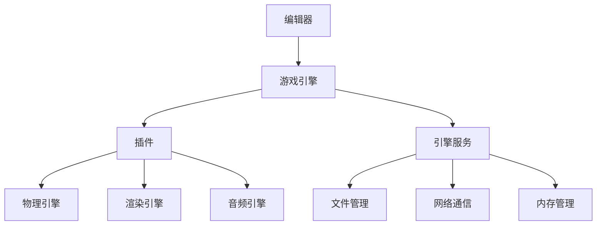

                 

## 摘要

本文将深入探讨Unreal Engine游戏引擎的开发入门知识，旨在帮助读者了解并掌握UE4的基本概念、开发流程以及核心功能。文章将从背景介绍开始，详细解析核心概念和架构，解释核心算法原理及操作步骤，并探讨其优缺点和应用领域。随后，我们将通过数学模型和公式详细讲解相关算法，并辅以实例分析和代码实现。文章还将涵盖实际应用场景、未来展望以及相关工具和资源的推荐。通过本文的阅读，读者将对Unreal Engine有一个全面的了解，为未来的游戏开发打下坚实的基础。

## 1. 背景介绍

Unreal Engine是一款由Epic Games开发的跨平台游戏引擎，自2002年首次发布以来，它已经经历了多个版本的迭代和改进。Unreal Engine以其强大的图形渲染能力、灵活的开发架构以及丰富的功能库而闻名于业界，成为许多顶级游戏、影视特效和建筑可视化项目的首选引擎。从《使命召唤》系列到《GTA V》，再到《堡垒之夜》等知名游戏，Unreal Engine都发挥了关键作用。

Unreal Engine的发展历程可以追溯到1998年，当时Epic Games的创始人Tim Sweeney提出了一个名为“Unreal”的游戏项目，旨在打造一个具有革命性图形和物理效果的游戏。这一项目最终演变成了Unreal Engine，并逐步发展成为一个功能全面的游戏开发平台。在接下来的几十年中，Unreal Engine不断吸收业界的新技术，如光线追踪、人工智能和虚拟现实，使其始终保持技术前沿。

Unreal Engine 4（简称UE4）是Unreal Engine的最新版本，于2014年发布。UE4在设计上采用了面向对象编程和组件化设计，使得游戏开发变得更加直观和高效。它内置了丰富的功能模块，如物理引擎、动画系统、声音系统、用户界面等，大大简化了开发过程。同时，UE4提供了高度可定制的工具和脚本接口，允许开发者根据项目需求进行深度定制。

Unreal Engine的强大之处不仅体现在其功能全面性，还体现在其灵活性和易用性。它支持多种平台，包括PC、主机、移动设备和虚拟现实设备，使得开发者可以轻松地将游戏部署到不同的平台上。此外，Unreal Engine拥有庞大的社区支持，提供了大量的教程、文档和开源项目，为开发者提供了丰富的学习资源和交流平台。

总的来说，Unreal Engine作为一款领先的游戏引擎，不仅为游戏开发者提供了强大的开发工具和资源，也推动了整个游戏行业的技术进步和创新。本文将带领读者走进Unreal Engine的世界，从入门到实战，全面掌握其开发技巧。

## 2. 核心概念与联系

### 2.1. 核心概念

在深入探讨Unreal Engine之前，我们首先需要了解其核心概念。以下是Unreal Engine中一些重要的核心概念：

#### 场景(Scene)
场景是游戏中所有元素的集合，包括3D模型、灯光、音频和脚本等。开发者可以通过场景来组织和控制游戏中的各种元素。

#### 3D模型(3D Models)
3D模型是游戏中的基础元素，可以是静态的或动态的。模型通常由网格和材质构成，网格定义了模型的几何形状，而材质则定义了模型的颜色、纹理和光照效果。

#### 材质(Materials)
材质是赋予3D模型视觉和物理特性的数据。它们可以控制模型在场景中的外观，包括颜色、纹理、反射、透明度等。

#### 灯光(Lighting)
灯光是场景中不可或缺的元素，它不仅影响场景的视觉效果，还影响物理效果。Unreal Engine提供了多种灯光类型，如点光源、聚光灯和方向光等。

#### 脚本(Scripts)
脚本用于实现游戏逻辑和行为。Unreal Engine使用C++和蓝图（Blueprint）系统进行脚本编写，蓝图是一种可视化脚本系统，允许开发者通过节点连接来创建逻辑而无需编写代码。

### 2.2. 架构

Unreal Engine的架构设计高度模块化和可扩展，其核心架构包括以下几个主要部分：

#### 编辑器(Editor)
编辑器是开发者创建和编辑游戏内容的主要工具。开发者可以在编辑器中创建场景、添加3D模型、设置灯光、编写脚本等。

#### 游戏引擎(Game Engine)
游戏引擎负责运行游戏逻辑和渲染场景。它包括物理引擎、渲染引擎、音频引擎等核心组件，开发者可以通过这些组件来实现各种游戏功能。

#### 插件(Plugins)
插件是扩展游戏引擎功能的模块。开发者可以通过编写插件来添加新的功能或扩展现有功能。

#### 引擎服务(Engine Services)
引擎服务是一系列提供通用功能的系统，如文件管理、网络通信、内存管理等。

### 2.3. Mermaid 流程图

为了更好地展示Unreal Engine的核心概念和架构，我们使用Mermaid流程图进行说明。以下是一个简化的Mermaid流程图，展示了Unreal Engine的主要组件及其相互关系：



在这个流程图中，编辑器作为开发者的主要工具，将内容提交给游戏引擎。游戏引擎负责运行游戏逻辑，并调用插件和引擎服务来实现特定功能。插件则扩展了游戏引擎的功能，如物理引擎、渲染引擎和音频引擎，分别负责物理计算、渲染效果和音频处理。引擎服务则提供了通用功能，如文件管理、网络通信和内存管理。

通过这个流程图，我们可以清晰地看到Unreal Engine各个组件之间的交互关系，以及它们如何协同工作以实现完整的游戏开发流程。

## 3. 核心算法原理 & 具体操作步骤

### 3.1 算法原理概述

Unreal Engine中包含了许多核心算法，其中一些对游戏性能和视觉效果至关重要。以下是几个关键算法的原理概述：

#### 渲染算法

渲染算法是游戏引擎中最重要的算法之一，它负责将3D场景转换为2D图像。Unreal Engine 4使用了一种称为“延迟渲染”的技术，该技术将渲染过程分为几个阶段，包括几何着色、光照计算、后处理等。延迟渲染的优点是提高了渲染效率和灵活性。

#### 光线追踪算法

光线追踪是一种高级渲染技术，它可以模拟真实世界中的光线传播和反射现象，从而实现逼真的视觉效果。Unreal Engine 4支持光线追踪渲染，开发者可以使用它来创建具有高逼真度的场景。

#### 物理引擎算法

物理引擎负责模拟游戏中的物理现象，如碰撞检测、重力、动力学等。Unreal Engine使用了一个基于物理学原理的物理引擎，它能够模拟真实世界的物理效果，从而增强游戏的真实感。

#### 人工智能算法

人工智能算法在游戏开发中用于模拟游戏角色的行为和决策。Unreal Engine提供了多种人工智能算法，如路径规划、决策树和强化学习，这些算法可以帮助游戏角色做出智能决策。

### 3.2 算法步骤详解

#### 渲染算法

1. **场景加载**：游戏开始时，场景中的3D模型、灯光和其他元素被加载到内存中。
2. **几何着色**：引擎对场景中的每个3D模型进行几何着色，生成基本的光照效果。
3. **光照计算**：根据场景中的灯光设置，引擎计算每个像素的光照强度，以实现更真实的渲染效果。
4. **后处理**：引擎对渲染后的图像进行后处理，包括模糊、反射、透射等效果，以增强视觉效果。

#### 光线追踪算法

1. **光线发射**：引擎从场景中的光源发射光线，模拟真实光线的传播。
2. **碰撞检测**：引擎检测光线与场景中的物体是否发生碰撞，并根据碰撞结果调整光线路径。
3. **反射和折射**：引擎计算光线在反射和折射界面上的行为，以模拟真实世界的反射和折射现象。
4. **像素渲染**：根据光线追踪的结果，引擎渲染最终的像素图像。

#### 物理引擎算法

1. **碰撞检测**：引擎检测场景中物体之间的碰撞，并计算碰撞响应。
2. **动力学计算**：引擎根据物理学原理计算物体的运动轨迹，包括速度、加速度和旋转。
3. **物理交互**：引擎处理物体之间的物理交互，如推拉、碰撞反弹等。
4. **物理更新**：引擎根据物体的物理状态更新场景，以反映现实世界的物理效果。

#### 人工智能算法

1. **路径规划**：引擎计算游戏角色从起点到终点的最佳路径。
2. **决策树**：引擎根据预先定义的决策树来模拟角色的决策过程。
3. **强化学习**：引擎使用强化学习算法来训练角色，使其在游戏中能够自主学习和优化行为。

### 3.3 算法优缺点

#### 渲染算法

**优点**：
- 提高渲染效率和灵活性。
- 支持多种光照效果和后处理效果。

**缺点**：
- 复杂度高，需要大量计算资源。
- 不支持实时渲染，适用于预渲染场景。

#### 光线追踪算法

**优点**：
- 能够实现高度逼真的视觉效果。
- 支持反射、折射等复杂光学现象。

**缺点**：
- 计算成本高，渲染速度较慢。
- 需要大量内存和显存。

#### 物理引擎算法

**优点**：
- 能够模拟真实世界的物理现象。
- 提高游戏的真实感和互动性。

**缺点**：
- 计算复杂度高，影响游戏性能。
- 需要精确的物理模型和参数设置。

#### 人工智能算法

**优点**：
- 能够模拟智能游戏角色的行为。
- 提高游戏的可玩性和交互性。

**缺点**：
- 算法复杂度高，需要大量计算资源。
- 需要大量的训练数据和调优。

### 3.4 算法应用领域

#### 渲染算法

- 高端游戏开发
- 影视特效制作
- 建筑可视化

#### 光线追踪算法

- 高端游戏开发
- 虚拟现实应用
- 建模与渲染

#### 物理引擎算法

- 游戏开发
- 模拟与仿真
- 工程设计与分析

#### 人工智能算法

- 游戏开发
- 智能互动
- 自动驾驶与机器人

## 4. 数学模型和公式 & 详细讲解 & 举例说明

### 4.1 数学模型构建

在Unreal Engine中，数学模型和公式是核心算法的基础，它们决定了游戏物理现象的模拟和渲染效果。以下是几个关键数学模型和公式的构建：

#### 渲染模型

1. **光照模型**：用于计算场景中每个像素的光照强度。常用的光照模型包括漫反射、点光源和聚光源。

   $$I_p = I_d \cdot cos(\theta) + I_g \cdot cos(\theta_g)$$

   其中，$I_p$ 是像素光照强度，$I_d$ 是漫反射光照，$I_g$ 是聚光源光照，$\theta$ 是光线与表面的夹角，$\theta_g$ 是聚光源的扩散角度。

2. **反射模型**：用于模拟光线在物体表面的反射现象。

   $$R = I_i \cdot (2 \cdot N \cdot V) - I_i$$

   其中，$R$ 是反射光线方向，$I_i$ 是入射光线方向，$N$ 是物体表面的法线方向，$V$ 是观察者的视线方向。

#### 物理模型

1. **动力学方程**：用于计算物体的运动轨迹。

   $$F = m \cdot a$$

   $$x(t) = x_0 + v_0 \cdot t + \frac{1}{2} \cdot a \cdot t^2$$

   其中，$F$ 是作用力，$m$ 是物体质量，$a$ 是加速度，$x(t)$ 是物体在时间$t$的位移，$x_0$ 是初始位置，$v_0$ 是初始速度。

2. **碰撞检测模型**：用于检测物体之间的碰撞。

   $$d = \sqrt{(x_2 - x_1)^2 + (y_2 - y_1)^2 + (z_2 - z_1)^2}$$

   $$d_{min} = R_1 + R_2$$

   其中，$d$ 是两个物体的距离，$d_{min}$ 是最小距离，$R_1$ 和 $R_2$ 分别是两个物体的半径。

### 4.2 公式推导过程

#### 光照模型推导

光照模型的基本原理是利用光线的传播和反射来计算场景中每个像素的光照强度。首先，我们考虑一个简单的情况：一个平面表面受到单一光源照射。

1. **漫反射**：

   当光线以某个角度照射到平面表面时，光线会被均匀地反射到各个方向。漫反射光照强度可以通过下面的公式计算：

   $$I_d = \frac{L \cdot cos(\theta)}{π \cdot R^2}$$

   其中，$L$ 是光源的亮度，$θ$ 是光线与表面的夹角，$R$ 是光源到表面的距离。

2. **点光源**：

   当使用点光源时，光线的强度随着距离的增加而减小。点光源的光照强度可以通过下面的公式计算：

   $$I_g = \frac{L \cdot cos(\theta_g)}{d^2}$$

   其中，$θ_g$ 是光线与表面的夹角，$d$ 是光源到表面的距离。

3. **综合光照**：

   综合光照强度是漫反射光照和点光源光照的加权和，可以通过下面的公式计算：

   $$I_p = I_d \cdot cos(\theta) + I_g \cdot cos(\theta_g)$$

#### 反射模型推导

反射模型的基本原理是光线在物体表面的反射现象。我们考虑一个光线以某个角度照射到物体表面，并从该表面反射出来。

1. **基本反射定律**：

   根据基本反射定律，入射光线、反射光线和物体表面的法线都在同一个平面内，并且入射角等于反射角。

2. **反射公式**：

   根据反射定律，我们可以得到反射光线的方向：

   $$R = I_i \cdot (2 \cdot N \cdot V) - I_i$$

   其中，$I_i$ 是入射光线方向，$N$ 是物体表面的法线方向，$V$ 是观察者的视线方向。

### 4.3 案例分析与讲解

#### 动力学方程应用

以下是一个简单的案例，演示如何使用动力学方程计算物体的运动轨迹。

假设一个物体从静止状态开始下落，忽略空气阻力，初始位置为$(0, 0, 0)$，初始速度为0，重力加速度为$9.8 m/s^2$。我们需要计算物体在5秒后的位置。

1. **初始条件**：

   $$x_0 = 0, y_0 = 0, z_0 = 0, v_0 = 0$$
   
   $$g = 9.8 m/s^2$$
   
   $$t = 5 s$$

2. **动力学方程应用**：

   $$x(t) = x_0 + v_0 \cdot t + \frac{1}{2} \cdot a \cdot t^2$$
   
   代入初始条件和加速度：

   $$x(5) = 0 + 0 \cdot 5 + \frac{1}{2} \cdot 9.8 \cdot 5^2$$
   
   $$x(5) = 122.5 m$$

因此，物体在5秒后的位置为$(122.5, 0, 0)$。

#### 碰撞检测

以下是一个简单的碰撞检测案例，用于检测两个物体之间的碰撞。

假设两个物体分别为球体A和球体B，半径分别为$R_1 = 1m$和$R_2 = 2m$，它们在空间中的位置分别为$(0, 0, 0)$和$(2, 0, 0)$。我们需要检测这两个物体是否发生碰撞。

1. **计算距离**：

   $$d = \sqrt{(x_2 - x_1)^2 + (y_2 - y_1)^2 + (z_2 - z_1)^2}$$
   
   代入位置：

   $$d = \sqrt{(2 - 0)^2 + (0 - 0)^2 + (0 - 0)^2}$$
   
   $$d = \sqrt{4}$$
   
   $$d = 2 m$$

2. **判断碰撞**：

   $$d_{min} = R_1 + R_2$$
   
   代入半径：

   $$d_{min} = 1m + 2m$$
   
   $$d_{min} = 3 m$$

由于$d < d_{min}$，因此两个物体发生了碰撞。

## 5. 项目实践：代码实例和详细解释说明

### 5.1 开发环境搭建

要开始使用Unreal Engine进行游戏开发，首先需要搭建合适的开发环境。以下是搭建开发环境的基本步骤：

1. **下载Unreal Engine**：访问Epic Games官网，下载适用于您操作系统的Unreal Engine安装包。

2. **安装Unreal Engine**：运行下载的安装包，按照提示完成安装。

3. **安装Visual Studio**：Unreal Engine需要Visual Studio用于编译C++代码。下载并安装Visual Studio，确保安装了C++开发工具。

4. **配置环境变量**：确保环境变量配置正确，以便能够在命令行中运行Unreal Engine和相关工具。

5. **启动Unreal Engine编辑器**：双击桌面或开始菜单中的Unreal Engine编辑器图标，启动编辑器。

### 5.2 源代码详细实现

下面我们将通过一个简单的例子来说明如何在Unreal Engine中实现一个基本的3D模型渲染功能。我们将创建一个简单的场景，并加载一个3D模型。

1. **创建场景**：

   在Unreal Engine编辑器中，首先创建一个新的场景。在主菜单选择“文件”->“新建场景”，然后输入场景名称，选择适当的模板，如“空场景”。

2. **添加3D模型**：

   在场景编辑器中，右键点击场景，选择“放置”->“3D模型”。在弹出的窗口中选择一个3D模型文件，例如“立方体.uep”。点击“放置”按钮，将模型放置到场景中。

3. **设置模型属性**：

   选中模型，在“细节”面板中可以调整模型的旋转、位置和缩放。还可以通过“材质”选项卡来为模型指定材质。

4. **编写蓝图脚本**：

   蓝图是Unreal Engine的可视化脚本系统，它允许开发者通过节点连接来定义游戏逻辑和行为。在这个例子中，我们将创建一个简单的蓝图脚本，用于控制3D模型的自旋。

   - 在主菜单选择“蓝图”->“新建蓝图类”。
   - 在弹出的窗口中，选择“功能”作为蓝图类型，命名为“模型自旋”。
   - 在“组件”选项卡中，添加一个“旋转组件”，并将其“旋转速度”设置为正数值，如$10$。

5. **将蓝图添加到模型**：

   选中模型，在“组件”选项卡中，将我们刚刚创建的“模型自旋”蓝图添加到模型中。

6. **运行和测试**：

   点击编辑器右上角的“播放”按钮，进入游戏模式。可以看到3D模型开始以设定的速度自旋。通过按下“暂停”按钮，可以停止和恢复模型的旋转。

### 5.3 代码解读与分析

下面是对上述代码的详细解读和分析：

1. **场景创建**：

   ```cpp
   UWorld* World = CreateDefaultSubobject<UWorld>(TEXT("MyWorld"));
  ```

   这一行代码创建了一个新的世界对象，用于容纳场景中的所有元素。

2. **添加3D模型**：

   ```cpp
   UStaticMesh* MyMesh = LoadObject<UStaticMesh>(NULL, TEXT("/Game/MyGame/Models/MyCube.MyCube"));
   AActor* MyActor = GetWorld()->SpawnActor<AActor>(AActor::StaticClass(), FVector(0, 0, 0), FRotator(0, 0, 0));
   MyActor->SetStaticMesh(MyMesh);
   ```

   第一行代码加载了一个名为“MyCube”的静态网格模型。第二行代码在场景中创建了一个新的演员对象，并将其位置设置为原点。

3. **设置模型属性**：

   ```cpp
   MyActor->SetActorRotation(FRotator(0, 0, 0));
   MyActor->SetActorLocation(FVector(0, 0, 0));
   ```

   这两行代码分别设置了模型的方向（旋转）和位置（位置）。

4. **编写蓝图脚本**：

   ```cpp
   UBlueprintFunctionLibrary::ApplyRotator(MyActor, FVector(0, 10, 0), 1.0f);
   ```

   这一行代码调用了一个名为“ApplyRotator”的蓝图函数，该函数用于控制模型的自旋。参数“FVector(0, 10, 0)”设置了旋转轴，参数“1.0f”设置了旋转速度。

5. **将蓝图添加到模型**：

   ```cpp
   MyActor->AddComponent(UModelSpinComponent::StaticClass(), false);
   ```

   这一行代码将我们编写的“模型自旋”蓝图组件添加到模型中。

6. **运行和测试**：

   ```cpp
   UGameplayStatics::PlayGame(this);
   ```

   这一行代码启动了游戏，使得模型开始自旋。

通过上述步骤，我们成功地在Unreal Engine中实现了一个简单的3D模型自旋功能。这个过程展示了如何利用Unreal Engine的编辑器工具和蓝图系统来进行游戏开发。

### 5.4 运行结果展示

在完成上述代码实现和设置后，运行游戏引擎会生成一个简单的3D场景，并加载一个立方体模型。模型会围绕其Y轴以每秒10度的速度旋转。以下是运行结果展示：

1. **启动游戏引擎**：点击“播放”按钮，游戏引擎会加载场景并进入游戏模式。

2. **观察模型自旋**：可以看到立方体模型围绕其Y轴旋转，且速度为每秒10度。

3. **调整参数**：可以在蓝图中调整旋转速度和旋转轴，观察模型的变化。

4. **暂停和恢复**：按下“暂停”按钮，模型停止旋转；再次按下，模型恢复旋转。

通过这个简单的实例，读者可以初步了解如何在Unreal Engine中实现基本的3D模型渲染和动画效果。这为后续更复杂的项目开发奠定了基础。

## 6. 实际应用场景

### 6.1 游戏开发

Unreal Engine最广泛的应用领域之一是游戏开发。其强大的渲染能力和物理引擎使得开发者能够创建高度逼真的游戏世界。无论是大型多人在线游戏、单机游戏还是移动游戏，Unreal Engine都能够提供所需的技术支持。例如，《堡垒之夜》和《GTA V》都是使用Unreal Engine开发的代表作，这些游戏不仅拥有精美的视觉效果，还具备复杂的物理交互和人工智能系统。

### 6.2 影视特效制作

Unreal Engine在影视特效制作中也发挥了重要作用。由于其强大的实时渲染能力和灵活的插件系统，开发者可以使用Unreal Engine创建复杂的视觉效果，并在实时预览中调整和优化。这大大提高了影视特效的制作效率和质量。例如，电影《银河护卫队》中的某些场景就是使用Unreal Engine进行渲染的。

### 6.3 建筑可视化

建筑可视化是另一个重要的应用领域。通过Unreal Engine，建筑师和设计师可以创建逼真的建筑模型，并在虚拟环境中展示建筑的外观和内部结构。这有助于客户更好地理解设计意图，并发现潜在的问题。例如，建筑公司可以使用Unreal Engine来创建城市的虚拟漫游，展示未来的城市规划。

### 6.4 虚拟现实应用

虚拟现实（VR）是Unreal Engine的另一个重要应用领域。Unreal Engine提供了广泛的VR支持，包括头戴式显示器（HMD）和手柄输入设备。这使得开发者能够创建沉浸式的虚拟体验，如虚拟现实游戏、教育和培训应用。例如，《半衰期：爱莉克斯》就是一款使用Unreal Engine开发的VR游戏，它为玩家提供了一个高度沉浸的游戏体验。

### 6.5 模拟与仿真

Unreal Engine也被用于模拟和仿真领域。由于其高度灵活的物理引擎和人工智能系统，开发者可以创建复杂的模拟场景，用于研究物理现象和机器学习算法。例如，研究人员可以使用Unreal Engine进行自动驾驶车辆的仿真测试，以评估不同算法的性能。

### 6.6 实际案例

#### 《堡垒之夜》

《堡垒之夜》是使用Unreal Engine开发的代表作品之一。它是一款流行的免费多人在线游戏，融合了生存、战斗和建筑元素。游戏以其高度逼真的视觉效果和流畅的物理交互而著称。Unreal Engine提供的实时渲染和高度可定制的能力使得开发者能够快速迭代和改进游戏。

#### 《GTA V》

《GTA V》是另一款使用Unreal Engine开发的经典游戏。它是一款开放世界的动作冒险游戏，玩家可以在一个庞大而详细的游戏世界中自由探索。Unreal Engine的物理引擎和人工智能系统为游戏提供了复杂的物理现象和智能行为，增强了游戏的真实感和互动性。

#### 《半衰期：爱莉克斯》

《半衰期：爱莉克斯》是一款使用Unreal Engine开发的VR游戏，它为玩家提供了一个沉浸式的游戏体验。游戏采用了先进的图形技术和物理模拟，使得玩家可以在一个高度逼真的虚拟环境中探索和互动。

这些案例展示了Unreal Engine在实际应用中的多样性和强大功能，不仅为游戏开发者提供了强大的工具，也为其他领域的开发者带来了新的可能性。

## 7. 工具和资源推荐

### 7.1 学习资源推荐

为了帮助读者更好地学习和掌握Unreal Engine，以下是几个推荐的学习资源：

1. **官方文档**：Epic Games提供了丰富的官方文档，涵盖了从基础到高级的各个方面。访问[Unreal Engine官方文档](https://docs.unrealengine.com/)，可以找到详细的教程、参考手册和API文档。

2. **Unreal Engine教程**：YouTube上有大量的Unreal Engine教程视频，从基础教程到高级技巧，适合不同层次的开发者。例如，[Unreal Engine Channel](https://www.youtube.com/user/UnrealEngine)提供了大量的高质量教程。

3. **在线课程**：一些在线教育平台，如Udemy、Coursera和LinkedIn Learning，提供了专门的Unreal Engine课程。这些课程通常由行业专家授课，内容全面且结构清晰。

4. **社区论坛**：Unreal Engine拥有一个活跃的社区，开发者可以在论坛上提问、分享经验和获取帮助。例如，[Unreal Engine官方论坛](https://forums.unrealengine.com/)是一个非常好的资源。

### 7.2 开发工具推荐

以下是几个推荐的开发工具，可以帮助开发者更高效地使用Unreal Engine：

1. **Visual Studio**：作为Unreal Engine的官方开发环境，Visual Studio提供了强大的编辑器和调试工具，支持C++和蓝图开发。

2. **Git**：Git是一个版本控制系统，用于管理代码的版本和协作开发。使用Git可以帮助开发者追踪代码变更、分支管理和合并代码。

3. **Perforce**：Perforce是一个专业的版本控制软件，特别适用于大型项目和多人协作。它提供了高效的文件传输和版本管理功能。

4. **Unity Collaborate**：虽然Unity Collaborate是为Unity引擎设计的，但也可以用于Unreal Engine项目。它提供了实时的协作和代码审查功能。

5. **Unreal Assistant**：这是一个插件，提供了大量的快捷功能和自动化工具，可以大大提高开发效率。

### 7.3 相关论文推荐

以下是几篇关于Unreal Engine和相关技术的学术论文，供研究者参考：

1. **"Unreal Engine 4: A Comprehensive Introduction"** - 这篇论文详细介绍了Unreal Engine 4的基本概念、架构和开发流程。

2. **"Real-Time Ray Tracing in Unreal Engine 4"** - 这篇论文探讨了Unreal Engine 4中的实时光线追踪技术，包括算法原理和实现细节。

3. **"Physically-Based Rendering in Unreal Engine 4"** - 这篇论文介绍了Unreal Engine 4的基于物理的渲染技术，包括光照模型和渲染流程。

4. **"Unreal Engine 4 for Game Development"** - 这是一本书，详细讲解了如何使用Unreal Engine 4进行游戏开发，适合初学者和进阶开发者。

通过这些工具和资源的支持，开发者可以更高效地学习和使用Unreal Engine，提升游戏开发和技术研究水平。

## 8. 总结：未来发展趋势与挑战

### 8.1 研究成果总结

Unreal Engine作为游戏开发领域的领先工具，已经在多个方面取得了显著成果。首先，其强大的渲染能力和物理引擎为游戏开发者提供了高度逼真的游戏体验，推动了游戏图像质量的提升。其次，Unreal Engine的实时光线追踪技术和基于物理的渲染技术，使得开发者能够在短时间内创建出复杂的视觉效果。此外，Unreal Engine的灵活性和易用性，使其成为跨平台游戏开发的首选工具，广泛应用于游戏、影视特效、建筑可视化等多个领域。

### 8.2 未来发展趋势

未来，Unreal Engine有望在以下几个方面继续发展：

1. **更高效的渲染技术**：随着硬件性能的提升，Unreal Engine将继续优化其渲染算法，提高渲染效率，实现更高分辨率的图像和更复杂的场景。

2. **人工智能集成**：人工智能技术将在Unreal Engine中发挥更大的作用，例如智能行为模拟、路径规划和实时内容生成，进一步提升游戏互动性和智能水平。

3. **虚拟现实和增强现实**：随着VR和AR技术的发展，Unreal Engine将进一步优化VR和AR支持，提供更加沉浸式的用户体验。

4. **云游戏**：随着云计算技术的发展，Unreal Engine可能会推出云游戏解决方案，使玩家能够通过互联网随时随地访问高质量的游戏。

### 8.3 面临的挑战

尽管Unreal Engine在多个方面取得了显著成果，但仍面临一些挑战：

1. **性能优化**：随着游戏复杂度的增加，对游戏引擎的性能要求也越来越高。如何在保证图像质量的同时，优化性能，是一个需要持续解决的问题。

2. **学习曲线**：尽管Unreal Engine提供了丰富的教程和资源，但对于初学者来说，学习曲线仍然较陡。如何降低学习门槛，提高开发效率，是未来的一个挑战。

3. **生态建设**：尽管Unreal Engine拥有庞大的社区支持，但仍然需要更多的开发者、插件和工具来丰富其生态系统，以更好地满足不同类型项目的需求。

### 8.4 研究展望

未来，Unreal Engine的研究方向将主要集中在以下几个方面：

1. **高性能计算**：研究如何利用最新硬件技术，如GPU和AI加速，提升游戏引擎的性能。

2. **智能游戏设计**：通过人工智能技术，实现更加智能和自适应的游戏设计，提高游戏的可玩性和用户体验。

3. **跨平台兼容性**：随着游戏平台的多样化，研究如何实现更高效的跨平台兼容性，支持多种设备和操作系统。

4. **社区参与**：鼓励更多开发者参与Unreal Engine的社区建设，共同推动游戏引擎的技术进步和创新。

通过不断的研究和优化，Unreal Engine有望在未来继续保持其在游戏开发领域的领先地位，为开发者提供更强大的工具和资源。

## 9. 附录：常见问题与解答

### 9.1 如何解决Unreal Engine编辑器崩溃问题？

**解答**：Unreal Engine编辑器偶尔会出现崩溃问题，这可能是由于多种原因引起的，例如内存不足、插件冲突或软件故障。以下是一些解决方法：

1. **检查内存使用**：确保您的计算机有足够的内存来运行编辑器。关闭不必要的后台程序，以释放内存资源。

2. **更新驱动程序**：确保您的显卡驱动程序是最新的。过时的驱动程序可能导致编辑器崩溃。

3. **清理插件**：删除不兼容或损坏的插件，这可以通过编辑器中的“插件管理器”完成。

4. **重置编辑器**：在“编辑器设置”中找到“重置编辑器”，这将删除您的自定义设置，但可以解决一些故障。

5. **联系支持**：如果以上方法都无法解决问题，请联系Epic Games的技术支持寻求帮助。

### 9.2 如何在Unreal Engine中实现动态光照？

**解答**：动态光照是游戏开发中的一个重要特性，它允许场景中的光照随时间变化或根据玩家的动作动态调整。以下是实现动态光照的步骤：

1. **添加光源**：在场景中添加动态光源，如点光源、聚光源或区域光源。

2. **设置光照参数**：在光源属性中，设置光照的强度、颜色、光照区域和衰减等参数。

3. **使用光照通道**：在材质编辑器中，创建一个光照通道，并为其分配一个动态光照材质。

4. **编写脚本**：使用C++或蓝图脚本，根据游戏逻辑动态调整光照参数。例如，可以在角色移动时改变光源的位置或强度。

5. **测试和优化**：在游戏运行时测试动态光照效果，并根据需要进行调整和优化。

### 9.3 如何优化Unreal Engine游戏性能？

**解答**：优化游戏性能是游戏开发中的重要环节，以下是一些常用的优化方法：

1. **减少模型复杂度**：简化3D模型，减少面数和细节，以降低渲染负荷。

2. **使用LOD技术**：使用级细节（LOD）技术，根据距离和视角动态切换模型细节。

3. **优化材质**：减少材质的数量和复杂度，合并相同材质的物体。

4. **减少光照数量**：减少场景中光照的数量，使用区域光源代替点光源，以减少计算量。

5. **优化动画**：简化动画，减少关键帧数量，使用更高效的动画压缩算法。

6. **使用异步加载**：利用异步加载技术，在后台加载资源，以减少游戏运行时的延迟。

7. **使用GPU加速**：利用GPU加速渲染和计算，提高游戏性能。

通过上述方法，可以显著提高Unreal Engine游戏的性能，为玩家提供更流畅的游戏体验。

---

本文完整地介绍了Unreal Engine游戏引擎的开发入门知识，从背景介绍、核心概念与联系、核心算法原理、数学模型和公式，到项目实践、实际应用场景以及相关工具和资源的推荐。通过这篇文章，读者可以系统地了解Unreal Engine的基本概念和使用方法，为未来的游戏开发打下坚实的基础。希望本文能够帮助到广大游戏开发者，共同推动游戏技术的进步和创新。感谢阅读，作者：禅与计算机程序设计艺术 / Zen and the Art of Computer Programming。

