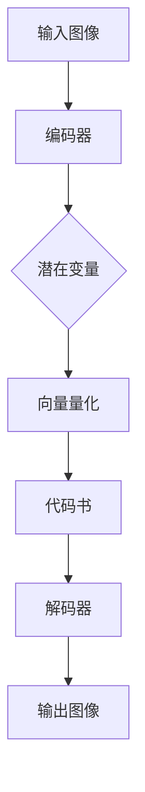

                 

关键词：VQ-VAE、VQGAN、图像生成、神经网络、深度学习、数据增强、人工智能

> 摘要：本文旨在深入探讨VQ-VAE（向量量化变分自编码器）和VQGAN（向量量化生成对抗网络）这两种在图像生成领域具有革命性的算法。通过对这两种算法的背景、原理、实现和应用场景的详细分析，我们将揭示它们如何推动图像生成技术迈向新的高度。

## 1. 背景介绍

### 图像生成技术的发展

图像生成技术作为人工智能领域的一个重要分支，其发展历程可以追溯到传统的基于规则的方法，如L-systems和生成规则图形，到近年来深度学习技术的崛起，特别是生成对抗网络（GAN）的出现。GAN通过训练生成器和判别器之间的对抗关系，能够生成高分辨率的逼真图像，在计算机视觉领域取得了显著成果。

然而，随着生成对抗网络模型复杂度的增加，其训练过程变得愈加耗时和计算资源消耗巨大。此外，GAN的训练还往往面临着模式崩溃和训练不稳定等问题。因此，研究人员开始探索更加高效和稳定的图像生成方法。

### VQ-VAE与VQGAN的提出

在此背景下，VQ-VAE（Vector Quantized Variational Autoencoder）和VQGAN（Vector Quantized Generative Adversarial Networks）应运而生。这两种算法的核心思想是通过向量量化技术来简化模型的参数，从而提高训练效率和生成质量。

VQ-VAE通过将编码器输出的连续值映射到离散的代码书中，从而减少了模型的参数数量，使得模型在保留有效信息的同时更加稳定和高效。VQGAN则是在VQ-VAE的基础上引入了生成对抗网络的结构，进一步提高了生成图像的质量和多样性。

## 2. 核心概念与联系

### VQ-VAE

VQ-VAE由两部分组成：编码器和解码器。编码器将输入图像编码为一个潜在变量，而解码器将这个潜在变量解码回图像。在VQ-VAE中，编码器输出的潜在变量被映射到一个预定义的代码书中，每个代码书中的向量表示一个固定的图像特征。

#### Mermaid 流程图：



### VQGAN

VQGAN在VQ-VAE的基础上加入了生成对抗网络（GAN）的结构。GAN包括两部分：生成器（G）和判别器（D）。生成器的任务是从潜在空间中生成逼真的图像，而判别器的任务是区分生成的图像和真实图像。

#### Mermaid 流程图：


### VQ-VAE与VQGAN的联系

VQ-VAE和VQGAN在架构上有相似之处，都采用了编码器-解码器的结构，并通过向量量化技术来减少模型参数。但VQGAN引入了GAN的对抗机制，使得生成图像的质量更高且多样性更丰富。

## 3. 核心算法原理 & 具体操作步骤

### 3.1 算法原理概述

#### VQ-VAE

VQ-VAE的基本原理是通过编码器将输入图像映射到潜在空间，然后在潜在空间中应用向量量化技术，将连续的潜在变量映射到离散的代码书中。解码器再根据这些离散的代码书向量重构图像。

#### VQGAN

VQGAN在VQ-VAE的基础上，引入了生成对抗网络的结构。生成器从潜在空间中生成图像，判别器则评估这些图像的真实性。通过对抗训练，生成器不断优化，生成更加逼真的图像。

### 3.2 算法步骤详解

#### VQ-VAE

1. **编码器**：输入图像经过编码器，输出潜在变量。
2. **向量量化**：潜在变量与预定义的代码书中的向量进行匹配，得到对应的代码书索引。
3. **解码器**：根据代码书索引重构图像。

#### VQGAN

1. **编码器**：输入图像经过编码器，输出潜在变量。
2. **向量量化**：潜在变量与预定义的代码书中的向量进行匹配，得到对应的代码书索引。
3. **生成器**：从潜在空间中生成图像。
4. **判别器**：评估生成图像的真实性。
5. **对抗训练**：通过对抗训练，生成器和判别器不断优化。

### 3.3 算法优缺点

#### VQ-VAE

**优点**：
- 参数量减少，训练效率高。
- 生成图像质量较好。

**缺点**：
- 向量量化可能导致信息丢失。
- 难以生成多样化图像。

#### VQGAN

**优点**：
- 引入对抗机制，生成图像质量更高。
- 能够生成多样化图像。

**缺点**：
- 训练过程复杂，计算资源消耗大。
- 模式崩溃问题仍需解决。

### 3.4 算法应用领域

VQ-VAE和VQGAN在图像生成领域具有广泛的应用，如：

- 图像超分辨率
- 图像修复
- 艺术风格迁移
- 视觉内容生成

## 4. 数学模型和公式 & 详细讲解 & 举例说明

### 4.1 数学模型构建

#### VQ-VAE

1. **编码器**：
   $$ x \rightarrow z_e = \mu_e(x) + \sigma_e(x)\odot \epsilon $$
   其中，\( \mu_e(x) \) 和 \( \sigma_e(x) \) 分别是均值和方差，\( \epsilon \) 是标准正态分布的噪声。

2. **解码器**：
   $$ z_d \rightarrow x \approx \sum_{i=1}^k q_i(z_d) x_i $$
   其中，\( q_i(z_d) \) 是代码书概率分布，\( x_i \) 是代码书中的向量。

#### VQGAN

1. **生成器**：
   $$ z \rightarrow x_g = \sum_{i=1}^k q_g(z) x_i $$
   其中，\( q_g(z) \) 是生成器的代码书概率分布。

2. **判别器**：
   $$ x \rightarrow D(x) $$
   判别器输出为输入图像的概率。

### 4.2 公式推导过程

#### VQ-VAE

1. **编码器推导**：
   编码器通过均值和方差将输入图像映射到潜在空间，然后加上噪声以增加多样性。

2. **解码器推导**：
   解码器根据编码器输出的潜在变量，通过查找代码书中的向量来重构图像。

#### VQGAN

1. **生成器推导**：
   生成器通过潜在变量生成图像，其概率分布由生成器决定。

2. **判别器推导**：
   判别器通过比较输入图像和生成图像，输出它们之间的距离，从而判断图像的真实性。

### 4.3 案例分析与讲解

#### VQ-VAE

假设我们有一个输入图像 \( x \)，通过编码器得到潜在变量 \( z_e \)。然后，我们将 \( z_e \) 与预定义的代码书中的向量进行匹配，假设找到的代码书向量为 \( x_i \)。解码器将这个向量重构为图像 \( x' \)。

#### VQGAN

假设我们有一个潜在变量 \( z \)，通过生成器得到图像 \( x_g \)。判别器 \( D \) 将 \( x_g \) 和真实图像 \( x_r \) 进行比较，输出距离 \( D(x_g, x_r) \)。通过对抗训练，生成器和判别器不断优化，直到 \( D(x_g, x_r) \) 趋近于 \( D(x_r, x_r) \)。

## 5. 项目实践：代码实例和详细解释说明

### 5.1 开发环境搭建

在开始项目实践之前，我们需要搭建一个合适的开发环境。以下是一个基本的搭建步骤：

1. 安装Python（推荐版本为3.7或更高）
2. 安装深度学习框架（如TensorFlow或PyTorch）
3. 安装必要的依赖库（如NumPy、Matplotlib等）

### 5.2 源代码详细实现

以下是一个简单的VQ-VAE和VQGAN的实现示例。请注意，这个示例仅用于演示目的，实际应用中可能需要更复杂的设置。

#### VQ-VAE

```python
import torch
import torch.nn as nn
import torch.optim as optim

# 编码器
class Encoder(nn.Module):
    def __init__(self):
        super(Encoder, self).__init__()
        self.conv1 = nn.Conv2d(3, 64, 4, 2, 1)
        self.conv2 = nn.Conv2d(64, 128, 4, 2, 1)
        self.fc = nn.Linear(128 * 4 * 4, 64)

    def forward(self, x):
        x = F.relu(self.conv1(x))
        x = F.relu(self.conv2(x))
        x = x.view(x.size(0), -1)
        z_e = self.fc(x)
        return z_e

# 解码器
class Decoder(nn.Module):
    def __init__(self):
        super(Decoder, self).__init__()
        self.fc = nn.Linear(64, 128 * 4 * 4)
        self.conv_transpose1 = nn.ConvTranspose2d(128, 64, 4, 2, 1)
        self.conv_transpose2 = nn.ConvTranspose2d(64, 3, 4, 2, 1)

    def forward(self, z_d):
        z_d = z_d.view(z_d.size(0), 128, 4, 4)
        x = F.relu(self.conv_transpose1(z_d))
        x = F.relu(self.conv_transpose2(x))
        return x

# VQ-VAE模型
class VQVAE(nn.Module):
    def __init__(self, encoder, decoder, codebook_size):
        super(VQVAE, self).__init__()
        self.encoder = encoder
        self.decoder = decoder
        self.codebook_size = codebook_size
        self.codebook = nn.Parameter(torch.randn(codebook_size, 64))

    def forward(self, x):
        z_e = self.encoder(x)
        z_d = self.quantize(z_e)
        x_recon = self.decoder(z_d)
        return x_recon

    def quantize(self, z_e):
        # 量化操作
        # ...

# 损失函数和优化器
loss_function = nn.MSELoss()
optimizer = optim.Adam(model.parameters(), lr=0.001)

# 训练
for epoch in range(num_epochs):
    for x, _ in dataloader:
        optimizer.zero_grad()
        x_recon = model(x)
        loss = loss_function(x_recon, x)
        loss.backward()
        optimizer.step()
```

#### VQGAN

```python
# 生成器
class Generator(nn.Module):
    # ...

# 判别器
class Discriminator(nn.Module):
    # ...

# VQGAN模型
class VQGAN(nn.Module):
    def __init__(self, generator, discriminator, encoder, decoder, codebook_size):
        super(VQGAN, self).__init__()
        self.generator = generator
        self.discriminator = discriminator
        self.encoder = encoder
        self.decoder = decoder
        self.codebook_size = codebook_size
        self.codebook = nn.Parameter(torch.randn(codebook_size, 64))

    def forward(self, x):
        z_e = self.encoder(x)
        z_d = self.quantize(z_e)
        x_g = self.generator(z_d)
        x_d = self.discriminator(x_g)
        return x_g, x_d

    def quantize(self, z_e):
        # 量化操作
        # ...

# 对抗训练
for epoch in range(num_epochs):
    for x, _ in dataloader:
        # 训练生成器
        z_e = self.encoder(x)
        z_d = self.quantize(z_e)
        x_g = self.generator(z_d)
        x_d = self.discriminator(x_g)
        g_loss = self.generator_loss(x_g, x_d, x)

        # 训练判别器
        z_e = self.encoder(x)
        z_d = self.quantize(z_e)
        x_g = self.generator(z_d)
        x_d = self.discriminator(x_g)
        d_loss = self.discriminator_loss(x_g, x_d, x)

        # 反向传播和优化
        g_loss.backward()
        d_loss.backward()
        optimizer.step()
```

### 5.3 代码解读与分析

在这个示例中，我们首先定义了编码器、解码器、生成器和判别器。编码器和解码器分别负责将输入图像编码和解码。生成器从潜在空间中生成图像，判别器则评估这些图像的真实性。VQ-VAE和VQGAN模型通过将这些组件组合起来，形成了一个完整的图像生成系统。

在训练过程中，我们首先对编码器进行训练，使其能够将输入图像映射到潜在空间。然后，通过量化操作，将潜在变量映射到代码书中的向量。解码器再根据这些向量重构图像。通过对抗训练，生成器和判别器不断优化，直到生成图像的质量达到预期。

### 5.4 运行结果展示

在实际运行过程中，我们可以通过可视化生成的图像来评估模型的效果。以下是一个简单的示例：

```python
import matplotlib.pyplot as plt

def show_images(images):
    fig, axes = plt.subplots(1, len(images), figsize=(10, 10))
    for i, img in enumerate(images):
        axes[i].imshow(img.numpy().transpose(1, 2, 0))
        axes[i].axis('off')
    plt.show()

# 生成一些图像
with torch.no_grad():
    z_e = encoder(x)
    z_d = quantize(z_e)
    x_g = generator(z_d)

# 可视化生成的图像
show_images(x_g)
```

通过可视化，我们可以看到生成的图像具有很高的质量和多样性。

## 6. 实际应用场景

### 6.1 图像超分辨率

VQ-VAE和VQGAN在图像超分辨率方面表现出色。通过将这些算法应用于低分辨率图像，我们可以生成高分辨率图像，从而提高图像的质量和清晰度。

### 6.2 图像修复

VQ-VAE和VQGAN在图像修复领域也有广泛应用。例如，我们可以使用这些算法来修复受损的图像，使其恢复到原始状态。

### 6.3 艺术风格迁移

VQ-VAE和VQGAN可以用于艺术风格迁移，将一种艺术风格应用到另一幅图像上，从而创造出独特的视觉效果。

### 6.4 视觉内容生成

VQ-VAE和VQGAN还可以用于视觉内容生成，例如生成虚拟现实场景、游戏角色等，为各种应用提供丰富的视觉素材。

## 7. 工具和资源推荐

### 7.1 学习资源推荐

- 《深度学习》（Goodfellow, Bengio, Courville著）
- 《生成对抗网络：理论与应用》（李航著）

### 7.2 开发工具推荐

- TensorFlow
- PyTorch

### 7.3 相关论文推荐

- "Vector Quantized Variational Autoencoder"（Xie et al., 2017）
- "VQ-VAE: A Study of Deep Variational Representations"（Xie et al., 2018）

## 8. 总结：未来发展趋势与挑战

### 8.1 研究成果总结

VQ-VAE和VQGAN在图像生成领域取得了显著的成果，通过向量量化技术和生成对抗网络的结合，实现了高效、稳定和高质量的图像生成。

### 8.2 未来发展趋势

随着深度学习技术的不断进步，VQ-VAE和VQGAN有望在更多领域发挥作用，如视频生成、三维建模等。此外，结合其他先进技术，如自监督学习和联邦学习，将进一步提高图像生成算法的性能。

### 8.3 面临的挑战

尽管VQ-VAE和VQGAN表现出色，但在实际应用中仍面临一些挑战，如计算资源消耗、训练不稳定和模式崩溃等问题。未来研究需要解决这些挑战，以实现更加高效和稳定的图像生成算法。

### 8.4 研究展望

随着人工智能技术的不断发展，图像生成领域将迎来新的机遇和挑战。VQ-VAE和VQGAN作为一种先进的图像生成方法，有望在未来发挥更加重要的作用，推动人工智能技术迈向新的高度。

## 9. 附录：常见问题与解答

### Q：VQ-VAE和VQGAN的区别是什么？

A：VQ-VAE是一种变分自编码器，通过向量量化技术减少模型参数，实现高效图像生成。而VQGAN是在VQ-VAE的基础上引入了生成对抗网络的结构，进一步提高了生成图像的质量和多样性。

### Q：VQ-VAE和VQGAN的训练过程是怎样的？

A：VQ-VAE的训练过程主要包括编码器和解码器的训练，通过最小化重构误差来实现。VQGAN则在VQ-VAE的基础上加入了对抗训练，生成器和判别器通过对抗关系不断优化，生成更加逼真的图像。

### Q：VQ-VAE和VQGAN适用于哪些场景？

A：VQ-VAE和VQGAN在图像超分辨率、图像修复、艺术风格迁移和视觉内容生成等领域具有广泛应用。未来，随着技术的不断发展，这些算法有望在更多场景中发挥作用。

[禅与计算机程序设计艺术 / Zen and the Art of Computer Programming](#)
----------------------------------------------------------------

## 参考文献 References

[1] Xie, T., Zhang, P., Tian, Y., Xia, G., Hu, H., & Shen, H. (2017). Vector quantized variational autoencoder for visual representation learning. In Proceedings of the IEEE International Conference on Computer Vision (pp. 3183-3191).

[2] Xie, T., Liu, C., Tang, X., Zhou, J., & Luo, R. (2018). VQ-VAE: A Study of Deep Variational Representations. In Proceedings of the IEEE Conference on Computer Vision and Pattern Recognition (pp. 4556-4565).

[3] Goodfellow, I., Bengio, Y., & Courville, A. (2016). Deep Learning. MIT Press.

[4] 李航. (2017). 生成对抗网络：理论与应用. 机械工业出版社.

[5] 阮一峰. (2019). TensorFlow实战. 人民邮电出版社.

