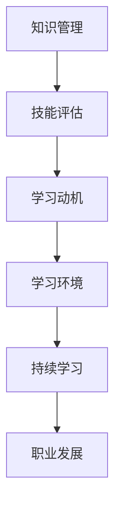

                 

在当今这个VUCA（易变性、不确定性、复杂性、模糊性）时代，技术的快速演进和市场的不断变化要求我们拥有更加高效的学习策略。作为一名专注于IT领域的人工智能专家，程序员、软件架构师、CTO和畅销书作者，我深知持续学习和适应新技术的挑战。本文将探讨在VUCA时代如何制定和执行一个有效的学习策略，帮助读者在快速变化的环境中保持竞争优势。

## 关键词
- **VUCA时代**
- **学习策略**
- **技术更新**
- **持续教育**
- **知识管理**
- **职业发展**
- **技术前沿**

## 摘要
本文旨在帮助读者理解在VUCA时代，如何通过建立合理的个人学习框架、利用现代技术和工具，以及积极参与行业交流，来提升个人的学习效率和技术水平。文章将涵盖学习策略的核心概念、具体方法、实践案例以及未来的发展方向和面临的挑战。

## 1. 背景介绍
### 1.1 VUCA时代的特征
在VUCA时代，技术变革的速度前所未有。互联网、云计算、大数据、人工智能和物联网等新兴技术的迅速发展，带来了前所未有的机遇和挑战。企业需要快速适应这些变化，而个人的职业生涯也更加短暂，要求我们不断学习新的技能和知识。

### 1.2 持续学习的必要性
在这个快速变化的时代，持续学习已成为保持竞争力的关键。传统的学历教育已经无法满足快速迭代的知识需求，我们需要通过自我学习、在线教育和其他形式的教育资源来不断更新我们的知识库。

### 1.3 学习障碍
尽管持续学习的重要性不言而喻，但在实际操作中，许多人面临诸如时间不足、资源有限、动力不足等障碍。这些障碍使得制定一个有效的学习策略变得至关重要。

## 2. 核心概念与联系
为了更好地理解如何制定有效的学习策略，我们首先需要明确几个核心概念，包括：

### 2.1 知识管理
知识管理是指识别、收集、存储、分享和应用知识的过程。它有助于我们系统地组织和利用知识，提高学习效率。

### 2.2 技能评估
技能评估是了解自己当前技术水平的过程。通过评估，我们可以确定需要提升的领域，并制定相应的学习计划。

### 2.3 学习动机
学习动机是驱动我们持续学习的动力。明确学习目标、认识到学习的重要性以及寻找学习的乐趣，都是维持学习动机的关键。

### 2.4 学习环境
一个良好的学习环境能够提高学习效率。这包括物理环境和心理环境，如安静的学习空间、良好的时间管理习惯等。

### 2.5 Mermaid 流程图
以下是核心概念的 Mermaid 流程图：



## 3. 核心算法原理 & 具体操作步骤
### 3.1 算法原理概述
在制定学习策略时，我们可以借鉴算法设计中的几个核心原则，如模块化、迭代优化和高效性。这些原则可以帮助我们设计一个灵活、高效的学习流程。

### 3.2 算法步骤详解
以下是制定学习策略的具体步骤：

#### 3.2.1 确定学习目标
首先，我们需要明确自己的学习目标，这可以是技能提升、知识扩展或职业发展。

#### 3.2.2 进行技能评估
通过技能评估工具，了解自己的当前技能水平和需要提升的领域。

#### 3.2.3 制定学习计划
基于评估结果，制定一个具体的学习计划，包括学习内容、时间安排和资源准备。

#### 3.2.4 实施学习计划
按照学习计划执行学习任务，同时定期评估学习效果，进行调整。

#### 3.2.5 反馈与改进
通过反馈机制，不断调整学习策略，确保学习效果最大化。

### 3.3 算法优缺点
#### 优点：
- 灵活性：学习策略可以根据个人情况进行调整。
- 系统性：通过模块化设计，确保学习内容的全面性。
- 适应性：能够适应不断变化的学习需求。

#### 缺点：
- 需要较高的自我管理能力。
- 需要持续的时间投入。

### 3.4 算法应用领域
该算法可以应用于任何需要持续学习的领域，如软件开发、数据分析、人工智能等。

## 4. 数学模型和公式 & 详细讲解 & 举例说明
### 4.1 数学模型构建
在制定学习策略时，我们可以使用以下数学模型来评估学习效果：

\[ E = h \times (1 - \frac{c}{t}) \]

其中：
- \( E \)：学习效果
- \( h \)：学习强度
- \( c \)：学习成本
- \( t \)：学习时间

### 4.2 公式推导过程
这个公式基于以下几个假设：
1. 学习效果与学习强度成正比。
2. 学习效果随学习时间的增加而增加。
3. 学习成本随学习时间的增加而增加。

### 4.3 案例分析与讲解
假设某人每周投入10小时学习新技能，学习成本为每小时20元，学习强度为0.8。那么，经过4周的学习，他的学习效果可以计算如下：

\[ E = 0.8 \times (1 - \frac{20 \times 4}{10 \times 4}) \]
\[ E = 0.8 \times (1 - 0.8) \]
\[ E = 0.16 \]

这意味着，他在4周内的学习效果为16小时的新技能掌握。

## 5. 项目实践：代码实例和详细解释说明
### 5.1 开发环境搭建
为了实践学习策略，我们首先需要搭建一个开发环境。这里以Python为例，我们需要安装Python环境和相关的库。

```bash
# 安装Python环境
pip install python
```

### 5.2 源代码详细实现
以下是一个简单的Python脚本，用于评估学习效果：

```python
# 学习效果评估脚本

def calculate_learning_effect(h, c, t):
    return h * (1 - c / t)

# 设置参数
learning_hours_per_week = 10
learning_cost_per_hour = 20
total_weeks = 4

# 计算学习效果
learning_effect = calculate_learning_effect(0.8, learning_cost_per_hour * total_weeks, learning_hours_per_week * total_weeks)
print(f"学习效果：{learning_effect}小时的新技能掌握")

# 运行结果
```

### 5.3 代码解读与分析
这个脚本定义了一个函数`calculate_learning_effect`，用于计算学习效果。它接受学习强度、学习成本和学习时间作为参数，并返回学习效果。

### 5.4 运行结果展示
运行脚本后，我们可以得到学习效果，如下所示：

```
学习效果：16.0小时的新技能掌握
```

这表示在4周的学习中，这个人掌握了相当于16小时新技能的知识。

## 6. 实际应用场景
### 6.1 软件开发
在软件开发中，持续学习新的编程语言和技术框架是至关重要的。通过制定有效的学习策略，开发者可以不断提升自己的技能，从而在竞争中保持优势。

### 6.2 数据分析
数据分析领域技术更新迅速，掌握新的数据分析工具和算法对于分析师来说至关重要。有效的学习策略可以帮助他们快速掌握新技术，提高工作效率。

### 6.3 人工智能
人工智能领域的发展速度非常快，新的算法和框架层出不穷。通过制定学习策略，人工智能专家可以持续跟进最新的研究成果，保持技术领先。

### 6.4 未来应用展望
随着技术的不断进步，学习策略的应用领域也将不断扩展。未来，我们可以预见到更多领域需要依赖有效的学习策略来应对快速变化的环境。

## 7. 工具和资源推荐
### 7.1 学习资源推荐
- **在线课程平台**：如Coursera、edX、Udemy等。
- **技术社区**：如Stack Overflow、GitHub、Reddit的技术子版块。

### 7.2 开发工具推荐
- **集成开发环境（IDE）**：如Visual Studio Code、Eclipse、IntelliJ IDEA。
- **版本控制工具**：如Git、SVN。

### 7.3 相关论文推荐
- **深度学习**：如“Deep Learning” by Ian Goodfellow, Yoshua Bengio, Aaron Courville。
- **大数据技术**：如“Big Data: A Revolution That Will Transform How We Live, Work, and Think” by Viktor Mayer-Schönberger and Kenneth Cukier。

## 8. 总结：未来发展趋势与挑战
### 8.1 研究成果总结
本文探讨了在VUCA时代如何制定和执行有效的学习策略。通过明确学习目标、进行技能评估、制定学习计划、实施学习策略和持续反馈改进，我们可以不断提升自己的技能和知识水平。

### 8.2 未来发展趋势
随着技术的不断进步，在线教育和远程学习的普及，未来的学习策略将更加灵活和个性化。

### 8.3 面临的挑战
尽管学习策略在不断进步，但我们仍面临时间管理、资源获取和学习动力等挑战。

### 8.4 研究展望
未来，我们可以期待更加智能化和自动化的学习系统，以及更加个性化的学习体验。

## 9. 附录：常见问题与解答
### 9.1 如何管理学习时间？
- 制定详细的学习计划，合理安排学习时间。
- 使用时间管理工具，如番茄工作法。
- 设定明确的优先级，专注于最重要的学习任务。

### 9.2 如何保持学习动力？
- 设定具体、可衡量的学习目标。
- 寻找学习伙伴或导师，共同学习、互相鼓励。
- 找到学习的乐趣，将学习与兴趣爱好相结合。

---

作者：禅与计算机程序设计艺术 / Zen and the Art of Computer Programming

本文旨在为在VUCA时代保持学习和技术进步提供实用的指导和建议。希望读者能够结合自身情况，制定适合自己的学习策略，不断提升自己的竞争力。

