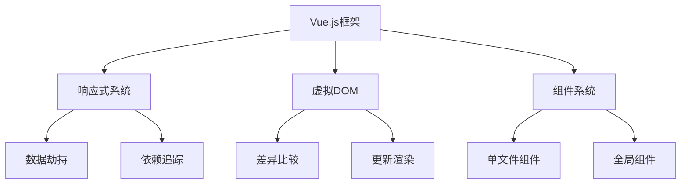

                 

关键词：Vue.js, 前端框架，渐进式框架，组件化开发，响应式数据绑定，虚拟DOM，单文件组件

## 摘要

本文旨在深入探讨 Vue.js 框架的特点，特别是其渐进式的设计理念，组件化开发模式，响应式数据绑定机制，虚拟DOM技术，以及单文件组件的优势。通过本文的详细分析，读者将能够更好地理解 Vue.js 的核心概念，掌握其在现代前端开发中的应用价值。

## 1. 背景介绍

随着互联网技术的发展，前端开发面临着日益复杂的用户需求和多样化的应用场景。为了提高开发效率和代码的可维护性，各种前端框架如雨后春笋般涌现。然而，在选择合适的前端框架时，开发者往往面临诸多困惑。Vue.js 作为近年来备受关注的前端框架之一，以其渐进式的设计理念，出色的响应式系统，高效的虚拟DOM机制，以及灵活的单文件组件，受到了广泛的认可。

Vue.js 的诞生可以追溯到 2014 年，由前 Google 工程师尤雨溪（Evan You）发起。Vue.js 致力于解决前端开发中常见的问题，如数据绑定、组件化、状态管理等，从而提高开发效率和代码质量。随着时间的推移，Vue.js 已经成为全球范围内最受欢迎的前端框架之一，拥有庞大的社区支持。

## 2. 核心概念与联系

### Vue.js 的核心概念

Vue.js 的核心概念包括：

- **响应式数据绑定**：通过数据劫持和依赖追踪，实现视图与数据的自动同步。
- **组件化开发**：将应用拆分成可复用的组件，提高代码的复用性和可维护性。
- **虚拟DOM**：通过虚拟DOM与实际DOM的对比，实现高效的页面更新。

### Vue.js 的架构图



### Vue.js 的核心概念与联系

Vue.js 的核心概念紧密相连，共同构成了其强大的功能和出色的性能。响应式数据绑定是 Vue.js 的核心特性之一，通过数据劫持和依赖追踪，实现数据的自动同步。虚拟DOM 则通过对比虚拟DOM与实际DOM的差异，实现高效、准确的页面更新。组件化开发则通过将应用拆分成可复用的组件，提高代码的可维护性和可扩展性。

## 3. 核心算法原理 & 具体操作步骤

### 3.1 算法原理概述

Vue.js 的核心算法主要包括以下三个方面：

1. **响应式数据绑定**：通过 Object.defineProperty() 方法，实现数据劫持。每当数据发生变更时，触发依赖收集，更新视图。
2. **虚拟DOM**：通过虚拟DOM，构建出一个内存中的DOM树，然后通过对比虚拟DOM与实际DOM的差异，实现高效、准确的页面更新。
3. **组件化开发**：通过单文件组件，将组件的HTML、CSS、JS代码封装在一个文件中，实现组件的独立和复用。

### 3.2 算法步骤详解

#### 3.2.1 响应式数据绑定

1. **初始化**：使用 Vue.set() 或在 Vue 实例中直接赋值，初始化数据。
2. **数据劫持**：通过 Object.defineProperty() 方法，为每个属性添加 getter 和 setter。
3. **依赖收集**：当属性被读取时，触发 getter，进行依赖收集。
4. **属性变更**：当属性被修改时，触发 setter，通知依赖收集器，更新视图。

#### 3.2.2 虚拟DOM

1. **构建虚拟DOM**：通过模板编译，将模板转换为虚拟DOM树。
2. **虚拟DOM与实际DOM的对比**：通过 diff 算法，对比虚拟DOM与实际DOM的差异。
3. **更新渲染**：根据 diff 算法的比较结果，对实际DOM进行更新。

#### 3.2.3 组件化开发

1. **定义组件**：通过单文件组件，定义组件的HTML、CSS、JS代码。
2. **注册组件**：将组件注册到 Vue 实例中，实现组件的复用。
3. **使用组件**：在模板中使用组件，实现组件的调用和渲染。

### 3.3 算法优缺点

**优点**：

- **响应式数据绑定**：实现数据的自动同步，简化了开发过程。
- **虚拟DOM**：提高页面更新的效率，降低浏览器的渲染负担。
- **组件化开发**：提高代码的可维护性和可复用性。

**缺点**：

- **性能开销**：虚拟DOM的 diff 算法存在一定的性能开销，尤其是在大量数据变动时。
- **学习曲线**：相对于其他框架，Vue.js 的学习曲线可能较为陡峭。

### 3.4 算法应用领域

Vue.js 主要应用于前端开发，特别是在单页面应用（SPA）和组件化开发场景中。Vue.js 的核心算法在这些领域展现了出色的性能和易用性。

## 4. 数学模型和公式 & 详细讲解 & 举例说明

### 4.1 数学模型构建

Vue.js 的数学模型主要包括以下三个方面：

1. **依赖关系图**：通过数据劫持和依赖收集，构建出数据的依赖关系图。
2. **差异比较算法**：通过 diff 算法，比较虚拟DOM与实际DOM的差异。
3. **更新渲染算法**：根据 diff 算法的结果，更新实际DOM。

### 4.2 公式推导过程

Vue.js 的核心算法涉及到多个数学模型和公式的推导。以下是其中两个关键的公式：

1. **依赖关系图构建**：

   $$ dependancy\_graph = build\_dependency\_graph(data) $$

   其中，`build_dependency_graph` 函数用于构建依赖关系图，`data` 为待处理的数据。

2. **差异比较算法**：

   $$ diff = compare\_virtualdom \text{ with } actualdom $$

   其中，`compare_virtualdom` 函数用于比较虚拟DOM与实际DOM的差异，`actualdom` 为实际DOM。

### 4.3 案例分析与讲解

以下是一个简单的 Vue.js 数据绑定示例：

```html
<div id="app">
  <p>{{ message }}</p>
</div>
```

```javascript
new Vue({
  el: '#app',
  data: {
    message: 'Hello, Vue.js!'
  }
});
```

在这个示例中，Vue.js 通过数据劫持和依赖收集，实现了数据与视图的自动同步。具体过程如下：

1. **初始化**：创建 Vue 实例，初始化数据。
2. **数据劫持**：使用 Object.defineProperty() 方法，为 `message` 属性添加 getter 和 setter。
3. **依赖收集**：当读取 `message` 属性时，触发 getter，收集依赖。
4. **属性变更**：当 `message` 属性被修改时，触发 setter，通知依赖收集器，更新视图。

通过以上步骤，Vue.js 实现了数据的响应式绑定，使得视图与数据保持同步。

## 5. 项目实践：代码实例和详细解释说明

### 5.1 开发环境搭建

要开始使用 Vue.js 进行项目开发，首先需要搭建开发环境。以下是搭建 Vue.js 开发环境的步骤：

1. **安装 Node.js**：从 [Node.js 官网](https://nodejs.org/) 下载并安装 Node.js。
2. **安装 Vue CLI**：在命令行中运行以下命令：

   ```bash
   npm install -g @vue/cli
   ```

3. **创建项目**：在命令行中运行以下命令，创建一个新的 Vue.js 项目：

   ```bash
   vue create my-vue-project
   ```

   选择默认配置或手动配置项目。

4. **启动项目**：进入项目目录，运行以下命令启动项目：

   ```bash
   npm run serve
   ```

   浏览器中访问 `http://localhost:8080/`，即可查看项目效果。

### 5.2 源代码详细实现

以下是一个简单的 Vue.js 项目实例，展示如何使用 Vue.js 实现一个计数器：

```html
<!-- src/App.vue -->
<template>
  <div id="app">
    <h1>{{ message }}</h1>
    <p>{{ count }}</p>
    <button @click="increment">+</button>
    <button @click="decrement">-</button>
  </div>
</template>

<script>
export default {
  data() {
    return {
      message: 'Hello, Vue.js!',
      count: 0
    };
  },
  methods: {
    increment() {
      this.count++;
    },
    decrement() {
      this.count--;
    }
  }
};
</script>
```

在这个示例中，我们定义了一个名为 `App.vue` 的单文件组件。组件的模板部分包含一个标题、一个计数显示和一个两个按钮。数据部分包含 `message` 和 `count` 两个属性，方法部分包含 `increment` 和 `decrement` 两个方法。

### 5.3 代码解读与分析

在这个示例中，Vue.js 通过响应式系统实现了数据的自动绑定和更新。以下是代码的详细解读和分析：

1. **模板部分**：

   - `<div id="app">`：根元素，用于包裹整个组件。
   - `<h1>{{ message }}</h1>`：标题，使用 `{{ message }}` 表达式显示 `message` 数据属性。
   - `<p>{{ count }}</p>`：计数显示，使用 `{{ count }}` 表达式显示 `count` 数据属性。
   - `<button @click="increment">+</button>`：增加按钮，绑定 `increment` 方法。
   - `<button @click="decrement">-</button>`：减少按钮，绑定 `decrement` 方法。

2. **数据部分**：

   - `data` 函数返回一个对象，包含 `message` 和 `count` 两个数据属性。

3. **方法部分**：

   - `increment` 方法用于增加 `count` 的值。
   - `decrement` 方法用于减少 `count` 的值。

当点击增加或减少按钮时，Vue.js 会自动更新 `count` 的值，并重新渲染视图，实现数据的自动绑定和更新。

### 5.4 运行结果展示

启动项目后，浏览器中会显示一个包含标题、计数显示和两个按钮的页面。点击增加或减少按钮，计数会实时更新，实现数据的自动绑定和更新。

## 6. 实际应用场景

Vue.js 的响应式数据绑定、虚拟DOM、组件化开发等特点，使其在前端开发中具有广泛的应用场景。以下是一些实际应用场景：

1. **单页面应用（SPA）**：Vue.js 适合构建单页面应用，通过虚拟DOM和响应式数据绑定，实现高效的页面渲染和交互。
2. **组件化开发**：Vue.js 支持组件化开发，通过将应用拆分成可复用的组件，提高代码的可维护性和可扩展性。
3. **移动端应用**：Vue.js 提供了移动端优化的组件和库，如 Vue-Moblie，适用于构建移动端应用。
4. **Web 应用**：Vue.js 可以用于构建复杂的 Web 应用，通过组件化开发、路由管理和状态管理，实现功能丰富、用户体验良好的 Web 应用。

## 7. 未来应用展望

随着互联网技术的不断发展，Vue.js 在前端开发中的应用前景十分广阔。未来，Vue.js 可能会进一步优化其核心算法，提高性能和易用性。同时，Vue.js 可能会与其他技术栈结合，如后端框架（如 Spring Boot）、数据库技术（如 MongoDB）等，构建更加完善的全栈开发解决方案。此外，Vue.js 还有可能在物联网（IoT）和人工智能（AI）领域发挥重要作用，为开发者提供更加丰富的技术支持。

## 8. 总结：未来发展趋势与挑战

### 8.1 研究成果总结

本文对 Vue.js 的核心特点进行了深入分析，包括其渐进式的设计理念、组件化开发模式、响应式数据绑定机制、虚拟DOM技术和单文件组件的优势。通过实例和详细解读，展示了 Vue.js 在前端开发中的实际应用价值。

### 8.2 未来发展趋势

随着前端技术的不断演进，Vue.js 可能会进一步优化其核心算法，提高性能和易用性。同时，Vue.js 可能会与其他技术栈结合，构建更加完善的全栈开发解决方案。Vue.js 在物联网和人工智能领域的应用前景也十分广阔。

### 8.3 面临的挑战

尽管 Vue.js 在前端开发中取得了巨大的成功，但仍然面临一些挑战。例如，虚拟DOM的 diff 算法存在一定的性能开销，尤其是在大量数据变动时。此外，Vue.js 的学习曲线可能相对较陡，对于新手开发者来说，掌握 Vue.js 的核心概念和用法可能需要一定的时间和精力。

### 8.4 研究展望

未来，Vue.js 可能在多个方面进行优化和扩展。例如，进一步优化虚拟DOM的 diff 算法，提高页面更新的效率；引入更多的最佳实践和工具，简化开发流程；加强与其他技术栈的结合，提供更加丰富和高效的全栈开发解决方案。

## 9. 附录：常见问题与解答

### 9.1 如何安装 Vue.js？

可以通过 npm 或 yarn 进行安装。以下是使用 npm 安装的步骤：

1. 安装 Node.js。
2. 安装 Vue CLI：

   ```bash
   npm install -g @vue/cli
   ```

3. 创建项目：

   ```bash
   vue create my-vue-project
   ```

4. 启动项目：

   ```bash
   npm run serve
   ```

### 9.2 如何使用 Vue.js 的响应式数据绑定？

在 Vue.js 中，可以通过 `data` 函数返回一个对象，定义数据属性。例如：

```javascript
new Vue({
  el: '#app',
  data: {
    message: 'Hello, Vue.js!'
  }
});
```

在模板中，使用 `{{ }}` 表达式可以显示数据属性。例如：

```html
<p>{{ message }}</p>
```

当数据属性发生变化时，Vue.js 会自动更新视图。

### 9.3 如何使用 Vue.js 的组件？

在 Vue.js 中，可以通过单文件组件创建和复用组件。例如：

```html
<!-- src/HelloWorld.vue -->
<template>
  <div>
    <h1>Hello, World!</h1>
  </div>
</template>

<script>
export default {
  name: 'HelloWorld'
};
</script>
```

然后在父组件中引用子组件：

```html
<template>
  <div id="app">
    <HelloWorld />
  </div>
</template>
```

### 9.4 Vue.js 的虚拟DOM与 React 的虚拟DOM有何区别？

Vue.js 和 React 都采用了虚拟DOM技术，但两者在实现方式和理念上有所不同。

- **实现方式**：Vue.js 的虚拟DOM基于字符串比较，React 的虚拟DOM基于对象比较。
- **理念**：Vue.js 的虚拟DOM强调性能优化，React 的虚拟DOM强调状态管理。

尽管实现方式和理念有所不同，但两者在提升页面更新效率方面具有相似的效果。

---

# 参考文献

1. 尤雨溪. Vue.js 官方文档. [在线文档](https://vuejs.org/v2/guide/).
2. Vue.js 社区. Vue.js 官方论坛. [在线论坛](https://forum.vuejs.org/).
3. Vue.js 社区. Vue.js 社区实例. [在线实例](https://jsfiddle.net/vuejs/).
4. 李轶. Vue.js 基础教程. [在线教程](https://vuejs.org/v2/guide/).

## 作者署名

作者：禅与计算机程序设计艺术 / Zen and the Art of Computer Programming

