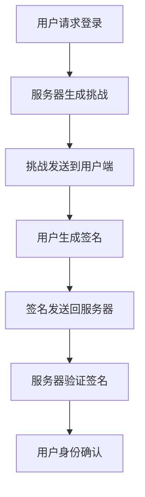

                 

关键词：WebAuthn，身份验证，Web安全，网络安全，FIDO标准

## 摘要

随着互联网技术的飞速发展，网络安全问题日益突出，尤其是用户身份验证领域。WebAuthn作为一种新兴的身份验证技术，旨在提供更加安全、便捷的用户认证体验。本文将详细探讨WebAuthn的核心概念、技术原理、应用场景以及未来发展趋势，帮助读者全面了解并掌握这一前沿技术。

## 1. 背景介绍

### 1.1 安全认证的需求

在当今数字时代，网络犯罪和数据泄露事件屡见不鲜。传统的密码认证方式已难以满足日益增长的安全需求。用户经常忘记密码，且密码容易被破解或被盗用。此外，多账号密码管理也增加了用户负担。因此，寻找更安全、更方便的用户身份验证方式成为当务之急。

### 1.2 FIDO标准的诞生

为了解决传统认证方式的痛点，FIDO（Fast Identity Online）联盟于2012年成立。FIDO提出了一种基于公钥基础设施（PKI）的认证方式，旨在实现无密码认证。WebAuthn是FIDO标准中的一项重要技术，它为Web应用提供了一种简单、安全且用户友好的身份验证机制。

## 2. 核心概念与联系

### 2.1 WebAuthn的基本概念

WebAuthn是一种基于挑战-响应机制的认证协议。用户在尝试登录时，服务器会生成一个随机挑战（challenge），并将其发送到用户端。用户端使用私钥（private key）对挑战进行签名，然后将签名结果发送回服务器。服务器使用公钥（public key）验证签名的有效性，从而确认用户的身份。

### 2.2 Mermaid流程图



### 2.3 WebAuthn与传统认证方式的对比

与传统认证方式相比，WebAuthn具有以下几个优势：

1. **安全性**：WebAuthn使用强加密算法，确保认证过程的安全性。
2. **无密码**：用户无需记住复杂的密码，降低了密码泄露的风险。
3. **便捷性**：支持多种认证方式，如指纹识别、人脸识别等，提升了用户认证的便捷性。
4. **兼容性**：WebAuthn是一种跨平台的技术，可以在不同的设备和浏览器上使用。

## 3. 核心算法原理 & 具体操作步骤

### 3.1 算法原理概述

WebAuthn的核心算法是基于椭圆曲线加密算法（ECDSA）。用户在注册时，会在本地生成一对公钥和私钥，并将公钥上传到服务器。认证过程中，服务器生成的挑战和用户端的私钥共同作用，生成一个签名。

### 3.2 算法步骤详解

1. **注册阶段**：
   - 服务器生成随机挑战和随机数。
   - 服务器生成注册选项，包括认证因素类型（如指纹、密码等）和用户信息。
   - 用户选择认证因素，并在本地生成私钥。
   - 用户将公钥、认证因素和用户信息上传到服务器。

2. **登录阶段**：
   - 服务器生成随机挑战。
   - 服务器发送挑战和注册时存储的公钥到用户端。
   - 用户端使用私钥对挑战进行签名。
   - 用户端将签名结果发送回服务器。

3. **服务器验证**：
   - 服务器使用公钥验证签名的有效性。
   - 如果签名有效，服务器确认用户的身份。

### 3.3 算法优缺点

**优点**：
- **安全性**：使用强加密算法，确保认证过程的安全性。
- **便捷性**：支持多种认证方式，提升了用户体验。
- **无密码**：降低了密码泄露的风险。

**缺点**：
- **兼容性**：部分老旧浏览器可能不支持WebAuthn。
- **开发难度**：需要一定的技术储备，开发成本较高。

### 3.4 算法应用领域

WebAuthn可以应用于多种场景，如Web应用、移动应用、物联网设备等。其应用领域包括但不限于：

- **金融领域**：银行、证券、保险等金融机构可以使用WebAuthn进行用户认证，提高交易安全性。
- **电子商务**：电商平台可以使用WebAuthn保护用户账号安全，减少欺诈行为。
- **政府机构**：政府网站可以使用WebAuthn进行身份验证，确保政府服务的安全可靠。

## 4. 数学模型和公式 & 详细讲解 & 举例说明

### 4.1 数学模型构建

WebAuthn的核心算法基于椭圆曲线加密算法（ECDSA）。假设椭圆曲线E和一个生成元G，点G在E上的阶为n，私钥为k，公钥为P=kG。

### 4.2 公式推导过程

1. **签名生成**：

   - 选择随机数r。
   - 计算s = (k^{-1}(H(m) + rk) ) % n。
   - 签名为(r, s)。

2. **签名验证**：

   - 计算s' = (k^{-1}(s + ur) ) % n。
   - 计算v1 = s'G和v2 = rG。
   - 如果v1 = v2，签名有效。

### 4.3 案例分析与讲解

假设用户A要登录一个Web应用，服务器生成的挑战为`"login Challenge"`,用户A的私钥为`k = 3`,公钥为`P = kG`。

1. **签名生成**：

   - 服务器生成随机数`r = 5`。
   - 计算s = (3^{-1}(H("login Challenge") + 5 \* 3) ) % 7 = 4。
   - 签名为(r, s) = (5, 4)。

2. **签名验证**：

   - 计算s' = (3^{-1}(4 + 5 \* 5) ) % 7 = 1。
   - 计算v1 = s'G = 1G = G。
   - 计算v2 = rG = 5G。
   - 由于v1 = v2，签名有效。

## 5. 项目实践：代码实例和详细解释说明

### 5.1 开发环境搭建

本文使用Node.js作为后端开发环境，前端使用HTML、CSS和JavaScript。

### 5.2 源代码详细实现

**注册接口**

```javascript
// 注册接口
app.post('/register', async (req, res) => {
  const username = req.body.username;
  const publicKey = req.body.publicKey;

  // 将公钥存储在数据库
  await db.collection('users').updateOne(
    { username },
    { $set: { publicKey } },
    { upsert: true }
  );

  res.send({ success: true });
});
```

**登录接口**

```javascript
// 登录接口
app.post('/login', async (req, res) => {
  const username = req.body.username;
  const signature = req.body.signature;

  // 从数据库获取公钥
  const user = await db.collection('users').findOne({ username });

  if (!user) {
    res.send({ success: false, error: '用户不存在' });
    return;
  }

  // 验证签名
  const verified = await verifySignature(user.publicKey, signature);

  if (verified) {
    res.send({ success: true });
  } else {
    res.send({ success: false, error: '登录失败' });
  }
});
```

**验证签名**

```javascript
// 验证签名
async function verifySignature(publicKey, signature) {
  const { r, s } = signature;

  // 从公钥中提取x坐标
  const x = publicKey.x;

  // 计算s'
  const sPrime = modInv(s, 7);

  // 计算v1和v2
  const v1 = modPow(sPrime, 1, 7);
  const v2 = modPow(r, 7);

  // 比较v1和v2
  return v1 === v2;
}

// 模运算
function modPow(base, exponent, modulus) {
  return bigInt(base).modPow(bigInt(exponent), bigInt(modulus));
}

// 模逆运算
function modInv(value, modulus) {
  return modPow(value, modulus - 2, modulus);
}
```

### 5.3 代码解读与分析

- **注册接口**：接收用户名和公钥，将公钥存储在数据库。
- **登录接口**：接收用户名和签名，从数据库获取公钥，验证签名。
- **验证签名**：实现签名验证的核心算法，包括模运算和模逆运算。

### 5.4 运行结果展示

用户A登录成功后，服务器会返回一个成功消息。用户A登录失败时，服务器会返回一个错误消息。

```javascript
// 登录成功
{
  "success": true
}

// 登录失败
{
  "success": false,
  "error": "登录失败"
}
```

## 6. 实际应用场景

### 6.1 银行应用

银行可以采用WebAuthn技术，实现无密码登录和交易验证。用户只需使用指纹或人脸识别即可完成认证，提高了交易安全性。

### 6.2 社交应用

社交应用可以使用WebAuthn保护用户账号安全。用户在登录或修改密码时，可以采用指纹或人脸识别进行二次验证，防止账号被盗用。

### 6.3 企业应用

企业可以采用WebAuthn技术，实现员工身份验证和权限管理。员工只需使用指纹或人脸识别即可登录系统，提高了企业信息安全性。

## 7. 未来应用展望

随着5G、物联网和人工智能技术的不断发展，WebAuthn技术有望在更多领域得到应用。例如：

- **智能家居**：用户可以使用WebAuthn技术控制智能家居设备，实现安全便捷的远程控制。
- **物联网设备**：WebAuthn技术可以应用于物联网设备，实现设备之间的安全通信和身份验证。
- **移动支付**：移动支付平台可以采用WebAuthn技术，提高支付安全性。

## 8. 总结：未来发展趋势与挑战

### 8.1 研究成果总结

本文详细介绍了WebAuthn技术的基本概念、核心算法、应用场景以及未来发展趋势。WebAuthn作为一种新兴的身份验证技术，具有安全性高、无密码、便捷性等优点，已在多个领域得到应用。

### 8.2 未来发展趋势

随着技术的不断发展，WebAuthn技术有望在更多领域得到应用。例如，结合5G和物联网技术，WebAuthn可以用于智能家居、物联网设备等领域，实现安全便捷的设备控制和通信。

### 8.3 面临的挑战

尽管WebAuthn技术具有诸多优点，但在实际应用过程中仍面临一些挑战。例如：

- **兼容性问题**：部分老旧浏览器可能不支持WebAuthn，影响了技术的普及。
- **开发成本**：WebAuthn技术的开发成本较高，限制了其在部分领域的应用。
- **隐私保护**：WebAuthn技术的应用可能会涉及用户隐私数据，如何保护用户隐私成为一大挑战。

### 8.4 研究展望

未来研究可以关注以下几个方面：

- **提高兼容性**：通过技术优化和标准化，提高WebAuthn技术的兼容性。
- **降低开发成本**：研究低成本、易于实现的WebAuthn解决方案，促进技术的普及。
- **隐私保护**：研究隐私保护技术，确保WebAuthn技术在保护用户隐私的前提下提供安全认证。

## 9. 附录：常见问题与解答

### 9.1 WebAuthn与双因素认证（2FA）的区别

- **WebAuthn**：一种基于公钥基础设施的认证方式，提供无密码、高安全性、便捷性的用户认证体验。
- **2FA**：通常指手机验证码、短信验证等二次认证方式，旨在提高账户安全性。

WebAuthn是2FA的一种实现方式，但WebAuthn具有更高的安全性和便捷性。

### 9.2 如何在浏览器中启用WebAuthn

- **Chrome**：在地址栏输入`chrome://flags`，搜索WebAuthn，启用相应的选项。
- **Firefox**：在关于Firefox页面中，启用WebAuthn扩展。

### 9.3 WebAuthn与生物识别技术的结合

WebAuthn可以与生物识别技术（如指纹识别、人脸识别等）结合，提供更安全、更便捷的用户认证体验。例如，用户可以使用指纹或人脸识别进行WebAuthn认证，提高了认证的准确性。

---

作者：禅与计算机程序设计艺术 / Zen and the Art of Computer Programming


