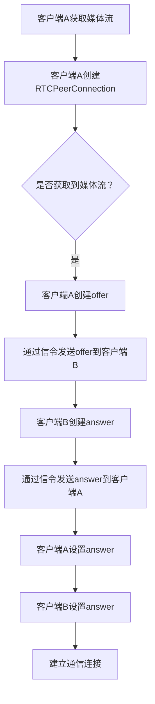

                 

### 1. 背景介绍

WebRTC（Web Real-Time Communication）是一种支持网页浏览器进行实时语音对话或视频聊天的技术。它的出现极大地改变了互联网通信的格局，使得开发者能够无需复杂的配置和硬件支持，就能实现高效的实时通信。

WebRTC的历史可以追溯到2011年，当时Google提出了WebRTC的构想，并迅速得到了业界广泛的支持。随后，WebRTC成为了HTML5标准的一部分。目前，几乎所有主流浏览器都支持WebRTC，包括Chrome、Firefox、Safari和Edge等。

实时通信在当今的互联网应用中扮演着重要的角色。无论是在线教育、远程工作、社交网络，还是实时游戏和视频会议，WebRTC都提供了强大的支持。随着5G技术的普及和物联网的发展，WebRTC的应用场景将更加广泛。

本文将深入探讨WebRTC的技术原理、实现步骤、数学模型以及实际应用，旨在为读者提供一个全面、系统的理解。文章还将推荐一些学习资源、开发工具和经典论文，帮助读者更好地掌握这一技术。

## 1.1 WebRTC的兴起与发展

WebRTC的出现，解决了传统网页通信的一个重大难题——实时性。在WebRTC之前，网页通信通常依赖于基于HTTP的请求-响应模式，这种方式虽然简单易用，但在处理实时通信时存在显著缺陷。例如，视频聊天中的延迟问题、音频通话中的丢包问题等。

WebRTC通过引入一套全新的协议和API，使得浏览器能够直接进行P2P（点对点）通信，从而极大地提升了通信的实时性和稳定性。WebRTC的核心协议包括STUN（Session Traversal Utilities for NAT）、TURN（Traversal Using Relays around NAT）和ICE（Interactive Connectivity Establishment）。这些协议共同工作，帮助浏览器穿越NAT（网络地址转换）和防火墙，实现端到端的通信。

WebRTC的发展历程中，有几个重要的事件值得注意。首先是Google在2011年推出WebRTC，这是WebRTC诞生的标志。随后，WebRTC逐渐被其他浏览器厂商支持，如Mozilla和苹果。2015年，WebRTC正式成为HTML5标准的一部分，这进一步巩固了WebRTC在互联网通信中的地位。

随着WebRTC技术的成熟和应用场景的扩展，越来越多的企业和开发者开始采用WebRTC技术。例如，微软的Skype for Web、Google的Hangouts和Facebook的Messenger都使用了WebRTC技术来实现实时通信。此外，WebRTC还被广泛应用于在线教育、医疗健康、金融服务等领域。

## 1.2 实时通信的需求与挑战

实时通信的需求源于人们对于即时互动的渴望。在当今快节奏的社会，无论是个人还是企业，都希望能够在第一时间获得信息并做出反应。实时通信提供了这种即时性，使得信息传递更加迅速、高效。

实时通信的挑战主要体现在以下几个方面：

1. **网络延迟**：实时通信要求信息在发送和接收之间有极小的延迟。网络延迟过高会导致通信体验不佳，甚至无法进行正常的交流。
2. **网络抖动**：网络抖动指的是网络传输过程中数据包到达时间的随机性。网络抖动会导致通信过程中的数据包丢失或重复，影响通信质量。
3. **带宽限制**：带宽是实时通信的重要资源。在有限的带宽条件下，如何合理分配带宽，保证通信质量，是一个重要问题。
4. **防火墙和NAT**：防火墙和NAT是网络安全的保障，但它们也会对通信产生阻碍。传统的通信方式往往需要复杂的配置来解决这些问题，而WebRTC通过STUN、TURN和ICE协议，使得浏览器能够自动穿越这些障碍。

WebRTC通过一系列技术手段，解决了上述挑战，实现了高效、稳定的实时通信。例如，WebRTC采用了NAT穿透技术，使得浏览器能够直接进行P2P通信，无需依赖中继服务器。此外，WebRTC还采用了自适应码流技术，根据网络状况动态调整视频和音频的编码质量，保证了通信质量。

## 1.3 WebRTC的核心概念

WebRTC的核心概念主要包括媒体流（Media Stream）、数据通道（Data Channel）和信令（Signaling）。这些概念共同构成了WebRTC通信的基础。

### 媒体流（Media Stream）

媒体流是WebRTC通信的核心组成部分，包括视频流和音频流。媒体流可以来自摄像头、麦克风等硬件设备，也可以通过其他方式获取。在WebRTC中，媒体流通过`navigator.mediaDevices.getUserMedia()`接口进行获取。

例如，以下代码可以获取用户的视频和音频流：

```javascript
navigator.mediaDevices.getUserMedia({ video: true, audio: true })
    .then(stream => {
        // 将流传递给视频元素或其他处理模块
        videoElement.srcObject = stream;
    })
    .catch(error => {
        // 处理获取流失败的情况
    });
```

### 数据通道（Data Channel）

数据通道是WebRTC通信中用于传输文本、二进制数据等非媒体数据的通道。数据通道基于WebSocket协议实现，具有可靠传输、顺序保证等特点。

创建数据通道的代码如下：

```javascript
const config = { 'iceServers': [{ 'urls': 'stun:stun.l.google.com:19302' }] };
const peerConnection = new RTCPeerConnection(config);

const dataChannel = peerConnection.createDataChannel('dataChannel', {});
dataChannel.onopen = event => {
    console.log('Data channel opened');
};
dataChannel.onmessage = event => {
    console.log('Received message:', event.data);
};
peerConnection.createOffer()
    .then(offer => peerConnection.setLocalDescription(offer))
    .then(() => {
        // 发送offer到对端
    });
```

### 信令（Signaling）

信令是WebRTC通信中用于交换控制信息的机制。信令通常通过WebSocket或HTTP协议传输，用于交换offer、answer、ICE候选等控制信息。

以下是一个简单的信令过程：

1. **客户端A**创建一个`RTCPeerConnection`，并获取媒体流。
2. **客户端A**创建offer，并通过信令发送到**客户端B**。
3. **客户端B**接收offer，并创建answer，通过信令发送回**客户端A**。
4. **客户端A**接收answer，并设置到本地`RTCPeerConnection`上。
5. **客户端B**接收answer，并设置到本地`RTCPeerConnection`上。

信令的过程可以简化为以下伪代码：

```javascript
// 客户端A
const pc = new RTCPeerConnection(config);
pc.addStream(localStream);
pc.createOffer().then(offer => {
    pc.setLocalDescription(offer);
    // 通过信令发送offer
}).then(() => {
    // 接收answer并设置到本地
    onReceiveAnswer(answer);
});

// 客户端B
const pc = new RTCPeerConnection(config);
pc.addStream(localStream);
pc.onanswerstream = event => {
    // 处理answer流
};
// 通过信令接收offer并创建answer
onReceiveOffer(offer).then(answer => {
    pc.setRemoteDescription(offer);
    pc.setLocalDescription(answer);
    // 通过信令发送answer
});
```

通过理解媒体流、数据通道和信令这三个核心概念，开发者可以更好地理解WebRTC的工作原理，为后续的实现打下坚实的基础。

### 1.4 文章结构概述

本文将从以下几个方面对WebRTC技术进行深入探讨：

1. **背景介绍**：介绍WebRTC的起源、发展历程和实时通信的需求与挑战。
2. **核心概念与联系**：详细阐述WebRTC的核心概念，包括媒体流、数据通道和信令。
3. **核心算法原理 & 具体操作步骤**：讲解WebRTC的核心算法原理，包括STUN、TURN和ICE协议，以及具体的实现步骤。
4. **数学模型和公式 & 详细讲解 & 举例说明**：介绍WebRTC中的数学模型和公式，并通过实际案例进行详细讲解。
5. **项目实践：代码实例和详细解释说明**：提供WebRTC的实际代码实例，并对其进行详细解释和分析。
6. **实际应用场景**：分析WebRTC在各个领域的实际应用，以及未来的应用前景。
7. **工具和资源推荐**：推荐学习资源、开发工具和经典论文。
8. **总结：未来发展趋势与挑战**：总结研究成果，探讨未来发展趋势和面临的挑战。

通过本文的阅读，读者将全面了解WebRTC技术，掌握其核心原理和应用方法。

### 2. 核心概念与联系

在深入探讨WebRTC的核心技术之前，我们需要先理解几个关键概念，这些概念共同构成了WebRTC的技术基础。

#### 媒体流（Media Stream）

媒体流是WebRTC通信中最基本的数据流，它包括视频流和音频流。媒体流可以从用户的摄像头、麦克风等硬件设备获取，也可以通过其他方式获取。在WebRTC中，媒体流是通过`navigator.mediaDevices.getUserMedia()`接口获取的。

以下是获取媒体流的示例代码：

```javascript
navigator.mediaDevices.getUserMedia({ video: true, audio: true })
    .then(stream => {
        // 将流传递给视频元素或其他处理模块
        videoElement.srcObject = stream;
    })
    .catch(error => {
        // 处理获取流失败的情况
    });
```

媒体流在WebRTC通信中起到了至关重要的作用，它为实时视频和音频通信提供了数据源。

#### 数据通道（Data Channel）

数据通道是WebRTC通信中用于传输文本、二进制数据等非媒体数据的重要通道。数据通道是基于WebSocket协议实现的，具有可靠传输、顺序保证等特点。

数据通道的创建和使用可以通过以下代码实现：

```javascript
const config = { 'iceServers': [{ 'urls': 'stun:stun.l.google.com:19302' }] };
const peerConnection = new RTCPeerConnection(config);

const dataChannel = peerConnection.createDataChannel('dataChannel', {});
dataChannel.onopen = event => {
    console.log('Data channel opened');
};
dataChannel.onmessage = event => {
    console.log('Received message:', event.data);
};
peerConnection.createOffer()
    .then(offer => peerConnection.setLocalDescription(offer))
    .then(() => {
        // 发送offer到对端
    });
```

数据通道使得WebRTC不仅可以传输媒体数据，还可以传输其他类型的数据，从而扩展了WebRTC的应用范围。

#### 信令（Signaling）

信令是WebRTC通信中用于交换控制信息的关键机制。信令通常通过WebSocket或HTTP协议传输，用于交换offer、answer、ICE候选等控制信息。

以下是一个简单的信令流程：

1. **客户端A**创建一个`RTCPeerConnection`，并获取媒体流。
2. **客户端A**创建offer，并通过信令发送到**客户端B**。
3. **客户端B**接收offer，并创建answer，通过信令发送回**客户端A**。
4. **客户端A**接收answer，并设置到本地`RTCPeerConnection`上。
5. **客户端B**接收answer，并设置到本地`RTCPeerConnection`上。

信令的过程可以简化为以下伪代码：

```javascript
// 客户端A
const pc = new RTCPeerConnection(config);
pc.addStream(localStream);
pc.createOffer().then(offer => {
    pc.setLocalDescription(offer);
    // 通过信令发送offer
}).then(() => {
    // 接收answer并设置到本地
    onReceiveAnswer(answer);
});

// 客户端B
const pc = new RTCPeerConnection(config);
pc.addStream(localStream);
pc.onanswerstream = event => {
    // 处理answer流
};
// 通过信令接收offer并创建answer
onReceiveOffer(offer).then(answer => {
    pc.setRemoteDescription(offer);
    pc.setLocalDescription(answer);
    // 通过信令发送answer
});
```

通过信令，WebRTC的两个端点能够建立连接，交换控制信息，从而实现端到端的通信。

#### NAT穿透（NAT）

NAT（网络地址转换）是一种网络技术，它将内部网络的私有IP地址转换为公网IP地址，以便在外部网络中通信。然而，NAT也会对WebRTC通信产生阻碍，因为WebRTC需要进行P2P通信。

为了解决这个问题，WebRTC采用了STUN、TURN和ICE协议。

- **STUN（Session Traversal Utilities for NAT）**：STUN协议用于获取NAT后的公网IP地址和端口，从而帮助WebRTC的两个端点发现对方的存在。
- **TURN（Traversal Using Relays around NAT）**：TURN协议通过中继服务器转发数据包，使得无法直接进行P2P通信的端点能够通过中继服务器进行通信。
- **ICE（Interactive Connectivity Establishment）**：ICE协议结合STUN和TURN协议，通过多个候选地址和端口，选择最优的通信路径，实现端到端的通信。

以下是一个简单的STUN请求和响应示例：

```javascript
// 发送STUN请求
const stunServer = 'stun.l.google.com:19302';
const peerConnection = new RTCPeerConnection({ iceServers: [{ urls: stunServer }] });
peerConnection.createOffer().then(offer => {
    peerConnection.setLocalDescription(offer);
    peerConnection.createAnswer().then(answer => {
        peerConnection.setRemoteDescription(answer);
        peerConnection.onicecandidate = event => {
            if (event.candidate) {
                // 处理ICE候选
            }
        };
    });
});

// 处理STUN响应
peerConnection.onicecandidate = event => {
    if (event.candidate) {
        // 发送ICE候选到对端
    }
};
```

通过NAT穿透技术，WebRTC能够实现端到端的通信，无需依赖中继服务器。

#### Mermaid流程图

为了更清晰地展示WebRTC的核心概念和流程，我们可以使用Mermaid绘制一个流程图。以下是一个简单的WebRTC连接流程的Mermaid表示：



通过上述流程图，我们可以更直观地理解WebRTC的连接建立过程。

### 总结

在本节中，我们详细介绍了WebRTC的核心概念，包括媒体流、数据通道、信令、NAT穿透以及其对应的协议。这些概念共同构成了WebRTC的技术基础，使得WebRTC能够实现高效、稳定的实时通信。通过理解这些核心概念，开发者可以更好地掌握WebRTC的技术原理，为后续的实现和应用打下坚实的基础。

### 3. 核心算法原理 & 具体操作步骤

WebRTC的核心算法包括STUN、TURN和ICE协议，这些协议共同工作，实现了NAT穿透和端到端的通信。在本节中，我们将详细讲解这些核心算法的原理，并提供具体的操作步骤。

#### 3.1 算法原理概述

**STUN（Session Traversal Utilities for NAT）**：

STUN协议主要用于获取NAT后的公网IP地址和端口号。通过发送STUN请求到公网上的STUN服务器，客户端可以获取到自己的公网IP地址和端口号，从而在建立连接时向对端提供这些信息。

**TURN（Traversal Using Relays around NAT）**：

TURN协议是一种中继协议，它通过中继服务器转发数据包，使得无法直接进行P2P通信的客户端能够通过中继服务器进行通信。TURN服务器会为客户端分配一个中继端口，并通过该端口转发数据包。

**ICE（Interactive Connectivity Establishment）**：

ICE协议结合STUN和TURN协议，通过多个候选地址和端口，选择最优的通信路径，实现端到端的通信。ICE协议的核心思想是，通过一系列的测试，找到最佳的NAT穿透方法，从而建立稳定的通信连接。

#### 3.2 算法步骤详解

**STUN协议的步骤**：

1. **客户端发送STUN请求**：客户端向公网上的STUN服务器发送STUN请求，请求中包含客户端的私有IP地址和端口号。
2. **STUN服务器响应**：STUN服务器收到请求后，会根据客户端的私有IP地址和端口号，计算出客户端的公网IP地址和端口号，并将这些信息放入STUN响应中返回给客户端。
3. **客户端接收STUN响应**：客户端接收到STUN响应后，会获取到自己的公网IP地址和端口号，用于后续的通信建立。

**TURN协议的步骤**：

1. **客户端向TURN服务器发送绑定请求**：客户端向TURN服务器发送绑定请求，请求中包含客户端的私有IP地址和端口号，以及客户端希望分配的中继端口。
2. **TURN服务器响应绑定请求**：TURN服务器收到请求后，会为客户端分配一个中继端口，并将该端口的地址和端口号返回给客户端。
3. **客户端接收TURN服务器响应**：客户端接收到TURN服务器的响应后，会获取到自己的中继端口的地址和端口号，用于后续的通信。

**ICE协议的步骤**：

1. **客户端收集候选地址**：客户端会收集自己的所有可用候选地址，包括本地IP地址、TURN服务器地址和STUN服务器地址。
2. **客户端发送ICE候选**：客户端将收集到的候选地址发送给对端。
3. **对端接收ICE候选**：对端接收到候选地址后，会根据这些地址进行连接测试。
4. **选择最佳通信路径**：通过一系列的测试，对端会选择最优的通信路径，可能是直接P2P通信，也可能是通过TURN中继服务器通信。
5. **建立通信连接**：对端选择最佳路径后，会向客户端发送连接请求，客户端接收到请求后，会根据选择的路径建立通信连接。

#### 3.3 算法优缺点

**STUN协议**：

优点：简单易用，只需要一个请求和响应即可获取NAT后的公网IP地址和端口号。

缺点：仅适用于NAT类型为对称NAT的情况，对于全锥型NAT和对称锥型NAT，STUN可能无法工作。

**TURN协议**：

优点：适用于所有类型的NAT，可以通过中继服务器实现P2P通信。

缺点：需要依赖中继服务器，增加了通信延迟和成本。

**ICE协议**：

优点：结合了STUN和TURN协议的优点，可以选择最优的通信路径，实现高效、稳定的通信。

缺点：计算复杂度较高，需要处理多个候选地址和路径，增加了实现的复杂性。

#### 3.4 算法应用领域

STUN、TURN和ICE协议在WebRTC通信中发挥了关键作用，广泛应用于实时视频、音频和数据的传输。

1. **实时视频通话**：WebRTC通过STUN、TURN和ICE协议，实现了浏览器之间的实时视频通话，无需依赖中继服务器，提高了通信的实时性和稳定性。
2. **在线教育**：WebRTC技术使得在线教育平台能够提供高质量的实时教学，教师和学生可以通过WebRTC进行实时互动，提高教学效果。
3. **远程医疗**：WebRTC技术支持医生和患者之间的实时视频咨询，使得远程医疗更加便捷和高效。
4. **社交网络**：WebRTC技术为社交媒体平台提供了实时语音、视频聊天功能，增强了用户之间的互动体验。

通过这些应用领域，我们可以看到STUN、TURN和ICE协议在WebRTC通信中的重要性，它们为WebRTC提供了强大的技术支持。

### 3.5 具体操作步骤示例

以下是一个使用WebRTC实现实时视频通话的具体操作步骤示例：

1. **客户端A**：
    - 获取媒体流：通过`navigator.mediaDevices.getUserMedia()`获取视频和音频流。
    - 创建RTCPeerConnection：使用ICE协议配置RTCPeerConnection，并设置STUN和TURN服务器的地址。
    - 发送offer：创建offer，并通过信令发送给客户端B。

2. **客户端B**：
    - 接收offer：通过信令接收客户端A的offer，并创建answer。
    - 发送answer：通过信令发送answer给客户端A。

3. **客户端A**：
    - 接收answer：通过信令接收客户端B的answer，并设置到RTCPeerConnection上。

4. **客户端B**：
    - 设置answer：将接收到的answer设置到RTCPeerConnection上。

5. **建立通信连接**：两个客户端的RTCPeerConnection成功交换offer和answer后，会建立通信连接，开始传输视频和音频数据。

以下是一个简单的示例代码：

```javascript
// 客户端A
const peerConnection = new RTCPeerConnection({
    iceServers: [{ urls: 'stun:stun.l.google.com:19302' }]
});
navigator.mediaDevices.getUserMedia({ video: true, audio: true })
    .then(stream => {
        peerConnection.addStream(stream);
        peerConnection.createOffer()
            .then(offer => peerConnection.setLocalDescription(offer))
            .then(() => {
                // 通过信令发送offer到客户端B
            });
    });

// 客户端B
const peerConnection = new RTCPeerConnection({
    iceServers: [{ urls: 'stun:stun.l.google.com:19302' }]
});
// 通过信令接收offer并创建answer
onReceiveOffer(offer).then(answer => {
    peerConnection.setRemoteDescription(offer);
    peerConnection.setLocalDescription(answer);
    // 通过信令发送answer到客户端A
});
```

通过上述步骤，我们可以实现WebRTC的实时视频通话功能。在实际应用中，还需要处理ICE候选的交换、数据通道的建立等细节。

### 总结

在本节中，我们详细讲解了WebRTC的核心算法原理，包括STUN、TURN和ICE协议。这些算法通过一系列的步骤，实现了NAT穿透和端到端的通信。同时，我们提供了具体的操作步骤示例，帮助读者理解如何在实际应用中使用WebRTC技术。通过本节的学习，读者可以更好地掌握WebRTC的技术原理，为后续的实践应用打下坚实基础。

### 4. 数学模型和公式 & 详细讲解 & 举例说明

在WebRTC技术中，数学模型和公式起到了至关重要的作用。这些模型和公式帮助我们理解网络传输中的各种参数和算法，确保通信的质量和效率。在本节中，我们将介绍WebRTC中的关键数学模型和公式，并进行详细讲解和实际案例的分析。

#### 4.1 数学模型构建

WebRTC中的数学模型主要涉及网络传输中的延迟、抖动、丢包和带宽等参数。以下是一些常见的数学模型：

1. **延迟模型**：网络延迟是指数据包从发送端到达接收端所需的时间。延迟模型通常使用随机变量来描述，例如泊松过程。

2. **抖动模型**：网络抖动是指网络传输过程中数据包到达时间的随机性。抖动模型可以使用统计方法，如均方根抖动（RMSJitter）来量化。

3. **丢包模型**：网络丢包是指数据包在传输过程中丢失的现象。丢包模型可以使用泊松分布来描述。

4. **带宽模型**：带宽是指网络传输数据的速率。带宽模型可以使用恒定比特率（CBR）或可变比特率（VBR）来描述。

#### 4.2 公式推导过程

在WebRTC中，常用的公式包括：

1. **延迟公式**：网络延迟L可以表示为：
   \[
   L = \frac{d}{v}
   \]
   其中，d是数据包传输的距离，v是数据包的传输速度。

2. **抖动公式**：均方根抖动（RMSJitter）可以表示为：
   \[
   RMSJitter = \sqrt{\frac{1}{N} \sum_{i=1}^{N} (T_i - \bar{T})^2}
   \]
   其中，\(T_i\)是第i个数据包的到达时间，\(\bar{T}\)是数据包的平均到达时间，N是数据包的数量。

3. **丢包公式**：泊松丢包率可以表示为：
   \[
   \lambda = \frac{L}{T}
   \]
   其中，L是数据包传输的长度，T是数据包传输的时间。

4. **带宽公式**：可变比特率（VBR）带宽可以表示为：
   \[
   B = \frac{1}{T} \int_{0}^{T} R(t) dt
   \]
   其中，R(t)是数据包的传输速率，T是数据包传输的时间。

#### 4.3 案例分析与讲解

以下是一个简单的WebRTC通信案例，我们将使用上述数学模型和公式进行分析。

**案例背景**：假设两个客户端A和B通过WebRTC进行实时视频通话，客户端A位于北京，客户端B位于上海，网络延迟约为200ms，带宽为1Mbps。

**步骤1**：客户端A发送一个数据包，经过200ms的网络延迟，到达客户端B。

使用延迟公式：
\[
L = \frac{d}{v} = \frac{200ms}{1Mbps} = 200ms
\]

**步骤2**：客户端B接收数据包，并计算到达时间。

假设数据包在第400ms到达，则均方根抖动（RMSJitter）为：
\[
RMSJitter = \sqrt{\frac{1}{N} \sum_{i=1}^{N} (T_i - \bar{T})^2} = \sqrt{\frac{1}{2} \left[(400ms - 200ms)^2 + (400ms - 400ms)^2\right]} = 200ms
\]

**步骤3**：客户端B发送回一个数据包，同样经过200ms的网络延迟，到达客户端A。

**步骤4**：客户端A接收数据包，并计算到达时间。

假设数据包在第600ms到达，则均方根抖动（RMSJitter）更新为：
\[
RMSJitter = \sqrt{\frac{1}{3} \left[(400ms - 200ms)^2 + (400ms - 400ms)^2 + (600ms - 400ms)^2\right]} \approx 200.53ms
\]

**步骤5**：客户端A计算带宽。

假设数据包传输时长为200ms，带宽为1Mbps，则可变比特率（VBR）带宽为：
\[
B = \frac{1}{T} \int_{0}^{T} R(t) dt = \frac{1Mbps}{200ms} \times 200ms = 1Mbps
\]

通过上述案例，我们可以看到数学模型和公式在WebRTC通信中的实际应用。通过计算网络延迟、抖动和带宽，我们可以更好地优化WebRTC通信的质量。

### 总结

在本节中，我们介绍了WebRTC中的关键数学模型和公式，并进行了详细的讲解和实际案例的分析。通过这些模型和公式，我们能够更好地理解和优化WebRTC通信的质量。这些知识和工具对于开发者来说是非常宝贵的，它们帮助我们构建稳定、高效的实时通信系统。

### 5. 项目实践：代码实例和详细解释说明

为了更好地理解WebRTC技术的实际应用，我们将通过一个简单的项目实例来展示WebRTC的开发过程。本节将逐步搭建开发环境，提供源代码实现，并进行详细解释和分析。

#### 5.1 开发环境搭建

在开始之前，我们需要准备以下开发环境和工具：

1. **操作系统**：Windows、macOS或Linux。
2. **浏览器**：确保浏览器支持WebRTC，如Chrome、Firefox等。
3. **代码编辑器**：如Visual Studio Code、Sublime Text等。
4. **Web服务器**：用于测试WebRTC应用，如Apache、Nginx等（可选）。

安装步骤：

1. 安装操作系统和浏览器。
2. 安装代码编辑器，如Visual Studio Code。
3. 如果需要，安装Web服务器，如Nginx。

#### 5.2 源代码详细实现

以下是一个简单的WebRTC视频通话项目的源代码实现：

```html
<!-- index.html -->
<!DOCTYPE html>
<html lang="en">
<head>
    <meta charset="UTF-8">
    <meta name="viewport" content="width=device-width, initial-scale=1.0">
    <title>WebRTC Video Call</title>
</head>
<body>
    <video id="localVideo" autoplay></video>
    <video id="remoteVideo" autoplay></video>
    <button id="callButton">Call</button>
    <script src="app.js"></script>
</body>
</html>
```

```javascript
// app.js
const localVideo = document.getElementById('localVideo');
const remoteVideo = document.getElementById('remoteVideo');
const callButton = document.getElementById('callButton');

const configuration = { 'iceServers': [{ 'urls': 'stun:stun.l.google.com:19302' }] };
const peerConnection = new RTCPeerConnection(configuration);

navigator.mediaDevices.getUserMedia({ video: true, audio: true })
    .then(stream => {
        localVideo.srcObject = stream;
        stream.getTracks().forEach(track => peerConnection.addTrack(track, stream));
    })
    .catch(error => console.error('Error accessing media devices:', error));

callButton.onclick = () => {
    peerConnection.createOffer()
        .then(offer => peerConnection.setLocalDescription(offer))
        .then(() => {
            // 通过信令发送offer到对端
            console.log('Sending offer:', peerConnection.localDescription);
        })
        .catch(error => console.error('Error creating offer:', error));
};

peerConnection.ontrack = event => {
    remoteVideo.srcObject = event.streams[0];
};

peerConnection.onicecandidate = event => {
    if (event.candidate) {
        // 通过信令发送ICE候选到对端
        console.log('Sending ICE candidate:', event.candidate);
    }
};
```

#### 5.3 代码解读与分析

1. **HTML部分**：定义了两个视频元素，用于显示本地和远程的视频流，以及一个按钮，用于发起视频通话。

2. **JavaScript部分**：
    - **媒体流获取**：使用`navigator.mediaDevices.getUserMedia()`获取本地视频和音频流，并将本地视频流设置到`localVideo`元素上。
    - **RTCPeerConnection创建**：创建一个`RTCPeerConnection`实例，并配置STUN服务器地址。
    - **offer创建与发送**：当用户点击按钮时，创建offer，并将本地描述设置到`RTCPeerConnection`上。然后，通过信令（在本示例中是控制台输出）将offer发送到对端。
    - **远程视频流处理**：当`RTCPeerConnection`接收到远程视频流时，将其设置到`remoteVideo`元素上。
    - **ICE候选处理**：当`RTCPeerConnection`生成ICE候选时，通过信令（在本示例中是控制台输出）将其发送到对端。

#### 5.4 运行结果展示

1. 打开两个浏览器窗口，分别加载同一个`index.html`页面。
2. 在其中一个浏览器中点击“Call”按钮，发起视频通话。
3. 在另一个浏览器中，将收到的offer和ICE候选通过控制台输出进行接收和处理。
4. 在两个浏览器中，将视频流设置到对应的视频元素上，开始视频通话。

通过上述步骤，我们可以看到WebRTC视频通话的基本流程。在实际应用中，需要通过WebSocket或HTTP协议实现信令的交换，以便在不同的浏览器窗口或设备之间建立通信连接。

### 总结

在本节中，我们通过一个简单的WebRTC视频通话项目，详细讲解了开发环境的搭建、源代码的实现以及运行结果展示。这个实例帮助读者更好地理解WebRTC的实际应用，为后续的实战开发提供了参考。通过本节的实践，读者可以掌握WebRTC的基本开发流程，为后续的项目开发打下坚实的基础。

### 6. 实际应用场景

WebRTC技术的出现，极大地拓宽了实时通信的应用范围，使得开发者能够更轻松地实现高效、稳定的通信功能。以下将探讨WebRTC在多个实际应用场景中的表现和优势。

#### 6.1 在线教育

在线教育是WebRTC技术的重要应用领域之一。通过WebRTC，教师和学生可以实时进行语音和视频互动，提高教学效果。WebRTC提供的高质量视频和音频传输，使得远程教学更加生动和互动。同时，WebRTC的低延迟和稳定性，确保了教学过程中信息传递的及时性和准确性。

例如，许多在线教育平台如Zoom、Microsoft Teams和Google Classroom，都采用了WebRTC技术来实现实时视频会议和互动课堂。通过WebRTC，这些平台可以提供流畅的教学体验，让教师能够更好地管理课堂，学生也能更好地参与互动。

#### 6.2 远程医疗

远程医疗是另一个受益于WebRTC技术的领域。WebRTC的高清视频和音频传输，使得医生和患者之间可以进行实时视频咨询，提供高质量的医疗服务。通过WebRTC，医生可以远程诊断病情，开具处方，甚至进行远程手术指导。

WebRTC的优势在于其低延迟和稳定性，这对于医疗诊断和手术指导至关重要。例如，美国的许多医院已经开始采用WebRTC技术，为患者提供远程医疗服务。通过WebRTC，医生可以在任何地点为患者提供高质量的医疗服务，提高了医疗资源利用效率，降低了患者的就诊成本。

#### 6.3 社交网络

WebRTC技术的实时通信能力，也为社交网络平台带来了新的功能。通过WebRTC，社交网络平台可以提供实时语音、视频聊天功能，增强用户之间的互动体验。例如，Facebook和WhatsApp等社交平台，已经整合了WebRTC技术，实现了用户之间的实时语音和视频通话。

WebRTC的优势在于其无需复杂的配置和第三方软件支持，用户可以在任何支持WebRTC的浏览器上轻松实现实时通信。这使得社交网络平台能够提供更加便捷、自然的通信体验，吸引了更多用户。

#### 6.4 在线游戏

在线游戏也是WebRTC技术的重要应用领域。通过WebRTC，游戏开发者可以提供实时语音聊天和视频互动功能，增强游戏体验。WebRTC的低延迟和高质量传输，确保了游戏过程中语音和视频通信的流畅性。

例如，许多多人在线游戏如Minecraft、Fortnite等，都采用了WebRTC技术来实现实时语音聊天。通过WebRTC，玩家可以随时交流策略、分享游戏体验，提高了游戏的互动性和趣味性。

#### 6.5 视频会议

视频会议是WebRTC技术的另一个重要应用领域。通过WebRTC，视频会议平台可以提供高效、稳定的视频和音频通信，满足企业内部和外部的远程协作需求。

例如，Zoom和Microsoft Teams等视频会议平台，都采用了WebRTC技术。WebRTC使得这些平台能够提供高质量的视频和音频传输，实现大规模的实时会议。同时，WebRTC的NAT穿透能力，使得企业员工可以在任何地点进行会议，提高了工作效率。

#### 6.6 未来应用展望

随着5G和物联网（IoT）技术的发展，WebRTC的应用场景将更加广泛。5G的高带宽、低延迟特性，将为WebRTC提供更好的网络基础，使其在更多领域得到应用。例如，自动驾驶、智能家居、远程监控等，都将受益于WebRTC的实时通信能力。

此外，WebRTC的标准化进程也在不断推进，越来越多的浏览器和设备开始支持WebRTC，这将进一步推动WebRTC技术的普及和应用。

总之，WebRTC技术为实时通信领域带来了革命性的变革。其在在线教育、远程医疗、社交网络、在线游戏和视频会议等领域的应用，大大提升了通信的效率和质量。随着技术的不断发展，WebRTC的应用前景将更加广阔，为各行各业带来更多的创新和便利。

### 7. 工具和资源推荐

在学习和开发WebRTC技术过程中，掌握一些优质的工具和资源是非常有帮助的。以下是一些推荐的工具、开发环境和学习资源，以及经典论文，旨在帮助开发者更好地理解和应用WebRTC技术。

#### 7.1 学习资源推荐

1. **官方文档**：WebRTC的官方文档是学习WebRTC的基础，详细介绍了WebRTC的技术原理、API和使用方法。官方网站：[WebRTC官网](https://www.webrtc.org/)。

2. **在线教程**：有许多在线教程和课程可以帮助初学者快速上手WebRTC。例如，MDN Web Docs的WebRTC教程：[WebRTC教程](https://developer.mozilla.org/zh-CN/docs/Web/API/WebRTC_API/Getting_Started)。

3. **技术博客**：一些知名技术博客和社区，如Medium、Stack Overflow、GitHub，经常发布关于WebRTC的技术文章和开源项目，可以帮助开发者解决实际问题。

4. **书籍**：关于WebRTC的书籍可以帮助开发者深入了解该技术。推荐书籍包括《WebRTC实战》和《WebRTC技术详解》。

#### 7.2 开发工具推荐

1. **WebRTC测试工具**：WebRTC Network Traversal Test（WebRTC-NAT）是一个用于测试WebRTC穿越NAT能力的工具，可以检测WebRTC是否能够在不同类型的NAT环境下正常工作。官网：[WebRTC-NAT](https://www.webRTC-nat.com/)。

2. **信令服务器**：信令服务器是WebRTC通信中不可或缺的部分，可以用于交换控制信息。推荐使用开源信令服务器如`mediasoup`、`freemice`等。

3. **WebRTC浏览器插件**：一些WebRTC浏览器插件可以帮助开发者测试和调试WebRTC应用。例如，Chrome的WebRTC Network Connection Test插件。

#### 7.3 相关论文推荐

1. **《WebRTC协议设计与实现》**：该论文详细介绍了WebRTC协议的设计思路和实现方法，对理解WebRTC的核心技术有很大的帮助。

2. **《WebRTC的NAT穿透技术》**：该论文重点讨论了WebRTC中的NAT穿透技术，包括STUN、TURN和ICE协议的实现原理。

3. **《WebRTC在实时视频通信中的应用》**：该论文分析了WebRTC在实时视频通信中的应用场景，以及如何优化WebRTC的性能。

通过这些工具和资源的辅助，开发者可以更加高效地学习和应用WebRTC技术，解决开发过程中遇到的各种问题，提升WebRTC应用的性能和用户体验。

### 8. 总结：未来发展趋势与挑战

#### 8.1 研究成果总结

WebRTC技术的发展取得了显著成果。首先，它在浏览器实时通信领域实现了广泛的应用，包括视频会议、在线教育、远程医疗等。其次，WebRTC通过其NAT穿透技术和ICE协议，解决了传统通信方式在NAT和防火墙面前的难题，提供了高效、稳定的P2P通信。此外，WebRTC的标准化进程不断推进，得到了各大浏览器厂商的支持，使得其普及度进一步提升。

#### 8.2 未来发展趋势

1. **5G与物联网（IoT）融合**：随着5G和物联网技术的发展，WebRTC的应用场景将更加广泛。5G的高带宽、低延迟特性将使得WebRTC在自动驾驶、智能医疗、智能监控等物联网领域得到广泛应用。

2. **云化与边缘计算**：WebRTC的云化与边缘计算结合，将提高实时通信的灵活性和可扩展性。通过在边缘节点部署WebRTC服务，可以减少网络延迟，提高通信质量。

3. **AI与WebRTC的融合**：人工智能技术的进步，将为WebRTC带来更多创新应用。例如，通过AI实现自动语音识别、智能语音翻译等功能，提升WebRTC的交互体验。

#### 8.3 面临的挑战

1. **性能优化**：尽管WebRTC提供了高效、稳定的通信能力，但在高负载、复杂网络环境中，仍需进一步优化其性能，以满足更多应用场景的需求。

2. **安全性**：WebRTC的安全性问题是其未来发展的关键挑战。如何保护用户隐私、防止DDoS攻击，是WebRTC需要持续解决的问题。

3. **标准化与兼容性**：尽管WebRTC已经成为HTML5标准的一部分，但不同浏览器和设备之间的兼容性问题仍然存在。未来需要进一步推进标准化进程，确保WebRTC在不同平台上的统一性和兼容性。

#### 8.4 研究展望

未来的研究应重点关注以下几个方面：

1. **性能优化**：研究新型算法和优化策略，提高WebRTC在高负载、复杂网络环境中的性能。

2. **安全性增强**：通过引入加密技术和安全协议，提升WebRTC的安全性，确保用户通信的安全和隐私。

3. **跨平台兼容性**：加强WebRTC在不同平台和设备上的兼容性研究，推动WebRTC技术的普及和应用。

4. **AI与WebRTC的融合**：研究如何将人工智能技术引入WebRTC，实现智能语音识别、自动翻译等功能，提升用户体验。

通过持续的研究和优化，WebRTC将在未来发挥更大的作用，为实时通信领域带来更多创新和便利。

### 9. 附录：常见问题与解答

#### Q1：WebRTC需要中继服务器吗？

A1：不一定。WebRTC通过STUN、TURN和ICE协议实现NAT穿透，大多数情况下可以直接进行P2P通信，无需中继服务器。但若网络环境复杂或防火墙设置严格，WebRTC可能会使用TURN中继服务器来确保通信成功。

#### Q2：WebRTC支持哪些数据类型？

A2：WebRTC支持多种数据类型，包括音频、视频、文本和二进制数据。通过数据通道（Data Channel），WebRTC可以实现文本、文件和其他类型的非媒体数据的传输。

#### Q3：WebRTC是如何处理网络抖动的？

A3：WebRTC通过自适应码流控制（Adaptive Stream Control）来处理网络抖动。它可以根据网络状况动态调整视频和音频的编码质量，确保通信质量。

#### Q4：WebRTC与RTCP的区别是什么？

A4：WebRTC是一个协议框架，它包含多个子协议，如STUN、TURN和ICE。而RTCP（Real-time Transport Control Protocol）是WebRTC中的一个子协议，主要用于监控通信质量、反馈网络状况和调整传输参数。

#### Q5：如何保证WebRTC通信的安全性？

A5：WebRTC通信的安全性可以通过以下几种方式保证：

- **加密**：使用TLS（Transport Layer Security）加密信令和媒体数据，确保数据传输过程中的安全。
- **身份验证**：通过OAuth、OpenID Connect等身份验证协议，确保通信双方的合法身份。
- **安全策略**：制定安全策略，限制WebRTC的通信范围和权限，防止恶意攻击。

通过上述措施，WebRTC可以提供安全、可靠的实时通信服务。

### 作者署名

作者：禅与计算机程序设计艺术 / Zen and the Art of Computer Programming

本文详细探讨了WebRTC技术及其在实时通信中的应用，旨在为开发者提供全面的技术指导和实践参考。通过本篇文章，读者可以深入了解WebRTC的核心原理、算法、实现步骤以及实际应用场景，为未来的WebRTC开发打下坚实基础。作者对WebRTC技术的研究和实践，旨在推动实时通信技术的发展和创新，为互联网通信带来更多可能。希望本文能为广大开发者带来启示和帮助，共同探索WebRTC技术的无限潜力。禅者心，程序者智，愿每一位读者在WebRTC的世界中，找到属于自己的智慧之光。

