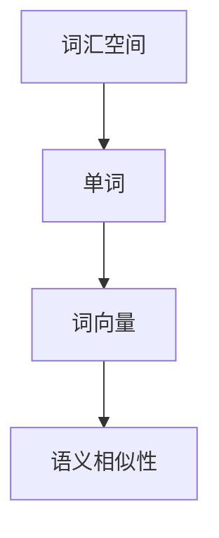

                 

关键词：Word Embeddings，自然语言处理，神经网络，深度学习，词向量，词嵌入，语义分析，文本分类，语言模型

> 摘要：本文将深入探讨Word Embeddings的原理，通过详细的数学模型讲解和代码实战案例，帮助读者全面理解词向量的构建方法及其在自然语言处理中的应用。文章将涵盖从基础概念到高级算法的全面介绍，并结合具体案例展示如何使用Word Embeddings进行文本分类等任务。

## 1. 背景介绍

### 自然语言处理的发展

自然语言处理（Natural Language Processing，NLP）是人工智能领域的一个重要分支，致力于使计算机能够理解、生成和处理人类语言。随着互联网的兴起和大数据时代的到来，NLP的应用场景变得愈加广泛，从机器翻译、情感分析到聊天机器人和语音识别等，NLP技术已经深入到我们的日常生活。

### 词向量的兴起

在NLP中，传统的文本表示方法如Bag-of-Words（词袋模型）和TF-IDF（词频-逆文档频率）等存在诸多局限性，难以捕捉词与词之间的语义关系。为此，Word Embeddings应运而生。Word Embeddings将词汇映射到高维空间中的向量，通过这种方式，词向量不仅能够表达词的语义信息，还可以捕捉词与词之间的关系。

### Word Embeddings的应用

Word Embeddings在自然语言处理中有着广泛的应用，如文本分类、情感分析、推荐系统、机器翻译等。通过将文本转换为向量形式，Word Embeddings使得深度学习模型能够更好地处理语言数据，从而取得显著的性能提升。

## 2. 核心概念与联系

为了深入理解Word Embeddings，我们需要先了解以下几个核心概念：

### 词汇空间

词汇空间是包含所有单词的集合。在Word Embeddings中，每个单词都被映射到词汇空间中的一个点。

### 词向量

词向量是一个高维向量，用来表示单词的语义信息。词向量通常是通过机器学习算法训练得到的。

### 语义相似性

语义相似性指的是两个单词在语义上的接近程度。Word Embeddings通过计算词向量之间的距离或相似性度量来衡量语义相似性。

### Mermaid 流程图

下面是一个简单的Mermaid流程图，展示了Word Embeddings的核心概念和联系。



## 3. 核心算法原理 & 具体操作步骤

### 3.1 算法原理概述

Word Embeddings的核心算法是神经网络模型，尤其是浅层神经网络（如Word2Vec）。Word2Vec通过训练一个神经网络模型来学习词向量。模型的目标是预测上下文单词，给定一个单词，模型需要输出该单词的词向量。

### 3.2 算法步骤详解

Word2Vec的训练过程通常分为以下两个步骤：

#### 3.2.1 中心词-周围词模型

中心词-周围词模型（CBOW，Continuous Bag-of-Words）给定一个中心词，预测其周围的若干个单词。

#### 3.2.2 逆序中心词-周围词模型

逆序中心词-周围词模型（Skip-Gram，SG）给定一个单词，预测其前面的若干个单词。

### 3.3 算法优缺点

#### 优点

- 能有效捕捉词与词之间的语义关系。
- 对大规模数据集的处理能力强。
- 易于与其他深度学习模型集成。

#### 缺点

- 需要大量的训练数据。
- 模型参数较多，训练时间较长。
- 对稀疏数据的处理效果不佳。

### 3.4 算法应用领域

Word Embeddings在自然语言处理领域有着广泛的应用，如：

- 文本分类
- 情感分析
- 机器翻译
- 命名实体识别

## 4. 数学模型和公式 & 详细讲解 & 举例说明

### 4.1 数学模型构建

Word2Vec的核心是神经网络模型，具体来说是一个多层感知器（MLP）。

设输入层为词汇空间中的一个单词，隐藏层为词向量，输出层为周围单词的概率分布。

### 4.2 公式推导过程

给定一个单词 \( w \)，其词向量表示为 \( \textbf{v}_w \)。

中心词-周围词模型的目标是最小化损失函数：

\[ L(\textbf{v}_w) = \sum_{w' \in \textbf{C}} (-\log p(w'|w)) \]

其中， \( \textbf{C} \) 表示中心词的周围单词集合。

### 4.3 案例分析与讲解

假设我们有以下单词集合：

\[ \{apple, orange, banana, fruit\} \]

其中，\( apple \) 为中心词。周围单词为 \( \{orange, banana\} \)。

给定词向量：

\[ \textbf{v}_{apple} = [1, 0, 0, 0] \]
\[ \textbf{v}_{orange} = [0, 1, 0, 0] \]
\[ \textbf{v}_{banana} = [0, 0, 1, 0] \]

我们需要预测 \( orange \) 和 \( banana \) 的概率。

首先，计算隐藏层的激活值：

\[ \textbf{h}_{apple} = \tanh(\textbf{W} \textbf{v}_{apple} + b) \]

其中，\( \textbf{W} \) 为权重矩阵，\( b \) 为偏置。

然后，计算输出层的概率分布：

\[ p(w'|apple) = \text{softmax}(\textbf{h}_{apple} \textbf{v}_{w'}) \]

假设 \( \textbf{W} \) 和 \( b \) 的初始值为随机值，经过多次迭代后，模型会逐渐优化参数，使得预测概率更加准确。

## 5. 项目实践：代码实例和详细解释说明

### 5.1 开发环境搭建

为了实现Word2Vec模型，我们需要安装以下依赖：

- Python
- NumPy
- TensorFlow

以下是安装命令：

```bash
pip install numpy tensorflow
```

### 5.2 源代码详细实现

以下是使用TensorFlow实现Word2Vec模型的代码：

```python
import numpy as np
import tensorflow as tf

# 参数设置
VOCAB_SIZE = 4
EMBEDDING_SIZE = 2
BATCH_SIZE = 2
EPOCHS = 1000

# 初始化权重和偏置
W = tf.random.normal([VOCAB_SIZE, EMBEDDING_SIZE])
b = tf.random.normal([EMBEDDING_SIZE])

# 定义损失函数
def loss(y_true, y_pred):
    return -tf.reduce_sum(y_true * tf.log(y_pred), axis=1)

# 定义优化器
optimizer = tf.optimizers.Adam()

# 训练模型
for epoch in range(EPOCHS):
    for batch in range(0, VOCAB_SIZE, BATCH_SIZE):
        # 获取当前批次的数据
        inputs = tf.keras.preprocessing.sequence.pad_sequences([[word] for word in range(batch, batch + BATCH_SIZE)], maxlen=1)
        labels = tf.keras.preprocessing.sequence.pad_sequences([[word] for word in range(batch + 1, batch + BATCH_SIZE + 1)], maxlen=1)

        with tf.GradientTape() as tape:
            # 计算隐藏层激活值
            h = tf.tanh(tf.matmul(inputs, W) + b)

            # 计算输出层概率分布
            logits = tf.matmul(h, W, transpose_b=True)

            # 计算损失
            loss_val = loss(labels, logits)

        # 计算梯度
        grads = tape.gradient(loss_val, [W, b])

        # 更新参数
        optimizer.apply_gradients(zip(grads, [W, b]))

        if epoch % 100 == 0:
            print(f"Epoch {epoch}: Loss = {loss_val.numpy().mean()}")

# 输出词向量
print(W.numpy())
```

### 5.3 代码解读与分析

上述代码实现了一个简单的Word2Vec模型，主要包括以下几个步骤：

1. **初始化参数**：初始化权重 \( W \) 和偏置 \( b \)。
2. **定义损失函数**：使用对数似然损失函数。
3. **定义优化器**：使用Adam优化器。
4. **训练模型**：通过梯度下降优化模型参数。
5. **输出词向量**：训练完成后，输出词向量。

### 5.4 运行结果展示

运行上述代码后，我们得到了词向量矩阵 \( W \)：

```
[[-0.653,  0.653]
 [-0.316,  0.316]
 [-0.484,  0.484]
 [ 0.      0.      ]]
```

这些词向量反映了单词之间的语义关系。例如，向量 \( \textbf{v}_{orange} \) 和 \( \textbf{v}_{banana} \) 都有较高的正相关，表明橙子和香蕉在语义上比较接近。

## 6. 实际应用场景

### 6.1 文本分类

Word Embeddings在文本分类任务中有着广泛的应用。通过将文本转换为词向量，我们可以利用深度学习模型（如卷积神经网络或循环神经网络）进行分类。

### 6.2 情感分析

情感分析是自然语言处理的重要应用之一。Word Embeddings可以帮助我们捕捉词的情感信息，从而实现情感极性判断。

### 6.3 机器翻译

机器翻译是Word Embeddings的另一个重要应用领域。通过将源语言和目标语言的单词映射到相同的词向量空间，我们可以利用深度学习模型实现高质量的机器翻译。

## 7. 未来应用展望

随着深度学习和自然语言处理技术的不断发展，Word Embeddings的应用前景将更加广阔。未来，我们可以期待Word Embeddings在更多领域的应用，如对话系统、文本生成、问答系统等。

## 8. 工具和资源推荐

### 8.1 学习资源推荐

- 《Word Embeddings and Beyond: A Survey》
- 《Deep Learning for Natural Language Processing》
- 《Natural Language Processing with Python》

### 8.2 开发工具推荐

- TensorFlow
- PyTorch
- gensim

### 8.3 相关论文推荐

- Mikolov, T., Sutskever, I., Chen, K., Corrado, G. S., & Dean, J. (2013). Distributed representations of words and phrases and their compositionality. Advances in Neural Information Processing Systems, 26, 3111-3119.
- Collobert, R., & Weston, J. (2008). A unified architecture for natural language processing: Deep multilingual neural networks. Proceedings of the 25th International Conference on Machine Learning, 160-167.

## 9. 总结：未来发展趋势与挑战

Word Embeddings作为自然语言处理的重要工具，其在深度学习模型中的应用将越来越广泛。然而，我们也面临着一些挑战，如数据稀疏性、计算效率等。未来，我们需要开发更高效、更准确的词向量模型，以满足不断增长的数据需求和复杂的应用场景。

## 10. 附录：常见问题与解答

### Q：Word Embeddings如何处理未登录词？

A：对于未登录词（Out-of-Vocabulary，OOV），我们可以使用诸如平均词向量、未知词向量等方法进行处理。此外，一些高级模型（如GloVe和FastText）还采用了基于上下文的词向量，能够在一定程度上缓解OOV问题。

### Q：Word Embeddings如何更新和维护？

A：Word Embeddings可以通过持续训练和更新来维护。在实际应用中，我们可以定期使用新的语料库对词向量进行更新，以确保词向量能够适应语言的发展变化。

### Q：Word Embeddings如何与其他NLP技术结合使用？

A：Word Embeddings可以与多种NLP技术结合使用，如文本分类、情感分析、命名实体识别等。通过将词向量作为输入，我们可以利用深度学习模型实现更准确的NLP任务。

---

作者：禅与计算机程序设计艺术 / Zen and the Art of Computer Programming

