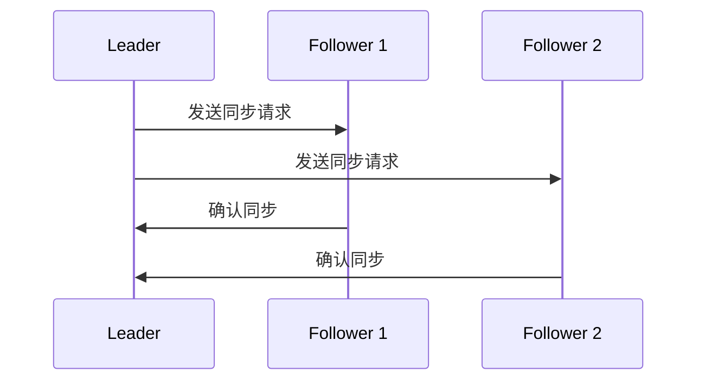
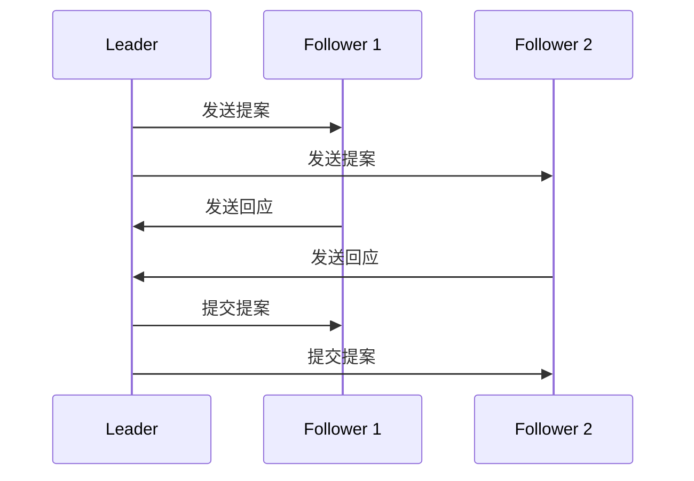

                 

关键词：Zookeeper、分布式系统、数据一致性、锁机制、数据存储、集群管理

> 摘要：本文将详细探讨Zookeeper的核心原理，包括其架构设计、数据模型、数据同步、锁机制等，并通过实际代码实例展示如何使用Zookeeper解决分布式系统中的同步与协调问题。

## 1. 背景介绍

Zookeeper是一个开源的分布式服务协调框架，由Apache Software Foundation维护。它最初由Yahoo！开发，主要用于解决大型分布式系统中的服务协调和数据同步问题。Zookeeper的核心目标是为分布式应用提供简单、高效、可靠的服务协调和配置管理。

### 1.1 分布式系统的挑战

在分布式系统中，多个节点需要协同工作，确保数据的一致性和服务的可用性。以下是分布式系统面临的一些挑战：

- **数据一致性**：多个节点需要访问和修改同一份数据，确保所有节点看到的数据是一致的。
- **服务可用性**：系统中的某个节点可能因为故障或网络问题而不可用，需要其他节点能够接替其工作。
- **服务协调**：分布式系统中各节点需要共享状态信息，以协调各自的行为。

### 1.2 Zookeeper的作用

Zookeeper通过提供以下功能解决了上述问题：

- **数据存储**：提供类似文件系统的数据存储结构，供分布式系统中的节点访问和修改。
- **锁机制**：实现分布式锁，确保同一时间只有一个节点能够访问某个资源。
- **会话管理**：管理分布式系统中节点的生命周期和会话状态。
- **队列管理**：提供分布式队列，支持负载均衡和任务调度。

## 2. 核心概念与联系

### 2.1 Zookeeper架构

Zookeeper运行在一个集群中，集群中有一个Leader节点和多个Follower节点。以下是Zookeeper的基本架构：



### 2.2 数据模型

Zookeeper使用树形数据结构来组织数据，类似于文件系统。每个节点都有一个唯一路径和版本号。

```mermaid
tree
    A
    ├── B
    │   ├── C
    │   │   └── D
    │   └── E
    └── F
        └── G
```

### 2.3 数据同步

Zookeeper中的数据同步是通过Zab协议实现的。Zab协议是一种基于Paxos算法的分布式一致性协议，确保所有Follower节点与Leader节点的数据一致性。



## 3. 核心算法原理 & 具体操作步骤

### 3.1 算法原理概述

Zookeeper的核心算法包括以下部分：

- **会话管理**：通过会话ID和会话超时时间来管理节点生命周期。
- **锁机制**：使用Zab协议确保分布式锁的正确性和可用性。
- **数据同步**：通过Zab协议实现数据的一致性。
- **队列管理**：使用Zookeeper提供的队列实现负载均衡和任务调度。

### 3.2 算法步骤详解

#### 3.2.1 会话管理

1. **客户端连接**：客户端连接到Zookeeper集群的任意一个节点。
2. **会话建立**：客户端发送会话创建请求，服务器返回会话ID和会话超时时间。
3. **心跳维持**：客户端定期发送心跳请求以维持会话。

#### 3.2.2 锁机制

1. **锁创建**：客户端尝试创建锁，如果在同一时间只有一个客户端能成功创建锁。
2. **等待锁释放**：如果客户端未能成功创建锁，则需要等待锁被释放。
3. **锁释放**：持有锁的客户端释放锁，其他客户端可以尝试获取锁。

#### 3.2.3 数据同步

1. **提案发送**：客户端向Leader节点发送提案，提案包含要执行的操作。
2. **提案处理**：Leader节点处理提案，将提案广播给所有Follower节点。
3. **提案确认**：Follower节点处理提案后，向Leader节点发送确认消息。
4. **提案提交**：Leader节点收到所有Follower节点的确认消息后，提交提案。

#### 3.2.4 队列管理

1. **队列创建**：客户端创建队列，将任务放入队列。
2. **任务调度**：队列根据负载均衡策略将任务调度给可用节点。
3. **任务处理**：节点从队列中获取任务并处理。

### 3.3 算法优缺点

#### 优点

- **高可用性**：通过集群架构和Zab协议，确保系统的高可用性。
- **数据一致性**：Zookeeper通过Zab协议实现数据的一致性，保证分布式系统中的数据一致性。
- **易用性**：提供了丰富的API，方便开发者使用。

#### 缺点

- **性能瓶颈**：由于Zookeeper使用文件系统作为数据存储，性能可能受到文件系统性能的限制。
- **单点故障**：Zookeeper集群中的Leader节点如果发生故障，可能导致整个系统的瘫痪。

### 3.4 算法应用领域

Zookeeper在以下领域有广泛的应用：

- **分布式锁**：确保分布式系统中的数据一致性和服务协调。
- **配置管理**：集中管理分布式系统中的配置信息。
- **负载均衡**：实现分布式系统的负载均衡和任务调度。

## 4. 数学模型和公式 & 详细讲解 & 举例说明

### 4.1 数学模型构建

Zookeeper的数据同步采用Zab协议，其核心是Paxos算法。Paxos算法的基本模型如下：

- **参与者**：所有参与同步的节点，包括Leader和Follower。
- **提案**：客户端发送的操作请求，包含操作类型和操作数据。
- **视图**：Leader节点的编号，用于标识多个可能的Leader状态。
- **决策**：某个提案被大多数参与者接受并执行。

### 4.2 公式推导过程

Paxos算法的核心公式如下：

- **观点选择（View Choice）**：选择一个最大视图编号作为当前视图。
- **提案通过（Proposal Acceptance）**：在当前视图下，某个提案被大多数参与者接受。
- **决策执行（Decision Execution）**：在提案通过后，执行提案操作。

### 4.3 案例分析与讲解

假设一个简单的Paxos算法应用场景，有三个参与者A、B、C，其中A作为Leader，B和C作为Follower。

1. **观点选择**：当前视图为1。
2. **提案发送**：客户端向A发送一个提案，提案编号为2。
3. **提案处理**：A将提案广播给B和C。
4. **提案确认**：B和C收到提案后，向A发送确认消息。
5. **提案通过**：A收到大多数（即至少两个）确认消息后，提交提案。
6. **决策执行**：A将提案操作执行在本地，并将结果广播给B和C。

## 5. 项目实践：代码实例和详细解释说明

### 5.1 开发环境搭建

在开始编写代码之前，需要搭建Zookeeper的开发环境。以下是步骤：

1. 安装Java开发环境。
2. 下载并解压Zookeeper源码包。
3. 配置Zookeeper的配置文件（如zoo.cfg）。

### 5.2 源代码详细实现

以下是一个简单的Zookeeper客户端示例，实现创建节点、读取节点数据和同步锁功能。

```java
import org.apache.zookeeper.ZooKeeper;
import org.apache.zookeeper.CreateMode;
import org.apache.zookeeper.KeeperException;

public class ZookeeperClient {

    private static final String ZOOKEEPER_ADDRESS = "localhost:2181";
    private static final String ZOOKEEPER_PATH = "/example";

    public static void main(String[] args) throws Exception {
        // 创建Zookeeper客户端连接
        ZooKeeper zookeeper = new ZooKeeper(ZOOKEEPER_ADDRESS, 5000, new Watcher() {
            @Override
            public void process(WatchedEvent event) {
                // 处理监听事件
            }
        });

        // 创建节点
        String nodePath = zookeeper.create(ZOOKEEPER_PATH, "Hello, World!".getBytes(), CreateMode.EPHEMERAL);

        // 读取节点数据
        byte[] nodeData = zookeeper.getData(ZOOKEEPER_PATH, false, null);
        System.out.println("Node data: " + new String(nodeData));

        // 同步锁
        String lockPath = "/lock";
        if (zookeeper.acquireLock(lockPath)) {
            System.out.println("Acquire lock successfully");
            // 执行同步操作
            zookeeper.releaseLock(lockPath);
        } else {
            System.out.println("Failed to acquire lock");
        }

        // 关闭连接
        zookeeper.close();
    }
}
```

### 5.3 代码解读与分析

以上代码首先创建了一个Zookeeper客户端连接，然后创建了一个节点，并读取了节点的数据。接着，代码实现了一个简单的锁机制，通过Zookeeper的`acquireLock`和`releaseLock`方法实现分布式锁的获取和释放。

### 5.4 运行结果展示

运行上述代码后，将创建一个名为`/example`的节点，并输出节点的数据。同时，程序将尝试获取名为`/lock`的锁，如果成功获取锁，则输出“Acquire lock successfully”，否则输出“Failed to acquire lock”。

## 6. 实际应用场景

Zookeeper在分布式系统中有着广泛的应用，以下是一些实际应用场景：

- **分布式锁**：确保多个节点对同一资源的访问顺序和一致性。
- **配置管理**：集中管理分布式系统的配置信息，如数据库连接、服务端口号等。
- **负载均衡**：通过Zookeeper实现负载均衡和任务调度。

## 7. 未来应用展望

随着分布式系统的日益复杂，Zookeeper在未来将面临以下挑战和机遇：

- **性能优化**：提高Zookeeper的性能，以支持大规模分布式系统。
- **安全性增强**：加强Zookeeper的安全性，防止恶意攻击和未授权访问。
- **跨语言支持**：提供更多编程语言的支持，以简化开发者使用Zookeeper的难度。

## 8. 工具和资源推荐

### 8.1 学习资源推荐

- 《Zookeeper: The Definitive Guide》
- 《ZooKeeper Internals: Deep Dive into ZooKeeper architecture and data model》

### 8.2 开发工具推荐

- IntelliJ IDEA
- Eclipse

### 8.3 相关论文推荐

- 《Paxos Made Simple》
- 《Zookeeper: A High-Performance Coordination Service for Distributed Applications》

## 9. 总结：未来发展趋势与挑战

Zookeeper在分布式系统中的应用日益广泛，但其性能、安全性和跨语言支持等方面仍需进一步优化。未来，Zookeeper将继续在分布式系统中发挥重要作用，并迎来新的机遇和挑战。

## 10. 附录：常见问题与解答

### 10.1 如何搭建Zookeeper集群？

请参考官方文档和教程，搭建一个简单的Zookeeper集群。

### 10.2 如何使用Zookeeper实现分布式锁？

请参考官方文档和示例代码，使用`acquireLock`和`releaseLock`方法实现分布式锁。

### 10.3 Zookeeper的数据模型是什么？

Zookeeper使用树形数据结构，每个节点有一个唯一路径和版本号。

### 10.4 如何监控Zookeeper的性能？

请使用官方提供的监控工具，如`zkperf`，监控Zookeeper的性能指标。

----------------------------------------------------------------
作者：禅与计算机程序设计艺术 / Zen and the Art of Computer Programming


