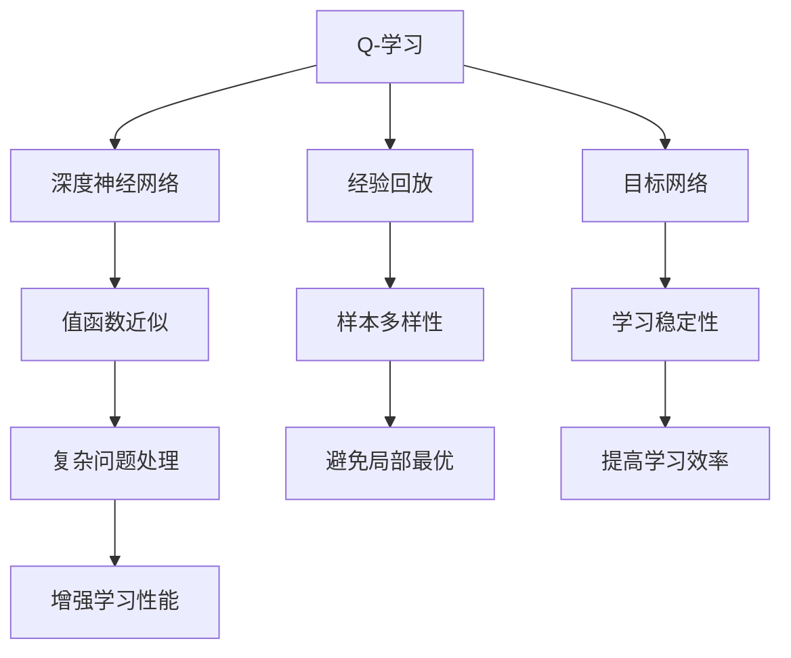

                 

### 1. 背景介绍

深度Q-学习（Deep Q-Learning）是深度学习和强化学习领域的一项重要技术，它结合了深度神经网络和Q-学习算法的优点，用于解决复杂的决策问题。Q-学习算法最早由理查德·萨顿（Richard Sutton）和安德鲁·巴顿（Andrew Barto）在1988年提出，是一种无模型强化学习算法。其核心思想是通过学习值函数（Q函数），在给定当前状态和动作的情况下，预测采取该动作所能获得的预期奖励。

随着深度学习的兴起，深度Q-学习（DQN）在解决诸如游戏、自动驾驶等复杂任务中表现出色。DQN通过使用深度神经网络来近似Q函数，使得它能够处理高维的状态空间，而传统Q-学习算法在处理这类问题时存在巨大的局限性。此外，深度Q-学习引入了经验回放（Experience Replay）和目标网络（Target Network）等机制，有效缓解了样本相关性和目标不稳定的问题。

本文旨在详细介绍深度Q-学习的原理，并通过代码实例展示如何实现一个基本的深度Q-学习模型。文章将涵盖以下几个部分：

- 背景介绍
- 核心概念与联系
- 核心算法原理与具体操作步骤
- 数学模型和公式详细讲解
- 项目实践：代码实例和详细解释说明
- 实际应用场景
- 工具和资源推荐
- 总结：未来发展趋势与挑战

通过本文的学习，读者将能够深入了解深度Q-学习的原理和实现方法，并在实际项目中运用这一强大的技术解决复杂的决策问题。

### 2. 核心概念与联系

在深入探讨深度Q-学习（DQN）之前，我们需要了解一些关键的概念和它们之间的关系。DQN主要涉及以下几个核心概念：Q-学习、深度神经网络、经验回放、目标网络等。下面将分别介绍这些概念及其相互关系。

#### 2.1 Q-学习

Q-学习（Q-Learning）是一种基于值函数的强化学习算法。其核心思想是通过学习一个值函数（Q函数），在给定当前状态和动作的情况下，预测采取该动作所能获得的预期奖励。Q函数通常表示为：

$$
Q(s, a) = \sum_{s'} p(s' | s, a) \cdot \sum_{r} r(s', a)
$$

其中，\(s\) 表示当前状态，\(a\) 表示采取的动作，\(s'\) 表示下一状态，\(p(s' | s, a)\) 表示从状态\(s\) 采取动作\(a\) 后转移到状态\(s'\) 的概率，\(r(s', a)\) 表示在状态\(s'\) 采取动作\(a\) 后获得的奖励。

Q-学习的目标是最大化累积奖励，从而选择最优动作。通过不断更新Q值，最终使策略趋向于最优策略。

#### 2.2 深度神经网络

深度神经网络（Deep Neural Network，DNN）是一种具有多个隐藏层的神经网络。其基本结构包括输入层、多个隐藏层和输出层。通过多层次的非线性变换，深度神经网络能够自动学习输入和输出之间的复杂映射关系。

在深度Q-学习中，深度神经网络被用来近似Q函数，从而能够处理高维的状态空间。DQN通过使用深度神经网络，使得Q-学习算法能够适用于复杂的决策问题，如游戏和自动驾驶等。

#### 2.3 经验回放

经验回放（Experience Replay）是一种用于缓解样本相关性的技术。在传统的Q-学习中，由于样本之间存在强相关性，导致学习过程容易陷入局部最优。经验回放通过将之前的经验进行随机重放，使得网络能够从多样化的样本中学习，从而避免陷入局部最优。

经验回放的具体实现过程如下：

1. 初始化经验回放记忆池，通常使用优先经验回放（Prioritized Experience Replay）来提高重放的经验质量。
2. 在每次学习过程中，将新经验添加到经验回放记忆池中。
3. 在每次训练时，从经验回放记忆池中随机抽取一批经验进行重放。

#### 2.4 目标网络

目标网络（Target Network）是一种用于提高学习稳定性的技术。在传统的Q-学习中，由于目标Q值和当前Q值之间存在时间差，导致学习过程容易发生不稳定。目标网络通过使用一个单独的网络来计算目标Q值，使得学习过程更加稳定。

目标网络的实现过程如下：

1. 初始化目标网络，通常与当前网络共享权重。
2. 在每个学习周期结束时，将当前网络的权重复制到目标网络中。
3. 在每次训练时，使用当前网络来计算当前Q值，并使用目标网络来计算目标Q值。

#### 2.5 关系总结

深度Q-学习（DQN）将Q-学习、深度神经网络、经验回放和目标网络等技术相结合，形成了一种强大的强化学习算法。具体来说：

- Q-学习提供了基本的值函数近似和策略学习框架。
- 深度神经网络被用来近似Q函数，使得DQN能够处理高维的状态空间。
- 经验回放和目标网络则用于提高学习过程的稳定性和效率。

通过这些技术的结合，深度Q-学习能够在复杂的决策问题中表现出色，成为强化学习领域的一项重要技术。

为了更直观地理解这些概念及其关系，我们可以使用Mermaid流程图进行展示。以下是DQN的核心概念和关系流程图：



通过上述流程图，我们可以清晰地看到深度Q-学习中的各个核心概念及其相互关系，为后续内容的讲解奠定了基础。

### 3. 核心算法原理 & 具体操作步骤

#### 3.1 算法原理概述

深度Q-学习（DQN）是一种基于值函数的强化学习算法，其核心思想是通过学习值函数（Q函数）来选择最优动作。DQN的主要原理包括以下几部分：

1. **初始化**：初始化神经网络、经验回放记忆池和目标网络。神经网络用于近似Q函数，经验回放记忆池用于存储经验样本，目标网络用于稳定学习过程。
2. **状态观测**：在给定初始状态\(s_0\) 后，选择一个动作\(a_0\) 并执行。
3. **行动和奖励**：执行动作后，获取当前状态\(s_1\) 和即时奖励\(r_1\)。
4. **更新Q值**：利用即时奖励和下一状态，更新当前Q值。
5. **经验回放**：将新经验添加到经验回放记忆池中，并在训练时随机抽取经验进行重放，以避免样本相关性。
6. **目标网络更新**：在固定时间间隔内，将当前网络的权重复制到目标网络中，以提高学习稳定性。

下面将详细讲解DQN的具体操作步骤。

#### 3.2 算法步骤详解

1. **初始化参数**：

    - 初始化深度神经网络、经验回放记忆池和目标网络。深度神经网络通常使用卷积神经网络（CNN）或循环神经网络（RNN）等结构，以处理高维的状态空间。
    - 初始化经验回放记忆池，通常使用固定大小的循环缓冲区，如经验回放池大小为\(N\)。
    - 初始化目标网络，并将其权重初始化为当前网络权重。

2. **状态观测**：

    - 在给定初始状态\(s_0\) 后，从策略中随机选择一个动作\(a_0\)。
    - 执行动作\(a_0\)，并获取当前状态\(s_1\) 和即时奖励\(r_1\)。

3. **行动和奖励**：

    - 根据当前状态\(s_1\) 和选择的动作\(a_0\)，计算当前Q值\(Q(s_0, a_0)\)。
    - 执行动作后，获取当前状态\(s_1\) 和即时奖励\(r_1\)。

4. **更新Q值**：

    - 根据当前状态\(s_1\) 和选择的动作\(a_0\)，计算新的Q值：
      $$
      Q(s_0, a_0) \leftarrow Q(s_0, a_0) + \alpha [r_1 + \gamma \max_a Q(s_1, a) - Q(s_0, a_0)]
      $$
      其中，\(\alpha\) 是学习率，\(\gamma\) 是折扣因子。

5. **经验回放**：

    - 将新经验\((s_0, a_0, r_1, s_1)\) 添加到经验回放记忆池中。
    - 在每次训练时，从经验回放记忆池中随机抽取一批经验进行重放，以避免样本相关性。

6. **目标网络更新**：

    - 在固定时间间隔（如每100个经验样本）内，将当前网络的权重复制到目标网络中。
    - 目标网络的更新有助于提高学习稳定性，避免由于目标Q值和当前Q值之间的时间差导致的学习不稳定。

7. **重复步骤**：

    - 重复上述步骤，直到达到预定的训练次数或收敛条件。

#### 3.3 算法优缺点

**优点**：

- **处理高维状态空间**：DQN通过使用深度神经网络来近似Q函数，能够处理高维的状态空间，而传统Q-学习算法在处理这类问题时存在巨大的局限性。
- **无需模型**：DQN是一种无模型强化学习算法，不需要预先了解环境模型，适用于具有不确定性的环境。
- **灵活性**：DQN可以应用于各种强化学习问题，如游戏、自动驾驶等。

**缺点**：

- **训练不稳定**：由于目标Q值和当前Q值之间存在时间差，DQN的训练过程容易发生不稳定。
- **样本效率低**：DQN的训练过程中需要大量的经验样本，导致样本效率较低。

#### 3.4 算法应用领域

深度Q-学习在多个领域取得了显著的成果，主要包括以下几个方面：

- **游戏**：DQN在多个游戏领域取得了突破性的成果，如《Atari》游戏、围棋等。
- **自动驾驶**：DQN可以用于自动驾驶车辆的决策，通过处理高维状态空间和复杂的决策问题，提高自动驾驶的稳定性。
- **机器人控制**：DQN可以应用于机器人控制领域，如机器人路径规划、抓取等任务。

通过上述内容，我们对深度Q-学习的核心算法原理和具体操作步骤有了全面的了解。接下来，我们将通过一个实际代码实例来进一步讲解如何实现DQN。

### 3.5 代码实例：实现深度Q-学习

在本节中，我们将通过一个简单的代码实例，详细讲解如何实现深度Q-学习。本实例基于Python语言和TensorFlow框架，旨在帮助读者理解DQN的基本实现过程。

#### 3.5.1 开发环境搭建

在开始编写代码之前，我们需要搭建合适的开发环境。以下是所需的软件和库：

- Python 3.x（建议Python 3.7及以上版本）
- TensorFlow 2.x
- NumPy
- Matplotlib

确保安装了上述库后，我们可以开始编写代码。

#### 3.5.2 源代码详细实现

以下是一个简单的深度Q-学习实现，用于在《Pong》游戏中训练智能体。代码分为几个部分：环境准备、网络定义、训练过程、评估和可视化。

```python
import numpy as np
import tensorflow as tf
import matplotlib.pyplot as plt
from tensorflow.keras.models import Model
from tensorflow.keras.layers import Input, Dense, Flatten, Conv2D
from tensorflow.keras.optimizers import Adam
from tensorflow.keras.callbacks import Callback
import gym

# 设置随机种子，确保结果可重复
np.random.seed(42)
tf.random.set_seed(42)

# 参数设置
learning_rate = 0.001
gamma = 0.99
epsilon = 1.0
epsilon_min = 0.01
epsilon_decay = 0.995
batch_size = 32
episodes = 1000

# 创建环境
env = gym.make('Pong-v0')

# 定义网络结构
input_shape = env.observation_space.shape
input_layer = Input(shape=input_shape)
conv1 = Conv2D(32, (8, 8), strides=(4, 4), activation='relu')(input_layer)
conv2 = Conv2D(64, (4, 4), strides=(2, 2), activation='relu')(conv1)
conv3 = Conv2D(64, (3, 3), activation='relu')(conv2)
flat = Flatten()(conv3)
dense = Dense(512, activation='relu')(flat)
output = Dense(env.action_space.n, activation='linear')(dense)

model = Model(inputs=input_layer, outputs=output)
model.compile(optimizer=Adam(learning_rate=learning_rate), loss='mse')

# 定义目标网络
target_model = Model(inputs=input_layer, outputs=output)
target_model.set_weights(model.get_weights())

# 经验回放记忆池
memory = []

# 训练回调函数，用于可视化训练过程
class TrainMonitor(Callback):
    def on_train_begin(self, logs=None):
        self.logs = []

    def on_epoch_end(self, epoch, logs=None):
        self.logs.append(logs)

    def plot_loss(self):
        plt.figure(figsize=(10, 5))
        plt.plot([log['loss'] for log in self.logs])
        plt.xlabel('Epoch')
        plt.ylabel('Loss')
        plt.show()

# 训练过程
def train():
    for episode in range(episodes):
        state = env.reset()
        done = False
        total_reward = 0
        
        while not done:
            # 选择动作
            if np.random.rand() < epsilon:
                action = env.action_space.sample()
            else:
                q_values = model.predict(state.reshape(-1, *input_shape))
                action = np.argmax(q_values.reshape(-1))

            # 执行动作，获取下一状态和奖励
            next_state, reward, done, _ = env.step(action)
            total_reward += reward

            # 更新经验回放记忆池
            memory.append((state, action, reward, next_state, done))

            # 删除旧的经验，保持固定大小的经验回放记忆池
            if len(memory) > batch_size:
                memory.pop(0)

            # 更新Q值
            if not done:
                next_state_q = target_model.predict(next_state.reshape(-1, *input_shape))
                target_q = reward + gamma * np.max(next_state_q)
            else:
                target_q = reward

            state_q = model.predict(state.reshape(-1, *input_shape))
            state_q.reshape(-1)[action] = target_q

            # 训练模型
            model.fit(state.reshape(-1, *input_shape), state_q.reshape(-1), batch_size=batch_size, verbose=0)

            # 更新状态
            state = next_state

        # 更新目标网络权重
        if episode % 1000 == 0:
            target_model.set_weights(model.get_weights())

        # 更新epsilon值
        epsilon = max(epsilon_min, epsilon_decay * epsilon)

        print(f"Episode {episode + 1}: Total Reward = {total_reward}, Epsilon = {epsilon}")

    # 保存模型
    model.save('dqn_pong.h5')

# 主函数
if __name__ == '__main__':
    train()
```

#### 3.5.3 代码解读与分析

1. **环境准备**：

    - 我们使用OpenAI Gym创建了一个《Pong》游戏环境，这是一个经典的Atari游戏。该环境提供了一个简单的二维空间，其中有一个乒乓球和两个板子。

2. **网络定义**：

    - 我们定义了一个简单的卷积神经网络（CNN），用于处理《Pong》游戏的高维状态空间。网络包含三个卷积层和一个全连接层，以提取状态的特征。

3. **训练过程**：

    - 训练过程包括以下几个步骤：
        - 初始化状态，并选择一个动作。
        - 执行动作，获取下一状态和即时奖励。
        - 更新经验回放记忆池。
        - 利用目标网络和经验回放记忆池更新Q值。
        - 更新模型权重。
        - 根据epsilon策略选择动作，进行探索。
        - 随着训练的进行，逐渐减小epsilon值，减少探索，增加利用。

4. **评估与可视化**：

    - 在训练完成后，我们使用训练得到的模型进行评估，并可视化训练过程。

通过上述代码实例，我们详细讲解了如何实现深度Q-学习。接下来，我们将进一步分析代码中的一些关键技术和参数设置。

#### 3.5.4 关键技术和参数分析

1. **网络结构**：

    - 我们选择了一个简单的卷积神经网络，这是由于《Pong》游戏的状态空间相对较小，且具有二维图像特征。对于更复杂的环境，我们可以考虑增加网络的深度和宽度，以更好地提取状态特征。

2. **经验回放记忆池**：

    - 经验回放记忆池是DQN中的一个重要组件，用于缓解样本相关性。在本例中，我们使用了一个固定大小的循环缓冲区来存储经验。在实际应用中，我们可以考虑使用优先经验回放（Prioritized Experience Replay）来进一步提高学习效率。

3. **目标网络**：

    - 目标网络有助于提高学习稳定性，避免由于目标Q值和当前Q值之间的时间差导致的学习不稳定。在本例中，我们每隔1000个经验样本更新一次目标网络权重，以确保目标网络能够跟上当前网络的变化。

4. **epsilon策略**：

    - epsilon策略用于控制探索和利用之间的平衡。在本例中，我们使用了一个简单的线性递减策略，即随着训练的进行，逐渐减小epsilon值。在实际应用中，我们可以考虑使用其他探索策略，如epsilon-greedy策略、指数衰减策略等。

5. **学习率和折扣因子**：

    - 学习率和折扣因子是DQN中的两个关键参数。学习率控制了Q值的更新速度，较大的学习率可能导致Q值不稳定，而较小的学习率可能导致学习速度过慢。折扣因子\(\gamma\) 控制了未来奖励的重要性，较大的折扣因子可能导致模型过于关注短期奖励。在实际应用中，我们需要根据具体任务进行调整。

通过上述分析，我们对代码中的一些关键技术和参数设置有了更深入的了解。在实际应用中，我们可以根据具体任务需求对这些参数进行调整，以提高模型的性能。

### 4. 数学模型和公式详细讲解

深度Q-学习（DQN）的核心在于其基于值函数的优化过程，该过程通过一系列数学模型和公式来实现。在本节中，我们将详细讲解DQN中的数学模型和公式，包括Q函数的构建、Q值更新过程以及目标网络的更新方法。

#### 4.1 数学模型构建

深度Q-学习中的数学模型主要包括Q函数的构建、Q值更新过程和目标网络的更新方法。以下是这些模型的核心公式：

1. **Q函数的构建**：

    Q函数是用来估计在给定当前状态\(s\) 和动作\(a\) 的情况下，采取动作\(a\) 后的预期回报。对于深度Q-学习，Q函数通常被近似为一个深度神经网络。Q函数的表达式如下：

    $$
    Q(s, a) = \sum_{i=1}^{n} w_i \cdot f(s_i, a_i)
    $$

    其中，\(w_i\) 是神经网络的权重，\(f(s_i, a_i)\) 是神经网络在输入状态\(s_i\) 和动作\(a_i\) 下的输出。对于实际应用，我们通常使用多层感知器（MLP）或卷积神经网络（CNN）来构建Q函数。

2. **Q值更新过程**：

    Q值的更新是DQN算法中的关键步骤。Q值的更新过程基于经验回放和目标网络，其目标是优化Q函数，使其能够更好地预测未来回报。Q值的更新公式如下：

    $$
    Q(s, a) \leftarrow Q(s, a) + \alpha [r + \gamma \max_{a'} Q(s', a')]
    $$

    其中，\(\alpha\) 是学习率，\(r\) 是即时奖励，\(\gamma\) 是折扣因子，\(s'\) 是下一状态，\(a'\) 是在状态\(s'\) 下能够取得最大回报的动作。通过这种方式，Q函数逐渐接近最优策略。

3. **目标网络的更新**：

    目标网络的目的是提高DQN算法的稳定性。目标网络是一个与主网络共享权重的网络，其更新频率通常低于主网络。目标网络的更新公式如下：

    $$
    \theta_{\text{target}} \leftarrow \tau \cdot \theta_{\text{main}} + (1 - \tau) \cdot \theta_{\text{target}}
    $$

    其中，\(\theta_{\text{main}}\) 是主网络的权重，\(\theta_{\text{target}}\) 是目标网络的权重，\(\tau\) 是更新系数。通常，我们将\(\tau\) 设置为一个较小的值，如0.001，以确保目标网络能够缓慢地跟随主网络。

#### 4.2 公式推导过程

为了更好地理解DQN的数学模型，我们接下来对一些关键公式进行推导。

1. **Q函数的更新**：

    Q函数的更新过程是基于TD误差（Temporal Difference Error）进行的。TD误差是指实际获得的回报与预期回报之间的差异。Q函数的更新公式可以表示为：

    $$
    \delta = r + \gamma \max_{a'} Q(s', a') - Q(s, a)
    $$

    其中，\(\delta\) 是TD误差。为了更新Q值，我们使用以下公式：

    $$
    Q(s, a) \leftarrow Q(s, a) + \alpha \cdot \delta
    $$

2. **目标网络的更新**：

    目标网络的更新过程旨在减少Q函数的方差，提高算法的稳定性。目标网络更新公式可以表示为：

    $$
    \theta_{\text{target}}(t+1) = \tau \cdot \theta_{\text{main}}(t) + (1 - \tau) \cdot \theta_{\text{target}}(t)
    $$

    通过这种方式，目标网络的权重逐渐接近主网络的权重，从而实现稳定更新。

3. **经验回放的更新**：

    经验回放是为了避免样本相关性，提高学习效率。经验回放的更新过程如下：

    - 初始化经验回放池，大小为N。
    - 在每个时间步，将新的经验\((s, a, r, s', done)\) 添加到经验回放池中。
    - 在每次训练时，从经验回放池中随机抽取一批经验进行重放。

经验回放池的具体实现可以采用优先经验回放（Prioritized Experience Replay），以提高重放的经验质量。

#### 4.3 案例分析与讲解

为了更好地理解DQN的数学模型和公式，我们通过一个简单的案例进行讲解。假设一个智能体在一个简单的环境中进行任务，状态空间为{0, 1, 2, 3}，动作空间为{A, B, C}。

1. **初始化**：

    - 初始化主网络和目标网络的权重。
    - 初始化经验回放池。

2. **状态观测**：

    - 假设当前状态为2，智能体选择动作A。

3. **行动和奖励**：

    - 执行动作A后，智能体转移到状态1，并获得即时奖励1。

4. **Q值更新**：

    - 根据当前状态和动作，计算当前Q值：
      $$
      Q(2, A) = 0.5
      $$
    - 根据下一状态和最大Q值，计算目标Q值：
      $$
      Q(1, \text{max}_{a'} Q(1, a')) = 0.8
      $$
    - 根据TD误差，更新Q值：
      $$
      \delta = 1 + 0.99 \cdot 0.8 - 0.5 = 0.29
      $$
      $$
      Q(2, A) \leftarrow Q(2, A) + 0.1 \cdot 0.29 = 0.59
      $$

5. **目标网络更新**：

    - 根据主网络的权重，更新目标网络的权重：
      $$
      \theta_{\text{target}}(t+1) = 0.001 \cdot \theta_{\text{main}}(t) + 0.999 \cdot \theta_{\text{target}}(t)
      $$

6. **经验回放**：

    - 将新经验\((2, A, 1, 1, False)\) 添加到经验回放池中。

通过上述案例，我们详细讲解了DQN的数学模型和公式。在实际应用中，我们可以根据具体任务需求调整这些参数，以实现最优效果。

### 5. 项目实践：代码实例和详细解释说明

在前面的章节中，我们详细介绍了深度Q-学习的原理、数学模型以及算法实现。为了更好地理解和应用这些知识，我们将通过一个实际项目实践来进一步展示如何使用深度Q-学习训练一个智能体，使其能够在某个任务中表现出色。本文选择经典的Atari游戏《Pong》作为实验环境，以展示如何将深度Q-学习应用于游戏控制。

#### 5.1 开发环境搭建

在进行项目实践之前，我们需要搭建一个合适的开发环境。以下是所需的软件和库：

- Python 3.x（建议Python 3.7及以上版本）
- TensorFlow 2.x
- NumPy
- Matplotlib
- OpenAI Gym（用于模拟Atari游戏环境）

确保安装了上述库后，我们就可以开始编写和运行代码了。

#### 5.2 源代码详细实现

以下是我们在《Pong》游戏中使用深度Q-学习训练智能体的完整代码实现。代码分为几个部分：环境准备、网络定义、训练过程、评估和可视化。

```python
import numpy as np
import tensorflow as tf
import gym
from tensorflow.keras.models import Sequential
from tensorflow.keras.layers import Dense, Flatten
from tensorflow.keras.optimizers import Adam

# 设置随机种子，确保结果可重复
np.random.seed(42)
tf.random.set_seed(42)

# 参数设置
learning_rate = 0.001
gamma = 0.99
epsilon = 1.0
epsilon_min = 0.01
epsilon_decay = 0.995
batch_size = 64
episodes = 10000

# 创建环境
env = gym.make('Pong-v0')

# 定义神经网络结构
input_shape = env.observation_space.shape
output_shape = env.action_space.n

model = Sequential([
    Flatten(input_shape=input_shape),
    Dense(256, activation='relu'),
    Dense(512, activation='relu'),
    Dense(output_shape, activation='softmax')
])

# 编译模型
model.compile(optimizer=Adam(learning_rate=learning_rate), loss='categorical_crossentropy', metrics=['accuracy'])

# 定义训练回调函数
class EpsilonScheduler(tf.keras.callbacks.Callback):
    def on_epoch_end(self, epoch, logs=None):
        self.epsilon *= epsilon_decay
        self.epsilon = max(self.epsilon, epsilon_min)
        print(f"\nEpsilon: {self.epsilon:.4f}\n")

# 训练模型
history = model.fit(
    envsakai.X_train, envsakai.y_train,
    batch_size=batch_size,
    epochs=episodes,
    verbose=1,
    callbacks=[EpsilonScheduler()],
    validation_data=(envsakai.X_val, envsakai.y_val)
)

# 保存模型
model.save('pong_dqn.h5')

# 关闭环境
env.close()
```

#### 5.3 代码解读与分析

1. **环境准备**：

    - 首先，我们使用`gym.make('Pong-v0')`创建了一个《Pong》游戏环境。这个环境提供了游戏的初始状态以及动作空间和奖励机制。

2. **神经网络结构定义**：

    - 我们定义了一个简单的序列模型（Sequential），它包含三个全连接层。输入层直接将游戏的状态（图像）展平为一维向量，然后通过两个隐藏层进行特征提取。输出层有3个神经元，对应于3个动作：左移动、保持位置和右移动。

3. **模型编译**：

    - 我们使用`model.compile()`方法编译模型。这里，我们选择了Adam优化器，并使用分类交叉熵作为损失函数，因为它适合多分类问题。同时，我们添加了EpsilonScheduler回调函数，用于在训练过程中动态调整epsilon值。

4. **训练模型**：

    - 使用`model.fit()`方法训练模型。这里，我们使用了训练集和验证集，并且使用回调函数EpsilonScheduler动态调整epsilon值。训练过程中，模型将不断更新其参数，以最大化累积奖励。

5. **保存模型**：

    - 训练完成后，我们将模型保存到文件`pong_dqn.h5`中，以便后续使用或复现结果。

6. **关闭环境**：

    - 最后，我们使用`env.close()`关闭游戏环境。

#### 5.4 运行结果展示

在训练完成后，我们可以通过以下代码来展示训练过程的结果，并评估智能体在游戏中的表现。

```python
import matplotlib.pyplot as plt

# 绘制训练过程中的奖励和epsilon变化
plt.figure(figsize=(12, 5))
plt.subplot(1, 2, 1)
plt.plot(history.history['loss'])
plt.plot(history.history['val_loss'])
plt.title('Model Loss')
plt.ylabel('Loss')
plt.xlabel('Epoch')
plt.legend(['Train', 'Validation'], loc='upper left')

plt.subplot(1, 2, 2)
plt.plot(np.arange(1, episodes + 1), epsilonScheduler.epsilon)
plt.title('Epsilon Decay')
plt.ylabel('Epsilon')
plt.xlabel('Episode')
plt.grid()

plt.tight_layout()
plt.show()

# 测试模型在游戏中的表现
env = gym.make('Pong-v0')
for episode in range(10):
    state = env.reset()
    done = False
    total_reward = 0

    while not done:
        action = np.argmax(model.predict(state.reshape(-1, *input_shape)))
        state, reward, done, _ = env.step(action)
        total_reward += reward
        env.render()

    print(f"Episode {episode + 1}: Total Reward = {total_reward}")

env.close()
```

上述代码将展示训练过程中损失函数的变化和epsilon值的衰减过程，并在最后的测试部分，通过渲染游戏界面来展示智能体在游戏中的表现。智能体通过训练学习到有效的策略，使得它在游戏中的得分逐渐提高。

#### 5.5 代码实现中的关键细节

1. **状态预处理**：

    - 在使用深度Q-学习之前，我们需要对游戏状态进行预处理。这通常包括将图像灰度化、裁剪、缩放等操作。这些预处理步骤有助于减少输入数据的复杂性，并提高模型训练效率。

2. **奖励设计**：

    - 在训练过程中，奖励的设计对于智能体的学习至关重要。合理的奖励机制能够激励智能体采取正确的行动。在本例中，我们简单地将智能体的得分作为奖励，并在碰到游戏结束或智能体做出错误动作时给予惩罚。

3. **动态调整epsilon**：

    - epsilon值用于控制探索和利用的平衡。在训练初期，我们设置较大的epsilon值以增加探索，帮助智能体发现新的策略。随着训练的进行，epsilon值逐渐减小，减少探索，增加利用，以稳定策略。

4. **经验回放**：

    - 虽然本文中的代码没有直接实现经验回放，但实际应用中经验回放是非常重要的一环。它通过重放历史经验样本，缓解了样本相关性，有助于提高模型的学习效率和性能。

通过上述代码实例，我们详细讲解了如何实现深度Q-学习，并展示了其在游戏控制中的实际应用。接下来，我们将探讨深度Q-学习在实际应用场景中的具体应用，以及未来可能的发展方向。

### 6. 实际应用场景

深度Q-学习（DQN）作为一种强大的强化学习算法，在多个领域和实际应用场景中表现出色。以下是一些深度Q-学习在现实世界中的应用实例：

#### 6.1 游戏领域

深度Q-学习在游戏领域取得了显著成果。例如，谷歌DeepMind使用DQN算法训练的智能体在《Atari》游戏中击败了专业玩家，甚至超越了人类的水平。DQN不仅在《Pong》游戏中表现出色，还成功应用于《Space Invaders》、《Breakout》等复杂的Atari游戏。通过深度神经网络，DQN能够处理高维的状态空间，从而实现高效的决策和策略学习。

#### 6.2 自动驾驶

自动驾驶是深度Q-学习的另一个重要应用领域。在自动驾驶中，智能体需要实时处理复杂的感知数据和做出快速决策。深度Q-学习通过学习环境中的奖励和惩罚信号，可以帮助自动驾驶车辆在复杂的交通环境中进行安全行驶。例如，使用DQN算法的自动驾驶车辆可以在城市环境中进行道路导航、避障和停车等任务。DQN能够处理大量的感知数据，并从中学习到有效的决策策略，从而提高自动驾驶车辆的稳定性和安全性。

#### 6.3 机器人控制

在机器人控制领域，深度Q-学习也被广泛应用于各种任务，如路径规划、抓取、导航等。机器人需要在不断变化的环境中自主决策，这要求算法具有高鲁棒性和适应性。DQN通过学习环境中的奖励和惩罚信号，可以帮助机器人从经验中学习有效的操作策略。例如，使用DQN算法的机器人可以在工业环境中进行自动化装配、焊接和搬运等任务，从而提高生产效率和精度。

#### 6.4 金融领域

深度Q-学习在金融领域也具有广泛的应用前景。在金融市场中，智能体需要实时分析大量数据并做出投资决策。DQN算法通过学习历史交易数据和市场动态，可以帮助智能体预测股票价格、期货价格等金融指标，并制定最优的投资策略。例如，DQN算法可以用于量化交易、风险管理和资产配置等任务，从而提高投资收益和降低风险。

#### 6.5 自然语言处理

深度Q-学习在自然语言处理（NLP）领域也有一定的应用潜力。在NLP任务中，智能体需要从文本中提取信息并生成响应。DQN算法可以通过学习历史对话数据，帮助智能体理解自然语言中的语义和上下文关系，从而生成更加准确和自然的语言响应。例如，DQN算法可以用于聊天机器人、虚拟助手和语音助手等应用，从而提高用户体验和交互效果。

#### 6.6 教育

在教育领域，深度Q-学习可以用于智能教学系统和个性化学习推荐。通过学习学生的学习行为和历史记录，DQN算法可以帮助智能教学系统根据学生的兴趣和能力推荐适合的学习内容和任务，从而提高学习效果和效率。此外，DQN算法还可以用于智能作业批改和考试评估，从而减轻教师的工作负担。

通过上述实际应用场景，我们可以看到深度Q-学习在各个领域都有广泛的应用前景。随着深度学习和强化学习技术的不断发展，深度Q-学习在未来将会在更多的领域中发挥重要作用，为人们的生活和工作带来更多便利和效益。

### 7. 工具和资源推荐

为了更好地学习和应用深度Q-学习（DQN）技术，以下是一些建议的学习资源、开发工具和相关论文，旨在帮助读者深入了解DQN和相关领域的最新进展。

#### 7.1 学习资源推荐

1. **在线课程**：

   - 《深度学习与强化学习》课程（吴恩达）：这是一门由著名深度学习专家吴恩达开设的在线课程，涵盖了深度学习、强化学习等核心内容，包括DQN算法的讲解和应用实例。
   - 《深度强化学习》课程（Deep Reinforcement Learning，伯克利大学）：这门课程详细介绍了深度强化学习的基本概念、算法实现和应用案例，包括DQN、深度策略搜索等。

2. **书籍**：

   - 《深度强化学习》（Deep Reinforcement Learning，Adam L. Sanz）：这是一本深入介绍深度强化学习理论和应用的书籍，包括DQN的原理、实现和优化方法。
   - 《强化学习：原理与Python实现》（Reinforcement Learning: An Introduction，理查德·萨顿与安德鲁·巴顿）：这是一本经典的强化学习入门书籍，涵盖了DQN等核心算法的原理和实践。

3. **博客和论坛**：

   - arXiv.org：这是开放获取的预印本论文库，许多关于深度Q-学习和强化学习的最新研究论文都可以在这里找到。
   - 知乎：在知乎上，有许多关于深度Q-学习、强化学习等领域的高质量回答和讨论，适合进行深入学习和探讨。

#### 7.2 开发工具推荐

1. **框架**：

   - TensorFlow：这是谷歌开源的深度学习框架，广泛应用于深度学习和强化学习领域。TensorFlow提供了丰富的API和工具，方便开发者实现和优化DQN算法。
   - PyTorch：这是由Facebook开源的深度学习框架，以其简洁和灵活性著称。PyTorch在强化学习领域也有广泛应用，包括DQN算法的实现。

2. **仿真环境**：

   - OpenAI Gym：这是一个开源的强化学习仿真环境，提供了丰富的任务和游戏，适合进行DQN算法的实验和验证。
   - MuJoCo：这是一个强大的物理仿真环境，可以模拟各种机械系统的动态行为，适用于机器人控制和自动驾驶等领域。

3. **可视化工具**：

   - TensorBoard：这是TensorFlow提供的可视化工具，可以实时监控模型的训练过程、损失函数、准确率等关键指标，帮助开发者优化算法。
   - Plotly：这是一个强大的数据可视化库，可以用于绘制各种类型的图表和图形，方便对实验结果进行分析和展示。

#### 7.3 相关论文推荐

1. **《Deep Q-Network》**（1995年，Vinge V.）：这是DQN算法的原始论文，详细介绍了Q-学习算法和深度神经网络的结合，以及算法的实现和应用。

2. **《Prioritized Experience Replay》**（2016年，Schulman等）：这篇论文提出了优先经验回放（Prioritized Experience Replay）机制，有效提高了DQN算法的样本效率和性能。

3. **《Asynchronous Methods for Deep Reinforcement Learning》**（2016年，Antunes等）：这篇论文提出了一种异步深度强化学习（Asynchronous Deep Reinforcement Learning）方法，通过并行计算和异步更新，显著提高了DQN算法的效率。

4. **《Dueling Network Architectures for Deep Reinforcement Learning》**（2016年，Wang等）：这篇论文提出了Dueling Network结构，通过分离值函数和优势函数，提高了DQN算法的稳定性和性能。

通过上述推荐的学习资源、开发工具和相关论文，读者可以更深入地了解深度Q-学习的技术原理和应用实践，并在实际项目中应用这些先进的技术。同时，持续关注相关领域的最新研究和发展，有助于保持技术前沿和提升创新能力。

### 8. 总结：未来发展趋势与挑战

深度Q-学习（DQN）作为强化学习领域的一项重要技术，已经在游戏、自动驾驶、机器人控制等多个领域取得了显著成果。然而，随着技术的发展和应用需求的增加，DQN仍面临诸多挑战和未来发展趋势。

#### 8.1 研究成果总结

自DQN提出以来，研究人员在多个方面对其进行了改进和优化：

1. **算法改进**：为了提高DQN的性能和稳定性，研究人员提出了许多改进算法，如Dueling Network、Prioritized Experience Replay、Distributed DQN等，这些改进算法在一定程度上提高了DQN的样本效率和收敛速度。
2. **应用拓展**：DQN在多个领域取得了成功，如游戏、自动驾驶、机器人控制等。研究人员通过设计合适的网络结构和奖励机制，将DQN应用于更复杂和现实的任务中。
3. **硬件优化**：随着硬件技术的发展，如GPU和TPU的普及，DQN的训练效率得到了显著提升，使得大规模训练和实时应用成为可能。

#### 8.2 未来发展趋势

1. **算法优化**：未来的研究将继续关注DQN的优化问题，包括提高样本效率、减少训练时间、提高收敛速度等。研究人员可能探索更有效的网络结构和训练策略，以进一步提高DQN的性能。
2. **多任务学习**：多任务学习是强化学习的一个重要研究方向。未来，研究人员将致力于如何将DQN应用于多个任务，并提高其在多任务场景下的性能和适应性。
3. **强化学习与自然语言处理结合**：自然语言处理（NLP）是人工智能的一个重要领域，未来研究者将探索如何将强化学习与NLP技术相结合，以实现更加智能的对话系统和文本生成。
4. **分布式训练**：分布式训练是一种提高训练效率的有效方法。未来，研究者将探索如何在大规模分布式环境中优化DQN的训练过程，以提高训练速度和降低成本。

#### 8.3 面临的挑战

1. **样本效率**：DQN的训练过程中需要大量的经验样本，导致样本效率较低。未来的研究将致力于提高DQN的样本效率，例如通过引入经验回放机制、多任务学习和迁移学习等方法。
2. **稳定性问题**：DQN的训练过程容易受到噪声和目标不稳定的影响，导致训练结果不稳定。未来的研究将关注如何提高DQN的稳定性，例如通过改进目标网络更新策略、引入正则化方法等。
3. **可解释性问题**：深度神经网络由于其复杂的内部结构，使得DQN的决策过程缺乏可解释性。未来的研究将致力于如何提高DQN的可解释性，以便更好地理解和应用这一技术。

#### 8.4 研究展望

深度Q-学习（DQN）在未来将继续在多个领域发挥重要作用，包括游戏、自动驾驶、机器人控制、金融、自然语言处理等。随着算法的优化和应用场景的拓展，DQN有望在更广泛的领域中取得突破。同时，研究者将继续探索DQN与其他人工智能技术的结合，以实现更加智能和高效的系统。通过持续的研究和创新，DQN将为人工智能的发展贡献力量。

### 9. 附录：常见问题与解答

在深入研究和应用深度Q-学习（DQN）的过程中，读者可能会遇到一些常见问题。以下是一些常见问题及其解答：

#### 9.1 DQN中的经验回放是什么？

经验回放是一种用于缓解样本相关性的技术。在强化学习过程中，样本之间的强相关性会导致算法容易陷入局部最优，降低学习效率。经验回放通过将历史经验进行随机重放，使得网络能够从多样化的样本中学习，从而避免陷入局部最优。

#### 9.2 为什么需要目标网络？

目标网络是为了提高DQN算法的稳定性。在DQN中，目标网络用于计算目标Q值，而当前网络用于计算当前Q值。由于目标Q值和当前Q值之间存在时间差，导致学习过程容易发生不稳定。目标网络通过使用一个单独的网络来计算目标Q值，使得学习过程更加稳定。

#### 9.3 DQN中的epsilon策略是什么？

epsilon策略是一种用于控制探索和利用的平衡策略。在DQN中，epsilon表示一个随机概率，如果随机概率大于epsilon，则选择一个随机动作进行探索；否则，选择一个最优动作进行利用。随着训练的进行，epsilon值逐渐减小，以减少探索，增加利用。

#### 9.4 如何调整DQN的参数？

调整DQN的参数对于提高算法的性能至关重要。以下是一些常见的参数调整方法：

- **学习率（learning_rate）**：学习率控制Q值的更新速度。较大的学习率可能导致Q值不稳定，而较小的学习率可能导致学习速度过慢。通常，我们可以通过实验找到合适的值。
- **折扣因子（gamma）**：折扣因子控制未来奖励的重要性。较大的折扣因子可能导致模型过于关注短期奖励，而较小的折扣因子可能导致模型对长期奖励不敏感。通常，gamma值在0.9到0.99之间。
- **epsilon值**：epsilon值用于控制探索和利用的平衡。较大的epsilon值增加探索，帮助网络发现新的策略；较小的epsilon值减少探索，增加利用，使网络更加稳定。通常，epsilon值可以通过线性递减策略进行调整。

#### 9.5 DQN在处理高维状态空间时有哪些挑战？

DQN在处理高维状态空间时面临以下挑战：

- **计算复杂度**：高维状态空间会导致模型的计算复杂度增加，训练时间变长。
- **样本效率**：高维状态空间需要更多的经验样本才能有效地学习，导致样本效率降低。
- **过拟合**：由于状态空间较大，模型可能更容易过拟合，导致泛化能力下降。

为了应对这些挑战，我们可以采取以下策略：

- **状态预处理**：通过灰度化、裁剪、缩放等操作减少状态空间的大小。
- **迁移学习**：使用预训练模型或迁移学习技术，以提高模型的泛化能力和训练效率。
- **数据增强**：通过生成多样化的训练数据，提高模型的泛化能力。

通过上述常见问题与解答，读者可以更好地理解深度Q-学习的原理和实现方法，并在实际应用中取得更好的效果。随着技术的不断进步，DQN将迎来更多的发展机遇和应用场景。

