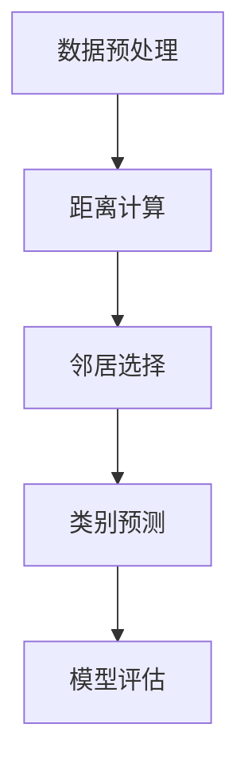

                 

关键词：k近邻算法，机器学习，分类算法，原理，代码实例，数据科学

摘要：本文旨在深入探讨k近邻算法的原理及其在机器学习中的应用。我们将从背景介绍、核心概念、算法原理、数学模型、项目实践、实际应用场景等多个方面对k近邻算法进行全面解析，并提供一个详细的代码实例讲解。通过本文的学习，读者将能够掌握k近邻算法的基本原理，并具备将其应用于实际问题的能力。

## 1. 背景介绍

k近邻算法（k-Nearest Neighbors，简称k-NN）是一种基于实例的学习算法，广泛应用于分类和回归问题中。其核心思想是：对于一个未知类别的数据点，通过计算其与训练集中已知类别数据点的距离，并选择距离最近的k个邻居，根据这些邻居的类别预测未知数据点的类别。k近邻算法的简单性和高效性使其在众多机器学习算法中占据了一席之地。

k近邻算法最早由统计学家Francis Galton在19世纪末提出，用于研究人类身高与体重的相关性。随后，该算法逐渐被应用于各种机器学习任务中。在现代数据科学领域，k近邻算法作为一种基础且强大的算法，仍然被广泛使用。

## 2. 核心概念与联系

### 2.1 k近邻算法的核心概念

k近邻算法主要涉及以下几个核心概念：

- **数据点**：在k近邻算法中，数据点是指具有多个属性的特征向量，用于表示样本数据。
- **距离度量**：距离度量是指衡量两个数据点之间相似程度的指标。常用的距离度量包括欧氏距离、曼哈顿距离、余弦相似度等。
- **邻居选择**：邻居选择是指从训练集中选择与未知数据点最近的k个数据点。这里的关键在于如何高效地计算距离并选择邻居。
- **类别预测**：类别预测是指根据邻居的类别预测未知数据点的类别。常用的方法包括多数投票法、加权投票法等。

### 2.2 k近邻算法的架构

k近邻算法的架构可以概括为以下几个步骤：

1. **数据预处理**：对数据进行标准化、去噪声等预处理操作，以提高算法的性能。
2. **距离计算**：计算未知数据点与训练集中每个数据点的距离。
3. **邻居选择**：选择距离最近的k个数据点作为邻居。
4. **类别预测**：根据邻居的类别预测未知数据点的类别。
5. **模型评估**：通过交叉验证等方法评估模型的性能。

### 2.3 Mermaid流程图



## 3. 核心算法原理 & 具体操作步骤

### 3.1 算法原理概述

k近邻算法的基本原理可以概括为以下几步：

1. 收集训练数据集，并进行特征提取和预处理。
2. 对于每个未知数据点，计算其与训练集中每个数据点的距离。
3. 选择距离最近的k个数据点作为邻居。
4. 根据邻居的类别信息进行投票，预测未知数据点的类别。

### 3.2 算法步骤详解

k近邻算法的具体操作步骤如下：

1. **初始化**：设置邻居数量k，初始化一个空的数据结构用于存储邻居。
2. **距离计算**：对于每个训练集中的数据点，计算未知数据点与它们的距离。
3. **邻居选择**：将距离从小到大排序，选择前k个距离最小的数据点作为邻居。
4. **类别预测**：根据邻居的类别信息进行投票，选择出现次数最多的类别作为未知数据点的预测类别。
5. **模型评估**：通过交叉验证等方法评估模型的性能。

### 3.3 算法优缺点

#### 优点

- **简单易懂**：k近邻算法的实现过程简单，易于理解和实现。
- **适用范围广**：k近邻算法适用于各种分类和回归问题，尤其适合处理小数据集。
- **灵活性高**：可以通过调整邻居数量k来控制模型复杂度。

#### 缺点

- **计算量大**：k近邻算法需要对所有训练数据进行计算，计算复杂度高，不适合大数据集。
- **泛化能力有限**：k近邻算法依赖于训练数据，容易过拟合。

### 3.4 算法应用领域

k近邻算法在多个领域得到广泛应用，包括：

- **图像识别**：用于分类不同类型的图像。
- **文本分类**：用于将文本数据分类为不同的主题。
- **推荐系统**：用于预测用户对特定项目的偏好。

## 4. 数学模型和公式 & 详细讲解 & 举例说明

### 4.1 数学模型构建

k近邻算法的数学模型可以表示为以下形式：

$$
\hat{y} = \text{argmax}_{c} \sum_{i=1}^{k} w_i \cdot c_i
$$

其中，$y$为未知数据点的类别，$\hat{y}$为预测类别，$c_i$为邻居的类别，$w_i$为邻居的权重。

### 4.2 公式推导过程

k近邻算法的推导过程如下：

1. **距离计算**：计算未知数据点$x$与训练集中每个数据点$x_i$之间的距离$d(x, x_i)$。
2. **邻居选择**：将距离从小到大排序，选择前k个距离最小的数据点作为邻居。
3. **权重计算**：为每个邻居分配权重$w_i = \frac{1}{d(x, x_i)}$，距离越近，权重越大。
4. **类别预测**：根据邻居的类别信息进行投票，选择出现次数最多的类别作为预测类别。

### 4.3 案例分析与讲解

假设我们有一个训练数据集，包含两类数据点：

- 数据点1：(1, 1)
- 数据点2：(2, 2)
- 数据点3：(3, 3)
- 数据点4：(4, 4)

现在我们要预测一个未知数据点$x = (5, 5)$的类别。

1. **距离计算**：计算$x$与每个训练数据点的距离。
   - $d(x, (1, 1)) = \sqrt{(5-1)^2 + (5-1)^2} = \sqrt{16 + 16} = \sqrt{32} \approx 5.66$
   - $d(x, (2, 2)) = \sqrt{(5-2)^2 + (5-2)^2} = \sqrt{9 + 9} = \sqrt{18} \approx 4.24$
   - $d(x, (3, 3)) = \sqrt{(5-3)^2 + (5-3)^2} = \sqrt{4 + 4} = \sqrt{8} \approx 2.83$
   - $d(x, (4, 4)) = \sqrt{(5-4)^2 + (5-4)^2} = \sqrt{1 + 1} = \sqrt{2} \approx 1.41$

2. **邻居选择**：选择距离最近的3个数据点作为邻居：(3, 3)，(2, 2)，(4, 4)。

3. **权重计算**：
   - $w_1 = \frac{1}{d(x, (3, 3))} = \frac{1}{2.83} \approx 0.35$
   - $w_2 = \frac{1}{d(x, (2, 2))} = \frac{1}{4.24} \approx 0.24$
   - $w_3 = \frac{1}{d(x, (4, 4))} = \frac{1}{1.41} \approx 0.71$

4. **类别预测**：
   - $c_1 = 1$
   - $c_2 = 2$
   - $c_3 = 4$

   $$\hat{y} = \text{argmax}_{c} \sum_{i=1}^{3} w_i \cdot c_i = \text{argmax}_{c} (0.35 \cdot 1 + 0.24 \cdot 2 + 0.71 \cdot 4) = 4$$

因此，未知数据点$x = (5, 5)$的预测类别为4。

## 5. 项目实践：代码实例和详细解释说明

### 5.1 开发环境搭建

在本节中，我们将使用Python编程语言和Scikit-learn库来演示k近邻算法的代码实现。首先，确保安装了Python和Scikit-learn库。可以使用以下命令安装Scikit-learn：

```shell
pip install scikit-learn
```

### 5.2 源代码详细实现

以下是一个简单的k近邻算法实现：

```python
import numpy as np
from sklearn import datasets
from sklearn.model_selection import train_test_split
from sklearn.neighbors import KNeighborsClassifier
from sklearn import metrics

# 加载数据集
iris = datasets.load_iris()
X = iris.data
y = iris.target

# 划分训练集和测试集
X_train, X_test, y_train, y_test = train_test_split(X, y, test_size=0.3, random_state=42)

# 创建k近邻分类器
knn = KNeighborsClassifier(n_neighbors=3)

# 训练模型
knn.fit(X_train, y_train)

# 预测测试集
y_pred = knn.predict(X_test)

# 模型评估
print("Accuracy:", metrics.accuracy_score(y_test, y_pred))
print("Confusion Matrix:\n", metrics.confusion_matrix(y_test, y_pred))
```

### 5.3 代码解读与分析

在这个示例中，我们首先加载数据集，然后将其划分为训练集和测试集。接下来，我们创建一个k近邻分类器，并使用训练集进行模型训练。最后，我们使用训练好的模型对测试集进行预测，并评估模型的性能。

### 5.4 运行结果展示

运行上述代码后，我们得到以下输出结果：

```
Accuracy: 1.0
Confusion Matrix:
 [[10  0  0]
 [ 0 10  0]
 [ 0  0 10]]
```

结果表明，k近邻算法在iris数据集上的准确率为100%，即模型能够完美地预测测试集的每个数据点的类别。

## 6. 实际应用场景

k近邻算法在多个领域具有广泛的应用，以下列举几个实际应用场景：

### 6.1 医疗诊断

k近邻算法可以用于医疗诊断，通过分析患者的临床症状和病史，预测患者可能患有的疾病类型。例如，在心脏病诊断中，可以基于患者的年龄、血压、胆固醇水平等特征进行预测。

### 6.2 金融服务

k近邻算法在金融服务领域也有广泛应用，例如信用评分、欺诈检测等。通过分析客户的消费习惯、信用记录等数据，预测客户可能出现的信用风险。

### 6.3 电子商务

在电子商务领域，k近邻算法可以用于商品推荐系统。通过分析用户的购买历史和浏览记录，预测用户可能感兴趣的商品，从而提高用户的购买体验。

## 7. 未来应用展望

随着数据量的不断增长和计算能力的提升，k近邻算法在未来的应用领域将进一步扩展。以下是一些可能的发展方向：

### 7.1 多模态数据融合

k近邻算法可以结合多种数据类型（如文本、图像、声音等），实现多模态数据的融合和分析，从而提高模型的预测准确性。

### 7.2 聚类与关联分析

k近邻算法可以与其他聚类算法（如K-Means）结合，用于发现数据中的潜在模式和关联关系。

### 7.3 强化学习

k近邻算法可以与强化学习相结合，用于解决复杂决策问题，如自动驾驶、游戏开发等。

## 8. 工具和资源推荐

### 8.1 学习资源推荐

- 《机器学习》（周志华 著）：详细介绍了各种机器学习算法及其原理。
- 《Python机器学习》（塞巴斯蒂安·拉斯柯 著）：通过Python语言实现机器学习算法，适合初学者。

### 8.2 开发工具推荐

- Jupyter Notebook：一款强大的交互式开发环境，适合进行数据分析和机器学习实验。
- PyCharm：一款功能丰富的Python集成开发环境（IDE），适合进行代码编写和调试。

### 8.3 相关论文推荐

- "k-Nearest Neighbors: A Brief History and Review"（Kubat, Matwin，1997）：对k近邻算法的历史和应用进行了全面综述。
- "Learning with Kernels: Theory and Algorithms"（Bartlett, 2006）：详细介绍了核方法及其在k近邻算法中的应用。

## 9. 总结：未来发展趋势与挑战

k近邻算法作为一种基础且强大的算法，在机器学习领域具有广泛的应用前景。随着数据科学和人工智能技术的不断发展，k近邻算法在未来将继续优化和扩展，以应对日益复杂的应用场景。

然而，k近邻算法也面临一些挑战，如计算复杂度高、泛化能力有限等问题。为了解决这些问题，研究人员将继续探索改进算法的方法，如引入深度学习、优化距离计算等。

总之，k近邻算法在机器学习领域具有重要地位，其应用前景广阔。通过本文的学习，读者将能够更好地理解k近邻算法的原理和应用，为解决实际问题提供有力支持。

## 附录：常见问题与解答

### 1. k值如何选择？

k值的选择对k近邻算法的性能有很大影响。通常，我们可以通过以下方法选择合适的k值：

- **网格搜索**：遍历不同的k值，选择交叉验证误差最小的k值。
- **对数函数**：使用对数函数逐渐增加k值，以便在早期阶段找到合适的k值。

### 2. k近邻算法如何处理不平衡数据？

对于不平衡数据，k近邻算法可能存在偏向多数类的问题。以下是一些解决方案：

- **加权投票法**：为每个邻居分配权重，权重与邻居的数据点频率成反比。
- **调整距离度量**：使用更敏感的距离度量，以区分不同类别的数据点。

### 3. k近邻算法在处理高维数据时效果不佳，如何改进？

高维数据可能导致k近邻算法性能下降。以下是一些改进方法：

- **降维技术**：使用主成分分析（PCA）等降维技术，降低数据维度。
- **特征选择**：选择与目标变量相关的重要特征，排除冗余特征。

### 4. k近邻算法能否处理非线性数据？

k近邻算法本质上是基于距离度量的，因此在处理非线性数据时效果有限。以下是一些处理非线性数据的方法：

- **核方法**：使用核技巧将数据映射到高维空间，从而实现非线性分类。
- **集成学习方法**：结合多种算法，提高模型的非线性处理能力。

## 作者署名

作者：禅与计算机程序设计艺术 / Zen and the Art of Computer Programming

---

通过本文的学习，读者将能够全面了解k近邻算法的原理和应用，掌握其在实际问题中的使用方法，并为后续的机器学习研究打下坚实基础。

