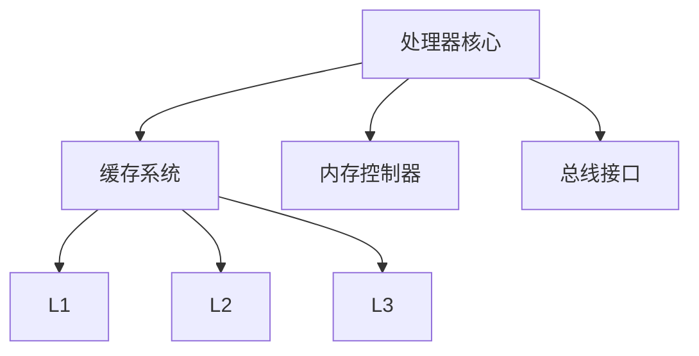

                 

关键词：x86架构、Intel处理器、编程、性能优化、指令集、多核处理

> 摘要：本文将深入探讨x86架构及其在Intel处理器中的应用，分析其在现代计算机编程中的优势，包括性能优化、多核处理和指令集的特点。通过详细讲解x86架构的核心概念、算法原理和数学模型，以及提供实际代码实例和实践应用场景，我们将全面了解x86架构的优势，并展望其未来的发展方向。

## 1. 背景介绍

### 1.1 x86架构的历史与发展

x86架构起源于1978年，由英特尔首次推出。最初，它作为Intel 8086处理器的指令集设计，用于满足个人计算机的需求。随着时间的推移，x86架构不断发展，成为全球最广泛使用的计算机架构之一。

Intel处理器的发展历程同样引人注目。从最初的8086处理器到如今的第12代酷睿处理器，Intel不断推陈出新，提高了处理器的性能、能效和功能。特别是在多核处理和并行计算方面，Intel处理器展现了强大的竞争力。

### 1.2 x86架构的核心特点

x86架构具有以下核心特点：

1. **指令集扩展**：x86指令集支持丰富的指令集，包括通用寄存器、内存操作、算术和逻辑运算等，使得编程更加灵活。

2. **多核处理**：现代x86处理器通常支持多核架构，可以在多个任务之间并行执行，提高计算效率。

3. **虚拟化支持**：x86架构具备强大的虚拟化功能，能够同时运行多个操作系统和应用程序，提高资源利用率。

4. **兼容性**：x86架构具有广泛的兼容性，可以运行多种操作系统和软件，降低了用户的迁移成本。

## 2. 核心概念与联系

### 2.1 x86架构的组成

x86架构由以下几个关键组成部分构成：

1. **处理器核心**：负责执行指令、处理数据和进行算术运算。
2. **缓存系统**：包括L1、L2和L3缓存，用于提高数据访问速度。
3. **内存控制器**：管理内存的分配和访问。
4. **总线接口**：连接处理器与其他设备，如内存、显卡等。

### 2.2 x86架构的指令集

x86指令集包括以下几类指令：

1. **数据传输指令**：用于在寄存器和内存之间传输数据。
2. **算术指令**：执行基本的算术运算，如加法、减法、乘法和除法。
3. **逻辑指令**：执行逻辑运算，如与、或、非和异或。
4. **控制流指令**：用于控制程序的执行流程，如跳转、调用和返回。
5. **字符串指令**：用于处理字符串数据，如复制、比较和搜索。

### 2.3 x86架构的架构图

下面是一个简单的x86架构图，展示了其主要组件和相互关系：



## 3. 核心算法原理 & 具体操作步骤

### 3.1 算法原理概述

x86架构的核心算法原理主要包括指令流水线技术和多级缓存机制。

1. **指令流水线技术**：通过将指令执行过程分为多个阶段，并在不同阶段之间重叠执行，提高指令的执行效率。

2. **多级缓存机制**：通过在处理器内部设置多个缓存层次，优化数据访问速度，减少内存延迟。

### 3.2 算法步骤详解

1. **指令流水线技术的具体操作步骤**：

   - 取指阶段：从内存中读取指令，并将其加载到指令缓存中。
   - 指令解码阶段：解析指令，确定指令的操作数和操作类型。
   - 执行阶段：执行指令，根据指令类型进行相应的计算或操作。
   - 写回阶段：将执行结果写回内存或寄存器。

2. **多级缓存机制的具体操作步骤**：

   - L1缓存：位于处理器核心内部，速度最快，容量较小，主要用于缓存经常访问的数据。
   - L2缓存：位于处理器核心附近，速度较快，容量较大，主要用于缓存未被L1缓存命中的数据。
   - L3缓存：位于处理器外部，速度较慢，容量最大，主要用于缓存未被L2缓存命中的数据。

### 3.3 算法优缺点

**优点**：

1. 提高指令执行效率。
2. 减少内存延迟，提高数据访问速度。
3. 支持多核处理，提高计算能力。

**缺点**：

1. 复杂性较高，需要更多的硬件资源。
2. 缓存一致性维护难度较大。

### 3.4 算法应用领域

x86架构及其算法在以下领域具有广泛的应用：

1. **高性能计算**：通过多核处理和并行计算，提高计算性能。
2. **服务器应用**：支持虚拟化和高可用性，满足企业级服务需求。
3. **嵌入式系统**：适用于需要高性能和低功耗的嵌入式应用场景。

## 4. 数学模型和公式 & 详细讲解 & 举例说明

### 4.1 数学模型构建

x86架构的性能优化涉及到多个数学模型，包括缓存命中率模型、指令流水线模型等。

### 4.2 公式推导过程

假设有一个四级缓存系统，包括L1、L2、L3和内存，我们可以使用以下公式来计算缓存命中率：

$$
Cache_Hit_Rate = \frac{L1_Hit_Rate + L2_Hit_Rate + L3_Hit_Rate + Memory_Hit_Rate}{Total_Requests}
$$

其中，每个缓存的命中率可以通过以下公式计算：

$$
L1_Hit_Rate = \frac{L1_Cache_Requests - L2_Cache_Requests - L3_Cache_Requests - Memory_Requests}{L1_Cache_Requests}
$$

$$
L2_Hit_Rate = \frac{L2_Cache_Requests - L3_Cache_Requests - Memory_Requests}{L2_Cache_Requests}
$$

$$
L3_Hit_Rate = \frac{L3_Cache_Requests - Memory_Requests}{L3_Cache_Requests}
$$

$$
Memory_Hit_Rate = \frac{Memory_Requests}{Total_Requests}
$$

### 4.3 案例分析与讲解

假设有一个应用程序，其对缓存的需求如下：

- L1缓存命中率：90%
- L2缓存命中率：80%
- L3缓存命中率：70%
- 内存命中率：30%

我们可以使用上述公式计算该应用程序的缓存命中率：

$$
Cache_Hit_Rate = \frac{0.9 + 0.8 + 0.7 + 0.3}{4} = 0.75
$$

这意味着该应用程序的缓存命中率约为75%，表示有25%的请求需要访问内存，这可能导致性能下降。

## 5. 项目实践：代码实例和详细解释说明

### 5.1 开发环境搭建

为了进行x86架构编程实践，我们需要搭建一个合适的开发环境。以下是一个简单的步骤：

1. 安装Windows或Linux操作系统。
2. 安装C/C++编译器，如GCC或Clang。
3. 安装开发工具，如Visual Studio或Eclipse。
4. 配置编译器和开发工具，确保能够编译和运行x86架构的代码。

### 5.2 源代码详细实现

以下是一个简单的C语言程序，用于演示x86架构编程：

```c
#include <stdio.h>

int main() {
    int a = 10;
    int b = 20;
    int sum = a + b;
    printf("Sum of a and b is %d\n", sum);
    return 0;
}
```

该程序实现了两个整数的加法运算，并打印结果。

### 5.3 代码解读与分析

1. **主函数**：程序从main函数开始执行，该函数是C语言程序的入口点。

2. **变量定义**：程序定义了三个整型变量a、b和sum，分别表示两个加数和结果。

3. **加法运算**：通过加法运算符`+`计算a和b的和，并将结果存储在sum变量中。

4. **打印结果**：使用`printf`函数将结果输出到控制台。

### 5.4 运行结果展示

在编译并运行该程序后，我们可以在控制台看到以下输出：

```
Sum of a and b is 30
```

这表明程序成功执行并计算了两个整数的和。

## 6. 实际应用场景

### 6.1 高性能计算

x86架构广泛应用于高性能计算领域，例如气象预报、金融模拟和生物信息学等。通过多核处理和并行计算，x86处理器能够提高计算效率，缩短计算时间。

### 6.2 服务器应用

x86处理器在服务器应用中也发挥着重要作用。其强大的虚拟化功能支持多个虚拟机同时运行，提高资源利用率。此外，x86处理器的高可靠性和高性能也使其成为企业级服务器的首选。

### 6.3 嵌入式系统

x86架构在嵌入式系统中也有一定的应用，尤其是在需要高性能和低功耗的场合。通过优化代码和硬件设计，嵌入式系统可以使用x86架构实现高效、低功耗的运行。

### 6.4 未来应用展望

随着人工智能和物联网的快速发展，x86架构在未来的应用前景广阔。在人工智能领域，x86处理器可以支持深度学习框架和机器学习算法，提高计算性能。在物联网领域，x86处理器可以用于智能终端和边缘计算，实现高效的数据处理和通信。

## 7. 工具和资源推荐

### 7.1 学习资源推荐

1. **《x86汇编语言：从实模式到保护模式》**：一本经典的x86汇编语言教材，适合初学者入门。
2. **Intel官方文档**：包括x86架构的详细规范、指令集和编程指南，是学习x86架构的权威资源。

### 7.2 开发工具推荐

1. **Visual Studio**：一款功能强大的集成开发环境，支持C/C++编程，具有丰富的调试和优化工具。
2. **GDB**：一款开源的调试工具，适用于Linux和Windows平台，可以帮助开发者调试C/C++程序。

### 7.3 相关论文推荐

1. **"x86 Architecture and Its Applications"**：一篇综述性论文，全面介绍了x86架构的历史、发展和应用。
2. **"Cache Coherence in x86 Multicores"**：一篇关于x86架构多核缓存一致性的论文，探讨了多核处理器的缓存设计和优化策略。

## 8. 总结：未来发展趋势与挑战

### 8.1 研究成果总结

x86架构在过去的几十年中取得了显著的成果，包括性能优化、多核处理和虚拟化技术的不断进步。这些研究成果为现代计算机系统的发展提供了强有力的支持。

### 8.2 未来发展趋势

1. **更高效的指令集**：随着处理器技术的发展，未来可能引入更高效的指令集，进一步提高性能。
2. **更灵活的架构设计**：结合不同架构的优势，设计更灵活的混合架构，满足多样化的应用需求。
3. **人工智能与物联网的结合**：利用x86架构在人工智能和物联网领域的优势，推动跨领域的技术融合和创新。

### 8.3 面临的挑战

1. **能效挑战**：随着处理器性能的提高，如何平衡性能和能效成为重要挑战。
2. **安全性挑战**：随着网络攻击的日益严重，如何提高处理器的安全性成为关键问题。
3. **生态系统的支持**：如何构建完善的软件开发和硬件生态系统，支持x86架构的发展。

### 8.4 研究展望

未来，x86架构将继续发展，结合新技术和应用需求，为计算机系统的发展提供持续的动力。研究人员和工程师应关注这些挑战，积极探索新的解决方案，推动x86架构在未来的发展。

## 9. 附录：常见问题与解答

### 9.1 x86架构与ARM架构的区别

x86架构和ARM架构是两种不同的计算机架构。主要区别包括：

1. **指令集**：x86架构采用复杂的指令集，而ARM架构采用精简指令集。
2. **性能**：x86架构在性能上通常优于ARM架构，但功耗较高。
3. **市场占有率**：x86架构在个人计算机和服务器领域占主导地位，而ARM架构在嵌入式系统和移动设备中应用广泛。

### 9.2 如何优化x86架构的性能

优化x86架构性能的方法包括：

1. **指令重排**：优化指令的执行顺序，减少指令之间的依赖关系。
2. **缓存优化**：合理设计缓存层次，提高缓存命中率。
3. **并行计算**：利用多核处理器的并行计算能力，提高程序执行效率。

### 9.3 x86架构的发展趋势

x86架构的发展趋势包括：

1. **性能提升**：通过改进指令集、缓存设计和多核处理技术，提高处理器性能。
2. **能效优化**：通过低功耗设计和技术，提高处理器的能效。
3. **生态系统建设**：完善软件开发和硬件生态系统，支持x86架构的应用和推广。

---

作者：禅与计算机程序设计艺术 / Zen and the Art of Computer Programming

