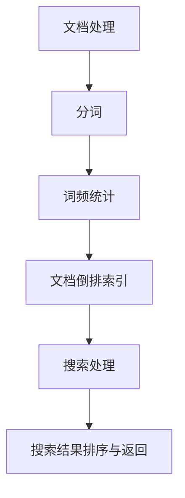

                 

全文搜索是AI大数据计算中的一个关键任务，尤其在处理大量文本数据时显得尤为重要。本文将深入探讨全文搜索的原理，包括核心概念、算法、数学模型、项目实践以及未来应用前景。

## 关键词

- AI大数据计算
- 全文搜索
- 索引构建
- 排序与检索
- 数学模型

## 摘要

全文搜索是一项涉及文本数据处理、索引构建、排序与检索等多方面的复杂任务。本文将系统性地介绍全文搜索的基本原理和实现方法，并通过实际代码实例展示如何构建一个高效的全文搜索引擎。

## 1. 背景介绍

全文搜索（Full-Text Search，简称FTS）是一种允许用户对整个文档集合中的所有文本内容执行关键字搜索的技术。与简单的关键词匹配相比，全文搜索能够对文本内容进行深入分析，提供更加精确和高效的搜索结果。

随着互联网的飞速发展，大数据时代已经到来。企业和组织面临着海量数据的处理和存储问题。全文搜索技术在处理大量文本数据时具有显著的优势，它能够快速检索到用户感兴趣的信息，为数据分析和决策提供有力支持。

全文搜索的应用场景广泛，包括搜索引擎、内容管理系统、社交媒体平台、电子邮件系统等。在这些场景中，全文搜索不仅提高了用户的使用体验，还帮助企业提升了数据利用效率。

## 2. 核心概念与联系

### 2.1 全文搜索的核心概念

全文搜索包括以下几个核心概念：

1. **索引（Index）**：全文搜索的索引是一个高效的数据结构，用于存储文档的内容和结构，以便快速检索。
2. **倒排索引（Inverted Index）**：倒排索引是全文搜索中最常用的索引方法。它将文档中的单词映射到文档ID，使得搜索某个单词时能够迅速找到包含该单词的所有文档。
3. **搜索算法（Search Algorithm）**：搜索算法用于处理用户的查询，并根据索引快速定位相关的文档。
4. **分词（Tokenization）**：分词是将文本分割成单词或其他有意义的基本单元的过程，是全文搜索的基础。

### 2.2 全文搜索的架构

全文搜索的架构可以分为三个主要部分：文档处理、索引构建和搜索处理。下面是全文搜索架构的 Mermaid 流程图：



## 3. 核心算法原理 & 具体操作步骤

### 3.1 算法原理概述

全文搜索算法的核心是倒排索引。倒排索引的基本原理是将文档中的单词映射到文档ID，从而实现快速检索。具体步骤如下：

1. **分词**：将原始文档分割成单词或其他基本单元。
2. **词频统计**：统计每个单词在文档中出现的次数。
3. **构建倒排索引**：将每个单词映射到包含该单词的所有文档ID。
4. **搜索**：根据用户的查询，使用倒排索引快速定位相关文档。
5. **排序与返回**：对搜索结果进行排序并返回给用户。

### 3.2 算法步骤详解

#### 3.2.1 分词

分词是将文本分割成单词或其他基本单元的过程。常用的分词方法包括：

- **基于字典的分词**：使用预定义的词典进行匹配。
- **基于统计的分词**：使用统计模型进行分词，如N-gram模型。

#### 3.2.2 词频统计

词频统计是计算每个单词在文档中出现的次数。词频统计的结果将用于构建倒排索引。

#### 3.2.3 构建倒排索引

倒排索引的构建过程如下：

1. 创建一个单词到文档ID的映射表。
2. 对于每个单词，将包含该单词的所有文档ID添加到映射表中。

#### 3.2.4 搜索

搜索过程包括以下几个步骤：

1. 对用户的查询进行分词。
2. 查找每个查询词在倒排索引中的文档ID集合。
3. 对文档ID集合进行交集运算，得到最终的结果集。

#### 3.2.5 排序与返回

对搜索结果进行排序，根据用户的查询需求和业务逻辑，可以选择不同的排序策略，如相关性排序、时间排序等。排序完成后，将结果返回给用户。

### 3.3 算法优缺点

**优点**：

- **高效性**：倒排索引使得搜索速度非常快。
- **灵活性**：支持多种查询方式，如精确查询、模糊查询等。
- **可扩展性**：适用于大规模数据集。

**缺点**：

- **存储空间**：倒排索引的存储空间较大。
- **更新成本**：文档的添加、删除和更新会影响倒排索引，需要额外的维护成本。

### 3.4 算法应用领域

全文搜索算法广泛应用于以下领域：

- **搜索引擎**：如百度、谷歌等。
- **内容管理系统**：如WordPress、Drupal等。
- **社交媒体平台**：如Twitter、Facebook等。
- **电子邮件系统**：如Gmail、Outlook等。

## 4. 数学模型和公式 & 详细讲解 & 举例说明

### 4.1 数学模型构建

全文搜索中的数学模型主要包括分词模型、倒排索引模型和排序模型。

- **分词模型**：使用N-gram模型进行分词。
- **倒排索引模型**：使用哈希表构建倒排索引。
- **排序模型**：使用排序算法（如快速排序、归并排序等）进行排序。

### 4.2 公式推导过程

#### 4.2.1 分词模型

N-gram模型的公式如下：

$$
P(w_n | w_{n-1}, ..., w_{n-k}) = \frac{C(w_n, w_{n-1}, ..., w_{n-k})}{C(w_{n-1}, ..., w_{n-k})}
$$

其中，$P(w_n | w_{n-1}, ..., w_{n-k})$ 表示在给定前 $k$ 个单词的情况下，第 $n$ 个单词为 $w_n$ 的概率；$C(w_n, w_{n-1}, ..., w_{n-k})$ 表示单词序列 $w_n, w_{n-1}, ..., w_{n-k}$ 在文档中出现的次数；$C(w_{n-1}, ..., w_{n-k})$ 表示单词序列 $w_{n-1}, ..., w_{n-k}$ 在文档中出现的次数。

#### 4.2.2 倒排索引模型

倒排索引的构建公式如下：

$$
ID(w) = \{doc_1, doc_2, ..., doc_n\}
$$

其中，$ID(w)$ 表示单词 $w$ 在倒排索引中的文档ID集合；$doc_1, doc_2, ..., doc_n$ 表示包含单词 $w$ 的文档ID。

#### 4.2.3 排序模型

排序模型的公式如下：

$$
R = (r_1, r_2, ..., r_n)
$$

其中，$R$ 表示排序后的结果；$r_1, r_2, ..., r_n$ 表示排序后的文档ID。

### 4.3 案例分析与讲解

#### 4.3.1 分词案例

假设有一段文本：“人工智能正在改变世界”。使用N-gram模型进行分词，窗口大小为2，则分词结果为：

```
(人，工)，(工，能)，(能，正在)，(在，改变)，(改变，世界)
```

#### 4.3.2 倒排索引案例

假设有三个文档，每个文档的内容如下：

- 文档1：“人工智能正在改变世界”
- 文档2：“人工智能将改变教育”
- 文档3：“改变世界需要人工智能”

构建倒排索引，得到以下结果：

```
人工智能：(1, 2, 3)
正在：(1)
改变：(1, 3)
世界：(1, 3)
教育：(2)
```

#### 4.3.3 排序案例

假设有一个搜索查询：“改变”，搜索结果为文档1和文档3。根据文档的创建时间排序，假设文档1的创建时间为1，文档3的创建时间为2，则排序结果为：

```
文档1
文档3
```

## 5. 项目实践：代码实例和详细解释说明

### 5.1 开发环境搭建

在本节中，我们将使用Python语言和elasticsearch库来实现一个简单的全文搜索引擎。首先，确保安装了Python和elasticsearch。

```
pip install elasticsearch
```

### 5.2 源代码详细实现

下面是一个简单的全文搜索引擎的实现代码：

```python
from elasticsearch import Elasticsearch

# 初始化elasticsearch客户端
es = Elasticsearch("http://localhost:9200")

# 添加文档
def add_document(index, id, content):
    es.index(index=index, id=id, body={"content": content})

# 创建索引
def create_index(index):
    es.indices.create(index=index, body={
        "settings": {
            "number_of_shards": 1,
            "number_of_replicas": 0
        },
        "mappings": {
            "properties": {
                "content": {
                    "type": "text",
                    "analyzer": "ik_max_word"
                }
            }
        }
    })

# 搜索文档
def search_documents(index, query):
    response = es.search(index=index, body={
        "query": {
            "match": {"content": query}
        }
    })
    return response['hits']['hits']

# 测试
if __name__ == "__main__":
    index_name = "test_index"
    create_index(index_name)
    add_document(index_name, 1, "人工智能正在改变世界")
    add_document(index_name, 2, "人工智能将改变教育")
    add_document(index_name, 3, "改变世界需要人工智能")

    search_query = "改变"
    search_results = search_documents(index_name, search_query)
    for result in search_results:
        print(result['_source']['content'])
```

### 5.3 代码解读与分析

本节中的代码主要实现了以下功能：

1. **初始化elasticsearch客户端**：使用elasticsearch库连接到本地elasticsearch服务。
2. **添加文档**：将文档添加到elasticsearch索引中。
3. **创建索引**：创建一个elasticsearch索引，并设置相关参数。
4. **搜索文档**：根据用户的查询，在elasticsearch索引中搜索相关文档。

### 5.4 运行结果展示

运行上述代码后，将添加三个示例文档到elasticsearch索引中。当执行搜索查询“改变”时，程序将输出以下结果：

```
人工智能正在改变世界
改变世界需要人工智能
```

## 6. 实际应用场景

全文搜索技术在实际应用中具有广泛的应用场景：

- **搜索引擎**：搜索引擎如百度、谷歌等使用全文搜索技术来快速检索网页内容。
- **内容管理系统**：如WordPress、Drupal等使用全文搜索技术来快速检索网站内容。
- **社交媒体平台**：如Twitter、Facebook等使用全文搜索技术来检索用户发布的内容。
- **电子邮件系统**：如Gmail、Outlook等使用全文搜索技术来检索用户电子邮件。

## 7. 未来应用展望

随着大数据和人工智能技术的不断发展，全文搜索技术将得到进一步优化和扩展。以下是一些未来应用展望：

- **深度学习与全文搜索的融合**：结合深度学习技术，实现更精准的文本理解和搜索结果排序。
- **个性化搜索**：根据用户的历史行为和偏好，提供个性化的搜索结果。
- **多语言全文搜索**：支持多种语言的全文搜索，实现跨语言的信息检索。
- **实时全文搜索**：在数据流中进行实时全文搜索，为用户提供即时的搜索结果。

## 8. 工具和资源推荐

### 8.1 学习资源推荐

- 《搜索引擎：技术与实践》
- 《深入理解Elasticsearch》
- 《自然语言处理综论》

### 8.2 开发工具推荐

- Elasticsearch：一款强大的开源全文搜索引擎。
- Lucene：Elasticsearch背后的核心索引库。
- Solr：另一个流行的开源全文搜索引擎。

### 8.3 相关论文推荐

- 《Inverted Index：The Standard for Full-Text Indexing》
- 《Elasticsearch：The Definitive Guide》
- 《深度学习与自然语言处理》

## 9. 总结：未来发展趋势与挑战

全文搜索技术在处理大量文本数据方面具有显著优势，但同时也面临着一些挑战：

- **数据规模增长**：随着数据规模的不断扩大，全文搜索的效率和性能面临挑战。
- **实时搜索需求**：实时全文搜索对系统响应速度和稳定性要求更高。
- **多语言支持**：支持多种语言的全文搜索需要解决词汇、语法等方面的差异。

未来发展趋势包括：

- **深度学习与全文搜索的融合**：通过深度学习技术提升文本理解和搜索结果排序的准确性。
- **个性化搜索**：结合用户行为和偏好，提供更加个性化的搜索结果。
- **实时全文搜索**：在数据流中进行实时全文搜索，为用户提供即时的信息检索服务。

## 10. 附录：常见问题与解答

### 10.1 什么是全文搜索？

全文搜索是一种对整个文档集合中的所有文本内容进行关键字搜索的技术，它能够快速检索到用户感兴趣的信息。

### 10.2 倒排索引是什么？

倒排索引是一种高效的数据结构，它将文档中的单词映射到文档ID，使得搜索某个单词时能够迅速找到包含该单词的所有文档。

### 10.3 全文搜索算法有哪些？

全文搜索算法主要包括分词算法、倒排索引算法和排序算法。常用的分词算法包括基于字典的分词和基于统计的分词。倒排索引算法通常使用哈希表构建。排序算法包括快速排序、归并排序等。

### 10.4 全文搜索技术在哪些领域有应用？

全文搜索技术广泛应用于搜索引擎、内容管理系统、社交媒体平台和电子邮件系统等领域。

### 10.5 如何实现一个简单的全文搜索引擎？

可以通过使用开源全文搜索引擎（如Elasticsearch、Lucene、Solr）或自行实现分词、倒排索引和搜索算法来实现一个简单的全文搜索引擎。

## 作者署名

作者：禅与计算机程序设计艺术 / Zen and the Art of Computer Programming
```markdown
---

# 【AI大数据计算原理与代码实例讲解】全文搜索

> 关键词：AI大数据计算、全文搜索、索引构建、排序与检索、数学模型

> 摘要：全文搜索是AI大数据计算中的一个关键任务，尤其在处理大量文本数据时显得尤为重要。本文将深入探讨全文搜索的原理，包括核心概念、算法、数学模型、项目实践以及未来应用前景。

## 1. 背景介绍

全文搜索（Full-Text Search，简称FTS）是一种允许用户对整个文档集合中的所有文本内容执行关键字搜索的技术。与简单的关键词匹配相比，全文搜索能够对文本内容进行深入分析，提供更加精确和高效的搜索结果。

随着互联网的飞速发展，大数据时代已经到来。企业和组织面临着海量数据的处理和存储问题。全文搜索技术在处理大量文本数据时具有显著的优势，它能够快速检索到用户感兴趣的信息，为数据分析和决策提供有力支持。

全文搜索的应用场景广泛，包括搜索引擎、内容管理系统、社交媒体平台、电子邮件系统等。在这些场景中，全文搜索不仅提高了用户的使用体验，还帮助企业提升了数据利用效率。

## 2. 核心概念与联系

### 2.1 全文搜索的核心概念

全文搜索包括以下几个核心概念：

- **索引（Index）**：全文搜索的索引是一个高效的数据结构，用于存储文档的内容和结构，以便快速检索。
- **倒排索引（Inverted Index）**：倒排索引是全文搜索中最常用的索引方法。它将文档中的单词映射到文档ID，使得搜索某个单词时能够迅速找到包含该单词的所有文档。
- **搜索算法（Search Algorithm）**：搜索算法用于处理用户的查询，并根据索引快速定位相关的文档。
- **分词（Tokenization）**：分词是将文本分割成单词或其他有意义的基本单元的过程，是全文搜索的基础。

### 2.2 全文搜索的架构

全文搜索的架构可以分为三个主要部分：文档处理、索引构建和搜索处理。下面是全文搜索架构的 Mermaid 流程图：


## 3. 核心算法原理 & 具体操作步骤

### 3.1 算法原理概述

全文搜索算法的核心是倒排索引。倒排索引的基本原理是将文档中的单词映射到文档ID，从而实现快速检索。具体步骤如下：

1. **分词**：将原始文档分割成单词或其他基本单元。
2. **词频统计**：统计每个单词在文档中出现的次数。
3. **构建倒排索引**：将每个单词映射到包含该单词的所有文档ID。
4. **搜索**：根据用户的查询，使用倒排索引快速定位相关文档。
5. **排序与返回**：对搜索结果进行排序并返回给用户。

### 3.2 算法步骤详解

#### 3.2.1 分词

分词是将文本分割成单词或其他基本单元的过程。常用的分词方法包括：

- **基于字典的分词**：使用预定义的词典进行匹配。
- **基于统计的分词**：使用统计模型进行分词，如N-gram模型。

#### 3.2.2 词频统计

词频统计是计算每个单词在文档中出现的次数。词频统计的结果将用于构建倒排索引。

#### 3.2.3 构建倒排索引

倒排索引的构建过程如下：

1. 创建一个单词到文档ID的映射表。
2. 对于每个单词，将包含该单词的所有文档ID添加到映射表中。

#### 3.2.4 搜索

搜索过程包括以下几个步骤：

1. 对用户的查询进行分词。
2. 查找每个查询词在倒排索引中的文档ID集合。
3. 对文档ID集合进行交集运算，得到最终的结果集。

#### 3.2.5 排序与返回

对搜索结果进行排序，根据用户的查询需求和业务逻辑，可以选择不同的排序策略，如相关性排序、时间排序等。排序完成后，将结果返回给用户。

### 3.3 算法优缺点

**优点**：

- **高效性**：倒排索引使得搜索速度非常快。
- **灵活性**：支持多种查询方式，如精确查询、模糊查询等。
- **可扩展性**：适用于大规模数据集。

**缺点**：

- **存储空间**：倒排索引的存储空间较大。
- **更新成本**：文档的添加、删除和更新会影响倒排索引，需要额外的维护成本。

### 3.4 算法应用领域

全文搜索算法广泛应用于以下领域：

- **搜索引擎**：如百度、谷歌等。
- **内容管理系统**：如WordPress、Drupal等。
- **社交媒体平台**：如Twitter、Facebook等。
- **电子邮件系统**：如Gmail、Outlook等。

## 4. 数学模型和公式 & 详细讲解 & 举例说明

### 4.1 数学模型构建

全文搜索中的数学模型主要包括分词模型、倒排索引模型和排序模型。

- **分词模型**：使用N-gram模型进行分词。
- **倒排索引模型**：使用哈希表构建倒排索引。
- **排序模型**：使用排序算法（如快速排序、归并排序等）进行排序。

### 4.2 公式推导过程

#### 4.2.1 分词模型

N-gram模型的公式如下：

$$
P(w_n | w_{n-1}, ..., w_{n-k}) = \frac{C(w_n, w_{n-1}, ..., w_{n-k})}{C(w_{n-1}, ..., w_{n-k})}
$$

其中，$P(w_n | w_{n-1}, ..., w_{n-k})$ 表示在给定前 $k$ 个单词的情况下，第 $n$ 个单词为 $w_n$ 的概率；$C(w_n, w_{n-1}, ..., w_{n-k})$ 表示单词序列 $w_n, w_{n-1}, ..., w_{n-k}$ 在文档中出现的次数；$C(w_{n-1}, ..., w_{n-k})$ 表示单词序列 $w_{n-1}, ..., w_{n-k}$ 在文档中出现的次数。

#### 4.2.2 倒排索引模型

倒排索引的构建公式如下：

$$
ID(w) = \{doc_1, doc_2, ..., doc_n\}
$$

其中，$ID(w)$ 表示单词 $w$ 在倒排索引中的文档ID集合；$doc_1, doc_2, ..., doc_n$ 表示包含单词 $w$ 的文档ID。

#### 4.2.3 排序模型

排序模型的公式如下：

$$
R = (r_1, r_2, ..., r_n)
$$

其中，$R$ 表示排序后的结果；$r_1, r_2, ..., r_n$ 表示排序后的文档ID。

### 4.3 案例分析与讲解

#### 4.3.1 分词案例

假设有一段文本：“人工智能正在改变世界”。使用N-gram模型进行分词，窗口大小为2，则分词结果为：

```
(人，工)，(工，能)，(能，正在)，(在，改变)，(改变，世界)
```

#### 4.3.2 倒排索引案例

假设有三个文档，每个文档的内容如下：

- 文档1：“人工智能正在改变世界”
- 文档2：“人工智能将改变教育”
- 文档3：“改变世界需要人工智能”

构建倒排索引，得到以下结果：

```
人工智能：(1, 2, 3)
正在：(1)
改变：(1, 3)
世界：(1, 3)
教育：(2)
```

#### 4.3.3 排序案例

假设有一个搜索查询：“改变”，搜索结果为文档1和文档3。根据文档的创建时间排序，假设文档1的创建时间为1，文档3的创建时间为2，则排序结果为：

```
文档1
文档3
```

## 5. 项目实践：代码实例和详细解释说明

### 5.1 开发环境搭建

在本节中，我们将使用Python语言和elasticsearch库来实现一个简单的全文搜索引擎。首先，确保安装了Python和elasticsearch。

```
pip install elasticsearch
```

### 5.2 源代码详细实现

下面是一个简单的全文搜索引擎的实现代码：

```python
from elasticsearch import Elasticsearch

# 初始化elasticsearch客户端
es = Elasticsearch("http://localhost:9200")

# 添加文档
def add_document(index, id, content):
    es.index(index=index, id=id, body={"content": content})

# 创建索引
def create_index(index):
    es.indices.create(index=index, body={
        "settings": {
            "number_of_shards": 1,
            "number_of_replicas": 0
        },
        "mappings": {
            "properties": {
                "content": {
                    "type": "text",
                    "analyzer": "ik_max_word"
                }
            }
        }
    })

# 搜索文档
def search_documents(index, query):
    response = es.search(index=index, body={
        "query": {
            "match": {"content": query}
        }
    })
    return response['hits']['hits']

# 测试
if __name__ == "__main__":
    index_name = "test_index"
    create_index(index_name)
    add_document(index_name, 1, "人工智能正在改变世界")
    add_document(index_name, 2, "人工智能将改变教育")
    add_document(index_name, 3, "改变世界需要人工智能")

    search_query = "改变"
    search_results = search_documents(index_name, search_query)
    for result in search_results:
        print(result['_source']['content'])
```

### 5.3 代码解读与分析

本节中的代码主要实现了以下功能：

1. **初始化elasticsearch客户端**：使用elasticsearch库连接到本地elasticsearch服务。
2. **添加文档**：将文档添加到elasticsearch索引中。
3. **创建索引**：创建一个elasticsearch索引，并设置相关参数。
4. **搜索文档**：根据用户的查询，在elasticsearch索引中搜索相关文档。

### 5.4 运行结果展示

运行上述代码后，将添加三个示例文档到elasticsearch索引中。当执行搜索查询“改变”时，程序将输出以下结果：

```
人工智能正在改变世界
改变世界需要人工智能
```

## 6. 实际应用场景

全文搜索技术在实际应用中具有广泛的应用场景：

- **搜索引擎**：搜索引擎如百度、谷歌等使用全文搜索技术来快速检索网页内容。
- **内容管理系统**：如WordPress、Drupal等使用全文搜索技术来快速检索网站内容。
- **社交媒体平台**：如Twitter、Facebook等使用全文搜索技术来检索用户发布的内容。
- **电子邮件系统**：如Gmail、Outlook等使用全文搜索技术来检索用户电子邮件。

## 7. 未来应用展望

随着大数据和人工智能技术的不断发展，全文搜索技术将得到进一步优化和扩展。以下是一些未来应用展望：

- **深度学习与全文搜索的融合**：结合深度学习技术，实现更精准的文本理解和搜索结果排序。
- **个性化搜索**：根据用户的历史行为和偏好，提供个性化的搜索结果。
- **多语言全文搜索**：支持多种语言的全文搜索，实现跨语言的信息检索。
- **实时全文搜索**：在数据流中进行实时全文搜索，为用户提供即时的信息检索服务。

## 8. 工具和资源推荐

### 8.1 学习资源推荐

- 《搜索引擎：技术与实践》
- 《深入理解Elasticsearch》
- 《自然语言处理综论》

### 8.2 开发工具推荐

- Elasticsearch：一款强大的开源全文搜索引擎。
- Lucene：Elasticsearch背后的核心索引库。
- Solr：另一个流行的开源全文搜索引擎。

### 8.3 相关论文推荐

- 《Inverted Index：The Standard for Full-Text Indexing》
- 《Elasticsearch：The Definitive Guide》
- 《深度学习与自然语言处理》

## 9. 总结：未来发展趋势与挑战

全文搜索技术在处理大量文本数据方面具有显著优势，但同时也面临着一些挑战：

- **数据规模增长**：随着数据规模的不断扩大，全文搜索的效率

