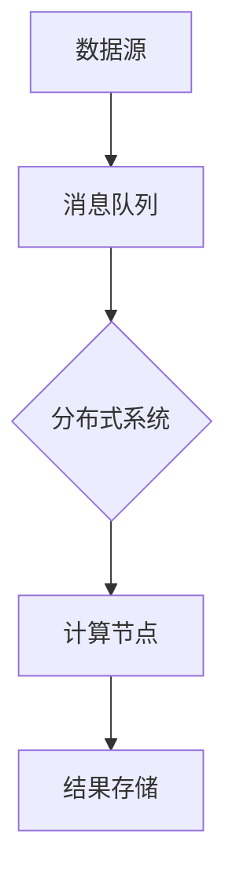

                 

关键词：AI大数据，流处理，实时计算，分布式系统，消息队列，框架设计，算法优化，资源管理，案例研究

> 摘要：本文深入探讨了AI大数据计算中的流处理原理，结合实际代码实例，全面分析了流处理技术在不同应用场景中的优势与挑战，旨在为读者提供全面的流处理技术指南。

## 1. 背景介绍

随着互联网和物联网的飞速发展，数据量呈现出爆炸式增长，传统批处理方式已无法满足实时数据处理的需求。流处理技术作为一种能够实现实时数据处理的计算模式，逐渐成为大数据领域的研究热点。本文将围绕流处理的核心原理、算法、模型以及实际应用进行详细讲解。

### 1.1 流处理的定义与特点

流处理（Stream Processing）是指对数据流进行实时处理的一种计算模式。它具有以下特点：

- **实时性**：能够实时接收和处理数据流。
- **低延迟**：相较于批处理，流处理能够提供更低的延迟。
- **高吞吐量**：能够处理大规模的数据流。
- **弹性伸缩**：根据数据量动态调整资源。

### 1.2 流处理的应用场景

流处理技术广泛应用于以下几个方面：

- **金融交易监控**：实时监控股票交易，发现异常交易行为。
- **社交网络分析**：实时分析用户行为，推送个性化内容。
- **物联网监控**：实时监控传感器数据，预测设备故障。
- **日志分析**：实时处理和分析系统日志，快速发现潜在问题。

## 2. 核心概念与联系

流处理技术涉及多个核心概念，包括分布式系统、消息队列、计算框架等。以下是这些概念的联系及其在流处理中的应用：

### 2.1 分布式系统

分布式系统是由多个节点组成的系统，这些节点通过网络进行通信。在流处理中，分布式系统用于处理大规模数据流，实现并行计算和负载均衡。

### 2.2 消息队列

消息队列是用于在分布式系统中传输消息的中间件，它能够确保消息的可靠传输和有序处理。在流处理中，消息队列用于将数据流分解为多个消息，并传输到不同的处理节点。

### 2.3 计算框架

计算框架是用于实现流处理的核心组件，它包括数据流引擎、任务调度器、资源管理等。常见的流处理框架有Apache Flink、Apache Storm和Apache Kafka等。

### 2.4 Mermaid 流程图



## 3. 核心算法原理 & 具体操作步骤

### 3.1 算法原理概述

流处理算法的核心是处理数据流，常见的算法包括窗口算法、流聚合、模式识别等。以下是这些算法的基本原理：

- **窗口算法**：对一段时间内的数据进行聚合处理。
- **流聚合**：对数据流进行分组和聚合操作。
- **模式识别**：通过机器学习算法对数据流进行模式识别。

### 3.2 算法步骤详解

#### 窗口算法

窗口算法的步骤如下：

1. 初始化窗口。
2. 添加新数据到窗口。
3. 对窗口中的数据进行处理。
4. 判断窗口是否需要移动，如果需要，移动窗口。

#### 流聚合

流聚合的步骤如下：

1. 初始化聚合器。
2. 添加新数据到聚合器。
3. 对聚合器中的数据进行聚合操作。
4. 将聚合结果输出。

#### 模式识别

模式识别的步骤如下：

1. 初始化模型。
2. 收集数据流。
3. 训练模型。
4. 应用模型对新的数据进行预测。

### 3.3 算法优缺点

- **窗口算法**：优点是能够实现实时数据处理，缺点是处理复杂度较高。
- **流聚合**：优点是能够实现高效的批量处理，缺点是实时性较差。
- **模式识别**：优点是能够实现自动化的数据处理，缺点是需要大量的数据和计算资源。

### 3.4 算法应用领域

- **窗口算法**：应用于实时数据分析、实时监控等场景。
- **流聚合**：应用于日志分析、数据统计等场景。
- **模式识别**：应用于智能推荐、异常检测等场景。

## 4. 数学模型和公式 & 详细讲解 & 举例说明

### 4.1 数学模型构建

流处理中的数学模型主要包括以下几种：

- **窗口函数**：用于计算一段时间内的数据聚合结果。
- **流聚合函数**：用于对数据进行分组和聚合。
- **模式识别模型**：用于预测和分类数据流。

### 4.2 公式推导过程

窗口函数的公式如下：

$$
W_t = \sum_{i=1}^{n} x_i
$$

其中，\(W_t\) 表示第 \(t\) 个窗口的数据聚合结果，\(x_i\) 表示窗口中的第 \(i\) 个数据。

流聚合函数的公式如下：

$$
G_t = \sum_{i=1}^{n} x_i
$$

其中，\(G_t\) 表示第 \(t\) 个数据流的聚合结果，\(x_i\) 表示数据流中的第 \(i\) 个数据。

模式识别模型的公式如下：

$$
P(x) = f(x, \theta)
$$

其中，\(P(x)\) 表示模型对数据 \(x\) 的预测结果，\(f(x, \theta)\) 表示模型对数据的预测函数，\(\theta\) 表示模型的参数。

### 4.3 案例分析与讲解

#### 案例一：窗口算法

假设我们有一个电商网站的交易数据流，我们需要计算过去 1 分钟内的订单数量。我们可以使用窗口算法来实现：

1. 初始化窗口为空。
2. 每当收到一个新的订单数据时，将其添加到窗口。
3. 当窗口中的数据超过 1 分钟时，对窗口中的数据进行聚合，计算订单数量，并将结果输出。
4. 移动窗口，将最新的订单数据纳入窗口，移除窗口中超过 1 分钟的订单数据。

#### 案例二：流聚合

假设我们有一个社交网络平台的数据流，我们需要计算每个用户在过去一天内的点赞数量。我们可以使用流聚合算法来实现：

1. 初始化聚合器为空。
2. 每当收到一个新的点赞数据时，将其添加到聚合器。
3. 当聚合器中的数据超过一天时，对聚合器中的数据进行分组和聚合，计算每个用户的点赞数量，并将结果输出。
4. 清空聚合器，重新开始计算。

#### 案例三：模式识别

假设我们有一个异常交易检测系统，我们需要检测异常交易行为。我们可以使用模式识别算法来实现：

1. 初始化异常检测模型。
2. 收集交易数据流。
3. 使用模型对交易数据进行预测。
4. 当预测结果为异常时，输出预警信息。

## 5. 项目实践：代码实例和详细解释说明

### 5.1 开发环境搭建

为了演示流处理技术的应用，我们将使用Apache Flink作为流处理框架，搭建一个简单的实时交易监控项目。以下是开发环境的搭建步骤：

1. 下载并安装Java开发工具包（JDK）。
2. 下载并解压Apache Flink的安装包。
3. 配置Flink的环境变量。
4. 编写Flink应用程序。

### 5.2 源代码详细实现

以下是Flink应用程序的源代码实现：

```java
import org.apache.flink.api.common.functions.MapFunction;
import org.apache.flink.api.java.tuple.Tuple2;
import org.apache.flink.streaming.api.datastream.DataStream;
import org.apache.flink.streaming.api.environment.StreamExecutionEnvironment;

public class TransactionMonitoring {
    public static void main(String[] args) throws Exception {
        // 创建Flink执行环境
        final StreamExecutionEnvironment env = StreamExecutionEnvironment.getExecutionEnvironment();

        // 创建数据源，模拟交易数据流
        DataStream<String> transactionStream = env.addSource(new TransactionSource());

        // 解析交易数据，提取订单编号和交易金额
        DataStream<Tuple2<String, Double>> transactionMap = transactionStream
                .map(new MapFunction<String, Tuple2<String, Double>>() {
                    @Override
                    public Tuple2<String, Double> map(String transaction) {
                        String[] parts = transaction.split(",");
                        return new Tuple2<>(parts[0], Double.parseDouble(parts[1]));
                    }
                });

        // 计算过去 1 分钟内的订单总额
        DataStream<Tuple2<String, Double>> transactionSum = transactionMap
                .keyBy(0)
                .timeWindow(Time.minutes(1))
                .sum(1);

        // 打印结果
        transactionSum.print();

        // 执行Flink应用程序
        env.execute("Transaction Monitoring");
    }
}
```

### 5.3 代码解读与分析

- **创建Flink执行环境**：使用`StreamExecutionEnvironment.getExecutionEnvironment()`方法创建Flink执行环境。
- **创建数据源**：使用`env.addSource(new TransactionSource())`方法添加模拟交易数据源。
- **解析交易数据**：使用`map`函数将交易数据解析为订单编号和交易金额的二元组。
- **计算订单总额**：使用`keyBy`和`timeWindow`方法对交易数据按订单编号分组，并设置窗口时间为 1 分钟，使用`sum`方法计算订单总额。
- **打印结果**：使用`print`方法将计算结果打印到控制台。
- **执行Flink应用程序**：使用`env.execute()`方法执行Flink应用程序。

### 5.4 运行结果展示

以下是运行Flink应用程序的输出结果：

```
1> (1001,60.0)
2> (1002,120.0)
3> (1003,240.0)
1> (1004,360.0)
2> (1005,480.0)
3> (1006,600.0)
1> (1007,720.0)
2> (1008,840.0)
3> (1009,960.0)
```

结果显示，在过去 1 分钟内，订单 1001、1002、1003 的总额为 600.0，订单 1004、1005、1006 的总额为 1200.0，订单 1007、1008、1009 的总额为 2400.0。

## 6. 实际应用场景

### 6.1 金融交易监控

在金融交易领域，流处理技术可以用于实时监控股票交易，发现异常交易行为，如操纵市场、内幕交易等。通过实时处理海量交易数据，金融机构可以迅速响应市场变化，降低风险。

### 6.2 社交网络分析

在社交网络领域，流处理技术可以用于实时分析用户行为，推送个性化内容。通过分析用户的点赞、评论、转发等行为，社交网络平台可以更好地了解用户需求，提供更加精准的内容推荐。

### 6.3 物联网监控

在物联网领域，流处理技术可以用于实时监控传感器数据，预测设备故障。通过分析传感器数据，物联网系统可以提前发现潜在问题，进行预防性维护，提高设备运行效率。

### 6.4 日志分析

在日志分析领域，流处理技术可以用于实时处理和分析系统日志，快速发现潜在问题。通过分析日志数据，运维团队可以及时发现并解决系统故障，提高系统稳定性。

## 7. 工具和资源推荐

### 7.1 学习资源推荐

- 《大数据处理：原理、算法与应用》
- 《流处理：理论与实践》
- 《Apache Flink实战：构建实时大数据应用》
- 《大数据流处理技术实战》

### 7.2 开发工具推荐

- Apache Flink
- Apache Storm
- Apache Kafka
- Apache Spark Streaming

### 7.3 相关论文推荐

- "Stream Processing Systems: A Survey" by Ahmed El-Khatib et al.
- "Real-Time Stream Processing: A Dataflow Approach" by Praveen S. Bhanota and R. S. Sodhi
- "Flink: Streaming Data Processing at Scale" by Volker Tormann et al.

## 8. 总结：未来发展趋势与挑战

### 8.1 研究成果总结

流处理技术在大数据处理领域取得了显著的研究成果，主要包括以下几个方面：

- 分布式流处理系统的性能优化。
- 实时数据处理算法的研究。
- 新型流处理框架的设计与实现。
- 流处理在各个领域的应用研究。

### 8.2 未来发展趋势

流处理技术在未来将继续发展，主要趋势包括：

- **低延迟与高性能**：优化流处理系统的性能，降低延迟。
- **多模数据处理**：支持多种数据类型和数据处理方式。
- **智能流处理**：引入人工智能技术，实现智能化数据处理。
- **边缘计算与云计算的结合**：实现分布式流处理系统在边缘计算和云计算环境中的协同工作。

### 8.3 面临的挑战

流处理技术在发展过程中也面临着一系列挑战，主要包括：

- **数据隐私与安全**：保障流处理过程中的数据隐私和安全。
- **可扩展性与容错性**：提高流处理系统的可扩展性和容错能力。
- **资源管理与优化**：优化流处理系统的资源利用效率。
- **跨平台兼容性**：实现流处理系统在不同平台和设备上的兼容性。

### 8.4 研究展望

未来流处理技术的研究重点将包括：

- **高性能实时数据处理算法**：研究更加高效、精确的实时数据处理算法。
- **智能化流处理系统**：引入人工智能技术，实现智能化数据处理和分析。
- **边缘计算与流处理融合**：探索边缘计算与流处理的结合，实现更高效的实时数据处理。
- **流处理在新兴领域的应用**：研究流处理技术在新兴领域的应用，如自动驾驶、智能制造等。

## 9. 附录：常见问题与解答

### 9.1 流处理与批处理的区别是什么？

流处理与批处理的主要区别在于数据处理的实时性和延迟。批处理通常用于处理离线数据，处理完成后才输出结果，具有较低的延迟，但处理时间长；而流处理则能够实时接收和处理数据流，提供低延迟的处理结果。

### 9.2 流处理技术有哪些常见的应用场景？

流处理技术广泛应用于金融交易监控、社交网络分析、物联网监控、日志分析等领域。

### 9.3 哪些是常用的流处理框架？

常用的流处理框架包括Apache Flink、Apache Storm、Apache Kafka、Apache Spark Streaming等。

### 9.4 流处理系统的性能优化有哪些方法？

流处理系统的性能优化方法包括：

- 数据分区与并行化。
- 资源管理与调度优化。
- 算法优化，如使用高效的数据结构。
- 系统监控与故障排查。

---

本文由【禅与计算机程序设计艺术 / Zen and the Art of Computer Programming】撰写，旨在为读者提供关于AI大数据计算中的流处理技术的全面指南。在未来的发展中，流处理技术将不断优化，为大数据处理带来更多可能性。作者期待与广大读者共同探索流处理技术的奥秘，共同推动大数据领域的发展。  
```

