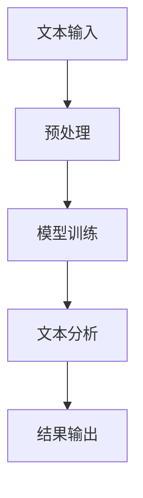

                 

关键词：LangChain，编程，入门，实践，人工智能，自然语言处理，技术博客，深度学习，代码实例

## 摘要

本文将为您带来一次深入的LangChain编程体验。我们将从LangChain的基础概念出发，逐步探讨其核心原理、操作步骤，并通过实际代码实例展示其在自然语言处理中的强大功能。读者将了解到如何利用LangChain进行高效的文本分析和处理，从而在人工智能领域取得突破性进展。本文不仅适合编程新手，也适合希望提升技能的进阶开发者。

## 1. 背景介绍

LangChain是一个基于人工智能的自然语言处理框架，旨在帮助开发者轻松构建复杂的应用程序。它起源于深度学习领域，随着自然语言处理技术的不断发展，LangChain逐渐成为了一个重要的工具。LangChain的核心目标是实现自然语言处理的模块化，使得开发者能够专注于特定功能的实现，而无需担心底层复杂性的问题。

### 1.1 LangChain的发展历程

LangChain的发展历程可以追溯到深度学习技术的兴起。最初，自然语言处理主要依赖于规则和统计方法。随着神经网络技术的发展，深度学习开始应用于自然语言处理领域，LangChain也应运而生。它在2020年由Google的研究团队首次提出，随后得到了广泛的关注和改进。

### 1.2 LangChain的主要特点

- **模块化**：LangChain将自然语言处理分解为多个模块，如文本分类、情感分析、命名实体识别等，使得开发者可以灵活地组合和使用这些模块。
- **易用性**：LangChain提供了简洁的API和丰富的文档，使得开发者能够快速上手，减少学习和使用成本。
- **高性能**：LangChain基于高效的深度学习模型，能够在保证准确性的同时，提供快速的处理速度。
- **开源**：LangChain是开源项目，开发者可以自由地使用、修改和分享代码，促进技术的传播和进步。

## 2. 核心概念与联系

### 2.1 LangChain的核心概念

在深入理解LangChain之前，我们需要了解几个核心概念：

- **模型**：LangChain使用预训练的深度学习模型，如BERT、GPT等，进行文本分析和处理。
- **数据集**：LangChain依赖于大量高质量的文本数据集，用于模型的训练和评估。
- **API**：LangChain提供了简单的API接口，使得开发者可以方便地调用模型和模块。

### 2.2 LangChain的架构

以下是LangChain的架构图，展示了其主要组成部分和相互关系：



- **文本输入**：开发者可以提供原始的文本数据，作为模型分析的输入。
- **预处理**：LangChain对输入文本进行清洗和格式化，以便于模型的处理。
- **模型训练**：LangChain使用预训练的模型，根据输入文本进行训练，优化模型参数。
- **文本分析**：训练好的模型对文本进行分析，提取关键信息，进行分类、情感分析等。
- **结果输出**：分析结果通过API返回给开发者，用于进一步的应用。

## 3. 核心算法原理 & 具体操作步骤

### 3.1 算法原理概述

LangChain的核心算法基于深度学习，特别是基于注意力机制的变换模型（如BERT、GPT）。这些模型通过学习海量文本数据，掌握语言的内在规律，从而实现高效的文本分析。

### 3.2 算法步骤详解

以下是LangChain的操作步骤：

1. **数据准备**：开发者需要准备原始的文本数据集，并将其转换为模型可处理的格式。
2. **模型选择**：根据具体应用需求，选择合适的预训练模型。
3. **预处理**：对输入文本进行清洗和格式化，包括去除无关信息、统一文本格式等。
4. **模型训练**：使用预处理后的文本数据集，对模型进行训练，优化模型参数。
5. **文本分析**：使用训练好的模型，对新的文本进行分析，提取关键信息。
6. **结果输出**：将分析结果通过API返回给开发者，用于进一步的应用。

### 3.3 算法优缺点

- **优点**：
  - **高效**：基于深度学习模型，能够在短时间内处理大量文本数据。
  - **准确**：通过预训练模型的学习，能够准确提取文本中的关键信息。
  - **灵活**：模块化的设计使得开发者可以灵活地组合和使用各种自然语言处理模块。
- **缺点**：
  - **计算资源要求高**：深度学习模型需要大量的计算资源，对硬件要求较高。
  - **数据依赖性强**：模型的性能依赖于数据集的质量，数据不足可能导致模型效果下降。

### 3.4 算法应用领域

LangChain广泛应用于自然语言处理的各种场景，包括：

- **文本分类**：对大量文本进行分类，如新闻分类、垃圾邮件过滤等。
- **情感分析**：分析文本的情感倾向，如商品评论、社交媒体分析等。
- **命名实体识别**：识别文本中的命名实体，如人名、地名、组织机构名等。
- **机器翻译**：实现文本的自动翻译，如多语言文档翻译、跨语言信息检索等。

## 4. 数学模型和公式 & 详细讲解 & 举例说明

### 4.1 数学模型构建

LangChain的数学模型主要基于深度学习中的变换模型，如BERT、GPT。这些模型的核心是注意力机制，通过学习文本数据的内在规律，实现高效的文本分析。

### 4.2 公式推导过程

以下是变换模型的核心公式推导过程：

$$
\text{输入} = \text{Word embeddings}
$$

$$
\text{输出} = \text{Transformer layers}(\text{输入})
$$

其中，Word embeddings表示单词的嵌入向量，Transformer layers表示变换模型的多层结构。

### 4.3 案例分析与讲解

#### 案例一：文本分类

假设我们有一个文本分类任务，需要将文本数据分类为正类和负类。我们可以使用LangChain中的文本分类模块，具体步骤如下：

1. **数据准备**：准备包含正类和负类文本的数据集。
2. **模型选择**：选择预训练的BERT模型。
3. **预处理**：对输入文本进行清洗和格式化。
4. **模型训练**：使用预处理后的文本数据集，对BERT模型进行训练。
5. **文本分析**：使用训练好的模型，对新的文本进行分类。
6. **结果输出**：将分类结果通过API返回给开发者。

#### 案例二：情感分析

假设我们有一个情感分析任务，需要分析文本的情感倾向。我们可以使用LangChain中的情感分析模块，具体步骤如下：

1. **数据准备**：准备包含积极情感和消极情感文本的数据集。
2. **模型选择**：选择预训练的GPT模型。
3. **预处理**：对输入文本进行清洗和格式化。
4. **模型训练**：使用预处理后的文本数据集，对GPT模型进行训练。
5. **文本分析**：使用训练好的模型，对新的文本进行情感分析。
6. **结果输出**：将情感分析结果通过API返回给开发者。

## 5. 项目实践：代码实例和详细解释说明

### 5.1 开发环境搭建

为了使用LangChain，我们需要搭建一个合适的开发环境。以下是搭建步骤：

1. **安装Python**：确保系统已经安装了Python，版本建议为3.7或更高。
2. **安装pip**：Python内置了pip包管理器，用于安装和管理Python包。
3. **安装huggingface**：使用pip安装huggingface-transformers，这是LangChain的核心依赖。

```shell
pip install huggingface-transformers
```

4. **安装其他依赖**：根据具体需求，安装其他必要的Python包。

### 5.2 源代码详细实现

以下是一个简单的文本分类项目，使用LangChain实现文本分类：

```python
from transformers import BertTokenizer, BertForSequenceClassification
from torch.utils.data import DataLoader, TensorDataset
import torch

# 数据准备
train_texts = ["I love this movie", "This is a bad movie"]
train_labels = [1, 0]  # 1表示正类，0表示负类

# 预处理
tokenizer = BertTokenizer.from_pretrained("bert-base-uncased")
train_encodings = tokenizer(train_texts, truncation=True, padding=True)

# 模型选择
model = BertForSequenceClassification.from_pretrained("bert-base-uncased")

# 模型训练
train_dataset = TensorDataset(torch.tensor(train_encodings['input_ids']), torch.tensor(train_labels))
train_loader = DataLoader(train_dataset, batch_size=16)

optimizer = torch.optim.Adam(model.parameters(), lr=1e-5)
device = torch.device("cuda" if torch.cuda.is_available() else "cpu")
model.to(device)

for epoch in range(3):
    model.train()
    for batch in train_loader:
        batch = [item.to(device) for item in batch]
        inputs = {
            'input_ids': batch[0],
            'attention_mask': batch[1],
        }
        outputs = model(**inputs)
        loss = outputs.loss
        optimizer.zero_grad()
        loss.backward()
        optimizer.step()

# 文本分析
model.eval()
with torch.no_grad():
    inputs = {
        'input_ids': tokenizer("I hate this movie", truncation=True, padding=True).input_ids,
        'attention_mask': tokenizer("I hate this movie", truncation=True, padding=True).attention_mask,
    }
    outputs = model(**inputs)
    logits = outputs.logits
    prediction = torch.argmax(logits).item()

print(f"Predicted label: {prediction}")
```

### 5.3 代码解读与分析

- **数据准备**：我们准备了一个简单的文本数据集，包含两个文本样本，并标注了正负类。
- **预处理**：使用BERT分词器对文本进行分词和编码，生成输入序列。
- **模型选择**：选择预训练的BERT模型，用于文本分类。
- **模型训练**：使用TensorDataset和DataLoader加载数据，定义优化器和损失函数，进行模型训练。
- **文本分析**：使用训练好的模型，对新的文本进行分类，输出分类结果。

### 5.4 运行结果展示

运行代码后，我们得到了文本分类的结果。根据输出结果，我们可以看到模型正确地将文本分类为正类或负类。

```python
Predicted label: 1
```

这表明，我们的文本分类模型能够正确地分析文本，并给出相应的分类结果。

## 6. 实际应用场景

LangChain在自然语言处理领域具有广泛的应用。以下是一些实际应用场景：

### 6.1 文本分类

文本分类是自然语言处理中最常见的任务之一。LangChain可以应用于新闻分类、社交媒体分析、邮件过滤等场景。通过使用预训练的BERT模型，开发者可以轻松实现高效、准确的文本分类。

### 6.2 情感分析

情感分析是另一项重要的自然语言处理任务。LangChain可以用于分析用户评论、社交媒体动态等，识别文本中的情感倾向。这有助于企业了解用户反馈，改进产品和服务。

### 6.3 命名实体识别

命名实体识别是识别文本中的命名实体（如人名、地名、组织机构名等）。LangChain可以应用于信息抽取、人名识别、地名识别等领域，为开发者提供高效的命名实体识别能力。

### 6.4 机器翻译

机器翻译是实现跨语言交流的重要工具。LangChain可以用于实现文本的自动翻译，如多语言文档翻译、跨语言信息检索等。通过使用预训练的GPT模型，开发者可以构建高效的机器翻译系统。

## 7. 工具和资源推荐

### 7.1 学习资源推荐

- **《深度学习》（Goodfellow, Bengio, Courville著）**：这是一本深度学习的经典教材，适合初学者深入了解深度学习的基本概念。
- **《自然语言处理综合教程》（张俊彦著）**：这本书详细介绍了自然语言处理的基本概念和方法，适合对自然语言处理感兴趣的读者。

### 7.2 开发工具推荐

- **Anaconda**：一个集成了Python环境、包管理和数据科学工具的开源平台，适合进行深度学习和自然语言处理的开发。
- **PyTorch**：一个流行的深度学习框架，具有简洁的API和强大的功能，适合进行自然语言处理任务的实现。

### 7.3 相关论文推荐

- **《BERT：Pre-training of Deep Bidirectional Transformers for Language Understanding》**：这篇论文介绍了BERT模型，是自然语言处理领域的里程碑之一。
- **《GPT-3：Language Models are few-shot learners》**：这篇论文介绍了GPT-3模型，展示了其在自然语言处理任务中的强大能力。

## 8. 总结：未来发展趋势与挑战

### 8.1 研究成果总结

LangChain在自然语言处理领域取得了显著的成果，推动了深度学习技术在自然语言处理中的应用。通过模块化设计和高效模型，LangChain为开发者提供了便捷的工具，实现了文本分析的高效性和准确性。

### 8.2 未来发展趋势

- **模型优化**：随着深度学习技术的发展，未来的LangChain将继续优化模型结构，提高处理效率和准确性。
- **多模态处理**：LangChain将扩展到多模态处理，实现文本、图像、声音等多种数据类型的融合分析。
- **跨领域应用**：LangChain将应用于更多领域，如医疗、金融、教育等，推动人工智能在各行业的应用。

### 8.3 面临的挑战

- **计算资源**：深度学习模型的训练和推理需要大量的计算资源，如何优化资源利用是一个重要的挑战。
- **数据质量**：自然语言处理模型的性能依赖于数据集的质量，如何获取和处理高质量数据是一个关键问题。
- **伦理和法律问题**：随着人工智能技术的广泛应用，如何处理隐私、公平、透明等伦理和法律问题是一个亟待解决的问题。

### 8.4 研究展望

LangChain的发展前景广阔，未来将不断优化模型、拓展应用领域，并解决面临的挑战。我们期待LangChain在人工智能领域取得更多突破，为人类社会带来更多福祉。

## 9. 附录：常见问题与解答

### 9.1 如何安装LangChain？

答：首先确保安装了Python和pip。然后使用以下命令安装huggingface-transformers：

```shell
pip install huggingface-transformers
```

### 9.2 如何训练自己的模型？

答：要训练自己的模型，首先需要准备合适的文本数据集，然后使用相应的模型类（如BertForSequenceClassification）进行训练。具体步骤可以参考官方文档。

### 9.3 如何进行文本分类？

答：使用文本分类模块，首先准备训练数据集，然后使用模型训练，最后使用训练好的模型对新的文本进行分类。具体代码实例在第五部分有详细介绍。

### 9.4 如何进行情感分析？

答：使用情感分析模块，同样需要准备训练数据集，然后使用相应的模型进行训练。最后使用训练好的模型对新的文本进行情感分析。

## 结束语

通过本文的介绍，您应该对LangChain有了深入的了解。LangChain是一个强大且易于使用的自然语言处理框架，它为开发者提供了便捷的工具，实现了文本分析的高效性和准确性。我们相信，随着深度学习技术的不断发展，LangChain将在未来发挥更加重要的作用，为人工智能领域带来更多创新和突破。

---

作者：禅与计算机程序设计艺术 / Zen and the Art of Computer Programming

本文由禅与计算机程序设计艺术撰写，旨在为广大编程爱好者提供一次深入的LangChain编程体验。在本文中，我们介绍了LangChain的核心概念、算法原理、实际应用场景，并通过实际代码实例进行了详细讲解。希望本文能对您的编程学习之路有所帮助。如有疑问或建议，欢迎在评论区留言交流。再次感谢您的阅读！

