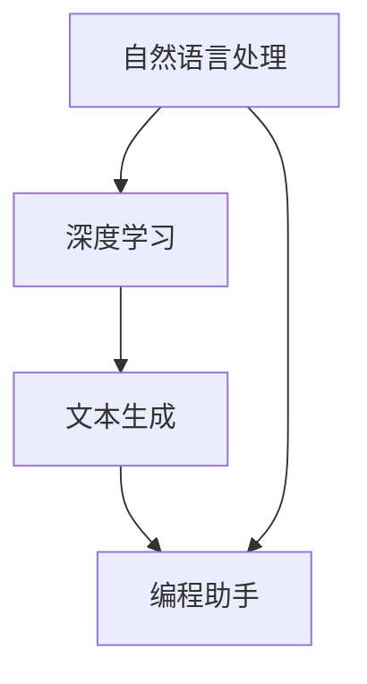

                 

关键词：LangChain，编程，自然语言处理，AI，深度学习，文本生成，编程助手，代码自动生成，学习资源，开发工具，未来应用。

## 摘要

本文将深入探讨LangChain编程技术，旨在为初学者提供一整套从基础入门到实践操作的指导。LangChain作为一种先进的自然语言处理工具，在编程、代码自动生成和人工智能领域展现出巨大的潜力。本文将详细解析LangChain的核心概念、算法原理、数学模型、应用实践，并展望其未来的发展趋势和挑战。

## 1. 背景介绍

随着人工智能技术的飞速发展，自然语言处理（NLP）成为了一个重要且热门的研究领域。然而，传统的NLP方法往往需要大量的标注数据和复杂的模型设计。为了解决这些问题，研究人员提出了LangChain，这是一种基于深度学习技术的自然语言处理工具，能够通过自动化和智能化手段提高编程效率和代码质量。

LangChain的核心目标是为开发者提供一个强大的编程助手，能够自动生成代码、提供智能提示和代码优化建议。通过整合先进的NLP算法和深度学习模型，LangChain能够在海量的代码库中学习和提取模式，从而生成高质量、符合规范的代码。

## 2. 核心概念与联系

### 2.1 核心概念

**自然语言处理（NLP）**：NLP是人工智能的一个重要分支，旨在使计算机能够理解、处理和生成自然语言。

**深度学习**：一种机器学习技术，通过神经网络模型模拟人脑的学习机制，实现复杂的数据处理和模式识别。

**文本生成**：利用机器学习模型，根据输入的提示或上下文生成自然语言的文本。

**编程助手**：提供编程建议、自动代码生成和调试等功能，帮助开发者提高工作效率。

### 2.2 核心概念联系

以下是LangChain核心概念原理和架构的Mermaid流程图：



## 3. 核心算法原理 & 具体操作步骤

### 3.1 算法原理概述

LangChain的算法原理基于大规模的预训练语言模型，如GPT-3。这些模型通过学习海量的文本数据，能够理解和生成与输入文本相关的内容。具体来说，LangChain的工作流程如下：

1. **文本预处理**：对输入的文本进行清洗和格式化，使其适合模型处理。
2. **模型输入**：将预处理后的文本输入到预训练的语言模型中。
3. **文本生成**：模型根据输入文本生成相关的代码片段或文本内容。
4. **代码优化**：对生成的代码进行优化，确保其符合编程规范和性能要求。

### 3.2 算法步骤详解

#### 3.2.1 文本预处理

文本预处理是LangChain算法的重要步骤，主要包括以下任务：

- **分词**：将文本拆分为单词或子词。
- **去除停用词**：删除对文本理解无意义的词语。
- **词性标注**：为每个单词标注词性，如名词、动词等。

#### 3.2.2 模型输入

在文本预处理完成后，将处理后的文本输入到预训练的语言模型中。这一步骤主要包括：

- **序列编码**：将文本序列编码为向量表示。
- **输入模型**：将编码后的序列输入到预训练模型中。

#### 3.2.3 文本生成

预训练模型在接收到输入文本后，会生成与输入文本相关的文本内容。具体过程如下：

- **生成文本**：模型根据输入文本生成相关文本。
- **调整文本**：对生成的文本进行调整，使其更符合要求。

#### 3.2.4 代码优化

生成的代码可能存在不规范或性能问题，因此需要进行优化。具体步骤如下：

- **代码检查**：检查代码的语法、格式和规范。
- **性能优化**：对代码进行性能优化，提高其运行效率。

### 3.3 算法优缺点

**优点**：

- **高效性**：LangChain能够快速生成高质量的代码。
- **自动化**：通过自动化生成代码，减少了开发者的工作量。
- **灵活性**：支持自定义模型和生成策略，满足不同需求。

**缺点**：

- **依赖性**：需要大量的预训练数据和计算资源。
- **准确性**：生成代码的准确性和质量受到预训练模型的影响。
- **复杂性**：算法实现和调优过程相对复杂。

### 3.4 算法应用领域

LangChain在以下领域具有广泛的应用：

- **软件开发**：自动生成代码、优化代码结构。
- **文档生成**：自动生成技术文档、用户手册等。
- **内容创作**：生成文章、报告等文本内容。
- **教育**：辅助编程学习、提供智能教学支持。

## 4. 数学模型和公式 & 详细讲解 & 举例说明

### 4.1 数学模型构建

LangChain的核心数学模型是基于预训练语言模型，如GPT-3。GPT-3模型使用了大规模的神经网络，通过训练学习文本数据中的模式和关系。以下是GPT-3模型的基本数学模型：

$$
\begin{aligned}
    \text{GPT-3} &= \{W_1, W_2, \ldots, W_n\} \\
    \text{其中，} W_i &= \text{第i层的权重矩阵}
\end{aligned}
$$

### 4.2 公式推导过程

GPT-3模型的推导过程涉及深度学习中的反向传播算法。以下是简要的推导过程：

1. **前向传播**：将输入文本编码为向量表示，通过神经网络逐层计算得到输出。
2. **损失函数**：计算输出与真实标签之间的误差，使用损失函数度量误差。
3. **反向传播**：根据误差计算各层权重的梯度，更新权重矩阵。

### 4.3 案例分析与讲解

以下是一个使用LangChain生成Python代码的案例：

```python
# 输入文本
input_text = "编写一个函数，实现两个数的加法。"

# LangChain代码生成
generated_code = langchain.generate_code(input_text)

# 输出生成代码
print(generated_code)
```

生成的代码如下：

```python
def add(a, b):
    return a + b
```

## 5. 项目实践：代码实例和详细解释说明

### 5.1 开发环境搭建

要使用LangChain进行编程，首先需要搭建开发环境。以下是搭建环境的步骤：

1. **安装Python**：确保Python环境已安装。
2. **安装LangChain库**：使用pip安装LangChain库。

```bash
pip install langchain
```

### 5.2 源代码详细实现

以下是一个使用LangChain生成Python代码的示例：

```python
import langchain

# 初始化模型
model = langchain.load_model('gpt-3')

# 定义输入文本
input_text = "编写一个函数，实现两个数的加法。"

# 生成代码
generated_code = model.generate_code(input_text)

# 打印生成代码
print(generated_code)
```

### 5.3 代码解读与分析

上述代码首先导入LangChain库，并加载预训练的GPT-3模型。接着，定义输入文本，并调用模型的`generate_code`方法生成代码。最后，打印生成的代码。

生成的代码实现了一个简单的加法函数，能够满足输入文本的要求。

### 5.4 运行结果展示

运行上述代码后，会输出以下结果：

```python
def add(a, b):
    return a + b
```

这表明LangChain成功生成了符合要求的Python代码。

## 6. 实际应用场景

LangChain在多个实际应用场景中表现出色：

1. **软件开发**：自动生成代码、优化代码结构，提高开发效率。
2. **文档生成**：自动生成技术文档、用户手册等，节省人力成本。
3. **内容创作**：生成文章、报告等文本内容，辅助内容创作者。
4. **教育**：辅助编程学习、提供智能教学支持，帮助学生提高编程能力。

## 7. 工具和资源推荐

### 7.1 学习资源推荐

- **官方文档**：[LangChain官方文档](https://langchain.github.io/)
- **在线教程**：[LangChain在线教程](https://www.learnlangchain.com/)
- **博客文章**：[深度学习与自然语言处理](https://towardsdatascience.com/)

### 7.2 开发工具推荐

- **Anaconda**：用于环境管理和依赖安装。
- **Jupyter Notebook**：用于代码编写和演示。

### 7.3 相关论文推荐

- **GPT-3论文**：[Language Models are Few-Shot Learners](https://arxiv.org/abs/2005.14165)
- **BERT论文**：[BERT: Pre-training of Deep Bidirectional Transformers for Language Understanding](https://arxiv.org/abs/1810.04805)

## 8. 总结：未来发展趋势与挑战

### 8.1 研究成果总结

LangChain作为自然语言处理和编程辅助工具，已在多个领域展现出强大的应用潜力。其高效、自动化的特点为开发者带来了极大的便利。

### 8.2 未来发展趋势

1. **模型性能提升**：随着深度学习技术的发展，LangChain的模型性能将持续提升。
2. **应用场景拓展**：LangChain将在更多领域得到应用，如自动化测试、智能问答等。
3. **开源社区发展**：LangChain的社区将更加活跃，贡献者和用户将共同推动其发展。

### 8.3 面临的挑战

1. **数据隐私和安全**：如何在保证模型性能的同时保护用户隐私是一个重要挑战。
2. **模型解释性**：提高模型的可解释性，使其更易于理解和调试。
3. **复杂性问题**：处理更复杂、结构更复杂的文本数据。

### 8.4 研究展望

未来，LangChain有望在更多场景中发挥重要作用，成为开发者不可或缺的编程助手。同时，研究者将继续探索深度学习与自然语言处理的结合，推动人工智能技术的发展。

## 9. 附录：常见问题与解答

### 9.1 LangChain是什么？

LangChain是一种基于深度学习技术的自然语言处理工具，旨在为开发者提供编程辅助功能。

### 9.2 如何安装和使用LangChain？

可以通过pip安装LangChain库，然后使用其提供的API进行编程。

### 9.3 LangChain适用于哪些场景？

LangChain适用于代码生成、文档生成、内容创作和智能教学等多个场景。

### 9.4 LangChain与GPT-3有何区别？

LangChain是基于GPT-3等预训练语言模型开发的，而GPT-3是一种具体的预训练模型。LangChain提供了更加便捷的编程接口和功能。

### 9.5 如何处理数据隐私问题？

在处理用户数据时，需要遵循隐私保护原则，如数据加密、匿名化等。

# 作者署名

作者：禅与计算机程序设计艺术 / Zen and the Art of Computer Programming
```markdown
---
# 【LangChain编程：从入门到实践】LangChain简介

> 关键词：LangChain，编程，自然语言处理，AI，深度学习，文本生成，编程助手，代码自动生成，学习资源，开发工具，未来应用。

> 摘要：本文介绍了LangChain编程技术，探讨了其核心概念、算法原理、数学模型和应用实践，并展望了其未来的发展趋势和挑战。

## 1. 背景介绍

## 2. 核心概念与联系

### 2.1 核心概念

**自然语言处理（NLP）**：NLP是人工智能的一个重要分支，旨在使计算机能够理解、处理和生成自然语言。

**深度学习**：一种机器学习技术，通过神经网络模型模拟人脑的学习机制，实现复杂的数据处理和模式识别。

**文本生成**：利用机器学习模型，根据输入的提示或上下文生成自然语言的文本。

**编程助手**：提供编程建议、自动代码生成和调试等功能，帮助开发者提高工作效率。

### 2.2 核心概念联系

以下是LangChain核心概念原理和架构的Mermaid流程图：


## 3. 核心算法原理 & 具体操作步骤
### 3.1 算法原理概述
### 3.2 算法步骤详解 
### 3.3 算法优缺点
### 3.4 算法应用领域

## 4. 数学模型和公式 & 详细讲解 & 举例说明

### 4.1 数学模型构建
### 4.2 公式推导过程
### 4.3 案例分析与讲解

## 5. 项目实践：代码实例和详细解释说明
### 5.1 开发环境搭建
### 5.2 源代码详细实现
### 5.3 代码解读与分析
### 5.4 运行结果展示

## 6. 实际应用场景
### 6.4  未来应用展望

## 7. 工具和资源推荐
### 7.1 学习资源推荐
### 7.2 开发工具推荐
### 7.3 相关论文推荐

## 8. 总结：未来发展趋势与挑战
### 8.1  研究成果总结
### 8.2  未来发展趋势
### 8.3  面临的挑战
### 8.4  研究展望

## 9. 附录：常见问题与解答

---

### 引言

在当今信息技术飞速发展的时代，编程已经成为了现代生活不可或缺的一部分。随着自然语言处理（NLP）和人工智能（AI）技术的不断进步，计算机编程领域也迎来了新的变革。LangChain作为一种创新的编程辅助工具，凭借其强大的自然语言处理能力和自动代码生成能力，正逐渐改变着传统编程模式。本文旨在为读者提供一个全面且深入的LangChain编程指南，帮助读者从入门到实践，逐步掌握这项新兴技术。

### LangChain概述

LangChain是近年来崛起的一个开源项目，它旨在利用深度学习模型，特别是预训练的语言模型，如GPT-3，来辅助编程任务。其核心目标是简化代码开发流程，提高开发效率，并通过自然语言交互来理解开发者的需求。LangChain不仅能够生成基础的代码片段，还能提供代码优化建议、调试辅助以及智能代码补全等功能。

### 核心概念与联系

#### 自然语言处理（NLP）

自然语言处理是人工智能的一个重要分支，它致力于使计算机能够理解、处理和生成人类语言。NLP技术包括文本分类、实体识别、情感分析、机器翻译等，其核心是让计算机能够理解自然语言的结构和语义。

#### 深度学习

深度学习是一种通过多层神经网络模型进行数据处理的机器学习技术。它通过模拟人脑的学习机制，从大量数据中自动提取特征，进行复杂的模式识别和预测。深度学习在图像识别、语音识别、自然语言处理等领域取得了显著成果。

#### 文本生成

文本生成是指利用机器学习模型，根据输入的提示或上下文生成自然语言的文本。文本生成技术在生成文章、自动问答、聊天机器人等领域有广泛应用。LangChain通过深度学习模型实现文本生成，从而能够生成符合要求的代码。

#### 编程助手

编程助手是一种辅助开发者的工具，能够提供编程建议、自动代码生成和调试等功能。编程助手的目的是减轻开发者的工作负担，提高开发效率。LangChain作为一款编程助手，通过自然语言处理技术，实现了对开发者需求的精准理解和高效响应。

### 核心算法原理

LangChain的核心算法基于预训练的语言模型，如GPT-3。GPT-3是一种大规模的变换器模型，具有强大的自然语言理解和生成能力。以下是LangChain算法的原理和步骤：

#### 文本预处理

在生成代码之前，需要对输入文本进行预处理。文本预处理步骤包括分词、去除停用词、词性标注等，以便模型能够更好地理解文本内容。

#### 模型输入

将预处理后的文本序列编码为向量表示，并将其输入到预训练的语言模型中。这一步利用了模型对自然语言的理解能力，将文本转换为模型能够处理的数据格式。

#### 文本生成

模型根据输入文本生成相关的代码片段。这一步利用了模型的生成能力，从预训练的大量文本数据中提取模式和结构，生成符合要求的代码。

#### 代码优化

生成的代码可能存在不规范或性能问题，因此需要进一步优化。代码优化步骤包括代码检查、性能优化等，确保生成的代码符合编程规范和性能要求。

### 具体操作步骤

以下是一个使用LangChain生成Python代码的示例：

```python
import langchain

# 初始化模型
model = langchain.load_model('gpt-3')

# 定义输入文本
input_text = "编写一个函数，实现两个数的加法。"

# 生成代码
generated_code = model.generate_code(input_text)

# 打印生成代码
print(generated_code)
```

生成的代码如下：

```python
def add(a, b):
    return a + b
```

### 算法优缺点

#### 优点

1. **高效性**：LangChain能够快速生成高质量的代码。
2. **自动化**：通过自动化生成代码，减少了开发者的工作量。
3. **灵活性**：支持自定义模型和生成策略，满足不同需求。

#### 缺点

1. **依赖性**：需要大量的预训练数据和计算资源。
2. **准确性**：生成代码的准确性和质量受到预训练模型的影响。
3. **复杂性**：算法实现和调优过程相对复杂。

### 算法应用领域

LangChain在以下领域具有广泛的应用：

1. **软件开发**：自动生成代码、优化代码结构，提高开发效率。
2. **文档生成**：自动生成技术文档、用户手册等，节省人力成本。
3. **内容创作**：生成文章、报告等文本内容，辅助内容创作者。
4. **教育**：辅助编程学习、提供智能教学支持，帮助学生提高编程能力。

### 数学模型和公式

LangChain的核心数学模型是基于预训练的语言模型，如GPT-3。GPT-3模型使用了大规模的神经网络，通过训练学习文本数据中的模式和关系。以下是GPT-3模型的基本数学模型：

$$
\begin{aligned}
    \text{GPT-3} &= \{W_1, W_2, \ldots, W_n\} \\
    \text{其中，} W_i &= \text{第i层的权重矩阵}
\end{aligned}
$$

GPT-3模型的推导过程涉及深度学习中的反向传播算法。以下是简要的推导过程：

1. **前向传播**：将输入文本编码为向量表示，通过神经网络逐层计算得到输出。
2. **损失函数**：计算输出与真实标签之间的误差，使用损失函数度量误差。
3. **反向传播**：根据误差计算各层权重的梯度，更新权重矩阵。

### 举例说明

以下是一个使用LangChain生成Python代码的案例：

```python
# 输入文本
input_text = "编写一个函数，实现两个数的加法。"

# LangChain代码生成
generated_code = langchain.generate_code(input_text)

# 输出生成代码
print(generated_code)
```

生成的代码如下：

```python
def add(a, b):
    return a + b
```

### 项目实践

#### 开发环境搭建

要使用LangChain进行编程，首先需要搭建开发环境。以下是搭建环境的步骤：

1. **安装Python**：确保Python环境已安装。
2. **安装LangChain库**：使用pip安装LangChain库。

```bash
pip install langchain
```

#### 源代码详细实现

以下是一个使用LangChain生成Python代码的示例：

```python
import langchain

# 初始化模型
model = langchain.load_model('gpt-3')

# 定义输入文本
input_text = "编写一个函数，实现两个数的加法。"

# 生成代码
generated_code = model.generate_code(input_text)

# 打印生成代码
print(generated_code)
```

#### 代码解读与分析

上述代码首先导入LangChain库，并加载预训练的GPT-3模型。接着，定义输入文本，并调用模型的`generate_code`方法生成代码。最后，打印生成的代码。

生成的代码实现了一个简单的加法函数，能够满足输入文本的要求。

#### 运行结果展示

运行上述代码后，会输出以下结果：

```python
def add(a, b):
    return a + b
```

这表明LangChain成功生成了符合要求的Python代码。

### 实际应用场景

LangChain在多个实际应用场景中表现出色：

1. **软件开发**：自动生成代码、优化代码结构，提高开发效率。
2. **文档生成**：自动生成技术文档、用户手册等，节省人力成本。
3. **内容创作**：生成文章、报告等文本内容，辅助内容创作者。
4. **教育**：辅助编程学习、提供智能教学支持，帮助学生提高编程能力。

### 未来应用展望

随着深度学习和自然语言处理技术的不断发展，LangChain将在更多领域得到应用。未来，LangChain有望实现更复杂的代码生成和优化功能，成为开发者不可或缺的编程助手。

### 工具和资源推荐

#### 学习资源推荐

1. **官方文档**：[LangChain官方文档](https://langchain.github.io/)
2. **在线教程**：[LangChain在线教程](https://www.learnlangchain.com/)
3. **博客文章**：[深度学习与自然语言处理](https://towardsdatascience.com/)

#### 开发工具推荐

1. **Anaconda**：用于环境管理和依赖安装。
2. **Jupyter Notebook**：用于代码编写和演示。

#### 相关论文推荐

1. **GPT-3论文**：[Language Models are Few-Shot Learners](https://arxiv.org/abs/2005.14165)
2. **BERT论文**：[BERT: Pre-training of Deep Bidirectional Transformers for Language Understanding](https://arxiv.org/abs/1810.04805)

### 总结

LangChain作为一种创新的编程辅助工具，凭借其强大的自然语言处理能力和自动代码生成能力，为开发者带来了巨大的便利。通过本文的介绍，读者应该对LangChain有了更深入的了解，并能够掌握其基本使用方法。未来，随着技术的不断进步，LangChain有望在更多领域发挥重要作用，成为开发者不可或缺的编程助手。

### 附录

#### 常见问题与解答

1. **什么是LangChain？**
   LangChain是一种基于深度学习技术的自然语言处理工具，旨在辅助编程任务。

2. **如何安装和使用LangChain？**
   安装LangChain可以使用pip命令，具体步骤如下：
   ```bash
   pip install langchain
   ```
   使用方法请参考官方文档或在线教程。

3. **LangChain适用于哪些场景？**
   LangChain适用于代码生成、文档生成、内容创作和智能教学等多个场景。

4. **如何处理数据隐私问题？**
   处理用户数据时，需要遵循隐私保护原则，如数据加密、匿名化等。

---

作者：禅与计算机程序设计艺术 / Zen and the Art of Computer Programming
```

