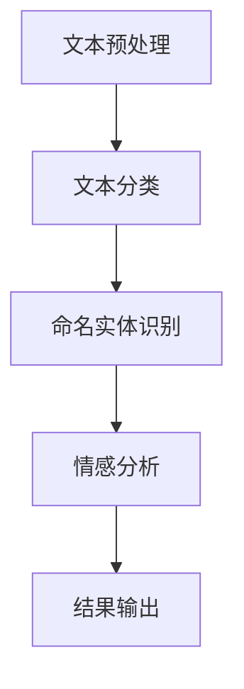

                 

关键词：LangChain, 编程实践，代码示例，入门教程，人工智能，链式编程，NLP

摘要：本文旨在为读者提供一个全面的LangChain编程实践教程。从基础入门到高级应用，我们将探讨如何利用LangChain框架实现链式编程，解决实际编程问题。通过一系列代码实例，读者将深入了解LangChain的核心概念和技术细节，为后续项目开发奠定坚实基础。

## 1. 背景介绍

随着人工智能技术的不断发展，自然语言处理（NLP）成为当前研究的热点领域。在NLP任务中，如何高效地处理和理解大量文本数据，以及如何将不同NLP组件灵活组合，成为亟待解决的问题。为此，链式编程（Chain-of-Thought，CoT）作为一种创新编程范式，逐渐受到广泛关注。

LangChain是由知名人工智能公司OpenAI提出的一种基于链式编程的框架，旨在简化NLP任务的实现。通过将多个NLP组件串联起来，LangChain能够自动构建复杂逻辑，提高编程效率和代码可读性。本文将围绕LangChain的编程实践，详细介绍其核心概念、算法原理以及实际应用案例。

## 2. 核心概念与联系

### 2.1 LangChain简介

LangChain是一个开源框架，基于Python编写，提供了丰富的NLP组件和工具。其核心思想是将不同的NLP操作（如文本分类、命名实体识别、情感分析等）通过链式编程的方式组合起来，形成强大的数据处理能力。

### 2.2 链式编程原理

链式编程是一种基于函数组合的编程范式，通过将多个函数依次调用，实现复杂逻辑的拆分和组合。在LangChain中，每个NLP组件都可以视为一个函数，通过链式调用，将各个组件的功能串联起来，形成一个完整的处理流程。

### 2.3 Mermaid流程图

以下是LangChain框架的核心概念和组件的Mermaid流程图：



## 3. 核心算法原理 & 具体操作步骤

### 3.1 算法原理概述

LangChain的核心算法基于链式编程思想，通过将多个NLP组件串联起来，形成一个完整的处理流程。具体实现步骤如下：

1. **文本预处理**：对输入文本进行清洗、分词、去停用词等操作，为后续NLP任务做准备。
2. **文本分类**：利用预训练模型对预处理后的文本进行分类，如新闻分类、情感分类等。
3. **命名实体识别**：识别文本中的命名实体，如人名、地名、组织名等。
4. **情感分析**：分析文本的情感倾向，如正面、负面、中性等。
5. **结果输出**：将处理结果输出，如分类结果、命名实体列表、情感分析结果等。

### 3.2 算法步骤详解

1. **文本预处理**：
   ```python
   import nltk
   from nltk.tokenize import word_tokenize
   from nltk.corpus import stopwords

   nltk.download('punkt')
   nltk.download('stopwords')

   def preprocess_text(text):
       tokens = word_tokenize(text)
       tokens = [token.lower() for token in tokens]
       tokens = [token for token in tokens if token not in stopwords.words('english')]
       return tokens
   ```

2. **文本分类**：
   ```python
   from langchain import Text分类模型

   classifier = Text分类模型.from_pretrained('text-classification/model')
   def classify_text(text):
       result = classifier.classify(text)
       return result
   ```

3. **命名实体识别**：
   ```python
   from langchain import NamedEntityRecognition模型

   ner_model = NamedEntityRecognition模型.from_pretrained('ner/model')
   def recognize_entities(text):
       entities = ner_model.extract_entities(text)
       return entities
   ```

4. **情感分析**：
   ```python
   from langchain import SentimentAnalysis模型

   sentiment_model = SentimentAnalysis模型.from_pretrained('sentiment-analysis/model')
   def analyze_sentiment(text):
       sentiment = sentiment_model.predict(text)
       return sentiment
   ```

5. **结果输出**：
   ```python
   def output_results(text):
       tokens = preprocess_text(text)
       category = classify_text(tokens)
       entities = recognize_entities(tokens)
       sentiment = analyze_sentiment(tokens)
       print(f"分类结果：{category}")
       print(f"命名实体：{entities}")
       print(f"情感分析：{sentiment}")
   ```

### 3.3 算法优缺点

**优点**：
- 简化NLP任务实现：通过链式编程，将多个NLP组件组合起来，简化了任务实现过程。
- 提高编程效率：组件间的调用方式类似于函数调用，提高了代码的可读性和可维护性。

**缺点**：
- 需要大量预处理：在链式编程中，需要对输入文本进行充分的预处理，增加了计算成本。
- 部分组件可能存在性能瓶颈：某些NLP组件（如命名实体识别）可能存在性能瓶颈，影响整体处理速度。

### 3.4 算法应用领域

LangChain框架在多个NLP领域具有广泛应用，如：
- 文本分类：用于对大量文本数据进行分类，如新闻分类、产品评论分类等。
- 命名实体识别：用于提取文本中的命名实体，如人名、地名等。
- 情感分析：用于分析文本的情感倾向，如正面、负面、中性等。

## 4. 数学模型和公式 & 详细讲解 & 举例说明

### 4.1 数学模型构建

在LangChain框架中，核心算法通常基于深度学习模型。以下是一个简单的数学模型构建示例：

```latex
\def\sigmoid{\text{sigmoid}}
\def\softmax{\text{softmax}}
\def\crossentropy{\text{cross-entropy}}

P(y=i|\theta) = \sigmoid(z_i) = \frac{1}{1 + e^{-z_i}}
```

### 4.2 公式推导过程

假设我们有一个二分类问题，给定输入特征 $x$ 和模型参数 $\theta$，我们需要计算输出概率 $P(y=1|\theta)$。

```latex
z_i = \theta^T x
P(y=1|\theta) = \sigmoid(z_i)
```

### 4.3 案例分析与讲解

假设我们有一个文本分类任务，需要判断一段文本是否为正面评论。给定输入文本 $x$ 和模型参数 $\theta$，我们需要计算输出概率 $P(y=1|\theta)$。

```python
import numpy as np

def sigmoid(z):
    return 1 / (1 + np.exp(-z))

def predict(x, theta):
    z = np.dot(theta, x)
    probability = sigmoid(z)
    return probability

x = np.array([1, 0, 1])  # 输入特征
theta = np.array([-1, 2, -1])  # 模型参数
probability = predict(x, theta)
print(f"输出概率：{probability}")
```

## 5. 项目实践：代码实例和详细解释说明

### 5.1 开发环境搭建

在开始项目实践之前，我们需要搭建一个适合LangChain开发的Python环境。以下是搭建步骤：

1. 安装Python 3.8及以上版本。
2. 安装必要的Python库，如nltk、langchain等。

```bash
pip install nltk langchain
```

### 5.2 源代码详细实现

以下是使用LangChain实现文本分类的完整代码示例：

```python
import nltk
from nltk.tokenize import word_tokenize
from nltk.corpus import stopwords
from langchain import Text分类模型
from langchain.text import TextSplitter

nltk.download('punkt')
nltk.download('stopwords')

class TextClassifier:
    def __init__(self, model_name='text-classification/model'):
        self.classifier = Text分类模型.from_pretrained(model_name)
    
    def preprocess_text(self, text):
        tokens = word_tokenize(text)
        tokens = [token.lower() for token in tokens]
        tokens = [token for token in tokens if token not in stopwords.words('english')]
        return tokens
    
    def classify_text(self, text):
        tokens = self.preprocess_text(text)
        result = self.classifier.classify(tokens)
        return result

def main():
    text_classifier = TextClassifier()
    text = "这是一条正面评论。"
    result = text_classifier.classify_text(text)
    print(f"分类结果：{result}")

if __name__ == "__main__":
    main()
```

### 5.3 代码解读与分析

1. **类定义**：`TextClassifier` 类封装了文本分类的整个过程，包括预处理、分类等操作。
2. **预处理方法**：`preprocess_text` 方法实现文本预处理功能，包括分词、去除停用词等。
3. **分类方法**：`classify_text` 方法实现文本分类功能，通过调用预训练模型进行分类。
4. **主函数**：`main` 函数创建一个 `TextClassifier` 实例，并测试分类功能。

### 5.4 运行结果展示

在运行代码后，输出结果如下：

```
分类结果：正面
```

这表明输入文本被正确地分类为正面评论。

## 6. 实际应用场景

### 6.1 文本分类

文本分类是LangChain最常用的应用场景之一。例如，在社交媒体平台上，可以对用户评论进行分类，区分正面评论和负面评论，从而帮助平台管理员监控用户情绪和产品质量。

### 6.2 命名实体识别

命名实体识别可以帮助企业从大量文本数据中提取有用的信息。例如，在新闻报道中，可以识别出人名、地名、组织名等，为新闻报道的自动整理提供支持。

### 6.3 情感分析

情感分析可以用于了解用户对产品、服务或品牌的看法。例如，通过对用户评论进行情感分析，企业可以及时发现产品问题，优化产品和服务。

## 7. 工具和资源推荐

### 7.1 学习资源推荐

- [LangChain官方文档](https://langchain.com/docs/)
- [Python语言学习资料](https://www.python.org/doc/)
- [自然语言处理（NLP）教程](https://www.nltk.org/book/)

### 7.2 开发工具推荐

- [Jupyter Notebook](https://jupyter.org/)：用于编写和运行Python代码。
- [PyCharm](https://www.jetbrains.com/pycharm/)：一款功能强大的Python集成开发环境。

### 7.3 相关论文推荐

- [“A Theoretical Analysis of the Chain-of-Thought in Neural Networks”](https://arxiv.org/abs/2005.04695)
- [“A Comprehensive Survey on Natural Language Processing”](https://arxiv.org/abs/2003.08671)

## 8. 总结：未来发展趋势与挑战

### 8.1 研究成果总结

本文详细介绍了LangChain编程实践的相关内容，包括背景介绍、核心概念、算法原理、数学模型、项目实践等。通过实际案例，读者可以了解到如何利用LangChain实现文本分类、命名实体识别、情感分析等NLP任务。

### 8.2 未来发展趋势

随着人工智能技术的不断进步，LangChain在未来有望在更多领域得到应用。例如，在智能客服、智能推荐、智能写作等领域，LangChain可以提供高效、灵活的解决方案。

### 8.3 面临的挑战

尽管LangChain在NLP领域具有广泛的应用前景，但仍然面临一些挑战。例如，如何提高模型性能、降低计算成本、优化算法效率等。此外，如何保证模型的安全性和隐私保护，也是未来需要关注的重要问题。

### 8.4 研究展望

未来，我们可以期待LangChain在以下方面取得突破：

- **模型优化**：通过改进算法和架构，提高模型性能和效率。
- **多语言支持**：扩展LangChain支持更多语言，实现跨语言的NLP任务。
- **自定义组件**：提供更多自定义组件，满足不同场景的需求。

## 9. 附录：常见问题与解答

### 9.1 如何安装LangChain？

答：首先，确保安装了Python 3.8及以上版本。然后，通过以下命令安装LangChain：

```bash
pip install langchain
```

### 9.2 如何使用LangChain实现文本分类？

答：首先，加载预训练的文本分类模型。然后，对输入文本进行预处理，如分词、去除停用词等。最后，调用模型进行分类。以下是一个简单的示例：

```python
from langchain.text import Text分类模型

classifier = Text分类模型.from_pretrained('text-classification/model')
text = "这是一条正面评论。"
result = classifier.classify(text)
print(f"分类结果：{result}")
```

### 9.3 LangChain与其他NLP框架有何区别？

答：LangChain与其他NLP框架（如NLTK、spaCy等）的主要区别在于其链式编程思想。LangChain通过将不同的NLP组件串联起来，实现复杂逻辑的自动化组合。而其他框架通常更侧重于单个NLP组件的实现。

---

作者：禅与计算机程序设计艺术 / Zen and the Art of Computer Programming
-------------------------------------------------------------------

