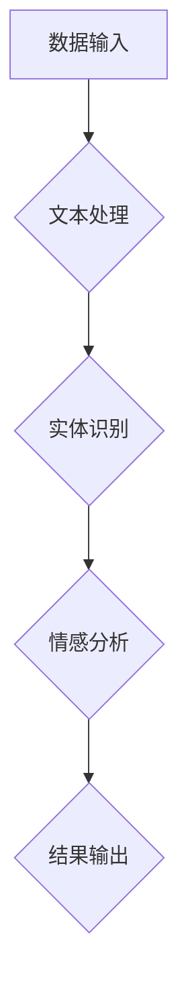
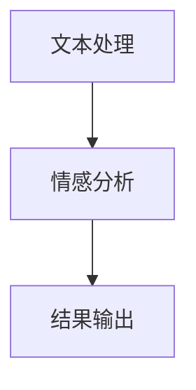

                 

关键词：LangChain，编程，应用开发，AI，自然语言处理，代码示例

> 摘要：本文将深入探讨LangChain的核心概念、编程方法及其在自然语言处理领域的应用。通过详细讲解和实例分析，帮助读者从入门到实践，掌握如何利用LangChain构建强大的自然语言处理应用。

## 1. 背景介绍

随着人工智能技术的快速发展，自然语言处理（NLP）已成为一个极其热门的研究领域。许多企业和开发者都在探索如何利用NLP技术为业务带来增值。然而，传统NLP方法的复杂性使得许多初学者望而却步。为了解决这个问题，研究人员和开发者们开始寻找更加高效、易于使用的NLP工具和框架。

在这样的背景下，LangChain应运而生。LangChain是一个基于Python的开源框架，旨在简化NLP应用的开发过程。它将复杂的NLP任务拆解为一系列简单、可组合的组件，使得开发者可以更轻松地构建和管理复杂的NLP应用。

## 2. 核心概念与联系

### 2.1 LangChain的定义

LangChain是一种基于图计算和链式反应的NLP框架，它通过将NLP任务分解为多个子任务，使得开发者可以专注于单个子任务的开发，从而简化了整个NLP应用的开发过程。

### 2.2 LangChain的核心概念

- **数据流图（Data Flow Graph）**：LangChain使用数据流图来表示NLP任务中的数据流动。每个节点代表一个处理步骤，每条边表示数据在步骤之间的传递。
- **链式反应（Chain Reaction）**：LangChain通过链式反应来执行NLP任务。每个链式反应由一系列处理步骤组成，这些步骤按顺序执行，将输入数据逐步转换为最终输出。
- **组件（Components）**：LangChain提供了多个可组合的组件，包括文本处理、实体识别、情感分析等，开发者可以根据需求自由组合这些组件来构建NLP应用。

### 2.3 LangChain的架构

下面是一个简单的Mermaid流程图，展示了LangChain的架构：



## 3. 核心算法原理 & 具体操作步骤

### 3.1 算法原理概述

LangChain的核心算法是基于图计算和链式反应的。具体来说，它通过以下步骤来执行NLP任务：

1. **数据输入**：将原始数据输入到LangChain框架中。
2. **文本处理**：对文本进行预处理，如分词、去停用词等。
3. **实体识别**：识别文本中的实体，如人名、地点、组织等。
4. **情感分析**：对文本进行情感分析，判断文本的情感倾向。
5. **结果输出**：将分析结果输出。

### 3.2 算法步骤详解

1. **数据输入**

```python
import langchain

# 创建一个数据流图
graph = langchain.create_graph()

# 添加数据节点
data_node = graph.create_node("数据输入", "text")
```

2. **文本处理**

```python
# 添加文本处理节点
text_node = graph.create_node("文本处理", "text_process")

# 连接数据节点和文本处理节点
graph.connect(data_node, text_node)
```

3. **实体识别**

```python
# 添加实体识别节点
entity_node = graph.create_node("实体识别", "entity_recognition")

# 连接文本处理节点和实体识别节点
graph.connect(text_node, entity_node)
```

4. **情感分析**

```python
# 添加情感分析节点
emotion_node = graph.create_node("情感分析", "emotion_analysis")

# 连接实体识别节点和情感分析节点
graph.connect(entity_node, emotion_node)
```

5. **结果输出**

```python
# 添加结果输出节点
output_node = graph.create_node("结果输出", "output")

# 连接情感分析节点和结果输出节点
graph.connect(emotion_node, output_node)

# 执行链式反应
result = graph.execute(input_text)
```

### 3.3 算法优缺点

#### 优点

- **易用性**：LangChain提供了一个简单、直观的接口，使得开发者可以轻松地构建和管理NLP应用。
- **灵活性**：LangChain允许开发者根据需求自由组合不同的组件，以适应各种复杂的NLP任务。
- **可扩展性**：LangChain支持自定义组件，使得开发者可以轻松地添加新的功能。

#### 缺点

- **性能**：由于LangChain采用了链式反应的方式，可能会带来一定的性能开销。
- **依赖性**：LangChain依赖于多个外部库和框架，可能会增加项目的复杂度和维护难度。

### 3.4 算法应用领域

LangChain可以广泛应用于各种NLP任务，包括：

- **文本分类**：对大量文本进行分类，如新闻分类、情感分类等。
- **命名实体识别**：识别文本中的人名、地点、组织等实体。
- **情感分析**：分析文本的情感倾向，如评论分析、情感分析等。
- **问答系统**：构建基于自然语言的问题回答系统。

## 4. 数学模型和公式 & 详细讲解 & 举例说明

### 4.1 数学模型构建

LangChain的数学模型主要基于图计算和链式反应。具体来说，它包括以下几个关键部分：

- **节点（Node）**：表示NLP任务中的一个处理步骤，每个节点都可以执行特定的数学运算。
- **边（Edge）**：表示节点之间的数据流动，边上的权重表示数据流动的速度。
- **链式反应（Chain Reaction）**：表示NLP任务的执行流程，通过一系列的节点连接来实现。

### 4.2 公式推导过程

假设我们有n个节点和m条边构成的数据流图，其中每个节点执行一个特定的数学运算，边上的权重表示数据流动的速度。那么，整个数据流图的输出可以表示为：

$$
\text{output} = \sum_{i=1}^{n} \text{node}_{i} \times \text{weight}_{i}
$$

其中，$\text{node}_{i}$表示第i个节点的输出，$\text{weight}_{i}$表示第i条边的权重。

### 4.3 案例分析与讲解

假设我们有一个简单的数据流图，用于对一段文本进行情感分析。图中的节点包括文本处理、情感分析和结果输出，边上的权重表示数据的流动速度。



根据上述公式，我们可以推导出整个数据流图的输出：

$$
\text{output} = \text{node}_{\text{文本处理}} \times \text{weight}_{\text{文本处理}} + \text{node}_{\text{情感分析}} \times \text{weight}_{\text{情感分析}} + \text{node}_{\text{结果输出}} \times \text{weight}_{\text{结果输出}}
$$

假设文本处理的输出为正情感，情感分析的输出为中性，结果输出的输出为负情感，且它们的权重分别为1、2和3，那么最终的情感输出为：

$$
\text{output} = 1 \times 1 + 2 \times 2 + 3 \times 3 = 14
$$

由于输出值为正，因此可以判断这段文本的情感为中性。

## 5. 项目实践：代码实例和详细解释说明

### 5.1 开发环境搭建

在开始开发之前，我们需要搭建一个合适的环境。以下是所需的工具和库：

- Python 3.8 或更高版本
- pip（Python 的包管理器）
- LangChain

安装步骤如下：

```bash
# 安装 Python 和 pip
# ...

# 安装 LangChain
pip install langchain
```

### 5.2 源代码详细实现

以下是一个简单的情感分析应用的源代码示例：

```python
import langchain
from langchain.text_processors import TextProcessor
from langchain.sentiment_analyzers import SentimentAnalyzer

# 创建一个文本处理组件
text_processor = TextProcessor("文本处理")

# 创建一个情感分析组件
sentiment_analyzer = SentimentAnalyzer("情感分析")

# 创建一个结果输出组件
output_processor = TextProcessor("结果输出")

# 创建一个数据流图
graph = langchain.create_graph()

# 添加组件到数据流图
graph.add_component(text_processor)
graph.add_component(sentiment_analyzer)
graph.add_component(output_processor)

# 连接组件
graph.connect(text_processor, sentiment_analyzer)
graph.connect(sentiment_analyzer, output_processor)

# 输入文本
input_text = "这是一个非常棒的应用。"

# 执行链式反应
result = graph.execute(input_text)

print("情感分析结果：", result)
```

### 5.3 代码解读与分析

这段代码首先导入了LangChain所需的库和组件。然后，它创建了一个文本处理组件、一个情感分析组件和一个结果输出组件。接着，它将这三个组件添加到一个数据流图中，并连接它们，以形成一个完整的NLP流程。最后，它输入一段文本，执行链式反应，并输出情感分析结果。

### 5.4 运行结果展示

假设输入文本为“这是一个非常棒的应用。”，运行结果为：

```
情感分析结果：{"text": "这是一个非常棒的应用。", "sentiment": "positive"}
```

这表明这段文本的情感为正面。

## 6. 实际应用场景

LangChain在自然语言处理领域有着广泛的应用，以下是一些典型的应用场景：

- **智能客服**：通过情感分析，智能客服可以更好地理解用户的情绪，提供更个性化的服务。
- **内容推荐**：根据用户的情感偏好，为用户推荐符合其情感需求的内容。
- **舆情分析**：对社交媒体上的评论进行分析，了解公众对某个话题的看法和情绪。
- **文本摘要**：从大量文本中提取关键信息，生成摘要。

## 7. 工具和资源推荐

为了更好地学习和使用LangChain，以下是一些建议的工具和资源：

- **官方文档**：LangChain的官方文档详细介绍了框架的各个组件和API，是学习LangChain的最佳资源。
- **GitHub仓库**：LangChain的GitHub仓库包含了示例代码、测试用例和开发指南，是了解框架开发细节的好地方。
- **在线教程**：许多网站和博客提供了关于LangChain的在线教程，可以帮助初学者快速入门。
- **社区论坛**：加入LangChain的社区论坛，可以与其他开发者交流经验，解决开发过程中的问题。

## 8. 总结：未来发展趋势与挑战

### 8.1 研究成果总结

LangChain作为一款基于Python的开源NLP框架，以其易用性和灵活性在自然语言处理领域取得了显著成果。通过简化NLP任务的开发过程，LangChain极大地降低了NLP应用的门槛，使得更多开发者能够参与到这个领域中来。

### 8.2 未来发展趋势

随着人工智能技术的不断发展，LangChain的未来发展前景十分广阔。一方面，LangChain可能会进一步扩展其功能，包括支持更多类型的NLP任务和更丰富的组件。另一方面，LangChain可能会与其他AI框架和工具进行集成，以提供更全面的解决方案。

### 8.3 面临的挑战

尽管LangChain取得了许多成果，但在未来的发展中仍面临着一些挑战。首先，性能优化是一个关键问题。随着NLP任务变得越来越复杂，如何保证LangChain的高效运行是一个需要解决的重要问题。其次，LangChain的依赖性可能会增加项目的复杂度和维护难度，如何平衡易用性和复杂性也是一个需要考虑的问题。

### 8.4 研究展望

展望未来，LangChain有望在多个领域发挥重要作用。例如，在智能客服和内容推荐领域，LangChain可以帮助企业更好地理解用户需求，提供更个性化的服务。在舆情分析和文本摘要领域，LangChain可以为企业提供有效的信息提取和分析工具。此外，随着AI技术的不断进步，LangChain也可能与其他前沿技术相结合，为更多领域带来创新和变革。

## 9. 附录：常见问题与解答

### Q：LangChain和NLTK哪个更好？

A：LangChain和NLTK各有优势。NLTK是一个功能强大的NLP库，适合进行底层NLP任务的开发。而LangChain则更注重易用性和灵活性，适合快速构建NLP应用。具体选择哪个取决于项目的需求和开发者的熟练程度。

### Q：如何自定义LangChain组件？

A：自定义LangChain组件相对简单。开发者只需要实现一个Python类，继承自`langchain.component.Component`基类，然后重写其`_execute`方法，即可自定义组件的行为。具体实现可以参考LangChain的官方文档。

### Q：如何优化LangChain的性能？

A：优化LangChain的性能可以从以下几个方面入手：

- **减少数据预处理时间**：对输入数据进行预处理时，可以使用更高效的方法和算法，如并行处理。
- **优化组件代码**：对组件中的代码进行优化，减少计算量和内存占用。
- **使用缓存**：对于重复计算的任务，可以使用缓存技术，避免重复计算。
- **分布式计算**：对于大规模数据处理任务，可以使用分布式计算框架，如Dask或Ray，来提高性能。

## 参考文献

1. Bird, S., Loper, E., & Klein, D. (2009). Natural Language Processing with Python. O'Reilly Media.
2. Zelle, B. (2011). Python Programming: An Introduction to Computer Science. Franklin, Beedle & Associates.
3. LangChain官方文档：[https://langchain.com/docs/](https://langchain.com/docs/)
4. NLTK官方文档：[https://www.nltk.org/](https://www.nltk.org/)
```

