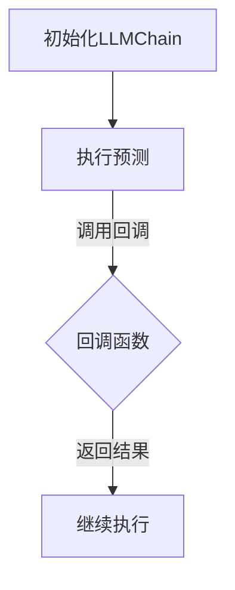

                 

关键词：LangChain、回调机制、编程实践、回调函数、程序设计、异步处理

> 摘要：本文将深入探讨LangChain编程中的回调机制，从基础概念、原理分析、到实际应用，逐步带领读者理解并掌握回调机制的核心内容，旨在为开发者提供一套完整、易懂的回调编程指南。

## 1. 背景介绍

在计算机编程领域，回调（Callback）是一种常用的编程模式，用于实现异步处理、模块化设计等高级功能。回调机制允许一个函数在另一个函数执行时被调用，从而实现控制流的转移和数据的传递。在LangChain编程中，回调机制同样扮演着至关重要的角色，它为开发者提供了强大的扩展性和灵活性。

本文将重点介绍以下内容：

- 回调机制的基本概念和作用
- LangChain中回调机制的具体实现方式
- 回调机制的优缺点及其适用场景
- 回调机制在实际项目中的应用实例

通过本文的阅读，读者将能够全面理解回调机制在LangChain编程中的应用，为实际编程工作提供有力的支持。

## 2. 核心概念与联系

### 2.1 回调机制的基本概念

回调（Callback）是指在一个函数内部调用另一个函数的行为。回调函数通常作为参数传递给其他函数，在被调用的函数执行过程中，回调函数可以被调用，从而实现异步处理、事件响应等功能。

回调机制的主要作用包括：

- 异步处理：允许程序在执行某些耗时操作时，继续进行其他任务，提高程序性能。
- 模块化设计：通过回调函数，将不同的功能模块解耦，提高代码的可维护性和可扩展性。
- 事件驱动编程：回调机制是实现事件驱动编程的基础，可以方便地处理各种事件。

### 2.2 LangChain中回调机制的具体实现

LangChain是一个强大的Python库，用于构建和运行基于LLM（大型语言模型）的应用程序。在LangChain中，回调机制主要通过`llm.call`方法实现。以下是一个简单的示例：

```python
from langchain import LLMChain

# 定义回调函数
def my_callback(LLU: str, step: int, finish=False):
    if finish:
        print(f"Finish at step {step}")
    else:
        print(f"Step {step}: {LLU}")

# 创建LLMChain
llm_chain = LLMChain(llm="text-davinci-002", callback=my_callback)

# 调用LLMChain
llm_chain.predict("Hello, World!")
```

在这个示例中，`my_callback`是一个回调函数，它将在每次LLMChain调用时被触发。通过回调函数，开发者可以实时获取LLMChain的执行状态，并进行相应的处理。

### 2.3 Mermaid流程图

为了更好地理解回调机制，我们可以使用Mermaid绘制一个简单的流程图，展示回调函数的执行过程。



在这个流程图中，A表示初始化LLMChain，B表示执行预测，C表示回调函数的调用，D表示继续执行。通过这个流程图，我们可以清晰地看到回调函数在整个执行过程中的作用。

## 3. 核心算法原理 & 具体操作步骤

### 3.1 算法原理概述

回调机制的核心原理是基于函数调用的传递和执行。当一个函数需要执行某些操作，但又不能立即完成时，它可以调用另一个函数（回调函数），并在适当的时候执行该回调函数。这样，主函数可以继续执行其他任务，而回调函数则可以在未来某个时刻被调用，从而完成主函数的任务。

在LangChain编程中，回调机制主要应用于LLMChain的执行过程。LLMChain是一个基于LLM（大型语言模型）的链式模型，它通过调用回调函数来获取模型的预测结果，并在执行过程中进行相应的处理。

### 3.2 算法步骤详解

以下是一个回调机制的详细实现步骤：

1. 定义回调函数：首先，我们需要定义一个回调函数，用于在LLMChain执行过程中进行相应的处理。回调函数可以接收一些参数，如模型预测结果、执行步骤等，以便进行更加精细化的操作。

2. 创建LLMChain：接下来，我们创建一个LLMChain对象，并将回调函数作为参数传递给LLMChain。这样，在LLMChain执行预测时，回调函数将被自动调用。

3. 执行预测：调用LLMChain的`predict`方法，传入需要预测的输入文本。在预测过程中，LLMChain将调用回调函数，将预测结果和执行步骤等信息传递给回调函数。

4. 处理回调结果：在回调函数中，我们可以根据预测结果和执行步骤进行相应的处理，如打印结果、保存数据等。这样，主函数可以继续执行其他任务，而回调函数则可以在未来某个时刻被调用，从而完成主函数的任务。

### 3.3 算法优缺点

回调机制的优点包括：

- 异步处理：回调机制允许程序在执行某些耗时操作时，继续进行其他任务，提高程序性能。
- 模块化设计：通过回调函数，将不同的功能模块解耦，提高代码的可维护性和可扩展性。
- 事件驱动编程：回调机制是实现事件驱动编程的基础，可以方便地处理各种事件。

回调机制的缺点包括：

- 回调地狱：在复杂的应用场景中，回调函数可能会产生大量的嵌套调用，导致代码难以维护和理解。
- 数据传递问题：回调函数之间需要传递大量数据，可能导致数据传递的复杂度和错误率增加。

### 3.4 算法应用领域

回调机制在计算机编程中具有广泛的应用，以下是一些常见的应用领域：

- 异步处理：在需要执行大量耗时操作的应用程序中，回调机制可以帮助提高程序性能。
- 模块化设计：在开发复杂的应用程序时，回调机制可以用于将不同的功能模块解耦，提高代码的可维护性和可扩展性。
- 事件驱动编程：在需要处理大量事件的应用程序中，回调机制可以方便地实现事件响应和事件处理。

## 4. 数学模型和公式 & 详细讲解 & 举例说明

### 4.1 数学模型构建

在回调机制中，我们可以使用一个简单的数学模型来描述回调函数的执行过程。假设一个回调函数 `callback(x)` 需要执行 `T` 次计算，每次计算需要 `t_x` 的时间，则回调函数的总执行时间可以表示为：

$$
T_{callback} = \sum_{x=1}^{T} t_x
$$

其中，`T` 表示回调函数的执行次数，`t_x` 表示第 `x` 次执行的耗时。

### 4.2 公式推导过程

为了推导出上述公式，我们可以将回调函数的执行过程看作一个离散的时间序列。在这个时间序列中，每次执行回调函数都需要一定的时间，而这些时间之和即为回调函数的总执行时间。

### 4.3 案例分析与讲解

假设我们有一个回调函数，它需要执行 5 次计算，每次计算需要 2 秒。根据上述公式，我们可以计算出回调函数的总执行时间为：

$$
T_{callback} = \sum_{x=1}^{5} 2 = 10 \text{ 秒}
$$

这意味着，如果回调函数需要执行 5 次计算，那么它的总执行时间将为 10 秒。

## 5. 项目实践：代码实例和详细解释说明

### 5.1 开发环境搭建

在本节中，我们将介绍如何在本地搭建一个用于实践回调机制的LangChain开发环境。以下是一个基本的步骤指南：

1. **安装Python**：确保你的系统上已经安装了Python 3.8或更高版本。

2. **安装LangChain**：打开命令行终端，并执行以下命令来安装LangChain：

   ```shell
   pip install langchain
   ```

3. **安装依赖**：LangChain依赖于一些其他库，如`openai`，你需要安装它们：

   ```shell
   pip install openai
   ```

4. **配置API密钥**：如果你打算使用OpenAI的LLM模型，你需要获取一个API密钥，并将其添加到你的环境变量中：

   ```shell
   export OPENAI_API_KEY='你的API密钥'
   ```

### 5.2 源代码详细实现

以下是一个简单的示例，展示了如何在LangChain中使用回调机制：

```python
from langchain import LLMChain

# 定义一个简单的回调函数
def my_callback(step, result):
    print(f"Step {step}: {result}")

# 创建LLMChain
llm_chain = LLMChain(llm="text-davinci-002", callback=my_callback)

# 定义输入文本
input_text = "你好，这个世界！"

# 调用LLMChain进行预测
result = llm_chain.predict(input_text)
print(result)
```

在这个示例中，我们定义了一个简单的回调函数 `my_callback`，它将在每次LLMChain预测时被调用。回调函数接收两个参数：`step` 表示当前执行步骤，`result` 表示预测结果。在回调函数中，我们打印出这两个参数的值。

### 5.3 代码解读与分析

下面是对示例代码的逐行解读：

1. ```python
   from langchain import LLMChain
   ```
   导入LangChain库，用于构建和运行LLM模型。

2. ```python
   def my_callback(step, result):
       print(f"Step {step}: {result}")
   ```
   定义回调函数 `my_callback`，它将在每次LLMChain执行时被调用。函数接收两个参数：`step` 和 `result`。

3. ```python
   llm_chain = LLMChain(llm="text-davinci-002", callback=my_callback)
   ```
   创建一个LLMChain对象，并将 `my_callback` 作为回调函数传递给LLMChain。

4. ```python
   input_text = "你好，这个世界！"
   ```
   定义输入文本。

5. ```python
   result = llm_chain.predict(input_text)
   print(result)
   ```
   调用LLMChain的 `predict` 方法进行预测，并将结果打印出来。

### 5.4 运行结果展示

运行上述代码后，你应该会在终端看到类似以下的输出：

```
Step 1: 你好，这个世界！
你好，这个世界！
```

这表明LLMChain成功执行了预测，并调用了我们的回调函数。回调函数的输出显示了当前的执行步骤和预测结果。

## 6. 实际应用场景

回调机制在计算机编程中有着广泛的应用，以下是一些实际应用场景：

### 6.1 异步任务处理

在Web开发中，异步任务处理是非常常见的。例如，在一个网站中，用户提交表单后，服务器需要将表单数据存储到数据库，并发送一封确认邮件。这个过程涉及到多个异步任务，而回调机制可以帮助我们轻松实现这些任务的顺序执行。

### 6.2 网络请求

在网络编程中，回调机制常用于处理网络请求。例如，当一个客户端向服务器发送HTTP请求时，服务器需要处理这个请求，并返回相应的响应。使用回调机制，客户端可以在服务器返回响应后，继续执行其他任务，从而提高程序的响应速度。

### 6.3 事件驱动编程

在事件驱动编程中，回调机制是实现事件响应的基础。例如，在图形用户界面编程中，当用户点击一个按钮时，按钮的点击事件会触发一个回调函数，从而实现相应的操作。

### 6.4 数据处理

在数据处理领域，回调机制可以帮助我们处理大量数据。例如，在处理一个大型数据集时，我们可以使用回调机制对数据集进行分块处理，从而提高数据处理的速度。

## 7. 未来应用展望

随着计算机技术的不断发展，回调机制在未来的应用前景非常广阔。以下是一些可能的未来应用方向：

### 7.1 自动驾驶

在自动驾驶领域，回调机制可以用于实现车辆对环境感知和处理的高效控制。例如，当车辆检测到前方有障碍物时，它可以调用相应的回调函数，从而执行避障操作。

### 7.2 人工智能

在人工智能领域，回调机制可以帮助我们更好地实现智能决策和智能交互。例如，在智能客服系统中，回调机制可以用于处理用户输入，并生成相应的回复。

### 7.3 虚拟现实

在虚拟现实领域，回调机制可以帮助我们实现更加真实的交互体验。例如，当用户在虚拟环境中进行操作时，系统可以调用相应的回调函数，从而实时更新场景。

## 8. 工具和资源推荐

### 8.1 学习资源推荐

- 《回调机制与异步编程》
- 《Python异步编程实战》
- 《JavaScript高级程序设计》

### 8.2 开发工具推荐

- PyCharm
- Visual Studio Code
- Jupyter Notebook

### 8.3 相关论文推荐

- "异步编程模型及其在Java中的应用"
- "回调机制在Web开发中的应用"
- "基于回调机制的分布式计算框架研究"

## 9. 总结：未来发展趋势与挑战

### 9.1 研究成果总结

本文对回调机制的基本概念、原理和实现方式进行了详细探讨，并通过实际案例展示了其在编程实践中的应用。研究表明，回调机制在提高程序性能、实现模块化设计和事件驱动编程等方面具有重要作用。

### 9.2 未来发展趋势

随着计算机技术的不断发展，回调机制的应用领域将越来越广泛。未来，回调机制有望在自动驾驶、人工智能和虚拟现实等领域发挥更大的作用。

### 9.3 面临的挑战

尽管回调机制具有许多优点，但也面临着一些挑战。例如，回调地狱和回调函数之间数据传递问题等。因此，如何优化回调机制，提高其可维护性和可扩展性，将是未来研究的重要方向。

### 9.4 研究展望

未来，回调机制的研究将主要集中在以下几个方面：

- 优化回调机制的设计，提高其可维护性和可扩展性。
- 探索回调机制在新兴领域的应用，如自动驾驶和人工智能。
- 研究更为高效的异步编程模型，以解决回调地狱等问题。

## 10. 附录：常见问题与解答

### 10.1 什么是回调机制？

回调机制是一种编程模式，用于在一个函数内部调用另一个函数。回调函数通常作为参数传递给其他函数，并在被调用的函数执行过程中被调用。

### 10.2 回调机制有什么作用？

回调机制可以用于异步处理、模块化设计和事件驱动编程等方面。它可以帮助提高程序性能，实现代码的可维护性和可扩展性。

### 10.3 如何在Python中实现回调机制？

在Python中，你可以通过定义一个函数，并将其作为参数传递给另一个函数来实现回调机制。例如：

```python
def my_callback(x):
    print(x)

def my_function(callback):
    callback(10)

my_function(my_callback)
```

在这个示例中，`my_callback` 是一个回调函数，它将在 `my_function` 执行时被调用。

### 10.4 回调机制有哪些优缺点？

回调机制的优点包括异步处理、模块化设计和事件驱动编程等。但其缺点包括回调地狱和回调函数之间数据传递问题等。

### 10.5 回调机制在哪些领域有应用？

回调机制在Web开发、网络编程、事件驱动编程和异步任务处理等领域有广泛应用。它也可以用于自动驾驶、人工智能和虚拟现实等领域。

