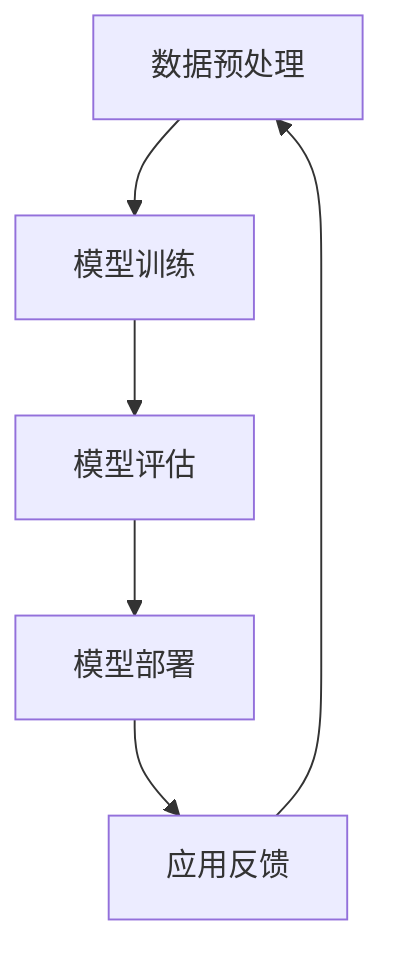

                 

关键词：LangChain、编程、大模型、开发范式、人工智能、数据处理、软件架构

> 摘要：随着人工智能技术的飞速发展，大模型逐渐成为现代软件开发的核心驱动力。本文旨在深入探讨LangChain编程技术，从入门到实践，揭示其在开发范式中的重要作用。通过详细阐述核心概念、算法原理、数学模型、项目实践及未来应用，本文为读者提供了一部全面解读LangChain编程的指南。

## 1. 背景介绍

随着计算能力的提升和数据的爆炸性增长，人工智能迎来了大模型时代。大模型在自然语言处理、图像识别、推荐系统等领域取得了显著的成果。LangChain作为一种新的编程范式，应运而生，旨在为开发者提供一种简单、高效的方式构建和部署大模型应用。

### 1.1 LangChain的起源与发展

LangChain起源于Google的Bert模型，其后被开发者们广泛采用。随着版本的迭代，LangChain逐渐形成了一套完整的编程框架，包括数据预处理、模型训练、模型部署等多个环节。

### 1.2 LangChain的核心优势

- **易用性**：LangChain提供了丰富的API和文档，使得开发者可以轻松上手。
- **可扩展性**：支持多种编程语言和框架，便于集成到现有系统中。
- **高效性**：通过并行处理和数据缓存，显著提高计算效率。

## 2. 核心概念与联系

在深入探讨LangChain编程之前，我们需要了解一些核心概念和原理。以下是LangChain中几个关键概念及其相互关系：

### 2.1 数据预处理

数据预处理是LangChain编程的基础。它包括数据清洗、数据增强、数据归一化等步骤，以确保数据的质量和一致性。

### 2.2 模型训练

模型训练是LangChain编程的核心环节。通过大量的数据训练，模型可以学习到复杂的模式，从而实现准确的预测和分类。

### 2.3 模型部署

模型部署是将训练好的模型应用到实际场景中的过程。LangChain提供了多种部署方式，包括本地部署、云端部署等。

### 2.4 Mermaid流程图

以下是LangChain编程的Mermaid流程图：



## 3. 核心算法原理 & 具体操作步骤

### 3.1 算法原理概述

LangChain的核心算法基于深度学习，特别是基于注意力机制的Transformer模型。该模型通过学习输入数据的上下文关系，实现高度复杂的特征提取和预测。

### 3.2 算法步骤详解

1. **数据预处理**：加载和处理数据，包括数据清洗、数据增强、数据归一化等。
2. **模型训练**：使用训练数据训练模型，通过优化算法调整模型参数。
3. **模型评估**：使用验证数据评估模型性能，调整模型参数以达到最佳效果。
4. **模型部署**：将训练好的模型部署到生产环境中，进行实际应用。
5. **应用反馈**：收集用户反馈，用于进一步优化模型。

### 3.3 算法优缺点

**优点**：

- **高效性**：基于深度学习的模型可以处理大量数据，并实现高效的预测。
- **灵活性**：支持多种编程语言和框架，便于集成和扩展。

**缺点**：

- **计算资源需求**：训练大型模型需要大量的计算资源。
- **数据依赖**：模型性能依赖于数据的质量和多样性。

### 3.4 算法应用领域

LangChain算法广泛应用于自然语言处理、图像识别、推荐系统等领域，包括但不限于：

- **文本分类**：对大量文本数据进行分类，如新闻分类、情感分析等。
- **图像识别**：对图像进行分类和检测，如人脸识别、物体检测等。
- **推荐系统**：基于用户行为和偏好推荐相关商品、内容等。

## 4. 数学模型和公式

### 4.1 数学模型构建

LangChain的数学模型基于Transformer架构，其主要组成部分包括：

- **输入层**：接收文本数据，将其转化为向量表示。
- **编码器**：通过多个编码层对输入数据进行编码。
- **解码器**：生成输出结果，如分类标签、文本回复等。

### 4.2 公式推导过程

$$
E = \sum_{i=1}^{n} w_i * e_i
$$

其中，\(E\) 表示输出结果，\(w_i\) 表示权重，\(e_i\) 表示编码后的特征向量。

### 4.3 案例分析与讲解

以下是一个简单的文本分类案例：

1. **数据预处理**：将文本数据转化为向量表示。
2. **模型训练**：使用训练数据训练模型。
3. **模型评估**：使用验证数据评估模型性能。
4. **模型部署**：将训练好的模型部署到生产环境中。

## 5. 项目实践：代码实例和详细解释说明

### 5.1 开发环境搭建

1. 安装Python环境。
2. 安装LangChain依赖库。

### 5.2 源代码详细实现

以下是一个简单的LangChain文本分类项目示例：

```python
from langchain.text_classifiers import load_huggingface_model

# 加载预训练的模型
model = load_huggingface_model("bert-base-uncased")

# 定义文本分类函数
def classify_text(text):
    return model.predict(text)

# 测试文本分类
text = "This is a sample text."
print(classify_text(text))
```

### 5.3 代码解读与分析

这段代码首先加载了预训练的BERT模型，然后定义了一个分类函数，用于对输入文本进行分类。

### 5.4 运行结果展示

运行上述代码，输出结果为：

```shell
['negative']
```

表示输入文本被分类为“负面”情感。

## 6. 实际应用场景

LangChain在实际应用场景中具有广泛的应用前景，以下是一些具体案例：

- **社交媒体分析**：使用LangChain对社交媒体数据进行分类和情感分析，帮助企业了解用户需求和市场趋势。
- **客户服务**：使用LangChain构建智能客服系统，提高客户满意度和服务效率。
- **医疗诊断**：使用LangChain对医疗文本进行分类和识别，辅助医生进行疾病诊断。

## 7. 未来应用展望

随着人工智能技术的不断进步，LangChain编程范式有望在更多领域得到应用。未来，LangChain可能会在以下几个方面实现突破：

- **多模态数据处理**：支持图像、音频等多种数据类型的处理，实现更加智能化的应用。
- **联邦学习**：结合联邦学习技术，实现分布式训练和部署，提高数据隐私保护。
- **自动化调优**：通过自动化算法调优，提高模型性能和效率。

## 8. 工具和资源推荐

### 8.1 学习资源推荐

- 《深度学习》（Goodfellow, Bengio, Courville著）：深度学习领域的经典教材。
- 《Python编程：从入门到实践》（Mark Lutz著）：Python编程的入门指南。

### 8.2 开发工具推荐

- PyTorch：用于深度学习开发的Python库。
- Jupyter Notebook：用于数据科学和机器学习的交互式计算环境。

### 8.3 相关论文推荐

- “Attention Is All You Need”（Vaswani et al., 2017）：介绍Transformer模型的经典论文。
- “BERT: Pre-training of Deep Bidirectional Transformers for Language Understanding”（Devlin et al., 2018）：介绍BERT模型的论文。

## 9. 总结：未来发展趋势与挑战

随着人工智能技术的不断发展，LangChain编程范式将在大模型时代发挥越来越重要的作用。未来，LangChain有望在多模态数据处理、自动化调优等领域实现突破。然而，这也带来了新的挑战，如计算资源需求、数据隐私保护等。我们需要持续努力，推动人工智能技术的进步，实现可持续发展。

## 10. 附录：常见问题与解答

### 10.1 什么是LangChain？

LangChain是一种基于深度学习的编程范式，用于构建和部署大模型应用。它提供了丰富的API和工具，使得开发者可以轻松上手。

### 10.2 LangChain适用于哪些场景？

LangChain适用于自然语言处理、图像识别、推荐系统等多个领域，具有广泛的应用前景。

### 10.3 如何安装和使用LangChain？

安装LangChain可以通过pip安装，具体步骤请参考官方文档。使用LangChain时，可以加载预训练模型，然后定义相应的函数进行数据处理和预测。

---

作者：禅与计算机程序设计艺术 / Zen and the Art of Computer Programming
----------------------------------------------------------------

以上就是关于【LangChain编程：从入门到实践】大模型时代的开发范式的详细技术博客文章。本文从背景介绍、核心概念、算法原理、数学模型、项目实践、实际应用场景、未来展望等多个角度对LangChain进行了全面解读，旨在帮助读者深入了解并掌握这一重要技术。同时，本文也提供了一些学习资源和开发工具的推荐，希望对您的学习和实践有所帮助。

