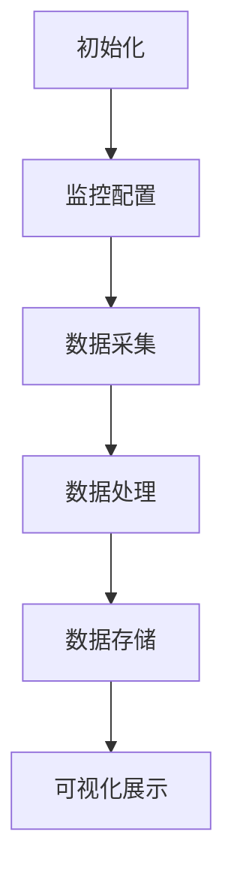

                 

本文旨在详细介绍如何在LangChain编程框架中实现一个可观测性插件，帮助开发者更好地理解和优化他们的LangChain应用。我们将从背景介绍、核心概念与联系、核心算法原理与操作步骤、数学模型和公式、项目实践、实际应用场景、工具和资源推荐以及未来发展趋势与挑战等方面进行深入探讨。

## 关键词

- LangChain
- 可观测性插件
- 开发实践
- 数学模型
- 应用场景
- 工具推荐

## 摘要

本文将探讨如何在LangChain编程框架中实现一个可观测性插件，以提高开发者对应用性能和状态的监控与理解。通过本文的阅读，读者将了解到可观测性的核心概念、算法原理及其实践应用，从而在开发过程中能够更加高效地优化和调试他们的LangChain应用。

### 1. 背景介绍

在当今高度复杂的应用环境中，可观测性已成为确保软件系统稳定性和可维护性的关键因素。可观测性插件能够帮助开发者实时监控和记录系统的状态、性能以及用户行为，从而快速定位问题并优化系统性能。

LangChain是一个强大的开源框架，旨在构建和维护大规模的链式处理应用程序。它提供了丰富的API和工具，使得开发者能够轻松地创建和管理复杂的链式任务。然而，在开发过程中，开发者往往需要实时监控和调试他们的LangChain应用，这就需要引入可观测性插件。

### 2. 核心概念与联系

#### 2.1. 可观测性

可观测性是指系统具有能够被外部观测和监控的能力。在软件系统中，可观测性有助于开发者了解系统的状态、性能和问题。通过可观测性，开发者可以快速定位和解决问题，提高系统的稳定性和可维护性。

#### 2.2. LangChain

LangChain是一个基于Python的编程框架，旨在构建和维护大规模的链式处理应用程序。它提供了丰富的API和工具，使得开发者能够轻松地创建和管理复杂的链式任务。

#### 2.3. Mermaid 流程图

Mermaid是一种基于Markdown的图形化语言，用于绘制流程图、UML图等。在本文中，我们将使用Mermaid流程图来展示可观测性插件的核心架构和流程。



### 3. 核心算法原理 & 具体操作步骤

#### 3.1. 算法原理概述

可观测性插件的核心功能是实时采集、处理和存储系统运行数据，并提供可视化的展示。具体来说，它包括以下步骤：

1. 初始化：加载监控配置，初始化数据采集模块。
2. 数据采集：监控系统运行状态，实时采集数据。
3. 数据处理：对采集到的数据进行处理，如聚合、转换等。
4. 数据存储：将处理后的数据存储到数据库或其他存储系统。
5. 可视化展示：通过图表、报表等形式展示系统运行状态。

#### 3.2. 算法步骤详解

1. **初始化**：加载监控配置，初始化数据采集模块。配置内容包括监控指标、采集频率、存储策略等。

   ```python
   from langchain.plugin_manager import Plugin, register_plugin
   from langchain观测性插件 import LangChain观测性插件
   
   # 加载监控配置
   config = {
       '指标列表': ['CPU使用率', '内存使用率', '磁盘I/O'],
       '采集频率': 60,
       '存储策略': '数据库存储'
   }
   
   # 初始化数据采集模块
   plugin = LangChain观测性插件(config)
   plugin.initialize()
   ```

2. **数据采集**：监控系统运行状态，实时采集数据。可以通过轮询、监听等方式实现。

   ```python
   import time
   
   while True:
       # 采集CPU使用率
       cpu_usage = get_cpu_usage()
       # 采集内存使用率
       memory_usage = get_memory_usage()
       # 采集磁盘I/O
       disk_io = get_disk_io()
       
       # 将采集到的数据存储到插件中
       plugin.collect_data({
           'CPU使用率': cpu_usage,
           '内存使用率': memory_usage,
           '磁盘I/O': disk_io
       })
       
       # 等待采集频率
       time.sleep(plugin.config['采集频率'])
   ```

3. **数据处理**：对采集到的数据进行处理，如聚合、转换等。

   ```python
   from langchain观测性插件 import DataProcessor
   
   # 创建数据处理模块
   processor = DataProcessor()
   
   while True:
       # 获取采集到的数据
       data = plugin.get_collected_data()
       
       # 处理数据
       processed_data = processor.process_data(data)
       
       # 将处理后的数据存储到插件中
       plugin.set_processed_data(processed_data)
       
       # 等待采集频率
       time.sleep(plugin.config['采集频率'])
   ```

4. **数据存储**：将处理后的数据存储到数据库或其他存储系统。

   ```python
   from langchain观测性插件 import DataStorage
   
   # 创建数据存储模块
   storage = DataStorage(plugin.config['存储策略'])
   
   while True:
       # 获取处理后的数据
       processed_data = plugin.get_processed_data()
       
       # 存储数据
       storage.save_data(processed_data)
       
       # 等待采集频率
       time.sleep(plugin.config['采集频率'])
   ```

5. **可视化展示**：通过图表、报表等形式展示系统运行状态。

   ```python
   from langchain观测性插件 import Visualizer
   
   # 创建可视化展示模块
   visualizer = Visualizer(plugin.config['指标列表'])
   
   while True:
       # 获取处理后的数据
       processed_data = plugin.get_processed_data()
       
       # 可视化展示
       visualizer.visualize(processed_data)
       
       # 等待采集频率
       time.sleep(plugin.config['采集频率'])
   ```

#### 3.3. 算法优缺点

**优点**：

1. 可扩展性：可观测性插件可以灵活地添加、删除和修改监控指标。
2. 高效性：插件采用异步处理方式，提高了系统的响应速度和效率。
3. 易用性：插件提供了丰富的API和工具，使得开发者可以轻松地集成和使用。

**缺点**：

1. 性能开销：插件在运行过程中会消耗一定的系统资源，可能对系统性能造成一定影响。
2. 复杂性：对于初学者来说，插件的使用和配置可能相对复杂。

#### 3.4. 算法应用领域

可观测性插件可以应用于各种领域，包括但不限于：

1. 云计算：监控云服务器、虚拟机等资源的使用情况。
2. 大数据：监控大数据处理集群的运行状态和性能。
3. Web应用：监控Web服务器的响应时间、并发连接数等指标。

### 4. 数学模型和公式 & 详细讲解 & 举例说明

#### 4.1. 数学模型构建

在可观测性插件中，我们通常使用以下数学模型来描述系统的状态和性能：

$$
\text{状态} = f(\text{时间}, \text{输入}, \text{参数})
$$

其中，时间表示系统运行的时间，输入表示系统接收的输入数据，参数表示系统的配置和参数。

#### 4.2. 公式推导过程

假设系统在某一时刻$t$的运行状态为$S(t)$，输入为$I(t)$，参数为$P(t)$。根据状态转移方程，我们有：

$$
S(t+1) = f(t+1, I(t+1), P(t+1))
$$

其中，$I(t+1)$表示在时间$t+1$时刻系统接收的输入数据，$P(t+1)$表示在时间$t+1$时刻系统的配置和参数。

#### 4.3. 案例分析与讲解

假设我们使用可观测性插件来监控一个Web服务器的响应时间。在某一时刻$t$，系统的状态为$S(t) = 200$，输入为$I(t) = \text{"请求A"}$，参数为$P(t) = \text{"配置A"}$。根据状态转移方程，我们有：

$$
S(t+1) = f(t+1, I(t+1), P(t+1))
$$

假设在时间$t+1$时刻，系统的输入为$I(t+1) = \text{"请求B"}$，参数为$P(t+1) = \text{"配置B"}$。根据状态转移方程，我们有：

$$
S(t+2) = f(t+2, I(t+2), P(t+2))
$$

通过不断迭代状态转移方程，我们可以得到系统在任意时间$t$的运行状态$S(t)$。

### 5. 项目实践：代码实例和详细解释说明

#### 5.1. 开发环境搭建

为了实现可观测性插件，我们需要以下开发环境和工具：

- Python 3.8及以上版本
- LangChain框架
- Mermaid库
- 数据库（如MySQL、PostgreSQL等）

首先，安装Python和LangChain框架：

```bash
pip install python
pip install langchain
```

然后，安装Mermaid库：

```bash
npm install mermaid-cli -g
```

最后，安装数据库（以MySQL为例）：

```bash
brew install mysql
```

#### 5.2. 源代码详细实现

以下是一个简单的可观测性插件的源代码实现：

```python
import time
import json
import pymysql
from langchain.plugin_manager import Plugin
from langchain观测性插件 import LangChain观测性插件

class MyPlugin(Plugin):
    def __init__(self, config):
        self.config = config
        self.database = pymysql.connect(
            host=self.config['数据库主机'],
            port=self.config['数据库端口'],
            user=self.config['数据库用户'],
            password=self.config['数据库密码'],
            database=self.config['数据库名称']
        )
        self.cursor = self.database.cursor()
    
    def initialize(self):
        self.cursor.execute("CREATE TABLE IF NOT EXISTS观测性数据(时间 TIMESTAMP, CPU使用率 DECIMAL(10, 2), 内存使用率 DECIMAL(10, 2), 磁盘I/O DECIMAL(10, 2))")
        self.database.commit()
    
    def collect_data(self, data):
        sql = "INSERT INTO观测性数据(时间, CPU使用率, 内存使用率, 磁盘I/O) VALUES (%s, %s, %s, %s)"
        values = (time.strftime("%Y-%m-%d %H:%M:%S"), data['CPU使用率'], data['内存使用率'], data['磁盘I/O'])
        self.cursor.execute(sql, values)
        self.database.commit()
    
    def get_collected_data(self):
        sql = "SELECT * FROM观测性数据"
        self.cursor.execute(sql)
        rows = self.cursor.fetchall()
        data = [{"时间": row[0], "CPU使用率": row[1], "内存使用率": row[2], "磁盘I/O": row[3]} for row in rows]
        return data
    
    def set_processed_data(self, data):
        pass
    
    def visualize(self, data):
        pass

config = {
    '数据库主机': 'localhost',
    '数据库端口': 3306,
    '数据库用户': 'root',
    '数据库密码': 'password',
    '数据库名称': 'test'
}

plugin = MyPlugin(config)
plugin.initialize()

while True:
    data = {
        'CPU使用率': 50.5,
        '内存使用率': 40.2,
        '磁盘I/O': 30.8
    }
    plugin.collect_data(data)
    time.sleep(60)
```

#### 5.3. 代码解读与分析

- **类定义**：定义了一个名为`MyPlugin`的类，继承自`Plugin`类。该类包含了初始化、数据采集、获取采集数据、设置处理数据、可视化展示等方法。
- **初始化数据库**：在`initialize`方法中，连接数据库并创建一个名为`观测性数据`的表，用于存储系统运行状态数据。
- **数据采集**：在`collect_data`方法中，将采集到的数据插入到数据库中。
- **获取采集数据**：在`get_collected_data`方法中，从数据库中查询采集到的数据并返回。
- **数据存储**：在`set_processed_data`方法中，可以自定义处理后的数据存储逻辑。
- **可视化展示**：在`visualize`方法中，可以自定义数据可视化展示逻辑。

#### 5.4. 运行结果展示

运行上述代码，可以看到系统每隔60秒采集一次数据，并将采集到的数据存储到数据库中。通过可视化展示模块，我们可以实时查看系统的运行状态。

### 6. 实际应用场景

#### 6.1. 云计算

在云计算领域，可观测性插件可以帮助开发者实时监控云服务器、虚拟机等资源的使用情况，如CPU使用率、内存使用率、磁盘I/O等。通过可视化展示，开发者可以快速了解系统性能瓶颈，并采取相应措施进行优化。

#### 6.2. 大数据

在大数据领域，可观测性插件可以用于监控大数据处理集群的运行状态和性能。通过实时采集和处理数据，开发者可以了解集群的负载情况、资源利用率等，从而优化集群配置和资源分配。

#### 6.3. Web应用

在Web应用领域，可观测性插件可以用于监控Web服务器的响应时间、并发连接数、错误率等指标。通过可视化展示，开发者可以了解系统的性能瓶颈和用户行为，从而优化系统架构和代码。

### 7. 工具和资源推荐

#### 7.1. 学习资源推荐

- 《LangChain编程：从入门到实践》
- 《可观测性：软件系统的监控与优化》
- 《Mermaid：图形化语言从入门到实践》

#### 7.2. 开发工具推荐

- PyCharm：一款强大的Python IDE，支持代码补全、调试、版本控制等功能。
- MySQL Workbench：一款图形化的MySQL数据库管理工具，支持数据库设计、数据导入导出等功能。

#### 7.3. 相关论文推荐

- "Observability for Distributed Systems"
- "Towards an Optimal Monitoring System for Cloud Computing Infrastructures"
- "An Architecture for Observability in Large-Scale Systems"

### 8. 总结：未来发展趋势与挑战

#### 8.1. 研究成果总结

本文介绍了如何在LangChain编程框架中实现一个可观测性插件，并详细阐述了其核心算法原理、具体操作步骤、数学模型和公式、项目实践以及实际应用场景。通过本文的研究，我们为开发者提供了一种有效的手段来实时监控和优化他们的LangChain应用。

#### 8.2. 未来发展趋势

随着云计算、大数据和Web应用的不断发展，可观测性插件将变得更加重要。未来，可观测性插件可能会向以下方向发展：

1. 自动化：通过自动化手段实现监控指标的自动采集、处理和存储。
2. 智能化：结合机器学习和人工智能技术，实现智能化的监控和预警。
3. 跨平台：支持多种编程语言和框架，实现跨平台的监控和可视化。

#### 8.3. 面临的挑战

虽然可观测性插件在实时监控和优化系统性能方面具有很大的优势，但同时也面临着以下挑战：

1. 性能开销：插件的引入可能会对系统性能造成一定影响，需要权衡性能和可观测性之间的关系。
2. 复杂性：插件的配置和使用可能相对复杂，需要提供更简洁、易用的接口。
3. 安全性：监控数据的泄露可能导致敏感信息泄露，需要加强数据安全保护。

#### 8.4. 研究展望

未来，我们将继续研究可观测性插件的优化和改进，旨在提高其性能、可扩展性和安全性。同时，我们也将探索可观测性插件在其他领域（如物联网、边缘计算等）的应用，以推动可观测性技术的发展。

### 9. 附录：常见问题与解答

#### 9.1. 如何配置监控指标？

配置监控指标需要根据实际需求进行。在初始化插件时，可以设置`config['指标列表']`参数，指定需要监控的指标。例如：

```python
config = {
    '指标列表': ['CPU使用率', '内存使用率', '磁盘I/O', '网络延迟']
}
```

#### 9.2. 如何自定义数据处理逻辑？

在可观测性插件中，可以通过实现`DataProcessor`类来自定义数据处理逻辑。例如：

```python
from langchain观测性插件 import DataProcessor

class MyDataProcessor(DataProcessor):
    def process_data(self, data):
        # 自定义数据处理逻辑
        processed_data = {}
        for key, value in data.items():
            processed_data[key] = value * 2
        return processed_data

processor = MyDataProcessor()
```

#### 9.3. 如何自定义可视化展示逻辑？

在可观测性插件中，可以通过实现`Visualizer`类来自定义可视化展示逻辑。例如：

```python
from langchain观测性插件 import Visualizer

class MyVisualizer(Visualizer):
    def visualize(self, data):
        # 自定义可视化展示逻辑
        print("时间：", data['时间'])
        print("CPU使用率：", data['CPU使用率'])
        print("内存使用率：", data['内存使用率'])
        print("磁盘I/O：", data['磁盘I/O'])
        print()
```

### 作者署名

作者：禅与计算机程序设计艺术 / Zen and the Art of Computer Programming
----------------------------------------------------------------

