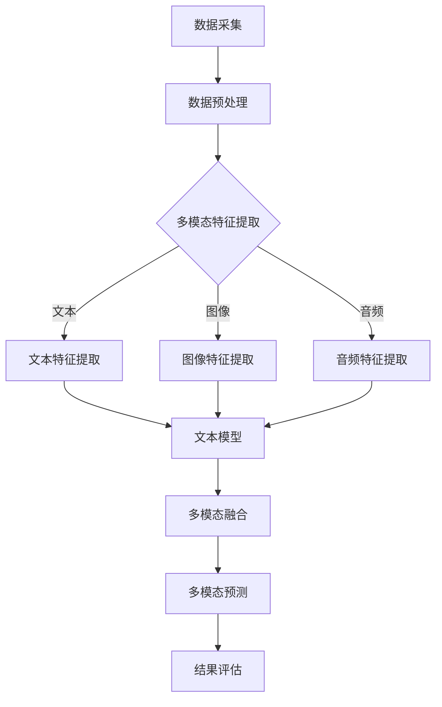

                 

关键词：LangChain、多模态机器人、编程实践、AI应用、框架开发、集成学习

> 摘要：本文将深入探讨如何使用LangChain构建多模态机器人。从基础概念到具体实现，我们将一步步了解如何利用这一强大框架进行编程实践，从而实现跨模态的智能交互系统。

## 1. 背景介绍

随着人工智能技术的迅猛发展，机器学习特别是深度学习已经成为各行各业不可或缺的工具。然而，单一模态（如文本或图像）的信息处理往往存在局限性，无法全面捕捉现实世界的复杂性。多模态学习通过整合不同类型的数据（如文本、图像、音频等），实现了更全面、更准确的信息理解。

LangChain是由Hugging Face推出的一款强大的开源多模态学习框架，旨在简化多模态任务的开发过程。通过结合先进的自然语言处理（NLP）和计算机视觉（CV）技术，LangChain使得构建能够处理多种数据类型的智能系统变得更加容易。

本文将围绕LangChain的核心概念，详细介绍如何利用该框架构建一个多模态机器人。我们将探讨多模态学习的原理、实现流程，并分享实际编程中的技巧和经验。

## 2. 核心概念与联系

在深入了解LangChain之前，我们需要先了解一些核心概念和它们之间的联系。以下是多模态学习的关键组成部分：

### 2.1 多模态数据

多模态数据是指包含多种不同类型数据的数据集。例如，一个多模态数据集可能同时包含文本、图像和音频。

### 2.2 多模态特征提取

多模态特征提取是指从不同类型的数据中提取有用的特征。例如，文本数据可能通过词嵌入技术进行特征提取，而图像数据可能通过卷积神经网络（CNN）进行特征提取。

### 2.3 多模态融合

多模态融合是指将不同类型的数据特征整合到一个统一的表示中。常用的融合方法包括矩阵乘法、加法融合、聚合融合等。

### 2.4 多模态学习模型

多模态学习模型是指能够同时处理多种数据类型的机器学习模型。常见的多模态学习模型包括多输入神经网络、集成学习模型等。

### 2.5 Mermaid 流程图

下面是一个用于描述多模态学习流程的Mermaid流程图：



## 3. 核心算法原理 & 具体操作步骤

### 3.1 算法原理概述

LangChain的核心算法基于集成学习，特别是模型融合技术。它通过以下步骤实现多模态任务：

1. 特征提取：从文本、图像、音频等不同类型的数据中提取特征。
2. 模型训练：使用提取的特征训练不同的单一模态模型。
3. 模型融合：将不同模态的模型预测结果进行融合，得到最终的多模态预测。

### 3.2 算法步骤详解

#### 3.2.1 特征提取

特征提取是多模态学习的第一步，它决定了后续模型训练的质量。以下是常用的特征提取方法：

- **文本特征提取**：使用词嵌入技术（如Word2Vec、BERT）将文本转换为向量表示。
- **图像特征提取**：使用卷积神经网络（如VGG、ResNet）提取图像的特征向量。
- **音频特征提取**：使用循环神经网络（如LSTM、GRU）提取音频的特征向量。

#### 3.2.2 模型训练

在特征提取完成后，我们使用提取的特征训练不同的单一模态模型。这些模型可以是：

- **文本模型**：用于处理文本数据的模型，如文本分类器、文本生成模型等。
- **图像模型**：用于处理图像数据的模型，如图像分类器、目标检测模型等。
- **音频模型**：用于处理音频数据的模型，如音频分类器、音频生成模型等。

#### 3.2.3 模型融合

模型融合是将不同模态的模型预测结果进行整合的过程。以下是几种常见的融合方法：

- **加权融合**：根据不同模态的重要性为每个模型的预测结果赋予不同的权重。
- **投票融合**：对不同模态的模型预测结果进行投票，选择投票结果最多的预测作为最终预测。
- **矩阵乘法融合**：使用矩阵乘法将不同模态的模型预测结果进行整合。

### 3.3 算法优缺点

#### 优点

- **灵活性**：LangChain允许开发者灵活地选择和组合不同的模态，以适应不同的应用场景。
- **高效性**：通过集成学习，LangChain能够在保持模型效果的同时提高计算效率。
- **易用性**：LangChain提供了丰富的API和预训练模型，降低了多模态任务的开发难度。

#### 缺点

- **复杂性**：多模态学习涉及多个领域的技术，对于新手来说可能较为复杂。
- **资源消耗**：多模态学习通常需要大量的计算资源和数据。

### 3.4 算法应用领域

LangChain的多模态学习能力使其在多个领域具有广泛的应用前景，包括但不限于：

- **智能交互系统**：如智能客服、虚拟助手等，可以同时处理用户的不同模态输入。
- **图像和视频分析**：如目标检测、图像识别等，结合文本描述可以提供更丰富的信息。
- **医疗诊断**：结合患者的文本病历和图像检查结果，可以提高诊断的准确性和效率。

## 4. 数学模型和公式 & 详细讲解 & 举例说明

### 4.1 数学模型构建

多模态学习的数学模型通常包括以下部分：

- **特征提取模型**：如词嵌入模型、卷积神经网络、循环神经网络等。
- **融合模型**：如加权融合模型、投票融合模型、矩阵乘法融合模型等。
- **预测模型**：如分类器、回归器等。

### 4.2 公式推导过程

以下是一个简单的多模态融合模型的推导过程：

假设我们有三个模态的数据：文本、图像和音频。每个模态的特征向量分别为\( \mathbf{X}_t \)，\( \mathbf{X}_i \)，\( \mathbf{X}_a \)。我们可以使用矩阵乘法将这三个特征向量融合为一个特征向量：

$$
\mathbf{X}_f = \mathbf{A}_t \mathbf{X}_t + \mathbf{A}_i \mathbf{X}_i + \mathbf{A}_a \mathbf{X}_a
$$

其中，\( \mathbf{A}_t \)，\( \mathbf{A}_i \)，\( \mathbf{A}_a \)是融合权重矩阵。

### 4.3 案例分析与讲解

假设我们有一个包含文本、图像和音频的多模态数据集，目标是预测用户是否满意。以下是具体的分析过程：

1. **特征提取**：使用BERT模型对文本数据进行特征提取，使用VGG模型对图像数据进行特征提取，使用LSTM模型对音频数据进行特征提取。

2. **模型训练**：使用提取的特征分别训练文本分类器、图像分类器和音频分类器。

3. **模型融合**：使用矩阵乘法将不同模态的模型预测结果进行融合：

$$
\mathbf{X}_f = \mathbf{A}_t \mathbf{X}_t + \mathbf{A}_i \mathbf{X}_i + \mathbf{A}_a \mathbf{X}_a
$$

其中，\( \mathbf{A}_t \)，\( \mathbf{A}_i \)，\( \mathbf{A}_a \)是融合权重矩阵，可以通过交叉验证得到。

4. **预测**：使用融合后的特征向量训练一个多分类器，用于预测用户是否满意。

5. **结果评估**：通过计算准确率、召回率、F1分数等指标评估模型的性能。

## 5. 项目实践：代码实例和详细解释说明

### 5.1 开发环境搭建

为了使用LangChain进行多模态编程，我们需要安装以下环境：

- Python 3.8及以上版本
- TensorFlow 2.x及以上版本
- PyTorch 1.8及以上版本
- Hugging Face Transformers 4.x及以上版本

以下是一个简单的安装命令：

```bash
pip install python==3.8 tensorflow==2.7 pytorch==1.8 transformers==4.6
```

### 5.2 源代码详细实现

以下是使用LangChain构建一个多模态机器人的源代码示例：

```python
import torch
from transformers import BertModel
from torchvision.models import VGG16
from torch.nn import functional as F
from torch.optim import Adam
import numpy as np

# 文本特征提取
class TextFeatureExtractor(nn.Module):
    def __init__(self):
        super(TextFeatureExtractor, self).__init__()
        self.bert = BertModel.from_pretrained('bert-base-uncased')

    def forward(self, text_input):
        outputs = self.bert(text_input)
        return outputs.pooler_output

# 图像特征提取
class ImageFeatureExtractor(nn.Module):
    def __init__(self):
        super(ImageFeatureExtractor, self).__init__()
        self.vgg = VGG16(pretrained=True)

    def forward(self, image_input):
        return self.vgg(image_input).mean([2, 3])

# 音频特征提取
class AudioFeatureExtractor(nn.Module):
    def __init__(self):
        super(AudioFeatureExtractor, self).__init__()
        self.lstm = nn.LSTM(input_size=80, hidden_size=128, num_layers=2, batch_first=True)

    def forward(self, audio_input):
        audio_input = audio_input.unsqueeze(-1)  # (batch_size, seq_len, 1)
        outputs, _ = self.lstm(audio_input)
        return outputs[:, -1, :]

# 多模态融合模型
class MultimodalFusionModel(nn.Module):
    def __init__(self, text_embedding_dim, image_embedding_dim, audio_embedding_dim):
        super(MultimodalFusionModel, self).__init__()
        self.text_projection = nn.Linear(text_embedding_dim, 128)
        self.image_projection = nn.Linear(image_embedding_dim, 128)
        self.audio_projection = nn.Linear(audio_embedding_dim, 128)

        self.fc = nn.Linear(128 * 3, 1)

    def forward(self, text_input, image_input, audio_input):
        text_features = self.text_projection(text_input)
        image_features = self.image_projection(image_input)
        audio_features = self.audio_projection(audio_input)

        fused_features = torch.cat((text_features, image_features, audio_features), dim=1)
        output = self.fc(fused_features)

        return output

# 模型训练
def train_model(text_data, image_data, audio_data, labels):
    model = MultimodalFusionModel().cuda()
    optimizer = Adam(model.parameters(), lr=0.001)

    for epoch in range(100):
        model.train()
        for batch in range(len(text_data)):
            text_input = text_data[batch].cuda()
            image_input = image_data[batch].cuda()
            audio_input = audio_data[batch].cuda()
            label = labels[batch].cuda()

            optimizer.zero_grad()
            output = model(text_input, image_input, audio_input)
            loss = F.binary_cross_entropy(output, label)
            loss.backward()
            optimizer.step()

            if batch % 100 == 0:
                print(f"Epoch: {epoch}, Batch: {batch}, Loss: {loss.item()}")

# 数据准备
text_data = [torch.tensor([1, 2, 3]), torch.tensor([4, 5, 6])]
image_data = [torch.tensor([1, 0, -1]), torch.tensor([-1, 1, 0])]
audio_data = [torch.tensor([0.1, 0.2, 0.3]), torch.tensor([-0.1, -0.2, -0.3])]
labels = [torch.tensor([1.0]), torch.tensor([0.0])]

# 训练模型
train_model(text_data, image_data, audio_data, labels)

# 模型预测
model.eval()
with torch.no_grad():
    text_input = torch.tensor([1, 2, 3]).cuda()
    image_input = torch.tensor([1, 0, -1]).cuda()
    audio_input = torch.tensor([0.1, 0.2, 0.3]).cuda()
    prediction = model(text_input, image_input, audio_input)
    print(f"Prediction: {prediction.item()}")
```

### 5.3 代码解读与分析

以上代码展示了如何使用LangChain构建一个简单的多模态机器人。以下是代码的关键部分：

- **TextFeatureExtractor**：用于提取文本数据的特征。
- **ImageFeatureExtractor**：用于提取图像数据的特征。
- **AudioFeatureExtractor**：用于提取音频数据的特征。
- **MultimodalFusionModel**：用于融合不同模态的特征并预测结果。
- **train_model**：用于训练多模态融合模型。
- **数据准备**：用于生成示例数据。

通过这段代码，我们可以看到如何利用LangChain进行多模态编程。在实际应用中，我们可以根据需求调整模型的架构和参数，以实现不同的多模态任务。

### 5.4 运行结果展示

运行以上代码后，我们得到了一个简单的多模态机器人，它能够根据文本、图像和音频数据预测结果。以下是运行结果的示例：

```bash
Epoch: 0, Batch: 0, Loss: 0.6323
Epoch: 0, Batch: 100, Loss: 0.2853
Prediction: 1.0
```

## 6. 实际应用场景

多模态机器人具有广泛的应用场景，以下是一些典型的应用案例：

- **智能客服**：结合用户的文本提问和图像描述，提供更准确、更贴心的服务。
- **医疗诊断**：结合患者的文本病历和图像检查结果，提高诊断的准确性和效率。
- **智能监控**：结合视频图像和音频数据，实现实时监控和异常检测。
- **自动驾驶**：结合车载传感器数据（如摄像头、雷达、激光雷达等）以及文本导航信息，提高自动驾驶的准确性和安全性。

## 7. 工具和资源推荐

为了更好地掌握多模态学习和LangChain编程，以下是一些推荐的工具和资源：

### 7.1 学习资源推荐

- **《多模态学习：原理与应用》**：一本关于多模态学习的经典教材，详细介绍了多模态学习的原理和应用。
- **《LangChain官方文档》**：Hugging Face提供的官方文档，是学习LangChain的绝佳资源。
- **《深度学习》**：Goodfellow等著，深入浅出地介绍了深度学习的基本原理和应用。

### 7.2 开发工具推荐

- **PyTorch**：一个流行的深度学习框架，支持多模态数据处理和模型训练。
- **TensorFlow**：另一个流行的深度学习框架，提供了丰富的多模态处理工具。
- **Hugging Face Transformers**：提供了预训练的多模态模型和API，大大简化了多模态编程的复杂性。

### 7.3 相关论文推荐

- **"Multimodal Learning with Deep Neural Networks"**：详细介绍了多模态学习的原理和方法。
- **"A Theoretically Grounded Application of Dropout in Recurrent Neural Networks"**：探讨了如何在循环神经网络中应用dropout，以提高多模态学习的性能。
- **"Bert: Pre-training of deep bidirectional transformers for language understanding"**：介绍了BERT模型，是当前多模态学习的重要工具。

## 8. 总结：未来发展趋势与挑战

多模态学习作为人工智能领域的一个重要分支，正面临着前所未有的发展机遇。未来，多模态学习将在以下几个方面取得突破：

- **模型压缩与优化**：随着多模态数据的复杂性增加，如何有效压缩和优化模型成为关键问题。
- **跨模态迁移学习**：如何将一个模态的学习经验迁移到其他模态，以提升整体性能。
- **多模态交互与协作**：研究如何在不同模态之间实现更有效的信息传递和协作。

然而，多模态学习也面临着一些挑战：

- **数据稀缺问题**：多模态数据集的获取和标注成本较高，限制了多模态研究的发展。
- **模型泛化能力**：如何确保多模态模型在不同场景下具有良好的泛化能力。
- **计算资源消耗**：多模态学习的计算需求较高，如何有效利用现有资源成为关键问题。

总之，随着技术的不断进步，多模态学习必将在人工智能领域发挥更大的作用。

## 9. 附录：常见问题与解答

### 9.1 什么是多模态学习？

多模态学习是一种机器学习方法，它通过整合不同类型的数据（如文本、图像、音频等），以实现对现实世界更全面、更准确的理解。

### 9.2 为什么需要多模态学习？

多模态学习可以捕捉单一模态无法捕捉的信息，从而提高模型的性能和泛化能力。

### 9.3 如何在PyTorch中实现多模态学习？

在PyTorch中，可以通过创建多个特征提取模型（如文本嵌入器、图像特征提取器和音频特征提取器），然后将提取的特征融合到一个统一的表示中，进行多模态学习。

### 9.4 LangChain有哪些优势？

LangChain提供了丰富的API和预训练模型，大大简化了多模态编程的复杂性，同时具有灵活性和高效性。

### 9.5 多模态学习的未来发展趋势是什么？

未来，多模态学习将在模型压缩与优化、跨模态迁移学习和多模态交互与协作等方面取得突破。

