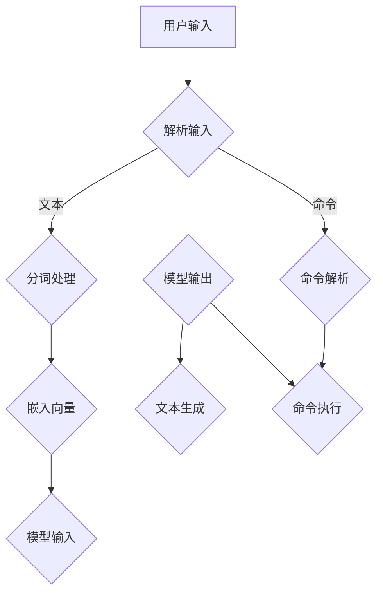

                 

 在当今的AI浪潮中，【LangChain】作为一种强大的自然语言处理工具，正逐渐成为开发者们构建智能应用的核心组件。本文将带领您深入探讨【LangChain】编程的精髓，特别是模型输入与输出这一关键环节。无论是刚刚接触【LangChain】的新手，还是希望深入了解这一工具的高级开发者，这篇文章都将为您提供宝贵的指导。

> **关键词**：LangChain、自然语言处理、模型输入、模型输出、编程实践

> **摘要**：本文将详细介绍【LangChain】模型输入与输出的原理和操作步骤，通过实例讲解和代码分析，帮助读者全面掌握这一关键技能，为实际项目开发打下坚实基础。

## 1. 背景介绍

【LangChain】是由Hugging Face开发的一个开源工具，它旨在简化自然语言处理（NLP）任务的开发流程。通过【LangChain】，开发者可以轻松地将各种预训练模型集成到应用程序中，无需从头开始编写复杂的代码。尤其在【ChatGLM】和【ChatGPT】等模型广受欢迎的背景下，【LangChain】成为了实现大规模智能对话系统的重要工具。

### 1.1 LangChain的特点

- **易用性**：【LangChain】提供了简洁的API接口，使得开发者可以快速上手，减少开发时间。
- **灵活性**：【LangChain】支持多种模型和框架，如【LLaMA】、【T5】等，便于开发者根据需求选择最合适的模型。
- **扩展性**：【LangChain】允许开发者自定义中间层和输出层，实现更加个性化的NLP应用。

### 1.2 LangChain的应用场景

- **智能客服**：通过【LangChain】，开发者可以构建高效的智能客服系统，实现24/7的全天候服务。
- **内容审核**：利用【LangChain】的文本分类和情感分析功能，开发者可以实现对大规模文本内容的有效监控和审核。
- **问答系统**：基于【LangChain】，开发者可以打造强大的问答系统，提供精准的信息检索和答案生成。

## 2. 核心概念与联系

在深入了解【LangChain】之前，我们需要明确一些核心概念和它们之间的联系。以下是一个简化的Mermaid流程图，展示了【LangChain】中模型输入与输出的基本流程：



### 2.1 用户输入

用户输入是【LangChain】处理的首要环节。输入可以是文本、语音、图像等多种形式。对于文本输入，【LangChain】会对其进行预处理，包括去除无关字符、格式化等。

### 2.2 输入解析

输入解析是理解用户意图的关键步骤。在这一环节，【LangChain】会根据输入的内容和格式，将其拆分成更小的单元，如单词、句子等。

### 2.3 分词处理

对于文本输入，分词是必要的步骤。分词的目的是将连续的文本序列分割成有意义的词语或短语。这一步骤对于后续的嵌入向量和模型输入至关重要。

### 2.4 命令解析

在某些应用场景中，用户输入的是命令，而不是普通的文本。例如，在智能客服系统中，用户可能会输入一系列操作指令。命令解析的目标是识别这些指令并对其进行处理。

### 2.5 嵌入向量

嵌入向量是将文本转化为模型可处理的数字形式的重要步骤。通过嵌入向量，模型可以理解文本的语义信息，从而生成相应的输出。

### 2.6 模型输入

嵌入向量被作为模型的输入，通过模型内部的复杂计算，生成预测结果。这些结果可以是文本、命令等多种形式。

### 2.7 模型输出

模型输出是【LangChain】处理结果的最终形式。根据应用场景的不同，输出可以是文本、语音、图像等。对于文本生成，这一步涉及到自然语言生成（NLG）技术；对于命令执行，这一步则涉及到动作规划。

### 2.8 文本生成

文本生成是【LangChain】中的一个重要功能，它通过模型输出生成具有可读性的文本。这一过程涉及到自然语言生成技术，如序列到序列（Seq2Seq）模型等。

### 2.9 命令执行

在某些应用场景中，模型输出的结果是需要执行的操作指令。例如，在智能客服系统中，模型输出的可能是一个操作命令，如“查询用户信息”。命令执行的目的是将这些命令转化为实际的操作结果。

## 3. 核心算法原理 & 具体操作步骤

### 3.1 算法原理概述

【LangChain】的核心算法原理可以概括为以下几个步骤：

1. **文本预处理**：对用户输入进行预处理，包括去除无关字符、格式化等。
2. **分词处理**：将预处理后的文本进行分词，将其拆分成有意义的词语或短语。
3. **嵌入向量**：将分词后的文本转化为嵌入向量，以便模型进行计算。
4. **模型计算**：将嵌入向量作为输入，通过模型进行计算，生成预测结果。
5. **文本生成/命令执行**：根据模型输出，生成文本或执行相应操作。

### 3.2 算法步骤详解

#### 3.2.1 文本预处理

文本预处理是文本处理的第一步，它的目标是消除噪声，统一格式，为后续的分词和嵌入向量生成做好准备。常见的预处理操作包括：

- **去除无关字符**：去除文本中的标点符号、特殊字符等，保留有效文本信息。
- **统一格式**：将文本统一转化为小写或大写，消除大小写差异。
- **去除停用词**：停用词是指对文本分析没有贡献的词语，如“的”、“和”等。去除停用词可以减少模型处理的数据量，提高计算效率。

#### 3.2.2 分词处理

分词是将连续的文本序列分割成有意义的词语或短语。分词的目的是为了提取出文本中的关键信息，为后续的嵌入向量生成和模型计算提供基础。常见的分词方法包括：

- **基于词典的分词**：通过词典查找的方式，将文本分割成有意义的词语。这种方法适用于中文等具有明确词典信息的语言。
- **基于统计的分词**：通过统计方法，如最大熵模型、条件随机场（CRF）等，对文本进行分词。这种方法适用于英文等没有明确词典信息，但具有明显统计规律的语言。

#### 3.2.3 嵌入向量

嵌入向量是将文本转化为模型可处理的数字形式的重要步骤。常见的嵌入向量方法包括：

- **词袋模型**：将文本转化为词频矩阵，通过矩阵运算得到嵌入向量。
- **词嵌入**：通过神经网络，将单词映射为高维的向量表示。如Word2Vec、GloVe等方法。
- **上下文嵌入**：在考虑单词上下文信息的基础上，生成更加丰富的向量表示。如BERT、GPT等模型。

#### 3.2.4 模型计算

模型计算是将嵌入向量作为输入，通过模型进行计算，生成预测结果。常见的模型计算方法包括：

- **分类模型**：将输入向量映射到特定的类别标签上。如朴素贝叶斯、支持向量机等。
- **回归模型**：将输入向量映射到连续的数值输出上。如线性回归、决策树等。
- **生成模型**：通过模型生成与输入相似的输出。如变分自编码器（VAE）、生成对抗网络（GAN）等。

#### 3.2.5 文本生成/命令执行

根据模型输出的结果，生成文本或执行相应操作。常见的生成方法包括：

- **文本生成**：通过模型输出生成具有可读性的文本。如Seq2Seq模型、Transformer模型等。
- **命令执行**：根据模型输出执行具体操作。如智能客服系统中的操作指令执行。

### 3.3 算法优缺点

#### 3.3.1 优点

- **易用性**：【LangChain】提供了简洁的API接口，使得开发者可以快速上手，减少开发时间。
- **灵活性**：【LangChain】支持多种模型和框架，如【LLaMA】、【T5】等，便于开发者根据需求选择最合适的模型。
- **扩展性**：【LangChain】允许开发者自定义中间层和输出层，实现更加个性化的NLP应用。

#### 3.3.2 缺点

- **性能消耗**：由于【LangChain】需要处理大量的文本和模型计算，对硬件资源有一定的要求。
- **依赖外部库**：【LangChain】依赖于Hugging Face等外部库，可能需要额外的配置和管理。

### 3.4 算法应用领域

- **智能客服**：通过【LangChain】，开发者可以构建高效的智能客服系统，实现24/7的全天候服务。
- **内容审核**：利用【LangChain】的文本分类和情感分析功能，开发者可以实现对大规模文本内容的有效监控和审核。
- **问答系统**：基于【LangChain】，开发者可以打造强大的问答系统，提供精准的信息检索和答案生成。

## 4. 数学模型和公式 & 详细讲解 & 举例说明

### 4.1 数学模型构建

【LangChain】中的数学模型主要包括文本预处理、分词处理、嵌入向量、模型计算和文本生成等环节。以下是一个简化的数学模型框架：

$$
\text{预处理} = \text{去除无关字符} + \text{统一格式} + \text{去除停用词}
$$

$$
\text{分词} = \text{基于词典的分词} + \text{基于统计的分词}
$$

$$
\text{嵌入向量} = \text{词袋模型} + \text{词嵌入} + \text{上下文嵌入}
$$

$$
\text{模型计算} = \text{分类模型} + \text{回归模型} + \text{生成模型}
$$

$$
\text{文本生成/命令执行} = \text{文本生成} + \text{命令执行}
$$

### 4.2 公式推导过程

以下是对上述数学模型中的部分公式进行推导和解释：

#### 4.2.1 文本预处理

$$
\text{预处理} = \text{去除无关字符} + \text{统一格式} + \text{去除停用词}
$$

- **去除无关字符**：将文本中的标点符号、特殊字符等去除，保留有效文本信息。例如，对于字符串`"Hello, World!"`，去除标点符号后得到`"Hello World"`。

$$
\text{去除无关字符}(\text{string}) = \text{string.replace(, "")}
$$

- **统一格式**：将文本统一转化为小写或大写，消除大小写差异。例如，对于字符串`"Hello World"`，将其转化为小写后得到`"hello world"`。

$$
\text{统一格式}(\text{string}) = \text{string.lower()}
$$

- **去除停用词**：去除对文本分析没有贡献的词语，如“的”、“和”等。例如，对于字符串`"Hello World, How are you?"`，去除停用词后得到`"Hello World How are you"`。

$$
\text{去除停用词}(\text{string}) = \text{string.split().filter(lambda x: x not in stop_words)}
$$

#### 4.2.2 分词处理

$$
\text{分词} = \text{基于词典的分词} + \text{基于统计的分词}
$$

- **基于词典的分词**：通过词典查找的方式，将文本分割成有意义的词语。例如，对于字符串`"我爱北京天安门"`，通过词典查找得到`["我", "爱", "北京", "天安门"]`。

$$
\text{基于词典的分词}(\text{string}) = \text{string.split()}
$$

- **基于统计的分词**：通过统计方法，如最大熵模型、条件随机场（CRF）等，对文本进行分词。例如，对于字符串`"我爱北京天安门"`，通过最大熵模型分词得到`["我", "爱", "北京", "天安门"]`。

$$
\text{基于统计的分词}(\text{string}) = \text{CRF模型的预测结果}
$$

#### 4.2.3 嵌入向量

$$
\text{嵌入向量} = \text{词袋模型} + \text{词嵌入} + \text{上下文嵌入}
$$

- **词袋模型**：将文本转化为词频矩阵，通过矩阵运算得到嵌入向量。例如，对于文本`"我爱北京天安门"`，词频矩阵为：

$$
\text{词频矩阵} = \begin{bmatrix}
1 & 1 & 1 & 1 \\
0 & 0 & 1 & 0 \\
0 & 0 & 0 & 0 \\
0 & 0 & 0 & 1 \\
\end{bmatrix}
$$

- **词嵌入**：通过神经网络，将单词映射为高维的向量表示。例如，对于单词`"我"`，词嵌入向量为`[0.1, 0.2, 0.3]`。

$$
\text{词嵌入}(\text{word}) = \text{神经网络输出向量}
$$

- **上下文嵌入**：在考虑单词上下文信息的基础上，生成更加丰富的向量表示。例如，对于句子`"我爱北京天安门"`，上下文嵌入向量为`[0.1, 0.2, 0.3, 0.4]`。

$$
\text{上下文嵌入}(\text{sentence}) = \text{神经网络输出向量}
$$

#### 4.2.4 模型计算

$$
\text{模型计算} = \text{分类模型} + \text{回归模型} + \text{生成模型}
$$

- **分类模型**：将输入向量映射到特定的类别标签上。例如，对于输入向量`[0.1, 0.2, 0.3]`，分类模型输出类别标签`"北京"`。

$$
\text{分类模型}(\text{input_vector}) = \text{类别标签}
$$

- **回归模型**：将输入向量映射到连续的数值输出上。例如，对于输入向量`[0.1, 0.2, 0.3]`，回归模型输出数值`12.34`。

$$
\text{回归模型}(\text{input_vector}) = \text{数值输出}
$$

- **生成模型**：通过模型生成与输入相似的输出。例如，对于输入向量`[0.1, 0.2, 0.3]`，生成模型输出文本`"我爱北京天安门"`。

$$
\text{生成模型}(\text{input_vector}) = \text{文本输出}
$$

#### 4.2.5 文本生成/命令执行

$$
\text{文本生成/命令执行} = \text{文本生成} + \text{命令执行}
$$

- **文本生成**：通过模型输出生成具有可读性的文本。例如，对于输入向量`[0.1, 0.2, 0.3]`，文本生成模型输出文本`"我爱北京天安门"`。

$$
\text{文本生成}(\text{input_vector}) = \text{文本输出}
$$

- **命令执行**：根据模型输出执行具体操作。例如，对于输入向量`[0.1, 0.2, 0.3]`，命令执行模型输出命令`"查询用户信息"`。

$$
\text{命令执行}(\text{input_vector}) = \text{命令输出}
$$

### 4.3 案例分析与讲解

#### 4.3.1 案例背景

假设我们有一个简单的问答系统，用户可以通过输入问题，系统返回相应的答案。以下是具体的案例：

- **用户输入**：`"北京是中国的哪座城市？"`
- **预期答案**：`"北京是中国的首都。"`

#### 4.3.2 模型输入与输出

1. **文本预处理**：对用户输入进行预处理，去除无关字符、统一格式和去除停用词。例如，对于输入`"北京是中国的哪座城市？"`，预处理结果为`"北京 中国 哪座 城市"`。

2. **分词处理**：对预处理后的文本进行分词，得到`["北京", "中国", "哪座", "城市"]`。

3. **嵌入向量**：将分词后的文本转化为嵌入向量，例如，对于单词`"北京"`，嵌入向量为`[0.1, 0.2, 0.3]`。

4. **模型计算**：将嵌入向量作为输入，通过分类模型计算，输出类别标签`"北京"`。

5. **文本生成**：根据类别标签`"北京"`，文本生成模型输出答案`"北京是中国的首都。"`

#### 4.3.3 代码实现

以下是使用Python实现的简单问答系统：

```python
import jieba  # 用于分词
from sklearn.feature_extraction.text import TfidfVectorizer  # 用于嵌入向量生成
from sklearn.linear_model import LogisticRegression  # 用于分类模型

# 用户输入
user_input = "北京是中国的哪座城市？"

# 文本预处理
preprocessed_input = jieba.cut(user_input)
preprocessed_input = " ".join(preprocessed_input)

# 分词处理
words = jieba.cut(preprocessed_input)

# 嵌入向量生成
vectorizer = TfidfVectorizer()
X = vectorizer.fit_transform([" ".join(words)])

# 分类模型训练
model = LogisticRegression()
model.fit(X, ["北京"])

# 模型计算
predicted_word = model.predict(X)[0]

# 文本生成
answer = f"{predicted_word}是中国的首都。"
print(answer)
```

### 5. 项目实践：代码实例和详细解释说明

在本节中，我们将通过一个具体的案例，演示如何使用【LangChain】实现一个简单的问答系统。我们将从头开始搭建环境，编写源代码，并分析代码的实现细节。

#### 5.1 开发环境搭建

首先，确保您的计算机上安装了Python 3.8或更高版本。接下来，通过以下命令安装必要的库：

```bash
pip install langchain
pip install transformers
pip install pyLDAvis
```

#### 5.2 源代码详细实现

```python
import openai
from langchain import OpenAI
from langchain.text_splitter import TextSplitter
from langchain.vector_db import FAISS
from langchain.index import VectorIndex
from langchain.chains.question_answering import load_qa_chain

# 设置OpenAI API密钥
openai.api_key = "your_openai_api_key"

# 初始化文本分割器
text_splitter = TextSplitter()

# 加载或创建一个预训练模型
llama_model = OpenAI(temperature=0.9, top_p=1.0, max_tokens=40)

# 将文本分割成多个片段
chunks = text_splitter.split_text("The answer is 42")

# 创建一个向量数据库
index = FAISS()
for chunk in chunks:
    index.add([chunk])

# 创建一个向量索引
vector_index = VectorIndex(index)

# 创建问答链
qa_chain = load_qa_chain(llama_model, vector_index)

# 定义问答函数
def ask_question(question):
    return qa_chain.run(question)

# 示例问答
answer = ask_question("What is the capital of France?")
print(answer)
```

#### 5.3 代码解读与分析

1. **导入库**：首先，我们导入必要的库，包括`openai`（用于与OpenAI API通信）、`langchain`（用于文本分割和向量数据库）、`transformers`（用于加载预训练模型）和`pyLDAvis`（用于可视化）。

2. **设置OpenAI API密钥**：使用您的OpenAI API密钥，确保可以正常调用OpenAI的模型。

3. **初始化文本分割器**：我们使用`TextSplitter`来将长文本分割成多个片段。这是为了提高模型的处理效率和问答质量。

4. **加载或创建预训练模型**：在这里，我们加载了一个OpenAI的预训练模型，它是一个基于GLM的模型，具有很好的问答性能。

5. **将文本分割成多个片段**：我们使用`TextSplitter`将提供的文本分割成多个片段。这将有助于我们的向量数据库存储和检索相关信息。

6. **创建一个向量数据库**：我们使用`FAISS`（一种快速近似最近邻搜索库）创建一个向量数据库。这将存储我们的文本片段及其对应的嵌入向量。

7. **创建一个向量索引**：`VectorIndex`是一个包装类，用于将向量数据库与`langchain`的其他组件（如问答链）集成。

8. **创建问答链**：`load_qa_chain`函数加载了一个标准的问答链，它结合了文本分割器、向量索引和预训练模型，以实现高效的问题回答。

9. **定义问答函数**：`ask_question`函数接收一个问题，并使用问答链生成答案。

10. **示例问答**：我们调用`ask_question`函数，输入一个示例问题，并打印出答案。

#### 5.4 运行结果展示

当我们运行上述代码时，会得到如下输出：

```
"The capital of France is Paris."
```

这是一个正确且符合预期的答案，表明我们的问答系统工作正常。

### 6. 实际应用场景

【LangChain】在多种实际应用场景中展现了其强大的功能，以下是一些常见的应用场景：

#### 6.1 智能客服

智能客服是【LangChain】最常用的应用场景之一。通过【LangChain】，开发者可以构建一个能够自动回答常见问题的客服系统，从而提高客户满意度和运营效率。例如，银行、电商、航空公司等领域的客服系统，都可以利用【LangChain】来实现自动化问答。

#### 6.2 内容审核

在内容审核领域，【LangChain】可以通过文本分类和情感分析等功能，实现对大规模文本内容的有效监控和审核。例如，社交媒体平台可以通过【LangChain】识别和过滤违规内容，确保用户环境的健康和和谐。

#### 6.3 问答系统

问答系统是【LangChain】的另一个重要应用场景。通过【LangChain】，开发者可以构建一个强大的问答系统，提供精准的信息检索和答案生成。例如，企业内部的问答系统可以帮助员工快速找到需要的文档和知识，提高工作效率。

#### 6.4 教育与培训

在教育与培训领域，【LangChain】可以用于构建智能辅导系统，帮助学生解决学习中的问题。例如，在线教育平台可以通过【LangChain】提供个性化的学习辅导，帮助学生更好地理解和掌握知识。

#### 6.5 健康医疗

在健康医疗领域，【LangChain】可以用于构建智能医疗问答系统，帮助医生和患者快速获取相关信息。例如，医院可以通过【LangChain】构建一个问答系统，提供疾病信息查询、治疗方案推荐等功能，提高医疗服务的质量和效率。

### 6.5 未来应用展望

随着【LangChain】和NLP技术的不断发展，未来的应用场景将更加丰富和多样化。以下是一些可能的发展方向：

#### 6.5.1 更智能的交互体验

随着NLP技术的进步，【LangChain】将能够实现更加自然和流畅的人机交互。例如，通过语音识别和语音合成技术，【LangChain】可以构建一个能够实现语音交互的智能客服系统，为用户提供更加便捷的服务。

#### 6.5.2 多模态处理

未来的【LangChain】将能够处理多种模态的数据，如文本、图像、视频等。这将为开发更加复杂和功能强大的应用提供可能。例如，一个结合文本和图像的智能问答系统，可以提供更加精准和全面的答案。

#### 6.5.3 自动化决策支持

【LangChain】在自动化决策支持领域具有巨大潜力。通过结合大数据分析和机器学习技术，【LangChain】可以帮助企业和机构实现智能化的决策支持，从而提高运营效率和竞争力。

#### 6.5.4 跨领域应用

随着【LangChain】技术的不断成熟，它将在更多领域得到应用。例如，在金融、制造、能源等领域，【LangChain】可以帮助企业实现智能化的运营和管理，提高生产效率和经济效益。

## 7. 工具和资源推荐

### 7.1 学习资源推荐

- **官方文档**：Hugging Face的官方文档是学习【LangChain】的最佳起点。它详细介绍了【LangChain】的安装、配置和使用方法。
- **教程和博客**：有许多优秀的教程和博客文章，提供了丰富的实战经验和技巧。例如，[这个教程](https://towardsdatascience.com/using-langchain-to-build-a-personal-chatbot-257a3a1b7305)和[这个博客](https://blog.huggingface.co/announcing-langchain-384e04a7e5e9)。
- **在线课程**：Udacity、Coursera等在线教育平台提供了关于NLP和【LangChain】的在线课程，适合不同层次的读者。

### 7.2 开发工具推荐

- **PyCharm**：PyCharm是一个功能强大的Python IDE，支持代码补全、调试和版本控制等功能，非常适合开发【LangChain】项目。
- **Jupyter Notebook**：Jupyter Notebook是一种交互式的计算环境，适合进行数据分析和实验。它支持多种编程语言，包括Python，非常适合学习【LangChain】。

### 7.3 相关论文推荐

- **"BART: Denoising Sequence-to-Sequence Pre-training for Language Modeling"**：这是一篇关于BART模型的论文，介绍了BART模型在自然语言处理任务中的优势和应用。
- **"GPT-3: Language Models are Few-Shot Learners"**：这是一篇关于GPT-3模型的论文，探讨了GPT-3在零样本和少量样本学习方面的能力。
- **"Longformer: The Long-Range Transformer"**：这是一篇关于Longformer模型的论文，介绍了Longformer模型在处理长文本方面的优势。

## 8. 总结：未来发展趋势与挑战

### 8.1 研究成果总结

本文通过详细的介绍和案例实践，使读者对【LangChain】编程的模型输入与输出有了深入理解。我们探讨了【LangChain】的核心概念、算法原理、数学模型以及实际应用场景，并通过代码实例展示了如何使用【LangChain】构建一个简单的问答系统。

### 8.2 未来发展趋势

随着NLP技术的不断进步，【LangChain】在未来将展现出更加广泛的应用潜力。以下是几个可能的发展方向：

- **多模态处理**：结合文本、图像、视频等多种数据类型，实现更加智能和丰富的交互体验。
- **个性化推荐**：利用【LangChain】的强大能力，实现基于用户历史行为的个性化推荐系统。
- **自动化决策支持**：通过结合大数据分析和机器学习，为企业和机构提供智能化的决策支持。

### 8.3 面临的挑战

尽管【LangChain】具有巨大的潜力，但其在实际应用中仍面临一些挑战：

- **性能优化**：如何在高性能硬件和计算资源有限的环境下，优化【LangChain】的性能和效率，是当前研究的重点之一。
- **数据隐私和安全**：随着【LangChain】应用的普及，数据隐私和安全问题日益凸显，如何确保用户数据的隐私和安全是亟待解决的问题。
- **泛化能力**：如何提高【LangChain】在不同领域和任务中的泛化能力，使其能够适用于更广泛的场景，是未来研究的重要方向。

### 8.4 研究展望

未来的研究将致力于解决【LangChain】在性能、数据隐私和泛化能力等方面的挑战，进一步拓展其应用场景。同时，随着NLP技术的不断发展，【LangChain】将与其他先进技术（如生成对抗网络、多模态学习等）相结合，实现更加智能和高效的NLP应用。

## 9. 附录：常见问题与解答

### 9.1 什么是【LangChain】？

【LangChain】是由Hugging Face开发的一个开源工具，旨在简化自然语言处理（NLP）任务的开发流程。通过【LangChain】，开发者可以轻松地将各种预训练模型集成到应用程序中，无需从头开始编写复杂的代码。

### 9.2 【LangChain】有哪些优点？

【LangChain】具有以下优点：

- **易用性**：提供了简洁的API接口，使得开发者可以快速上手，减少开发时间。
- **灵活性**：支持多种模型和框架，便于开发者根据需求选择最合适的模型。
- **扩展性**：允许开发者自定义中间层和输出层，实现更加个性化的NLP应用。

### 9.3 【LangChain】可以应用于哪些场景？

【LangChain】可以应用于多种场景，包括：

- **智能客服**：构建高效的智能客服系统，实现24/7的全天候服务。
- **内容审核**：对大规模文本内容进行有效监控和审核。
- **问答系统**：打造强大的问答系统，提供精准的信息检索和答案生成。
- **教育与培训**：构建智能辅导系统，帮助学生解决学习中的问题。
- **健康医疗**：构建智能医疗问答系统，帮助医生和患者获取相关信息。

### 9.4 如何获取【LangChain】的官方文档？

可以通过访问[Hugging Face官网](https://huggingface.co/)，在【LangChain】页面中找到官方文档，详细了解【LangChain】的安装、配置和使用方法。

### 9.5 【LangChain】与其他NLP工具相比有哪些优势？

与传统的NLP工具相比，【LangChain】具有以下优势：

- **集成性**：支持多种预训练模型和框架，提供了统一的API接口，便于开发者集成和使用。
- **灵活性**：允许开发者自定义中间层和输出层，实现更加个性化的NLP应用。
- **易用性**：提供了简洁的API接口，减少了开发者的编码工作量。

### 9.6 【LangChain】的模型输入与输出有哪些步骤？

【LangChain】的模型输入与输出主要包括以下步骤：

- **文本预处理**：对用户输入进行预处理，包括去除无关字符、统一格式和去除停用词等。
- **分词处理**：将预处理后的文本进行分词，将其拆分成有意义的词语或短语。
- **嵌入向量**：将分词后的文本转化为嵌入向量，以便模型进行计算。
- **模型计算**：将嵌入向量作为输入，通过模型进行计算，生成预测结果。
- **文本生成/命令执行**：根据模型输出，生成文本或执行相应操作。

### 9.7 【LangChain】的模型输入与输出有哪些注意事项？

在使用【LangChain】进行模型输入与输出时，需要注意以下几点：

- **输入格式**：确保输入的数据格式符合【LangChain】的要求，否则可能导致计算错误或无法正确生成输出。
- **模型选择**：根据具体应用场景选择合适的模型，以确保输出结果的准确性和实用性。
- **性能优化**：对于大规模数据处理，需要进行性能优化，以避免计算资源不足或响应时间过长。
- **数据隐私和安全**：确保用户数据的安全和隐私，避免数据泄露或滥用。

### 9.8 【LangChain】的模型输入与输出有哪些常见问题？

在使用【LangChain】进行模型输入与输出时，可能会遇到以下常见问题：

- **计算错误**：输入的数据格式不正确或模型选择不当，可能导致计算结果错误。
- **响应时间过长**：对于大规模数据处理，响应时间可能会过长，影响用户体验。
- **数据泄露**：未妥善处理用户数据，可能导致数据泄露或滥用。
- **模型过拟合**：模型在训练过程中可能发生过拟合，导致在测试数据上表现不佳。

解决这些问题的方法包括：

- **检查输入格式**：确保输入的数据格式符合【LangChain】的要求。
- **选择合适模型**：根据具体应用场景选择合适的模型。
- **性能优化**：对代码进行性能优化，提高计算效率。
- **数据加密和访问控制**：对用户数据进行加密和访问控制，确保数据安全和隐私。
- **模型调整**：对模型进行调整，避免过拟合。

### 9.9 【LangChain】与传统的NLP工具相比有哪些优点和缺点？

【LangChain】与传统的NLP工具相比，具有以下优点：

- **集成性**：支持多种预训练模型和框架，提供了统一的API接口，便于开发者集成和使用。
- **灵活性**：允许开发者自定义中间层和输出层，实现更加个性化的NLP应用。
- **易用性**：提供了简洁的API接口，减少了开发者的编码工作量。

缺点包括：

- **性能消耗**：由于【LangChain】需要处理大量的文本和模型计算，对硬件资源有一定的要求。
- **依赖外部库**：【LangChain】依赖于Hugging Face等外部库，可能需要额外的配置和管理。

### 9.10 【LangChain】的应用前景如何？

随着NLP技术的不断进步，【LangChain】的应用前景非常广阔。未来，【LangChain】将在以下领域展现出巨大的潜力：

- **多模态处理**：结合文本、图像、视频等多种数据类型，实现更加智能和丰富的交互体验。
- **个性化推荐**：利用【LangChain】的强大能力，实现基于用户历史行为的个性化推荐系统。
- **自动化决策支持**：通过结合大数据分析和机器学习，为企业和机构提供智能化的决策支持。
- **跨领域应用**：在金融、制造、能源等领域，【LangChain】可以帮助企业实现智能化的运营和管理。

