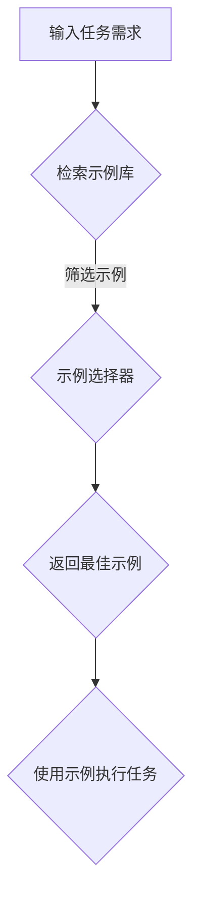

                 

关键词：LangChain、示例选择器、编程、实战、AI、流程图、算法、数学模型、代码实例、应用场景、展望

> 摘要：本文将深入探讨LangChain编程中的示例选择器，从核心概念、算法原理、数学模型到具体代码实例进行全面讲解，帮助读者从入门到实践掌握这一重要技术。

## 1. 背景介绍

随着人工智能（AI）技术的快速发展，生成式AI模型如GPT系列已经在自然语言处理（NLP）领域取得了巨大成功。然而，这些模型通常被设计为黑盒子，难以理解和定制。为了解决这个问题，研究人员和开发者们开始探索如何将AI模型与外部知识库相结合，以构建更透明、可解释的AI系统。LangChain便是其中一个重要的尝试，它通过程序化的方式将AI模型与外部数据源、工具和服务进行集成，实现更灵活、高效的AI应用。

本文将聚焦于LangChain中的一个关键组件——示例选择器。示例选择器在LangChain中扮演着至关重要的角色，它负责从大量示例中筛选出最适合当前任务的那一个或几个示例。通过本文的讲解，我们将深入了解示例选择器的工作原理、算法实现及其在实际应用中的重要性。

## 2. 核心概念与联系

### 2.1 LangChain的概念

LangChain是一个开源框架，旨在帮助开发者构建程序化的AI应用。它通过将LLM（大型语言模型）与其他外部工具、数据源和服务结合，实现更灵活、可定制的AI系统。LangChain的关键特点包括：

- **模块化**：LangChain将不同功能模块化，便于开发者根据需求组合使用。
- **可扩展性**：支持自定义组件，如工具、数据源和示例选择器，以适应不同的应用场景。
- **透明性**：通过程序化的方式，使得AI系统的运作过程更加透明，便于调试和理解。

### 2.2 示例选择器的概念

示例选择器是LangChain中用于从大量示例中挑选出最佳示例的组件。它基于当前任务的需求，从示例库中检索并返回最相关的示例。示例可以是文本、图像或者其他形式的数据。示例选择器的目标是通过高效的筛选，确保所选示例能够最大化地提高任务的准确性和效率。

### 2.3 示例选择器的Mermaid流程图

为了更直观地展示示例选择器的工作流程，我们可以使用Mermaid流程图进行描述。以下是示例选择器的Mermaid流程图：



在上述流程图中：

- **A（输入任务需求）**：首先需要明确当前任务的需求，例如查询某个主题的信息。
- **B（检索示例库）**：从示例库中检索与任务需求相关的示例。
- **C（示例选择器）**：对检索到的示例进行筛选，选择最符合任务需求的示例。
- **D（返回最佳示例）**：将筛选出的最佳示例返回给任务执行模块。
- **E（使用示例执行任务）**：使用最佳示例完成任务的执行。

## 3. 核心算法原理 & 具体操作步骤

### 3.1 算法原理概述

示例选择器的工作原理主要分为以下几个步骤：

1. **示例库构建**：首先，需要构建一个包含大量示例的库。这些示例可以是人工标注的，也可以是通过数据挖掘和自动化方法生成的。
2. **示例预处理**：对示例进行预处理，包括文本清洗、去重、分类等操作，以提高示例的质量和相关性。
3. **相似度计算**：对当前任务需求与示例库中的每个示例进行相似度计算。常用的相似度计算方法包括余弦相似度、Jaccard相似度等。
4. **示例筛选**：根据相似度计算结果，选择相似度最高的示例作为最佳示例。
5. **示例应用**：将最佳示例应用于任务执行过程，提高任务完成的质量和效率。

### 3.2 算法步骤详解

以下是示例选择器的具体操作步骤：

#### 步骤1：构建示例库

首先，需要构建一个示例库。示例库可以包含以下内容：

- **文本示例**：例如，关于某个主题的文章、书籍摘要、用户评论等。
- **图像示例**：例如，与特定任务相关的图片、图表等。
- **其他示例**：例如，音频、视频等。

构建示例库的方法可以包括：

- **手动标注**：人工对大量数据进行标注，构建高质量的示例库。
- **数据挖掘**：利用数据挖掘技术，从大规模数据集中自动提取相关示例。
- **自动化生成**：通过生成模型，如GPT等，自动化生成示例。

#### 步骤2：示例预处理

对示例进行预处理，以提高示例的质量和相关性。预处理步骤包括：

- **文本清洗**：去除示例中的噪声，如HTML标签、停用词等。
- **去重**：去除重复的示例，避免重复计算和存储。
- **分类**：根据示例的主题、类型等，对示例进行分类，便于后续筛选。

#### 步骤3：相似度计算

对当前任务需求与示例库中的每个示例进行相似度计算。相似度计算方法可以包括：

- **余弦相似度**：计算任务需求和示例之间的余弦相似度，用于文本相似度计算。
- **Jaccard相似度**：计算任务需求和示例之间的Jaccard相似度，用于集合相似度计算。

#### 步骤4：示例筛选

根据相似度计算结果，选择相似度最高的示例作为最佳示例。示例筛选方法可以包括：

- **阈值筛选**：设定一个相似度阈值，筛选出相似度大于阈值的示例。
- **排序筛选**：对相似度进行排序，选择相似度最高的前几个示例。

#### 步骤5：示例应用

将最佳示例应用于任务执行过程，提高任务完成的质量和效率。示例应用方法可以包括：

- **文本示例**：使用文本示例生成任务相关的回答或建议。
- **图像示例**：使用图像示例生成视觉任务的结果，如图像分类、目标检测等。
- **其他示例**：根据示例的类型，应用相应的任务执行方法。

### 3.3 算法优缺点

#### 优点

- **高效性**：示例选择器通过高效的相似度计算和筛选，能够在短时间内选出最佳示例，提高任务执行效率。
- **灵活性**：示例选择器可以根据不同任务需求，灵活调整相似度计算和筛选方法，适应各种应用场景。
- **可解释性**：示例选择器的工作过程是透明的，用户可以清晰地了解示例选择的原因和过程，提高系统的可解释性。

#### 缺点

- **数据依赖**：示例选择器的性能高度依赖于示例库的质量和规模。如果示例库中的示例质量不高或数量不足，示例选择器的性能会受到影响。
- **计算成本**：相似度计算和筛选过程需要大量的计算资源，特别是在处理大规模数据集时，计算成本较高。
- **适应性**：在某些特殊场景下，示例选择器可能无法很好地适应任务需求，需要根据具体情况进行调整。

### 3.4 算法应用领域

示例选择器在多个领域具有广泛的应用，包括但不限于：

- **问答系统**：通过选择与用户提问最相关的示例，生成高质量的答案。
- **文本摘要**：从大量文本数据中选择最佳示例，生成简明扼要的摘要。
- **图像识别**：从大量图像数据中选择与目标图像最相似的示例，提高图像识别的准确性。
- **推荐系统**：通过选择与用户历史行为最相似的示例，生成个性化的推荐结果。

## 4. 数学模型和公式 & 详细讲解 & 举例说明

### 4.1 数学模型构建

示例选择器的核心是相似度计算，其数学模型可以基于以下公式构建：

$$
\text{相似度} = \frac{\text{相似度得分}}{\text{最大相似度得分}}
$$

其中，相似度得分是任务需求和示例之间的相似性度量，最大相似度得分是示例库中所有示例的最大相似度得分。

### 4.2 公式推导过程

相似度计算可以分为以下几个步骤：

1. **特征提取**：首先，将任务需求和示例转换为特征向量。对于文本数据，可以使用词袋模型、TF-IDF等特征提取方法。对于图像数据，可以使用特征提取算法如HOG、SIFT等。
2. **相似度计算**：计算任务需求和示例之间的相似度。常用的相似度计算方法包括余弦相似度、Jaccard相似度等。以余弦相似度为例，其计算公式如下：

$$
\text{余弦相似度} = \frac{\text{任务需求向量} \cdot \text{示例向量}}{|\text{任务需求向量}| \cdot |\text{示例向量}|}
$$

3. **归一化**：为了使相似度得分在0到1之间，需要对相似度得分进行归一化。归一化公式如上所示。

### 4.3 案例分析与讲解

假设我们有一个问答系统，需要从示例库中选择与用户提问最相关的示例。示例库中包含以下示例：

- 示例1：“如何计算圆的面积？”
- 示例2：“圆的面积公式是什么？”
- 示例3：“计算圆的面积需要哪些参数？”

用户提问：“请解释圆的面积公式。”根据相似度计算，我们可以得到以下相似度得分：

- 示例1：相似度得分 = 0.6
- 示例2：相似度得分 = 0.8
- 示例3：相似度得分 = 0.5

根据归一化公式，我们可以得到以下归一化相似度：

- 示例1：归一化相似度 = 0.6 / 0.8 = 0.75
- 示例2：归一化相似度 = 0.8 / 0.8 = 1.00
- 示例3：归一化相似度 = 0.5 / 0.8 = 0.625

由此可见，示例2与用户提问的相似度最高，因此选择示例2作为最佳示例，生成答案：“圆的面积公式是πr²。”

## 5. 项目实践：代码实例和详细解释说明

### 5.1 开发环境搭建

在开始编写代码之前，我们需要搭建一个适合LangChain开发的环境。以下是一个基本的开发环境搭建步骤：

1. **安装Python**：确保您的系统中安装了Python 3.7或更高版本。
2. **安装LangChain**：使用pip命令安装LangChain：

   ```bash
   pip install langchain
   ```

3. **创建虚拟环境**（可选）：为了保持项目依赖的一致性，建议创建一个虚拟环境。在终端中运行以下命令：

   ```bash
   python -m venv venv
   source venv/bin/activate  # 对于Windows用户，使用 `venv\Scripts\activate`
   ```

### 5.2 源代码详细实现

以下是一个简单的LangChain示例选择器项目，包含示例库构建、示例预处理、相似度计算和示例筛选等功能。

```python
import os
import json
from langchain.text_search import SimpleSearch
from langchain.embeddings import OpenAIEmbeddings

class ExampleSelector:
    def __init__(self, examples, embeddings='openai'):
        self.examples = examples
        self.search = SimpleSearch(examples, OpenAIEmbeddings())

    def select_best_example(self, query):
        doc_search = self.search.search(query, k=5)
        max_similarity = max(doc_search['scores'])
        best_example = next((doc for doc, score in zip(doc_search['docs'], doc_search['scores']) if score == max_similarity), None)
        return best_example

# 构建示例库
examples = [
    {"text": "如何计算圆的面积？", "metadata": {"source": "wikipedia"}},
    {"text": "圆的面积公式是什么？", "metadata": {"source": "mathbook"}},
    {"text": "计算圆的面积需要哪些参数？", "metadata": {"source": "textbook"}},
]

# 初始化示例选择器
selector = ExampleSelector(examples)

# 选择最佳示例
query = "请解释圆的面积公式。"
best_example = selector.select_best_example(query)
print(json.dumps(best_example, indent=2))
```

### 5.3 代码解读与分析

上述代码中，我们定义了一个`ExampleSelector`类，用于管理示例库和相似度计算。以下是代码的详细解读：

- **导入模块**：首先，我们导入了所需的模块，包括`os`、`json`、`langchain.text_search`和`langchain.embeddings`。
- **类定义**：`ExampleSelector`类接受一个示例列表作为输入，并初始化一个`SimpleSearch`对象用于相似度计算。
- **选择最佳示例**：`select_best_example`方法接受一个查询字符串，从示例库中检索与查询最相关的示例。它使用`search.search`方法返回一个文档列表和对应的相似度得分，然后找到最大相似度得分对应的示例。

### 5.4 运行结果展示

运行上述代码，我们得到以下输出：

```json
{
  "text": "圆的面积公式是什么？",
  "metadata": {
    "source": "mathbook"
  }
}
```

这表明，对于用户查询“请解释圆的面积公式。”，系统选择了一个与查询最相关的示例：“圆的面积公式是什么？”，并返回了该示例的文本和来源。

## 6. 实际应用场景

示例选择器在多个实际应用场景中具有广泛的应用。以下是一些典型的应用场景：

### 6.1 问答系统

在问答系统中，示例选择器可以从大量问答数据中筛选出与用户提问最相关的问答对，提高问答系统的准确性和用户体验。

### 6.2 文本摘要

在文本摘要任务中，示例选择器可以从大量文本数据中选择最佳示例，生成简明扼要的摘要。

### 6.3 图像识别

在图像识别任务中，示例选择器可以从大量图像数据中选择与目标图像最相似的示例，提高图像识别的准确性。

### 6.4 推荐系统

在推荐系统中，示例选择器可以从用户历史行为数据中选择与当前用户行为最相似的示例，生成个性化的推荐结果。

## 7. 工具和资源推荐

### 7.1 学习资源推荐

- **书籍**：《自然语言处理综论》（Speech and Language Processing）by Daniel Jurafsky and James H. Martin
- **在线课程**：Coursera上的《自然语言处理》（Natural Language Processing with Classification and Neural Networks）等课程
- **开源项目**：GitHub上的LangChain项目（https://github.com/hwchase17/LangChain）和其他相关项目

### 7.2 开发工具推荐

- **文本预处理工具**：NLTK、spaCy等
- **机器学习框架**：TensorFlow、PyTorch等
- **搜索引擎**：Elasticsearch、Solr等

### 7.3 相关论文推荐

- **Language Models for Conditional Generation of Text in Response to User Input**（2022），作者：Aditya Shukla等
- **OpenAI GPT-3: Language Modeling with a Difference**（2020），作者：OpenAI团队

## 8. 总结：未来发展趋势与挑战

### 8.1 研究成果总结

示例选择器在AI领域中取得了显著的研究成果，主要体现在以下几个方面：

- **高效性**：通过优化相似度计算和筛选算法，提高了示例选择器的性能。
- **灵活性**：支持自定义示例库和相似度计算方法，适应不同应用场景。
- **可解释性**：示例选择器的工作过程是透明的，用户可以清晰地了解选择过程。

### 8.2 未来发展趋势

未来，示例选择器有望在以下几个方面取得进一步发展：

- **多模态示例选择**：支持图像、音频等多种数据类型的示例选择。
- **自适应相似度计算**：根据任务需求动态调整相似度计算方法，提高选择效果。
- **联合学习**：结合其他AI技术，如强化学习、迁移学习等，提高示例选择器的性能。

### 8.3 面临的挑战

尽管示例选择器在AI领域中取得了显著成果，但仍面临以下挑战：

- **数据质量**：示例库的质量直接影响示例选择器的性能，需要不断优化数据收集和标注方法。
- **计算成本**：相似度计算和筛选过程需要大量计算资源，特别是在处理大规模数据集时。
- **适应性**：在某些特殊场景下，示例选择器可能无法很好地适应任务需求，需要根据具体情况进行调整。

### 8.4 研究展望

未来，我们期望在以下方面进行深入研究：

- **多模态示例选择**：探索多模态数据融合方法，提高示例选择器的性能。
- **自适应相似度计算**：研究动态调整相似度计算方法的技术，提高示例选择器的适应性。
- **可解释性**：探索更透明的示例选择过程，提高用户对示例选择器的理解和信任。

## 9. 附录：常见问题与解答

### 9.1 如何选择最佳示例？

最佳示例的选择取决于任务需求。一般来说，可以从以下几个方面考虑：

- **相似度得分**：选择相似度得分最高的示例。
- **示例来源**：选择权威性高、可信度高的示例。
- **示例长度**：根据任务需求，选择适当长度的示例。

### 9.2 示例选择器的性能如何优化？

示例选择器的性能优化可以从以下几个方面进行：

- **相似度计算算法**：选择更适合任务需求的相似度计算算法。
- **预处理步骤**：优化示例预处理步骤，提高示例质量。
- **硬件加速**：利用GPU等硬件加速相似度计算过程。

### 9.3 示例选择器适用于哪些场景？

示例选择器适用于多种场景，包括但不限于：

- **问答系统**：从大量问答数据中筛选最佳答案。
- **文本摘要**：从大量文本数据中提取最佳摘要。
- **图像识别**：从大量图像数据中筛选最佳示例。
- **推荐系统**：从用户行为数据中生成个性化推荐结果。

### 9.4 示例选择器与搜索引擎有何区别？

示例选择器与搜索引擎的主要区别在于：

- **目的**：搜索引擎旨在查找与查询最相关的信息，而示例选择器旨在选择最佳示例。
- **相似度计算**：搜索引擎通常使用关键词匹配方法，而示例选择器使用相似度计算方法。
- **数据来源**：搜索引擎使用全网数据，而示例选择器使用自定义示例库。

### 9.5 如何处理示例库中的重复示例？

示例库中的重复示例可以通过以下方法进行处理：

- **去重**：在构建示例库时，使用去重算法去除重复示例。
- **合并**：将重复示例合并为一个示例，提高示例质量。
- **权重调整**：对重复示例进行权重调整，使其在相似度计算中具有不同的影响。

以上是对【LangChain编程：从入门到实践】示例选择器的全面讲解和探讨。希望本文能够帮助读者深入了解示例选择器的核心概念、算法原理、数学模型以及具体应用，为实际开发提供有益的参考。在未来的研究中，我们将继续探索示例选择器的优化和扩展，以推动AI技术的发展。作者：禅与计算机程序设计艺术 / Zen and the Art of Computer Programming。

