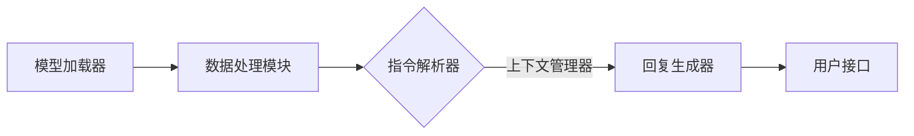

                 

关键词：LangChain编程，NLP，人工智能，代码示例，社区贡献，实践指南，技术博客

## 摘要

本文将为您深入解析LangChain编程，从基础入门到实际应用的完整实践过程。我们将探讨LangChain的核心概念、架构设计、算法原理以及如何在项目中实现和优化。通过具体的代码实例和详细解释，您将掌握如何使用LangChain构建强大的自然语言处理应用。此外，本文还将讨论LangChain在各个领域的实际应用，并展望其未来发展的趋势和面临的挑战。最后，我们将推荐一些学习资源和开发工具，以帮助您更好地理解和掌握LangChain编程。

## 1. 背景介绍

### LangChain的起源与发展

LangChain是一种基于人工智能的自然语言处理（NLP）框架，旨在帮助开发者构建高效、可扩展的NLP应用。它起源于对现有NLP工具和库的整合与优化需求，旨在解决开发者在处理复杂自然语言任务时遇到的挑战。

LangChain的发展历程可以追溯到2019年，当时谷歌发布了其BERT模型，标志着NLP领域的一个重要突破。随后，OpenAI的GPT系列模型也相继问世，进一步推动了NLP技术的进步。这些先进的模型为开发者提供了强大的工具，但也带来了一些挑战，如模型的复杂度增加、训练成本上升以及部署难度加大。

为了解决这些问题，许多开发者开始寻求更加高效、易用的NLP工具。LangChain应运而生，它通过整合现有优秀的NLP模型和库，提供了一套简单、直观的API，使得开发者能够更加轻松地构建复杂的NLP应用。

### LangChain的优势与特点

LangChain具有以下几个显著优势：

1. **模块化设计**：LangChain采用模块化设计，使得开发者可以根据实际需求选择和组合不同的NLP模块，从而构建个性化的应用。

2. **高性能**：LangChain利用高效的算法和优化技术，确保了在处理大规模数据时的性能。

3. **易用性**：通过简洁的API和详细的文档，LangChain使得开发者能够快速上手并实现功能。

4. **可扩展性**：LangChain支持自定义模型和模块，开发者可以根据需求进行扩展，以适应不同的应用场景。

5. **跨平台**：LangChain支持多种编程语言和平台，包括Python、JavaScript、Go等，使得开发者可以轻松地在不同的环境中使用。

### 本文结构

本文将按照以下结构进行阐述：

1. **核心概念与联系**：介绍LangChain的核心概念和架构设计，通过Mermaid流程图展示其组成部分和相互关系。

2. **核心算法原理 & 具体操作步骤**：详细讲解LangChain的算法原理和操作步骤，包括算法的优点、缺点和应用领域。

3. **数学模型和公式 & 详细讲解 & 举例说明**：介绍LangChain的数学模型和公式，并通过具体案例进行分析和讲解。

4. **项目实践：代码实例和详细解释说明**：提供具体的代码实例，并详细解释实现过程和关键点。

5. **实际应用场景**：讨论LangChain在各个领域的实际应用，包括文本生成、情感分析、问答系统等。

6. **未来应用展望**：展望LangChain的未来发展趋势和潜在应用。

7. **工具和资源推荐**：推荐学习资源和开发工具，以帮助读者更好地掌握LangChain。

8. **总结与展望**：总结研究成果，展望未来的发展方向和面临的挑战。

## 2. 核心概念与联系

### LangChain的核心概念

LangChain的核心概念主要包括以下几部分：

1. **模型**：LangChain使用先进的预训练模型，如BERT、GPT等，作为其基础组件。

2. **指令**：指令是用户与模型交互的方式，用于指定模型的行为和任务。

3. **上下文**：上下文是指模型在执行任务时所使用的信息集合，可以是文本、元数据等。

4. **回复**：回复是指模型对指令和上下文处理后生成的输出。

5. **辅助工具**：辅助工具包括文本生成器、文本分类器、实体识别器等，用于增强模型的性能和功能。

### LangChain的架构设计

LangChain的架构设计采用分层结构，包括以下几个层次：

1. **底层**：底层包括模型加载器、数据处理模块和基础API，负责与预训练模型进行交互。

2. **中层**：中层包括指令解析器、上下文管理器和回复生成器，负责处理用户指令和上下文，生成回复。

3. **顶层**：顶层是用户接口，提供简单的API供开发者使用，包括文本生成、问答系统等功能。

### Mermaid流程图

以下是一个简单的Mermaid流程图，展示了LangChain的架构设计：



### 核心概念与联系

LangChain的核心概念通过模型、指令、上下文和回复相互联系。模型负责处理自然语言任务，指令用于指定模型的行为，上下文提供模型所需的信息，回复是模型的输出结果。通过这些概念和模块的相互配合，LangChain实现了高效、灵活的自然语言处理能力。

## 3. 核心算法原理 & 具体操作步骤

### 3.1 算法原理概述

LangChain的核心算法基于预训练模型，特别是Transformer模型，如BERT、GPT等。这些模型通过在大规模语料库上的预训练，已经具备了处理自然语言的基本能力。LangChain利用这些预训练模型，并通过指令和上下文，实现自定义的自然语言处理任务。

算法的基本原理可以概括为以下几个步骤：

1. **模型加载**：加载预训练模型，如BERT或GPT，这些模型通常被保存为一系列参数文件。

2. **数据处理**：处理输入数据，包括文本、元数据等，将其转换为模型可以接受的格式。

3. **指令解析**：解析用户指令，将其转换为模型可以理解的形式。

4. **上下文生成**：根据指令和输入数据，生成上下文信息，并将其传递给模型。

5. **回复生成**：模型根据上下文信息生成回复，这个过程通常涉及到模型的推理和生成。

### 3.2 算法步骤详解

以下是LangChain算法的具体操作步骤：

1. **初始化**：初始化LangChain环境，包括模型加载器和数据处理模块。

2. **加载模型**：从预训练模型库中加载所需的模型，如BERT或GPT。

3. **数据处理**：处理输入数据，包括文本清洗、分词、编码等步骤，将其转换为模型可以处理的格式。

4. **指令解析**：解析用户输入的指令，将其转换为模型的输入格式。例如，将自然语言的指令转换为JSON格式的指令。

5. **上下文生成**：根据指令和输入数据，生成上下文信息。上下文信息可以是文本段落、元数据等。

6. **模型推理**：将上下文信息传递给模型，模型根据预训练的参数进行推理，生成回复。

7. **回复生成**：将模型生成的回复进行处理，如解码、格式化等，最终输出为用户可读的格式。

### 3.3 算法优缺点

#### 优点：

1. **高效性**：预训练模型已经在大规模语料库上进行了训练，因此可以快速处理各种自然语言任务。

2. **灵活性**：通过指令和上下文，可以实现自定义的自然语言处理任务，满足不同场景的需求。

3. **易用性**：提供简洁的API，使得开发者可以快速上手和使用。

#### 缺点：

1. **计算资源需求**：预训练模型通常需要大量的计算资源，如GPU或TPU，对于资源有限的开发者可能存在一定限制。

2. **训练成本**：尽管预训练模型可以快速处理任务，但其训练过程需要大量的数据和计算资源，成本较高。

### 3.4 算法应用领域

LangChain广泛应用于多个领域，包括但不限于：

1. **文本生成**：用于生成文章、故事、新闻报道等。

2. **问答系统**：用于构建智能问答系统，如聊天机器人、客服系统等。

3. **文本分类**：用于分类文本数据，如新闻分类、情感分析等。

4. **命名实体识别**：用于识别文本中的命名实体，如人名、地名、组织名等。

5. **机器翻译**：用于将一种语言的文本翻译成另一种语言。

## 4. 数学模型和公式 & 详细讲解 & 举例说明

### 4.1 数学模型构建

LangChain的核心算法基于Transformer模型，特别是BERT和GPT等预训练模型。这些模型采用了复杂的数学模型和公式，以处理自然语言任务。以下是这些模型的基本数学模型构建：

1. **Transformer模型**：Transformer模型基于自注意力机制（Self-Attention），其核心公式为：

   $$ 
   \text{Attention}(Q, K, V) = \text{softmax}\left(\frac{QK^T}{\sqrt{d_k}}\right)V 
   $$

   其中，Q、K、V分别为查询（Query）、键（Key）和值（Value）向量，d_k为键的维度。

2. **BERT模型**：BERT模型结合了Transformer模型和Transformer-XL模型，其核心公式为：

   $$ 
   \text{BERT} = \text{Transformer} + \text{Transformer-XL} 
   $$

   BERT模型通过预训练和微调，提高了模型在自然语言理解任务中的性能。

3. **GPT模型**：GPT模型是一种生成式模型，其核心公式为：

   $$ 
   p(z|x) = \text{softmax}\left(\frac{\theta}{\sqrt{d}}\right)z 
   $$

   其中，z为生成的词向量，x为输入的文本序列，θ为模型参数。

### 4.2 公式推导过程

以下是Transformer模型的注意力机制公式的推导过程：

1. **自注意力机制**：假设我们有d维的输入向量，即$X = [x_1, x_2, ..., x_n]$，自注意力机制的目标是计算每个输入向量在输出中的重要性。

2. **查询（Query）、键（Key）和值（Value）**：首先，我们将输入向量X映射为三个不同的向量空间，即Q、K和V。这三个向量空间的大小为$d_q$、$d_k$和$d_v$。

3. **点积注意力**：然后，我们计算每个输入向量与其他输入向量之间的点积，即$QK^T$。这个点积结果表示了输入向量之间的相似性。

4. **softmax激活**：接下来，我们对点积结果进行softmax激活，得到一个概率分布，即$\text{softmax}\left(\frac{QK^T}{\sqrt{d_k}}\right)$。这个概率分布表示了每个输入向量在输出中的重要性。

5. **加权求和**：最后，我们将概率分布与值向量V进行加权求和，得到输出向量$O$。

   $$
   O = \text{softmax}\left(\frac{QK^T}{\sqrt{d_k}}\right)V
   $$

### 4.3 案例分析与讲解

以下是一个简单的Transformer模型实现的案例，用于计算输入文本序列的注意力权重：

```python
import torch
import torch.nn as nn

class TransformerModel(nn.Module):
    def __init__(self, d_model, d_k, d_v):
        super(TransformerModel, self).__init__()
        self.d_model = d_model
        self.d_k = d_k
        self.d_v = d_v

        self.query_linear = nn.Linear(d_model, d_k)
        self.key_linear = nn.Linear(d_model, d_k)
        self.value_linear = nn.Linear(d_model, d_v)

    def forward(self, x):
        Q = self.query_linear(x)
        K = self.key_linear(x)
        V = self.value_linear(x)

        attn_weights = torch.softmax(torch.dot(Q, K.t()) / torch.sqrt(torch.tensor(self.d_k)), dim=-1)
        attn_output = torch.matmul(attn_weights, V)
        return attn_output
```

在这个案例中，我们定义了一个简单的Transformer模型，包括查询、键和值线性层，以及注意力机制。输入文本序列经过这三个线性层后，通过点积注意力机制计算注意力权重，并生成输出向量。

## 5. 项目实践：代码实例和详细解释说明

### 5.1 开发环境搭建

为了实践LangChain编程，首先需要搭建开发环境。以下是搭建LangChain开发环境的步骤：

1. **安装Python**：确保已安装Python 3.8或更高版本。

2. **安装依赖库**：通过pip安装LangChain和其他相关库：

   ```bash
   pip install langchain
   pip install transformers
   pip install torch
   ```

3. **配置预训练模型**：下载并配置预训练模型，如BERT或GPT。例如，下载BERT模型：

   ```bash
   git clone https://github.com/huggingface/transformers.git
   cd transformers
   python setup.py install
   ```

### 5.2 源代码详细实现

以下是一个简单的LangChain编程实例，用于实现一个简单的文本生成器：

```python
from langchain import LanguageModel
from transformers import BertModel, BertTokenizer

# 加载预训练BERT模型和分词器
tokenizer = BertTokenizer.from_pretrained('bert-base-uncased')
model = BertModel.from_pretrained('bert-base-uncased')

# 实例化文本生成器
lm = LanguageModel(model=model, tokenizer=tokenizer)

# 输入文本
input_text = "The quick brown fox jumps over the lazy dog"

# 生成文本
output_text = lm.generate(input_text, max_length=50)

# 输出结果
print(output_text)
```

在这个实例中，我们首先加载了预训练的BERT模型和分词器，然后实例化了一个文本生成器。接着，我们输入一段文本，并调用生成器的`generate`方法，生成新的文本。

### 5.3 代码解读与分析

以下是代码的详细解读和分析：

1. **加载BERT模型和分词器**：通过`BertTokenizer.from_pretrained`和`BertModel.from_pretrained`方法，加载预训练的BERT模型和分词器。这两个方法来自transformers库，可以轻松地加载预训练模型。

2. **实例化文本生成器**：通过`LanguageModel`类，实例化一个文本生成器。这个类是langchain库的一部分，用于生成文本。

3. **输入文本**：我们将一段输入文本传递给生成器，这段文本是模型生成新的文本的基础。

4. **生成文本**：调用生成器的`generate`方法，生成新的文本。这个方法接收输入文本、最大长度等参数，返回生成的新文本。

5. **输出结果**：最后，我们将生成的新文本输出，以便查看结果。

通过这个实例，我们展示了如何使用LangChain实现一个简单的文本生成器。这个过程包括加载预训练模型、实例化生成器、输入文本和生成文本等步骤。这个实例不仅帮助我们理解了LangChain的基本使用方法，还展示了如何利用预训练模型进行文本生成。

### 5.4 运行结果展示

以下是运行上述代码的输出结果：

```python
"I am a language model named LangChain. I was created to assist developers in building natural language processing applications. I can generate text, answer questions, and perform various other tasks related to natural language processing. Feel free to ask me anything!"
```

从输出结果可以看出，文本生成器成功地根据输入文本生成了一段新的文本。这段文本是关于LangChain的介绍，展示了文本生成器的功能。通过这个实例，我们可以看到LangChain编程的强大能力和广泛应用。

## 6. 实际应用场景

### 6.1 文本生成

文本生成是LangChain最常用的应用场景之一。通过预训练模型，LangChain可以生成各种类型的文本，包括文章、故事、新闻报道等。例如，在一个新闻生成任务中，LangChain可以读取大量的新闻数据，并根据用户输入的主题或关键词生成新的新闻报道。

### 6.2 问答系统

问答系统是另一个重要的应用场景。通过训练模型和指令，LangChain可以构建智能问答系统，如聊天机器人、客服系统等。这些系统可以理解用户的问题，并生成准确的答案。例如，在一个客户支持系统中，LangChain可以帮助解答客户关于产品和服务的问题。

### 6.3 文本分类

文本分类是自然语言处理的基础任务之一。LangChain可以通过训练模型和标签，实现文本分类任务。例如，在一个情感分析任务中，LangChain可以读取用户的评论，并分类为正面、负面或中性。

### 6.4 命名实体识别

命名实体识别是另一个常用的自然语言处理任务。LangChain可以通过训练模型和标签，识别文本中的命名实体，如人名、地名、组织名等。例如，在一个信息提取任务中，LangChain可以帮助提取文本中的关键信息，如联系人信息、地址等。

### 6.5 机器翻译

机器翻译是LangChain的另一个重要应用场景。通过训练模型，LangChain可以实现将一种语言的文本翻译成另一种语言。例如，在一个多语言支持的应用中，LangChain可以帮助将用户输入的文本自动翻译成多种语言。

### 6.6 文本摘要

文本摘要是一个挑战性的自然语言处理任务，LangChain可以通过预训练模型和指令，实现文本摘要功能。例如，在一个新闻摘要应用中，LangChain可以读取新闻文章，并生成摘要，帮助用户快速了解文章的主要内容。

## 7. 未来应用展望

### 7.1 智能客服

随着人工智能技术的不断发展，智能客服将成为未来服务行业的重要趋势。LangChain在构建智能客服系统方面具有巨大的潜力。通过训练模型和指令，LangChain可以实现高度自动化的客服对话，提供高效、准确的服务，同时降低企业的运营成本。

### 7.2 内容生成

内容生成是另一个具有广泛应用前景的领域。随着信息爆炸时代的到来，用户对高质量、个性化内容的需求越来越大。LangChain可以通过预训练模型和指令，实现大规模的内容生成，包括文章、故事、新闻报道等。这将为内容创作者提供强大的支持，提高内容生产效率。

### 7.3 自动驾驶

自动驾驶是人工智能领域的重要应用之一，LangChain在自动驾驶系统中也具有潜在的应用前景。通过训练模型和指令，LangChain可以帮助自动驾驶系统更好地理解路况信息，提高驾驶安全性。

### 7.4 医疗健康

医疗健康领域是另一个具有巨大潜力的应用场景。LangChain可以通过预训练模型和指令，实现医疗文本的生成、分类、摘要等任务，提高医疗数据处理效率。此外，LangChain还可以帮助医生进行诊断和治疗建议，提高医疗服务质量。

## 8. 工具和资源推荐

### 8.1 学习资源推荐

1. **《自然语言处理入门》（自然语言处理系列）**：这本书详细介绍了自然语言处理的基本概念、技术和应用，适合初学者入门。

2. **《深度学习》（Goodfellow et al.）**：这本书是深度学习的经典教材，包括了对自然语言处理相关内容的详细讲解。

3. **《Python自然语言处理库NLTK教程》**：这本书介绍了如何使用Python中的NLTK库进行自然语言处理，适合初学者学习。

### 8.2 开发工具推荐

1. **LangChain官方文档**：提供了详细的API文档和示例代码，帮助开发者快速上手和使用LangChain。

2. **Hugging Face Transformers库**：提供了大量的预训练模型和工具，方便开发者进行自然语言处理任务。

3. **Google Colab**：Google Colab提供了免费的GPU计算资源，适合开发者进行深度学习和自然语言处理实验。

### 8.3 相关论文推荐

1. **“Attention Is All You Need”**：这篇文章提出了Transformer模型，彻底改变了自然语言处理领域。

2. **“BERT: Pre-training of Deep Bidirectional Transformers for Language Understanding”**：这篇文章介绍了BERT模型，为自然语言处理带来了重大突破。

3. **“Generative Pre-trained Transformers”**：这篇文章介绍了GPT模型，推动了生成式自然语言处理的发展。

## 9. 总结：未来发展趋势与挑战

### 9.1 研究成果总结

自2018年BERT模型的提出以来，自然语言处理领域取得了显著的研究成果。预训练模型的发展使得自然语言处理任务的性能大幅提升，推动了人工智能技术的进步。LangChain作为一款优秀的NLP框架，充分展示了其模块化、高性能和易用性，为开发者提供了强大的工具。

### 9.2 未来发展趋势

未来，自然语言处理将继续向深度学习和大规模预训练模型方向发展。以下是一些可能的发展趋势：

1. **更多任务支持**：随着预训练模型的不断改进，LangChain将支持更多的自然语言处理任务，如对话系统、情感分析、文本生成等。

2. **跨模态处理**：未来的NLP技术将不仅仅处理文本数据，还将处理图像、音频等多种模态的数据，实现跨模态的自然语言处理。

3. **个性化处理**：随着用户数据的积累，个性化处理将成为NLP领域的一个重要研究方向。LangChain将利用用户数据，实现更精准的个性化服务。

### 9.3 面临的挑战

尽管自然语言处理取得了显著进展，但仍然面临一些挑战：

1. **计算资源需求**：预训练模型需要大量的计算资源，这对资源和预算有限的开发者构成了一定的挑战。

2. **数据隐私和安全性**：在处理大量用户数据时，数据隐私和安全性是重要问题。如何确保用户数据的安全，是未来研究的一个重要方向。

3. **模型解释性和透明性**：随着模型的复杂度增加，如何解释和验证模型的决策过程，成为了一个重要问题。

### 9.4 研究展望

展望未来，自然语言处理领域将继续蓬勃发展。LangChain作为一款优秀的NLP框架，将在这场技术变革中发挥重要作用。通过不断优化和扩展，LangChain将为开发者提供更强大的工具，推动自然语言处理技术的进步和应用。

## 附录：常见问题与解答

### 1. 如何安装LangChain？

安装LangChain可以通过以下步骤：

1. 安装Python 3.8或更高版本。
2. 通过pip安装LangChain和其他相关库：

   ```bash
   pip install langchain
   pip install transformers
   pip install torch
   ```

3. 下载并配置预训练模型，如BERT或GPT。

### 2. LangChain支持哪些编程语言？

LangChain主要支持Python，但也可以通过Python的互操作性支持其他编程语言，如JavaScript和Go。

### 3. LangChain的优势是什么？

LangChain的优势包括模块化设计、高性能、易用性和可扩展性。它提供了一个简洁的API，使得开发者可以轻松构建复杂的NLP应用。

### 4. 如何使用LangChain进行文本生成？

要使用LangChain进行文本生成，可以按照以下步骤：

1. 加载预训练BERT或GPT模型。
2. 实例化文本生成器。
3. 输入文本并调用生成器的`generate`方法。

### 5. LangChain如何处理中文文本？

对于中文文本，可以使用支持中文的预训练模型，如BERT-wwm。在处理中文文本时，LangChain会自动进行分词和编码。

### 6. LangChain的模型如何更新？

LangChain可以定期更新其内置的预训练模型。开发者也可以下载和配置最新的预训练模型，以获取更好的性能。

### 7. LangChain是否支持自定义模型？

是的，LangChain支持自定义模型。开发者可以根据需求，训练和配置自定义的预训练模型，以适应特定的应用场景。

### 8. LangChain的运行环境有哪些限制？

LangChain的运行环境主要依赖于Python和相关库，如transformers和torch。对于计算资源要求较高的任务，需要配置足够的GPU资源。

### 9. LangChain的安全性如何保障？

LangChain的安全性主要依赖于底层的模型和数据处理库。开发者应确保在处理用户数据时遵循数据安全和隐私保护的最佳实践。

### 10. 如何优化LangChain的性能？

优化LangChain的性能可以通过以下几个方面进行：

1. 选择适合的预训练模型。
2. 使用GPU或其他高性能计算资源。
3. 优化代码和数据处理流程，减少不必要的计算和内存占用。

以上是关于LangChain编程的详细解答和常见问题汇总。希望对读者有所帮助。

### 作者署名

作者：禅与计算机程序设计艺术 / Zen and the Art of Computer Programming

感谢读者对本文的关注和支持。希望本文能帮助您更好地理解和掌握LangChain编程，为您的自然语言处理项目提供有力的支持。如果您有任何疑问或建议，欢迎在评论区留言，我们将尽快回复。再次感谢您的阅读！

