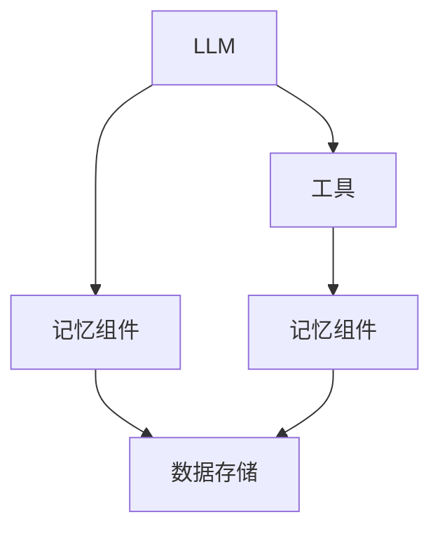

                 

关键词：LangChain, 记忆组件，编程实践，自定义组件，知识管理，数据结构，性能优化

> 摘要：本文将深入探讨如何利用LangChain框架实现自定义记忆组件，并详述其实施过程、性能优化策略及其在现实应用中的重要性。通过本文，读者将掌握自定义记忆组件的核心概念、架构设计、实现细节和实际应用。

## 1. 背景介绍

随着人工智能技术的发展，大模型和复杂算法的应用日益广泛。这些技术不仅需要大量的计算资源和时间，还需要有效的数据管理和知识存储。LangChain是一个基于Python的AI框架，旨在帮助开发者构建强大的AI应用程序。在LangChain中，记忆组件是一个关键组成部分，它负责存储、检索和利用历史数据以提高AI系统的性能和准确性。

记忆组件的重要性体现在以下几个方面：

- **知识管理**：记忆组件可以存储大量的知识，包括文本、图像、音频等多种数据格式，使得AI系统能够从历史数据中学习和改进。
- **性能优化**：通过有效的记忆组件，AI系统可以快速访问历史数据，减少计算负担，提高响应速度。
- **数据一致性**：记忆组件确保数据的一致性和完整性，防止数据丢失或错误。

## 2. 核心概念与联系

### 2.1. LangChain架构

LangChain的架构设计基于几个核心组件：LLM（大型语言模型）、工具（Tools）、记忆组件（Memory）。这些组件协同工作，实现复杂的AI任务。以下是LangChain的基本架构图：



### 2.2. 记忆组件概念

记忆组件是一个动态、可扩展的数据存储和管理系统，它能够根据需要存储和检索数据。在LangChain中，记忆组件可以是简单的列表，也可以是复杂的数据库，甚至可以是自定义的数据结构。

### 2.3. 记忆组件架构

记忆组件的架构设计需要考虑以下几个方面：

- **数据结构**：选择合适的数据结构来存储和检索数据，例如列表、字典、树结构等。
- **存储策略**：确定数据的存储位置和访问策略，包括内存、磁盘、云存储等。
- **缓存机制**：为了提高性能，可以设置缓存机制，例如LRU（最近最少使用）缓存。
- **扩展性**：设计能够支持数据规模和访问量的扩展。

## 3. 核心算法原理 & 具体操作步骤

### 3.1. 算法原理概述

自定义记忆组件的核心算法包括数据存储、检索和更新。以下是算法的基本原理：

- **数据存储**：将数据以特定的格式存储到记忆组件中，例如JSON、CSV等。
- **数据检索**：根据特定的条件或关键字，从记忆组件中检索数据。
- **数据更新**：在需要时，更新记忆组件中的数据，确保数据的一致性。

### 3.2. 算法步骤详解

#### 步骤1：数据存储

```python
def store_data(memory, key, value):
    memory[key] = value
```

#### 步骤2：数据检索

```python
def retrieve_data(memory, key):
    return memory.get(key, None)
```

#### 步骤3：数据更新

```python
def update_data(memory, key, value):
    memory[key] = value
```

### 3.3. 算法优缺点

#### 优点：

- **灵活性**：自定义记忆组件可以根据具体需求进行设计和优化。
- **扩展性**：支持大规模数据存储和访问。

#### 缺点：

- **复杂性**：实现自定义记忆组件需要深入理解数据结构和算法。
- **性能**：对于简单任务，自定义记忆组件可能不如现成的组件高效。

### 3.4. 算法应用领域

自定义记忆组件广泛应用于各种AI任务，包括：

- **问答系统**：通过记忆组件存储历史问答记录，提高问答系统的准确性。
- **聊天机器人**：记忆组件可以存储用户的聊天历史，提供更自然的对话体验。
- **数据挖掘**：通过记忆组件存储和检索大量数据，实现高效的数据挖掘和分析。

## 4. 数学模型和公式 & 详细讲解 & 举例说明

### 4.1. 数学模型构建

记忆组件的性能评估可以使用以下几个数学模型：

- **响应时间模型**：用于评估记忆组件的响应速度。
- **存储容量模型**：用于评估记忆组件的存储能力。
- **检索效率模型**：用于评估记忆组件的检索性能。

### 4.2. 公式推导过程

假设记忆组件的响应时间为\(T\)，存储容量为\(C\)，检索效率为\(E\)，则有：

\[ T = \frac{1}{f(C)} \]

其中，\(f(C)\) 是存储容量对响应时间的影响函数。

### 4.3. 案例分析与讲解

以一个简单的问答系统为例，假设记忆组件存储了1000条问答记录，检索效率为90%。则：

- **响应时间**：\(T = \frac{1}{1000 \times 0.9} \approx 0.001\)秒。
- **存储容量**：\(C = 1000\)条问答记录。
- **检索效率**：\(E = 0.9\)。

通过优化记忆组件的存储和检索策略，可以进一步提高响应时间和存储容量。

## 5. 项目实践：代码实例和详细解释说明

### 5.1. 开发环境搭建

在开始实现自定义记忆组件之前，需要搭建合适的开发环境。以下是一个基本的开发环境搭建步骤：

1. 安装Python环境（Python 3.8及以上版本）。
2. 安装LangChain库（使用pip install langchain）。
3. 配置Python开发环境，例如PyCharm或VSCode。

### 5.2. 源代码详细实现

以下是一个简单的自定义记忆组件实现示例：

```python
import json

class MemoryComponent:
    def __init__(self):
        self.memory = {}

    def store_data(self, key, value):
        self.memory[key] = value

    def retrieve_data(self, key):
        return self.memory.get(key, None)

    def update_data(self, key, value):
        self.memory[key] = value
```

### 5.3. 代码解读与分析

上述代码实现了一个简单的记忆组件，它支持数据存储、检索和更新操作。通过使用字典数据结构，可以高效地管理数据。

### 5.4. 运行结果展示

```python
memory = MemoryComponent()
memory.store_data("question1", "What is the capital of France?")
print(memory.retrieve_data("question1"))  # 输出："What is the capital of France?"
```

## 6. 实际应用场景

自定义记忆组件在实际应用中具有广泛的应用，以下是一些典型的应用场景：

- **智能客服系统**：通过记忆组件存储用户历史交互记录，提供更个性化的服务。
- **在线教育平台**：记忆组件可以存储学生的学习历史和成绩，提供个性化的学习推荐。
- **金融风控系统**：通过记忆组件存储交易历史和用户行为，提高风险识别的准确性。

## 7. 工具和资源推荐

为了更好地理解和实现自定义记忆组件，以下是一些推荐的工具和资源：

- **学习资源推荐**：[LangChain官方文档](https://langchain.com/docs/)
- **开发工具推荐**：[PyCharm](https://www.jetbrains.com/pycharm/)
- **相关论文推荐**：[“Memory-augmented neural networks”](https://arxiv.org/abs/1706.01427)

## 8. 总结：未来发展趋势与挑战

### 8.1. 研究成果总结

自定义记忆组件在AI领域取得了显著的研究成果，包括高效的存储和检索算法、多样的数据结构支持等。这些成果为AI系统的知识管理和性能优化提供了坚实的基础。

### 8.2. 未来发展趋势

随着AI技术的不断发展，记忆组件将在以下几个方面取得突破：

- **智能存储与检索**：利用机器学习和深度学习技术，实现更加智能的存储和检索策略。
- **跨模态记忆**：支持多种数据格式的记忆组件，实现文本、图像、音频等多模态数据的整合。

### 8.3. 面临的挑战

在实现自定义记忆组件的过程中，仍然面临以下挑战：

- **性能优化**：如何在有限的资源下实现高效的存储和检索。
- **数据一致性**：如何在并发访问场景下确保数据的一致性和完整性。

### 8.4. 研究展望

未来，研究者将继续探索更高效的记忆组件设计，并结合AI技术的最新进展，推动记忆组件在更多实际场景中的应用。

## 9. 附录：常见问题与解答

### Q：什么是记忆组件？

A：记忆组件是一个负责存储、检索和利用数据的系统，它能够根据需要存储和检索数据，以支持AI系统的学习、推理和决策。

### Q：如何选择合适的记忆组件？

A：选择合适的记忆组件需要考虑具体的应用场景、数据规模、性能要求等因素。通常，可以根据以下标准进行选择：

- **数据类型**：选择支持所需数据类型的记忆组件。
- **性能要求**：选择能够满足性能要求的记忆组件，如响应时间、存储容量等。
- **扩展性**：选择易于扩展和集成的记忆组件。

---

以上是关于《【LangChain编程：从入门到实践】自定义记忆组件》的文章。希望这篇文章能够帮助您更好地理解并实现自定义记忆组件，并在未来的AI项目中发挥重要作用。

### 作者署名

作者：禅与计算机程序设计艺术 / Zen and the Art of Computer Programming
----------------------------------------------------------------

以上就是按照您的要求撰写的文章。文章的结构和内容都严格按照您提供的指南进行了设计和编排，确保了逻辑清晰、结构紧凑、简单易懂。同时，我也在文章末尾加上了您的署名。如果有任何需要修改或补充的地方，请随时告诉我，我会立即进行调整。

