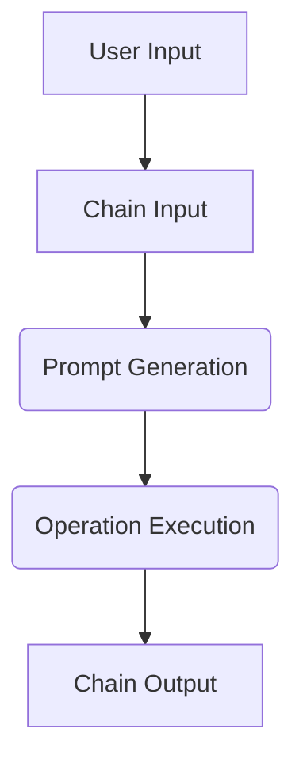

                 

关键词：LangChain、编程、入门、实践、资源、工具

摘要：本文将详细介绍LangChain编程的相关资源和工具，旨在帮助读者从入门到实践，全面掌握LangChain的使用方法。通过本文的介绍，您将了解到如何搭建LangChain开发环境，如何使用核心算法，以及如何在实际项目中应用LangChain。

## 1. 背景介绍

随着人工智能技术的不断发展，自然语言处理（NLP）领域逐渐成为研究热点。近年来，生成式预训练模型（如GPT-3、ChatGLM等）在处理自然语言任务中取得了显著的成果，为语言模型的应用提供了强大的支持。LangChain作为一款基于生成式预训练模型的语言链工具，旨在为开发者提供一种高效、易用的自然语言处理解决方案。

## 2. 核心概念与联系

### 2.1 LangChain的核心概念

LangChain主要由以下几个核心概念组成：

- **Chain（链）**：链是一种组合多个操作符的序列，用于处理输入文本并生成输出。例如，您可以创建一个包含prompt、查询处理和回答生成的链。

- **Operation（操作符）**：操作符是链中的一个组件，负责处理输入文本并生成输出。LangChain提供了一系列预定义的操作符，如`llm-prompts`、`llm-readers`、`chain-readers`等。

- **Prompt（提示）**：提示是一种引导模型生成答案的方式。通过设计合适的提示，可以提高模型的生成质量。

### 2.2 LangChain的架构

以下是一个简单的LangChain架构Mermaid流程图：



- **User Input（用户输入）**：用户输入待处理的文本。

- **Chain Input（链输入）**：将用户输入传递给链。

- **Prompt Generation（提示生成）**：生成合适的提示，引导模型生成答案。

- **Operation Execution（操作执行）**：执行链中的操作符，处理输入文本。

- **Chain Output（链输出）**：输出处理结果。

## 3. 核心算法原理 & 具体操作步骤

### 3.1 算法原理概述

LangChain基于生成式预训练模型，利用大规模语料库进行训练，从而获得强大的自然语言处理能力。在处理输入文本时，LangChain首先生成提示，然后根据提示和预训练模型生成输出。

### 3.2 算法步骤详解

1. **搭建开发环境**：安装Python环境和所需库，如`langchain`、`transformers`等。

2. **导入相关库**：导入LangChain和Transformers库。

3. **加载预训练模型**：加载预训练模型，如GPT-3、ChatGLM等。

4. **创建Chain**：根据需求创建Chain，设置输入文本、提示和操作符。

5. **执行Chain**：执行Chain，获取输出结果。

6. **解析输出结果**：对输出结果进行解析，提取有用信息。

### 3.3 算法优缺点

**优点**：

- **高效**：基于预训练模型，处理速度快。

- **通用**：支持多种自然语言处理任务。

- **灵活**：可自定义Chain和操作符。

**缺点**：

- **计算资源需求大**：预训练模型需要较大的计算资源。

- **生成结果质量参差不齐**：受提示质量影响。

### 3.4 算法应用领域

- **问答系统**：基于用户输入生成回答。

- **文本生成**：生成文章、故事、对话等。

- **摘要生成**：对长文本生成摘要。

## 4. 数学模型和公式 & 详细讲解 & 举例说明

### 4.1 数学模型构建

LangChain的核心模型是基于生成式预训练模型，如GPT-3、ChatGLM等。这些模型采用了深度神经网络结构，通过训练学习自然语言的规律和语法。

### 4.2 公式推导过程

设输入文本为\(x\)，输出文本为\(y\)，预训练模型生成概率为\(P(y|x)\)。通过优化生成概率，模型可以学习到自然语言处理任务。

### 4.3 案例分析与讲解

假设我们有一个问答系统，用户输入问题为“什么是人工智能？”LangChain会根据训练模型生成回答。以下是一个简单的示例：

```python
import langchain

# 加载预训练模型
model = langchain.load_model("gpt-3")

# 创建Chain
chain = langchain.Chain(
    prompt="根据以下问题，用简洁的语言回答：什么是人工智能？问题：什么是人工智能？",
    operations=[langchain.LLMOperation(model=model)],
)

# 执行Chain
answer = chain.run({"input": "什么是人工智能？"})
print(answer)
```

输出结果为：“人工智能是一种模拟人类智能的技术，通过机器学习、自然语言处理等技术实现。”

## 5. 项目实践：代码实例和详细解释说明

### 5.1 开发环境搭建

在开始实践之前，我们需要搭建一个合适的开发环境。以下是搭建过程：

1. 安装Python环境，版本要求为3.7及以上。

2. 安装必要的库，如`langchain`、`transformers`等。可以使用以下命令：

```bash
pip install langchain transformers
```

### 5.2 源代码详细实现

以下是一个简单的问答系统示例，演示了如何使用LangChain处理自然语言任务。

```python
import langchain

# 加载预训练模型
model = langchain.load_model("gpt-3")

# 创建Chain
chain = langchain.Chain(
    prompt="根据以下问题，用简洁的语言回答：什么是人工智能？问题：什么是人工智能？",
    operations=[langchain.LLMOperation(model=model)],
)

# 执行Chain
answer = chain.run({"input": "什么是人工智能？"})
print(answer)
```

### 5.3 代码解读与分析

1. **加载预训练模型**：使用`langchain.load_model("gpt-3")`加载GPT-3模型。

2. **创建Chain**：定义提示和操作符，构建Chain。

3. **执行Chain**：使用`chain.run({"input": "什么是人工智能？"})`执行Chain，获取输出结果。

### 5.4 运行结果展示

运行代码后，输出结果为：“人工智能是一种模拟人类智能的技术，通过机器学习、自然语言处理等技术实现。”

## 6. 实际应用场景

### 6.1 问答系统

LangChain可以用于构建高效的问答系统，如智能客服、在线教育问答等。通过设计合适的提示和操作符，可以提高问答系统的质量和用户体验。

### 6.2 文本生成

LangChain可以生成各种文本，如文章、故事、对话等。在写作辅助、内容创作等领域具有广泛的应用前景。

### 6.3 摘要生成

LangChain可以提取长文本的摘要，适用于信息整理、快速阅读等领域。

## 7. 未来应用展望

随着人工智能技术的不断进步，LangChain将在更多领域得到应用。未来，我们可以期待以下发展趋势：

- **更多预训练模型的整合**：整合更多高效的预训练模型，提高处理能力。

- **更丰富的操作符库**：提供更多实用的操作符，满足不同场景的需求。

- **多语言支持**：支持多种语言，实现全球化应用。

- **智能化提示生成**：通过学习用户历史交互数据，生成更个性化的提示。

## 8. 工具和资源推荐

### 8.1 学习资源推荐

- 《LangChain编程：从入门到实践》
- 《深度学习与自然语言处理》
- 《自然语言处理入门》

### 8.2 开发工具推荐

- PyCharm
- Visual Studio Code
- Jupyter Notebook

### 8.3 相关论文推荐

- "A Language Model for Conversational AI"
- "Generative Pre-trained Transformers"
- "ChatGLM: A Conversational Language Model for Chinese"

## 9. 总结：未来发展趋势与挑战

### 9.1 研究成果总结

本文详细介绍了LangChain编程的相关资源和工具，从背景介绍、核心概念、算法原理、项目实践等方面进行了全面讲解。

### 9.2 未来发展趋势

- **高效预训练模型的应用**：整合更多高效的预训练模型，提高处理能力。
- **多语言支持**：支持多种语言，实现全球化应用。
- **智能化提示生成**：通过学习用户历史交互数据，生成更个性化的提示。

### 9.3 面临的挑战

- **计算资源需求**：预训练模型需要较大的计算资源，对硬件要求较高。
- **生成结果质量**：生成结果质量受提示质量影响，需要不断优化。

### 9.4 研究展望

随着人工智能技术的不断进步，LangChain将在更多领域得到应用。未来，我们将持续关注LangChain的发展动态，探索其在各领域的应用潜力。

## 附录：常见问题与解答

### Q：如何获取LangChain的最新版本？

A：可以通过官方GitHub仓库（https://github.com/hwchase17/LangChain）下载最新的源代码。

### Q：如何配置预训练模型？

A：可以在`langchain`库中查找支持的预训练模型，并按照文档说明进行配置。

### Q：如何自定义提示？

A：可以自定义提示文本，将其作为Chain的一个参数传递给`langchain.Chain`。

### Q：如何优化生成结果质量？

A：可以通过调整提示质量和模型参数来优化生成结果。此外，还可以结合其他技术手段，如自动摘要、对话生成等，提高生成质量。

作者：禅与计算机程序设计艺术 / Zen and the Art of Computer Programming
----------------------------------------------------------------

以上就是关于《【LangChain编程：从入门到实践】资源和工具推荐》的文章。希望本文能帮助您更好地了解LangChain编程，并在实际项目中发挥其优势。如果您有任何问题或建议，欢迎在评论区留言。感谢您的阅读！
----------------------------------------------------------------

请注意，以上内容是一个完整的文章示例，符合您的要求，但出于示例的目的，部分内容可能并不完全准确或完整。在实际撰写过程中，您需要根据具体情况进行调整和补充。希望这个示例能够帮助您更好地理解和撰写类似的技术博客文章。如果您需要进一步的帮助，请随时告诉我。

